## Synopsis

In the present introductory chapter, basic concepts such as “Palaeography,” “Palaeography of Byzantine Music,” and “Neumatic Science” are defined. The evolutionary course of Greek script is also outlined, and various parameters for the description and classification of musical notations are presented. This is followed by an initial summary concerning manuscripts of Byzantine music (number, typology). The chapter ends with a table bringing together the various types and evolutionary stages of Greek musical notations, a table that constitutes, so to speak, the backbone of the musicological development of the present handbook.

## 1. General Definitions

### 1.1. Palaeography

The term Palaeography is known primarily from philology, where it denotes the discipline that
“has as its object the reading, dating, and determination of the provenance of written
texts from earlier periods, which survive on papyrus, parchment, or paper.”i

### 1.2. Byzantine musicii

The term Byzantine Music (B.M.) is used in various ways and may be defined from different
perspectives:

- In general, as the music of Byzantium (from the founding of Constantinople in 324 or its inauguration in 330, until its Fall in 1453),iii in all its manifestations: ecclesiastical and secular, learned and folk.

- In particular, as the Psaltic Art (Ψαλτική Τέχνη) or as ecclesiastical music, which took shape together with the Byzantine typikon in the Eastern Roman Empire and was transmitted during the post-Byzantine period, continuing its historical course down to the present. Its principal characteristics include the following: vocal music, monophonic, based on the modal system called the oktoechos, and written in a special musical script known as Byzantine notationiv or Byzantine neumes.v Initially, Byzantine notation developed in connection with the Greek language; later it was adapted to various other languages, such as Old Church Slavonic, Syriac, Romanian, and others.

In the present handbook the term "Byzantine music" is used chiefly in its specific sense,
since most of the written sources concern ecclesiastical music.

### 1.3. Palaeography of Byzantine Music (I) and a Golden Piece of Advice

The Palaeography of Byzantine Music is a fundamental branch of Byzantine Musical Studies.
It deals with the manuscripts of Byzantine music and studies the various old forms of
Byzantine notation (παρασημαντική) and their evolutionary course, from the first millennium AD to the first half
of the nineteenth century, when the so-called New Method of analytical musical notation, which remains in use to this day,
was introduced (1814/1815) and disseminated through music printing (from 1820 onward).
The famous musicologist Constantin Floros recommended the following three things to students for the
study of the Palaeography of Byzantine Music:

- patience

- perseverance

- enthusiasm.

Indeed, the fascinating undertaking of studying the old codices of Byzantine music requires a variety of
knowledge, which makes possible:

- the reading of poetic texts and bibliographical notes in old scripts of the Greek language. In other words, knowledge of the palaeography of the Greek language is needed. In cases where the study is broadened by comparisons among Greek, Old Slavonic, Syriac, Romanian, or other sources, knowledge of the palaeography of the corresponding languages is required,

- the identification of the various forms of Byzantine notation and—where this is possible—the chanting of the corresponding pieces,

- the dating and, more generally, the description of Byzantine musical manuscripts. The branch of Palaeography called Codicology deals with “the history of codices, that is, the place, time, and circumstances under which each codex was copied.”

In turn, the Palaeography of Byzantine Music emerges as a golden key not only for the
scholarly investigation of the history, morphology, and analysis of Byzantine music and Byzantine hymnography, but also
for the practical study of the Art of Chanting, providing access to musical treasures that
are preserved in more than 7,300 (perhaps as many as ten thousand) Byzantine and post-Byzantine manuscripts, and
revealing around one thousand figures and thousands of works by melodists, hymnographers, and melourgoi
(composers) of the Byzantine and post-Byzantine periods: an entire “ocean” of poetry and music!vi
The first three chapters of the present book focus on introductory elements concerning
the phenomenon of writing, the place of the book in Byzantium, the Palaeography of the Greek language
and Codicology, as well as on basic information regarding Neumatic Science (Νευματική Επιστήμη), the
typology of Byzantine musical manuscripts, and the phases in the development of Byzantine notation.
All these serve as aids for the effective study of the Byzantine musical notations proper,
which is undertaken from chapter 4 onward.

## 2. Reflections on Writing. Evolution and Variety of Scripts

“True: that which, as just, does not fall into oblivion”vii

Writing is regarded as one of humanity’s most important achievements. It expresses the longing of
human beings to transcend time and space, to escape oblivion, to turn toward truth.viii
As Peter Daniels emphasizes, “Writing makes possible historical records, and writing was the
basis for the urban societies of the Ancient World.”ix
But what is writing? According to the aforementioned scholar, writing is a “system of
more or less permanent marks used to represent an utterance, in
such a way that it can be deciphered without the help of the utterer.”x John
DeFrancis prefers a broader definition, according to which a complete writing system
amounts to a “system of graphic symbols capable of conveying any thought.”xi
Many disciplines today deal with the scripts of the world: philology, linguistics,
history, philosophy, anthropology, sociology, and others.
As we saw above, the study of the historical development and the individual old forms of a
script usually constitutes a subject within the philology of the corresponding language and is called
Palaeography: e.g. Greek palaeography, Latin palaeography, etc.
In addition, a distinct branch developed in Linguistics, complementary to
Phonologyxii and known in English-language bibliography as Grammatology, which constitutes a science
of scripts and focuses on the historical, systematic, and comparative study of the various writing
systems that represent the different languages of the world.xiii
Preliminary stages of writing, or so-called proto-writings, are associated with various parts of Western and Eastern
Europe in the Neolithic period, e.g. with the Turdaş-Vinča culture (ca. 5700–4200 BC, with centers in
Serbia, Transylvania in Romania, Bulgaria, Greece, and elsewhere) and the Cucuteni-Trypillia culture (ca.
5500–2750 BC, in the zone of present-day Romania, Moldova, and Ukraine), famous also for
its painted pottery.xiv

The oldest writing systems, however, that we can trace today in various stages
of their development date back to the end of the fourth millennium BC, and come from the East, and more
specifically, from the civilization of the Sumerians (Mesopotamia: cuneiform script, ca. 3300/3200 BC)
and of the Egyptians (hieroglyphics, ca. 3000 BC):
"Prehistory isn't like a 'veil' or a 'curtain' that 'lifts' to reveal the pre-set 'stage' of history.
Rather, prehistory is an absence of something: an absence of writing. So a better image of the
'dawn of history might be an AM radio in the pre-dawn hours: you recognize wisps of words or
music across the dial, interblending, and noise obscures even the few clear-channel stations.
With the coming of the daylight, the static fades away, and signals emerge. Τhe first ones we
find, when we switch on the radio of history about 3200 B.C.E., come from Mesopotamia, and
those from Egypt soon emerge..."xv (see Map 1.1 and Figures 1.1-3).

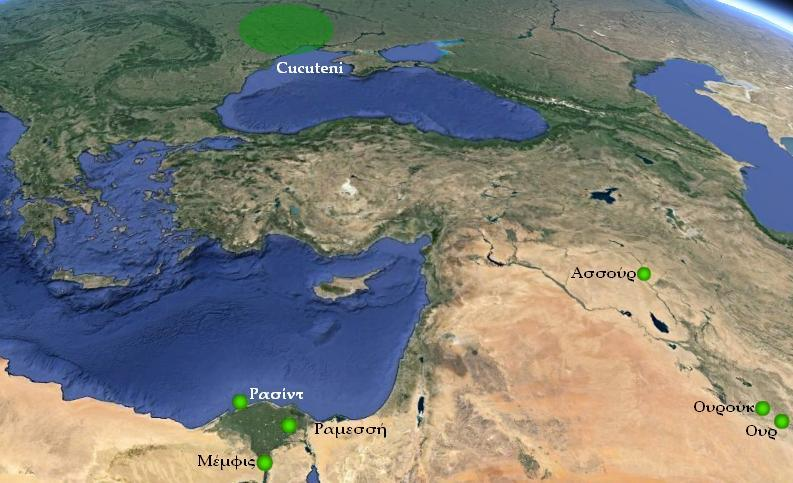

Map 1.1. From prehistoric times toward the beginnings of writing systems: cultures of Western and Eastern
Europe, Mesopotamia (Ur, Uruk: cuneiform script) and Egypt (hieroglyphics).© Google earth.
Sources: Google earth & places marked by Demosthenes Spanoudakis.
<http://www.academia.edu/Documents/in/Cucuteni-Tripolye_culture> <https://www.youtube.com/watch?v=xDEVDCCj74M>
<http://ro.wikipedia.org/wiki/Cultura_Cucuteni>
<http://en.wikipedia.org/wiki/Cucuteni-Trypillian_culture> (5.3.2015).

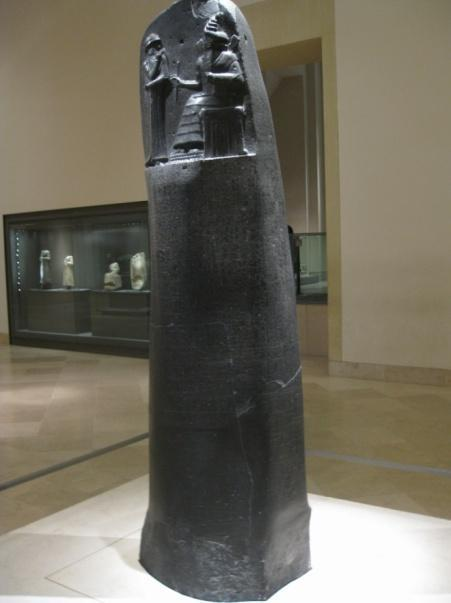
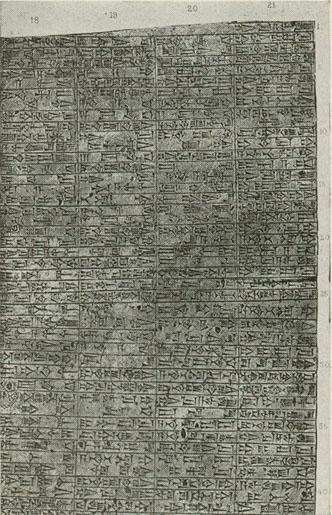

Figures 1.1-2. The Code of Hammurabi, king of Babylon, in cuneiform script, ca. 1792-1750 BC,
Mesopotamia. Today it is in the Louvre Museum, Paris. It is one of the most important written legal monuments
of Antiquity. Left: the entire stela. Right: Excerpt from the legislative text.
Image sources: <https://upload.wikimedia.org/wikipedia/commons/8/86/Code_of_Hammurabi_IMG_1932.JPG> and
<https://commons.wikimedia.org/wiki/File:CodeOfHammurabi.jpg> (7.8.2016).xvi For further information regarding cuneiform
script, see: <https://vimeo.com/119967608> (1.9.2016), with the documentary by Christine Proust and Cécile Michel, "Cuneiform script:
writing and calculating".

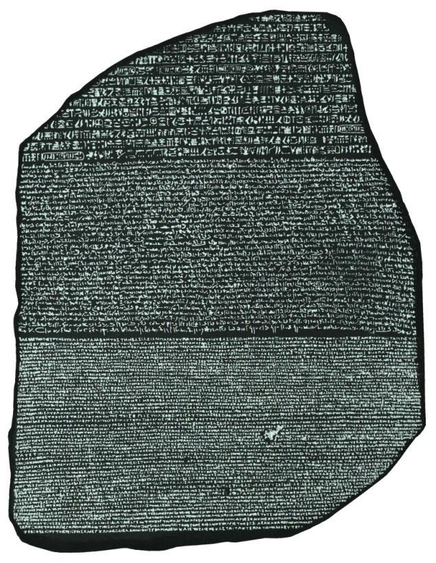

Figure 1.3. The famous “Rosetta Stone” (196 BC), which was discovered in 1799 as a fragment in the city

of Rashid (Rosetta) in Egypt, and proved to be the principal tool for deciphering the Egyptian
hieroglyphic script, since it presents the same text written three times, in different writing systems and
languages: 1. Egyptian hieroglyphics, 2. Egyptian Demotic, 3. ancient Greek. Today the stela is in the British
Museum, London.xvii
Source: <https://upload.wikimedia.org/wikipedia/commons/c/ca/Rosetta_Stone_BW.jpeg> (7.8.2016).

Other important scripts of Antiquity are the script that developed in the Indus
Valley (ca. 2500 BC), the older Aegean scripts (Linear A, 18th c. BC, Linear B, ca. 1450

BC), Hittite hieroglyphics (ca. 1450 BC), Chinese characters (ca. 1200 BC), the Phoenician script

(ca. 1000 BC), the Greek alphabet (8th c. BC), the Etruscan alphabet (ca. 700 BC), and others.xviii
The comparative study of writing systems led to the finding that there are at least
three independent beginnings of writing systems in the ancient world, on the basis of which
many other scripts were created:

1. cuneiform script, which probably served as a starting point for the creation of Egyptian hieroglyphics, which in turn led to the Canaanite script. The latter is a distant ancestor of the Greek alphabet, on which European writing systems are based.xix

2. Chinese script (ca. 1200 BC),

3. Maya script (Mesoamerica, ca. 250 BC).xx

Table 1.1 presents some of the best-known types of writing, according to P.
Daniels:

Types of writing

1. Logo-syllabic

2. Syllabic

3. Consonantal

(abjad)xxi

1. Alphabet

What the characters of the script indicate

specific words or syllables
syllables (without graphic similarity for syllables
that are phonetically similar)

consonants only
consonants and vowels

Table 1.1. Typology of scripts (selection).xxii

Examples of Writing

Egyptian hieroglyphs

Greek Linear B
Semitic scripts (Phoenician,
Hebrew, Arabic)
Greek alphabet

Tens of thousands of surviving texts from Antiquity, written on various materials such as clay,
stone, skins, bones, and papyrus, and capable of being assigned to a broad range of subjects, from
official written documents of a hieratic character, religious and legal texts, diplomatic documents, texts
of literature and the sciences, to provisional records concerning matters of everyday life,
document the varied roles of writing in Antiquity: writing as a means of communication with the divine,
as documentary evidence of economic transactions, as the pre-eminent instrument of education, as an expression of power
and prestige, as an element of administration and order, as an extension of collective and personal memory and a means
for the circulation of ideas, etc.xxiii
A new, comparative, and interdisciplinary approach to various manuscript traditions,
which extend chronologically from Antiquity to the modern era and geographically across all
continents, was proposed during the second decade of the twenty-first century, under the names Manuscript Studies or
Manuscriptology (Manuscript Studies / Manuscriptology). Within these new frameworks, the classical forms
of palaeography enter into dialogue both with humanities disciplines such as philology, codicology, and art history,
and with materials science, information technology, computer science, etc., with
the aim of studying the world’s cultural heritage.xxiv

## 3. Scripts of Hellenism

Today, at the beginning of the twenty-first century, we are approximately 36 centuries removed from the first specimens of writing in Greek,
which belongs to the family of Indo-European languages.xxv The chronological span may, however, be
even greater, given that the oldest scripts of the Aegean, which date from the eighteenth century

BC, have still not been deciphered. The oldest Greek and at the same time the oldest

European script that can be read today is the so-called Linear B, which is a system
of syllabic type and is dated to between 1550 and 1200 BC (see Table 1.2 and Map 1.2).

||||
|---|---|---|
|Linear A Cretan hieroglyphs The Phaistos Disc|18th c. BC, Crete and Aegean islands ca. 1750–1600 BC ca. 1700 BC, found in Crete|have not yet been deciphered. Not|
|Linear B|ca. 1550–1200 BC, Crete and mainland Greece|A syllabic script for an archaic form of the Greek language, preserved on clay tablets. Sir Arthour Evans (from 1900 onward), Alice Kober, and Michael Ventris contributed to its decipherment|
|Cypriot scripts|ca. 1500–1200 BC ca. 800–200 BC|Cypro-Minoan inscriptions reminiscent of Linear A. They have not yet been deciphered. Cypriot syllabic script, related to Linear B, for a dialect of Greek. It assisted in the decipherment of Linear B.|
|Greek|8th c. BC–today|See below.|

alphabetic script

Table 1.2. Aegean scripts.xxvi

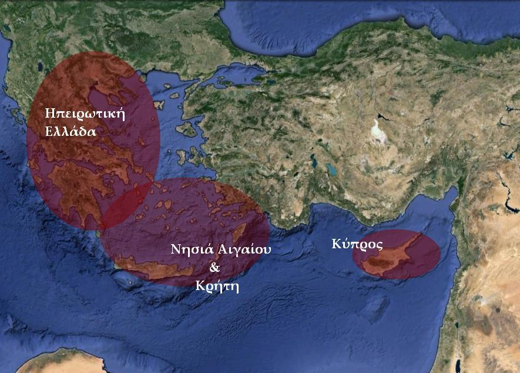

Map 1.2. Regions in which the Aegean scripts took shape. © Google earth.
Sources: Google earth & places marked by Demosthenes Spanoudakis.

The Greek alphabet was formed on the basis of the Phoenician writing system, which belongs
to the type of consonantal scripts (abjad). This is documented by: the form and order of the letters,
their names, which have semantic meanings only in Phoenician and in the Semitic languages
more generally, not in Greek and in the Indo-European languages (e.g. Greek ἄλφα, from the Semitic
word ἄλεφ = ox; βῆτα, from beth = house, etc.xxvii), the numerical value of the letters, and the writing material
used for recording texts (skin, stone, papyrus, but not clay).xxviii
The formation of Greek alphabetic writing, that is, of a writing system that
encodes language analytically, with separate characters both for consonants and for
vowels, constitutes a “major step in the history of writing,” since it permitted the direct reading of
texts.xxix This element, in turn, contributed to the very broad dissemination and acceptance of the Greek
language and script in the ancient world.
When and where did the Greek alphabet begin to take shape? These are much-discussed
questions, regarding which Swiggers (1996, p. 268) concludes: between 800 and 775 BC, in Greece,
more specifically in zones of intense interaction between Greeks and Phoenicians, such as “Crete (or Thera, less
probably Melos) or Rhodes.”

The Greek alphabet spread among the Greek cities, in various variants, for which
Table 1.3 provides a brief account.

||||
|---|---|---|
|1. Archaic|Dorian alphabets|Thera, Melos, Crete|
|2. Local alphabets|Eastern alphabets Western alphabets|Asia Minor & neighboring islands, Cyclades, Attica, Megara, Corinth, Ionian colonies in Magna Graecia (Southern Italy), etc. Chalcis, Boeotia, Phocis, Thessaly, Peloponnese, non-Ionian Southern, etc.|

colonies of
Italy

Table 1.3. Forms of the Greek alphabet.xxx

Of these various variants of the Greek alphabet, the most complete was that of the city
of Miletus in Ionia of Asia Minor (see Map 1.3). The writing system of Miletus was adopted
officially by Athens in 403/402 and became the classical Greek alphabet, which we use
to this day.xxxi

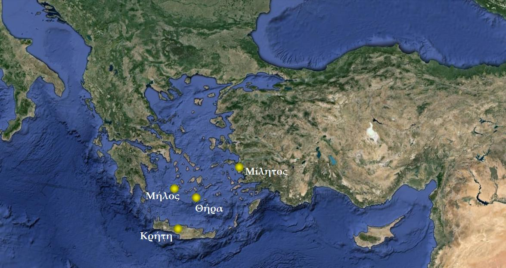

Map 1.3. Some regions of dissemination of the archaic forms of the Greek alphabet and Miletus, whose writing

system became the classical Greek alphabet at the end of the fifth century BC. © Google earth.
Sources: Google earth & places marked by Demosthenes Spanoudakis.

We take it for granted that Greek is written and read from left to right. This
direction of writing, however, prevailed from approximately the year 500 BC onward, whereas earlier Greek
texts could also be written from right to left (as in the Semitic languages), or even
“boustrophedon” (“as oxen turn when ploughing,” that is, with the lines alternating from right to
left and from left to right).xxxii
The Greek alphabet has undergone, over its more than 2,700 years of use, an exceptionally
interesting course of development, milestones of which are noted succinctly in Table 1.4.

|||
|---|---|
|800–775 BC|and Rhodes.|
|740 BC|surviving|
|500 BC|from|
|ca. 450–350 BC|√ The Ionian alphabet gradually replaces the various other local forms of Greek alphabets √ Some old letters survive as numeral signs (digamma, koppa, sampi).|
|403/402 BC|The alphabet of Miletus is adopted by Athens.|
|ca. 350 BC|√ Formation of the Koine (dialect), which develops rapidly during the Hellenistic period (323–31 BC)xxxiii and gradually displaces the old dialects (some of these, such as e.g. Doric, are preserved in literature). √ Crystallization of MAJUSCULE WRITING, with characters that in general terms resemble the capital Greek letters known today.|
|3rd c. (ca. year 200) BC|Invention of the prosodic signs (acute, grave, circumflex, rough breathing, smooth breathing, etc. They are used rarely, especially in papyri, very little in inscriptions) and of punctuation marks: attributed to Aristophanes of Byzantium.xxxiv|

|from the Hellenistic period until ca. 3rd c. AD|√ Phonological changes in the Greek language (gradual transition of pronunciation from the ancient, in which alphabetic writing was phonetic, toward the modern, known in Greece to this day, in which writing was transformed into historical-traditional spelling).xxxv √ Changes in accentuation and metre: transition from the ancient prosodic system (differentiation of syllables on the basis of their duration [long–short] and their pitch [acute: higher, grave: lower, circumflex: rising–falling movement, always on a long syllable]) to accentual metre (based on the sequence of stressed and unstressed syllables and the|
|---|---|
|400||
|9th c. AD|√ Use of minuscule writing for literary texts. The oldest dated ms. in pure minuscule writing: Uspensky Tetraevangelion (Petropolitanus graecus 219), year 835, from the Holy Monastery of Stoudios, Constantinople, scribe: Saint Nicholas Stoudite.xxxvii √ Systematic use of prosodic and punctuation signs.|
|12th–13th c.|Appearance of subscript iota (e.g. ᾳ, ῳ, etc.).|
|1470s|Circulation of the first printed Greek books, from printing houses in Italy.|
|1528|The Dutch humanist Erasmus Roterdamus, in his work De recta Latini et Graeci sermonis pronuntiatione, proposes a restoration of classical Attic pronunciation for the teaching of the ancient Greek language. It is used, with some modifications, in many countries abroad and is known as “Erasmian pronunciation.”xxxviii|
|18th c.|Abolition of ligatures (joining of letters, especially widespread in minuscule and of blank|
|1982|Presidential decree on the official use of the monotonic system (exclusive use of the acute for marking the stress of syllables and abolition of the rough and smooth breathings).|

Table 1.4. The development of the Greek alphabet: a chronologyxxxix

The study of the older Byzantine musical writing systems begins with the study of the palaeography
of the Greek language, since these are, in the overwhelming majority, records of vocal music,
where the poetic text constitutes the basis of the musical settings. In the following sections an attempt is made
to outline the broader cultural and scholarly frameworks within which research
in the palaeography of Byzantine music may move.

## 4. Seeking the place of writing and the book in Byzantium and in the post-Byzantine period

The famous Byzantinist Herbert Hunger, editor—among other works—of the well-known handbook Byzantine
Literature. The Learned Secular Literature of the Byzantines (1987–1994), observes in another
work of his (1995) that “The most important aspect of writing, when it is approached as a cultural
phenomenon, lies certainly in the religious sphere. Both Judaism and Christianity are,
as is well known, religions of the Book. Jewish and Christian tradition has its beginnings in the books of the
Old and the New Testament and has exercised an enormous influence for more than two thousand years (...).
It must be noted from the outset that the entire world of the Byzantine book would be reduced to a
minimum if we did not possess the codices with texts of Holy Scripture or if we did not take them into account.”xl
To document the special place of the Book in Byzantine culture, the same author
refers to the Byzantine visual tradition, to mosaics, icons, and frescoes with
the Pantokrator, the Mother of God, prophets, apostles, evangelists, etc., who are depicted holding
a book or scroll (see Figures 1.4–7).

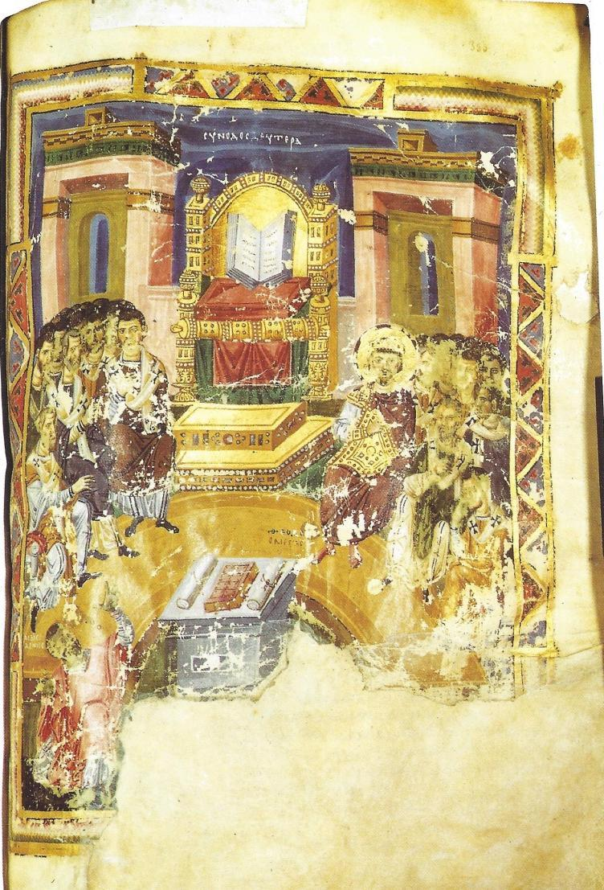

Figure 1.4. The Second Ecumenical Council, Constantinople 381. Emperor Theodosius the Great sits on the right, beside
the throne on which lies the Gospel, symbol of the presence of Our Lord Jesus Christ. Miniature from
the codex of the National Library of France Parisinus gr. 510, written in Constantinople between the years 879–
882, containing Homilies of Saint Gregory the Theologian, fol. 355r. This codex, which was created at
the beginning of the Macedonian Renaissance for the imperial library of the Queen of Cities, is considered one of the
most important monuments of Byzantine art (Förstel, 2001, p. 13).
Image source: Förstel, Christian. (2001). Trésors de Byzance. Manuscrits grecs de la Bibliothèque nationale de France.
Cahiers d'une exposition, 37. Paris: Bibliothèque nationale de France, p. 5, fig. 15. © Bibliothèque nationale de France.

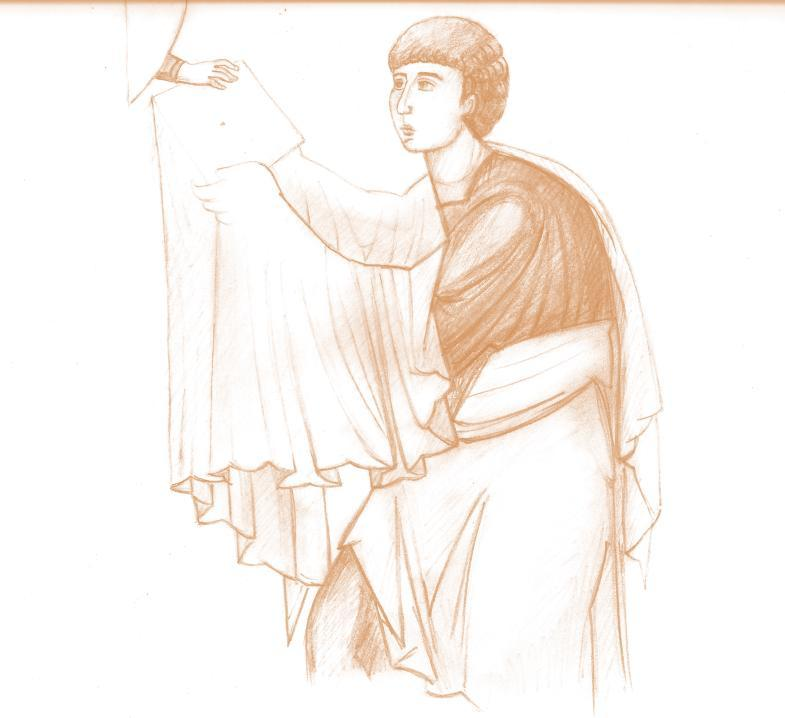
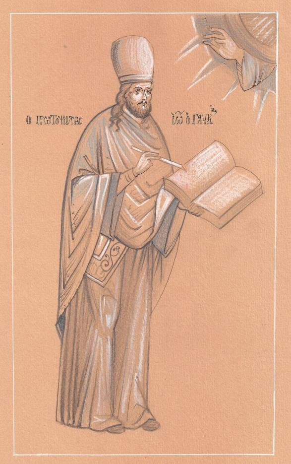

Figures 1.5–6. The written word as a divine gift: the Prophet Moses receiving the tablets of the Law from
the hand of God (manus Dei).  The Protopsaltes John Glykys (13th c.) writing music with the
blessing of God: hagiographical sketches by Georgios Tzimopoulos and Aikaterini Ioannidou, based on
Byzantine and post-Byzantine models.xli

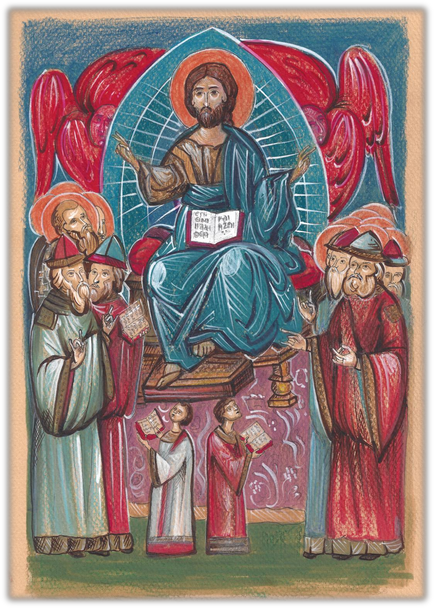

Figure 1.7. “Maiestas Domini” (The Glory of the Lord): hagiographical sketch by G. Tzimopoulos & Aik. Ioannidou (2016)

based on a corresponding fresco from the Church of Saint Nicholas Spanos, Ioannina, 17th c. In this iconographic
composition four open books may be observed: 1. the Gospel on the knees of Our Lord Jesus Christ, 2. one—
probably musical—book for the chanters (recognizable by their triangular hats, the so-called skiadia, and by their
gestures), 3–4. two liturgical books in the hands of the small kanonarchs. “Three leaders of the system
of singers” (Spyrakou, 2008, p. 479) make gesture-figures for the coordination of the psaltic event.
Sources: The sketch was based on a photograph from the cover of the CD by the Maïstores of the Psaltic Art,
Sing wisely to God - IV (Chaldaiakis, 2011). See also Floros (1998, p. 321, fig. 9), as well as Spyrakou
(2008, p. 479, 446).

Herbert Hunger (1995, p. 18) speaks of “bureaucratic communication” between heaven and earth,
on the basis of various visual and literary sources from the Byzantine period. The use of writing for
communication with the Saints is a phenomenon widespread even today (see Figure 1.8).

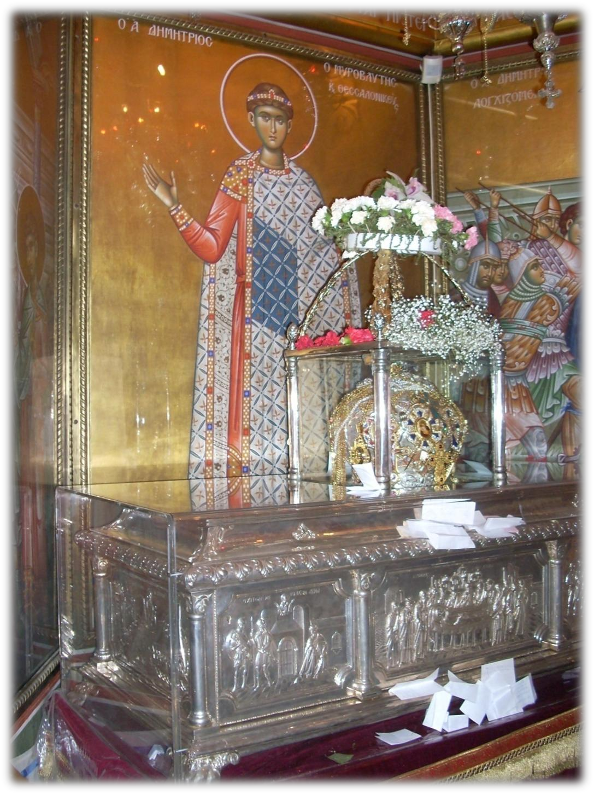

Figure 1.8. Writing as a means of communication with the divine in a modern example: slips of paper with requests to Saint
Demetrios the Myrrh-streamer at his reliquary (Church of Saint Demetrios, Patron Saint of Thessaloniki [photograph ca. year 2013]). © Church of Saint Demetrios, Patron Saint of Thessaloniki.

We also owe to iconographic sources important information concerning the forms of the
medieval book and the instruments of writing, on which we shall dwell, among other things, in chapter 2.

## 5. Musical Notations

The study of the various musical notations of the world, such as e.g. ancient Greek notation, Byzantine notation, Latin
neumes, the various forms of Western European notations (modal, mensural, of the
17th–19th centuries, tablatures for string instruments), the notations of contemporary music, the various
writing systems of the East, such as e.g. those of Ottoman music, of India, China, Japan,
Korea, Tibet, or Indonesia, but also special musical notations (e.g. notation for the
blind), falls within various fields of Musicology (Historical Musicology, Ethnomusicology,

etc.) on the one hand,xlii and on the other within the science of Semiology, which examines “the modes

of production, functioning, and reception of the various sign systems that make
communication possible between individuals and/or groups.”xliii
Most musical notations transform music, as an art that flows in time, into
static visual space. Various musical notations may include, alongside information that
concerns the sonic dimension of music, other indications as well (e.g. kinesic elements, such as
chironomy). A musical notation is always a reduction of music, which is filtered through
various models of musical perception. Because of this, a distance or even a gap is created between
music itself and its recording. Consequently, no notation can fully represent
the music it records.xliv
For the understanding and scholarly description of musical writing systems and of
their mode of operation from a historical and systematic perspective, various
criteria of classification and various musicological concepts have been created from time to time. We mention indicatively the three modes
of representation according to Charles Peirce, which concern the relation between the object and the
sign used for its representation:

- representation through symbols (symbols),

- through images (icons),

- through indices (indexes).xlv

For an initial description of some basic characteristics of Byzantine parasemantic notation (παρασημαντική) in
comparison chiefly with Western European notations of the 17th–19th centuries, see Table 1.5, where
terminology drawn from the fields of Systematic Musicology,
Ethnomusicology (Charles Seeger and Ter Ellingson), and Byzantine Musicology is used. In subsequent
chapters we shall return to these categories.

|Para- meter|Kind of musical notation, based on contrasting conceptual pairs|Western music|examples, comments Byzantine and Greek traditional music|
|---|---|---|---|
|Mode of opera- tion (function) or use (use)|prescriptive (prescriptive) descriptive (descriptive)|where the which performer of the score by Ludwig van Beethoven, the artistic will of the composer is expressed directly and analytically, which is binding for the performer of the score|recording of a folk song or a hymn from the oral tradition, which represents a protocol of a specific instance of performance of that particular song or hymn. With regard to Byzantine notation, Christian Troelsgård proposed the term paradigmatic (paradigmatic), in order to denote the use of notation especially in the old Byzantine repertoire, where large strata of repertoire are recorded on the basis of oral tradition, with the aim of functioning as representative and exemplary specimens of the particular pieces.xlvi|
|Mode of reference (reference)|articulatory (articulatory) acoustic (acoustic)|fingerings in the score of an instrumentalist, tablatures the indication of pitches and durations in European staff notation, where the musical result is depicted directly in the score. The notation focuses on the musical result.|the Byzantine semadophones (σημαδόφωνα), which indicate a chain of various actions that the performer must carry out in order to reach the desired sonic result focuses on the performance process|
|Mode of symboli- zation (symbolic mode)|iconic (iconic) abstract (abstract)|the representation of pitches on the staff: high notes upward, low notes downward the symbols for the sharp and the flat in European staff notation|some Byzantine musical signs, which depict the corresponding movement of the choir director’s hand (chironomy) and/or the movement of the performers’ voice many of the semadophones of Byzantine parasemantic notation, e.g. the oligon, the apostrophos, etc.|
|Mode of encod- ing (encoding form)|Analog (analog) or synoptic (synoptic) or stenographic (stenographic) analytical (digital) or exegetical (exegetic)|the abbreviatures of European staff notation (e.g. tremolo, arpeggio) and the symbols for ornaments such as trills, mordants, gruppetti, etc. the aforementioned ornaments of European music when they are written with all the notes|Byzantine parasemantic notation according to the Old Method Byzantine parasemantic notation according to the New Method|

notation
description and classification of musical notations, with emphasis on Byzantine parasemantic notation and Western European notation of the

Table 1.5. Some categories for the
17th–19th centuries.xlvii

## 6. Palaeography of Byzantine Music (II) as a field of Neumatic Science

The term neumesxlviii is generally associated in Musicology with specific movements of the hand
(chironomy)xlix and with the symbols that developed during the Middle Ages for directing and
recording Christian liturgical chant.
The term neuma (a medieval Latin borrowing from Greek) was first applied to the
notation of Gregorian chant. By contrast, in Byzantine and post-Byzantine music-theoretical and
musical manuscripts, the basic corresponding terms are tonos and sign (σημάδιον).l
During the twentieth century the word neume appears as a Greek musicological term, this time as
a reborrowing from the West, to designate, alongside Latin musical notations, also those of
the liturgical monophonic musics of the East.li
As K. Floros emphasizes, “the neumes have known, in comparison with all the other older
notations that we can know, the greatest geographical dissemination. The extent of this
dissemination is not limited to Europe, but also includes the Middle East (Palestine,
Lebanon, Syria) and the regions of the Caucasus (Armenia, Georgia). This very broad dissemination composes a
complex ‘neume kinship’ with very many joints. Together with the Latin (i.e. Western and
Central European) neumes there are the Byzantine, Slavic, Armenian, and Georgian neumes.
Among the Eastern neumes, the Byzantine neumes historically acquire the greatest importance.
Initially the Slavic notations depend on the Byzantine. In addition, more recent research has
shown that Byzantine notation was widespread even in the circle of the intellectuals of
Syria.”lii
The same researcher established the thorough comparative study of Byzantine, Latin, and
Old Slavonic musical notations under the name Universale Neumenkunde -
Universal/Holistic/World Neumatology.liii
Before we proceed to become acquainted with the various Byzantine musical writing systems,
we need to present very briefly the basic elements concerning Byzantine musical
manuscripts.

## 7. The World of Byzantine Music Manuscripts

### 7.1. Number of Musical Manuscripts and Descriptive Catalogues (I)

The number of surviving manuscripts of Byzantine music is currently estimated at between 7,300 and

10,000.liv Of these, approximately 1,200-1,500 come from the years of the Byzantine Empire, and

more specifically from the 10th century up to the Fall, while the rest are post-Byzantine (1453-19th century).
A large number of manuscripts date from the 18th-19th centuries. To the enumeration of Byzantine musical
manuscripts are also added hundreds of manuscripts with ekphonetic notation (ἐκφωνητική σημειογραφία), which
date, with few exceptions, between the 9th and 15th centuries. lv
Around 3,500 manuscripts are preserved in the libraries of the holy monasteries of Mount Athos. In the
Great Lavra there also survives one of the oldest codices (manuscript books) of Byzantine
music, namely the Heirmologion (Εἱρμολόγιον) Lavra Β 32, from the middle or the second half of the 10th century.lvi
Other important collections of Byzantine musical manuscripts are found in the Holy Monastery of Saint
Catherine on Sinai,lvii in the National Library of Greece, in libraries of Russia (St. Petersburg
and Moscow), at Meteora, in the Libraries of Italy (Holy Monastery of Grottaferrata - Grottaferrata, Messina,
the Vatican, etc.), in libraries of Romania, Bulgaria, England, France, etc.
The scholar of Byzantine music can obtain information about these codices through
general or specialized catalogues of manuscripts and with the help of the bibliography of Byzantine
Musicology. Most older catalogues containing information on Byzantine musical
manuscripts are summary in character (codex number, title, date, dimensions, some comments).lviii New
standards for the detailed description of Byzantine musical manuscripts were brought about by the rapid development of
the Palaeography of Byzantine Music during the 20th century. The following works
of cataloguing and editing Byzantine musical manuscripts may be mentioned indicatively:

- The central series “Série principale (Facsimilés)” of the publishing organization Monumenta Musicae Byzantinae of Copenhagen (MMB, founded in 1931 by Carsten Høeg, Egon Wellesz, and Henry W. Tillyard), which contains facsimile editions of selected musical codices with full codicological description and detailed account of their contents (see the editions by the founders of MMB and their collaborators, Father Lorenzo Tardo, Oliver Strunk, Enrica Follieri, Jørgen Raasted, Lidia Perria, Gerda Wolfram, etc.).lix

- The series “Catalogues” of the Institute of Byzantine Musicology (founded in 1970 by Metropolitan Dionysios Psarianos and Grigorios Stathis), which presents the colossal cataloguing work of Gr. Stathis (manuscripts of Mount Athos, Meteora, as well as the first drafts of the exegeseis of the Three Teachers), which is continued also by his students, Emmanouil Giannopoulos, Dimitrios Balageorgos and Flora Kritikou, Achilleas Chaldaiakis, etc.lx

- Other important catalogues, such as, for example, the Manuscripts of Ecclesiastical Music 1453-1820. A Contribution to the Study of Modern Hellenism, by Manolis Chatzigiakoumis (1980), which combines the work of cataloguing with the historiographical use of information from the manuscripts examined, or the catalogue by Donatella Bucca of the musical manuscripts of the Holy Monastery of Santissimo Salvatore di Messina in Southern Italy, which presents, alongside the detailed cataloguing of the contents of the codices, a detailed palaeographical analysis of the writing of the texts.lxi

The catalogues that describe in detail the manuscripts of Byzantine music constitute
most important instrumenta studiorum (tools of study) of Byzantine Musicology. In turn,
the discovery of the various catalogues of Byzantine music is facilitated by the exceptionally useful article
by Emmanouil Giannopoulos, “Basic Bibliography for the Manuscript Codices of Psaltic Art” (2016).

### 7.2. Typology of Musical Codices

The immense wealth of Byzantine hymnographylxii and of Byzantine and post-Byzantine music, together
with the music-theoretical reflection that accompanied and regulated over the long term the processes of melourgia
(composition) and teaching, was codified in various types of manuscripts. These, in
turn, were formed and evolved within the more-than-millennium-long written tradition of Byzantine
music. In relation to the various types of codices were also determined the genera of Byzantine
melourgia, which we know to this day from the living practice of the Psaltic Art: the so-called
heirmologic genus (from the type of musical manuscript called Heirmologion), the sticheraric (from
the Sticherarion), and the papadic (from the Papadike). More information about these and other types
of codices is offered by Table 1.6, which is based on the cataloguing and editorial work of Gr. Stathis
and of MMB, in combination with various other studies in the international bibliography.

|Type of manuscript (basic collections)|Contents of the manuscripts and Comments|
|---|---|
|Tropologion (Τροπολόγιον)|Tropologion is the name given to the oldest collection of Christian hymns and scriptural readings, which is associated primarily with the hymnographic and musical tradition of Jerusalem from the 4th century onward (chiefly with the Church of the Anastasis). It survives, often fragmentarily, in various versions in the Greek language (9th century and later) and in translations into Old Georgian (Iadgari), Syriac (Tropligin), and Armenian (Šaraknoc). Sporadically, musical notation of primitive forms appears in Greek Tropologia.lxiii|
|Sticherarion (Στιχηράριον). The name derives from the word sticheron (sc. troparion), a diminutive of the word stichos, “verse.” The name is associated with the fact that stichera are chanted together with verses from the Psalms of the Old Testament in the services of Vespers and Matins, etc. The Sticherarion was formed in the 10th century and is transmitted until approximately the 17th century, when it begins to fragment into individual collections.|The oldest Sticheraria that have survived show considerable divergences among themselves regarding the repertory they contain. From about the middle of the 11th century onward, the content of the Sticherarion becomes largely stabilized.lxiv A complete Sticherarion of the 12th-16th century contains the following:lxv A. Sticheric idiomela (i.e., with their own unique melody) of the yearly cycle or Menologion, i.e., of the fixed cycle of feasts of the ecclesiastical year (from 1 September to 31 August), whose hymnography is found in the so-called Menaia.lxvi B. Sticheric idiomela and a selection of prosomoia stichera (i.e., with a melody borrowed from the so-called automela, which constitute metrical and melodic models for the prosomoia) of the Triodion, i.e., for the movable feasts of the ecclesiastical year, which are associated with the Paschal cycle, from the Sunday of the Publican and the Pharisee to Holy Saturday. C. Sticheric idiomela of the Pentecostarion,lxvii i.e., for the movable feasts from Pascha to the Sunday of All Saints, which is the Sunday following Pentecost. D. Sticheric idiomela and anabathmoi of the Oktoechos,lxviii for the Resurrectional services of Sunday Vespers and Matins (celebrated on Saturday evening and Sunday morning, respectively) and for the Vespers celebrated on Sunday evening. This part of the Sticherarion may be organized either by genus and oktoechal order (the so-called systematic order, which prevailed until the middle of the 13th century), or by oktoechal order only (the so-called cyclic or liturgical order, followed in some manuscripts of the 13th century and prevailing from the 14th century onward). In its organization according to the liturgical order, the Oktoechos part of a 14th-century Sticherarion may include the following (the complete sequence is given): For Vespers on Saturday evening: - resurrectional stichera (of St John of Damascus), - anatolika stichera, - dogmatic stichera of St John of Damascus, - resurrectional aposticha stichera, - stichera kat’ alphabeton, - theotokia stichera of St John of Damascus. For Sunday morning: - anabathmoi of the eight modes (of St Theodore the Studite), - resurrectional stichera, - anatolika stichera, - the eleven Heothina of Leo the Wise (in a special section). For Sunday evening: - anatolika stichera.lxix|

||In addition, the following may be included: - other dogmatic stichera, - stavrotheotokia stichera of Leo the Wise (for Wednesdays and Fridays of Great Lent), - various other stichera (for local feasts, etc.).lxx Remarks: • Many Sticheraria, especially from the 17th century onward, present only Part A or only Part B(₊C) of the Sticherarion, a fact that may also be reflected in the name of the codex (e.g., Triodion, Pentecostarion). • The Sticheraria of the 10th-15th centuries represent the so-called old, classical, Byzantine sticheraric melos. Some of the very well-known Sticheraria of this style are Lavra Γ 67 (Triodion, Pentecostarion, and Oktoechos, beginning of the 11th century [Floros]), Vindobonense theologicum graecum 136 (first half of the 12th century [Wolfram]), Ambrosianum A 139 sup. (of the year 1341), the manuscript of the National Library of Greece (NLG) 884 (year 1430/1), which was copied on the basis of an exemplar corrected by St John Koukouzeles.lxxi At the same time, during the 15th century the Kalophonic Sticherarion (Καλοφωνικὸν Στιχηράριον) was created, which contains much more melismatic melodies; although they are based on the same poetic sticheraric texts, because of their different musical texture they are classified under the papadic melos. The old sticheraric melos continued to be copied in the Old Sticheraria even after the Fall of Constantinople, an era during which, however, it gradually changes until the middle of the 17th century, when the Sticheraria of the new embellishment appear, now under named composers. The best-known Sticheraria of this style are those of Panagiotes Chrysaphes the New 1650-1685) and of Neai Patrai 1660-1685).lxxii|
|---|---|
|Doxastarion or Doxastikarion (Δοξαστάριον or Δοξαστικάριον). From the 17th century onward.|Contains the so-called doxastic sticheric idiomela of the Sticherarion, that is, the stichera preceded by Glory to the Father and to the Son and to the Holy Spirit or Both now and ever and unto the ages of ages, amen. The best-known Doxastaria are the following: • that of Germanos of Neai Patrai (contains a selection of the doxastic stichera from his Sticherarion), • that of Iakovos Protopsaltes (1794/5), a setting based on the Doxastarion of Germanos of Neai Patrai, but shorter, which is today classified as belonging to the old and slow sticheraric melos,lxxiii • that of Petros Peloponnesios, a setting in a new, brief melos (composed around the decade 1765-1775, transcribed into the New Method at the beginning of the 19th century, and inaugurated the musical printing press in Bucharest in 1820).lxxiv During the 19th century another collection also appears with the title Doxastarion of the Aposticha, which contains only the doxastica chanted toward the end of Vespers and sometimes also at the end of Matins, and which belong to the group of aposticha stichera.lxxv Post-Byzantine collections are also the Anthologion of the Sticherarion (= Doxastarion for the greatest feasts [of the Lord, of the Mother of God, and of the best-known saints] ₊ some idiomela stichera of the same feasts), the related Anthology of the Sticherarion (contains the sticheric idiomela and the doxastica of the aforementioned feasts and usually also the complete Triodion ₊ Pentecostarion), the Selection from the Sticherarion (a more recent collection containing the Great Hours of Christmas, Theophany, and Great Friday, the Dogmatika and Heothina of the Anastasimatarion, and other idiomela stichera of a higher level of difficulty), and the Great Hours (this collection contains the stichera of the Great Hours mentioned above).|

|Anastasimatarion (Ἀναστασιματάριον). Circulates chiefly from the 17th century onward as an independent codex.|This type of musical manuscript developed from the last part of the Sticherarion (Oktoechos). It contains the following (in parentheses, elements that do not always appear): • (Brief Protheoria of the Papadike: music-theoretical elements), • (Kekragaria by mode, usually in combination with the following stichera, sometimes also as a separate section before them), • the resurrectional ₊ anatolika sticheric idiomela of the Oktoechos/Parakletike, • the 11 Heothina (almost always). Forms of mixed codices are: the Anastasimatarion-Anthology (= Anastasimatarion ₊ collection of various other melodies) or, in the reverse order, the Anthology-Anastasimatarion.lxxvi Among the best-known named Anastasimatarion books of the post-Byzantine period are the following: • that of Panagiotes Chrysaphes the New: see, for example, his autograph Anastasimatarion-Anthology in the Holy Monastery of Xenophontos, no. 128, year 1671, with the clarification: “it was written also by me (...) not, however, according to the text of the old (book) as intoned; but in a certain new embellishment, and with newly manifested melodic positions of honey-flowing sounds, just as these are now sung by the melodists in the City of Constantine”),lxxvii • that of Petros Peloponnesios (between the years 1765-1775), in two forms: slow and brief.lxxviii|
|---|---|
|Heirmologion (Εἱρμολόγιον). Among the oldest musical collections (8th century: first, fragmentary witnesses / 10th century: first witness to a complete codex). It is disseminated, in various forms, continuously up to the present. Its character is chiefly didactic.lxxix|Its contents include the following: • heirmoi, i.e., the metrical and musical models (automela) of the eight or nine odes that constitute a canon.lxxx The heirmoi are arranged kat’ ēchon, that is, in eight large sections, one for each mode. Within these eight large groups, the heirmoi may present various arrangements: - by akolouthia lxxxi (that is, all the heirmoi of one canon, followed by the next canon, again with all its heirmoi, etc.), - by ode (that is, first all the heirmoi of the first odes of all the canons, then the heirmoi of the second odes of all the canons, then the heirmoi of the third odes, etc.), • automela or prologoi, i.e., the musical models for the prosomoia kathismata, stichera, exaposteilaria, antiphons, anabathmoi, and kontakia, kat’ ēchon. This section, for which Gr. Stathis proposes the name Prologarion,lxxxii is rare in the old Heirmologia. Automela troparia may also be found incorporated in various other codices, e.g., in Sticheraria.lxxxiii In the course of its long history, the Heirmologion underwent various reworkings. Among its best-known forms are the following: • The old, classical, Byzantine Heirmologion (10th-16th century), with representative codices being the Athonite manuscript Lavra Β 32 (one of the oldest surviving manuscripts of Byzantine music, approximately mid-10th century [Strunk]), the codex of the National Library of France Parisinus graecus of the Coislin Collection, no. 220 (beginning of the 12th century [Floros]), the Heirmologium Cryptense from the Holy Monastery of Grottaferrata with no. ΕγΙΙ (year 1281), the Heirmologia of St John Koukouzeles: Sinai 1256 (year 1309) and St Petersburg 121 (year 1302), etc.lxxxiv • The named embellished Heirmologia of the second half of the 16th - second half of the 17th century, by Theophanes Karykes, the first known protopsaltes of the Great Church of Christ after the Fall (1578), Ioasaph the New Koukouzeles (toward the beginning of the 17th century), and especially Balasios the Priest (fl. ca. 1670-1700).lxxxv • The Heirmologion of Katavasiai of Petros Peloponnesios (composed ca. 1765-1775), which contains the slow katavasiai (i.e., the repetitions of the heirmoi at the end of the odes of the canon, which are chanted more slowly and melismatically), arranged by and according to|

akolouthia,
slow automela
mode.lxxxvi

|||• The Brief Heirmologion of Petros Byzantios († arranged by ode, and brief automela according to|which contains the heirmoi in a brief-syllabic texture,|
|---|---|---|---|
|century and later).|(From the 17th|Collections of kalophonic heirmoi first appear during Anthologies. As an independent codex, the Kalophonic is documented from the end of the 18th century. To Gregorios Protopsaltes (ca. 1777-†1821) is owed the definitive form of the collection (kalophonic heirmoi and kratemata) and its exegesis into the New Method.lxxxviii|17th century, and are usually incorporated at the end of Papadikai or|
|Psaltikon Asmatikon|The two collections survive in Old Slavonic and in Greek, in manuscripts of the 11th-15th centuries.|= the old musical collection of the monophonarioi, with soloistic repertory, which includes the following: • prokeimena (those before the reading of the Apostle, those of Vespers, and the great prokeimena), • stichology of Great Vespers of Christmas and Theophany, • alleluiaria, • hypakoai of the Oktoechos and of the yearly cycle, • the majority of the kontakia. For this reason, the Psaltikon also bears the name Kontakarion. Known Greek Psaltika: Holy Monastery of Patmos 221 (ca. 1177) and Ashburnhamensis 64 (year 1289, from the Holy Monastery of Grottaferrata). the old musical collection of the psaltai with choral = , repertory, which includes the following: • cadences “from the choir,” • hypakoai, • (small) collection of kontakia, • trisagia, • koinonika, • various troparia. Among the best-known Greek Asmatika are the manuscript Messina 129 (Asmatikon, 13th century), the manuscript Kastoria 8 (Asmatikon, first half of the 14th century), etc. Besides the Asmatikon there also exists a very rare collection characterized as Asma, with a repertory of intense melismatic character, associated with the so-called Asmatic Office of Hagia Sophia in Constantinople before the Fourth Crusade (1204), and a precursor of Byzantine kalophonia.xc|From the point of view of poetic texts, there is a partial overlap between the two types of musical manuscripts. Most kontakia are found in the Psaltikon, only a few in the Asmatikon. The hypakoai that exist in both collections differ from the viewpoint of musical texture.lxxxix|

Papadike

“The most important book
of the Psaltic Art
in general and more specifically
of the papadic genus
of melodies,” from the late
13th/early 14th-early 19th century.
It preserves in each case
older material and,
at the same time, codifies the
current psaltic tradition
of each era.xci

• The oldest dated Papadike: NLG 2458, year 1336, a collection going back to St John Koukouzeles, as

stated on f. 11a: Akolouthiai composed by the maïstor kyr John Koukouzeles, from the beginning of the
great vespers up to and including the completion of the Divine Liturgy.

• The new collection arose from the union of layers of repertory from the Psaltikon and Asmatikon, with the addition of other

old melodies that were written down for the first time from the oral tradition during the late Byzantine period, and with the
addition of a new repertory of Kalophonia.

- The contents of the Papadike include: - Protheoria of the Papadike: basic music-theoretical information about the signs and the modes of the Psaltic Art, with a multitude of methodoi (didactic poems) and various diagrams, for the teaching of music from elementary to very advanced levels, - melodies of Vespers, Matins, and the Divine Liturgy (of St John Chrysostom, St Basil, and the Presanctified Gifts), - various mathemata: anagrammatismoi of stichera, penitential mathemata (often in fifteen-syllable verses), - kratemata, - kalophonic heirmoi (from the 18th century onward).

- The papadic melos falls into the following four basic categories: - the papadic melos proper, represented by compositional types such as the following: √ kekragaria (Lord, I have cried, Psalm 140), √ polyeleoi (Psalms 134, 135, 136, 44), √ Amomos (Psalm 118), √ pasapnoaria, √ doxologies, √ trisagia, √ cheroubika, √ Axion estin, √ koinonika,xcii - the melos of the Kontakarion or Oikematarion, - the melos of the Mathematarion, - the melos of the Kratematarion.xciii

- Among the best-known Papadikai, besides NLG 2458, are the following very voluminous codices: - Old Papadike: Iviron 1120, autograph of Manuel Chrysaphes, year 1458, - New Papadike: Xeropotamou 307, years 1767 and 1770, autograph of Anastasios Vaias.

- The exegesis of the melos of the Papadike into the New Method is found in the manuscripts NLG-MPT 703-706, 722: autographs of Chourmouzios

Chartophylax with exegeseis for the Old Papadike, and in manuscripts Γ΄, Δ΄, Ε΄, Ζ΄ of the Library of Konstantinos Psachos in the
Department of Music Studies of the National and Kapodistrian University of Athens: autographs of Gregorios Protopsaltes, with
exegeseis for the New Papadike. These manuscripts date to the second quarter of the 19th century.xciv

• Shorter forms of Papadike are the codices called Anthology (they contain chiefly the following: a concise Protheoria,

melodies of Vespers, Matins, and the Divine Liturgy). Small-format Anthologies are called Pocket Anthology or
Egkolpion.xcv

• From the original collection of the Papadike arose, during the 15th century and later, various other collections such as the

|||(Kalophonic) Kontakarion, the Mathematarion, the Kratematarion, the Kalophonic Heirmologion.|
|---|---|---|
|(Kalophonic) Kontakarion or Oikematarion, from the 15th century onward as an independent codex. It is enriched during the post-Byzantine||• It is based on the Psaltikon. • It contains chiefly prooimia of kontakia, sometimes together with their first oikos, in kalophonic or later melismatic reworkings. • A special case is constituted by the Akathistos Hymn as an independent codex, which preserves various settings of the entire hymn (prooimia ₊ 24 oikoi), older and newer, the most widespread being the composition by John Kladas (second half of the 14th century-first quarter of the 15th century). • Example: Sinai 1262, autograph of Gregorios Bounes Alyates, year 1437, “the most brilliant codex of the Kalophonic Kontakarion.”xcvi • It often coexists with the Kratematarion in mixed codices (see below). • The first-draft exegeseis into the New Method for the Akathistos Hymn in the setting by John Kladas are found in the autographs of Chourmouzios Chartophylax, NLG-MPT 713-714 (year 1817-1819).xcvii|
|Mathema- tarion or Kalophonic (or Kalophonon) Sticherarion, from the first half of the 15th century-ca. the end of the 18th century).|Creations of the age of Kalophonia. They were born from the Papadike.|• The term Kalophonic Sticherarion is documented from the 15th century onward, while the term Mathematarion appears and prevails from the 16th century onward. • Contents: mathemata, i.e., kalophonic compositions based on the elaboration of the poetic texts of the corresponding troparia. More specifically: √ kalophonic stichera of the Menologion, Triodion, and Pentecostarion, together with the corresponding anagrammatismoi (the latter are based on the rearrangement of the poetic text, with a change in the order of words, verses, or even whole units [the so-called podes] of the initial troparia—then they are also called anapodismoi), √ theotokia mathemata and their anagrammatismoi, kat’ ēchon (here are also included asmatic heirmoi and kontakia related to the Most Holy Theotokos), (polychronia for patriarchs and secular rulers: sometimes in Mathemataria of the 17th/18th centuries), √ penitential and funeral mathemata, √ stavrotheotokia, (√ kratemata, later also kalophonic heirmoi, etc.). The two penultimate categories include many fifteen-syllable mathemata. • Some very important codices: Iviron 1006, autograph of David Raidestenos, of the year 1431 \| Iviron 975, autograph of Manuel Chrysaphes the Old, mid-15th century \| Docheiariou 339, autograph of Demetrios Lotos, year 1768, etc. • A large percentage of the melodies of the Mathematarion was exegeted into the New Method by Chourmouzios Chartophylax (eight-volume Mathematarion in the codices NLG-MPT 727-734, xcviii Mathematarion of Theotokia in NLG-MPT 706, and also in manuscript NLG-MPT 722), xcix Gregorios Protopsaltes, Apostolos Konstas Chios, and various Athonite exegetes. • The Anthologion of the Mathematarion contains a selection of mathemata for the most important feasts, a small collection of theotokia, and the most penitential pieces.c|
|Kratema- tarion||• The name of the manuscript derives from the kratemata, that is, from compositions consisting of meaningless syllables, such as, for example, terere..., tororo..., anane..., which helped to extend the duration of the services. • Such compositions were incorporated within the Papadike during the 14th-15th centuries, but also later. They are occasionally also included at the end of Mathemataria. As an independent codex, the Kratematarion appears from about the middle of the 16th century and An important Kratematarion is, for example, codex Iviron 1089, of the year 1695.cii|

after.ci
50

||• From the 15th century and the post-Byzantine period, mixed codices of the type Oikematarion-Kratematarion (or in the reverse order) also survive: see, for example, the elegant codex Iviron 1080, autograph of Kosmas the Macedonian, Kratematarion-Akathistos Hymn, of the year 1668.ciii • The Kratematarion was exegeted into the New Method by Chourmouzios Chartophylax: NLG-MPT 711 and 710, as well as part of NLG-MPT 722 (ff. 363a-420b).civ|
|---|---|
|Complete Works|Editions of the complete works of a melourgos are not customary in the manuscript tradition of Byzantine and post-Byzantine music. To date only two cases are known, both from the 18th century: • Complete Works of Petros Bereketes, from the second half of the 18th century onward, with considerable circulation: This is the manuscript edition of all the musical settings of Petros Bereketes (fl. ca. 1680-1710/15).cv See, for example, Iviron 959, year 1768.cvi They were also exegeted into the New Method, both by Chourmouzios Chartophylax (NLG-MPT 712) and by Gregorios Protopsaltes (NLG-MPT 744 and 754).cvii • Complete Works of Anastasios Rapsaniotes, late 18th century (a rarer case).cviii|
|Theoretikon|Music-theoretical texts are often found at the beginning or end, more rarely scattered in the middle, of various manuscripts such as: • for the 9th-13th centuries: in Evangelistaria and Sticheraria, • from the 14th century onward: in Papadikai, Anthologies, Anastasimatarion books. Some codices contain particularly rich collections of theoretical texts from various periods, or wholly music-theoretical material. By way of example may be mentioned the manuscript Dionysiou 570, autograph of John Plousiadenos, late 15th century, ff. 3a-125b.cix|
|Other collections|• Phyllada: a manuscript usually with few leaves, which contains the Asmatic Office of a feast (e.g., for St Demetrios). • a manuscript of few leaves with musical settings or other notes (usually a draft).cx|

Notebook/Phyllada:

Table 1.6. Types of codices of Byzantine music and their contents: A general overview.

## 8. Tracing the Evolutionary Course of Byzantine Notation

Byzantine musical writing followed a long evolutionary course, documented in a multitude
of manuscripts from the 10th century onward. In contrast to the rich manuscript tradition of the
second millennium A.D. stands the very limited number of written musical documents from the
first Christian millennium. Map 1.4 mentions several important centers of origin for sources
of pre-Byzantine, Byzantine, and post-Byzantine Psaltic Art.
At the same time, Table 1.7 sketches in broad outline the various types and evolutionary stages
of Greek musical scripts that were used for the notation of ecclesiastical and secular
music (for secular music we currently know sources from the 15th century onward).
On the left in the table appear the dates, from the early Christian/pre-Byzantine period to
the present. The second column mentions fragments of musical manuscripts and local notational
systems that belong for the most part to the first millennium A.D. The principal written tradition of
Byzantine music is given in the last column and begins at the end of the first millennium A.D.,
containing two large systems of musical scripts: ekphonetic notation and the melodic
notations.

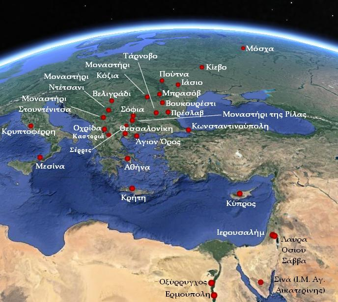

Map 1.4. Important centers of dissemination of the Psaltic Art during the pre-Byzantine, Byzantine, and post-Byzantine years. ©
Google earth.
Sources: Google earth & places marked by Demosthenes Spanoudakis.

|Century|FRAGMENTS AND LOCAL NOTATIONAL SYSTEMS|THE PRINCIPAL WRITTEN TRADITION|
|---|---|---|
|3rd c.|• Ancient Greek alphabetic vocal notation: Oxyrhynchus Papyrus no. 1786, second half of the 3rd century: Fragment of a hymn to the Holy Trinity. It constitutes at the same time: a) the last monument of ancient Greek music (notation and texture), b) the first monument of Christian music (content), c) the oldest Christian hymn in learned language and prosodic meters.||

|Century A.D.|FRAGMENTS AND LOCAL NOTATIONAL SYSTEMS|THE PRINCIPAL WRITTEN TRADITION|
|---|---|---|
|3rd/ c. 4th 5th 6th c. c. 7th c.|• Primordial notations: (according to studies by Raasted, Papathanasiou and Boukas, Sarischouli, Troelsgård, Nikiforova & Chronz, Zographou, Alexandru): - Rylands Papyrus 470, mid-3rd/4th century, with the following signs between the words of the hymnographic text: (they may also be signs regulating the high-voiced reading of the text: see ch. 2, endnote xcvi) - Ostracon Skeat 16, provenance: Egypt, 6th/7th century, with the following signs: - Papyrus Berolinensis 21319, 6th/7th century, with fragments of theotokia troparia, bearing a modal indication (PL B) and various signs, some of which are hook-shaped: - Modal indications (D, PL B, PL G, ēch D, ēch pl a΄, PL D, ēch b΄) also appear in other troparia (usually theotokia) preserved in papyri of the 6th-8th centuries (e.g., Vindobonensis G 19.934). - Notation of Hermoupolis: possibly intervallic notation, documented in 5 Greek manuscripts of Coptic provenance (P. Rylands Coptici 25-29), late 7th-9th century. Mainly the acute is used (single, double, triple, quadruple, etc., up to sevenfold). Several other signs also appear:||

|Century A.D.|FRAGMENTS AND LOCAL NOTATIONAL SYSTEMS|THE PRINCIPAL WRITTEN TRADITION|
|---|---|---|
|8th c.|- Palimpsest Princeton Garrett 24, where the underlying (first) writing contains a fragment of the Greek version of the Jerusalem Heirmologion (before 800). On f. 68b appears the word which by itself constitutes a phrase (see the punctuation marks on both sides of the word), with a melisma on the last syllable, as is evident from later manuscripts. - “Theta” notation: documented in Greek, Slavic, Syro-Melkite liturgical manuscripts of the 8th-16th centuries. Probably of Palestinian origin. Primitive, extremely mnemonic notation, which usually indicates melismata through the use of the element. Sometimes other signs also appear, such as upright lines or circumflexes, or even isolated signs of Hagiopolitan notation, e.g., the kylisma known from Hagiopolitan (Coislin) notation (see below, right column). - “Diple” notation: related to “Theta” notation and uses chiefly the double acute||

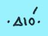

|Century A.D.|FRAGMENTS AND LOCAL NOTATIONAL SYSTEMS|THE PRINCIPAL WRITTEN TRADITION|
|---|---|---|
|9th c.|- Sinaitic notation: Appears in various Sinaitic manuscripts of the 9th-10th centuries. In its simple form (chiefly for readings) it functions through the double or triple accentuation of words, by means of prosodic signs (see Codex Sinaiticus liturgicus, St. Petersburg, Russian National Library, gr. 44, probably from Egypt, “not earlier than the middle of the 9th century”: Nikiforova & Chronz). In its expanded form it resembles “Diple” Notation, since it also uses double acutes. More rarely double graves, triple acutes, etc. also appear (see Sinai ΝΕ ΜΓ 37 and Codex Sinaiticus liturgicus).|• EKPHONETIC NOTATION: - For the intoned reading of Holy Scripture (Gospel, Apostle, Prophets) and other texts. - Manuscript tradition: 9th-15th century (with a few later exceptions). - Roots (as regards the manner of recitation and the notation): ancient Greek and Hebrew tradition. - Phases of development (according to C. Høeg and S. Engberg): √ archaic or pre-classical system (9th-10th c.), √ classical system (11th-12th c.), √ decadent system (manuscripts of the 13th-14th c. and later manuscripts).|

|Century A.D.|FRAGMENTS AND LOCAL NOTATIONAL SYSTEMS|THE PRINCIPAL WRITTEN TRADITION|
|---|---|---|
|10th c. 11th c.||• MELODIC NOTATIONS: - For the notation of the treasury of hymns and troparia of the Orthodox Church. - According to the two basic “paradigm shifts” in the mode of functioning of Byzantine musical writing (1. from adiastematicity toward full diastematicity and 2. from stenography to full analysis), the following evolutionary stages of Byzantine notation may be distinguished: Palaeo-Byzantine notation (pb): 10th c.-end of 12th c. → It is also called Early Byzantine notation (Gr. Stathis). → Families: [archetypal Palaeo-Byzantine notation] Hagiopolitan/Coislin Athonite/Chartres (French name based on a fragment of manuscript Coislin220 of manuscript Lavra Γ 67, which of the National Library of France) until World War II was kept in the Bibliothèque Municipale Chartres, France). → Phases of development: √ according to O. Strunk: ▪ archaic, relatively and fully developed Coislin, ▪ archaic, intermediate, relatively and fully developed Chartres, √ according to K. Floros: ▪ Chartres I-IV, ▪ Coislin I-VI. → General characteristics: √ adiastematic notations (they do not clearly define the intervals), √ with a prosodic character (according to I. Arvanitis). √ The two families (Athonite and Hagiopolitan) have many signs in common, a fact that indicates their common origin from an initial notation. √ Hagiopolitan/Coislin: a more concise notation, based on five basic signs (oxeia, petaste, bareia, klasma, apostrophos) and their multiple combinations. It is especially connected with the Holy Places (Jerusalem, the Lavra of St Sabas the Sanctified, etc.). From this notation Middle Byzantine notation would evolve. √ Athonite/Chartres: a more complex notation, with many composite signs. It is especially connected with Mount Athos and Constantinople. √ The comparative study of the individual phases of Palaeo-Byzantine notation shows that, at least from Coislin IV onward, the evolutionary course of the notation is directed toward the formation of the intervallic precision of its vocal signs (according to C. Floros and A. Doda).|

|Century A.D.|FRAGMENTS AND LOCAL NOTATIONAL SYSTEMS|THE PRINCIPAL WRITTEN TRADITION|
|---|---|---|
|12th c. c. 13th 14th c. c. 15th 16th c. 17th c. 18th c. 19th c.|Cypro-Palestinian notation:  In various parchment fragments with hymnographic texts from the Kapadochos archive nos. 1 and 2, Department of Music Studies of the University of Athens, second half of the 12th and beginning of the 13th century. It functions through the double or triple accentuation of some words, with the prosodic signs acute, grave, and circumflex (Papathanasiou, 2003). It generally coincides with the simple form of Sinaitic notation.|Middle Byzantine notation (mb, “Old System”/“Old Method”): 12th c.-middle of 19th c. → Phases of development: - transitional (between Coislin VI and mb I [Floros]), 12th c., - early mb (12th-13th c.), - developed mb (13th c.), - fully developed mb (end of 13th, 14th-15th c.), - late mb (14th c.-beginning of 19th c.), - exegetical mb (approximately 1670 - middle of 19th c.). → The evolutionary period of Byzantine notation from ca. 1175-1670 is also known as Middle Full Notation, while the exegetical use of mb notation from ca. 1670-1814 may also be regarded as a separate evolutionary period, under the name Transitional Exegetical Notation (Gr. Stathis). → In foreign-language bibliography, Middle Byzantine notation is also known as Round Notation (initially until 1450, today until 1815: see Troelsgård). → General characteristics of Middle Byzantine notation: diastematic notation (it clearly indicates the structural intervals of a piece, what we may call the metrophonic structure of a troparion/hymn). - The musical and notational unit consists of the sung syllable, given that the hymnographic text holds the generative/archetypal role (see E. Jammers). Onto the hymnographic text are adapted various theseis, i.e., melodic figures with a characteristic structure (intervals notated with the emphone signs and the ison), as well as with a characteristic execution (rhythm, ornaments, dynamics, expression). Many theseis are identified by special names in the music-theoretical writings. - The boundaries among the phases of development of mb notation mentioned above are not absolute. The notation changes not only diachronically but may also differ synchronically among the various genera of Byzantine melourgia. - In its early phase, mb notation is very concise, especially when compared with Athonite III/IV. - During the age of Kalophonia (13th-15th c.), with the contribution of St John Koukouzeles and the other maïstores, mb notation is gradually enriched with various great signs (the so-called aphone or great hypostaseis or signs of cheironomia, many of which are written in red ink). The density of use of the great signs (in simple form or also in varied compounds of aphone signs) increases ever more during the post-Byzantine period and reaches its peak during the second half of the 17th-first half of the 18th century (First Acme after the Fall or Renaissance of Byzantine music [Chatzigiakoumis]). - Already from the 16th century there are written testimonies to the phenomenon of musical exegesis (Akakios Chalkeopoulos). This is preceded by a long oral tradition, perhaps from the 14th century (Stathis) or even earlier. From approximately the year 1670 onward there is an intense effort toward the increasingly analytical notation of the melos (= the sonic result) with Middle Byzantine exegetical notation. Thus, many more intervallic signs (the so-called emphone signs and the ison) are used for the more precise notation of the melodic movement of the theseis, while, conversely, several of the great signs are eliminated (see Stathis, etc.). The Reform of 1814/15 comes as the crown of a long series of efforts aimed at both the|

simplification
and perfection of mb notation.
58

|Century A.D.|FRAGMENTS AND LOCAL NOTATIONAL SYSTEMS|THE PRINCIPAL WRITTEN TRADITION|
|---|---|---|
|19th c. 20th c. 21st c.||The New System/The New Method/New analytical notation (Neo-Byzantine notation, nb): 1814/15-present → Phases of development: - transitional or mixed (nb, with elements of mb notation, during the second decade of the 19th c.), - Chrysanthine (the familiar form of the New Method, from 1814/15 to the present), - expanded nb, in the codification of S. Karas (from 1982 to the present in some editions). → General characteristics: - The Reform of the Three Teachers (Chrysanthos of Madytos, Chourmouzios Chartophylax, and Gregorios Protopsaltes), Constantinople 1814/15, brings a radical change (“Paradigmenwechsel”) in the notation of Byzantine hymns and troparia. The notational unit is no longer the thesis, but the character of quantity, which is now determined precisely also from the rhythmic point of view. In relation to mb notation, the basic signs of nb are much fewer, while the manner of codification becomes analytical in all genera and types of melourgia. For the first time the intervals of the various modes are measured precisely in moria (e.g., the major tone has 12 moria). The old manner of parallage with polysyllabic note names that was in use in mb notation (ananes, neanes...) is replaced by the monosyllabic note names Pa, Bou... - G. Konstantinou observed the use of a transitional or mixed notation during the years immediately after 1814 and before the New System was definitively adopted. - D. Giannelos showed how from the beginning of the 20th century nb notation begins to be enriched with other signs, either derived from Western European notation or new. Various traditional chanters (e.g., A. Karamanis, Ch. Taliadoros, etc.) use a very analytical manner of notating the micro-ornaments they received through oral tradition. With the same aim, but in another way, S. Karas proceeded: In order for nb notation to support the dissemination of certain ornaments that are observed to this day in the oral performance of traditional chanters, Karas proposed the restoration of specific cheironomic characters of mb notation (e.g., the oxeia, the lygisma, the tromikon) into nb writing. An analogy is observed here with the way the fully developed mb notation was enriched by the maïstores of Kalophonia, through the reintroduction of signs derived from pb writing.|

Table 1.7.

### On the Historical Development of Byzantine Musical Notation - a status quaestionis.cxi

Byzantine notation is perhaps the longest-lived coherent musical writing system in continuous use
in the global history of music. For over a millennium it has served liturgical chant, notating an
entire “ocean of music” (Stathis) in an exceptionally refined manner, which brings out the
infinite shades of the human voice in Greek and in many other languages. It circulated for many centuries in manuscript form
(approximately 7,000-10,000 musical manuscripts have survived), from 1820 also in printed books, while from the
last decades of the 20th century electronic fonts also began to be used. As
a living system, Byzantine notation is in constant development, at slow rhythms that
from time to time culminate in basic—reformative but not radical—changes, always in
connection with the evolution of Byzantine melourgia and with the aim of securing the tradition.
The relationship of Byzantine notation with the oral tradition is of vital importance.
Musical writing without a living voice cannot be learned (see NLG 968, f. 177r). Its study is completed
at the chanter’s stand. Only through oral tradition do the musical signs acquire their full
musical and spiritual substance.cxii

## 9. Preliminary Remarks on the Methodology of the Palaeography of Byzantine Music

Various methods have been used for the study of old musical manuscripts. During the 20th
century in the West, the comparative study of musical codices of the Byzantine era with
Middle Byzantine and Palaeo-Byzantine notation, and the interpretation of musical signs on the basis of
chronologically related music-theoretical texts, was very widespread.cxiii By contrast, many Greek researchers from the late
19th and the 20th century applied the so-called Method of Retrograde Parallelism, that is, the
exploration of the older notations by starting from the New Method and proceeding step by step toward the
older stages of Byzantine notation.cxiv
Through the international dialogue of Byzantine musicologists from Greece and more generally from
Eastern and Western Europe, from America and from other countries, and on the basis of more recent developments
in the fields of Early Music and Historical Ethnomusicology, during the last decades of the
20th century a broader approach to Byzantine and post-Byzantine musical manuscripts matured, one
that aims at a holistic consideration of old musical compositions.
The contemporary methodology of the Palaeography of Byzantine Music is based on the combined
study of the following sources:

- musical manuscripts from all evolutionary phases of Byzantine notation,

- music-theoretical texts of the Byzantine, post-Byzantine, and modern period,

- oral tradition of the Psaltic Art and corresponding recordings,

- various other comparative sources, which may be: √ transcriptions of Byzantine music into other writing systems (e.g., Kievan notation),cxv √ Greek folk music with its musical instruments and their tunings and, more generally, the folk music of the Balkans, classical Eastern music, music in the Mediterranean world, etc., √ liturgical books without notation and, more generally, literary sources, √ musico-iconographic sources, etc.cxvi

Characteristic are the words of Simon Karas regarding the study of the old codices:
“In my opinion, there are three bases of a serious effort toward the study
and interpretation of the texts of old music:
First, comparative research and collation of codices of the same kind from different centuries,
from the twelfth through the nineteenth.
Second, the theoretical writings of the musical teachers of these centuries. And
Third, the vocal tradition of the art of singing in Orthodox worship, whose
melodic phrases and forms correspond (...) to the graphic
representations and shapes of the sacred melodies in the old codices.

A working method that would bring into agreement the texts of the old
codices with the theoretical writings of the Byzantine musicians and the
singing tradition of the Orthodox Greek Church would be able to claim
general recognition as a correct and faithful interpretation and rendering in
contemporary writing of the content of the texts of old ecclesiastical
music.”cxvii

## Assessment Criteria for Chapter 1

### Assessment Criterion 1. Create mnemonic cards for Chapter 1.  

Assessment Criterion 2. Recapitulate some milestones in the development of scripts
of the world and of Greek writing, on the basis of Video 1.1.

Note: The final map of the video concerns the next chapter, where, among other things,
various important centers of production of writing material will be presented and great libraries of Antiquity will be mentioned.

ΔΑ_Πανόραμα χαρτών.mp4

Video 1.1. Some important centers of the creation of culture and writing systems in Antiquity. © for the maps: Google
earth. For the marking of the maps and the creation of the video we thank Demosthenes Spanoudakis.

## Bibliography for Chapter 1

Printed musical collections and

facsimile editions of musical manuscripts

Anastasimatarion of the psaltic tradition of the 15th century. (1999). Ed. Antonios Alygizakis. Psaltika
Vlatadon 2. Thessaloniki: Patriarchal Institute for Patristic Studies (repr. of the first volume of the series
Musical Library, Constantinople, 1868).
Gregorios Protopsaltes of the Great Church of Christ. (1835). Kalophonic Heirmologion set to music
by various poets and old and new teachers. Translated into the new
Method of Music (...) by Gregorios Protopsaltes of the Great Church of Christ. Ed.
Theodoros P. Paraskou Phokeus. Constantinople: Kastrou in Galata (repr. Athens: Koultoura).
Iakovos Protopsaltes of the Great Church of Christ. (1836). Doxastarion. Exegeted without alteration into
the new Method of Music by Chourmouzios Chartophylax. Ed. Theodoros P.P. Paraschos
Phokeus. 2 vols. Constantinople: Isak de Kastrou (repr. Katerini: Tertios, 1990).
Petros Bereketes. (1996, 1998, 2009). Complete Works. Transferred into the New Method of Music by
Gregorios Lampadarios. Ed. Charalampos Karakatsanes. Byzantine Potameis, vols. Β΄-D΄. Athens.
Petros Byzantios. (1825). Brief Heirmologion. Exegeted by Chourmouzios Chartophylax.
Constantinople: Kastrou in Galata (repr. Athens: Koultoura, 1982, together with the Heirmologion of Petros
Peloponnesios).
Petros Peloponnesios. (1820). New Anastasimatarion. Ed. Petros Ephesios. Bucharest (repr. Athens:
Koultoura, 1999).

Petros Peloponnesios. (1820). Brief Doxastarion. Ed. Petros Ephesios. Bucharest (repr. Athens:
Koultoura).
Petros Peloponnesios. (1825). Heirmologion of Katavasiai. Exegeted by Chourmouzios Chartophylax.
Constantinople: Kastrou in Galata (repr. Athens: Koultoura, 1982, together with the Heirmologion of Petros
Byzantios).

Bugge, Arne. (Ed., 1960). Contacarium Palaeoslavicum Mosquense. Monumenta Musicae Byzantinae, Série principale

VI. Copenhague: Munksgaard.

Follieri, Enrica, & Strunk, Oliver. (Eds., 1975). Triodium Athoum. MMB IX, Pars Suppletoria. Copenhagen:
Munksgaard.
Høeg, Carsten. (Ed., 1956). Contacarium Ashburnhamense. MMB, Série principale IV. Copenhague: Munksgaard.
Perria, Lidia, & Raasted, Jørgen. (Εds., 1992). Sticherarium Ambrosianum. MMB XI, Pars Principalis & Pars
Suppletoria. Ηauniae: Munksgaard.
Strunk, Oliver. (Ed., 1966). Specimina Notationum Antiquiorum. MMB VII, Pars Suppletoria. Copenhagen: Munksgaard.
Tardo, Lorenzo, Rev. (Ed., 1951). Hirmologium Cryptense. MMB ΙΙΙ, Pars Principalis & Pars Suppletoria. Roma.
Wolfram, Gerda. (Ed., 1987). Sticherarium antiquum Vindobonense. MMB X, Pars Principalis & Pars Suppletoria. Wien:
Verlag der Österreichischen Akademie der Wissenschaften.

Бражников, Μ.Β. (2015). Благовещенский кондакарь. Ed. Н.С. Серегина. Санкт-Петербург: Петрополис.

Catalogues of musical and liturgical manuscripts

Giannopoulos, Emmanouil. (2008). Manuscripts of Byzantine music. England. Descriptive catalogue,
Holy Synod of the Church of Greece, IBM. Athens.
Giannopoulos, Emmanouil. (2016). Basic bibliography for the manuscript codices of Psaltic Art. In E.
Giannopoulos, The Psaltic Art. Word and melos in the worship of the Orthodox Church. Volume B΄ (pp. 473-530).
Thessaloniki: Kyriakidis.
Damianos Archbishop of Sinai, Pharan and Raitho, Sophronios Archimandrite, Peltikoglou, V., and Nikolopoulos, P.N.
(1998). Holy Monastery and Archbishopric of Sinai. The new finds of Sinai. Athens: Ministry of Culture -
Mount Sinai Foundation.
Balageorgos, Dimitrios and Kritikou, Flora. (2008). The manuscripts of Byzantine music, Sinai, Descriptive
catalogue. Volume A΄. Holy Synod of the Church of Greece, IBM. Athens.
Stathis, Grigorios. (1975, 1976, 1993, 2015). The manuscripts of Byzantine music, Mount Athos. Holy Synod of the
Church of Greece - IBM. Volumes A΄-D΄. Athens.
Stathis, Grigorios. (1989b). The asmatic differentiation as recorded in codex NLG 2458 of the
year 1336. In Scientific Symposium Christian Thessaloniki - Palaiologan Period, Center
for the History of Thessaloniki of the Municipality of Thessaloniki, Independent publications 3, 22nd Demetria, P.I.P.M., H.M.
Vlatadon, 29-31 October 1988 (pp. 165-211). Thessaloniki.
Stathis, Grigorios. (2006). The manuscripts of Byzantine music, Meteora. Holy Synod of the Church of
Greece - IBM. Athens.
Stathis, Grigorios. (2016). The first drafts of the exegesis into the New Method of notation. Volume A.
The Prolegomena & Volume B. The Catalogue. Athens: Institute of Byzantine Musicology.
Chaldaiakis, Achilleas. (2005). The manuscripts of ecclesiastical music, Island Greece, Descriptive
catalogue, vol. A΄, Hydra. Holy Synod of the Church of Greece, IBM. Athens.
Chatzigiakoumis, Manolis. (1980). Manuscripts of Ecclesiastical Music 1453-1820. A Contribution to the Study
of Modern Hellenism. Athens: Cultural Foundation of the National Bank.

Bucca, Donatella. (2011). Catalogo dei manoscritti musicali greci del SS. Salvatore di Messina (Biblioteca Regionale
Universitaria di Messina). Roma: Comitato Nazionale per le Celebrazioni del Millenario della Fondazione
dell'Abbazia di S. Nilo a Grottaferrata.
Eustratiades, Sophronios, and Arcadios of the Monastery of Vatopedi. (1924). Catalogue of the Greek Manuscripts of the
Montastery of Vatopedi on Mt. Athos. Harvard Theological Studies XI. Cambridge: Harvard University Press
(repr. New York: Kraus Reprint Co., 1969).
Troelsgård, Christian. Inventory of Microfilms and Photographs in the Collection of Monumenta Musicae Byzantinae.
MMB database: <http://www.igl.ku.dk/MMB/catbyz.htm> (13.2.2016).

### Books and articles

Alexandru, Maria (2010). Exegeseis and transcriptions of Byzantine music. A brief introduction to
their problematic. Thessaloniki: University Studio Press.
Alexandru, Maria. (2016). Introduction to Byzantine Music. Thessaloniki: University Studio Press.
Alygizakis, Antonios. (1985). The oktoechia in Greek liturgical hymnography. Thessaloniki: Pournaras.
Anastasiou, Grigorios. (2005). The kratemata in the Psaltic Art. IBM, Studies 12. Ed. Gr. Stathis. Athens.
Antoniou, Spyridon, Protopresbyter. (2004). The Heirmologion and the tradition of its melos. IBM, Studies
8, ed. Gr. Stathis. Athens.
Vokotopoulos, Panagiotis L. (1995). Greek Art. Byzantine Icons. Athens: Ekdotike Athenon.
Giannelos, Dimitris. (2008). The Contribution of Informatics to the Research and Teaching of Byzantine
Music. A first approach. Melourgia, Year A΄, issue A΄, ed. A. Alygizakis (pp. 199-209).
Thessaloniki.
Giannelos, Dimitris. (2009). Brief theory of Byzantine music. Katerini: Epektase.
Goulaki-Voutyra, Alexandra. (General responsibility, 2012). Greek Musical Instruments. Investigations in visual and
literary testimonies (2000 B.C. - 2000 A.D.). Thessaloniki: Archive of Musical Iconography, Department
of Music Studies.
Ero. (January - March, 2015). Special issue: The Greek language - our identity (and our contribution).
Journal of Enomeni Romiosyni. Thessaloniki.
Zisimos, Georgios. (2007). Kosmas the Iverite and Macedonian, Domestikos of the Monastery of Iviron. IBM, Studies

1. Ed. Gr. Stathis. Athens.

Zographou, Anastasios. (2010). “In sequence,” “through the middle,” “by itself,” “by acting.” The preservation of
ancient prosody in liturgical texts. Ecclesiastikos Pharos, 71, 213-230.
Karagiannopoulos, Ioannes. (2001). The Byzantine State (4th ed.). Thessaloniki: Vanias.
Karagounis, Konstantinos. (2014a). Instead of a Prologue. In K. Karagounis (ed.), Achievements and prospects
in the research and study of the Psaltic Art. Volume dedicated to Professor Grigorios Th.
Stathis. Volos Academy for Theological Studies, Sector of Psaltic Art and Musicology (pp. 23-30).
Athens: Nektarios Panagopoulos.
Karagounis, Konstantinos. (Ed., 2014b). Achievements and prospects in the research and study of the
Psaltic Art. Volume dedicated to Professor Grigorios Th. Stathis. Volos Academy for Theological
Studies, Sector of Psaltic Art and Musicology. Athens: Nektarios Panagopoulos.
Karas, Simon. (1953). The correct interpretation and transcription of Byzantine musical manuscripts. Athens:
Society for the Dissemination of National Music (offprint 1990, from a paper at the Byzantine Studies
Congress, Thessaloniki, 1953).
Karas, Simon. (1992). John maïstor Koukouzeles and his age. Athens: Society for the Dissemination of
National Music.
Kritikou, Flora. (2004). The Akathistos Hymn in Byzantine and post-Byzantine musical setting. IBM, Studies 10.
Ed. Gr. Stathis. Athens.
Kritikou, Flora. (2014). The cataloguing of musical manuscripts and its importance for
Byzantine Musicology. In K. Karagounis (ed.), Achievements and prospects in the research and
study of the Psaltic Art. Volume dedicated to Professor Grigorios Th. Stathis. Volos Academy
for Theological Studies, Sector of Psaltic Art and Musicology (pp. 72-80). Athens: Nektarios
Panagopoulos.
Kyriakoudis, Evangelos. (2005). Portable and paper icons, illustrated manuscripts. In
Alexandros Makridis, Nikolaos Toutos, and Georgios Fousteris (eds.), Saint Demetrios in the art
of Mount Athos (pp. 85-152). Thessaloniki: Agioreitike Estia.
Konstantinou, Giorgos. (2013). The Brief Anastasimatarion of Petros Peloponnesios. In E. Nika-
Sampson, G. Sakallieros, M. Alexandru, G. Kitsios, and E. Giannopoulos (eds., 2013), International
Musicological Conference Crossroads. Greece as an intercultural pole of musical thought and creativity,
Aristotle University of Thessaloniki, School of Music Studies, and I.M.S. Regional Association for the Study of
the Music of the Balkans, Thessaloniki, 6-10 June 2011, Conference Proceedings (pp. 1055-1076). Thessaloniki:
School of Music Studies A.U.Th.: <http://crossroads.mus.auth.gr/proceedings/> (13.2.2016).
Makris, Eustathios. (2011). The “politikon” Cheroubikon. An early “transcription” of a Greek ecclesiastical
melos. In Nina-Maria Wanek (ed.), Psaltike. Neue Studien zur Byzantinischen Musik: Festschrift für Gerda
Wolfram (pp. 205-218). Wien: Praesens.
Maliaras, Nikos. (2007). Byzantine musical instruments. Athens: Papagrigoriou-Nakas.

Metsakis, K. (1986). Byzantine hymnography, from the New Testament to Iconoclasm. Athens: Grigoris.
Michaelides, S. (1999). Encyclopedia of ancient Greek music (3rd ed.). Athens: Cultural Foundation
of the National Bank.
Babiniotis, Georgios. (2002). Dictionary of the Modern Greek language (2nd ed.). Athens: Center for Lexicology.
Boukas, Nikolaos. (2004). The tradition of heirmological Byzantine melodies of the grave mode from the 10th to the
16th century. Doctoral dissertation. Corfu: Ionian University, Department of Music Studies.
Nespor, Marina. (2006). Phonology. Adaptation to the Greek language Angeliki Ralli, Marina Nespor, ed.
Angeliki Ralli, trans. A. Ralli, A. Natsis, A. Papastavrou. Athens: Patakis.
Byzantine Music Palaeography Group from the Department of Music Studies of Aristotle University of Thessaloniki. (2017, forthcoming). Palaeography of Byzantine
Music: a journey in time and space. Paper at the 8th Interdepartmental Musicological Conference under the
Aegis of the Hellenic Musicological Society, entitled “Influences and interactions.” Athens,

27.11.2016. To be published on the site: <http://musicology.mus.auth.gr/?page_id=16>

Papathanasiou, Ioannes. (2002). Handbook of Musical Palaeography. First Section. Western neumatic
notations. Athens: Diogenes.
Papathanasiou, Ioannes. (2003). Liturgical parchment fragments from the private archive of Demetrios Chr.
Kapadochos. In Eustathios Makris (ed.), The two aspects of the Greek musical heritage. Tribute in
memory of Spyridon Peristeris. Proceedings of the Musicological Gathering, 10-11 November 2000, Athens Concert Hall,
Academy of Athens, Publications of the Centre for Research in Greek Folklore no. 18

(pp. 81-102). Athens.

Robinson, Andrew. (2007). History of writing, trans. Zoe K. Bella, ed. Dimitris Armaos. Athens: Polaris.
Stathis, Grigorios. (1972). Byzantine music in worship and in scholarship (Introductory Tetralogy).
Byzantina, 4, 389-438.
Stathis, Grigorios. (1988). The Maïstor John Papadopoulos Koukouzeles (ca. 1270 - first half of the 14th c.);
his life and work. Insert of the vinyl records in the series Byzantine and post-Byzantine melourgoi,

1. The Choir of Chanters “The Maïstores of the Psaltic Art” chants, choir director Gr. Stathis. Athens:

Holy Synod of the Church of Greece-IBM.
Stathis, Grigorios. (1989a). Chanters, the tireless cicadas of the Church. Offprint from Diptychs of the
Church of Greece, Kanonarion - yearbook, fourth period, thirty-first year, pp. vii-xiii,
together with texts from the Calendar of the Church of Greece (1985), pp. 1-23.
Stathis, Grigorios. (1992). The anagrammatismoi and mathemata of Byzantine musical composition. IBM, Studies 3.
(2nd ed.). Athens.
Stathis, Grigorios. (2001a). The first drafts of the exegesis in the New Method. In Honor to the teacher.
Expression of love toward the person of Professor Grigorios Th. Stathis (pp. 696-707). Athens: “Anatoles
to Periechema.”
Stathis, Grigorios. (2001b). The musical manuscript Sinai 1477. In Honor to the teacher. Expression
of love toward the person of Professor Grigorios Th. Stathis (pp. 467-487). Athens: “Anatoles to
Periechema.”
Stathis, Grigorios. (2007). Byzantine music. In A. Kostios (responsible ed.), Music (pp. 216-233). Athens: Ekdotike
Athenon.
Society for the Dissemination of National Music. (4.2.2001). Leaflet for the Concert in honor of Simon Karas, “So that
we may love Greek Music,” Athens, Pallas Theater.
Great and Holy Companion of the Orthodox Christian. (1995). (Augmented and edited ed.). Athens: Aster.
Tsolakidis, Christos. (2001). Hagiologion of Orthodoxy (2nd ed.). Athens: Tsolakidis.
Floros, Konstantinos. (1998). The Greek tradition in the musical scripts of the Middle Ages. Introduction to Neumatic
Science. Trans.-ed. Kostas Kakavelakis, philological ed. N. Avramopoulos. Thessaloniki: Ziti.
Chaldaiakis, Achilleas. (1995). The great creators from the late Byzantine years to the great
reform of the 19th century. Kathimerini. Sunday, 16 April, pp. 8-11.
Chatzigiakoumis, Manolis. (1999). The ecclesiastical music of Hellenism after the Fall (1453-1820). Sketch
of a history. Athens: Center for Research & Publications.
Psachos, K. (1978). The notation of Byzantine music, that is, a historical and technical survey of the
notation of Byzantine music from the first Christian times to our own day
(2nd ed. greatly enlarged, ed. G. Chatzitheodorou). Athens: Dionysos.

Alexandru, Μaria. (2000). Studie über die 'grossen Zeichen' der byzantinischen musikalischen Notation, unter
besonderer Berücksichtigung der Periode vom Ende des 12. bis Anfang des 19. Jahrhunderts. Doctoral
dissertation. 3 vols. Kopenhagen: Universität Kopenhagen, Humanistische Fakultät.

Alexandru, Maria. (2006). The Palaeography of Byzantine Music: A Brief Introduction with Some Preliminary Remarks
on Musical Palimpsests. In Á. Escobar (ed.), El palimpsesto grecolatino como fenómeno librario y textual,
Presentación D. Harlfinger (pp. 113-130). Zaragoza: Institución "Fernando el Católico".
Alexandru, Maria. (2010). Calofonia, o Filocalie muzicală. Cântarea liturgică în secolele XIII-XIV din Bizanţ în Ţările
Româneşti. In Arhiepiscopia Dunării de Jos. Istorie bisericească, misiune creştină şi viaţă culturală, vol. II.
Creştinismul românesc şi organizarea bisericească în secolele XIII-XIV. Ştiri şi interpretări noi. Actele sesiunii
anuale de comunicări ştiinţifice a Comisiei Române de Istorie şi Studiu al Creştinismului, Lacu-Sărat, Brăila, 28-
29 septembrie 2009, culese şi publicate de Emilian Popescu şi Mihai O. Căţoi (pp. 543-582 & plates 1-43). Galaţi:
Editura Arhiepiscopiei Dunării de Jos.
Beck, Hans-Georg. (2000). The Byzantine millennium. Trans. Demosthenes Kourtovik (3rd ed.). Athens: Cultural
Foundation of the National Bank.
Bennett, Emmett L. (1996). Aegean Scripts. In P.T. Daniels and W. Bright (eds.), Τhe World's Writing Systems (pp. 125-

133). New York, Oxford: Oxford University Press.

Berger, Ruth. (2014). Computerlinguistik. Wie kamen die indogermanischen Sprachen nach Europa?. In Schrift und
Sprache. Was Forscher über unsere ältesten Kulturgüter wissen. Spektrum der Wissenschaft Spezial. Archäologie,
Geschichte, Kultur, 3, 60-67: <http://www.spektrum.de/artikel/1037418> (10.2.2016).
Cormack, Robin. (2000). Byzantine Art. Oxford History of Art. Oxford: University Press.
Cormack, Robin, and Vassilaki, Maria (eds., 2008). Byzantium 330-1453. London: Royal Academy of Arts.
Daniels, Peter T. (1996a). The Study of Writing Systems. In P.T. Daniels and W. Bright (eds.), Τhe World's Writing
Systems (pp. 3-17). New York, Oxford: Oxford University Press.
Daniels, Peter T. (1996b). Introductory text to the chapter "Ancient Near Eastern Writing Systems". In P.T. Daniels
and W. Bright (eds.), Τhe World's Writing Systems (pp. 19-20). New York, Oxford: Oxford University Press.
Daniels, Peter T. (1996c). Methods of Decipherment. In P.T. Daniels and W. Bright (eds.), Τhe World's Writing Systems

(pp. 141-159). New York, Oxford: Oxford University Press.

Daniels, Peter T., and Bright, William. (Eds., 1996). Τhe World's Writing Systems. New York, Oxford: Oxford
University Press.
Doda, Alberto. (1995). Coislin Notation. Problems and Working Hypotheses. In Jørgen Raasted and Christian Troelsgård
(eds.), Palaeobyzantine Notations. A Reconsideration of the Source Material (pp. 63-79). Hernen: A.A. Bredius
Foundation.
Ellingson, Τer. (1992). Notation. In Helen Myers (ed.), Ethnomusicology. Αn Introduction, The New Grove
Handbooks in Music (pp. 153-164). London.
Etymologicum Magnum Lexicon. (1848). Ed. Thomas Gaisford. Οxford (repr. Amsterdam: Adolf M. Hakkert, 1994).
Evans, Arthur J. (1952). Scripta minoa: the written documents of minoan Crete with special reference to the archives of
Knossos. Vol. 2, The archives of Knossos: clay tablets inscribed in linear script B. Οxford: Clarendon Press.
<http://digi.ub.uni-heidelberg.de/diglit/evans1952/0003> (8.8.2017).
Floros, Constantin. (1965 and 1967). Die Entzifferung der Kondakarien-Notation. Musik des Ostens, 3, 7-71, and 4, 12-

1.

Floros, Constantin. (1970). Universale Neumenkunde. 3 vols. Kassel: Bärenreiter Antiquariat, Kassel-Wilhelmshöhe.
Floros, Constantin. (2009). Τhe Origins of Russian Music. Introduction to the Kondakarian Notation. Revised, Translated
and with a Chapter on Relationships between Latin, Byzantine and Slavonic Church Music by Neil K. Moran.
Frankfurt am Main, Berlin, Bern, Bruxelles, New York, Oxford, Wien: Peter Lang.
Floros, Constantin. (2011). The Origins of Western Notation. Revised and translated by Neil Moran. Frankfurt am Main,
Berlin, Bern, Bruxelles, New York, Oxford, Wien: Peter Lang.
Förstel, Christian. (2001). Trésors de Byzance. Manuscrits grecs de la Bibliothèque nationale de France. Bibliothèque
nationale de France. Cahiers d'une exposition 37. Paris: Bibliothèque nationale de France.
Friedrich, Michael, Isaacson, Harunaga, and Quenzer, Jörg B. (2014). Studies in Manuscript Cultures (SMC). Manuscript
Cultures, 7, 143-144. <https://www.manuscript-cultures.uni-hamburg.de/MC/manuscript_cultures_no_7.pdf>

(1.9.2016).

Gadamer, Hans Georg. (1993). Unterwegs zur Schrift? In A. & J. Assmann and Chr. Hardmeier (eds.), Schrift und
Gedächtnis. Archäologie der literarischen Kommunikation I (2nd ed., pp. 10-19). München: Fink.
Géhin, Paul and Frøyshov, Stig. (2000). Nouvelles découvertes sinaïtiques: à propos de la parution de l'Inventaire des
manuscrits grecs. Revue des Études Byzantines, 58, 167-184.
Giannopoulos, Emmanouil. (2013). Collections of Byzantine Chant Treatises in Manuscripts of the 17th and 18th
Centuries. The Continuation of the Tradition. In Gerda Wolfram & Christian Troelsgård (eds.), Tradition and
Innovation in Late- and Postbyzantine Liturgical Chant II, Proceedings of the Congress held at Hernen Castle, the
Netherlands, 30 October - 3 November 2008, Eastern Christian Studies, 17 (Leuven, Paris, Walpole, MA: A.A.
Bredius Foundation, Peeters), 97-122.
Hannick, Christian (1995). Byzantinische Musik. In L. Finscher (ed.), Die Musik in Geschichte und Gegenwart,
Sachteil 2 (2nd ed., columns 288-310). Kassel, Basel, London, New York, Prag, Stuttgart, Weimar: Bärenreiter,
Metzler.

Hannick, Chr., Wolfram, G., Stathes, Gr., Kujumdžieva, Sv., Lozovaja, I., Petrović, D., Jasynovs'kyj, J., Grăjdian, V.,
Ziegler, S. (1997). Orthodoxe Kirchenmusik. In L. Finscher (ed.), Die Musik in Geschichte und Gegenwart,
Sachteil 7 (2nd ed., columns 1108-1156). Kassel, Basel, London, New York, Prag, Stuttgart, Weimar: Bärenreiter,
Metzler.
Hornblower, Simon and Spawforth, Antony. (Eds., 2003). The Oxford Classical Dictionary (3rd ed. revised). Oxford:
University Press.
Ηorrocks, Geoffrey. (2010). Greek: A History of the Language and its Speakers (2nd ed.). West Sussex: Wiley-Blackwell.
<https://smerdaleos.files.wordpress.com/2014/08/horrocks-2.pdf> (3.2.2017).
Hunger, Herbert. (Ed., 1987-1994). Byzantine Literature. The learned secular literature of the
Byzantines. Trans. L.K. Benakis et alii. 3 volumes. Athens: Cultural Foundation of the National Bank.
Ηunger, Herbert. (1995). The World of the Byzantine Book. Writing and Reading in Byzantium. Trans. Giorgos
Vasilaros, ed. Taxiarches Kolias. Athens: Institute of the Book - M. Kardamitsa.
Ignatenko, Evgenia. (2016). Griechisch-byzantinische Quellen der Oktoechos 1769 von Kallistrat aus Kiew. In Martin
Czernin - Maria Pischlöger (eds.), Theorie und Geschichte der Monodie, Bd. 8, Bericht der Internationalen
Tagung Wien 2014 (pp. 245-270). Brno.
Jaschinski, Andreas. (Ed., 2001). Νοtation. MGG Prisma. Kassel, Basel, London, New York, Prag: Βärenreiter.
Stuttgart, Weimar: Metzler.
Kalaitzidis, Kyriakos. (2012). Post-Byzantine Music Manuscripts as a Source for Oriental Secular Music (15th to Early
19th Century). Τransl. Kiriaki Koubaroulis and Dimitri Koubaroulis. Istanbuler Texte und Studien 28, Orient
Institut Istanbul. Würzburg: Ergon Verlag.
Kujumdzieva, Svetlana. (2001). Studying the Oktoechos: From the Oktoechos to the Anastasimatarion. Paper read at the
XX International Byzantine Congress. Paris, 19-25 August, 2001:
<http://musicart.imbm.bas.bg/p/en_kujumdzieva1.html> (13.2.2016).
Κujumdzieva, Svetlana. (2010). The Library as Witness to Music History: The Case of the Sinai Musical Manuscripts.
Lecture at: <http://www.loc.gov/today/cyberlc/feature_wdesc.php?rec=4927> (13.2.2016).
Kujumdzieva, Svetlana. (2012). The Tropologion: Sources and Identifications of a Hymnographic Book. In Chr.
Hannick, Chr. Troelsgård, Sv. Kujumdzieva (ed.-in-chief), St. Harkov (eds.), Byzantium without Borders:
Hymnography and Music in the Byzantine World, 22nd International Congress of Byzantine Studies, Sofia, 22-27
August 2011, Bulgarian Musicology, 3-4, 9-22.
Lapidaki, Eleni and Alexandru, Maria. (2008). Temporal experience in ecclesiastical chanting: A collaborative approach
between music psychology and Byzantine musicology. In C. Tsougras and R. Parncutt (eds.), Proceedings of the
Fourth Conference on Interdisciplinary Musicology (CIM08), Thessaloniki, 3-6 July 2008 (pp. 9-13):
<http://cim08.web.auth.gr/cim08_papers/Lapidaki-Alexandru/Lapidaki_Alexandrou_Proc.pdf> (16.2.2016).
Levy, Κ., & Conomos, D. (2001). Liturgy and liturgical books, IV. Byzantine rite. In St. Sadie and J. Tyrell (eds.), The
New Grove Dictionary of Music and Musicians, vol. 15 (2nd ed., pp. 7-10). London: Macmillan Publishers.
Levy, Κ., & Troelsgård, Chr. Byzantine chant (2001). In St. Sadie and J. Tyrell (eds.), The New Grove Dictionary of
Music and Musicians, vol. 4 (2nd ed., pp. 734-756). London: Macmillan Publishers.
Liddell, H. G, Scott, R., Jones, H. St. and McKenzie, R. (1990). A Greek-English Lexicon, With a Supplement 1968 (repr.
of 9th edition). Oxford: Clarendon Press.
Makrantonaki-Farasa, Maria. (2000). Glossary of Theological Terms, English-Greek, Greek-English. 2nd revised ed.
Thessaloniki: Pournaras P. Publications.
Makris, Eustathios. (1996). Die musikalische Tradition des Anastasimatarion im 16. und 17. Jahrhunderts. Doctoral
dissertation. Wien: Geistsenswissenschaftliche Fakultät der Universität Wien.
Mango, Cyril. (Ed., 2002). Τhe Oxford History of Byzantium. Oxford: University Press.
Massip, Catherine. (2007). Le livre de musique. Conférences Léopold Delisle. Paris: Bibliothèque nationale de France.
Μétrévéli, H., Tchankieva, Ts., Khevsouriani, L., and Van Esbroeck, M. (1981). Le plus ancien Tropologion Géorgien.
Bedi Kartlisa, 39, 54-62.
Michels, Ulrich. (2000-2001). Atlas of Music. Volume I. Diagrams G. Vogel, trans. Institute for Research in Music &
Acoustics, translation ed. K. Moschos, musicological ed. P. Adam, K. Moschos (2nd ed.). Athens:
Philippos Nakas.
Mioni, Elpidio. (1998). Introduction to Greek Palaeography. Trans. Nikolaos Panagiotakis (5th ed.).
Athens: Cultural Foundation of the National Bank.
Möller, Hartmut. (2001). Einleitung. In Αndreas Jaschinski (ed.), Νοtation. MGG Prisma (pp. 15-23). Kassel, Basel,
London, New York, Prag: Βärenreiter. Stuttgart, Weimar: Metzler.
Nikiforova, Alexandra. (2015). The Oldest Greek Tropologion Sin.Gr. ΜΓ 56+5: Α New Witness to the Liturgy of
Jerusalem from outside Jerusalem with First Edition of the Text. Oriens Christianus, 98, 138-173.
Nikiforova, Alexandra, and Chronz, Tinatin. (forthcoming). A New Approach to the "Codex Sinaiticus Liturgicus"
RNB.Gr. 44: Introduction, Publication, Discussion.

Papathanasiou, Ioannis (2006). The Significance of Monumenta Musicae Byzantinae for the Study of the Heirmological
Tradition. In Monumenta Musicae Byzantinae, 75th Anniversary, The current state of Byzantine Musical Studies
after 75 years of Monumenta Musicae Byzantinae, Acts of the International Conference held at Carlsberg
Academy, Copenhagen, 16-17 June, 2006, Bollettino della Badia Greca di Grottaferrata, terza serie, vol. 3, 129-

1.

Petresco, J.-D., Père. (1932). Les Idiomèles et le Canon de L'Office de Noël (d' après des manuscrits grecs des XIe, XIIe,
XIIe et XIVe s.). Études de Paléographie musicale byzantine. Preface de M.A. Gastoué. Paris: Librairie
Orientaliste Paul Geuthner.
Raasted, Jørgen. (1969). Observations on the Manuscript Tradition of Byzantine Music. I. A List of Heirmos Call-
Numbers, Based on Eustratiades' Edition of the Heirmologion. Cahiers de l'Institut du Moyen-Âge Grec et Latin,
1, 1-12.
Raasted, Jørgen. (1992). The Princeton Heirmologion Palimpsest. Cahiers de l'Institut du Moyen-Âge Grec et Latin, 62,

219-235.

Raasted, Jørgen. (1995). Koukouzeles' Revision of the Sticherarion and Sinai gr. 1230. In Ι. Szendrei and D. Hiley,
Laborare fratres in unum. Festschrift László Dobszay zum 60. Geburtstag, Spolia Berolinensia 7 (pp. 261-277).
Hildesheim.
Schrift und Sprache. Was Forscher über unsere ältesten Kulturgüter wissen. (2014). Spektrum der Wissenschaft Spezial.
Archäologie, Geschichte, Kultur, 3.
Seeger, Charles. (1958). Prescriptive and Descriptive Music-Writing. The Musical Quarterly, 44/2, 184-195. Repr. in
Kay Kaufman Shelemy (ed.), The Garland Library of Readings in Ethnomusicology, A Core Collection of
Important Ethnomusicological Articles in Seven Volumes (vol. 4, pp. 26-41). Νew York, London.
Shkolnik, Ιrina. (1998). Byzantine Prosomoion Singing: Α General Survey of the Repertoire of the Notated Stichera
Models (Automela). In L. Dobszay (ed.), International Musicological Society, Study Group Cantus Planus,
Papers Read at the 7th Meeting, Sopron, Hungary 1995 (pp. 521-536). Budapest: Hungarian Academy of Sciences,
Institute for Musicology.
Stökl Ben Ezra, Daniel. (2014). Interdisciplinary Perspectives from Material and Computer Sciences on the Dead Sea
Scrolls and Beyond. Manuscript Cultures, 7, 92-103. <https://www.manuscript-cultures.uni->
hamburg.de/MC/manuscript_cultures_no_7.pdf (1.9.2016).
Strunk, Οliver. (1977a). Essays on Music in the Byzantine World. Ed. Kenneth Levy. New York: W.W. Northon &
Company.
Strunk, Οliver. (1977b). S. Salvatore di Messina and the Musical Tradition of Magna Graecia. In O. Strunk, Essays on
Music in the Byzantine World, ed. Kenneth Levy (pp. 45-54). New York: W.W. Northon & Company.
Swiggers, Pierre. (1996). Transmission of the Phoenician Script to the West. In P.T. Daniels and W. Bright (eds.), Τhe
World's Writing Systems (pp. 261-270). New York, Oxford: Oxford University Press.
Șirli, Adriana. (1985). Repertoriul tematic și analitic al manuscriselor psaltice vechi (secolele XIV-XIX). I.
Anastasimatarul. București: Editura Muzicală.
Thodberg, Christian (1966). Der Byzantinische Alleluiariοnzyklus. MMB, Subsidia, vol. VIII. Copenhagen: Munksgaard.
Threatte, Leslie (1996). The Greek Alphabet. In P.T. Daniels and W. Bright (eds.), Τhe World's Writing Systems (pp.

271-280). New York, Oxford: Oxford University Press.

Touliatos, D. (2001). Byzantine secular music. In St. Sadie and J. Tyrell (eds.), The New Grove Dictionary of Music and
Musicians, vol. 4 (2nd ed., pp. 756-757). London: Macmillan Publishers.
Troelsgård, Christian. (2003). A list of Sticheron Call-Numbers of the Standard Abridged Version of the Sticherarion.
Part I (The Cycle of the Twelve Months). Cahiers de l'Institut du Moyen-Âge Grec et Latin, 74, 3-20.
Troelsgård, Christian. (2011). Byzantine Neumes. A New Introduction to the Middle Byzantine Musical Notation,
Monumenta Musicae Byzantinae, Subsidia, vol. IX. Copenhagen: Museum Tusculanum Press.
Vinereanu, Mihai. (2002). Originea traco-dacă a limbii române. Chișinău: Pontos.
Wellesz, Egon. (1962). A History of Byzantine Music and Hymnography. 2nd edition revised and enlarged. Oxford:
Clarendon Press.
Wendt, Heinz. (1990). Langenscheidts Taschenwörterbuch der neugriechischen und deutschen Sprache. 17. Auflage.
Berlin, München, Wien, Zürich: Langenscheidt.
Wilson, N. G. (1991). Scholars in Byzantium. Trans. Nik. Konomis. Athens: Kardamitsa.
Yasinovskyi, Yurii. (2011). Kyivan Notation as a local Variant of the linear notation in Ukraine. In Nina-Maria Wanek
(ed.), Psaltike. Neue Studien zur Byzantinischen Musik: Festschrift für Gerda Wolfram (pp. 377-397). Wien:
Praesens.
Zacchaeus Wood, Archimandrite. (Ed. 2002). A History of Icon Painting. Translated by Kate Cook. Moscow: Grand-
Holding Publishers.

Recordings

Chaldaiakis, Achilleas. (2011). “The Maïstores of the Psaltic Art.” Sing wisely to God - IV. 4th
International Musicological and Psaltic Congress “Theory and Practice of the Psaltic Art.” The Genera
of Rhythmic Composition and Current Psaltic Issues. Chronicle and Chants. Athens, 8-11 December 2009:
Holy Synod of the Church of Greece - Institute of Byzantine Musicology. (CD).

Webography and videos

Byzantine_Empire_map.gif (24.5.2015).
<http://cim08.web.auth.gr/cim08_papers/Lapidaki-Alexandru/Lapidaki_Alexandrou_Proc.pdf> (16.2.2016).
<http://commons.m.wikimedia.org/wiki/Atlas_of_the_Byzantine_Empire> (24.5.2015).
<http://crossroads.mus.auth.gr/proceedings/> (13.2.2016).
<http://digi.ub.uni-heidelberg.de/diglit/evans1952/0003> (8.8.2017).
<http://el.wikipedia.org/wiki/Έρασμος> (17.2.2015).
<http://en.wikipedia.org/wiki/Cucuteni-Trypillian_culture> (5.3.2015).
<http://lila.sns.it/mnamon/index.php?page=Risorse&id=20>. (8.8.2016).
<http://musicart.imbm.bas.bg/p/en_kujumdzieva1.html> (13.2.2016).
<http://ro.wikipedia.org/wiki/Cultura_Cucuteni> (5.3.2015).
<http://vimeo.com/119967608> (1.9.2016).
<http://www.academia.edu/Documents/in/Cucuteni-Tripolye_culture> (5.3.2015).
<http://www.archaeomythology.org/archaeomythological-events/romania-2008/> (7.8.2016).
<http://www.igl.ku.dk/MMB/catbyz.htm> (13.2.2016).
<http://www.karakatsanis.eu/html/publications.html> (16.2.2016).
<http://www.linguee.com/english-greek/translation/> (1.9.2016).
<http://www.loc.gov/today/cyberlc/feature_wdesc.php?rec=4927> (13.2.2016).
<http://www.louvre.fr/oeuvre-notices/code-de-hammurabi-roi-de-babylone> (7.8.2016).
<http://www.spektrum.de/artikel/1037418> (10.2.2016).
<http://www.spektrum.de/inhaltsverzeichnis/spezial-archaeologie-geschichte-kultur-3-2014/1210056> (10.2.2016).
<https://el.wikipedia.org/wiki/Εκπομπή_ΑΜ> (10.2.2016).
<https://en.wikipedia.org/wiki/Information_technology> (1.9.2016).
<https://en.wikipedia.org/wiki/Tărtăria_tablets> (7.8.3016).
<https://en.wikipedia.org/wiki/Vinča_culture> (7.8.2016).
<https://ro.wikipedia.org/wiki/Tăblițele_de_la_Tărtăria> (7.8.3016).
<https://ro.wikipedia.org/wiki/Tărtăria,_Alba> (7.8.2016).
<https://smerdaleos.files.wordpress.com/2014/08/horrocks-2.pdf> (3.2.2017).
<https://www.degruyter.com/view/product/177065> (1.9.2016).
<https://www.manuscript-cultures.uni-hamburg.de/About_e.html> (1.9.2016).
<https://www.manuscript-cultures.uni-hamburg.de/MC/manuscript_cultures_no_7.pdf> (1.9.2016).
<www.music.uoa.gr/metaptyxiakes-spoudes/didaktorikes-diatribes/didaktores-toy-tmimatos.html> (13.2.2017).

## Endnotes for Chapter 1

i Babiniotis (2002, p. 1305).
ii Cf. Hannick (1995, columns 288-310), Levy & Troelsgård (2001, pp. 734-756), Levy & Conomos (2001, pp. 7-9, 10).
Hannick, Wolfram, Stathes, Kujumdžieva, Lozovaja, Petrović, Jasynovs'kyj, Grăjdian, & Ziegler (1997, columns 1108-
1156). Touliatos (2001, pp. 756-757). For further information concerning the definitions and the principal
thematic circles of Byzantine Musicology, cf. Alexandru (2016).
iii Cf. Karagiannopoulos (2001). Mango (2002). See also
<http://commons.m.wikimedia.org/wiki/Atlas_of_the_Byzantine_Empire> and Byzantine_Empire_map.gif (24.5.2015).
We thank Mr D. Spanoudakis for the relevant links.
iv The terms parasēmainesthai and parasēmantikē in the sense of musical writing already occur in Antiquity, in the
famous music theorist Aristoxenos (4th c. B.C.): see Michaelides (1999, pp. 45-48, 242-244). For the use of the term
in relation to Byzantine music, see Psachos (1978).
v See below, section 6.
vi Cf. Stathis (1989a, pp. vii-xiii, and 1985, pp. 1-23). Kalaitzidis (2012, p. 15). Karagounis (2014a, p. 27). The expression
“ocean of music” concerning the Psaltic Art comes from Grigorios Stathis (discussion in Copenhagen,

16-17 June 2006).

vii Etymologicum Magnum Lexicon, columns 167-170: see also Liddell, Scott, Jones, and McKenzie (1990, p. 64).
viii Cf. Gadamer (1993, pp. 10-19).
ix "Writing made historical records possible, and writing was the basis for the urban societies of the Old World": Daniels
& Bright (eds., 1996, p. 1).
x "writing is defined as a system of more or less permanent marks used to represent an utterance in such a way that it can
be recovered more or less exactly without the intervention of the utterer": Daniels (1996a, p. 3).
xi See Robinson (2007, p. 14). Proto-stages of writing have been sought in caves of Southern France, in graphic signs
that seem to recede into the depths of prehistoric time: cf. ibid., pp. 52-53, together with p. 44.
xii Cf. Nespor (2006).
xiii Cf. Daniels & Bright (eds., 1996, pp. 1-17). The English term Grammatology obviously does not correspond to the
Greek term Grammatologia, which concerns Literature, the study of the totality of written monuments “that
constitute manifestations of higher intellectual creation (artistic prose and poetic texts, scientific texts, etc.)”:
Babiniotis (2002, p. 437).
xiv <http://www.academia.edu/Documents/in/Cucuteni-Tripolye_culture>
<https://www.youtube.com/watch?v=xDEVDCCj74M>
<http://ro.wikipedia.org/wiki/Cultura_Cucuteni>
<http://en.wikipedia.org/wiki/Cucuteni-Trypillian_culture> (5.3.2015). Vinereanu (2002, pp. 36-39).
For three tablets found in Tărtăria (in Transylvania, Romania) in 1961 and associated by
some scholars with the first traces of writing in world history (mid-6th millennium B.C., Turdaş-
Vinča culture), cf.:
<https://en.wikipedia.org/wiki/Tărtăria_tablets> (7.8.3016).
<https://ro.wikipedia.org/wiki/_Tăblițele_de_la_Tărtăria> (7.8.3016).
<https://ro.wikipedia.org/wiki/Tărtăria,_Alba> (7.8.2016).
<https://en.wikipedia.org/wiki/Vinča_culture> (7.8.2016).
For the concepts of the Danubian script and Danubian civilization, cf.:
<http://www.archaeomythology.org/archaeomythological-events/romania-2008/> (7.8.2016).
xv “Prehistory is not like a ‘veil’ or a ‘curtain’ that is ‘raised’ to show the prepared
‘stage’ of history. Rather, prehistory is the absence of something: an absence of writing. Thus, a better image
for ‘the dawn of history’ would be an AM radio in the hours before dawn: you can recognize
fragments of words or music that mingle across the dial, and noise still covers even the
few stations that are heard somewhat more clearly. With the first rays of the sun, the static disappears and
signals appear. The first signals we find when we turn on the radio of history around 3200

B.C. come from Mesopotamia, and soon those from Egypt also appear.” (Daniels, 1996b, p. 19).

<https://el.wikipedia.org/wiki/Εκπομπή_ΑΜ> (10.2.2016).
xvi For further information, cf. <http://www.louvre.fr/oeuvre-notices/code-de-hammurabi-roi-de-babylone> (7.8.2016).
Robinson (2007, pp. 16, 70-91).
xvii Cf. Robinson (2007, pp. 16, 20-21, 24-35).
xviii Cf. Robinson (2007, p. 14).
xix "Earliest was probably the cuneiform writing devised for Sumerian (or even some other language, of which all trace
has been lost), which seems to have been the inspiration for Egyptian Hieroglyphic (...). Egyptian hieroglyphic in turn
probably inspired the Canaanite script, whose offshoots became the scripts of all of Europe and most of Asia. At the root

of this tree is a system that recorded consonants only, one per character, what I call the Semitic abjad. Perhaps nearly
simultaneously at the eastern and western extremes of the ancient Near East, this system was augmented with notations
for vowels on quite different principles: In the Mediterranean, they came to be written with individual characters,
resulting in the Greek alphabet that underlies all the scripts of Europe and its world-wide extensions" (Daniels & Bright,
eds., 1996, p. 2).
xx Daniels & Bright (eds., 1996, p. 2). Cf. also Robinson (2007, pp. 19-35, 62-143, 159-208).
xxi For the term abjad, which was created correspondingly to the term alphabet and derives from the first two
letters of the Arabic script, cf. Daniels (1996a, p. 4). In Robinson (2007, p. 44) two kinds of
alphabets are distinguished: consonantal (e.g., Phoenician) and phonemic (e.g., Greek).
xxii Cf. Daniels (1996a, p. 4). A slightly different classification is found in Robinson (2007, p. 44).
xxiii Cf. Schrift und Sprache (2014) and online: <http://www.spektrum.de/inhaltsverzeichnis/spezial->
archaeologie-geschichte-kultur-3-2014/1210056 (10.2.2016).
xxiv Cf. <https://www.manuscript-cultures.uni-hamburg.de/About_e.html> (1.9.2016), and especially:
<https://www.manuscript-cultures.uni-hamburg.de/MC/manuscript_cultures_no_7.pdf> (1.9.2016. We thank Dr.
Giulia Rossetto). Friedrich, Isaacson, and Quenzer (2014, pp. 143-144). Stökl Ben Ezra (2014).
<https://www.degruyter.com/view/product/177065> (1.9.2016). <https://en.wikipedia.org/wiki/Information_technology>

(1.9.2016). <http://www.linguee.com/english-greek/translation/> (1.9.2016).

xxv Cf. Berger (2014), and online: <www.spektrum.de/artikel/1037418> (10.2.2016). For a detailed account
of the development of the Greek language from antiquity to the present, cf. Horrocks (2010):
<https://smerdaleos.files.wordpress.com/2014/08/horrocks-2.pdf> (3.2.2017). Cf. also the various articles in Ero, 21
(2015).
xxvi The present table is based on the following bibliography: Bennett (1996). Daniels (1996c). Robinson (2007, pp. 14, 16,

108-119, 149-150). For further bibliography and related websites, cf.

<http://lila.sns.it/mnamon/index.php?page=Risorse&id=20> (8.8.2016).
Εvans (1952): <http://digi.ub.uni-heidelberg.de/diglit/evans1952/0003> (8.8.2016).
xxvii See Robinson (2007, pp. 161, 166). The information that the Greek alphabet is related to Phoenician writing was
known already in Antiquity: "Herodotus (V,58) speaks of the Greek letters as φοινικήια γράμματα" (Swiggers, 1996,

p. 261). "The Greeks believed their alphabet had been brought to them by a Phoenician named Cadmus" (Daniels, 1996α,

p. 5). See also Hornblower & Spawforth (eds., 2003, pp. 267 and 66).

xxviii See Swiggers (1996, p. 261).
xxix P. Swiggers (1996), analyzing the structural innovation made by the Greeks when they adopted the Phoenician
script, emphasizes: "The consonantal writing system became a fully alphabetic writing system that notates both consonants
and vowels (...). This structural innovation was a major step in the history of writing: it made possible the exhaustive
representation of the linear sequence of the sound segments constituting a message, and thus allowed the direct,
continuous reading of any text, not requiring any grammatical information to be supplied by the reader" (p. 265).
xxx This table is based on: Swiggers (1996, pp. 261-264).
xxxi See Threatte (1996, p. 271).
xxxii See Swiggers (1996, pp. 263, 267).
xxxiii For the Hellenistic period, see Hornblower & Spawforth (eds., 2003, p. 678).
xxxiv For Aristophanes of Byzantium (probably ca. 257-180 B.C.), famous philologist and head of the Library
of Alexandria (ca. 194 B.C.), see Hornblower & Spawforth (eds., 2003, p. 165). Mioni (1998, p. 57).
xxxv For phonetic alphabetic scripts, where the current pronunciation and spelling of words coincide, and for
historical-traditional alphabetic scripts, which reflect an older pronunciation of the words, according to
V. Istrin, see Daniels (1996a, pp. 8-9). Τhreatte (1996, pp. 275-280).
xxxvi Cf. Metsakis (1986, pp. 41, 45, 51, 107-123). Τhreatte (1996, p. 277).
xxxvii Cf. Τhreatte (1996, p. 273). Mioni (1998, p. 80). Tsolakidis (2001, pp. 136-137, for 4 February).
xxxviii See Τhreatte (1996, p. 272). Cf. also <http://el.wikipedia.org/wiki/Έρασμος> (17.2.2015).
xxxix This chronology takes as its starting point table 22.2 from Threatte (1996, p. 273, and incorporates various other
items from the same chapter, pp. 271-280), as well as from Swiggers (1996, pp. 263-264, 266-268), Daniels (1996a, p. 9)
and Robinson (2007, pp. 164-171).
xl Hunger (1995, pp. 15-18). Cf. also Beck (2000) and Wilson (1991).
xl Cf. also Cormack & Vassilaki (eds., 2008), Cormack (2000). Archimandrite Zacchaeus Wood (ed., 2002).
xli Figure 1.5 is based on a corresponding image with the receiving of the Law by Moses, Holy Monastery of Saint
Catherine on Sinai, work of Stephanos, first quarter of the 13th century (Vokotopoulos, 1995, fig. 57). Correspondingly, Figure 1.6
is based on a miniature from the manuscript of the Holy Monastery of Great Lavra Λ 65 (see Stathis, 2007, p. 231 [18th c.]. Chaldaiakis,
1995, p. 9 [17th c.]).
xlii Cf. Jaschinski (ed., 2001). Michels (2000-2001, vol. Ι, pp. 202-203, 214-215). Massip (2007).
xliii Babiniotis (2002, p. 1587). The same lexicographer clarifies (ibid., section “semiology or semiotics?”) that
“The term semiology in relation to language was coined (in 1913) by the founder of modern (synchronic)

linguistics Ferdinand de Saussure (1857-1913) as sémiologie from the Greek word semeion, in order to denote the general
theory of signs, a branch of which is linguistics, which examines linguistic signs, the sign system
of language. Later Charles Pierce (1839-1914) (...) rendered the term semiotics from semeiotikos (verbal
adjective of sēmeiōnō) in his work A System of Logic, considered as Semiotic, where he examines the concept of signs in
relation to human thought and science. The fact that semiology has to do with signs and with the kinds
of systems constituted by signs argues—especially in Greek—in favor of using the term semiology
as more indicative of engagement with signs rather than with the process of marking.” During the
1970s the researchers Jean-Jacques Nattiez and Nicole Moutard defined Notation as the science
“of graphic systems that refer to acoustic signals” (Möller, 2001, pp. 16-17).
xliv
Cf. the following three passages in Möller (2001, pp. 15, 17, 18):
"Schriftliche Notationssysteme bannen einen seriellen, zeitlich versetzten Datenfluss in ein visuelles Feld und lösen dabei
Teile der Kommunikation vom Kontext ihrer Entstehung. Aufzeichnungen akzentuieren, verkürzen und abstrahieren
angesichts der Fülle des realen Klangeschehens und beginnen ein Eigenleben als Dokumente, die verschiedene Lesarten
zulassen, ja provozieren." (with reference to writings of H. Zender and F.A. Kittler).
"Notation ist prinzipiell eine vermittels bestimmter Wahrnehmungsmuster gefilterete Reduktion von erklingender Musik
auf fixierbare Elemente und aufgrund ihrer Selektivität durch einen unüberwindlichen Abstand von der Komplexität des
Erklingens getrennt."
"No notation, of whatever iconically representational status, can presume to record information encompassing all aspects
of the sonic phenomenon for which it stands" (from a writing by Brian Ferneyhough).
xlv The musicologist Leo Treitler explains these three modes of representation in the following words: "A symbol is a sign
that represents by virtue of an habitual association between the sign and its referent (...). A sign functions in the iconic
mode, when it represents by virtue of a resemblance that it bears to the thing represented (...). An index is a sign that
represents by virtue of a sequential (and usually causal) link between the sign and what it signifies.": Doda (1995, pp. 63-

64).

xlvi Cf. Troelsgård (2011, pp. 14-15). For a detailed stratification of the function and use of Byzantine
notation, see also Alexandru (2000, vol. A, pp. 18-22).
xlvii The present table takes as its starting point the following bibliography: Seeger (1958), Ellingson (1992, p. 157).
xlviii Neume today generally means the “movement of the head, eyes, or hands by which
an idea, feeling, or behavior is expressed or emphasized” (Babiniotis, 2002, p. 1176). In ancient Greek
literature, according to Liddell/Scott/Jones/McKenzie (1990, p. 1170), it could indicate the meanings nod
(movement of head or hand), sign, expression of will, command, approval, control, direction.
xlix For this term, see below, ch. 10.
l See Troelsgård (2011, p. 12, with note 4). Konstantinos Floros (1998, p. 83) clarifies that the word neuma (with
plural neumae or neumata) in medieval Latin texts “appears with three meanings: as a notational
technical term, as a definition of the figure, and as a form-theoretical designation. Neumae are called: a) the graphic
signs of notation, b) the figures of the soundings and melodies of the alleluia, and c) the endings
of the Responsorien rendered by the choir. Alongside the word neuma, the Latin word nota is encountered very often in the texts.
By this term we understand the signs of notation and the melodies of the soundings.
Also, the word nota becomes known to us in hymnody as a word defining the type of chant (nota
romana, nota francisca), i.e., Roman chant, Frankish chant.” For other related terms such as pneuma, tonoi,
pneumata, melōdēmata, see ibid., pp. 83-85.
li See Floros (1998, p. 71). Cf. also Floros (2011) and Papathanasiou (2002).
lii Floros (1998, p. 71).
liii Cf. Floros (1970, 2011 and 2009).
liv Kalaitzidis (2012, p. 15). See, however, also Karagounis (2014a, p. 27), where it is noted: “It was established that the
manuscripts of the Psaltic Art deposited throughout the whole world then amounted to
the number of seven thousand (today it is not an exaggeration to claim that this estimate has reached ten
thousand).”
lv See Levy & Troelsgård (2001, p. 734).
lvi Oliver Strunk (1966, p. 12) dates this manuscript "not earlier than 950". Floros (1970, vol. Ι, p. 63 and vol.
ΙΙΙ, facsimiles 13-18) places it in the second half of the 10th century. For the oldest manuscripts with Palaeo-Byzantine
writing, cf. ch. 6 of the present handbook.
lvii Cf. the lecture of Kujumdzieva (2010).
lviii Cf. e.g. Eustratiades & Arcadios of the Monastery of Vatopedi (1924).
lix Cf. a list of MMB publications in Troelsgård (2011, pp. 138-142). For a concise catalogue of
microfilms of musical manuscripts from the Collection of MMB, see Troelsgård, Inventory.

Stathis (1975, 1976, 1993, 2015). Idem (2006). Idem (2016). Balageorgos & Kritikou (2008).
Giannopoulos (2008a). Chaldaiakis (2005). Cf. also Kritikou (2014).
lxi Bucca (2011). For the significance of the Holy Monastery of Pantokrator in Messina regarding Byzantine music, cf. also
Strunk (1977b). The author (p. 45) observes that "S. Salvatore in Lingua Phari, the latest and most powerful of the
Greek monasteries of Norman Sicily, was destined from the outset to play a dominant role in shaping the musical
tradition of Magna Graecia. Like Grottaferrata, it had begun as a spiritual outpost of Rossano, for it was to this influential
center of Basilian monasticism in Calabria that both monasteries owed their foundation (...). Its library, transferred to the
University of Messina on the suppression of the monastery in 1866, ranks immediately after that at Grottaferrata among
the Greek monastic libraries of the West".
lxii

lx

Byzantine hymnography “was born melodious,” i.e., as “a composition of word and music in one”: formulations from
the lecture of Theocharis Detorakis entitled “Editorial problems of Byzantine hymns,” Aristotle University
of Thessaloniki, 11.05.2004.
lxiii Cf. Nikiforova (2015). Nikiforova & Chronz (forthcoming). Kujumdzieva (2012, p. 10). Archbishop Damianos,
Archim. Sophronios, Peltikoglou and Nikolopoulos (1998, photos 8, 11, 19, 49, 55, 60, 66, 78, 144). Géhin & Frøyshov
(2000, pp. 178-179). Μétrévéli, Tchankieva, Khevsouriani, and Van Esbroeck (1981).
lxiv Oliver Strunk (1977a) named this stable form of the Sticherarion, which prevails from ca. 1050
onward, with the term Standard Abridged Version (abbreviation SAV) and
associated its formation with Palaeo-Byzantine notation of the Coislin family in its relatively developed
phase, and with the Holy Places (pp. 107-108). For various clarifications concerning the concept of the contraction
and unification of the repertory of the Sticheraria, however, cf. also Floros (1970, vol. Ι, 77-91).
lxv Cf. Stathis (1975, p. xxxi).
lxvi For the detailed and numbered reference to the individual stichera of the yearly cycle of the Standard Abridged
Version of the Sticherarion, which allows direct and certain reference to specific stichera and facilitates
comparisons with other versions of the Sticherarion, see Troelsgård (2003).
lxvii “The Triodion is the hymnological book that contains the services of the movable festal cycle with Pascha at its center.
It owes its name to the triodia (= canons with three odes) that constitute an important part of this
collection. It was compiled by the Studite monks, especially by the brothers St Theodore (759-826) and St
Joseph (762-832), incorporating also earlier hymnographic layers (of the 5th-7th c.), and was enriched until
the 15th century. This most important collection, which during the 14th century, for practical reasons (a cumbersome book at
the chanter’s stand because of its large size), was divided into Penitential Triodion (from the Sunday of the Publican and
Pharisee to Holy Saturday) and Joyful Triodion or Pentecostarion (from the Sunday of Pascha to
the Sunday of All Saints), reflects a millennium of hymnographic activity.” (Alexandru, 2016,
section 4.3.2.3).
lxviii “The Oktoechos (sc. book) is the hymnological book that contains the resurrectional services (chiefly
of Vespers and Matins) of Sundays, classified according to the eight modes. These services are recycled throughout
the year, beginning with the first mode on the Sunday of Thomas (the first Sunday after Pascha). The composition of the
collection is attributed to St John of Damascus (8th c.). During the 9th century the Damascene collection was expanded
by St Joseph the Hymnographer for the whole week and enriched with new troparia, constituting what
was later called the Great Oktoechos or Parakletike.” (Alexandru, 2016, section 4.3.2.3).
lxix

The complete sequence of the stichera of the Oktoechos mentioned here follows (with the exception of the
resurrectional stichera of Sunday morning and the anatolika stichera for Sunday evening) Sticherarion Ambrosianum A 139
sup., year 1431, ff. 272b-301b. See the facsimile edition of this manuscript by Perria & Raasted (eds.,
1992, Pars Principalis) and its detailed description in Perria & Raasted (eds., 1992, Pars Suppletoria, p. 10). Cf.
also Great and Holy Companion (1995, pp. 175-201, 266-276, 345-361).
lxx See Perria & Raasted (eds., 1992, Sticherarium Ambrosianum, Pars Suppletoria, p. 10). For the stable part of the
Oktoechos, which includes the anatolika, the kat’ alphabeton (alphabetical stichera), the anabathmoi and the
heothina, in contrast to the unstable parts (unstable part, marginal repertory) of the Oktoechos, to which belong
the resurrectional stichera, the various collections of dogmatika and stavrotheotokia, etc., cf. Follieri & Strunk (eds., 1975,
Triodium Athoum, Pars Suppletoria, pp. 7-9). For further information concerning the historical development of the
repertory of the Oktoechos, such as the musical notation of the resurrectional stichera and the aposticha during the 14th
century, and the evolution of the Oktoechos into the Anastasimatarion, with the introduction of katavasiai, makarisms (14th c.) and
kekragaria (15th c.), cf. Kujumdzieva (2001). We thank Ms Anastasia Stavroulaki for this article.
The last part of the Old Sticherarion also circulated as a separate, printed collection, in the New Method:
Anastasimatarion of the psaltic tradition of the 15th century (1999).
lxxi See Floros (1970, vol. I, 53-54, vol. III, facsimiles 1, 25-36). Wolfram (ed., 1987, Sticherarium antiquum
Vindobonense). Perria & Raasted (eds. 1992, Sticherarium Ambrosianum). Raasted (1995). Karas (1992, pl. XVII).
lxxii See Stathis (1975, pp. xxxi-xxxii). For the two melourgoi mentioned and, more generally, for the age of the new
embellishment or the First Flowering after the Fall (1650-1720), see Chatzigiakoumis (1999, pp. 41-46). For the

gradual change of the sticheraric melos from the old style toward the new embellishment, as well as for an important
example of a combination of palaeographical and morphological-analytical study, cf. Makris (1996). For the exegesis
of the Old Sticherarion and those of Chrysaphes the New and Germanos of Neai Patrai, cf. Stathis (2001a,

pp. 705-706) and idem (2016, vol. B΄, pp. 193-405). Cf. also the forthcoming dissertation of Vasileios Salteris,

entitled: The tradition of the melos of the old Sticherarion (Athens: Department of Music Studies of the National and
Kapodistrian University of Athens, 2012): <www.music.uoa.gr/metaptyxiakes-spoudes/didaktorikes->
diatribes/didaktores-toy-tmimatos.html (13.2.2017).
lxxiii Cf. a manuscript version of the Doxastarion of Iakovos Protopsaltes in the Old Method, e.g., in the codex
of the Holy Great Monastery of Vatopedi, no. 1254, autograph of Ioannikios Vatopedinos Chios, year 1175-1800, ff. 123b-219b.
See also the printed form: Iakovos Protopsaltes, Doxastarion (1836).
lxxiv Cf. Stathis (1975, p. xxxii). Chatzigiakoumis (1999, pp. 77, 83, 108). For a manuscript version of the Doxastarion
of Petros Peloponnesios in the Old Method, see the manuscript of the Holy Great Monastery of Vatopedi, no. 1254, autograph
of Ioannikios Vatopedinos Chios, year 1175-1800, ff. 37a-118b, with the inscription Brief and beautiful Doxastarion
composed by the same according to the style of the Great Church (f. 37a). For the printed form, see Petros
Peloponnesios, Brief Doxastarion (1820).
lxxv The term apostichon is due to the fact that before the first sticheron of this group—in contrast with the
other cases of stichera—a psalmic verse is not said.
lxxvi Cf. Stathis (1975, p. xxxiii). Kujumdzieva (2001). Șirli (1985).
lxxvii Chatzigiakoumis (1999, p. 42 and 128, note 106). Stathis (1976, pp. 57-68).
lxxviii See Chatzigiakoumis (1999, p. 77). Stathis (1975, p. xxix). Cf. also the first printed form in the New Method:
Petros Peloponnesios, New Anastasimatarion (1820), as well as Giorgos Konstantinou (2013).
lxxix See Boukas (2004, pp. 11, 17).
lxxx The canon belongs together with the kontakion to the genera maiora, the major, polystrophic systems of Byzantine
hymnography. For further information concerning the canon, cf. Protopresbyter Spyridon Antoniou (2004).
Wellesz (1962, pp. 198-239).
lxxxi Here the term akolouthia defines a “poetic-melodic unit consisting of the heirmoi of the eight or
nine odes” (Boukas, 2004, p. 19, note 8).
lxxxii Stathis (1975, p. xxxiv).
lxxxiii Cf. Shkolnik (1998).
lxxxiv Cf. Floros (1970, vol. Ι, pp. 63-66 and vol. III, facsimiles 13-18). Père J.-D. Petresco (1932, plates XXVI-

XXVIII). Lorenzo Tardo (ed., 1951, Hirmologium Cryptense). Cf. also Raasted (1969). Papathanasiou (2006). For

St John Koukouzeles, see Stathis (1988, pp. 4-5). Karas (1992, plates XV, XVI, XX, XXI).
lxxxv Chatzigiakoumis (1999, pp. 33-34, 37).
lxxxvi The oldest dated manuscript of the Heirmologion of Katavasiai of Petros is in Zakynthos, Gritsanes Collection,
no. 13, year 1773, autograph of Petros Byzantios (see Chatzigiakoumis, 1999, p. 153, note 251.
Chatzigiakoumis, 1980, pp. 176-177). Cf. also the transcription into the New Method, in the printed book: Petros Peloponnesios,
Heirmologion of Katavasiai (1825).
lxxxvii Stathis (1975, p. xxviii). Chatzigiakoumis (1999, pp. 80-81). The Brief Heirmologion of Petros Byzantios
survives, for example, in his autograph codex NLG 964, year 1806. For the printed version of this book in the New
Method, see Petros Byzantios, Brief Heirmologion (1825).
lxxxviii See Stathis (1975, p. xxxiv). Chatzigiakoumis (1999, p. 101 and 168, note 341). Cf. also the printed form of the
collection: Gregorios Protopsaltes, Kalophonic Heirmologion (1835).
lxxxix For the Psaltikon and Asmatikon cf. Strunk (1977b). Høeg (ed., 1956, Contacarium Ashburnhamense). Stathis
(1992, pp. 44-45). Idem (1975, pp. xxxvi-xxxvii). Bucca (2011, description of codices Messanensis graecus 120
[Psaltikon] and Messan. gr. 129 [Psaltikon-Asmatikon], on pp. 161-169, 204-216 and plates 45-47, 52-53). In addition to the
Greek Psaltika, there are some Old Slavonic manuscripts of the Asmatikon type, which transmit
important collections of kontakia in Old Slavonic kondakarian notation: see, for example, the Lavrskij Kondakar (second half
of the 12th c.), and the Uspenskij Kondakar (Uspenskogo Sobora 9 from the Historical Museum, Moscow, year 1207: facsimile
edition Bugge, 1960, Contacarium Palaeoslavicum Mosquense): see more analytically in Floros (1965 and 1967, here
especially 1967, pp. 13-24). Idem (1970, vol. II, pp. 259-261, 265-272). Thodberg (1966). See also the facsimile
edition of the Blagoveščenskij Kondakar (probably first half of the 12th c.: Floros, 1965, p. 13): Бражников (2015). We thank
Ms Natalia Seregina for this book.
xc Cf. manuscripts Messan. gr. 161₊Messan. gr. 175.VII: Bucca (2011, pp. 229-234, with further bibliography).
xci Stathis (1975, pp. xxxv-xxxvi).
xcii For the various types of Byzantine melourgia, see the Glossary of musical and other terms in: Chatzigiakoumis
(1999, pp. 179-194). For questions of terminology, cf. also Stathis (1992, pp. 23-47).
xciii Cf. Stathis (1992, p. 46).

xciv Cf. the detailed descriptions of these codices in: Stathis (2016, vol. B΄, pp. 29-103). Idem (1989). Idem
(1992, pp. 62-66, 100-111 [see also the reference to other important Papadikai on pages 111-112 of the same
book], 161-214). Idem (1975, pp. 106-117). Idem (2001, pp. 703-704).
xcv Cf. Stathis (1975, pp. xxxvii-xxxviii, xl).
xcvi Stathis (1992, pp. 122-125). Idem (1975, p. xxxviii). Kritikou (2004). Balageorgos & Kritikou (2008, pp. 226-

237).

xcvii See Stathis (2016, vol. B΄, pp. 187-192).
xcviii See Stathis (2016, vol. B΄, pp. 135-186).
xcix See Stathis (2016, vol. B΄, pp. 62-70).
c See Stathis (1975, pp. xxxviii-xxxix, and 1993, p. 975). Idem (1992, pp. 118-121, 167-204).
ci Anastasiou (2005, p. 504).
cii See Stathis (1992, p. 118 with note 1). Zisimos (2007, p. 88). Stathis (2015, pp. 226-230).
ciii See Stathis (2015, pp. 207-215).
civ See Stathis (2016, vol. B΄, pp. 105-115 and 69-70). Idem (1992, pp. 113-118). Idem (1975, pp. xxxix-xl). For
more details concerning the genre of the kratemata, which constitute “the pinnacle of Byzantine
melourgia from the viewpoint of artistic sound” (Stathis, 1992, p. 116) and “perhaps the only free
field of osmosis and dialogue between the ecclesiastical and the so-called external melos,” cf.
Anastasiou (2005, p. 459 and passim).
cv See Chatzigiakoumis (1999, p. 50).
cvi See Stathis (1993, pp. 662-663).
cvii See Stathis (2016, vol. B΄, pp. 117-134). Idem (1992, pp. 204-206). Petros Bereketes, Complete Works (1996, 1998,
2009).
cviii For the Complete Works of Anastasios Rapsaniotes (fl. after 1770), see Chatzigiakoumis (1999, pp. 85, 156-177).
cix Cf. Stathis (1975, p. xli, and 1976, pp. 698-705). Idem (1993, pp. 979-988). Idem (2015, pp. 963-984). Idem
(2006, pp. 581-584). Giannopoulos (2013). Alexandru (2016, section 5.1).
cx See Stathis (1975, pp. xl-xli).
cxi The present table is based on the bibliography of chapters 4-11 of this handbook. Earlier versions
of the table in English and Romanian are found in Alexandru (2006, pp. 117-118, and 2010, pl. 5).
cxii Cf. Stathis (1992, p. 47). Idem (1972, pp. 398-400). Alygizakis (1985, p. 272). Giannelos (2009, pp. 7-14). Idem
(2008). Karas (1953, p. 141). Giannopoulos (2008b). Lapidaki & Alexandru (2008):
<http://cim08.web.auth.gr/cim08_papers/Lapidaki-Alexandru/Lapidaki_Alexandrou_Proc.pdf> (16.2.2016).
cxiii Cf., for example, the series of older studies in the Subsidia of the Monumenta Musicae Byzantinae of Copenhagen.
cxiv Cf. an account of the history of research on the interpretation of old musical manuscripts in:
Alexandru (2010, pp. 19-33). For the method of retrograde parallelism see ibid., pp. 25, 70.
cxv Cf. Stathis (2001b). Makris (2011). Yasinovskyi (2011). Ignatenko (2016).
cxvi For the last two categories of sources, cf. Maliaras (2007). Goulaki-Voutyra (general responsibility, 2012, pp. 107-

154).

cxvii Karas (1953, p. 141). Cf. also the leaflet of the Society for the Dissemination of National Music, Concert in
honor of Simon Karas, “So that we may love Greek Music,” 4.2.2001, Pallas Theater, Athens (we thank

Mr M. Zaitidis), where the above passage is expanded as follows: “A working method that would bring into agreement

the texts of the old codices with the theoretical writings of the Byzantine musicians and the
singing tradition of the Orthodox Greek Church—but also with the songs and musical instruments of the Greek
people—would be able to claim general recognition as a correct and faithful interpretation and rendering, in contemporary
writing, of the content of the texts of old ecclesiastical music. We set as the basis and test of
the correctness of our work the unadulterated tradition of the sacred chanters.”
