## Summary

This chapter offers the reader a brief introduction to the world of Greek Palaeography and Codicology. First, it presents elements concerning writing materials (papyrus, parchment, paper), the forms of manuscripts and other features (scroll, codex, binding, ruling, palimpsests), the liturgical contexts of Byzantine musical codices, and elements for their analytical description. It then discusses the various types of Greek alphabetic script (majuscule and minuscule, with their subcategories), punctuation marks, as well as prosodic signs. The chapter concludes with aids for the reading and editing of Greek manuscript texts, and with sample exercises from manuscripts of the pre-Byzantine, Byzantine, and post-Byzantine periods.

## Prerequisite Knowledge

This chapter presupposes the study of Chapter 1. For further study in the field of the Palaeography of the Greek Language, reading the following books is recommended: Mioni (1998) and Litsas (2001).

## 1. Prolegomena

### 1.1. The Palaeography of the Greek Language and Its Branches: Definitions

The Palaeography of the Greek language is the science concerned with the evolution and the
formation of the Greek scripts, chiefly from Linear B (ca. 1550 BC) until the beginning of the 20th
century, when typography definitively prevailed in almost all fields of knowledge.i
Among the branches of Palaeography are the following:

● Epigraphy: Its object of research is inscriptions engraved on hard materials

(stone, etc.).

● Diplomatics: It deals with the reading and critical study of archival, public, and private

documents.ii

● Papyrology: It investigates papyri. This is a more recent branch of Palaeography, which

was created in the first half of the 20th century, after spectacular discoveries of papyri in Egypt (in cities
such as Oxyrhynchus) and in other parts of the Near East and the Mediterranean.iii

● Palaeography proper: It focuses on the study of manuscript codices from the 4th century AD until

the 19th and the beginning of the 20th century.iv
The “father of Greek Palaeography” (meaning the palaeography of the Greek language) is recognized as
the French Benedictine monk Bernard de Montfaucon (1655-1741), who is renowned for
the first handbook in this field, entitled Palaeografia graeca (Paris,1708)v (see Figure 2.1). In
this particular book, Montfaucon refers, among other things, also to Greek musical notation, which he
divides into two categories:

a) signs “for the movement of the voice in reading,” that is, for indicating melodic

recitation, a notation that was later called “ekphonetic,” and

b) signs “for greater and richer movements of the voice,” that is, for the notation of the

chants proper.vi

Figure 2.1. Bernard de Montfaucon (1655-1741), the father of the Palaeography of the Greek Language.vii
Source: <http://en.wikipedia.org/wiki/Bernard_de_Montfaucon> (13.07.2009).

Initially a chapter of Palaeography proper, Codicology is today a dynamically developing branch
of Palaeography. Codicology deals with the history and morphology of
codices (the Greek word κῶδιξ derives from the Latin caudex/codex, plur. codices = tree trunk,
piece of wood, book, writing).viii Specific issues of codicology include the external and
internal form of the codex (binding, writing material, type of script and scribe of the manuscript, etc.),
its dating, the patron who commissioned and financed the manuscript and its owners,
and in general the “journey” of the codex until it ended up in the particular library where it is kept
today, etc.: Habent sua fata libelli...ix

### 1.2. Writing Materials

Among the writing materials of Antiquity are numbered, among others, the following: papyrus, ostraca, wood,
stone, wax tablets, leather, cloth, metals, etc.x In the Middle Ages parchment first predominated and,
later, paper.
If we refer specifically to the written witnesses of Greek musical culture, these
are recorded on stone, clay, papyrus, parchment, paper and—from the end of the 20th century—on
digital media.
In the present book we shall deal somewhat more analytically with the materials that were used for
the notation of Greek music during the pre-Byzantine, Byzantine, and post-Byzantine periods, which
are, in chronological order, papyrus, parchment, and paper. A few words about
each of these follow below.

#### 1.2.1. Papyrusxi

Papyrus constitutes the basic writing material of Antiquity. The earliest examples of papyri
are documented in Egypt from the third millennium BC. Papyrus prevailed until the 4th century AD, when
it gradually began to be displaced by parchment. Its use during the Middle Ages is sporadic.xii
The word papyrus (in Latin cyperus papyrus) goes back to the Egyptian word pa-per-aa (= the things of
Pharaoh, royalxiii) and names a marsh plant which in Antiquity grew in Egypt
in the valley and Delta of the Nile, in Syria, in Mesopotamia, in Lake Gennesaret in
Palestine, and later also in Syracuse in Sicily, etc.xiv (see Figure 2.2).

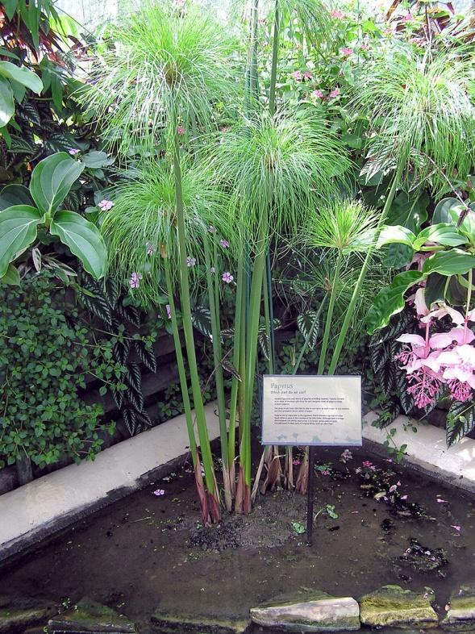

Figure 2.2. Papyrus (Cyperus papyrus) at Kew Gardens in London

Source: <https://commons.wikimedia.org/wiki/File:Kew.gardens.papyrus.plant.arp.jpg> (16.5.2016).

From the white stalk of the plant, cut lengthwise into thin strips, were made
papyrus sheets, which, glued together, formed papyrus scrolls (rolls) of various
lengths (2-5 metres)xv and of varying quality: see Fig. 2.3.xvi

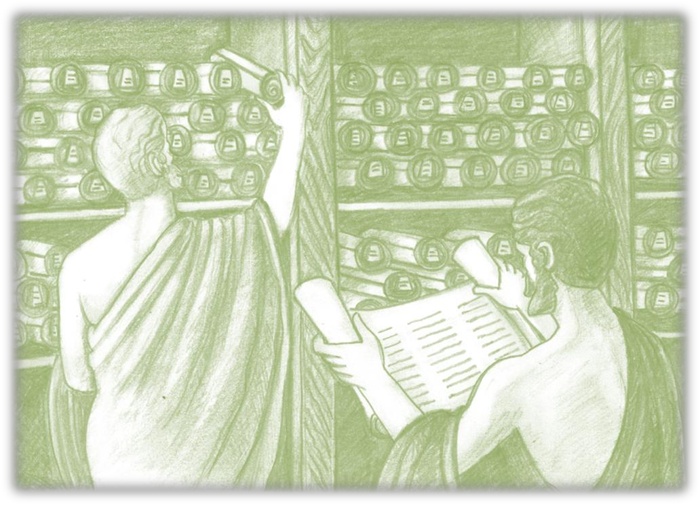

Figure 2.3. Studying papyri in a Hellenistic library: copy by Georgios Tzimopoulos & Aikaterina

Ioannidou, based on: History of the Greek Nation, vol. V (1974, p. 279).

In the Greek language papyrus was also called byblos/biblos, from the city of the same name in
Phoenicia (today in Lebanon), which was an important commercial centre for papyrus in Antiquity
(see Map 2.1).
All kinds of texts were recorded on papyri, from notes for everyday use, which constitute the
overwhelming majority of the surviving papyri, to major literary works and scientific texts
(mathematical, medical, music-theoretical, etc.). Most papyri are written in Greek and Latin
(ca. 80% of published papyri); the oldest are in Egyptian hieroglyphs, while still others are in Coptic,
Aramaic, or Persian.xvii
In the Mouseion of Alexandria, from the beginning of the 3rd c. BC, there operated the largest
library of the ancient world. It is thought to have held around 700,000 scrolls when it caught fire,
during the civil war in Egypt between Cleopatra and her brother Ptolemy XIII, in which Julius Caesar
intervened decisively, in the year 48 BC.xviii (see Map 2.1).

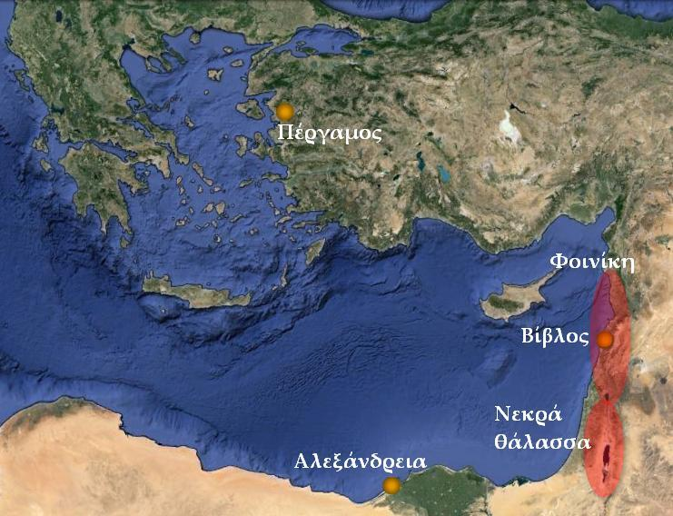

Map 2.1. Some very well-known centres for the production and circulation of writing material, and major libraries during

Antiquity. © Google earth.
Sources: Google earth & places marked

by Demosthenes Spanoudakis.

The rediscovery of papyri, which are very fragile and are preserved only in dry and enclosed places
that do not come into contact with moisture and air, began in the 18th century, with the excavations at
Herculaneum in Italy, where literary papyri were found that had been preserved in the lava of Vesuvius
(eruption in AD 79; excavations in 1752).xix The discovery of papyri continued during Napoleon Bonaparte’s
campaign in Egypt (1798-1801) and gained great momentum in the late 19th and early 20th century, with the
excavations of the Egypt Exploration Fund of London (today the Egypt Exploration Society). Mention may be
made, indicatively, of the famous excavations by the classical philologists Bernard Grenfell and Arthur Hunt
of Queen's College, Oxford, in the city of Oxyrhynchus (ca. 160 kilometres southwest of Cairo), between the
years 1897-1906, which brought to light enormous quantities of papyri in the Greek language.xx
We shall deal in greater detail with the famous musical Oxyrhynchus Papyrus 1789 in ch. 5.
Other important discoveries of papyri were made during the 20th century in the city of Dura-Europos
in Mesopotamia, on the banks of the Euphrates, and in the caves of Qumran (near the Dead Sea:
scrolls with biblical and liturgical texts, etc.).xxi
The oldest papyrus of Europe known today was found in 1962 at Derveni near
Thessaloniki. It was written around 340 BC and had been enclosed in a tomb for about 2350 years! (see
Figure 2.4).xxii

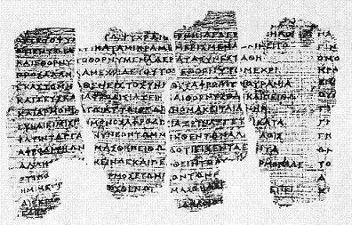

Figure 2.4. The Derveni Papyrus (late 4th c. BC), originating from Tomb A at Derveni. The papyrus scroll
is in a carbonised state because of the funerary pyre (Tsantsanoglou, 2013, p. 8). It is also known as
“the oldest book in Europe.” It contains an interpretation of an Orphic hymn. It is exhibited in the Archaeological Museum
of Thessaloniki. In the image: a photographic reproduction of a fragment of the scroll.
Image source: <https://upload.wikimedia.org/wikipedia/commons/b/bb/Derveni-papyrus.jpg> (8.8.2016).xxiii

The largest collection of papyri is today in Oxford, with ca. 400,000 fragments:
<http://www.papyrology.ox.ac.uk/POxy/> (8.8.2016).
Other important collections of papyri are housed in museums: in Vienna,
Berlin: <http://ww2.smb.museum/berlpap/> (8.8.2016), Florence, and in the Universities:
of Heidelberg: <http://www.rzuser.uni-heidelberg.de/~gv0/Papyri/P.Heid._Uebersicht.html> (8.8.2016),
of Cologne: <http://www.uni-koeln.de/phil-fak/ifa/NRWakademie/papyrologie/> (8.8.2016),
of Trier: <http://digipap.uni-trier.de/papy.php> (8.8.2016),xxiv
of Manchester, John Rylands Library: <http://luna.manchester.ac.uk/luna/servlet/ManchesterDev~93~3>

1. , of Berkeley, California, Center for the Tebtunis Papyri: <http://tebtunis.berkeley.edu/form>

(8.8.2016), of the Universities of Yale, Ann Arbor, Milan, etc.
The great majority of papyri has not yet been published.xxv

#### 1.2.2. Parchmentxxvi

By the name diphthera (διφθέρα)xxvii or membrane, from the 4th c. AD also as pergamene (sc. diphthera), or also leather (in
Latin: pergamena [neut. pl.] or, more commonly, membrana [sing., fem.], or even as vellum), there is known
a writing material made from the hide (flayed skin) of various animals, usually lamb or sheep, goat,
calf, more rarely ass (donkey) or even pig. The refined manufacturing method of
parchment includes the cleaning of the hide and its preparation as a smooth writing surface,
with the use of lime, water, and pumice.xxviii

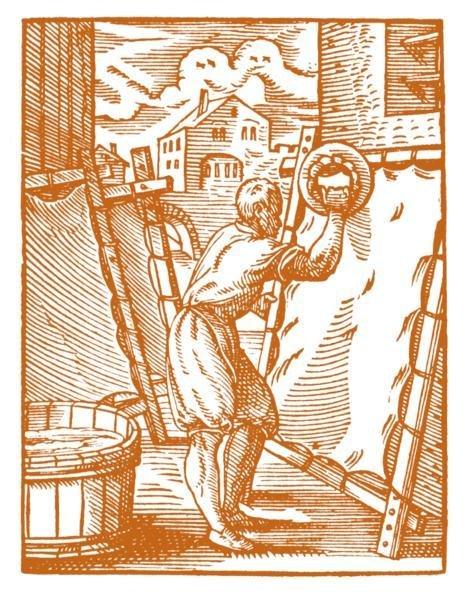
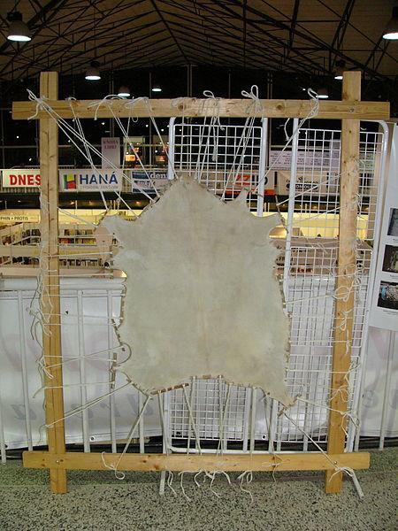

Figures 2.5-6. Left: Stretched goatskin for the manufacture of parchment. Right: Jost Amman and Hans Sachs,
Frankfurt, 1568: The manufacture of parchment.
Sources: <https://commons.wikimedia.org/wiki/File:Parchment_from_goatskin.jpg> (15.2.2016).
<https://en.wikipedia.org/wiki/Parchment#/media/File:Permennter-1568.png> (15.2.2016).

The name parchment was already associated in Antiquity with the city of Pergamon in western Asia
Minor (see Maps 2.1. and 2.2).

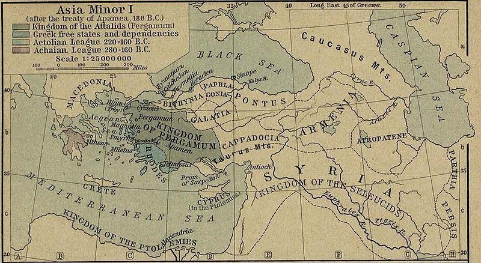

Asia

Map 2.2. The Kingdom of Pergamon on a map of Asia Minor after the year 188 BC.
Source: <http://en.wikipedia.org/wiki/File:Asia_Minor_188_BCE.jpg> (13.3.2012).

According to Pliny the Elder (AD 23-79, author of Natural History - Naturalis
Historia, book XIII, ch. 21),xxix the Latin scholar Marcus Terentius Varro (116-27 BC) circulated a
story according to which the Egyptian king Ptolemy V Epiphanes (205-180 BC) and Eumenes II,
king of Pergamon (197-158 BC) of the Attalid dynasty, were competing as to who would
have the better library (in Alexandria or, respectively, in Pergamon). In order to halt
Eumenes’ work, the Egyptian king stopped the export of papyri to Pergamon, and thus
in the Asia Minor city, which at that time was at its zenith, the manufacture of
parchment began.xxx Although the reliability of this story was shaken by the fact that texts were found
written on a corresponding material already from the 4th c. BC,xxxi nevertheless this story reveals that
Pergamon was in Antiquity the principal productive and commercial centre of parchment.

During the 3rd-5th c. AD, testimonies concerning the spread of parchment become more numerous, and from the
6th century onward parchment becomes the most common writing material and predominates until the 13th century, when
it enters into competition with paper. In other words, parchment constitutes the basic writing material of
Byzantium.
Between the writing material (lamb’s hide) and the content of the New Testament there was created
in the Byzantine period a close symbolic association: see, indicatively, in the Revelation of John,
ch. 21, v. 27: “those written in the Lamb’s book of life.”xxxii
Luxury codices were made from high-quality parchment (e.g. the so-called
charta virginea, made from the skin of an unborn calf). Especially renowned are the so-called codices
purpurei—purple codices—of the golden age of St Justinian (6th c.) in the East, or of the age of the
Carolingians (8th-9th c.) in the West,xxxiii which consist of parchment leaves dyed purple,
on which the texts are written in gold and/or silver letters. Very often such
manuscripts are richly adorned with polychrome miniatures (see Figure 2.7).xxxiv

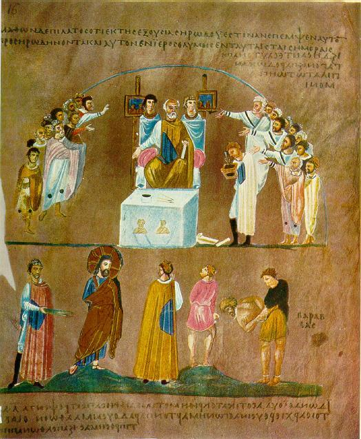

Figure 2.7. Codex purpureus Rossanensis, mid-6th c., f. 8v, with majuscule script and a miniature depicting
the Lord Jesus Christ before Pilate. Museum of the Archdiocese of Rossano, Calabria, Italy. Probable provenance
of the codex: Syria. The text is written in various directions: above, in the first two lines, it is from
left to right (Luke 23:7), while lines 3-6 are written in mirror-image (Matt. 27:2). Beneath the
miniatures the text continues in the same manner for another three lines (Matt. 27:3-5).xxxv
Source: <https://commons.wikimedia.org/wiki/File:RossanoGospelsFolio8vChristBeforePilate.jpg>

(8.8.2016). <https://de.wikipedia.org/wiki/Codex_purpureus_Rossanensis> (8.8.2016).

#### 1.2.3. Paper

Paper was invented in China, and the oldest samples of paper that have survived to the present
are dated around the year AD 100. It is made chiefly from linen, in combination with hemp and
cotton. The method of manufacturing paper (see Figure 2.8) remained secret until the middle of the 8th century,
when the Arabs of Baghdad learned it from captive Chinese papermakers.xxxvi

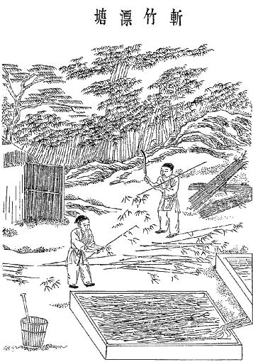

Figure 2.8. The traditional process of paper production in China, based on several 17th-century drawings.
Sources: <https://commons.wikimedia.org/wiki/File:Making_Paper.gif> (8.8.2016). Gaur (1994, pp. 41-42).xxxvii

Subsequently, paper mills were founded in Samarkand, Aleppo, Damascus, and other cities
of the Middle East. This so-called Arab or Eastern paper also spread to Byzantium, especially from
the 12th century onward, and was used both in administration and for the production of codices,
gradually outstripping parchment. From the city of Bambyce in Syria, a commercial centre
of paper, there seems to derive the name bambykinon or bombykinon, which is used from time to time
for manuscripts made of paper.
With the Arabs, paper also came to the West: first to Spain, during the 12th century (paper mills
in Xàtiva of Valencia, in Córdoba, Granada, and Toledo), and a century later to
Italy. The first Italian paper mill was in the city of Fabriano and is attested from the year 1268. In
time it became the most important productive and commercial centre of paper in the West and East.

Arab or bombycine paper is characterised by its compact texture, its smooth and glossy
surface, its grey or yellowish colour, and its thick sheet, with dense laid lines and
freely distributed chain lines.
By contrast, Western paper has a rough surface, a white or yellowish colour, somewhat more widely spaced laid
lines, while the chain lines are distributed at regular intervals.xxxviii In addition, Western paper
usually contains the so-called watermarks, special designs (e.g. crowns, flowers, animals, etc.), which
constituted the identifying sign—the brand—of the particular paper mill.xxxix
The laid lines, the chain lines, and the watermarks are clearly visible when one holds the paper up to
the light of the sun or of a lamp: see Figure 2.9.

Figure 2.9. Fragment of modern paper with a watermark.xl

The type of paper, and especially the watermarks, are an important aid in dating
those manuscripts that do not bear a bibliographical note indicating their date.
A fundamental dictionary, with more than 16,000 watermark designs from the end of the 13th century to 1600,
was offered to the scholarly community by the French palaeographer C.M. Briquet (see Figure 2.10).xli

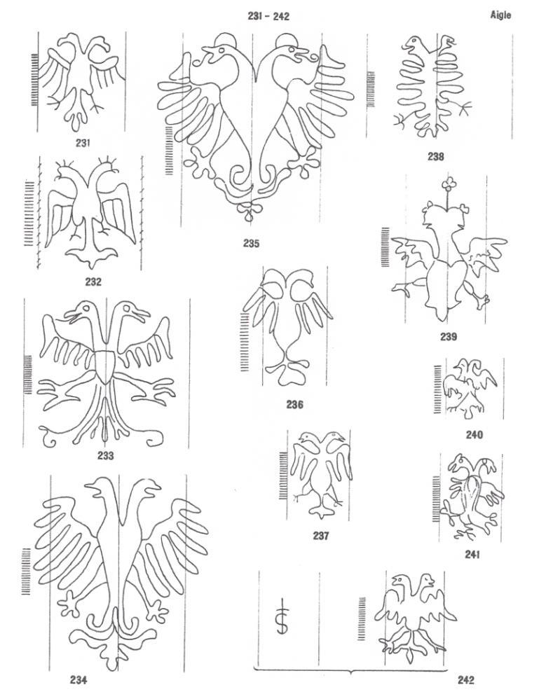

Figures 2.10. Watermark designs with the motif of the double-headed eagle. Source: Briquet (1907, vol. I, digital p. 304, designs

231-242, from: <https://doc.rero.ch/record/23217/files/ob_447_1.pdf> [8.8.2016].

### 1.3. Writing instruments and inks

Writing on papyrus, parchment, and paper was done with black ink (with shades tending toward
brown and grey), which was called writing black (γραφικὸν μέλαν) or encaustum (λατ. encaustum), since it
was made over fire. The correct proportion of vegetable, later also tannic, substances and metallic
salts ensured the good quality of the ink, which, with the passage of time, would not fade
or, conversely, perforate the parchment or paper.xlii The use of red ink (sacrum encaustum)
in state documents was for a long period the privilege of the emperor (see Figure 2.11), and its
misuse was punished with severe penalties.xliii

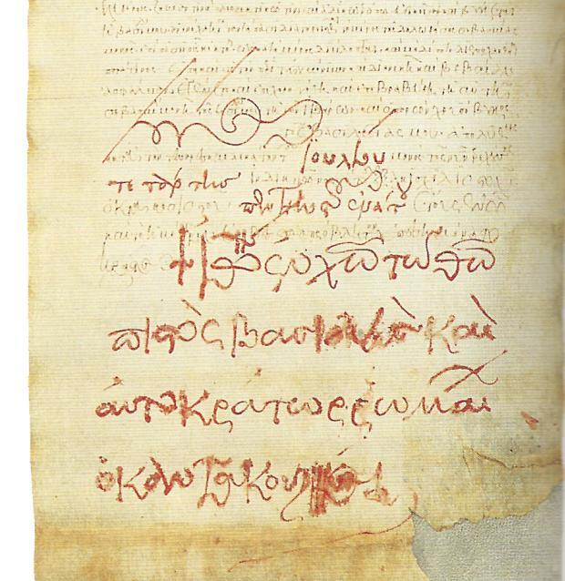

Figure 2.11. Fragment from a chrysobull of the Archive of the Holy Monastery of Iviron, 14 July 1351, on parchment, with the
imperial signature in red ink: Ҡ John, faithful emperor and
autocrat of the Romans in Christ God, Kantakouzenos.”
Source: Economidis, Nikos, and Chrysochoidis, Kriton. (1997). The Historic Archives of Mount Athos. In Athanasios
Karakatsanis (managing editor), Treasures of Mount Athos, translation Andrew Hendry et al. Thessaloniki: Holy
Community of Mount Athos, Ministery of Culture, Museum of Byzantine Culture, Organization for the Cultural Capital
of Europe Thessaloniki 1997, pp. 516-517, fig. 13.17. © Holy Monastery of Iviron, Mount Athos.

In other categories of documents, however, no such restriction applied. In musical manuscripts, for example,
black ink is used for the poetic text and for the majority of the musical signs.
In red are written chiefly the titles and the so-called erythrogrammata (ἐρυθρογράμματα) (also called
rubrics, from the Latin ruber = red),xliv that is, notes by the scribe which concerned the
feast and the service for which the piece was intended, its poet and/or its melodist, the type

of the piece, and various liturgical instructions, occasionally also evaluations of the pieces, such as e.g. very
beautiful. Also written in red are: the first letter of a piece, the martyriai (initial and
internal, or mesomartyriai), as well as various musical signs, especially many of the so-called great
hypostases of cheironomia, chiefly from the period of Kalophonia (13th-15th c.) onward (see Figure

2.12). Finally, a variety of inks was in use for the miniatures or also for various diagrams, which

adorn luxurious Byzantine and post-Byzantine manuscripts, musical or otherwise.xlv

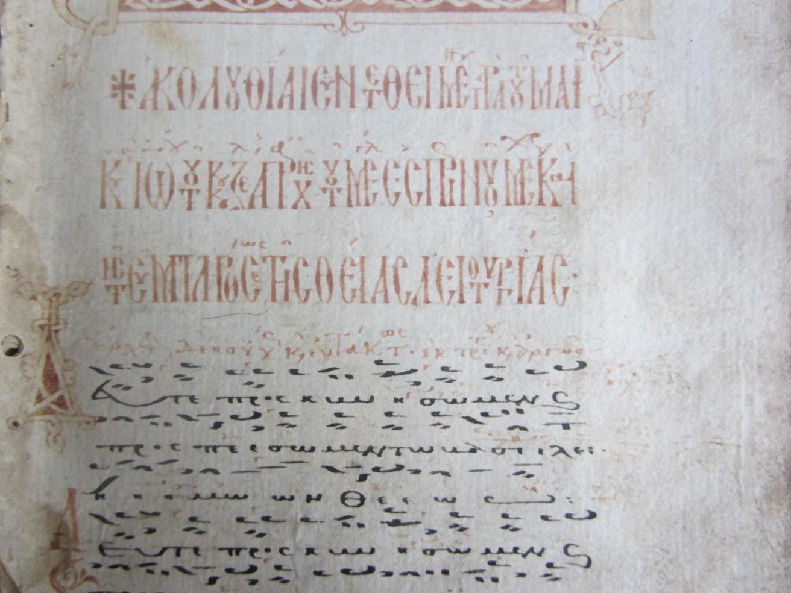

Figure 2.12. Use of black and red ink in Byzantine musical manuscripts: The first dated
Papadike, MS NLG 2458, f. 11r, year 1336: “† Services composed by the maïstor
kyr John Koukouzeles, from the beginning of Great Vespers up to and including the completion of the
Divine Liturgy.” © National Library of Greece.xlvi

For the writing of manuscripts, scribes used the reed pen (kalamos or graphis). From the
4th c. AD onward, they also used the kondylion, that is, a pen made from a bird’s feather (usually
goose). Both the reed pen and the kondylion were sharpened with a small knife. In the middle of the nib there was a small slit,
as in modern pens.
Writing materials and instruments are often depicted in Byzantine iconographic works (miniatures or
wall paintings) with the Evangelists (see, e.g., Figure 2.13).

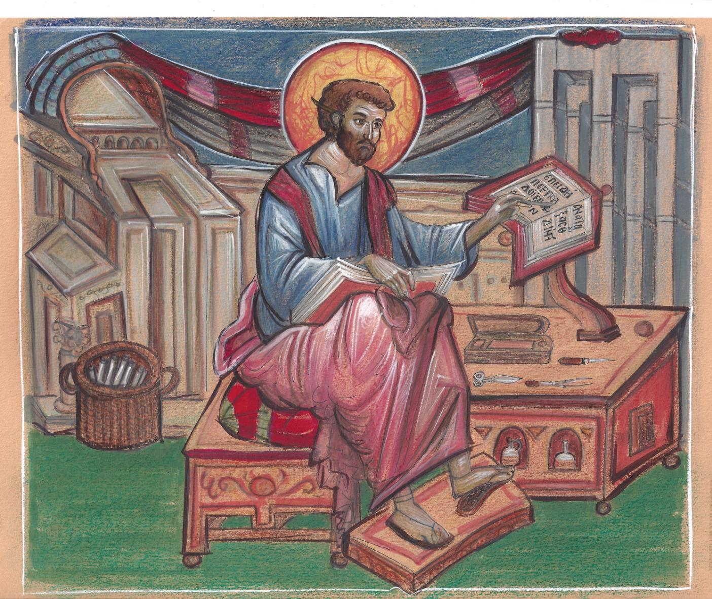

Figure 2.13. The Evangelist Luke. Copy by Georgios Tzimopoulos & Aikaterina Ioannidou (2016), from
a wall painting by Manuel Panselinos in the Protaton, around 1290. Among the writing materials and instruments depicted are the
reed pen (behind the Evangelist’s right ear), two open parchment codices, one in the Evangelist’s lap
and the other on a lectern, and a small knife with which the scribe is scraping away a letter in the text, which is written in
majuscule script and constitutes the beginning of the Gospel according to Luke: SINCE MANY HAVE
UNDERTAKEN TO SET IN ORDER A NARRATIVE. On the parchment are also visible the horizontal and vertical
lines (the so-called ruling), which ensure the straight recording of the text. On the small table
in front of the Evangelist rest a wooden casket, a pair of scissors, two other pointed instruments, and a small
sponge at the far right. Inside the cupboard, in its lower part, two (ink)pots are also visible. In the rear part of the
composition, six parchment scrolls are depicted in a basket.xlvii

### 1.4. Forms of manuscripts, scribal workshops, and the preparation of a codex

#### 1.4.1. Forms of manuscripts: from the scroll to the codex

In classical Antiquity, the most widespread form of manuscripts was the scroll, i.e. the roll of papyrus,
more rarely also of parchment, wound around a rod of wood or bone, which at its ends
could have a covering/decoration, e.g. of ivory (see Figure 2.14).
Other names for the scroll were byblos, biblion, eiletarion (Lat. liber, libellus, volumen). The
papyrus scroll that had not yet been written upon was called chartes (Lat. charta). If a work was
written on several scrolls, because of its size, each scroll constituted a tome of
the particular work (e.g. volume I, II, III of the Iliad).xlviii

From the 2nd c. AD began the gradual replacement of the scroll and papyrus by the
codex and parchment. A codex is the term for a set of folded and sewn leaves, which
are fastened within a cover.xlix The name and form of the codex arose from
joined wooden waxed tablets (known by the names: pinax, pinakis, deltion,
deltidion, pyction, grammateion), which were in use in antiquity chiefly for everyday
writing, for teaching, etc.l Between wooden tablets papyrus
leaves could also be fastened, and later parchment leaves. The codex spread from the 4th c. AD,
chiefly in its parchment form, and prevailed in this form from the 5th-6th century onward. Of decisive importance for
the transition from the scroll and papyrus to the codex and parchment was the spread of
Christianity through Holy Scripture—the Bible (see Figure 2.15).li
From the 13th century onward, codices also appear in paper form.
Nevertheless, alongside the codex, the Byzantine tradition also retained the form of the scroll for
diplomatic documents (e.g. chrysobulls), for hymnographic texts such as the kontakion, or also for other
liturgical books, such as, for example, the various Divine Liturgies of the Byzantine rite.

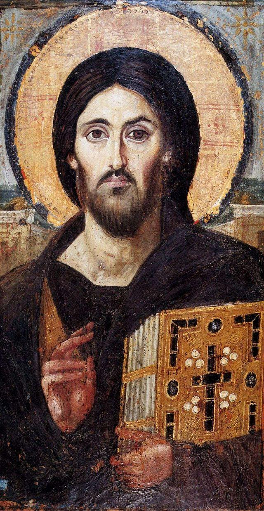
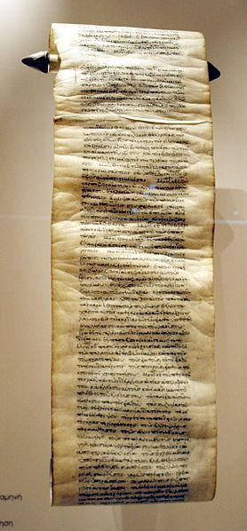

Figures 2.14-15. Left: Byzantine liturgical scroll in minuscule script, 13th c., Byzantine & Christian
Museum, Athens.  Right: Christ Pantokrator, encaustic icon from the Holy Monastery of Saint Catherine at Sinai, first half
of the 6th c. The Lord blesses with His right hand, while in His left He holds the Gospel in the form of a codex with a luxurious
cover and clasps.
Sources: <https://upload.wikimedia.org/wikipedia/commons/9/9a/2049_-_Byzantine_Museum%2C_Athens_->
_Parchement_scroll%2C_13th_century_-_Photo_by_Giovanni_Dall%27Orto%2C_Nov_12.jpg (30.8.2016).
<http://commons.wikimedia.org/wiki/File:Spas_vsederzhitel_sinay.jpg#/media/File:Spas_vsederzhitel>_ sinay.jpg

(11.6.2015). Choulis (1999, p. 27, fig. 18a and p. 43, fig. 38a).

||
|---|
||

#### 1.4.2. Scribal workshops

The copying-production of codices took place in large libraries (e.g. the imperial library in
Constantinople) or in large monasteries, where there were special scribal workshops, the so-called
calligrapheia (Lat. scriptorium, pl. scriptoria). Among the best-known calligrapheia that produced
manuscripts of Byzantine and/or post-Byzantine culture are those of the Holy Monastery of Stoudios and of the

Holy Monastery of the Panagia Hodegon in Constantinople (see Map 2.3), of the Archbishop of Caesarea

Arethas,lii of various monasteries of Mount Athos (e.g. Great Lavra, the Holy Monastery of Iviron, the Holy and Great Monastery of Vatopedi, the Holy Monastery of
Xeropotamou, etc.), of the Holy Monastery of Saint Catherine at Sinai, of various monasteries of Lower Italy, Crete,
Cyprus, the Danubian Principalities, etc.liii

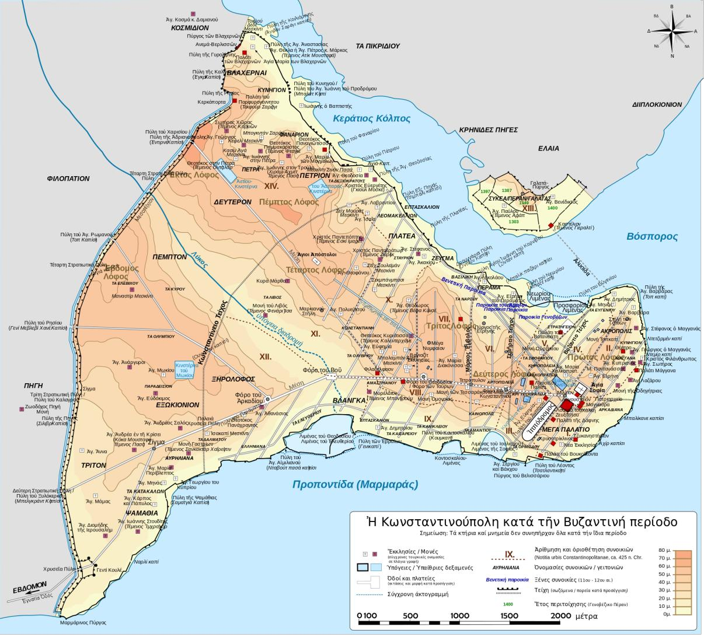

Map 2.3. Locations of the Holy Monastery of Stoudios (southwest) and of the Holy Monastery of Hodegon/Hodegetria (east)
in Byzantine Constantinople, where important scriptoria operated.
Source: <https://upload.wikimedia.org/wikipedia/commons/f/fd/Byzantine_Constantinople-el.svg> (30.8.2016).

Saint Theodore the Studite (759-826), abbot of the Holy Monastery of Stoudios and “reformer of
monastic life in the 9th century,”liv gives an image of the good order that was to prevail in a
scribal workshop, writing with regard to the monks in the calligrapheion, among other things, the following
regulations:
“Concerning the calligrapher (...)
54. If he does not hold the quire carefully, and place the book from which he is writing,
and cover both at the proper time, and if he does not observe the correspondences, the accents, and the
punctuation marks: 30 and 100 prostrations. (...)
60. If the protocalligrapher distributes the handiwork with partiality, and if he does not properly look after
the membranes and all the binding tools, so that none of the things useful
for such service becomes unusable, impose upon him 50 and 100 prostrations and

excommunication.”lv

#### 1.4.3. The preparation of a codex

Some of the basic steps in the preparation of a parchment or paper codex were the following:

√ The folding of the parchment into two or more parts (into four or into eight [Lat. in-quarto, in-octavo]

according to the size of the skin): see Diagrams 2.1-7).

√ The formation of the basic units of the book, the so-called quires, and the cutting of the leaves.

There are quires that consist of two bifolia (dyads or doublets, Lat. biniones), of three bifolia
(triads, terniones), of four bifolia (tetrads or quaternions, quaterniones), or even of more
bifolia sewn together. The most common form of quire is the quaternion, which
consists of 4 bifolia = 8 leaves = 16 pages (see Diagram 2.8).

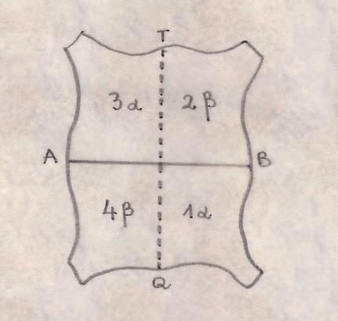
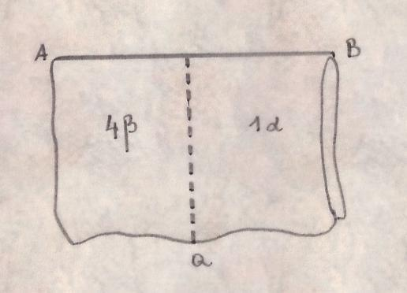
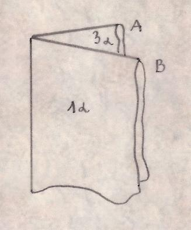

Diagrams 2.1-3. From the processed hide of a sheep to the four leaves of a codex: the most common form
of folding a parchment into four leaves (in-quarto). By folding, two bifolia are first formed (one
dyad) and then four leaves. The four leaves are numbered with their two sides, that is, as f. 1a or 1r (recto) and 1b
or 1v (verso), 2a and 2b (or 2r and 2v), 3a and 3b (or 3r-v), 4a-b (or 4r-v), and constitute altogether eight pages.lvi

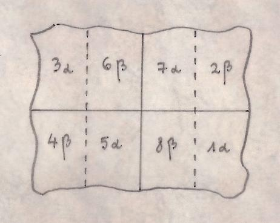
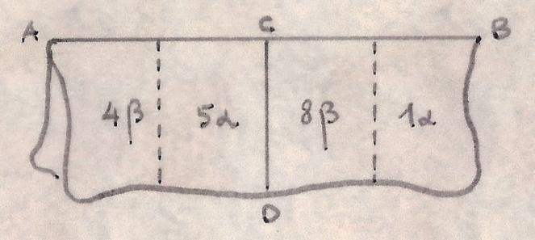
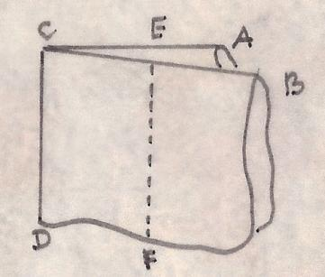
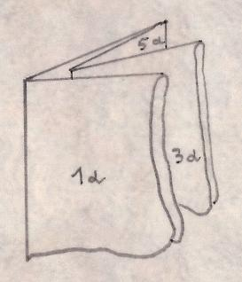

Diagrams 2.4-7. From the processed hide, e.g. of a calf, to the eight leaves of a codex: a common form
of folding a parchment into eight leaves (in-octavo). By folding, one large bifolium (dyad) is first formed,

which in turn is folded another two times to create a quaternion. The eight leaves that result
are numbered with their two sides from 1a to 8b (or 1r-8v). Altogether we have 16 pages.lvii

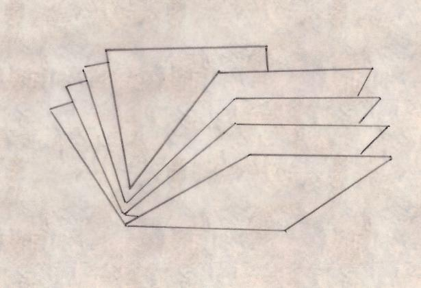

Diagram 2.8. Four bifolia are assembled to compose a quaternion quire.lviii

To this day the sixteen-page quire constitutes the basic typographical unit. Each quire
received numbering by numeral letters on its first and last leaf (the so-called guards),
to ensure the subsequent correct assembly of the quires in the codex.lix

√ Ruling is the term for the preparation of the leaves with parallel and several vertical lines, which

were incised with a sharp instrument into the parchment, as an aid for the later alignment of the
text by the scribe of the manuscript.
The various scriptoria had their own ruling patterns. The recognition of the corresponding pattern
can help in the dating and determination of the provenance of manuscripts. A general
systematisation of various types of ruling, and thus an important instrumentum studiorum for the study of
codices, may be found in the foundational work of Julien Leroy, edited by J.-H. Sautel (1995), entitled:
Répertoire de réglures dans les manuscrits grecs sur parchemin (see Diagrams 2.9-10).

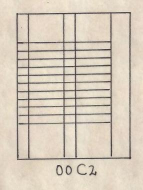
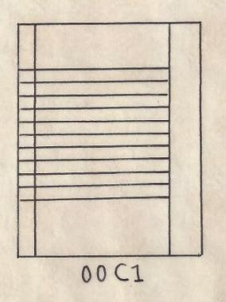

Diagrams 2.9-10. Two examples of standardised ruling patterns. The pattern on the left (Leroy-Sautel 00C1)
is documented, for example, in MS Vaticanus graecus 1660, 10th c., ff. 1-393, with hagiographic texts, scribe: John at the

Holy Monastery of Stoudios, year 916. The pattern on the right, which is intended for writing text in two columns (Leroy-Sautel 00C2),

is found, among other places, in the MS of the Holy Monastery of Vlatadon, Thessaloniki, no. 7, of the 12th c., which contains liturgical
texts. lx

- √ After the ruling of the leaves, the process of copying could begin.

- √ After the completion of the copyist’s work, the binding or stachosis was carried out, which had

several stages, among which the following are mentioned:

- The sewing of the quires,

- the preparation of the wooden binding boards and their connection with the body of the book,

- the reinforcement of the spine of the book with cloth, the construction of the so-called headband (sewing at

the upper and lower part of the spine),

- the gluing of the cover (usually morocco leather in a brown colour, at other times silk

cloth of various colours and designs) onto the codex and the placement of clasps for the
protection of the parchment leaves from changes due to weather conditions (e.g. undulations of the
leaves because of moisture, etc.),

• the placement of bosses (or head-nails = small metal plates of various shapes, e.g. in

the form of a lily, almond, etc.) in the middle and at the four corners of each board to limit
wear of the cover, the addition of bookmarks, the decoration of the cover with
metal stamps, which are pressed onto the leather, the embellishment of the spine with various
designs or of the fore edge of the book by recording the author or the title of the
codex, etc.lxi (see Figures 2.16-17).

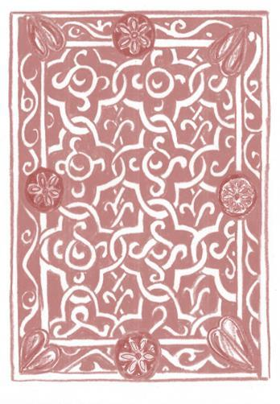
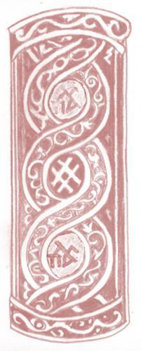

Figure 2.16. Late Byzantine silk binding, with bosses, in a copy (sketch by Georgios Tzimopoulos &
Aikaterina Ioannidou [2016]). On the spine of the book (see left, below) the monogram of the Palaiologoi is visible:
PALG. lxii

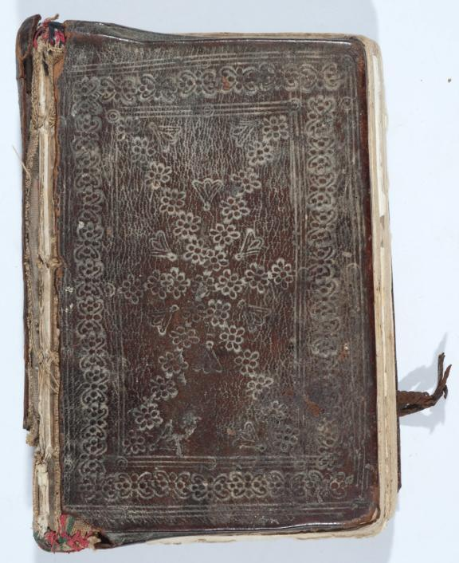

Figure 2.17. Post-Byzantine leather binding, with impressed stamps and with a clasp (only one has survived). Anthology
of Eustathios, Protopsaltes of the Holy Monastery of Putna (Moldavia, Romania), year 1511, which is preserved in the State
Historical Museum, Moscow, Șciukin Collection, MS 350.lxiii © State Historical Museum, Moscow.

A separate category is constituted by the luxury bindings, chiefly of the Gospels, with gold
or, usually, gilt silver, pearls, precious stones, etc. (see Figures 2.15 & 2.18).

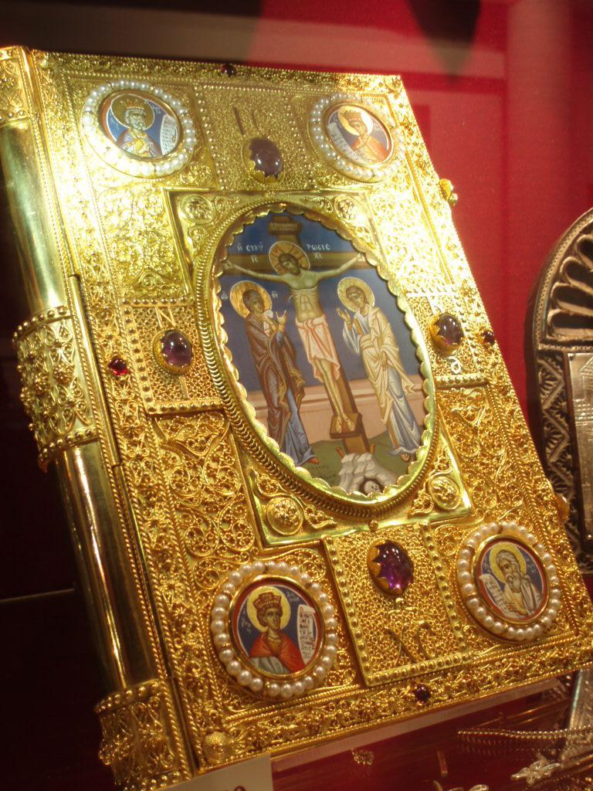

Figure 2.18. Luxurious modern binding of a Gospel book, in Byzantine style: binding with gold, pearls, gemstones,
small icons, and with the inscription: “J(ESU)S C(HRIS)T CONQUERS,” in a cruciform shape.lxiv
Source: <https://upload.wikimedia.org/wikipedia/commons/5/5b/Evangel.JPG> (12.4.2016).

#### 1.4.4. Illustrated manuscripts

Museums of Byzantine and post-Byzantine art throughout the world often exhibit very beautiful codices with
miniatures of exceptional artistic quality and great precision in the depiction of details. The study of the
miniatures found in illustrated manuscripts is an object of the History of Byzantine
Art. Since chanters, hymnographers, melodists, or musical instruments are depicted, these miniatures also become
objects of Musical Iconography.lxv
The study of the palaeography of Byzantine music can also bring us into contact with
illustrated codices, especially in the case of ekphonetic notation (Gospels), but also of musical
collections such as Sticheraria, Anthologies, etc. (see Figure 2.19).

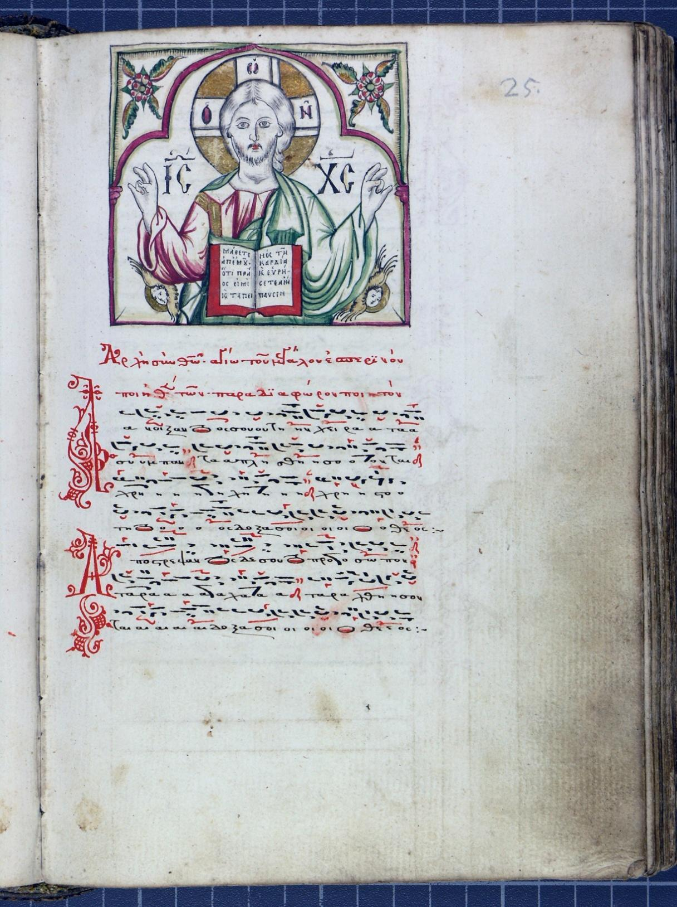

Figure 2.19. Miniature of the Pantokrator at the beginning of Great Vespers, from the Anthology of the Holy Monastery of
Pantokrator, no. 206, f. 25r (in the open book a fragment from the Gospel according to Matthew, ch. 11, 29.2,
is visible, in majuscule script). Scribe: Kosmas the Hieromonk, ca. 1685-1700 (Chatzigiakoumis, 1980, pl. 51). © Holy
Monastery of Pantokrator, Mount Athos.

Samples and descriptions of miniatures and various elements of Byzantine ornamentation, such as
headpieces, headings, initial letters or decorated initials, rosettes (decorative forms in circular
shape), ornamental bands with plants, birds, geometric shapes, etc., can be found in
catalogues of manuscripts of Byzantine music (e.g. Chatzigiakoumis, 1980, and Stathis, 1975, 1976, 1993,
2015, 2006) and in special studies of illustrated manuscripts (e.g. in Treasures of Mount Athos

etc.).lxvi Often the diagrams of the Byzantine oktoechos (ὀκταηχία) as well (wheels, trees, and other shapes: see

below, ch. 8), which are included in the Preliminary Theoria of the Papadike or in other theoretical
treatises, are very elegant, enhancing the manuscripts and facilitating the educational
process of the Psaltic Art.

### 1.5. Palimpsestslxvii

The making of books in Antiquity and the Middle Ages was an expensive undertaking. It suffices to
take into account that from one lamb, for example, only four manuscript leaves are produced; thus a more voluminous
codex of 400 leaves required skins from an entire flock! For reasons of economy, therefore, parchments
and more rarely papyri,lxviii could be recycled. Such recycled leaves are called
palimpsests (from the adverb palin + the verb psao [= I scrape off, erase], that is, leaves/manuscripts/codices scraped
again/for a second—and rarely for a third—time).lxix
The erasure of the earlier writing (underlying writing—scriptio inferior) included the
soaking of the parchment leaves in milk, their washing with a sponge, and their rubbing with
pumice.lxx After the leaves had dried, a new ruling could be carried out and the new text written
over it. From the process of rewriting, these codices are called in Latin
codices rescripti. Very often the new writing (overlying writing—scriptio superior) is
placed, for practical reasons, between the old lines, or in the opposite direction, since it
was not possible in all places to make the letters of the underlying writing disappear completely.lxxi
For the decipherment of the underlying writing, various aids have been used from time to time:
chemical reagents (e.g. tannic substances or ammonium sulphide), which, however, had
a destructive effect on the particular leaves, since after a short period of time they became
black,lxxii reading with an ultraviolet lamp, photography with infrared rays, etc.lxxiii
From the late 20th and early 21st century, new methods of studying
palimpsests were developed with the aid of computers, which led to spectacular results.lxxiv
The new methods for the study of palimpsests as well as of other difficult-to-read manuscripts
include advanced multispectral imaging techniques, Statistical Processing Techniques
applied to spectral images, etc. The various techniques are based on exploiting the difference between
the colour of the parchment, the first writing, and the second writing. Especially helpful in the
attempt to decipher the first layer of writing of a palimpsest are the processed,
pseudocolor images, which increase the difference between the two writings
and the parchment, rendering the various elements in colours that are more easily distinguished from one another
(see Figure 2.20).lxxv

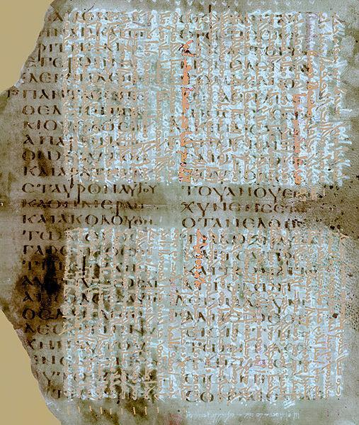

Figure 2.20. Pseudocolor image from the palimpsest Codex Nitriensis, British Library, Add.
17211, f. 20r (late 5th c., probably Egypt, Nitria).
Underlying writing, late 5th c.: Fragment of the Gospel according to Luke, ch. 9, 22-33, in the Greek language, in
majuscule biblical Egypto-Nitrian script.
Overlying writing, 8th or 9th c.: Syriac text of Severus of Antioch, Contra impium grammaticum (referring to the
Orthodox John the Grammarian). To facilitate the study of the palimpsest, the overlying writing was coloured with
whiter colours, using modern digital technology.lxxvi
Sources: <https://commons.wikimedia.org/wiki/File:Codex_Nitriensis,_f.20r_(Luke_9,22-33).jpg> (8.8.2016).
Dating of the underlying writing and description of the script: Litsas (2001, pp. 22-23).
See also <https://en.wikipedia.org/wiki/List_of_New_Testament_uncials> (8.8.2016).
<https://en.wikipedia.org/wiki/Codex_Nitriensis> (8.8.2016).

The best-known palimpsest manuscript today is the Archimedes Codex (Walters Art Museum,
U.S.A.).lxxvii
In the present handbook, a reference has already been made to the palimpsest Princeton Garrett 64 (see above,
Table 1.7, 8th c., and below, chapter 5, section 5). In chapter 4 there will also be discussion of the famous
Palimpsest Codex of Saint Ephraem the Syrian (Codex Ephraemi Syri rescriptus, from the National Library
of Paris: Codex Parisinus graecus 9).lxxviii

### 1.6. Elements of Byzantine Codicology and the liturgical contexts of Byzantine musical codices

Modern Byzantine Codicology studies the dynamic process of the creation, establishment, development,
transformation, and dissemination of Byzantine manuscript codices (books) from the beginning of the 4th c. AD to
more recent times (19th-20th c.). Bearing in mind that liturgical life occupies a central position in the
Byzantine tradition, recent research aims at a holistic consideration-analysis of Byzantine
ecclesiastical-liturgical manuscripts within their generative worship context, on the basis of
codico-liturgical methodology.lxxix
The nucleus of the large family of Byzantine liturgical books consists of three
manuscripts with texts of Holy Scripture: the Gospel, which is the “heart” of the whole edifice
(containing readings from the four Gospels of the New Testament), the Apostolos (with readings
from the Acts of the Apostles and the Epistles of the New Testament), and the Psalter (it contains the
150 Psalms of the Old Testament) (see Diagram 2.1).

χχχ

Gospel

Psalter Apostolos

σσσ

χχχ

Diagram 2.1. The triple core of manuscript codices at the basis of the large family

of liturgical books.lxxx

Around this core, during the Byzantine and post-Byzantine periods various other
liturgical collections developed, interacting with one another on the basis of the Typikon. The Typikon may be
regarded as a ‘meta-liturgical book’, containing the rubrics for the performance of the various
offices of the movable festal cycle (centred on Easter) and of the fixed festal cycle
(1 September–31 August) of the ecclesiastical year.lxxxi Diagram 2.2 below outlines the
network of liturgical books and highlights the organic place of musical manuscripts within the Byzantine
codicological-liturgical ensemble.

Heirmologion,
Kalophonic
Heirmologion

Psaltikon,
Asmatikon, Pa-
padike, Mathe-
matarion, Oikema-
tarion

Homilies
on Gospel
readings

Tetraevan-
gelion and
Gospel

Panegyri-
kon, Kyriako-
dromion for
Gospels

Typikon

Biblical

Ritual

Hymnographic

Ascetic

TYPIKON

Syna-
xarion

Hagiological

meta-
liturgical
book

12
Menaia

Prophe-
tologion

Musical

Meno-
logion

Homiletic

Triodion

logion

Penteco-
starion

Homilies on
Psalms
and Odes

Sticherarion,
Anastasi-
matarion,
Doxastarion

Horo
\-

logion,
Tropo-

Eucho- Psal-
logion,
ter,
Hieratikon
Odes

Ascetic writings of St
Ephrem, Ladder
of St John
of Sinai,
Catecheses of St
Theodore
the Studite

Okto-
echos/Pa-
rakle-
tike

Praxapo-
stolos and
Apostolos

Homilies on
apostolic
read-
ings

Homilies on
Genesis,
Prophets,
Proverbs

Panegyri-
kon, Kyriako-
dromion for
apostolic
read-
ings

Diagram 2.2. Byzantine and post-Byzantine liturgical codices with biblical, homiletic, ritual, hymnographic, musical, ascetic, and hagiological texts in
interconnection, coordinated by the Typikon.lxxxii

### 1.7. Analytical descriptive catalogues of manuscripts of Byzantine music (II)

Catalogues, and especially analytical catalogues of manuscripts of Byzantine music, constitute exceedingly important instrumenta studiorum for the palaeographical and, more generally, musicological study of musical
manuscripts. With regard to the cataloguing of codices of this kind, there are various models which
cataloguers have followed from time to time: general description, analytical description, and a mixed mode
of description. An indispensable guide to the process of analytical cataloguing of manuscripts of
Byzantine music was offered by Gregorios Stathis through his colossal cataloguing
work.lxxxiii Important models of analytical cataloguing of individual manuscripts are also found
in the accompanying Supplementa fascicles of the main Facsimilés series of the Monumenta Musicae
Byzantinae in Copenhagen.
An open list of elements that may be included in an analytical catalogue
of Byzantine musical manuscripts comprises the following:lxxxiv

1. Information concerning the type of manuscript according to its contents, its provenance, date, material, dimensions, number of folios, number of columns and lines per folio, palimpsest folios,

2. analytical description of the contents of the codex, with the incipits of all pieces and with bibliographical references for individual pieces (where these exist),

3. analysis of palimpsests (if any),

4. further comments concerning: • the codicological description of the manuscript: material of the manuscript, watermarks (for paper codices), quires and folios of the manuscript, ruling, size of the written frame per folio, pagination, etc. • palaeographical description of the text (type of script, handwriting and slant, characteristic forms of the script [special forms of certain letters],lxxxv punctuation, prosodic signs, abbreviations, type of script for headings and rubrics), inks, • description of the type of notation used in the codex, with mention of particular features (rare or idiosyncratic forms of certain signs, etc.), where these exist, • information on the scribe, • description of the ornamental elements and miniatures of the manuscript, • mention of important bibliographical notes by the scribe of the codex or by other hands, • description of the binding, • account of the state in which the codex is preserved, • data concerning the history of the codex, • observations by the author of the analytical catalogue concerning the structure, feasts (festal analysis), and importance of the manuscript, • up-to-date bibliography on the particular manuscript. For the immediate location of descriptive catalogues of manuscripts of Byzantine music the

Emmanouel Giannopoulos published a “catalogue of catalogues”, his very useful study entitled
“Basic bibliography for the manuscript codices of Psaltic Art”.lxxxvi
Below are listed, indicatively, some titles of catalogues for manuscripts of Byzantine music:

• Stathis, Gr. (1975, 1976, 1993, 2015). The Manuscripts of Byzantine Music, Mount Athos, Descriptive Catalogue.

Holy Synod of the Church of Greece, IBM, vols. I–IV. Athens. • Stathis, Gr. (2006). The
Manuscripts of Byzantine Music, Meteora, Descriptive Catalogue. Holy Synod of the Church of
Greece, IBM. Athens. • Stathis, Gr. (2016). The Originals of the Exegesis into the New Method
of Notation. Vol. I. The Prolegomena & Vol. II. The Catalogue. Holy Synod of the Church of
Greece, IBM. Athens. • Chatzigiakoumis, M. (1980). Manuscripts of Ecclesiastical Music 1453–1820.
Contribution to the Study of Modern Hellenism. Athens: National Bank of Greece. • Giannopoulos, Emm. (2008).
The Manuscripts of Byzantine Music. England. Descriptive Catalogue. Holy Synod of the Church of
Greece, IBM. Athens. • Chaldaiakis, A. (2005). The Manuscripts of Ecclesiastical Music, Island Greece,
Descriptive Catalogue, vol. I, Hydra. Holy Synod of the Church of Greece, IBM. Athens. •
Balageorgos, D. & Kritikou, Fl. (2008). The Manuscripts of Byzantine Music, Sinai, Descriptive
Catalogue, vol. I. Holy Synod of the Church of Greece, IBM. Athens. • Troelsgård, Chr. Inventory of

Microfilms and Photographs in the Collection of Monumenta Musicae Byzantinae, Database of the ΜΜΒ:
<http://www.igl.ku.dk/MMB/catbyz.htm> • Bucca, Donatella. (2011). Catalogo dei manoscritti musicali greci del SS.
Salvatore di Messina (Biblioteca Regionale Universitaria di Messina). Roma: Comitato Nazionale per le Celebrazioni
del Millenario della Fondazione dell'Abbazia di S. Nilo a Grottaferrata.

## 2. Typology of Greek alphabetic script

### 2.1. Prolegomena

#### 2.1.1. Categories and types of Greek alphabetic script

We have already spoken in the preceding
chapter about the diachronic development of Greek writing and the Greek alphabet. Below some basic points will be presented concerning the various categories and
types of alphabetic script that were in use from classical Antiquity to the post-Byzantine
period and modern times.
Table 2.1 presents the two basic categories of Greek alphabetic script, which
were widely diffused and in part coexisted in the same period, although each had
different applications.

|Category of alphabetic script|Brief description and typology|Field of use|General characteristics|Remarks|
|---|---|---|---|---|
|Cursive|• Letters ἐπισεσυρμένα = letters written quickly, (roughly).lxxxvii • It presents several types: 1. MAJUSCULE CURSIVE: attested from the 4th c. BC to the 3rd/4th c. AD and later, 2. minuscule cursive. Various subcategories are distinguished: a. Greco-Roman cursive: 4th–5th c. AD, b. Byzantine cursive: from the Justinianic period onward (6th c.). In turn, Byzantine cursive appears in various forms: i. the common hand: the usual script of very|everyday life, letters, deeds of purchase and sale|spontaneous, personal|Public and private documents (wills, legal acts, notarial documents) are the object of the discipline called Diplomatics.|
||ii. the bureaucratic script (see Figure 2.20). The boundaries between the common hand and bureaucratic script are sometimes blurred.lxxxviii|artificial script with many superfluous strokes, elaborate, for ensuring the authenticity of|official, standardized||
||||Figure 2.20. Sample of bureaucratic script, in an excerpt (copy), from an imperial document, Constantine X Doukas, year 1060lxxxix||
|Bookhand|Script of particular requirements on papyrus rolls and in codices. It presents two types: 1. MAJUSCULE BOOKHAND, 2. minuscule bookhand. Both types display many individual varieties: see below, Tables 2.4 and 2.7.|recording-copying of texts from all fields of knowledge (theological, legal, literary, scientific, musical, etc.)|clarity, elegance, careful proportions, alignment of the letters|The various varieties of bookhand obey strict rules, which determined the traditions of the respective scriptoria.|

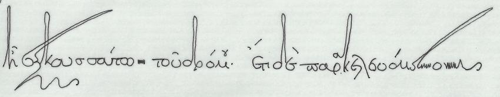

Table 2.1. Categories of Greek scriptxc

Among the various categories of scripts there are many interactions and also
intermediate stages.

#### 2.1.2. Continuous writing, punctuation marks, and prosodic signs

Although punctuation marks and prosodic signs had been introduced by Aristophanes of Byzantium, head
of the Library of Alexandria, already in the 2nd c. BC, the stable use of punctuation and prosodies was applied
only from the 8th and especially the 9th century onward, after Iconoclasm (726–843), in the general climate of renewal of the
Macedonian Renaissance (late 9th–first half of the 11th c.) and during the transition from majuscule to
minuscule script.
Majuscule script appears in manuscripts until the 8th/9th century, usually as
continuous writing (scriptio continua), that is, as a continuous flow of letters, without spaces between
words, without accents (acute, grave, circumflex) and breathings (smooth, rough), and without punctuation marks.
In some old manuscripts in majuscule script, these aids for reading the
text (punctuation marks, prosodic signs) were added later. Table 2.2 shows the
punctuation marks attributed to Aristophanes of Byzantium:

|Punctuation mark|Example|Function and equivalent|
|---|---|---|
|upper point|A ̇|longer pause|
|lower point (placed on the baseline of the text)|A.|short pause, like the modern comma|
|middle point (placed in the middle of the height of the letters)|A·|corresponds to the modern Greek ano teleia|

Table 2.2. Punctuation marks of Aristophanes of Byzantium.xci Apart from the points (chiefly the upper point), in
Byzantine musical manuscripts the comma (,) also appears, more rarely. The point (full stop) was also adopted into the system
of palaeo-Byzantine notation, where it functions as a musical sign at the end of phrases.

The next Table 2.3 concerns prosodic signs. These formed part of the
lesson in Greek grammar.xcii Prosodic signs are of great importance, both for
ancient Greek and for Byzantine music, since some of them were incorporated also into
various types of Greek notation: ancient Greek alphabetic vocal notation, Byzantine
ekphonetic notation, and Byzantine melodic notations.

||||||
|---|---|---|---|---|
|Accents (Lat. tonoi), for indicating pitch levels Breathings (spiritus), signs of aspiration, usually at the beginning of a word that starts with a vowel|acute accent (accentus acutus) grave accent accentus gravis) ( circumflex accent (accentus circumflexus) rough breathing (spiritus asper) smooth breathing (spiritus lenis)||high pitch of a syllable deep/low pitch of a syllable wavering of the voice (acute+grave) on one syllable (always of long duration) strong aspiration, aspiration weak aspiration, absence of aspiration|In diphthongs, in older manuscripts the accents and breathings were placed in a different way from modern practice, e.g.: • separate placement of breathing and accent: ἐῖναι, • placement of breathing or accent on the first vowel of the diphthong: ΠÁΥCONTAI, ἐις.xciii Concerning the breathings: the rounded form of the breathings usual today began to spread from the 11th c. onward. The older form of rough breathing was with the letter H. Later, the left half of this letter represented the rough breathing, while the right half of the same letter represented the smooth breathing. The next stage was the angular forms of the breathings.xciv|
|Quantities (tempora), for indicating the length of syllables|long mark (accentus longus) breve (accentus brevis)||long duration of a syllable, a syllable prolonged in its pronunciation short duration of a syllable||
|Modifications (variationes), for peculiarities at the end of a word and its joining with the next|apostrophe (apostrophus) hyphen (conjunctio) separation mark (separatio)||absence of a vowel at the end or beginning of a word, e.g. Τὸν δι' ἡμᾶς Σταυρωθέντα (Triodion, Office of the Holy Passion, kontakion) joining of two words separation between two words||

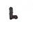

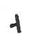

|Selection of various other auxiliary signs for reading texts|coronis diaeresis iota adscript/subscript horizontal line|ωι ῳ|crasis (= blending of two vowels), e.g. τὰ ἐκεῖ -> τἀκεῖ diaeresis, which is usually placed on ϊ or ϋ when it stands after another vowel, to show that the two vowels do not constitute a diphthong but must be pronounced separately, e.g. Μάϊος. It is usually placed above abbreviations, e.g. (= ΙΗΣΟΥΣ), or above numerals, e.g. in dates: (5838, counted from the creation of the world = year 1453 from the Birth of Christ; see also chapter 3)|In some manuscripts iota or upsilon appears with diaeresis even when standing alone (see, e.g., the Heirmologion of Grottaferrata ΕγII, f. 16v: Χρϊστός). In older manuscripts iota appears as adscript or is omitted. From the 12th/13th c. onward it is placed as subscript. In musical manuscripts it is systematically omitted.|
|---|---|---|---|---|

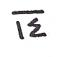

Table 2.3. Prosodic signs and other auxiliary signs for reading Greek texts: A summary.xcv
On the historical development of the prosodic signs within the framework first of the Alexandrian system and, from ca. AD 400 onward, of the Byzantine system, see
below, ch. 5, section 9, with Figure 5.22.

More recent research on Byzantine liturgical texts has brought to light other systems of punctuation, which document the existence of a many-sided
culture with regard to the reading tradition of texts. Between these systems and Byzantine ekphonetic notation there is an
inseparable relationship (see Zographou, 2010).xcvi

In the following sections we shall deal with the various types and varieties of bookhand, since
this is the script one encounters when studying manuscript sources relating to
Byzantine music, whether these are practical, music-theoretical, liturgical, literary, or
visual.

### 2.2. The majuscule script

Majuscule (Lat. maiuscula) is the name given to a script whose letters “are contained
between two parallel lines, without their strokes exceeding this double
limit.”xcvii
A great variety of forms of Greek majuscule script appears in written sources
dated from the beginnings of Greek alphabetic writing, the 8th c. BC, down to
the present. Tracing the developmental course of Greek majuscule script begins with the study
of inscriptions, where the letters are carved with a chisel in stone, first from right to left,
later boustrophedon (left to right the first line, right to left the second, again
left to right the third, etc.), and from the 5th c. BC from left to right.
From the 4th c. BC onward the use of the majuscule script of inscriptions (the
so-called epigraphic script) is also documented for the recording of literary texts on papyrus.
Until the 3rd c. AD the characters of Greek script were all majuscule. From the 4th
century onward various types of Greek minuscule script developed, first the so-called
cursive, and later also the bookhand.xcviii Table 2.4 lists some of the best-known types of
majuscule bookhand.

|Type of script|Examples, Remarks, References|
|---|---|
|Epigraphic|e.g. Papyrus Berolinensis 9875, late 4th c. BC, “perhaps the oldest literary papyrus” (Mioni, 1998, p. 64 and pl. I).|
|Bacchylidean capital|Named after the papyrus roll of Bacchylides,xcix Papyrus Londinensis 733, early 2nd c. AD (Mioni, 1998, p. 65 and pl.|
|Roman capital|Pap. Hawâra 24-28, Oxford, Bodleian Library, second half of 2nd c. AD (Litsas, 2001, pp. 12–13).|
|Biblical majuscule|• Appears at the end of the 2nd c. AD and is standardized around the middle of the 4th c. • Its establishment is linked with important historical factors: - the replacement of the roll and papyrus by the codex and parchment, - the spread of Christianity. • The most representative samples of this script are found in mss. containing the Bible, e.g. - Codex Vaticanus graecus 1209, early–mid 4th c., “the oldest codex of the New Testament”, also known as Codex B: <http://digi.vatlib.it/view/MSS_Vat.gr.1209> (25.11.2015). See also Follieri (1969, pl. 1). Litsas (2001, pp. 14- 15).|
||- Sinaitic codex Londinensis gr. Addit. 43725, beginning of the second half of the 4th c.: <http://www.codex-> sinaiticus.de/en/manuscript.aspx?book=38&chapter=13&lid=en&side=r&zoomSlider=5# (8.9.2016). See also Litsas (2001, pp. 16–17). • From the end of the 5th c. certain local peculiarities of biblical majuscule script are distinguished: - in codices from Constantinople: see the luxurious medical codex of Dioscorides in Vienna (Vindobonensis med.gr. 1), 6th c.: Mioni (1998, pp. 70–71 and pl. V). Litsas (2001, pp. 26–27). See also the Alexandrian codex of Holy Scripture Londinensis gr. Royal 1 D. v-viii, from the third quarter of the 5th c., with Constantinoplec as probable place of origin (see Figure 2.22),|
||Figure 2.22. Excerpt in copy from the Alexandrian codex of Holy Scripture, British Library, Londinensis gr. Royal 1 D. vii, f. 569r, in biblical majuscule script.ci|
||- in codices from Egypt: biblical majuscule script appears in two types: a. Alexandrian and b. Egyptian-Nitrian (from Nitria). For the second type see the Palimpsest of Ephrem (Parisinus gr. 9), with undertext of the 5th c.: <http://gallica.bnf.fr/ark:/12148/btv1b8470433r/f14.image> (17.12.2014), as well as the palimpsest codex Londinesis gr. Addit. 17211 (see above, Figure 2.20). • The purple codices of the Justinianic period constitute a special local group (see above). • After the 6th c. biblical majuscule script declines.cii|

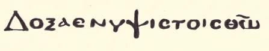

|Alexandrian or Coptic majuscule|• Used in Egypt. • An early form of this script can be found in Papyrus Rylands 470, dated to the middle of the 3rd or 4th c. AD (see Figure 2.23).|
|---|---|
||Figure 2.23. Excerpt from Papyrus Rylands 470, at an early stage of Alexandrian majuscule script. © University of Manchester.|
||• It survives mainly in codices of the 6th–10th c.: see, e.g., Mioni (1998, p. 73 and pl. VI). Litsas (2001, pp. 32–33). • It is used by the Copts as their national script. codex Marchalianus (Vaticanus gr. 2125), end of the 7th c./8th c.:|
|Ogival majuscule|• Appears in two types: a. sloping or inclined (Ital. maiuscula ogivale inclinata, Germ. Spitzbogenmajuskel): Samples survive from the 5th–9th c.: see, e.g., the Uspenskij Psalter (Petropolitanus gr. 216) of the year 862 (Litsas, 2001, pp. 38–39 and other examples pp. 33–36, 40–41). See also the Tropologion Sinaitici graeci majuscule ΜΓ 56+5, 9th c. (Nikiforova, 2015, p. 141 et passim), with photographs in Archbp. Damianos, Archim. Sophronios, Peltikoglou and Nikolopoulos (1998, photos 11, 49) and Figure 2.24 below, as well as the Tropologion Codex Sinaiticus Liturgicus, today in St Petersburg, Russian National Library 44, from the of the 9th c.” and Chronz, under|
||Figure 2.24. Excerpt in copy from the Sinai Tropologion ΜΓ 5, in majuscule ogival sloping script, 9th c. (Nikiforova).ciii|
||b. upright: see the Gospel Venetus Marcianus gr. 12 of the 9th or 10th c., which also bears ekphonetic notation, in Figure 2.25.civ|
||Figure 2.25. Excerpt from the Gospel Venetus Marcianus gr. 12, f. 218v, in majuscule ogival upright script and with ekphonetic notation.cv © Biblioteca Nazionale Marciana, Venezia.|

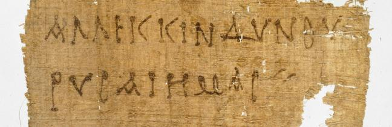
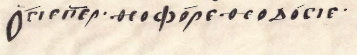

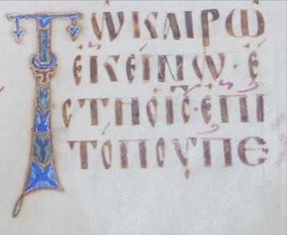

|Liturgical majuscule or liturgical rounded|• It constitutes the last historical type of majuscule script. • It was preserved until about the 11th c. • It was used in liturgical books: see, e.g., the oldest surviving Euchologion of the Byzantine type: Barberinus gr. 336, from the second half of the 8th c.cvi • Many manuscripts also bear ekphonetic notation: see, e.g., the Gospel of Iași, Central University Library Mihai Eminescu, no. 160/IV-34 of the 10th c. in Figure 2.26.|
|---|---|
||Figure 2.26. Excerpt from the Iași Gospel, f. 5r, in majuscule liturgical script, with ekphonetic notation. Source: Panțiru, Grigore. (1971). Notația și ehurile muzicii bizantine. București: Editura Muzicală a Uniunii Compozitorilor, p. 161. With the kind permission of the publishing house Editura Muzicală, Bucharest. On the unchanged form of liturgical majuscule script, see D'Agostino & Martani (2005, 23).cvii|

Display scripts

- Display scripts are majuscule scripts that

are used from the 9th c. onward in codices
with minuscule script, for the writing of titles,
chapters, scholia, initial letters, etc. (Germ.
Auszeichnungsschriften).

- Three types of display script predominate:

1. The Alexandrian display majuscule script:

used chiefly for titles in mss. with
minuscule pearl-script: see, e.g., the
Menologion of Basil II, Codex Vaticanus graecus
1613, year 979–989:
<http://digi.vatlib.it/view/MSS_Vat.gr.1613/0100>

(27.10.2015). Follieri (1969, pl. 20). Litsas (2001, pp. 78–

79, 68–69, 82–83). See also Figure 2.27.

1. The Constantinopolitan display majuscule

script (upright ogival): see Figure 2.28 and Litsas
(2001, pp. 50–51, 54–57, 62–63, 66–67, 72–73, 76–77).

1. The epigraphic display majuscule script

(elongated): see Figure 2.29 and Litsas (2001, pp. 88–89).

• Another type of majuscule display script

is the double-letter script: cf. Litsas (2001, pp. 74–75).

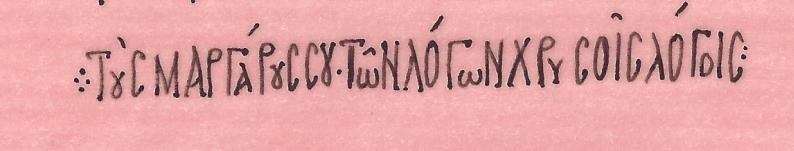

Figures 2.27–29. Display majuscule scripts:1. above:
Alexandrian.  2. In the middle: Constantinopolitan (upright
ogival).  3. Below: epigraphic (elongated). The excerpts
were copied from the codices: Vindobonensis theologicus
graecus no. 56, f. 120r | Vindob. theol. gr. no. 108, f. 122r |
Vindob. Suppl. gr. 4, f. 5r (for photographs of the original
mss., cf. Hunger, 1995, figs. 40–42).

Table 2.4. Types of majuscule script: a general overview.cviii

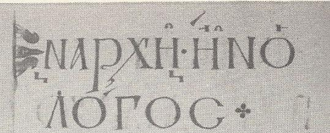

### 2.3. The minuscule scriptcix

Minuscule (Lat. minuscula) is the name given to a script whose letters are contained in an
interline space between two parallel lines, “but in addition two other parallel
lines are also required, one above and the other below, in order to enclose the strokes or other
features of the letters that extend beyond the central body.”cx
The appearance of Greek minuscule script is dated to the 4th century AD. As
mentioned above (see Table 2.1), minuscule script appears:

a. as cursive, with two branches: the Greco-Roman (4th–5th c.) and the Byzantine (from the 6th c. onward),

which, in turn, is documented in two forms, i. the common hand and ii. the bureaucratic script, and

b. as bookhand, which evolved from Byzantine cursive script, was standardized at the beginning of the 9th

century, and was used for the copying of literary and other texts.cxi
In the following Table 2.5 by the palaeographer E. M. Thompson, various forms of the
letters of minuscule Byzantine cursive script are distinguished, many of which also occur in
individual types of minuscule bookhand.

Forms of letters of minuscule Byzantine cursive script

6th c.

7th c.

8th c.

820/840

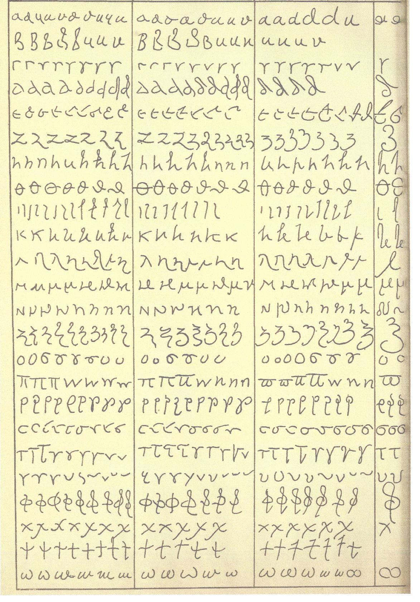

Table 2.5 Shapes and developments of Greek letters of Byzantine cursive script, between the 6th and the
first half of the 9th c.: a summary by E. M. Thompson.
Sources: Thompson (1912, p. 194:
<https://ia700407.us.archive.org/20/items/greeklatin00thomuoft/greeklatin00thomuoft.pdf> (15.2.2016). See also Mioni,
1998, p. 80).

The establishment of the minuscule bookhand is connected with the flourishing of education,
letters, and the arts during the 9th century, and especially with the beginnings of the so-called Macedonian
Renaissance after the end of Iconoclasm (726–843). Some of the very well-known names of scholars who
played leading roles, in various ways, in the renewal movement of the 9th and 10th centuries are the following: St
Theodore the Studite (759–826), John VII the Grammarian (Patriarch of Constantinople, 836–
842), Leo the Philosopher or Mathematician (ca. 790–after 869), Photius the Great (ca. 810–893?; |
Patriarch of Constantinople between the years 858–869, 877–886), Arethas of Patras (ca. 850–
ca. 944, from 902 Metropolitan of Caesarea in Cappadocia), as well as the emperors of the Macedonian
Dynasty, Basil I the Macedonian (867–886), Leo VI the Wise (886–912), and Constantine VII
Porphyrogenitus (912–959).cxii During this period the transcription (transliteration)
of many works from majuscule into minuscule script took place, often accompanied by critical
editing of the texts, through collation with other manuscripts, and by scholia. As
Mioni emphasizes, “to these copies of the 9th and 10th centuries, written in Byzantium under
imperial or patriarchal auspices, go back the archetypal codices of almost the whole
literary heritage that has reached us from ancient Greece, and very little
would have been preserved from Greek literature had this vehicle not intervened,
which is a creation of the Byzantine Renaissance.”cxiii
Moreover, the transition from majuscule to minuscule script is considered “the most radical
reform” of Greek alphabetic writing in its almost three-thousand-year history. “The
minuscule, the fruit of a slow evolution over the course of centuries, was adopted for the
copying of religious and secular manuscripts, and, passing into
printing, still represents today the normal script of the Greek
language.”cxiv
The developmental course of minuscule bookhand may be divided into various periods
(see Table 2.6).

|Period|Category of minuscule codices|
|---|---|
|9th - 10th c.||
|10th - 13th c.||
|13th - 1453||
|1453 - 20th c.||

ca.
mid-
most ancient codices
mid-
mid-
ancient codices
late
later codices
modern codices

Table 2.6. Periodization of the development of minuscule bookhand.cxv

At the beginning of its developmental course the minuscule bookhand appears as pure
minuscule, that is, only with small letters—if we except the initials of the various sections of the
text. From the 10th century onward, a slow reintroduction of majuscule characters
into the minuscule script is observed. In its long development and according to place or scriptorium, the
minuscule bookhand appears in many varieties or tendencies, a selection of which is mentioned
in Table 2.7.

|Varieties or types of minuscule bookhandcxvi|Examples, Remarks, References|
|---|---|
|Studite script|• The oldest dated manuscript in pure minuscule script is the Uspenskij Gospel (Petropolitanus graecus 219), of 835, which was copied by Hosios Nikolaos; see Figure. 2.30.|
|minuscule)|• Probably this script was standardized in the Monastery of Stoudios in Constantinople, during the years of the abbacy of St Theodore the Studite (759–826). • In contrast to cursive minuscule script, in the Studite script each letter appears with its own physiognomy. Characteristic ligatures and combinations of letters appear, the words are separated from one another, and the systematic use of accents and breathings is introduced. Figure 2.30. Excerpt from the Uspenskij Tetraevangelion, in Studite script, p. 117. cxvii © National Library of Russia, St. Petersburg.|

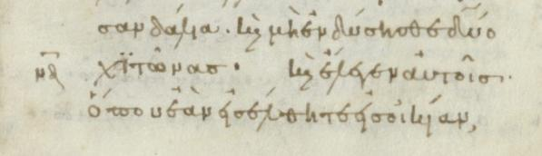

Pearl-script
(Germ.: Perlschrift)

- It survives in mss. from the end of the 10th c.–15th c., with its flourishing during the 11th century,

- “it gives the general impression of great symmetry and elegant uniformity (...) the letters take on a

rounded form and are distinguished one from another, without, however, ceasing to be joined to one another, like
pearls in a necklace.” The definition of the basic characteristics of this script and the name Perlschrift are due
to Herbert Hunger.cxviii

• A famous example is the Menologion of Basil II, Codex Vaticanus graecus 1613, year 979–989, from Constantinople:

<http://digi.vatlib.it/view/MSS_Vat.gr.1613/0100> (27.10.2015). Follieri (1969, pl. 20). Litsas (2001, pp. 78–79). See also Figure 2.31.
Figure 2.31. Beginning of Homily 89 of St
John Chrysostom, on the Gospel according to Matthew,
chapter 27, vv. 62–64, in
slightly right-leaning pearl-script, from
Manuscript no. 92 of the Seminar of Classical
Philology of the School of Philosophy of
Aristotle University of Thessaloniki
(containing sixteen parchment folios, 11th c.:
Politis, Sotiroudis and Sakellaridou-
Sotiroudi, 1991, p. 85):
<http://digital.lib.auth.gr/record/79929/files/1.pdf>

(19.8.2016). © Central Library of the Aristotle University of Thessaloniki,

Thessaloniki.

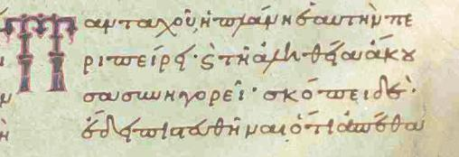

Curly (Fr.:
bouletée)

- see sample in Litsas (2001, pp. 74–75) and Figure 2.32. Figure 2.32. Letter forms of curly minuscule script, according to the codex Vaticanus graecus, Archivio del Capitolo di San Pietro B 58, f. 201r, 10th c.cxix

Angular
hooked (Germ.:
eckige Hackenschrift)

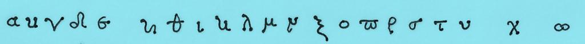

- see Figure 2.33. Figure 2.33. Copy from the codex Vindobonensis Theologicus graecus 108, f. 52r, first half of the 10th c., in minuscule “angular hooked” script.cxx

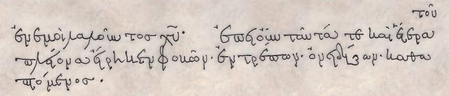

## Liturgical

Figure 2.34. Letter forms of liturgical
minuscule script, according to the codices
Vaticanus graecus 463, f. 295r, year 1062 (first
two rows) and Monastery of Sinai, New Finds X 130, 14th
c. (last two rows).cxxi

- = Minuscule script of large size and

rounded form (see sample in: Litsas, 2001, pp. 82–83). See also Figure 2.34.

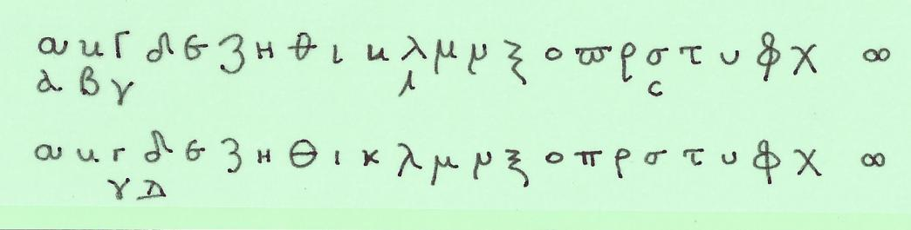

= Minuscule script with many abbreviations, e.g. in cod. Vatic. gr. 126 of the 11th c.cxxii

Philological

|Scripts of Southern Italy: • Otrantine (Terra d'Otranto) • Reggian (Reggio, Calabria) • Grottaferrata • Greco-Lombard • Anastasius • Ace of spades|• Varieties of Italo-Greek minuscule scripts survive in mss. of roughly the 9th–16th c. See, e.g., the codices Parisinus gr. 1470 of the copyist Anastasius,cxxiii Vat. gr. 2138 (Greco-Lombard), Vat. gr. 1553 (ace of spades), Vat. Barberinianus gr. 297 (palimpsest, Otrantine), Vat. gr. 1276 (Otrantine).cxxiv • One of these scripts presents a characteristic ligature of the letters ε+ρ in the shape of an ivy leaf . On the basis of this combination, the script was named “ace of spades” by the palaeographer R. Devresse.cxxv See, e.g., Figure 2.35. Figure 2.35. Two lines from the sticheron “Χρυσέοις ἔπεσι” for the commemoration of St John Chrysostom, 27 January, from the new finds of the Monastery of Sinai, Μ 167, 9th–10th c., in minuscule “ace of spades” script (Archbp. Damianos, Archim. Sophronios, Peltikoglou and Nikolopoulos, 1998, photograph 144). © Holy Monastery of Saint Catherine, Sinai.cxxvi (στε)φανον ἐξ ἀκηράτων ἀνθέων πλεξαμένη τοῖς ᾄσμασιν τῇ ἱερᾷ σου προσφέρει μνή(μῃ)|
|---|---|
|Unevenly rounded (Germ.: Fettaugen)|• In various manuscripts of the Palaiologan period, the palaeographer Herbert Hunger observed the use of letters of unequal size, from very small to even excessively large (especially the rounded letters ο, ω, β, θ, σ). See, e.g., ms. Vaticanus graecus 1899, f. 148r, year 1261–1282, in minuscule “unevenly rounded” script, autograph of Theodora Palaiologina Kantakouzene Raoulaina (Litsas, 2001, pp. 96–97) and the excerpt in Figure 2.36 below. • On the basis of the general appearance presented by such manuscripts, Hunger spoke of a ‘Fettaugen-Mode’ (“fat-eyes fashion”) in manuscripts of the 13th–14th century.cxxvii Figures 2.36–37. Excerpt from the Tropologion in ms. Vindobonense theol. gr. 146, f. 24r, 13th c., in unevenly rounded, slightly right-leaning script (cf. also Alygizakis, 1985, pl. 48). © Österreichische Nationalbibliothek, Wien.  Fettaugen (fat eyes) in a soup.|

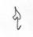
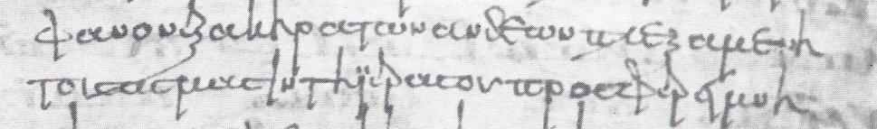
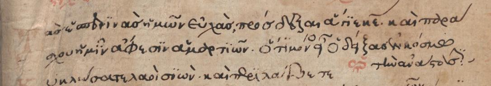
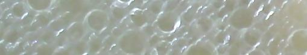

|Metochites|• A well-known late Byzantine minuscule script, which took its name from the writing style of Theodore Metochites (1270–1332), the famous humanist of the Palaiologan period and renovator of the Holy Monastery of Chora in Constantinople (1316–1321). To this monastery the imperial library had been transferred after the recapture of the City in 1261, and to the same monastery Theodore Metochites—who at the end of his life had become a monk with the name Theoleptos—bequeathed his important private library.cxxviii • It is a legible script with a careful proportion of broad and narrow forms of its letters and with few abbreviations (see Figures 2.38–39) Figures 2.38–39. Copy from the codex of the Monastery of Xeropotamou, Mount Athos, no. 222, f. 234r, year 1345, in minuscule “Metochites” script.cxxix  The logothete Theodore Metochites dedicating to the Lord Jesus Christ—“the Chora of the living”—the renovated church of the Monastery of Chora. Mosaic in the same church, year 1315–1320.cxxx|
|---|---|
|Monastery of Hodegon|• Minuscule script that developed in the Holy Monastery of Hodegon in Constantinople and is characterized by elements such as the “alternation of large and small letters, the proportion of vertical and diagonal lines, freedom in the direction of the writing, (...) sporadic exceeding of the limits of the written surface”.cxxxi Cf. Figure 2.40. • It survives in mss. of the 14th–16th c. Figure 2.40. Forms of the letters of the “Hodegon” script, according to the codex Vaticanus Chisianus gr. R V 29, f. 242v, year 1394. In the last row the combinations ει and εξ are visible, while the penultimate, large form is another form of the letter ζ.cxxxii|

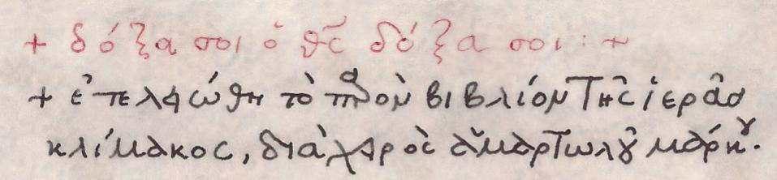
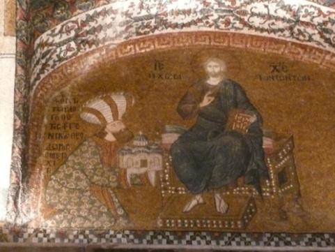
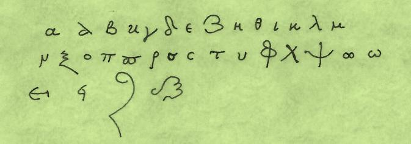

|Typographical (Germ. "Druckminuskel")|• Two years after the Fall of the City, Johannes Gutenberg issued the first major printed edition in Europe, the Holy Bible in Latin, also known as the Gutenberg Bible (Mainz, 1455).cxxxiii During the second half of the 15th century the first books in Greek were also printed. Particularly important in this direction was the contribution of Cretan copyists and of the publisher Aldus Manutiuscxxxiv (see Figures 2.41–42). Figures 2.41–42. Aldus Manutius (1449–1515), leading Italian humanist and the best-known publisher of the Renaissance period.cxxxvi  Sample of one of the oldest Greek printed books, in cursive minuscule script: an incunable with works of Aristotle, in an edition by Aldus Manutius (Venice, 1495–1498), preserved in the Image sources: <https://commons.wikimedia.org/wiki/File:Aldus_Manutius.jpg#/media/File:Aldus_Manutius.jpg> (21.07.2015). <https://commons.wikimedia.org/wiki/File:Aristoteles_opera_aldus_1495.jpg#/media/File:Aristoteles_opera_aldus_1495.jpg> (21.07.2015). Bayerische • In turn, printed books became models for imitation for various copyists. The corresponding handwritten minuscule script was called “typographical”: see, e.g., mss. Vaticanus gr. 588 of the year 1552 or Vaticanus Urbinas 149 of the year 1560.cxxxv Staatsbibliothek München.cxxxvii|
|---|---|
|School of Luca Bozeu|• From bibliographical centres in Romania a type of Greek minuscule script is known that can be described as “upright, square, large-sized”. It is documented in mss. of the 16th–17th century and was called that of the “School of Luca Bozeu”.cxxxviii This is the learned prelate Luca, bishop of Buzău (1583–1603) and Metropolitan of Ungro-Wallachia (1603–1629).cxxxix See Figure 2.43. Figure 2.43. Excerpt from the ms. of the Monastery of Great Vatopedi, Greek 1048, f. 104v, year 1642, in minuscule script of the “School of Luca Bozeu”, with the colophon of the copyist, the archpriest Iakovos.cxl © Monastery of Great Vatopedi, Mount Athos.|

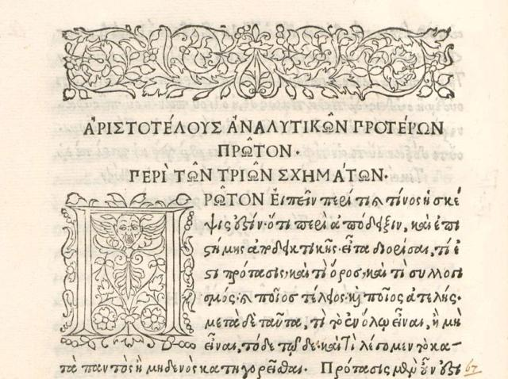
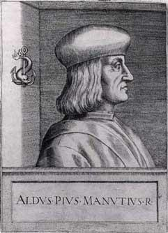

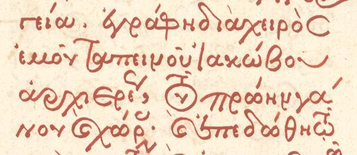

Xeropotamou or
Athonite I

• This is an important type of minuscule script of the post-Byzantine period, which is associated with the

Figure 2.44

scriptoria of Mount Athos.

Copy from the ms.
of the Monastery of St John
the Theologian, Patmos,
Greek 558, f. 113r, year
1648, in
minuscule script
of the “Xeropotamou”
or “Athonite I” type, with
the photagogikon of the plagal
fourth mode.cxlii

• It is characterized as “calligraphic, right-leaning, angular, large-sized”cxli (see Figure 2.44).

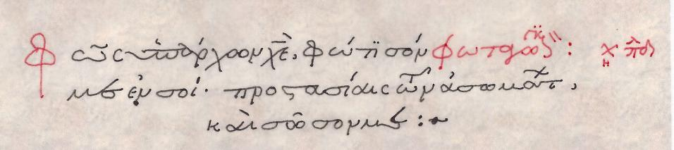

Sample of
minuscule
script of the 19th c.

• If in Byzantine

Figure 2.45

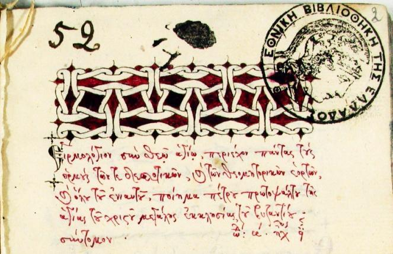

and post-Byzantine codices,
until approximately the 17th century,
we can distinguish
various standardized types
of minuscule bookhand,
in the late post-Byzantine
period and modern times,
standardized scripts give
way to the personal handwriting of
each copyist (see, e.g., Figure 2.45).

Excerpt from the
codex of the National
Library of
Greece 964, f. 2r,
autograph of Petros
Byzantios, of the year
1806, with the title of
his Short Heirmologion.c xliv © National
Library of
Greece, Athens.

• For practice in reading

manuscripts in minuscule script
of the 19th c., see the autograph theoretical
texts of Chrysanthos of Madytos and Chourmouzios

Chartophylax.cxliii

Table 2.7. Types of minuscule script from the 9th to the 19th century: an open list

### 2.4. Aids for reading manuscripts

The reader of manuscripts in majuscule and minuscule script today is confronted not
only with a multitude of forms of the individual letters of the Greek alphabet, but also with various
old habits of copyists, such as ligatures and varied abbreviations, which
accelerated the process of copying and saved space on parchment or on some other writing
material. Table 2.8, based on E. Mioni, records the corresponding categories of graphic
procedures and contains a selection of abbreviations, as an aid for the first steps in reading
Greek manuscripts.cx lv

|Category of graphic procedure|Examples and clarifications|
|---|---|
|1. Contractions: Only the beginning and the end of a word are written, omitting its central part. Used especially in the|ΑΝ(ΘΡΩΠ)ΟΣ ΑΝ(ΘΡΩΠΟ)Υ ΑΝ(ΘΡΩΠ)Ω ΑΝ(ΘΡΩΠ)ΟΝ|
|recording of sacred names (Lat. nomen sacrum - pl. nomina sacra), but not only.|ΒΑ(ΣΙΛΕ)ΥΣ ΔΑ(ΥΙ)Δ Θ(ΕΟΤΟ)ΚΟΣ Θ(ΕΟ)Σ Ι(ΣΡΑ)ΗΛ Ι(ΕΡΟΥΣΑ)ΛΗΜ Ι(ΗΣΟΥ)Σ Κ(ΥΡΙΟ)Σ Μ(ΗΤ)ΗΡ ΟΥ(ΡΑ)ΝΟΣ Π(ΑΤ)ΗΡ ΠΝ(ΕΥΜ)Α Σ(ΩΤ)ΗΡ ΣΤ(ΑΥΡΟ)Σ Υ(ΙΟ)Σ Χ(ΡΙΣΤΟ)Σ|
||These and other derivative words are usually written contracted. From the ending of the contraction one can see the case in which the corresponding word stands (see the example of the word “man”, which could also be continued in the plural).|

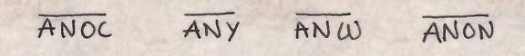
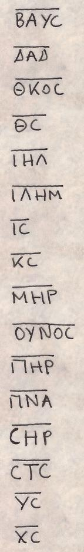

#### 2. Truncation or suspension

Endings

Prepositions, conjunctions
and adverbs

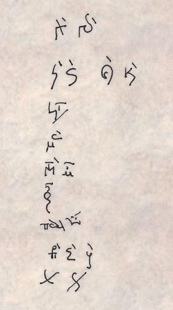

Abbreviation of the end of a word,
especially in endings of nouns
and verbs (it is usually placed
slightly higher than the
other letters of the word).
It also appears in prepositions,
conjunctions and adverbs, sometimes
also in frequently repeated
common words (in
this case as a genuine
tachygraphic element).

γὰρ

αι
αν

καὶ

ας

κατὰ

αις

μὲν

μετὰ

ειν
ιν
ην

οὖν

πάλιν

πρὸς

εν

ὑπὲρ

ες

Some common words

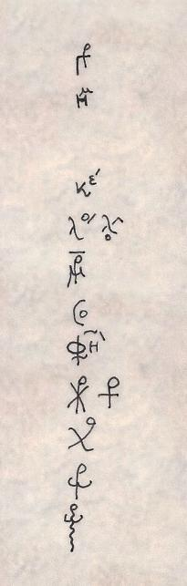

ης
ις
εις

is written

ἡμῶν

μένος

chapter
discourse
martyr
holy one
he says
Christ
time
hour
beautiful

οις

ον

ος

ου

ουν

ους

ων

ως

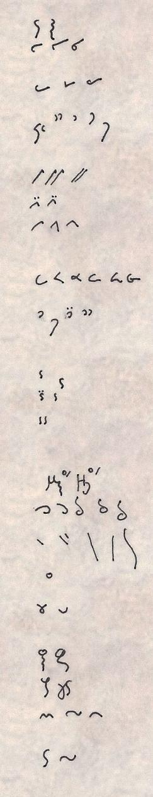

- Examples of combinations from majuscule script:

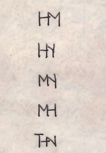

#### 3. Joining of letters

Two or more letters
are joined together,
creating

i. ligatures (through the

extension of the initial and
final strokes of the corresponding
letters) or
ii. combinations (certain elements
from one letter
are also used for the
following letter).cxlvi

ΗΜ

ΗΝ
ΜΝ

ΜΗ

ΤΗΝ

• Examples of ligatures and combinations from minuscule script:

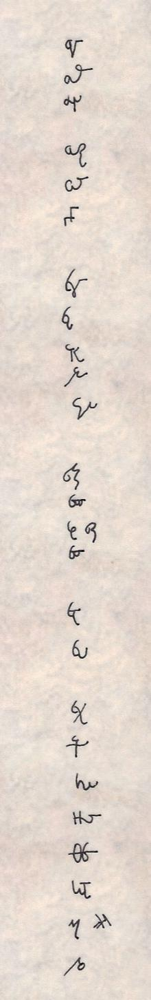
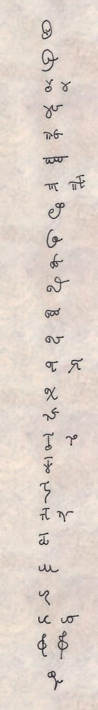

αγ

αθ

αν

αρ

ασ

γγ

εγ

ει

εκ
ελ
εν

εξ

επ

ερ
εσ

ετ

ευ

εχ

εψ

ην

ησ

θε

κτ

λλ

λο

ον

οσ

ου
ουσ

πε

ππ

πτ

ρω

σα

σε

σθ

σπ

σσ

στ

σχ

τε

το

του

τρ

ττ

τω

υν

υρ

υσ

φρ

ων

#### 4. Tachygraphic signs and

symbols: Used
chiefly in texts of various
sciences and arts (e.g.
astronomy, mathematics, psaltic art

etc.) and replace whole

words. Beside are
only a few examples. The
tachygraphic sign for
“monk”/“nun” appears
frequently in musical mss., in
the rubrics.

δὲ

sun
monk, nun

is

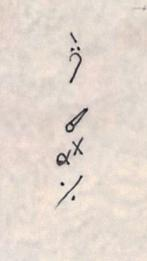

Table 2.8. Types of graphic procedures for economy of space and time: contractions, truncations, joinings of letters
and tachygraphic symbols: open lists, according to E. Mioni.cxlvii

In addition, the so-called reference signs constitute a very interesting case. These make the
connection between the text and related notes placed in the margins (edges) of the folios of the
manuscript, functioning roughly like the asterisks and numbers that we use today for
references. They present a great variety of shapes, such as, for example, small wavy lines, arrows,
keys, and many others, some of which coincide with forms of neumes of Byzantine
notation.cxlviii

### 2.5. Special symbols for the edition of manuscript sources

In preparing editions that are based on manuscript sources, palaeographers use special
symbols that enable the reader to distinguish between those elements that
come from the manuscript source and the others that constitute an intervention by the palaeographer.
The symbols listed below are used chiefly in critical editions
of literary textscxlix and may also be used, with certain adaptations, for the
restoration of texts with Byzantine notation.

(

)

Parentheses, for the expansion of abbreviations in the original text.

[ ] Square brackets, for an editor’s supplement where some element has been lost in the
original text.

< > Angle brackets, for an editor’s supplement where no element has been lost in the
original text.

{ }

|

‖

Braces, for elements that exist in the manuscript in the specific
form, but which should be removed or corrected in the opinion of the editor.

A vertical bar for indicating the end of a line of the manuscript or for marking
a change of folio in the manuscript. In the latter case the number
of the new folio is also given.

A double vertical bar for indicating the end of a paragraph in the manuscript.

Double square brackets, for letters that have been erased in the original text
or for sign-phonemes (σημαδόφωνα) that have been erased and/or are not clearly visible in the original.

Letters that are not clearly visible in the manuscript take a dot beneath.

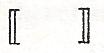
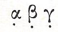

...

† †

A number of dots corresponding to the number of letters (with or without musical signs,
depending on the source) that are not clearly visible in the source.

Daggers, marking an erroneous passage that could not be corrected by the
editor (locus desperatus).

[± 5]

] and

[

deest, desunt

deleatur

in marg.

om.

sic

scil.

vacat

Square brackets with an indication of the approximate number of letters that have been lost (here

e.g. five letters). It is used extensively in Papyrology.

Reversed square brackets, usually in editions of fragmentary papyri, for
text lost at the beginning or at the end of a line.

(Lat. = is lacking, are lacking), for words, lines, or neumes that are missing in comparison with another
source.

(Lat. = to be deleted), for letters or words that should be erased.

or in margine (Lat. = in the margin): used to indicate elements recorded
in the margin of the manuscript.

Abbreviation of the Latin word omisit (⁼ omitted).

(Lat. = thus), an adverb used by the editor to confirm a
particular, sometimes perhaps even erroneous, variant or spelling of a source, which
he reproduces exactly in his text.

Abbreviation of the Latin word sci-licet (⁼ it is understood), which is used for
supplementing elliptical phrases of the original.

(Lat. = it is empty, free), to indicate a blank in a line or a folio.

## Assessment criteria for Chapter 2

Assessment criterion 1

Exercise in majuscule writing 1. The oldest surviving hymn to the Mother of God
from Papyrus Rylands 470, in an early stage of majuscule Alexandrian
script

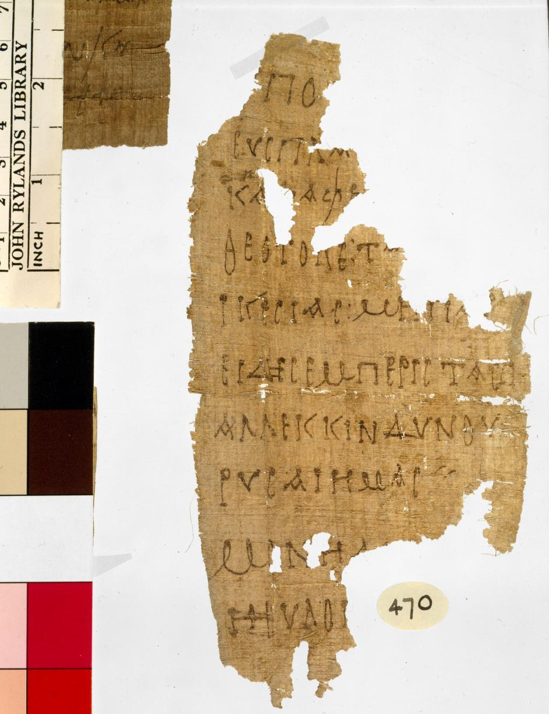

cl
Figure 2.46.a. The Papyrus no. 470 from the John Rylands Library, University of Manchester, mid-3rd or 4th c.
Noteworthy are the two small curved signs after the word “Theotokos” in the fourth line, the two acute accents at the end of the eighth
line, as well as the colon after the word “ikesias” (“supplication”). These signs probably relate to the loud
reading or the musical performance of the hymn. See also endnote xcvi. © University of Manchester.

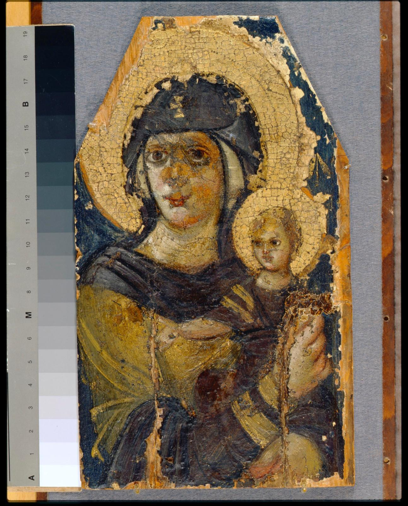

Figure 2.46.b. Icon with an early iconographic type of the Most Holy Theotokos with the Divine Child, from the first half of the
6th c. It precedes the very well-known Byzantine type of the Virgin Hodegetria. It comes from the Holy Monastery of Saint
Catherine on Sinai and today is in the Bohdan & Varvara Khanenko National Museum of Arts. It is one
of the oldest icons of the Virgin preserved to the present day. It is related to the painting of ancient
portraiture, which is known from the famous Faiyum portraits in Egypt. It was executed in the
so-called encaustic technique, which was more generally in use in the art of painting in the Hellenistic and
Early Christian periods.cli © Bohdan and Varvara Khanenko National Museum of Arts, Kiev.

Assessment criterion 2

Exercise in majuscule script 2.
The Hymn of Love

1. from the earliest codex of the New

(Codex B), p. 1472, 4th c. (early–mid), in
probably from Egypt:clii <http://digi.vatlib.it/view/MSS_Vat.gr.1209/1476>

1. `

-    

Testament, Codex Vaticanus graecus 1209
biblical majuscule script,

 &
2. from the Alexandrian Codex of the Bible, British Library, Londinensis gr.

Royal 1 D.viii, fol. 97r-v, 3rd quarter of the 5th century, in biblical majuscule script,
from the zone of the Eastern Mediterranean (perhaps Constantinople):cliii see Figures

2.47.a-b.

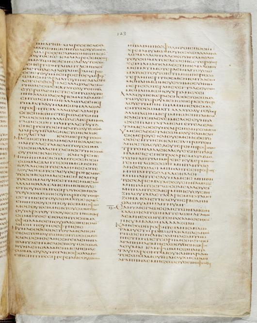

Figure 2.47.a. The Alexandrian Codex of the Bible, Londinensis gr. Royal 1 D.viii, fol. 97r (5th c.), in
biblical majuscule script.cliv The text of the Holy Apostle Paul, 1 Cor. 12:3–13:3, is visible. In the
lower part of the second column, where the arrow is, the beginning of the Hymn of Love (1 Cor. 13:1) is visible.
Source photograph: <http://www.bl.uk/manuscripts/Viewer.aspx?ref=royal_ms_1_d_viii_fs001r#> (8.11.2016).

© British Library Board Royal 1 D.viii.

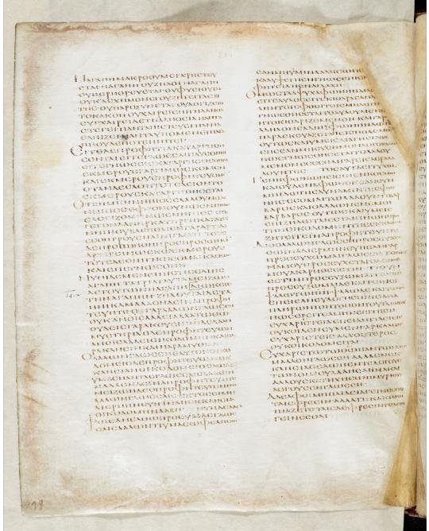

Figure 2.47.b. The Alexandrian Codex of the Bible, Londinensis gr. Royal 1 D.viii, fol. 97v, with the
continuation of the Hymn of Love (1 Cor. 13:4–13). At the arrow the hymn is completed and chap. 14:1-

1. Source photograph: <http://www.bl.uk/manuscripts/Viewer.aspx?ref=royal_ms_1_d_viii_fs001r#>

(8.11.2016). © British Library Board Royal 1 D.viii.

Assessment criterion 3

Exercise in majuscule script 3. The oldest witness to the Great
Doxology (Gloria) from the Alexandrian Codex of the Bible, British Library,
Londinensis gr. Royal 1 D.vii, in biblical majuscule script (3rd quarter of the 5th c.).

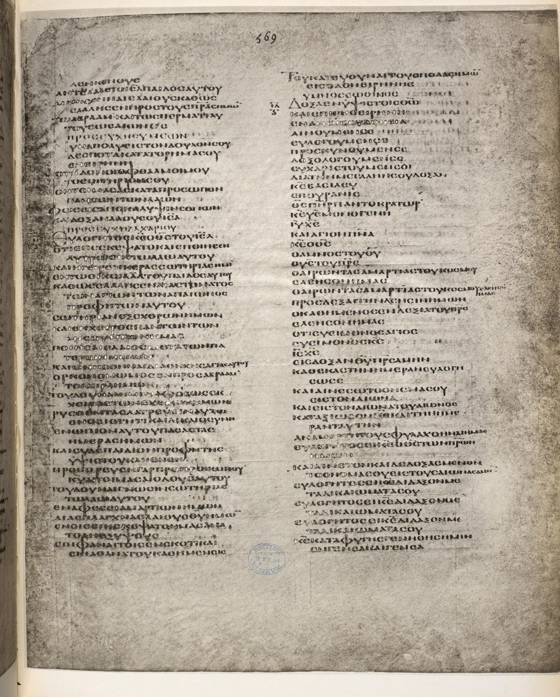
















Figure 2.48.a. The Alexandrian Codex of the Bible, Londinensis gr. Royal 1 D.vii, fol. 569r (5th c.), in
biblical majuscule script. In the column on the right the “Morning Hymn” (the Great Doxology) is visible, written
“stichērōs” (line by line).clv
Source photograph: Thompson, E. Maunde. (Ed., 1883). Facsimile of the Codex Alexandrinus. London: British
Museum, vol. III. See high-resolution photographs at: <www.csntm.org/Manuscript/View/GA_02> (27.12.2016).

© British Library Board Royal 1 D.vii.

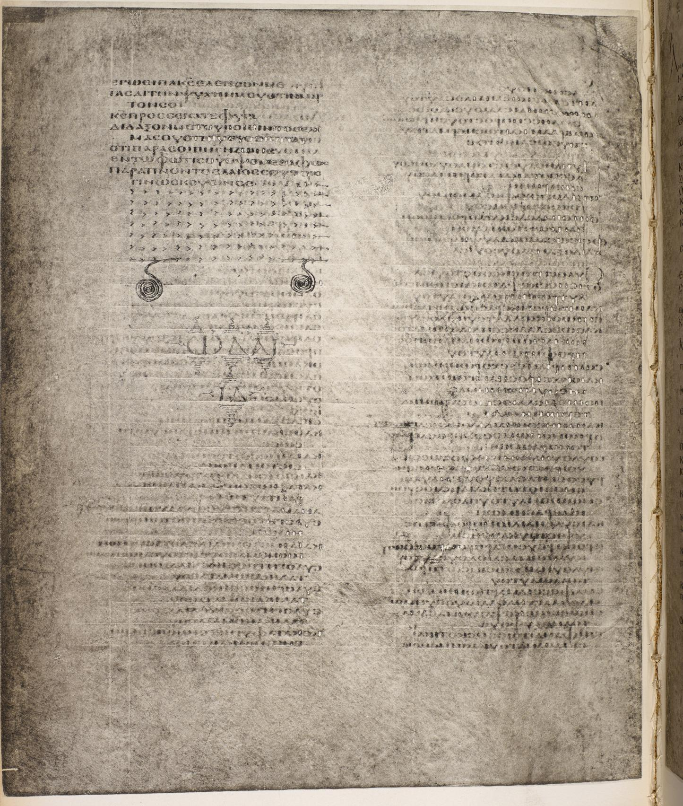

Figure 2.48.b. Londinensis gr. Royal 1 D.vii, fol. 569v (5th c.), in biblical majuscule script. End of the Great
Doxology.
Source photograph: Thompson, E. Maunde. (Ed., 1883). Facsimile of the Codex Alexandrinus. London: British
Museum, vol. III. See high-resolution photographs at: <www.csntm.org/Manuscript/View/GA_02> (27.12.2016).

© British Library Board Royal 1 D.vii.

Assessment criterion 4

Exercise in majuscule script 4. Example from the oldest known
Greek Tropologion (Τροπολόγιο), consisting of two fragments of the New Finds
of the Holy Monastery of Sinai, which originally belonged to the same codex: Greek MS ΜΓ
(=majuscule) 56 (5 folios) and Greek ΜΓ 5 (240 folios), in
sloping pointed majuscule script, second half of the 9th century
(Nikiforova, 2015, pp. 138, 141, 172. Géhin & Frøyshov, 2000, pp. 178-179. Archbp. Damianos, Archim.
Sophronios, Peltikoglou and Nikolopoulos, 1998, photos 11, 49).

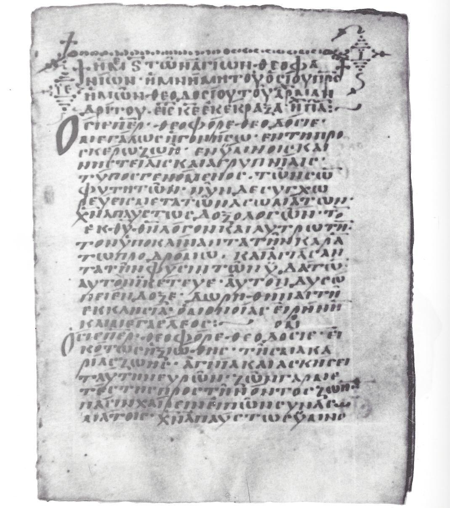

Figure 2.49. Fragment from the Tropologion Sinaiticus graecus ΝΕ ΜΓ 5, second half of the 9th c., in sloping pointed
majuscule script, with evening stichera for the feast of St Theodosius the Coenobiarch (Nikiforova, 2015, p. 144). The title
is in biblical majuscule script. Image source: Damianos, Archbishop of Sinai, Pharan and Raitho, Sophronios
Archimandrite, Peltikoglou, V. and Nikolopoulos, P.N. (1998). Holy Monastery and Archbishopric of Sinai. The New
Finds of Sinai. Athens: Ministry of Culture - Mount Sinai Foundation, , photo 49. © Holy Monastery of Saint Catherine,
Sinai.

Assessment criterion 5

Exercise in majuscule script 5. Example from the Gospel Venetus
Marcianus gr. 12, in upright pointed majuscule script, with ekphonetic
notation.

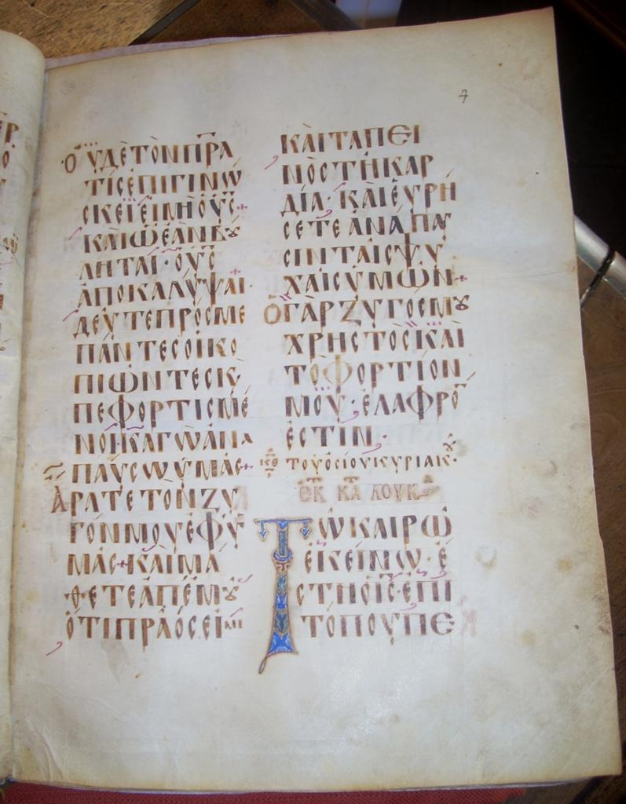

Figure 2.50. The Gospel Codex Venetus Marcianus gr. 12, 9th-10th c., fol. 7r, in upright pointed majuscule
script, with ekphonetic notation. For the headings the same majuscule script is used, in a smaller
module. On this folio an excerpt from the Gospel according to Matthew 11:27-29 is visible.clvi © Biblioteca
Nazionale Marciana, Venezia.

Assessment criterion 6

Exercise in reading and transcribing minuscule script 1. From the
Uspenskij Tetraevangelion, written by Saint Nicholas the Stoudite, in
Studite script, which constitutes the first dated monument in
minuscule script.

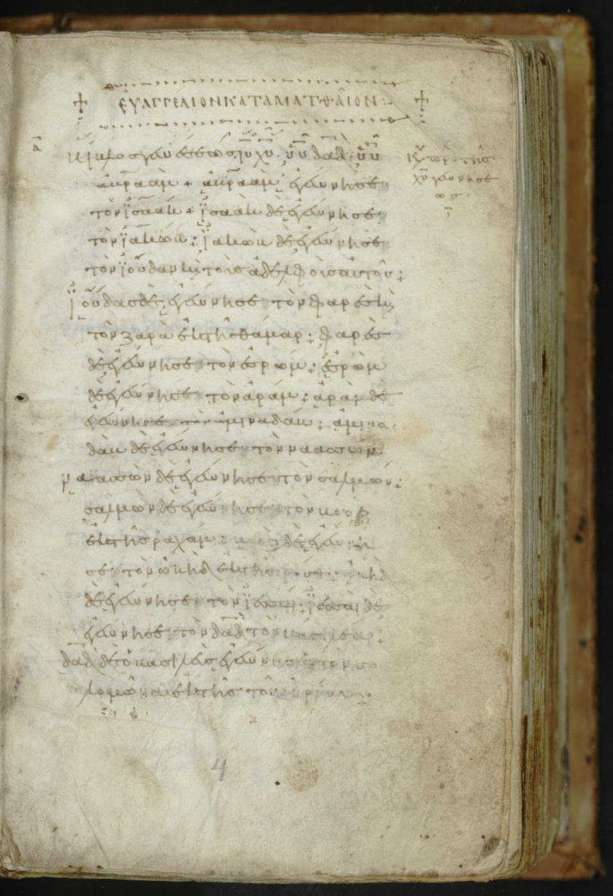

Figure 2.51. The Uspenskij Tetraevangelion (Codex Petropolitanus graecus 219), year 835, fol. 4r. The earliest
dated manuscript in pure minuscule script (Studite), written by Nicholas, monk of the Holy Monastery of
Stoudios, Constantinople. The title is in Constantinopolitan display script (upright pointed
majuscule). On this page the beginning of the Gospel according to Matthew 1:1-6 is visible, with the beginning of the genealogical
tree of Christ.clvii A very interesting combination of prosodic signs, punctuation, and a kind of
proto-ekphonetic notation can be discerned (see also ch. 4). © National Library of Russia, St. Petersburg.

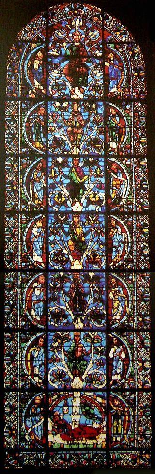

Figure 2.52. The tree or root of Jesse: stained glass in the Gothic cathedral at Chartres, France, c. year 1145 - known
as the earliest witness to this iconographic type. It depicts the forefathers of Christ, beginning with
Jesse, father of King David.
Source photograph: <https://commons.wikimedia.org/wiki/File:France_Chartres_JesseTree_c1145_a.JPG> Photograph

T. Taylor (31.12.2016).

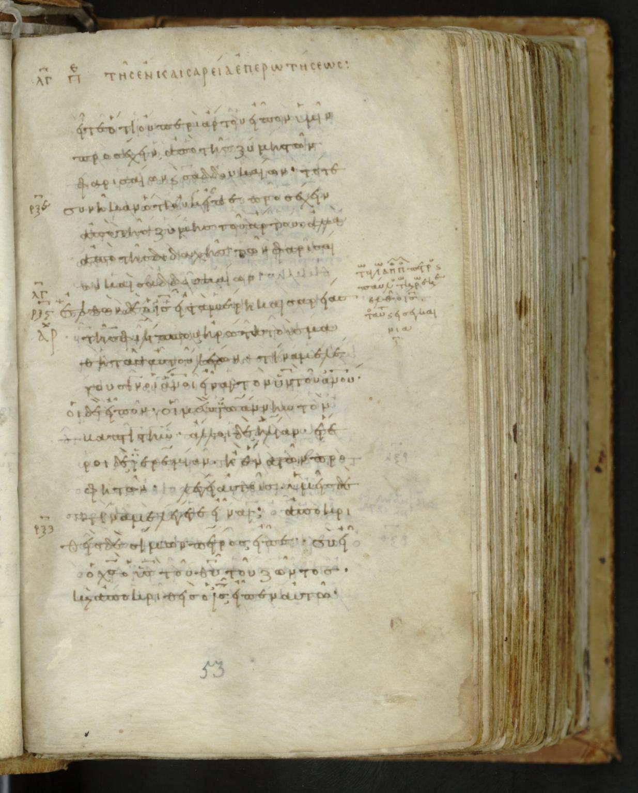

Figure 2.53.a. The Uspenskij Tetraevangelion (Codex Petropolitanus graecus 219), year 835, fol. 53r. The earliest
dated manuscript in pure minuscule script (Studite), written by Nicholas, monk of the Holy Monastery of
Stoudios, Constantinople. On this page an excerpt from the Gospel according to Matthew 16:11-17 is visible.
Noteworthy is the use of a double grave accent on the words “de” and “men”, double accentuation on the word “eipon”, and a wavy
line on the word “Iōannēn” (see Figure 2.53.b). © National Library of Russia, St. Petersburg.
Figure 2.53.b. Copy of the signs which present a
special use of symbols, probably to indicate a specific
movement of the voice during the melodic recitation of the text: Petrop.
gr. 219, fol. 53r. Similar use of a double grave accent is also observed on

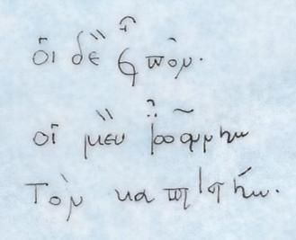

fols. 69r, 73r, 78v, 80r, 105v. Cf. also endnote xcvi in

the present chapter.

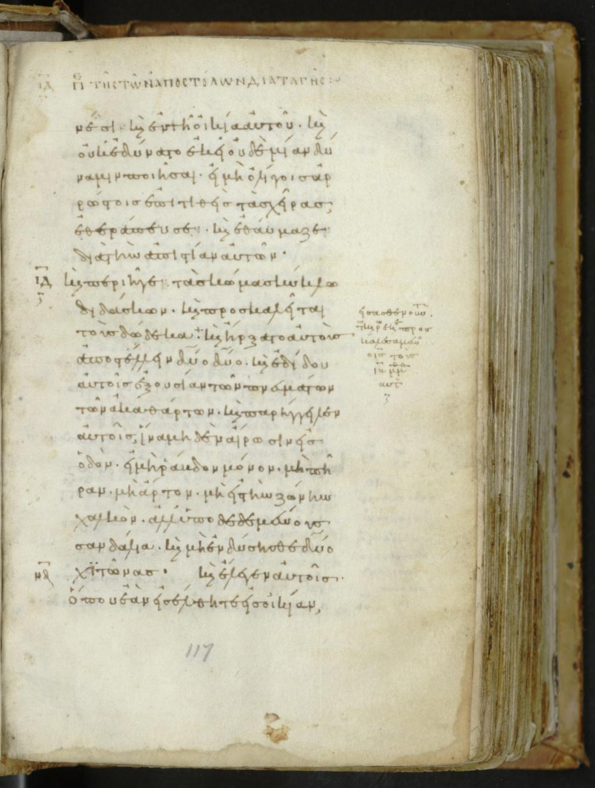

Figure 2.54.a. The Uspenskij Tetraevangelion (Codex Petropolitanus graecus 219), year 835, fol. 117r, with an excerpt from the
Gospel according to Mark 6:4-10.
Noteworthy is the use of a wavy line (known in ekphonetic notation as “syrmatic”) on the words
“two by two” (see Figure 2.54.b). © National Library of Russia, St. Petersburg.
Figure 2.54.b. Copy of the sign with the two “syrmatics” as
indications of a special movement of the voice during the reading of the
text: Petrop. gr. 219, fol. 117r.

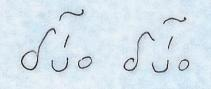

Assessment criterion 7

Exercise in reading and transcribing minuscule script 2. From the Psalter of the
Holy Monastery of Great Lavra on Mount Athos, Δ 70, 10th c., written by
John, in a preliminary stage of Perlschrift.

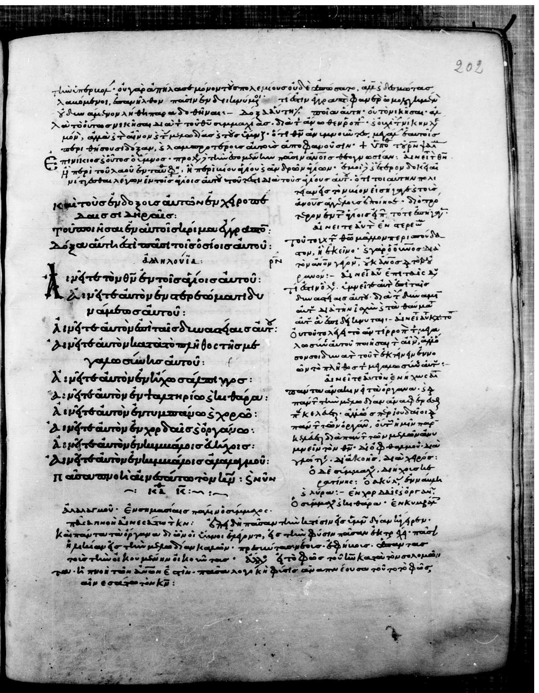

Figure 2.55. Codex Laurensis Δ 70, Holy Monastery of Great Lavra on Mount Athos, year 984: Psalter with a so-called

catena (exegetical chain) in the margins of the MS, written in the aforementioned Holy Monastery by the scribe John, in
upright minuscule script, “preliminary stage of pearl-script - Perlschrift”.clviii In the present image: fol. 202r, with
Psalm 149, vv. 8.2-9 and Psalm 150 in full, together with the corresponding catena. © for the photograph from microfilm:
Patriarchal Institute for Patristic Studies, Thessaloniki.

Assessment criterion 8

Exercise in reading and transcribing minuscule script 3. The Life of Saint
Romanos the Melodist in pearl-script (Perlschrift), from the famous
Menologion of Emperor Basil II, Codex Vaticanus gr. 1613, p. 78, years 979-
989, Constantinople. The title is in Alexandrian majuscule display script:
<http://digi.vatlib.it/view/MSS_Vat.gr.1613/0100> (27.10.2015).
Printed editions: Follieri (1969, pl. 20) and Litsas (2001, pp. 78-79).

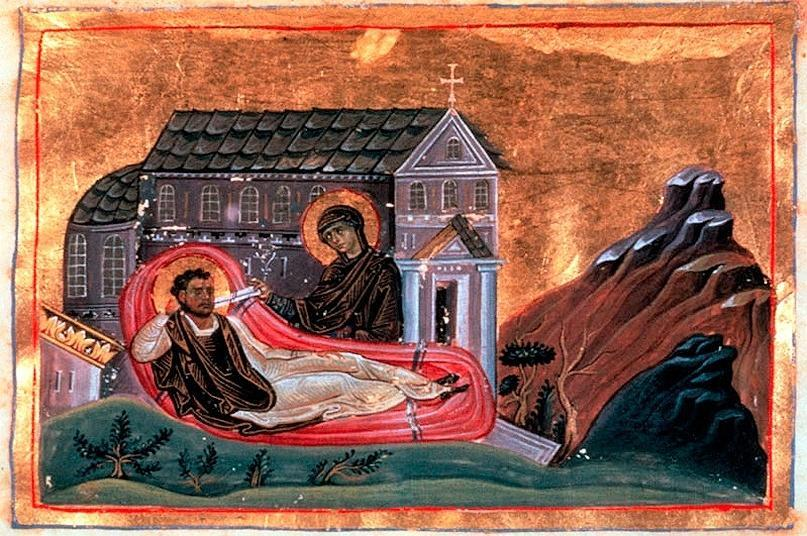

Figure 2.56. Miniature from the Menologion of Basil II, Cod. Vaticanus gr. 1613, p. 78, years 979-989.
Source photograph: <https://commons.wikimedia.org/wiki/File:Romanos_the_Melodist_(Menologion_of_Basil_II).jpg>

(8.9.2016).

Assessment criterion 9

Exercise in reading and transcribing minuscule script 4.
Troparion to the Most Holy Theotokos, which is chanted in the Small and the Great
Paraklesis Canon (Ὡρολόγιον, 2003, pp. 544 and 560), from the Hagiasmatarion (Αγιασματάριο) of the
Seminar of Classical Philology of the Faculty of Philosophy of Aristotle
University of Thessaloniki, MS no. 36, in liturgical right-slanting script, 17th
c. (Politis, Sotiroudis and Sakellaridou-Sotiroudi, 1991, pp. 36-37).

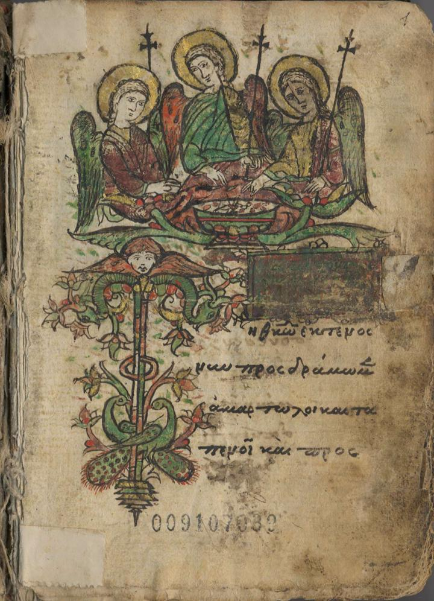
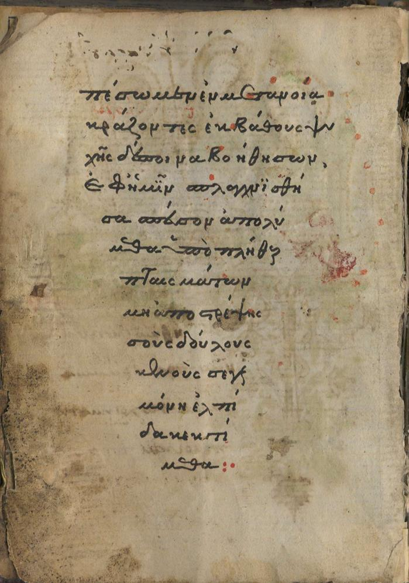

Figure 2.57.a-b. Hagiasmatarion from the Seminar of Classical Philology of the Faculty of Philosophy of Aristotle University of Thessaloniki, MS no. 36, 17th c., fols.
1a-b, in liturgical right-slanting script, with a miniature of the Holy Trinity in the form of Three Angels blessing the water, and with a decorated initial.clix

© Central Library of AUTH.

For a more detailed description and more photographs of the MS, see: <http://digital.lib.auth.gr/collection/Manuscripts?ln=el> (no. 25, [ARC-2007-38241]) and
<http://digital.lib.auth.gr/record/80022/files/1.pdf> (19.8.2016).

Assessment criterion 10

Exercise in reading and transcribing minuscule script 5.
The Introduction to the Theory and Practice of Ecclesiastical Music by
Chrysanthos was a basic teaching manual for learning the New
Method in the years after the Reform of the Three Teachers (1814-15).clx
In the MS of the Holy Monastery of Karakallou 260, from the beginning of the 19th c., fol. 1a, a
different version of the text with the same title is visible, written in minuscule
slightly right-slanting script.

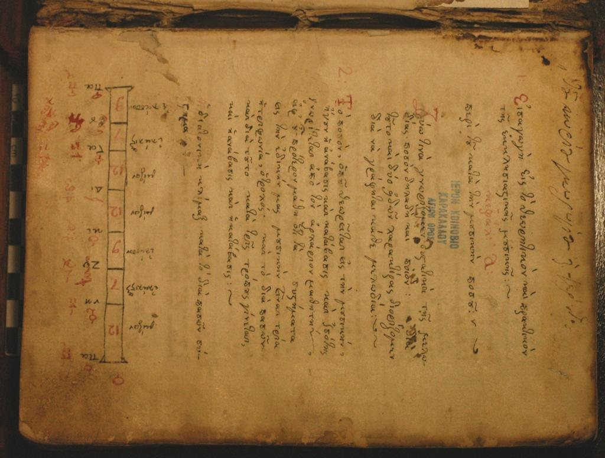

Codex of the Holy Monastery of Karakallou, no. 1773/260 (Lampros) / no. 223 (Stathis), fol. 1a, beginning of the 19th c., according
cataloguer (Stathis, 1993, pp. 431-432). On pp. 1-36 of the codex is included as

Figure 2.58.
to the aforementioned
a protheory of the New Method the
minuscule slightly right-slanting
Method. © Holy Monastery of Karakallou,

“Introduction to the Theory and Practice of Ecclesiastical Music”, in
script. It is followed by the Anastasimatarion of Petros Peloponnesios with the sematophones (σημαδόφωνα) of the New
Mount Athos.

### Assessment criterion 11

### Exercise in creating mnemonic cards for Chapter 2

## Bibliography for Chapter 2

of ancient Greek, Latin, and Byzantine literature

The Holy Bible and texts

The New Testament. The original text with translation into demotic Greek. (2003). Athens: Hellenic Bible Society.
Saint Theodore the Studite, Ascetic Chapters. Edition of the Men's Holy Monastery of Ano Xenia, 1998.

Herodotus, Histories. Trans. H. Spyropoulos. (1992). Herodotus, Histories. Melpomene-Terpsichore. Athens: Govostis:
<www.greek-language.gr/digitalResources/ancient_greek/library/index.html?start=30&author_id=all> (30.1.2017).
Tsantsanoglou, Kyriakos. (2013). The Derveni Papyrus. Ministry of Culture and Sports. Athens.

Pliny the Elder, The Natural History. Trans. John Bostock, M.D., F.R.S., H.T. Riley, Esq., B.A. (1855). London: Taylor
and Francis, Red Lion Court, Fleet Street:
<www.perseus.tufts.edu/hopper/text?doc=Perseus%3Atext%3A1999.02.0137%Abook%3D13%3Achapter%3D21>

(30.1.2017).

Liturgical books, musical collections, and editions of liturgical manuscript codices

Menaion for November. (2002). (2nd ed.). Athens: Apostoliki Diakonia of the Church of Greece.
Stephanos the Lampadarios. (Reprint of the 1883 edition). Musical Beehive. Neapolis, Crete: Polychronakis.
Lenten Triodion. (1994). Athens: Apostoliki Diakonia of the Church of Greece.
The Great Horologion. (2003). (15th ed.). Athens: Apostoliki Diakonia of the Church of Greece.

Parenti, Stefano and Velkovska, Elena. (Eds., 1995). L' Eucologio Barberini gr. 336 (ff. 1 - 263). Roma: CLV, Ed.
Liturgiche.
Thompson, E. Maunde. (Ed., vol. I: 1881, vols. II-III: 1883, vol. IV: 1879). Facsimile of the Codex Alexandrinus. 4 volumes
(London: British Museum): facsimile edition of the Alexandrian codex of the Holy Bible, Londinensis gr.
Royal 1 D.v-viii: see <www.csntm.org/Manuscript/View/GA_02> (27.12.2016).
<https://archive.org/stream/CodexAlexandrinus/CodexAlexandrinus#page/n0/mode/2up> (27.12.2016).

Theoretical treatises

Karas, Simon. (1982). Method of Greek Music. Theoretical Treatise. 2 vols. Athens: Society for the Dissemination of
National Music.
Chourmouzios Chartophylax. (2007). Introduction to the Theory and Practice of Ecclesiastical Music.
Introduction, critical edition by Emmanouil St. Giannopoulos (2nd ed.). Thessaloniki: University
Studio Press.
Chourmouzios Chartophylax. (2014). Introduction to the Theory and Practice of Ecclesiastical Music.
Ed. Georgios Konstantinou. Vatopedi Music Bible, Musicological Studies 2. Holy and Great
Monastery of Vatopedi.
Chrysanthos of Madytos. (1821). Introduction to the Theory and Practice of Ecclesiastical Music.
Paris: Rigniou. Repr.: Athens: Koultoura.
Chrysanthos of Madytos. (2007). Great Theoretical Treatise of Music. The unpublished autograph of 1816. The
printed edition of 1832. Critical edition Georgios Konstantinou. Vatopedi Music Bible, Musicological
Studies 1. Holy and Great Monastery of Vatopedi.

Catalogues of manuscripts and early printed books

Giannopoulos, Emmanouil. (2016). Basic bibliography on the manuscript codices of Psaltic Art. In E.
Giannopoulos, The Psaltic Art. Word and melody in the worship of the Orthodox Church. Volume B (pp. 473-530).
Thessaloniki: University Studio Press.
Damianos, Archbishop of Sinai, Pharan and Raitho, Sophronios Archimandrite, Peltikoglou, V. and Nikolopoulos, P.N.
(1998). Holy Monastery and Archdiocese of Sinai. The New Finds of Sinai. Athens: Ministry of Culture -
Mount Sinai Foundation.
Politis, Linos. (1991). Catalogue of Manuscripts of the University of Thessaloniki. Editing-additions

P. Sotiroudis and A. Sakellaridou-Sotiroudis. Thessaloniki: Aristotle University of Thessaloniki,

Central Library.
Stathis, Grigorios. (1975, 1976, 1993, 2015). The Manuscripts of Byzantine Music, Mount Athos. Holy Synod of the
Church of Greece - IBM. Volumes A-D. Athens.
Stathis, Grigorios. (1989). The differentiation of chant as recorded in codex NLG 2458 of
the year 1336. In Scientific Symposium Christian Thessaloniki - Palaiologan Period, 22nd
Dimitria, P.I.P.M., Monastery of Vlatadon, 29-31 October 1987 (pp. 165-211). Thessaloniki.
Stathis, Grigorios. (2006). The Manuscripts of Byzantine Music, Meteora. Holy Synod of the Church of
Greece - IBM. Athens.
Stathis, Grigorios. (2016). The Autographs of the Exegesis into the New Method of Notation. Volume A.
The Prolegomena & Volume B. The Catalogue. Athens: Institute of Byzantine Musicology.
Chatzigiakoumis, Manolis. (1975). Musical Manuscripts of the Period of Ottoman Rule (1453-1832), volume one. Athens.
Chatzigiakoumis, Manolis. (1980). Manuscripts of Ecclesiastical Music 1453-1820. A Contribution to the Research
of Modern Hellenism. Athens: Cultural Foundation of the National Bank.
Chatzitheodorou, Georgios. (1998). Bibliography of Byzantine Ecclesiastical Music. Period A
(1820-1899). Psaltika Vlatadon 1. Thessaloniki: Patriarchal Institute for Patristic Studies.
Bucca, Donatella. (2011). Catalogo dei manoscritti musicali greci del SS. Salvatore di Messina (Biblioteca Regionale
Universitaria di Messina). Roma: Comitato Nazionale per le Celebrazioni del Millenario della Fondazione
dell'Abbazia di S. Nilo a Grottaferrata.

Books, albums, and articles

Alygizakis, Antonios. (1985). The oktoechos in Greek liturgical hymnography. Thessaloniki: Pournaras.
Alygizakis, Antonios. (1993). Topics in Ecclesiastical Music. Thessaloniki: Pournaras.
Vamboulis, P. (1977). Byzantine Decorative Art. Introduction: Kostas E. Tsiropoulos. Athens: Astir.
Volonakis, E. K. (n.d.). Grammar of the Ancient Greek Language. Athens: Volonakis Publications.
Galavaris, George. (1995). Greek Art. Painting of Byzantine Manuscripts. Athens: Ekdotiki Athinon.
Galavaris, George. (2000). Holy Monastery of Iviron. Illuminated Manuscripts. Mount Athos.
Giannou, Dimitris. (1995). History of Music. A Brief General Survey. Volume A (Up to the 16th century).
Thessaloniki: University Studio Press.
Goulaki-Voutyra, Alexandra. (General responsibility, 2012). Greek Musical Instruments. Investigations in visual and
literary testimonies (2000 BC - 2000 AD). Thessaloniki: Archive of Musical Iconography, Department
of Music Studies.
Gouloulis, Stavros. (2002). Root of Jesse: the complex iconographic type, 13th-18th c.: genesis, development and interpretation
of a dynastic myth. Ioannina: University of Ioannina:
<http://thesis.ekt.gr/thesisBookReader/id/13368#page/706/mode/2up> (31.12.2016).
Detorakis, Theocharis. (1995, 2003). Byzantine Literature. The Persons and the Texts. 2 vols. Heraklion, Crete.
Doxiadis, Euphrosyne K. (1998). From the Fayum Portraits to the Beginnings of the Art of Byzantine
Icons (a contribution to another approach). Heraklion: Vikelaia Municipal Library of Heraklion.
Zografou, Anastasios. (2010). “In sequence,” “parenthetically,” “in itself,” “with enactment.” The preservation of
ancient prosody in liturgical texts. Ecclesiastical Pharos, 71, 213-230.
Treasures of Mount Athos. Series A. Illuminated Manuscripts. Representations - headpieces - initial
letters. (1973, 1975, 1979, 1991). Patriarchal Institute for Patristic Studies. Volumes A-B: Styl.
Pelekanidis, Panag. K. Christou, Chrys. Mavropoulou-Tsioumi, Sot. N. Kadas. Volume C: Styl. Pelekanidis,
Panag. K. Christou, Chrys. Mavropoulou-Tsioumi, Sot. N. Kadas, Aik. Katsarou. Volume D: Panag. K.

Christou, Chrys. Mavropoulou-Tsioumi, Sot. N. Kadas, Aik. Kalamartzi-Katsarou. Athens: Ekdotiki
Athinon.
Kadas, Sot. N. (2008). The Illuminated Manuscripts of Mount Athos. A. Catalogue of Miniatures, B.
Iconographic Index. Byzantine Monuments 15. Centre for Byzantine Research. Thessaloniki: P. Kyriakidis.
Kalokyris, Konstantinos. (1994). The Canons of Christmas and Easter. The Heirmoi of Theophany.
Text - interpretation - comments - observations. Thessaloniki.
Karavidopoulos, Ioannis. (2001). Introduction to the New Testament (2nd ed.). Thessaloniki: Pournaras.
Karagiannopoulos, Ioannis. (2001). The Byzantine State (4th ed.). Thessaloniki: Vanias.
Korakidis, Alexandros. (1984). Ancient hymns: 2. The Angelic Hymn (Gloria) “Glory to God in the highest, and on
earth peace...”. Athens.
Litsas, Efthymios. (2001). A Brief Introduction to Greek Palaeography and Codicology. Issue 2. Plates with
selected specimens of scripts and comments. Thessaloniki: University Studio Press.
Litsas, Efthymios. (2011). Introduction to the Study of Post-Byzantine Documents. Facsimiles of Documents with Comments.
Thessaloniki: University Studio Press.
Maliaras, Nikos. (2007). Byzantine Musical Instruments. Greek Musicological Publications, scientific supervisor
Apostolos Kostios. Athens: Papagrigoriou - Nakas.
Mandilaras, V. G. (1980). Papyri and Papyrology. Athens.
Mavropoulou-Tsioumi, Chrysanthi and Galavaris, Georgios †. (2008 and 2007). Holy Monastery of Stavronikita.
Illuminated Manuscripts. From the 10th to the 17th Century. 2 vols. Mount Athos.
Mitsakis, K. (1986). Byzantine Hymnography, from the New Testament to Iconoclasm. Athens: Grigoris.
Babiniotis, Georgios. (2002). Dictionary of the Modern Greek Language (2nd ed.). Athens: Centre for Lexicology.
Bourboudakis, Manolis. (1998). From the Fayum Portraits to the Beginnings of the Art of
Byzantine Icons (a contribution to another approach). Heraklion: Vikelaia Municipal Library of
Heraklion.
Byzantine Music Palaeography Group from the Department of Music Studies of Aristotle University
of Thessaloniki (2007). “With golden words,” a sticheron in honour of Saint John Chrysostom in its
diachronic development: Palaeographical & analytical inquiries. Ed. Maria Alexandru. In First
International Conference of the American Society of Byzantine Music and Hymnology, Athens, 12.09.2007 (pp.

337-485). See Video recording of the presentation and part of the work in the electronic Proceedings of the conference

at: <http://www.asbmh.pitt.edu/page9/page10/page10.html> (16.2.2016) and
<http://www.asbmh.pitt.edu/page12/Alexandru.pdf> (16.2.2016).
Papathanasiou, Ioannis. (2013). Musical Palaeography and Greek Palaeography. Reference signs in
manuscripts in Anastasios-type script and ace of spades. Catalogue of reference elements. Athens.
Ploritis, Marios. (1999). Theatre in Byzantium. Athens: Kastaniotis.
Robinson, Andrew. (2007). History of Writing, trans. Zoe K. Bella, ed. Dimitris Armaos. Athens: Polaris.
Spyrakou, Evangelia. (2008). The Choirs of Chanters according to the Byzantine Tradition. IBM, Studies 14. Ed. Gr.
Stathis. Athens.
Stathis, Grigorios. (1973). The Cataloguing of the Manuscripts of Byzantine Music of Mount Athos.
Athens.
Tsigaridas, Efthymios. (Scientific ed., 2003). Manuel Panselinos, From the Protaton. Exhibition catalogue.
Catalogue authors Efthymios Tsigaridas et al. Thessaloniki: Agioreitiki Estia.
Tsolakidis, Christos. (2001). Hagiologion of Orthodoxy (2nd ed.). Athens: Tsolakidis.
Floros, Konstantinos. (1998). The Greek Tradition in the Musical Scripts of the Middle Ages. Introduction to Neumatic
Science. Trans.-ed. Kostas Kakavelakis, philological ed. N. Avramopoulos. Thessaloniki: Ziti.
Foundoulis, Ioannis. (1995). Liturgics A. Introduction to Divine Worship (2nd ed.). Thessaloniki.
Chatzidaki, Nano. (1994). Greek Art. Byzantine Mosaics. Athens: Ekdotiki Athinon.
Choulis, Konstantinos. (1999). Byzantine Bookbinding. History, Art and Technique (offprint from the collective
first volume of the periodical publication Vivlioamphistis). Athens: Babis Lengas Bookbinding Workshop.

Agati, Maria Luisa. (2003). Il libro manoscritto. Introduzione alla codicologia. Roma: «L' Erma» di Bretschneider.
Alexandrescu, Ozana. (2005). Catalogul manuscriselor muzicale de tradiție bizantină din secolul al XVII-lea. București:
Arvin Press.
Alexandru, Maria. (2006). The palaeography of Byzantine music: A brief introduction with some preliminary remarks on
musical palimpsests. In Ángel Escobar (ed.), El palimpsesto grecolatino como fénomeno librario y textual,
presentación de Dieter Harlfinger (pp. 113-130). Zaragoza: Institución "Fernando el Católico".

Alexandru, Maria. (2011). Christ our God, ein emblematisches Sticheron zum Hl. Kreuz. Ansätze zu einem
multiprismatischen Analysemodell aufgrund von J. Raasteds Strukturierungsmethode byzantinischer Troparia.
Études Byzantines et Post-byzantines, 6, 325-345, Tafeln 1-7.2 & Anhang I-II.
Alexopoulos, Stefanos. (2013). The place of the Typikon in the codico-liturgical method. In Klaas Spronk, Gerard
Rouwhorst, & Stefan Royé (eds.), Challenges and Perspectives. Collected Papers, resulting from the expert
meeting of the Catalogue of Byzantine Manuscripts programme held at the PThU in Kampen, the Netherlands on
6th-7th November 2009, Catalogue of Byzantine Manuscripts in their Liturgical Context, Subsidia I (pp. 25-34).
Turnhout, Belgium: Brepols Publishers.
Allen, T. W. (1967). Notes on Abbreviations in Greek Manuscripts. Amsterdam: Adolf M. Hakkert.
Allen, Pauline, and Hayward, C.T.R. (2004). Severus of Antioch. London and New York: Routledge.
ixoyc.net/data/Fathers/538.doc (8.8.2916).
Bagnall, Roger S. (Ed., 2009). The Oxford Handbook of Papyrology. Oxford: Oxford University Press.
Balageorgos, Dimitris. (2016). The Cretan psaltic tradition of 16th-17th century: a radical and prototype melopoiea of the
Great Doxology. International Conference on Orthodox Music in Prague "Ars Nova East and West".
International Society for Orthodox Music and Charles University in Prague, 14-16 October 2016. (Proceedings under
publication).
Beltramini, Guido, Gasparotto, Davide and Manieri Elia, Giulio. (2016). Exhibition and corresponding leaflet entitled: Aldo
Manuzio. Il rinascimento di Venezia. Venezia: Gallerie dell' Accademia, 19 marzo - 19 giugno 2016.
Bidez, J., & Drachmann, A. B. (1938). Emploi des signes critiques, disposition de l' apparat dans des éditions savantes
de textes grecs et latins (edition nouvelle A. Delatte/A. Severyns). Bruxelles - Paris: Union Académique
Internationale.
Bornemann, Eduard and Risch, Ernst. (1978). Griechische Grammatik (2nd ed.). Frankfurt am Main: Moritz Diesterweg.
Briquet, C. M. (1907). Les filigranes. Dictionnaire historique des marques du papier dès leur apparition vers 1282
jusqu'en 1600. 4 volumes. Paris: Alfonse Picard et fils. <https://doc.rero.ch/record/23217/files/ob_447_1.pdf>

(15.2.2016).

Browning, R. (1992). The Byzantine Empire. Trans. N. Konomi. Athens: Papadimas.
Buchwald, Wolfgang, Hohlweg, Armin and Prinz, Otto. (1982). Tusculum-Lexikon griechischer und lateinischer Autoren
des Altertums und des Mittelalters (3rd ed.). München, Zürich: Artemis Verlag.
Bülow-Jacobsen, Adam. (2009). Writing Materials in the Ancient World. In Roger S. Bagnall (ed.), The Oxford
Handbook of Papyrology (pp. 3-29). Oxford: Oxford University Press.
Canart, Paul. (1991). Paleografia e codicologia greca. Una rassegna bibliografica. Littera Antiqua 7. Città del Vaticano:
Scuola Vaticana di Paleografia, Diplomatica e Archivistica.
CBM Editors. (2013). The CBM Publication Plan (in cooperation with Brepols Publishers). In Klaas Spronk, Gerard
Rouwhorst, & Stefan Royé (eds.), Challenges and Perspectives. Collected Papers, resulting from the expert
meeting of the Catalogue of Byzantine Manuscripts programme held at the PThU in Kampen, the Netherlands on
6th-7th November 2009, Catalogue of Byzantine Manuscripts in their Liturgical Context, Subsidia I (pp. 289-315).
Turnhout, Belgium: Brepols Publishers.
Cormack, Robin. (2000). Byzantine Art. Oxford History of Art. Oxford: University Press.
Cuvigny, Hélène. (2009). The finds of papyri: the Archaeology of Papyrology. Translated by Adam Bülow-Jacobsen. In
Roger S. Bagnall (ed.), The Oxford Handbook of Papyrology (pp. 30-58).
D'Agostino, Marco e Martani, Sandra. (2005). Iași 160 (IV-34) e Vat. gr. 351: Due lezionari evangelici gemelli in
maiuscola liturgica con notazione musicale. Bollettino della Badia Greca di Grottaferrata, terza serie, 2, 17-42.
Daniels, Peter T., and Bright, William. (Eds., 1996). The World's Writing Systems. New York, Oxford: Oxford
University Press.
Dölger, Franz and Karayannopulos, Johannes. (1968). Byzantinische Urkundenlehre. Erster Abschnitt. Die
Kaiserurkunden, Byzantinisches Handbuch, Dritter Teil, Erster Band, Erster Abschnitt. München: C.H. Beck'sche
Verlagsbuchhandlung.
Easton, Roger L., and Kelbe, David. (2014). Statistical Processing of Spectral Imagery to Recover Writing from Erased
or Damaged Manuscripts. Manuscript Cultures, 7, 92-103. <https://www.manuscript-cultures.uni->
hamburg.de/MC/manuscript_cultures_no_7.pdf (1.9.2016).
Economidis, Nikos, and Chrysochoidis, Kriton. (1997). The Historic Archives of Mount Athos. In Athanasios
Karakatsanis (managing editor), Treasures of Mount Athos, translation Andrew Hendry et al. (2nd ed., pp. 504-545).
Thessaloniki: Holy Community of Mount Athos, Ministery of Culture, Museum of Byzantine Culture,
Organization for the Cultural Capital of Europe Thessaloniki 1997.
Escobar, Ángel. (Ed., 2006). El palimpsesto grecolatino como fénomeno librario y textual. Presentación de Dieter
Harlfinger. Zaragoza: Institución "Fernando el Católico".
Faraggiana, Chiara and Magrini, Sabina. (Eds., 2002). Rinascimento virtuale - Digitale Palimpsestforschung. Ministero
per i Beni e le Attività culturali. Il Seminario Internazionale di Studio, 25 Gennaio 2002 Roma. Trans. Daniel
Deckers, Sabina Magrini. Roma: Culture 2000.

Follieri, Henrica. (1969). Codices graeci Bibliothecae Vaticanae selecti temporum locorumque ordine digesti,
commentariis et transcriptionibus instructi. Exempla Scripturarum edita consilio et opera procuratorum
Bibliothecae et Tabularii Vaticani. Bibliotheca Vaticana.
Galavaris, George. (1997). The Art of Illuminated Manuscripts on Moun Athos. In Athanasios Karakatsanis (managing
editor), Treasures of Mount Athos, translation Andrew Hendry et al. (2nd ed., pp. 223-259). Thessaloniki: Holy
Community of Mount Athos, Ministery of Culture, Museum of Byzantine Culture, Organization for the Cultural
Capital of Europe Thessaloniki 1997.
Garzaniti, Marcello. (2013). Greek and Slavic manuscripts with biblical content. Annotations toward the construction of
new catalogues. In Klaas Spronk, Gerard Rouwhorst, & Stefan Royé (eds.), Challenges and Perspectives.
Collected Papers, resulting from the expert meeting of the Catalogue of Byzantine Manuscripts programme held
at the PThU in Kampen, the Netherlands on 6th-7th November 2009, Catalogue of Byzantine Manuscripts in their
Liturgical Context, Subsidia I (pp. 281-288). Turnhout, Belgium: Brepols Publishers.
Gaur, Albertine. (1994). A History of Calligraphy. London: The British Library.
Géhin, Paul and Frøyshov, Stig. (2000). Nouvelles découvertes sinaïtiques: à propos de la parution de l'Inventaire des
manuscrits grecs. Revue des Études Byzantines, 58, 167-184.
Harlfinger, Dieter, Grusková, Jana, Deckers, Daniel and Vanhaegendoren, Koen. (Eds., 2002). Rinascimento virtuale.
Digitale Palimpsestforschung. Perspektiven des Netzwerks in den Beitrittsländern Mittel- und Osteuropas und in
angrenzenden Staaten. Berichtband der Konferenz des Netzwerks Rinascimento virtuale zur digitalen
Palimpsestforschung, 28-29 Juni 2002, Bratislava Filozofická fakulta Univerzity Komenského. Bratislava.
Høeg, Carsten. (1935). La notation ekphonétique. MMB, Subsidia I, fasc. 2. Copenhague: Levin & Munksgaard.
Hornblower, Simon and Spawforth, Antony. (Eds., 2003). The Oxford Classical Dictionary (3rd ed. revised). Oxford:
University Press.
Hunger, Herbert. (1961). Antikes und mittelalterliches Buch- und Schriftwesen. In Michael Meier, Fritz Hindermann and
Alfred Schindler (eds.), Geschichte der Textüberlieferung der antiken und mittelalterlichen Literatur, Bd. I (pp.

25-147). Zürich: Atlantis Verlag.

Hunger, Herbert. (1995). The World of the Byzantine Book. Writing and Reading in Byzantium. Trans. Giorgos
Vasilaros, ed. Taxiarchis Kolias. Athens: Institute of the Book - M. Kardamitsa.
Irigoin, Jean. (1997). Tradition et critique des texts grecs. Paris: Les Belles Lettres.
Jäger, Gerhard. (1975). Einführung in die Klassische Philologie. München.
Koder, Johannes. (1996). Mit der Seele Augen sah er deines Lichtes Zeichen Herr. Hymnen des orthodoxen
Kirchenjahres von Romanos dem Meloden. Aus dem Griechischen übertragen von J. Koder. Wien: Verlag der
Akademie der Wissenschaften.
Kouremenos, T., Parassoglou, G., and Tsantsanoglou, K. (2006). The Derveni Papyrus. Studi e testi per il corpus dei
papiri filosophici greci et latini, 13. Firenze: L. S. Olschki.
Langenscheidts Großes Schulwörterbuch Lateinisch-Deutsch. (1991). Bearbeitet von Erich Pertsch auf der Grundlage
von Menge-Güthling (erweiterte Neuausgabe, 8th ed.). Berlin, München, Wien, Zürich: Langenscheidt.
Latacz, Joachim. (2014). Das Papier der Antike. In Schrift und Sprache. Was Forscher über unsere ältesten Kulturgüter
wissen. Spektrum der Wissenschaft Spezial. Archäologie, Geschichte, Kultur, 3, 18-25:
<http://www.spektrum.de/artikel/853649> (10.2.2016).
Lemaire, Jacques. (1989). Introduction à la Codicologie. Université Catholique de Louvain. Publications de l'Institut
d'Études Médiévales, Textes, Études, Congrès, vol. 9. Louvain-La-Neuve.
Liakos, Ioannis & Mazera, Sevi. (2014). Dionisios Fotinos: a Greek melourgos (composer) in Romania. Nektarios
Vlachos: a Romanian melourgos in Mount Athos. Their enchanted Doxologies. Artes, 14, 20-32.
Liddell, H. G, Scott, R., Jones, H. St. and McKenzie, R. (1990). A Greek-English Lexicon, With a Supplement 1968 (repr.
of 9th edition). Oxford: Clarendon Press.
Mango, Cyril. (2000). Constantinople as the City of the Theotokos. In Maria Vassilaki (ed.), Mother of God. Representations
of the Virgin in Byzantine Art (pp. 17-25). Benaki Museum. Athens - Milan: Skira.
Mango, Cyril. (Ed., 2002). The Oxford History of Byzantium. Oxford: Oxford University Press.
Maniaci, Marilena. (2002). Archeologia del manoscritto. Metodi, problemi, bibliografia recente. Con contributi di Carlo
Federici e di Ezio Ornato. Roma: Viella.
Martani, Sandra. (2005). La musica bizantina a Grottaferrata. In San Nilo. Il Monastero italo-bizantino di Grottaferrata,
1004-2004. Mille anni di storia, spiritualità e cultura, a cura dell' Archimandrita P. Emiliano Fabbricatore e della
Comunità monastica (pp. 235-260). Roma: De Luca Editori d' Arte.
Mathews, Thomas F. (1980). The Early Churches of Constantinople: Architecture and Liturgy. University Park and
London: The Pennsylvania State University Press.
Metzger, Bruce M. (1981). Manuscripts of the Greek Bible. An Introduction to Greek Palaeography. New York, Oxford:
Oxford University Press.
Migne, J.-P. (1903). Patrologiae cursus completus. Series graeca, vol. 99. Paris: Garnier Fratres Editores et J.-P. Migne
Succesores. <https://ia902700.us.archive.org/7/items/patrologicursus60migngoog/patrologicursus60migngoog.pdf>

(15.2.2016).

Mihálykó, Ágnes. (2015). P.Mon.Epiph. 607: Great Doxology and Trisagion. Zeitschrift für Papyrologie und Epigraphik,
194, 97-100.
<https://www.academia.edu/27123354/P.Mon.Epiph._607_Great_Doxology_and_Trisagion._ZPE_194_2015_197->
200 (8.9.2016).
Milne, H.J.M., and Skeat, T.C. (1955). The Codex Sinaiticus and the Codex Alexandrinus, with Seven Illustrations. 2nd
ed. London: The Trustees of the British Museum.
Mioni, Elpidio. (1998). Introduction to Greek Palaeography. Trans. Nikolaos Panagiotakis (5th ed.).
Athens: Cultural Foundation of the National Bank.
Moran, Neil K. (1985). A List of Greek Music Palimpsests. Acta Musicologica, 57, 50-72.
Moran, Neil K. (1986). Singers in Late Byzantine and Slavonic Paintings. Byzantina Neerlandica 9. Leiden.
Netz, Reviel and Noel, William. (2007). The Archimedes Codex. The Secrets of the Most Important Palimpsest in the
World. Trans. Tevkros Michailidis. Athens: Alexandria Publications.
Netz, Reviel, Noel, William, Tchernetska, Natalie and Wilson, Nigel. (Eds., 2011). The Archimedes Palimpsest. 2 volumes.
Cambridge: Cambridge University Press.
Nikiforova, Alexandra. (2015). The Oldest Greek Tropologion Sin.Gr. ΜΓ 56+5: A New Witness to the Liturgy of
Jerusalem from outside Jerusalem with First Edition of the Text. Oriens Christianus, 98, 138-173.
Nikiforova, Alexandra, and Chronz, Tinatin. (forthcoming). A New Approach to the "Codex Sinaiticus Liturgicus"
RNB.Gr. 44: Introduction, Publication, Discussion.
Panțiru, Grigore. (1971). Notația și ehurile muzicii bizantine. București: Editura Muzicală a Uniunii Compozitorilor.
PG: Migne. J.-B. (Ed.). Patrologiae cursus completus. Series graeca. (Paris, 1857 ff.).
Pons Collins Wörterbuch für die berufliche Praxis. (1998). Deutsch-Englisch, Englisch-Deutsch (Neubearbeitung).
Stuttgart, Düsseldorf, Leipzig: Ernst Klett Verlag.
Raasted, Jørgen. (1992). The Princeton Heirmologion Palimpsest. Cahiers de l'Institut du Moyen-Âge Grec et Latin, 62,

219-232.

Rapp, Claudia, Afentoulidou, Eirini, Galadza, Daniel, Nesseris, Ilias, Rossetto, Giulia, and Schiffer, Elisabeth. (2016).
Daily Life and Religion: Byzantine Prayer Books as Sources for Social History. Poster at the 23rd International
Congress of Byzantine Studies, Belgrade, 22-27 August 2016. <https://univie.academia.edu/GiuliaRossetto/Posters>

(1.9.2016).

Reynolds, L. D., & Wilson, N. G. (1992). Scribes and Scholars. A Guide to the Transmission of Greek and Latin
Literature (3rd ed.). Oxford: Clarendon Press.
Roberts, C. H. (1938). Catalogue of the Greek and Latin Papyri in the John Rylands Library Manchester, vol. III.
Manchester: University Press.
Rossetto, Giulia. (2015). The Sinai Euchologia Written on Reused Parchment: Communities of Production and Use
(Poster). <https://univie.academia.edu/GiuliaRossetto/Posters> (1.9.2016).
Royé, Stefan. (2013). The coenobitic Typikon and principles of liturgical codex composition. The liturgical context of the
collection of Byzantine manuscripts of Mone Karakallou. In Klaas Spronk, Gerard Rouwhorst, & Stefan Royé
(eds.), Challenges and Perspectives. Collected Papers, resulting from the expert meeting of the Catalogue of
Byzantine Manuscripts programme held at the PThU in Kampen, the Netherlands on 6th-7th November 2009,
Catalogue of Byzantine Manuscripts in their Liturgical Context, Subsidia I (pp. 235-270). Turnhout, Belgium:
Brepols Publishers.
Sarischouli, Panagiota . (1995). Berliner Griechische Papyri. Christliche literarische Texte und Urkunden aus dem 3. bis

1. Jh. n. Chr. Serta Graeca 3. Wiesbaden: Dr. Ludwig Reichert Verlag.

Sautel, Jacques-Hubert. (Ed., 1995). Répertoire de réglures dans les manuscrits grecs sur parchemin. Base de données
établie par J.-H. Sautel à l'aide du fichier LEROY et des catalogues récents à l'Institut de recherche et d'histoire
des textes (CRNS). Bibliologia, vol. 13. Turnhout: Brepols.
Spronk, Klaas, Rouwhorst, Gerard and Royé, Stefan. (2013). Challenges and Perspectives. Collected Papers, resulting
from the expert meeting of the Catalogue of Byzantine Manuscripts programme held at the PThU in Kampen, the
Netherlands on 6th-7th November 2009, Catalogue of Byzantine Manuscripts in their Liturgical Context, Subsidia

I. Turnhout, Belgium: Brepols Publishers.

Stathis, Grigorios Th. (1997). Musical Composition, Manuscript Production and the Art of Chant on Mount Athos. In
Athanasios Karakatsanis (managing editor), Treasures of Mount Athos, translation Andrew Hendry et al. (2nd ed.,

pp. 626-645). Thessaloniki: Holy Community of Mount Athos, Ministery of Culture, Museum of Byzantine

Culture, Organization for the Cultural Capital of Europe Thessaloniki 1997.
Thompson, E. M. (1912). An Introduction to Greek and Latin Palaeography. Oxford: Clarendon Press.
<https://ia700407.us.archive.org/20/items/greeklatin00thomuoft/greeklatin00thomuoft.pdf> (15.2.2016).
Threatte, Leslie (1996). The Greek Alphabet. In P.T. Daniels and W. Bright (eds.), The World's Writing Systems (pp.

271-280). New York, Oxford: Oxford University Press.

Troelsgård, Christian. (2003). A List of Sticheron Call-Numbers of the Standard Abridged Version of the Sticherarion.
Part I (The Cycle of the Twelve Months). CIMAGL, 74, 3-20.

Turner, Ε. G. (1989). Greek Papyri. An Introduction to the Study and Use of Papyrological Texts.
Trans. Giorgos M. Parasoglou (2nd ed.). Athens: Cultural Foundation of the National Bank.
Weitzmann, Kurt. (1971). Studies in Classical and Byzantine Manuscript Illumination. Ed. By H.L. Kessler, Introduction
by H. Buchtal. Chicago and London: University of Chicago Press.
West, Martin L. (1973). Textual Criticism and Editorial Technique applicable to Greek and Latin texts. Stuttgart:
Teubner.

### Webography

<http://abacus.bates.edu/wmarchive/> (8.8.2016)
<http://ancphil.lsa.umich.edu/-/downloads/faculty/janko/reconstructing-again-derveni.pdf> (8.8.2016).
<www.bl.uk/manuscripts/FullDisplay.aspx?ref=Royal_MS_1_D_VIII> (27.12.2016).
<http://byzantinidiadromi.blogspot.gr/2014/02/blog-post_12.html> (30.8.2016).
<http://de.wikipedia.org/w/index.php?title=Datei:Papyrus,_Fonte_Aretusa,_Syracuse,_Italy.JPG&filetimestamp=2007123>
0011356 (13.3.2012).
<http://de.wikipedia.org/wiki/Papyrus> (13.3.2012).
<http://deutschland-im-mittelalter.de/Epoche/Karolingerzeit> (30.8.2016).
<http://digi.vatlib.it/view/MSS_Vat.gr.1209> and <http://digi.vatlib.it/view/MSS_Vat.gr.1209/1476> (25.11.2015).
<http://digi.vatlib.it/view/MSS_Vat.gr.1613/0100> (27.10.2015).
<http://digipap.uni-trier.de/papy.php> (8.8.2016).
<http://digital.lib.auth.gr/collection/Manuscripts?ln=el> (22.8.2016).
<http://digital.lib.auth.gr/record/79929/files/1.pdf> (22.8.2016).
<http://digital.lib.auth.gr/record/80022/files/1.pdf> (19.8.2016).
<http://digital.lib.auth.gr/record/80082/files/1.pdf> (22.8.2016).
<http://el.wikipedia.org/wiki/Αναγέννηση> (7.4.2015).
<http://en.wikipedia.org/wiki/Codex> (7.4.2015).
<http://en.wikipedia.org/wiki/File:Asia_Minor_188_BCE.jpg> (13.3.2012).
<http://en.wikipedia.org/wiki/File:Making_Paper.gif> (13.3.2012).
<http://gallica.bnf.fr/ark:/12148/btv1b8470433r/f14.image> (17.12.2014).
<http://www.ksbm.oeaw.ac.at/_scripts/php/BR.php?lang=de> (8.8.2016).
<http://latin-quotes.blogspot.gr/2010/05/habent-sua-fata-libelli.html> (15.2.2016).
<http://luna.manchester.ac.uk/luna/servlet/ManchesterDev~93~3> (8.8.2016).
<http://tebtunis.berkeley.edu/form> (8.8.2016).
<http://thesis.ekt.gr/thesisBookReader/id/13368#page/706/mode/2up> (31.12.2016).
<http://ww2.smb.museum/berlpap/> (8.8.2016).
<http://www.asbmh.pitt.edu/page9/page10/page10.html> (16.2.2016).
<http://www.asbmh.pitt.edu/page12/Alexandru.pdf> (16.2.2016).
<http://www.bl.uk/treasures/gutenberg/homepage.html> (21.07.2015).
<http://www.britannica.com/biography/Aldus-Manutius-the-Elder> (21.07.2015).
<http://www.codex-sinaiticus.de/en/manuscript.aspx?book=38&chapter=13&lid=en&side=r&zoomSlider=5#> (8.9.2016).
<http://www.hellinon.net/ArxaioteroBiblio.htm> (8.8.2016).
<http://www.oodegr.co/english/ekklisia/oldest_theotokos_prayer.htm> (17.4.2015).
<http://www.organapapyrologica.net/content/papportal_start.xed?XSL.PortalType.SESSION=papportal> (8.8.2016).
<http://www.papyrology.ox.ac.uk/POxy/> (8.8.2016).
<http://www.rzuser.uni-heidelberg.de/~gv0/Papyri/P.Heid._Uebersicht.html> (8.8.2016).
<http://www.sinaipalimpsests.org/node/24> (19.8.2016).
<http://www.sinaipalimpsests.org/technologies> (1.9.2016).
<http://www.skypoint.com/members/waltzmn/Correctors.html> (17.12.2014).
<http://www.skypoint.com/members/waltzmn/ManuscriptsUncials.html#uC> (17.12.2014).
<http://www.spektrum.de/artikel/853649> (10.2.2016).
<http://www.uni-koeln.de/phil-fak/ifa/NRWakademie/papyrologie/> (8.8.2016).
<https://archive.org/stream/CodexAlexandrinus/CodexAlexandrinus#page/n0/mode/2up> (27.12.2016).
<https://commons.wikimedia.org/wiki/File:Aldus_Manutius.jpg#/media/File:Aldus_Manutius.jpg> (21.07.2015).
<https://commons.wikimedia.org/wiki/File:Aristoteles_opera_aldus_1495.jpg#/media/File:Aristoteles_opera_aldus_1495.j>
pg (21.07.2015).
<https://commons.wikimedia.org/wiki/File:Chora_Church_Constantinople_(6).JPG#/media/> (16.2.2016).
<https://commons.wikimedia.org/wiki/File:Codex_Nitriensis,_f.20r_(Luke_9,22-33).jpg> (8.8.2016).
<https://commons.wikimedia.org/wiki/File:Parchment_from_goatskin.jpg> (15.2.2016).
<https://commons.wikimedia.org/wiki/File:Romanos_the_Melodist_(Menologion_of_Basil_II).jpg> (8.9.2016).
<https://commons.wikimedia.org/wiki/File:RossanoGospelsFolio8vChristBeforePilate.jpg> (8.8.2016).

<https://commons.wikimedia.org/wiki/File:0_Gaius_Flavius_Valerius_Constantinus_-_Palatino.JPG>

(9.9.2016).

<https://de.wikipedia.org/wiki/Codex_purpureus_Rossanensis> (8.8.2016).
<https://doc.rero.ch/record/23217/files/ob_447_1.pdf> (8.8.2016).
<https://el.wikipedia.org/wiki/Άλδος_Μανούτιος> (21.07.2015).
<https://el.wikipedia.org/wiki/Γουτεμβέργιος> (21.07.2015).
<https://el.wikipedia.org/wiki/Ελληνικό_βασίλειο_της_Βακτριανής> (15.2.2016).
<https://el.wikipedia.org/wiki/Μάρκος_Τερέντιος_Βάρρων> (30.1.2017).
<https://el.wikipedia.org/wiki/Πάπυρος_του_Δερβενίου#/media/File:Derveni_Papyrus_->
_Fragments_on_display_in_the_Archaelogical_Museum_of_Thessaloniki.jpg (8.8.2016).
<https://el.wikipedia.org/wiki/Περγαμηνή> (15.2.2016).
<https://el.wikipedia.org/wiki/Πλίνιος_ο_Πρεσβύτερος> (30.1.2017).
<https://en.wikipedia.org/wiki/Codex_Nitriensis> (8.8.2016).
<https://en.wikipedia.org/wiki/List_of_New_Testament_uncials> (8.8.2016).
<https://en.wikipedia.org/wiki/Parchment#/media/File:Permennter-1568.png> (15.2.2016).
<https://ia700407.us.archive.org/20/items/greeklatin00thomuoft/greeklatin00thomuoft.pdf> (15.2.2016).
<https://univie.academia.edu/GiuliaRossetto/Posters> (1.9.2016).
<https://upload.wikimedia.org/wikipedia/commons/b/bb/Derveni-papyrus.jpg> (8.8.2016).
<https://www.academia.edu/27123354/P.Mon.Epiph._607_Great_Doxology_and_Trisagion._ZPE_194_2015_197-200>

(8.9.2016).

<https://www.britannica.com/topic/Library-of-Alexandria> (14.2.2017).
<https://www.manuscript-cultures.uni-hamburg.de/MC/manuscript_cultures_no_7.pdf> (1.9.2016).
<https://www.youtube.com/watch?v=7lkSNEz_4Ck&index=8&list=PL7YB-qFjmA2FBeShTXBu4USGttKuTpqww>

(9.1.2017).

<www.greek-language.gr/digitalResources/ancient_greek/library/index.html?start=30&author_id=all> (30.1.2017).
<www.perseus.tufts.edu/hopper/text?doc=Perseus%3Atext%3A1999.02.0137%Abook%3D13%3Achapter%3D21>

(30.1.2017).

## Endnotes for Chapter 2

|with Litsas (2011) and|
|---|
|(1968). Litsas (2011).|
|Turner (1989).|
|had turned to|
|of time, however, and the development of|
|more recent times: cf. Mioni (1998, 13).|
||
|"Quod ad notas vero pro Cantu|
|legendum adhibitis (...). Aliae notae sunt pro|
|depictis". Cf. also Alygizakis (1993,|
||

i Cf. Mioni (1998, 13), in conjunction with
Chatzigiakoumis (1980).
ii Cf. Dölger & Karayannopulos
iii Cf. Bagnall (ed., 2009).
iv Initially, the interest of palaeographers
manuscript codices up to and including the 17th century (Late
Renaissance). With the passage
of the science of Palaeography, its field of research
is constantly extending toward
Litsas (2001, 132-135). By the same author (2011, especially
documents nos. 22 and 46). <http://el.wikipedia.org/wiki/Αναγέννηση> (7.4.2015).
v See Mioni (1998, pp. 14-16).
vi See Montfaucon (1708, p. 358):
Ecclesiastico, eae duplicis generis sunt: aliae scilicet
pro inflexionibus vocum inter
modulationibus majoribus et prolixioribus,
superne et extra scriptionis seriem
pp. 21-22).
vii Mioni (1998, p. 14).
viii Babiniotis (2002, p. 978). <http://en.wikipedia.org/wiki/Codex> (7.4.2015).
ix Mioni (1998, pp. 18-24). Canart (1991). Lemaire (1989). Sautel (ed., 1995). Choulis (1999). Agati (2003). Maniaci
(2002). The Latin saying Habent sua fata libelli (Books have their fortune/fate) comes from the grammarian
Terentianus Maurus (2nd c. AD): cf. West (1973, p. 7) and <http://latin-quotes.blogspot.gr/2010/05/habent-sua-fata->
libelli.html (15.2.2016).
x Cf. Bülow-Jacobsen (2009, p. 4, table 1.1 and passim).
xi The present section is based on the following bibliography: Mioni (1998, pp. 28-32). Latacz (2014). Bagnall (ed., 2009).
Mandilaras (1980). Turner (1989). For the books by Mandilaras and Bagnall we warmly thank our student
Sister Parthenia (Chrysoula Kaltsa).
Cf. also
<http://de.wikipedia.org/w/index.php?title=Datei:Papyrus,_Fonte_Aretusa,_Syracuse,_Italy.JPG&filetimestamp=2007123>
0011356 (13.3.2012). <http://de.wikipedia.org/wiki/Papyrus> (13.3.2012).
<http://www.uni-koeln.de/phil-fak/ifa/NRWakademie/papyrologie/> (13.3.2012).
xii Cf. Mioni (1998, pp. 31-32).
xiii The name is probably connected with Pharaoh’s monopoly over the manufacture and circulation of papyrus in
Egypt (Latacz, 2014, p. 20).

See Mioni (1998, p. 28). Bülow-Jacobsen (2009, pp. 4-5).
xv Latacz (2014, 20). The same author notes that the largest papyrus roll is 42 metres long.
xvi

xiv

The manufacture of papyrus and its various qualities (from the luxurious charta hieratica [later called
augusta] to the cheaper charta emporetica) are described by the Latin author Pliny the Elder
(1st c. AD), in his work Historia naturalis (XIII, 74-82): Mandilaras (1980, pp. 40-43: text,
translation, comments) and Mioni (1998, pp. 28-29: summary).
xvii Cf. Bagnall (ed., 2009, pp. xviii, vi). Latacz (2014, pp. 18-20).
xviii See Hunger (1961, p. 63). <https://www.britannica.com/topic/Library-of-Alexandria> (14.2.2017).
xix See Mioni (1998, pp. 30-31).
xx For more details, cf. Latacz (2009, p. 22). Cuvigny (2009).
xxi See Mioni (1998, p. 31).
xxii See Kouremenos, Parassoglou & Tsantsanoglou (2006). Latacz (2014, p. 21). See also
<http://ancphil.lsa.umich.edu/-/downloads/faculty/janko/reconstructing-again-derveni.pdf> (8.8.2016).
xxiii For the caption, see also data from:
<https://el.wikipedia.org/wiki/Πάπυρος_του_Δερβενίου#/media/File:Derveni_Papyrus_->
_Fragments_on_display_in_the_Archaelogical_Museum_of_Thessaloniki.jpg (8.8.2016).
<http://www.hellinon.net/ArxaioteroBiblio.htm> (8.8.2016).
xxiv Cf. also the research programme Papyrus Portal:
<http://www.organapapyrologica.net/content/papportal_start.xed?XSL.PortalType.SESSION=papportal> (8.8.2016).
xxv See Latacz (2014, p. 22).
xxvi The present section is based on the following bibliography: Mioni (1998, pp. 32-37). Bülow-Jacobsen (2009, p. 11).
Hunger (1995, pp. 22-27).
xxvii See the testimony of Herodotus (5th c. BC, Histories, 5.58.3): “And the Ionians have called books skins from
of old, because once, when books were scarce, they used goat and sheep skins; and even in
my time many of the barbarians write on such skins.” (Mioni, 1998, p. 32). Hornblower & Spawforth
(eds., 2003, pp. 696-698: 696). See also
<www.greek-language.gr/digitalResources/ancient_greek/library/browse.html?text_id=30&page=131> (30.1.2017), where
there is also the translation (Spyropoulos, 1993) of the above passage: “Likewise, the Ionians from ancient times call books
diphtheres, because once, when papyrus was scarce, they wrote on processed skins of goats and sheep -
even in my own day many of the barbarians write on such skins.”
xxviii In an 8th-century AD codex preserved in the Italian city of Lucca, there is the following recipe: “How
parchment should be made. Put it in lime and let it remain there for three days.
Then keep it in a basin of water. Scrape it with a razor on both sides and
leave it to dry. Then, as often as you wish, you can scrape its surface. Then with
pumice remove the hair and sinews completely. For if you do not do this, the letter that will be
written on it will not be readable and will not be able to last for long.” (Mioni, 1998, p. 34). The
suitable preparation of parchment makes possible the writing of text on both of its sides, which were
called hair side (the outer side) and flesh side (the inner side). See also
<https://el.wikipedia.org/wiki/Περγαμηνή> (15.2.2016). For various qualities of parchment, from thin and glossy
to yellowish and thick, see Mioni, (1998, p. 34). Hunger (1995, p. 23). Babiniotis (2002, p. 1656).
xxix See <www.perseus.tufts.edu/hopper/text?doc=Perseus%3Atext%3A1999.02.0137%Abook%3D13%3Achapter%3D21>

(30.1.2017): Pliny the Elder, The Natural History (eds. John Bostock, M.D., F.R.S., H.T. Riley, Esq., B.A., 1855).

<https://el.wikipedia.org/wiki/Πλίνιος_ο_Πρεσβύτερος> (30.1.2017).
<https://el.wikipedia.org/wiki/Μάρκος_Τερέντιος_Βάρρων> (30.1.2017).
xxx Hornblower & Spawforth (eds., 2003, pp. 567-568 [Eumenes], 1582 [Varro]).
xxxi These are Aramaic parchment documents from Bactria, near the Caspian Sea (Bülow-Jacobsen,
2009, pp. 11, 29). Cf. also <https://el.wikipedia.org/wiki/Ελληνικό_βασίλειο_της_Βακτριανής> (15.2.2016).
xxxii See also Tsolakidis (2001, p. 742).
xxxiii Cf. <http://deutschland-im-mittelalter.de/Epoche/Karolingerzeit> (30.8.2016).
xxxiv Cf. Mioni (1998, pp. 35-36), where, among other things, the following examples of purple codices of the
6th century with texts of the Holy Bible are mentioned: the Vienna Genesis (Vindobonensis theol. gr. 31), the codex Petropolitanus
N (Bibl. Publ. 537, with leaves scattered in many parts of the world, e.g. one leaf is in the Museum
of Byzantine Culture in Thessaloniki) and the codex Rossanensis (Archiepiscopal Museum of Rossano, in
Calabria, Italy).
xxxv Cf. also Galavaris (1995, p. 39, fig. 6, with an example from codex Vindobonensis theol. gr. 31).
xxxvi Mioni (1998, p. 39) describes the method of making paper by the Arabs and the Europeans as
follows:

1. procuring the material: linen rags and fibres from hemp and cotton,

2. sorting the linen rags,

3. soaking them in hot water and creating a thick pulp,

4. beating the pulp with large hammers moved by hydraulic power, from mill wheels,

5. transferring the pulp to a large basin and dipping a square wooden frame into the basin (the frame

or, otherwise, the mould, had fine brass wires arranged in a net-like pattern).

1. When the water had drained away, only a thin layer remained on the frame, which was dried, and then they sized it (with

vegetable glue in the East, animal glue [gelatin] in the West), so that the ink would not later spread on the paper. The
frame left on the paper certain very faint marks, the so-called water lines (horizontal lines) and
ribs (vertical lines). These show through when we hold the paper up to the light.
xxxvii The stages of paper manufacture depicted in Fig. 2.8. are described as follows by Gaur (1994,

1. 41-42): "Papermaking in China:

(a) Tree bark and plants are cut into pieces and soaked in water.

1. After pounding, and the separation of plant fibres, the remaining pulp is mixed with other ingredients and boiled.

2. After further processing the final mixture is placed into a large vat and the sheets are lifted from it by means of a

bamboo frame.

1. The sheets are well drained and collected.

2. They are finally dried on an heated wall."

xxxviii For more details, see Mioni (1998, p. 41) and Hunger (1995, p. 28), in both books with
references to special studies by the famous palaeographer J. Irigoin.
xxxix The tradition of watermarks was begun by Italian papermakers. To this day luxury paper may
bear various watermarks. The process of producing watermarks is described by Mioni (1998, p. 40).
xl For the paper we thank Mr Konstantinos Angelidis; for the photograph Mr Stefanos Alexandrou.
xli Briquet (1907): <https://doc.rero.ch/record/23217/files/ob_447_1.pdf> (15.2.2016). We thank Mr Adrian Sîrbu
for this electronic address. See also Mioni (1998, p. 41), where various other repertories
of watermarks are also mentioned. Cf. also <http://abacus.bates.edu/wmarchive/> (8.8.2016) and
<http://www.ksbm.oeaw.ac.at/_scripts/php/BR.php?lang=de> (8.8.2016).
xlii See Mioni (1998, pp. 42-43).
xliii Cf. Dölger & Karayannopulos (1968, pp. 28-30 and p. 171, no. 68, with the corresponding plates). Hunger (1995, pp.

110-114, 155-158. For further bibliography on this topic, cf. Alexandru (2011, p. 329, n. 26).

xliv Cf. Babiniotis (2002, p. 1555).
xlv Cf. e.g. Chatzigiakoumis (1980, parts D-E). Galavaris (2000).
xlvi For the photography we thank Mr Demosthenes Spanoudakis. For an analytical description of this codex
and publication, among other things, also of f. 11r, cf. Stathis (1989, pp. 202-203, pls. 3-4. For the headpiece, see ibid., p.

170). Cf. also the Anastasimatarion-Anthology of Panagiotis Chrysaphes the New, ms. Holy Monastery of Xenophon, no.

128, year 1671, “one of the most beautiful manuscripts of Byzantine music,” in Stathis (1997, pp. 636-638, fig. 21.6). For
more data regarding this ms., cf. Stathis (1976, pp. 57-68).
xlvii Tsigaridas (scientific ed., 2003, p. 148, fig. 34 and p. 48 [dating]).
xlviii Cf. Mioni (1998, p. 45).
xlix See Hunger (1995, p. 31).
l Cf. Bülow-Jacobsen (2009, pp. 11-13).
li Cf. Mioni (1998, pp. 47-48). Hunger (1995, p. 34).
lii Cf. You are not alone 5/10 - Basil the Great - You Tube:
<https://www.youtube.com/watch?v=7lkSNEz_4Ck&index=8&list=PL7YB-qFjmA2FBeShTXBu4USGttKuTpqww>

(9.1.2017). We thank Mr Emm. Giannopoulos for the link.

liii Cf. Mioni (1998, p. 98). Hunger (1995, p. 176).
liv Detorakis (2003, p. 421). For the Holy Monastery of Saint John the Baptist, founded by the senator
Stoudios in the year 463 in Constantinople, cf. Mathews (1980, p. 19).
lv PG 99 (Migne [ed., 1903], pp. 1740 C-D, from: Detorakis [2003], p. 438). “If he does not hold the quire carefully and
does not place the book from which he is copying (perhaps he means on the lectern), and does not cover both at the appropriate time and
does not follow attentively the corresponding lines of the text (?), the accents and punctuation marks, he is to make
30 and 100 prostrations. (...) If the chief calligrapher distributes the handiworks with partiality and does not properly protect the
parchments and all the tools for decoration, so that none of the things needed in
this service may become useless, he is to make 50 and 100 prostrations and you shall rebuke him with excommunication.” Cf. also Saint Theodore the
Studite, Ascetic Chapters, pp. 41-42. See also Mioni (1998, p. 98).
lvi The diagrams were copied with tracing paper and translated on the basis of: Lemaire 1989, pp. 70-71). In modern
bibliography concerning analytical descriptions of Byzantine and post-Byzantine musical manuscripts
both ways of indicating the sides of leaves are used: r-v (recto-verso) and a-b: see e.g. Stathis (1975 and
2016, vol. B). In the present handbook both ways are also used.

The diagrams were copied from: Lemaire (1989, p. 78).
lviii The diagram was created on the basis of: Lemaire (1989, p. 41).
lix Cf. Lemaire (1989, pp. 39-94). Choulis (1999, pp. 20, 49).
lx The diagrams were copied from: Sautel (1995, p. 39). The description of the
lxi

lvii

diagrams is based on: ibid., pp. 76 and 80.
For more data and photographs regarding the individual stages of Byzantine bookbinding, cf.
Choulis (1999, pp. 19-56). Cf. also <http://byzantinidiadromi.blogspot.gr/2014/02/blog-post_12.html> (30.8.2016).
lxii The copy was based on a photograph from: Hunger (1995, p. 44, fig. 9, and pp. 43, 46-47). For the monogram of the
Palaiologoi, cf. also Choulis (1999, p. 38, fig. 35).
lxiii The description of this binding was based on: Hunger (1995, p. 48). Cf. also
<http://digital.lib.auth.gr/record/80082/files/1.pdf> (22.8.2016) for a fine specimen of bookbinding in a post-Byzantine
liturgical book.
lxiv For a luxurious 10th-century binding, probably from Constantinople, which is kept in the Marciana
Library in Venice, having a binding with gold, pearls, precious and semi-precious stones and small icons
in enamel, cf. Choulis (1999, p. 17, fig. 1a).
lxv Cf. Maliaras (2007), Goulaki-Voutyra (2012).
lxvi Cf. Treasures of Mount Athos (indicatively, vol. A, pp. 30-31, 73, 144-145, 164-165, 179, 193, 184-187, 191, 257,

228-229, 294-295, vol. B, pp. 24-29, 140-141, 150-151, 255, 268-269, vol. C, pp. 96-103). See also Kadas (2008), pp. 421,

328, 336-337, 381-383, 404-406, 424-427, 431-432, 440 (diagram of open palms with numbers and wheel-shaped
chronological and astrological tables, which have an external similarity to corresponding musical diagrams), 346-
347 (with circular diagrams for the zodiac and the seven Sacraments), 470. Stathis (1997). Weitzmann (1971).
Galavaris (1997). Mavropoulou-Tsioumi & Galavaris (2008 and 2007). Vamboulis (1977).
lxvii

The present section is based chiefly on the following aids: Mioni (1998, pp. 51-53). Hunger (1995, pp. 25-27).
Harlfinger, Grusková, Deckers, & Vanhaegendoren (eds., 2002). Faraggiana & Magrini (eds., 2002). Escobar (ed.,
2006).
lxviii See Latacz (2014, p. 21).
lxix See Liddell, Scott, Jones, & McKenzie (1990, p. 2019). Babiniotis (2002, p. 249).
lxx See details in Mioni (1998, p. 52). Cf. also the depiction of the process of making palimpsest
leaves in Harlfinger, Grusková, Deckers, & Vanhaegendoren (eds., 2002, p. 31, fig. 1).
lxxi Cf. Hunger (1995, pp. 25-27).
lxxii See Faraggiana & Magrini (eds., 2002, pp. 13, 24, 26, 31).
lxxiii See relevant photograph in Harlfinger, Grusková, Deckers, & Vanhaegendoren (eds., 2002, p. 112, fig. 12).
lxxiv See especially the photographs in Faraggiana & Magrini (eds., 2002, p. 12).
lxxv Cf. <http://www.sinaipalimpsests.org/technologies> (1.9.2016), as well as Easton and Kelbe (2014). In the latter
article reference is also made to the processing technique concerning the spectral unmixing
of the two scripts in photographs of palimpsests, to the statistical analytical methods Principal Component Analysis
(PCA) and Independent Component Analysis (ICA), as well as to the advantages of dynamic rendering of images
(dynamic rendering), as opposed to static forms of images (static image) (Easton and Kelbe, 2014, pp. 39-45). Cf.
also Rossetto (2015) and Rapp, Afentoulidou, Galadza, Nesseris, Rossetto, and Schiffer (2016). I thank Dr
Giulia Rossetto for pointing out this bibliography and for an interesting discussion in Belgrade on issues
of palimpsests, 25-26 August 2016.
lxxvi For the text of the upper script, cf. Allen and Hayward (2004, pp. 24-25).
For Byzantine musical palimpsests, cf. e.g. the Messanensis graecus 128, an Italo-Greek palimpsest codex with
double musical script. On f. 109r of this codex, the upper script contains a Kontakarion from Southern Italy
(Calabria-Sicily area), 13th-14th c., in minuscule script of the Reggio type and Middle Byzantine musical
notation. In the lower script there appears an Italo-Greek Sticherarion from the beginning of the 12th c., with
hymnographic text in minuscule script of the Rossano type and Old Byzantine musical notation of the
Hagiopolitan, relatively developed type: cf. photograph and description in Bucca (2011, pl. 50 and pp. 186, 188,
189, 198). For other Byzantine musical palimpsests, see Bucca (2011, pp. 204-216 & pls. 52-53 [Messan. gr. 129], pp.

216-225 [Messan. gr. 152], pp. 229-234 [Messan. gr. 161+175.VII]). Martani (2005, p. 250, pls. 2-3 [Crypt. B.b. III, f.

189v, 192v]. Moran (1985). Raasted (1992). Alexandru (2006, pp. 121-130).
For a modern research programme concerning the palimpsests of the Library of the Holy Monastery of Saint Catherine, Sinai,
cf. <http://www.sinaipalimpsests.org/node/24> (19/8/2016).
lxxvii “On 29 October 1998, the front page of the New York Times reported that a quite unattractive book had
just been sold at a Christie's auction for 2,000,000 dollars. Apparently it was the
worn prayer book of John Myronas, a Greek monk who lived in Jerusalem in the 13th century AD.
However, beneath the prayers, barely visible behind stains and smudges, lay buried the oldest
surviving manuscript of the greatest mathematician of the ancient world, Archimedes of Syracuse. This,
then, is the true story of the most important ancient scientific codex that exists today. More than

a thousand years old, after its first writing it was erased, written over, burned, soaked and mouldered,
forgotten on the shelves of an old monastery. It had travelled across seas and lands, from East to
West, passing through crusades, conquests and world wars (...) now—thanks to cutting-edge
imaging techniques, whose origins derive from the thought of Archimedes himself!—the hidden,
and partly unknown contents of this palimpsest are coming to light (...) radically changing our understanding of the
history of mathematics.” (Netz & Noel, 2007, text on the folded cover). Photographs of the codex and of the
process of reading it are found between pp. 178-178 of the aforementioned book. For the making of the
palimpsest, see pp. 140-145. See also Netz, Noel, Tchernetska, & Wilson (eds., 2011). For pointing out this
book I thank Mr Erik Petersen.
lxxviii This is a codex of the Holy Bible in Greek, with underlying majuscule script of the 5th century, and
overlying minuscule script of the 12th/13th century, with works of Saint Ephrem the Syrian, also in Greek.
For details see <http://gallica.bnf.fr/ark:/12148/btv1b8470433r/f14.image> (17.12.2014).
<http://www.skypoint.com/members/waltzmn/ManuscriptsUncials.html#uC> (17.12.2014).
<http://www.skypoint.com/members/waltzmn/Correctors.html> (17.12.2014). See also Figure 4.5 of the present
handbook. We thank Fr Filothei Bălan for pointing out this palimpsest codex.
lxxix See the ambitious research programme "Catalogue of Byzantine Manuscripts (CBM) in liturgical context:
revisiting the handwritten monuments of Byzantine heritage in their present-date state of delivery" (Spronk, Rouwhorst,
& Royé, 2013, p. 289), which begins from the observation that "The presence of a great number of Byzantine liturgical
manuscripts in monastery, state and institutional libraries reflects the fact that liturgy occupies the center stage in the
Byzantine Tradition. (...) According to the liturgical hypothesis, the driving force behind the new Catalogue of
Byzantine Manuscripts, emphasis is placed on the liturgical function, form, and framework of biblical manuscripts."
(Spronk, Rouwhorst, & Royé, 2013, p. 273). Regarding the methodology, the following is clarified: "The CBM programme is
developing a method of manuscript cataloguing that draws directly from modern Byzantine codicology, whereby the
integral codex is studied in its present condition, both in form and content. The CBM programme is investigating a new
methodology for codicological research that is based on relating the manuscripts to their original environment, i.e. the
liturgical context and practice of the monasteries and the churches in which they were manufactured and used. The
methodology adhered to is based on the notion that the (interconnected) function of books and texts in their liturgical
context was the driving factor behind both the internal and the external formation of the manuscript corpora. This focus
on the liturgical function and architecture of codices generates new perspectives in Byzantine codicology and in
connected areas of manuscript studies. CBM has coined this method the codico-liturgical approach." (Spronk,
Rouwhorst, & Royé, 2013, p. 3).
lxxx "The core elements of this body of liturgical and canonic books were the Gospel, the Apostolos and the Psalter, but it
gradually expanded to include all the writings which in some way commented on and actualized the Christian message."
(Garzaniti, 2013, p. 281).
lxxxi "The Typikon as a codex is a book containing rubrical instructions that concern the whole liturgical programme. It is,
in fact, a meta-liturgical book, since it does not include the celebration texts themselves and include only the rubrics and
formal instructions." (Royé, 2013, p. 250). Cf. also the more general meaning of the term typikon, as a “framework
of liturgical regulations which determine the liturgical life of the church both with regard to its general principles
and with regard to its details” ("a framework of liturgical regulations that determines the liturgical life of the
Church, both in its general principles and in its details": Alexopoulos, 2013, p. 25, and table of historical development of the
Typikon, on p. 31).
lxxxii The present diagram is based on Royé (2013, pp. 250, 257-260, especially on diagram 2 on p. 260), as well as on
Table 1.6 of the present work, together with its bibliography. See also CBM Editors (2013, pp. 298-313). Marcello
Garzaniti (2013) emphasizes that "The greater part of the manuscript heritage of the Christian East has liturgical or
paraliturgical functions. The Gospel book occupies the central position in manuscript production, the other books find
their place with a different role in a system regulated in the second millenary by a special book, the Typikon. (...) The
liturgical books were principally not read in libraries, or for personal purposes, but were used in celebration. The reading
of paraliturgical books was also intended for the celebration. From this point of view it is possible to compare the
liturgical books with icons or frescos, whose comprehension, on an artistic level, depends on the space where they were
conceived. In the most recent years art historians have concentrated on the idea of sacred space. The liturgical book also
carries out this function in the sacred space of the liturgical celebration and has not been created for reading in an abstract
church, but for a historical community, a church or monastery" (p. 283).
lxxxiii See especially Stathis (1973) and idem (1975, pp. xxi-lxxviii). In general, see Stathis (1975, 1976, 1993, 2016) and
idem (2006 as well as 2016).
lxxxiv The catalogue of Bucca (2011) is structured in this way.
lxxxv Cf. Mioni (1998, pp. 56-57).
lxxxvi Latest edition in: Giannopoulos (2016).
lxxxvii Perfect participle, from the verb episyro: see Liddell, Scott, Jones, & McKenzie (1990, p. 662). Pons Collins
Wörterbuch (1998, p. 1055). Babiniotis (2002, p. 1807). Volonakis (p. 163).

lxxxviii At other times, bureaucratic script is presented as a separate category, alongside cursive script,
which is identified with the common script: cf. Mioni (1998, pp. 78-79 and 59-60). Cf. also Papyrus Aphroditensis 1447,
London, British Library, dating: 685-705, in minuscule Byzantine cursive script of documents
(Litsas, 2001, pp. 46-47).
lxxxix The copy was based on: Hunger (1995, p. 154, pl. 43 and p. 191, with reference to: Lemerle et alii [eds.,
1970], Actes de Lavra, I, Paris, no. 33/III = pl. XXXI).
xc The present table is based on: Mioni (1998, pp. 59-61, 77-80). Litsas (2011, p. 9).
xci See Mioni (1998, p. 57).
xcii See Floros (1998, p. 115).
xciii See Mioni (1998, p. 58).
xciv See Mioni (1998, p. 58). We can observe the original function of the letter H in Latin and
the other alphabets which developed on its basis (e.g. English), where the character H continues
to indicate a strong aspiration. For more historical data, cf. Threatte (1996, p. 276).
xcv The present table is based on the following aids: Floros (1998, pp. 115-116). Mioni (1998, pp. 58-59). Threatte
(1996, pp. 276-278). Babiniotis (2002, pp. 256, 1040). Bornemann & Risch (1978, pp. 5, 22). Cf. however also Høeg
(1935, p. 39), regarding the historical development of prosodic signs, specifically the reform of
the grammarian Theodosius, during the 4th c. AD.
xcvi In seeking the “method of liturgical reading” and, more generally, the tradition of reciting Greek
texts, A. Zografou (2010) observes, among other things, the following interesting points:

 “The use of punctuation marks differs substantially from manuscript to manuscript” (p. 214).

“The examination of the manuscripts shows that there was not, as also in the case of the ekphonetic signs, a
homogeneous notational system, but local traditions.” (p. 225).

 The punctuation of the original texts in the manuscripts constitutes an important source of information for the scholar/editor,

since “the liturgical utilitarian approach to the manuscript, that is, its oral performance, testimonies
of which are found encoded in a special semiology within the text itself” can
facilitate the understanding of the text, the detection of multiple readings, and the tracing of the
“living tradition of the text from generation to generation” (p. 214).

 A special system of punctuation for the loud reading of Greek texts was developed by the Alexandrian

grammarian Nicanor (2nd c. AD: see Hornblower & Spawforth [eds., 2003, p. 1041]). He uses eight types
of points: “full stop, lower stop, first upper stop, second upper stop, third upper stop, hypostigme
with enactment, hypostigme without enactment, separation.” This specialized terminology/notation was adopted by Basil the Least (mid
10th century) in his scholia on homilies of Saint Gregory the Theologian (p. 215) and leads to the conclusion that “the
loud reading of the orations of St Gregory the Theologian is situated in
continuation of the epic and theatrical tradition of ancient Greek literature; it constitutes
its substantial and living continuity” (p. 216). The system of Nicanor is attested in
various manuscripts until the end of the medieval period.

 On the basis of works by medieval commentators on ancient Greek texts, more ways of reading

a text can be distinguished:

1. “parenthetically” (concerns inserted text which is read with a different shade of the voice and

is indicated by the use of parallel acute accents at the beginning and end of the relevant passage),

1. “as one” or “in sequence” (concerns text that is read continuously, i.e. with each word pronounced in relation to

the preceding or following ones),

1. “in itself” (for separate reading of each word),

2. “with enactment” (with different coloration of the voice, aiming at the expression of specific

emotions. Double grave accents may be used [p. 224]).
Regarding the second mode of reading, A. Zografou observes that “Moreover, Byzantine musical
notation is based on the logic of succession, whereby the tonal value of each musical sign
is determined by the preceding one and determines the following one. Byzantine notation,
like ancient discourse (...) is based on a prosodic model of recitation; it is first
speech and then music” (p. 225 and with n. 20).

 Some other special symbols for the loud reading of texts are the following: “a point with a prick, a small

line below the last character of a word, small or large separations placed below,
in the middle or above the last character, and more rarely the apoderma "_| ". Also, the sign

of the large ‘hypodiastole’ resembles the ekphonetic signs of the apostrophos and hypokrisis”

(pp. 222-223). We thank Fr Gabriel Mândrilă for the article by A. Zografou.

xcvii Mioni (1998, pp. 56-57).
xcviii Mioni (1998, p. 77).
xcix For the lyric poet Bacchylides (ca. 520-450 BC), see Hornblower & Spawforth (eds., 2003, p. 230).
c See Litsas (2001, pp. 18-19).
ci Korakidis (1984, photocopy 1). See also Figure 2.48.a-b of the present chapter.
cii For more data concerning Biblical majuscule script, cf. Mioni (1998, pp. 67-72). Litsas (2001,

pp. 14-23, 26-27, 30-31).

ciii The copy was based on: Archbp. Damianos, Archim. Sophronios, Peltikoglou and Nikolopoulos (1998,
photograph 49).
civ Cf. Mioni (1998, pp. 74-75 and pls. VII-VIII).
cv Cf. Mioni (1998, pl. VIII and p. 166).
cvi L΄ Eucologio Barberini 336 (ed. Parenti & Velkovska, 1995). Foundoulis (1995, p. 80).
cvii “Liturgical majuscule script shows no internal development over time, and seems, in some way,
to be inspired by the stability of the icon” ("la maiuscola liturgica non presenta alcuna evoluzione
interna nel tempo, e sembra quasi ispirarsi alla fissità dell' icona": D' Agostino & Martani, 2005, p. 23).
cviii The point of departure for the present table is the following books: Mioni (1998, pp. 63-45 and pls. I-IX). Litsas (2001, pp. 12-45). For
the select scripts, see Hunger (1995, pp. 149-152).
cix This section is based on the following bibliography: Mioni (1998, pp. 77-92). Litsas (2001, pp. 46-135.
cx Mioni (1998, p. 56).
cxi The codex Vaticanus gr. 2200, of the 8th/9th c., is mentioned as the oldest manuscript in which the cursive script is used for copying a literary text: Mioni (1998, p. 79). Litsas (2001, pp. 48-49).
cxii See Mioni (1998, pp. 85-87). Detorakis (2003, pp. 421-446, 517-519, 537-580). Buchwald, Hohlweg, & Prinz (1982, pp.

1. -75, 379-380, 638-641). Karagiannopoulos (2001, pp. 142-158). Mango (ed., 2002, pp. 214-247). Cormack (2000, pp.

104-142).

cxiii Mioni (1998, p. 88). For the transmission of ancient Greek texts cf. also Irigoin (1997).
cxiv Mioni (1998, p. 82).
cxv The present table has as its point of departure: Mioni (1998, pp. 80, 82).
cxvi Studite script is pure minuscule. According to Mioni (1998, pp. 80, 88-92), minuscule
scripts from the middle of the 10th century onward are mixed, with increasing proportions of majuscule characters,
the use of which depends on the personal preference of each scribe. It must also be pointed out that the
boundaries between pure and mixed minuscule script are not absolute: cf. e.g. the reference to
“minuscule, almost pure, of Greek-Lombard type” script of ms. Vat. gr. 2138 (Litsas, 2001, pp. 66-67).
Regarding the “Anastasios-type” script that appears from the end of the 9th century, research must be extended
to the special bibliography cited in: Papathanasiou (2013, pp. 27-28, n. 23).
cxvii For more data concerning this ms., cf. Mioni (1998, pl. XI and p. 84).
cxviii Mioni (1998, pp. 90-91).
cxix Copy based on: Litsas (2001, pp. 74-75. See also ibid., pp. 62-63).
cxx Copy based on: Litsas (2001, pp. 72-73).
cxxi The letters were copied from the photographs of texts found in: Litsas (2001, p. 83) and in Archbp.
Damianos, Archim. Sophronios, Peltikoglou and Nikolopoulos (1998, photograph 180). In both cases, the
letter “ψ” was absent from the corresponding texts and for this reason could not be included in the
alphabetic series.
cxxii Cf. Litsas (2001, pp. 86-87).
cxxiii Cf. Papathanasiou (2013, p. 27).
cxxiv Cf. Litsas (2001, pp. 76-77, 92-93, 102-103).
cxxv Cf. Mioni (1998, p. 91). Litsas (2001, pp. 76-77).
cxxvi Later, the same sticheron was incorporated into the celebration of Saint John Chrysostom on 13 November:
cf. Troelsgård (2003), p. 8, no. 221. Menaion for November (2002, p. 240). For the diachronic musical development
of this sticheron, see also Byzantine Music Palaeography Group from the Department of Music Studies of
Aristotle University of Thessaloniki (2007): <http://www.asbmh.pitt.edu/page9/page10/page10.html>
and <http://www.asbmh.pitt.edu/page12/Alexandru.pdf> (16.2.2916). For other Italo-Greek manuscripts, cf. Litsas
(2001, pp. 92-93, 102-103). Bucca (2011).
cxxvii Litsas (2001, p. 96) mentions the corresponding article by Herbert Hunger (1972), Die sogenannte Fettaugen-Mode
in griechischen Handschriften des 13. und 14. Jahrhunderts, Byzantinische Forschungen, 4, 105-113: 109. For further
manuscripts in minuscule “pear-shaped” script or with elements of “pear-shaped” script, cf. Litsas (2001, pp.

98-101). For a brief description of this type of script and other specimens, see Mioni (1998, p. 91 and pls. XX-

XXI).

cxxviii Cf. Hunger (1995, p. 138, 178-179). Cormack (2000, pp. 204-207). Buchwald, Hohlweg, & Prinz (1982, pp. 525-

528).

cxxix Copy and caption based on: Litsas (2001, pp. 110-111. See also pp. 116-117).
cxxx Image from: <https://commons.wikimedia.org/wiki/File:Chora_Church_Constantinople_(6).JPG#/media/> (16.2.2016).
Description of the image from: Chatzidaki (1994, p. 185, fig. 175).
cxxxi Hunger (1995, p. 139. See also plate 39 on p. 139 of the aforementioned book).
cxxxii The photograph on the basis of which the forms of the letters were copied is found in: Litsas (2001, pp. 114-

115).

cxxxiii For the “father of printing” in Europe, as well as for data on the prehistory of printing in China
in the 9th century AD, cf. <http://www.bl.uk/treasures/gutenberg/homepage.html> (21.07.2015). See also
<https://el.wikipedia.org/wiki/Γουτεμβέργιος> (21.07.2015).
cxxxiv Cf. Mioni (1998, p. 92, and n. 27 on p. 152, with further bibliography on Greek typographic
characters).
cxxxv Cf. Litsas (2001, pp. 122-125).
cxxxvi For the biographical data of Aldus Manutius, cf. <http://www.britannica.com/biography/Aldus-Manutius-the->
Elder (21.07.2015). The rich publishing work of Manutius and other publishers within the cultural contexts
of 15th- and 16th-century Italy was the subject of an exhibition in Venice, entitled: Aldo Manuzio. Il rinascimento di
Venezia, Venezia Gallerie dell' Accademia, 19 marzo - 19 giugno 2016, a cura di Guido Beltramini, Davide Gasparotto,
Giulio Manieri Elia (see also the corresponding exhibition leaflet). Cf. also
<https://el.wikipedia.org/wiki/Άλδος_Μανούτιος> (21.07.2015).
cxxxvii For the caption, cf. Mioni (1998, p. 169).
cxxxviii Litsas (2001, pp. 128-129).
cxxxix Cf. Alexandrescu (2005, p. 13).
cxl A previous publication of the specific leaf, together with its description, is found in: Litsas (2001,

pp. 128-129).

cxli Litsas (2001, p. 130).
cxlii Copy and caption based on: Litsas (2001, pp. 130-131). We copied in red the indications of the kind
of melourgia and of the mode, as well as the initial of the troparion. For the hymnographic text of the photagogikon, cf.
Lenten Triodion (1994, p. 1020).
cxliii See Chrysanthos of Madytos (2007, attached DVD). Chourmouzios Chartophylax (2014). Idem (2007).
cxliv Cf. NLG 964, f. 136v, 1r, 126r, 130v, 133v, as well as Chatzigiakoumis (1975, p. 365).
cxlv Cf. Mioni (1998, pp. 115-119).
cxlvi See Mioni (1998, p. 58).
cxlvii As stated above, the table constitutes a summary of the corresponding tables of Mioni (1998, pp. 115-119).
Those elements were selected which seemed useful for the study of sources of Byzantine music. For more
data, the reader may additionally refer to Allen (1967, plates I-XI).
cxlviii Cf. Papathanasiou (2013, p. 28, n. 25 and pp. 44-47, 91-126).
cxlix Cf. Follieri (1969, pp. 7, 35). Bidez & Drachmann (1938, pp. 12-20). Jäger (1975, p. 56). Reynolds & Wilson (1992,

p. 238). West (1973, pp. 80-82). Sarischouli (1995, 55-56). Langenscheidts Großes Schulwörterbuch Lateinisch-Deutsch

(1991, pp. 1075, 1238, 338). Chatzigiakoumis (1980, p. 109).
cl See also Roberts (1938, plate Ι). Mitsakis (1986, pp. 63-64).
<http://www.oodegr.co/english/ekklisia/oldest_theotokos_prayer.htm> (17.4.2015).
cli See Bourboudakis (1998, pp. 7-13. For the Fayum portraits, cf. also Doxiadis (1998).
clii The specific page also exists in printed black-and-white form in: The Sacred Books (Vatican, 1965). See also
Karavidopoulos (2001, p. 42). Other specimens in printed form from the same codex are found in: Follieri (1969, pl.

1) and Litsas (2001, pp. 14-15).

cliii The provenance of the manuscript is not clear: see Litsas (2001, p. 18) and
<www.bl.uk/manuscripts/FullDisplay.aspx?ref=Royal_MS_1_D_VIII> (27.12.2016).
cliv For a description of the ms. and other specimens, cf. Litsas (2001, pp. 18-19). Cf. also the facsimile
edition of the Codex Alexandrinus by Thompson (1879).
clv Ff. 569r-v were also published in Korakidis’s monograph on the Great Doxology (1984, photocopy
plates 1-2). For the description of the codex, cf. Litsas (2001, pp. 18-19). Metzger (1981, pp. 86-87). Milne & Skeat
(1955, pp. 30-40). For the Great Doxology on an ostracon of the 6th or 7th century, with the Trisagion at the end, cf. Mihálykó
(2015). For the musical tradition of the Great Doxology cf. Korakidis (1984). Liakos & Mazera (2014).
Balageorgos (2016 - forthcoming). For the liturgical text of the Great Doxology currently in use at
the end of Orthros, cf. The Great Horologion (2003, pp. 83-85).
clvi An excerpt from this leaf was published in: Mioni (1998, pl. VIII).

clvii Cf. for other leaves of the same ms.: Mioni (1998, pl. XI) and Litsas (2001, pp. 50-51). For the famous
calligrapher and tachygrapher Nicholas (792-868), saint and confessor during the period of Iconoclasm, who
is celebrated on 4 February, cf. Tsolakidis (2001, pp. 136-137).
clviii For the description of the ms. and further bibliography, as well as an additional facsimile, see Litsas (2001,

pp. 64-65). Cf. also The Old Testament according to the Seventy (Septuaginta, 1935, vol. II, p. 163).

clix For the decoration of post-Byzantine manuscripts, cf. Galavaris (2000, pp. 93-117).
clx Cf. Chrysanthos, Introduction (1821). See also Chourmouzios, Introduction (ed. Giannopoulos, 2007).
Chourmouzios, Introduction (ed. Konstantinou, 2014).
