## Synopsis

This chapter deals with the colophons of Byzantine and post-Byzantine manuscripts, in which the date of the codex in question is usually also mentioned. After an overview of Greek numbering systems and a brief reference to the variety of chronological systems encountered in Byzantine sources, we focus on the two predominant systems, which are used in combination in manuscripts of the Byzantine and early post-Byzantine period: the reckoning of years as “years from the creation of the world according to the Romans” («ἔτη γενέσεως κόσμου κατὰ Ῥωμαίους») (the cosmological system, according to which the creation of the world is placed on 1 September of the year 5509 BC) and according to the “indiction” («ἰνδικτιών») (a historical system associated with a fifteen-year tax cycle in the Roman Empire, which began to be applied from the year AD 312). Together with the broader contexts of the two systems, the arithmetical operations that the researcher may perform are set out in detail, both in order to find the corresponding year from the Birth of Christ and to check the correspondence between the year from the creation of the world and the indiction. The chapter concludes with a reference to the so-called monokondyliai (μονοκονδυλιές), to cryptograms, and with a table in which external and internal criteria for dating manuscripts without a colophon are collected.

## Prerequisite Knowledge

The study of the present chapter presupposes knowledge from the two preceding chapters.

## 1. Prolegomena: The Bibliographical Notes

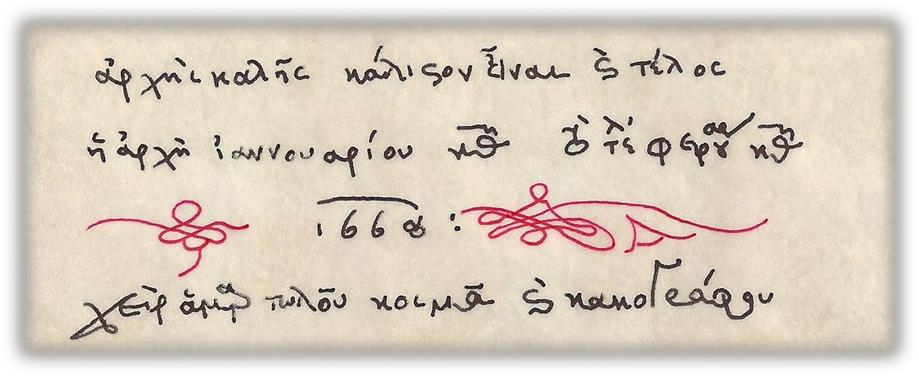

Figure 3.0. The bibliographical note of manuscript Iviron 1080, fol. 179v (a copy from the photograph of the
original in Stathis, 2015, p. 214, fig. 24). The self-styled “sinner” and “poor penman” Kosmas, who
completed in one month (29 January - 29 February of the year 1668) the copying of a codex with 235 folios (470
pages), is none other than the famous music teacher Kosmas the Macedonian (fl. ca. 1665-1700, pupil of
Germanos of New Patras, humble-minded monk and domestikos of the Holy Monastery of Iviron on Mount Athos), one of the
most important calligraphers and copyists of musical manuscripts during the period of Ottoman rule (see Figure

2.19 in the second chapter of the present handbook and Hatzigiakoumis, 1980, pp. 37-38 and plates 50-52, as well as figures 6, 8-

10 in the appendix of the aforementioned book. Zisimos, 2007). G. Stathis (2015, pp. 207-215: 215), in his analytical
description of this codex, states, among other things, the following concerning the quality of the manuscript: “a very
elegant codex, by Kosmas the Macedonian, most important as a very rich Kratematarion (Κρατηματάριον) (...) Script
(...) careful and very elegant. (...) beautiful, graceful initials with elegant ornaments.
Many initials finely crafted, depicting birds, flowers, reptiles. The ornaments [are] most elegant, as
are many coloured initials”.

A basic element of the palaeographer’s work is the dating of the manuscripts with which
he deals. Some manuscripts have, usually at their end, a bibliographical or codicological

154

note, the so-called colophon,i where the scribe may state information such as the title of the book
he copied, his own name and/or that of the person who commissioned it and bore the cost of the
manuscript, the exemplar (anthivolon: the original from which the copy was made), the place where the codex was written or
the scribe’s place of origin, as well as the year in which the codex was written. Quite often,
bibliographical notes end with brief prayers, such as, for example, “you who read, pray for
me”ii or “glory to God who has granted completion”,iii or even gnomic verses such as the following
dodecasyllabic lines:
Ҡ the hand that wrote [this] decays in the grave
but the writing endures for long ages
thanks be to God, the accomplisher of good things”.iv

 An exercise in reading a codicological note may be undertaken on the basis of Figure 3.1.

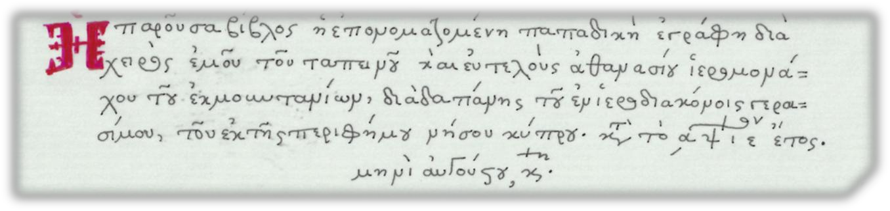

Figure 3.1. The colophon of manuscript Sinai 1299, fol. 484r (copy).v

In contemporary everyday life, the so-called Arabic numerals (1,2,3...) are used chiefly,
as are some of the Greek numeral-letters (α΄, β΄, γ΄...) and the basic Roman numerals (I, II, III...). However,
for the interpretation of the numbers in the two colophons above (κθ΄ January and February | κ΄
August of the year ,αψιε΄) and, more generally, of dates in Byzantine and post-Byzantine sources, a
more detailed account of the Greek systems of numbering and dating will be needed; this is
undertaken in the following sections.

# 2. Greek Numeral Systemsvi

There are two Greek numeral systems: the acrophonic and the alphabetic.
The first, the acrophonic (etymologically from: akron + phōnē), uses the initial letters of the words
that denote the corresponding number (see Table 3.1) and was in use chiefly in Attica, from the
sixth to the third century BC, but also down to the first century BC.

# Symbol

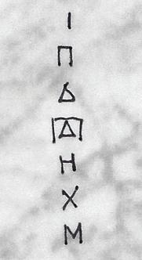

# Meaning

ONE
Π(FIVE)
Δ(TEN)
Π(FIVE TIMES)
Η(HUNDRED)

Δ(TEN) = 50

Χ(THOUSANDS)

Μ(MYRIADS) = 10,000
With the above symbols the remaining
numbers could also be formed, e.g.: ΙΙ = 2, ΔΙΙ = 12, ΔΔ = 20, ΗΗ = 200, ΜΜ = 20,000 etc.
Table 3.1. The acrophonic numeral system.vii

155

The second numeral system, the alphabetic, which uses the letters of the alphabet
as numbers, took shape in Miletus or in Asia Minor Ionia between the eighth and sixth centuries BC. During the Classical
period it spread also to the other Greek cities, gradually displacing the acrophonic system. From
the first century BC until the end of Byzantium, the alphabetic system constituted the exclusive method
of numbering in Greek-language sources. It survives also in the post-Byzantine period, although toward the end of that period
Arabic numerals also begin to appear in the dates of manuscripts (see Figure 3.0-

1). The numeral system is used even today, in publications in katharevousa (e.g. in the

designation of centuries, in the numbering of tables and pages of the introduction, in the recording of the year of publication),
in inscriptions, etc. The basic principles and the way in which the various numbers are formed are presented in
Table 3.2.

||||||||
|---|---|---|---|---|---|---|
|α΄|1|ι΄|10|ρ΄|100|,α 1000|
|β΄|2|κ΄|20|σ΄|200|,β 2000|
|γ΄|3|λ΄|30|τ΄|300|,γ 3000|
|δ΄ ε΄ Ϝ΄ or ς΄ or στ'|4 5 6|μ΄ ν΄ ξ΄|40 50 60|υ΄ φ΄ χ΄|400 500 600|etc., as with the units, with the difference that the acute mark is placed below|
|(digamma: a variant of the Latin F) (stigma: see digamma) ζ΄ η΄ θ΄|7 8 9|ο΄ π΄ or Ϟ΄|70 80 90|ψ΄ ω΄ or Ϡ΄|700 800 900|on the numeral-letter|
|||(koppa: see the Latin q)||(sanpei or sampi: probably like a thick “s”; it was so named because of its resemblance to the|||

letter pi)

Table 3.2. The alphabetic numeral system.viii

Clarifications for Table 3.2:

- The alphabetic numeral system consists of the 24 letters of the familiar Greek alphabet, plus three archaic letters: digamma/stigma (6), koppa (90), and sampi (900), the first two from the alphabet of Miletus, the last of Asia Minor origin. These letters are inserted in the sequence of units (α΄- στ΄ - θ΄), in the tens (from ι΄-Ϟ΄), and in the hundreds (from ρ΄-Ϡ). Also, ,στ (6000) appears very frequently in the dates of musical manuscripts of the Byzantine period.

- There is no special symbol for zero (0).

- The numeral-letters that correspond to the Arabic numerals 1-999 are written with an acute mark at the upper right, while the thousands are written with an acute mark at the lower left. Often in manuscripts there are, above the date, one or more horizontal or slightly wavy little lines, and then the acute mark at the upper right, at the end of the number, is usually absent (see below, Figure 3.2, and the figures in the exercises at the end of the present chapter).

- The tens of thousands are written with a unit numeral-letter either accompanied by the word myriads, or with diaeresis marks.

- Examples: ,βιστ΄ or ,βιστ = 2016 | κθη = 29th | in the ,αψιε year, in the month of August, κη = in the one thousand seven hundred and fifteenth year, in the month of August, on the twentieth (scil. day), a date that today we would write as 20.08.1715 | ,ςϠξα΄ = 6961 | η΄ myriads, or otherwise = 80,000.

-  You can try using the alphabetic numeral system by writing, for example, your

date of birth in Greek numeral-letters.

156

# 3. Systems of Dating in Byzantiumix

## 3.1. Diversity of chronological systems

The best-known chronological system in European culture today consists of reckoning
years in relation to the Birth of Christ: so many years “from the birth of Christ”x/after Christ (in
Latin as A.D. = Anno Domini) or so many years before Christ. This particular system goes back to the
Scythian monk Dionysius Exiguus, who lived in Rome during the first half of the sixth century. Dionysius,
author of the work “Liber de paschate”, laid the foundations for the chronological calculation of the Christian
feasts and identified the beginning of the Christian era as the year 754 after the founding of Rome.xi
Dionysius’ method of dating, however, became established much later in Greek manuscripts.
In codices of Byzantine music and liturgy we see it applied only rarely in the early
post-Byzantine periodxii and beginning to prevail from the late post-Byzantine period - the age of
Humanism (16th-17th c.) and thereafter.
In the various sources (legal, theological, historiographical, iconographic, etc.) of the eleven centuries
of the Byzantine Empire one encounters several other methods of dating, of which
the following are mentioned indicatively (see Table 3.3):

|Chronological system|Category of chronological system, based on the|
|---|---|
|Based on the Olympiads Based on the founding of Rome Years of the Greeks or of the Seleucids Years of Diocletian or of the Martyrs Indictions|Historical: based on political, cultural, or economic events.|

World years according to the Alexandrians
Years according to the Epitome
Paschale) → proto-Byzantine chronological
mondiale protobyzantine [according to V.
Years from the creation of the world according to the Romans →
chronological system (ére mondiale byzantine [Grumel])

Cosmological (according to Grumel: éres mondiales):
of times (Chronicon based on the creation of the world.
system (ére
Grumel])
Byzantine

Table 3.3. Chronological systems in Byzantium: an open list.xiii

The most important method of dating for medieval and post-Byzantine Greek sources is the
last - the so-called Byzantine chronological system. In the Byzantine period it is usually combined
with an indication of the indiction. The following sections deal in greater detail with these two systems and
the way in which they are fitted together.

## 3.2. The Byzantine chronological system

The Byzantine chronological system is the most prevalent of the category of cosmological
chronological systems, which have as their common denominator the fact that they take as their point of reference
the creation of the world (“from the creation of the world” [«ἀπὸ κτίσεως κόσμου»] or “from Adam” [«ἀπὸ Ἀδάμ»]).xiv
A multitude of writers of the Hellenistic, early Christian, and patristic periods concerned themselves with
determining the year of the creation of the world, such as Josephus Flavius, Saint Clement of
Alexandria, Eusebius of Caesarea, and many others.xv The basis of the calculation was the Old
Testament in the Septuagint translation, and especially the book of Genesis and the chapters of
genealogies contained in it and in other books of Holy Scripture.xvi The various cosmological
chronological systems converge in placing the creation of the world approximately in the middle
of the sixth millennium before the Birth of Christ. According to the Byzantine chronological system, which
probably goes back to the time of Emperor Heraclius (610-641),xvii the creation of the world

157

was initially calculated as 25 March of the year 5508 BC, so that each year began with the feast of the
Annunciation. The consolidation of the system, however, brought about, for practical reasons, the transfer of the
beginning of the year from 25 March 5508 to 1 September of the year 5509.xviii According to V. Grumel, the reason for this
change lies in the adaptation of the Byzantine chronological system
to another way of measuring time, the so-called indiction.

# 3.3. The indiction (ἰνδικτιών)xix

In contrast to the cosmological chronological systems, which measure time almost “linearly,”
from a fixed starting point (the creation of the world), the system of the indiction calculates the years on the basis
of a periodically and cyclically alternating starting point.
More specifically: the etymology of the word ἡ ἰνδικτιών (genitive: -ῶνος), or ἡ ἴνδικτος, derives
from the Latin noun indictio, meaning announcement, especially a royal mandate and, by metonymy,
extraordinary taxation.xx In the Roman Empire, the indiction initially designated the amount of taxation on
an annual basis, while later the meaning of the word was extended to the notion of the fiscal year or of a
period of several fiscal years. The most prevalent form of the indiction is that of 15 years, which
was introduced into the Roman Empire for the first time by Constantine the Great, on 1 September
of the year 312. In the bibliography it is known as the Byzantine indiction.xxi
In Byzantine sources, the meaning of the word indiction is twofold:

1. Generally, as a fiscal period of 15 years, which recurs cyclically,

2. specifically, as a particular year within the cycle of 15 years. For the dating of Byzantine and

post-Byzantine manuscripts we are chiefly interested in this second meaning of the word.
The reference to the indiction in official documents of Byzantium was made obligatory by
Emperor Justinian I in the year 537 (Novel 47).xxii The indication of the indiction by itself cannot
determine a date, but functions in an auxiliary capacity, clarifying/confirming the
date that is given according to the Byzantine or another chronological system (e.g. proto-Byzantine).
As mentioned above, the fact that the indiction began on 1 September also affected the
Byzantine chronological system, with the result that the latter transferred the beginning of the year from 25
March to 1 September.xxiii

# 3.4. Arithmetical operations for determining the date of Byzantine and post-Byzantine manuscripts

Summarizing all the foregoing, we may arrive at the following important points for the
dating of Byzantine and post-Byzantine sources:

1. The date of manuscripts is usually indicated in the scribe’s colophon, at the end of the

manuscript.

1. The year is recorded with Greek numerals.

2. The year recorded in the manuscript is usually counted from the creation of the world, and only

in more recent manuscripts is it the year from the Birth of Christ.

1. When we have the year from the creation of the world, according to the Byzantine chronological system,

and wish to know the corresponding year from the Birth of Christ, we subtract from the
number given in the MS the number 5509 for the months September to December, or the number
5508 for the months January to August. If the month is not known to us, we subtract
both numbers.xxiv

1. Next to the year from the creation of the world, there is usually also the indication of the indiction, likewise in

Greek numerals.

1. In order to confirm the correspondence of the two chronological systems, we divide the

large year from the creation of the world by 15. The remainder of the division is the indiction. If the
remainder is zero, then the indiction is the 15th.

For example:

1. The Sticherarion Ambrosianum A 139 sup. has the following colophon on fol. 301v:

158

Ҡ The present stich(erar)ion was completed by the hand of me, Leo, priest /
the Padiates and taboullarios; and the mode and the / setting of the melody were worked on by the most hon(our)able among
hieromonks, lord Athanasios; / and spir(it)ual f(at)h(er); in the month of October, ind(iction)
10; in the year ,στων΄: †”xxv

The operations for determining the above date are the following:

1. Converting the date of the MS into Arabic numerals: October, 10th indiction, year 6850,

2. determining the year from the Birth of Christ:

6850

- 5509 (because the month is October) 1341

1. checking with the indiction:

6850 15

- 60 456 085

- 75 100 - 90 10 (it coincides

with the indication of the indiction in the manuscript!)

1. The Sticherarion of the National Library of Greece 884 has the following colophon (see Figure 3.2):

159

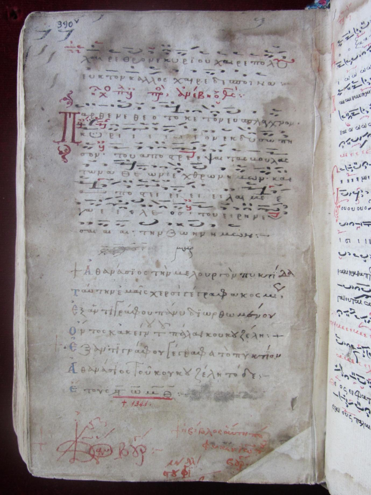

Figure 3.2. The colophon of the Sticherarion NLG 884, fol. 390v. © National Library of Greece.xxvi

You can try on your own to decipher the note and consider wherein its great importance lies. Afterwards you can compare it with the transcription and comments below.

160

The operations for determining the date in this case are the following:

α. Transcription of the colophon, together with the date:

Ҡ I, Athanasios, have written this melodic booklet
With my own hands, in orderly fashion,
From a very thoroughly corrected exemplar,
Indeed from that exemplar of the once-living Koukouzeles: †
† From an exemplar I have written this booklet,
I, Athanasios, this work of Koukouzeles:-
in the year ,στωμθ: †”xxvii
It is observed that these are four plus another two twelve-syllable trochaic verses, to which
the date is added.

1. Converting the date of the MS into Arabic numerals: year 6849,

2. determining the year from the Birth of Christ:

6849

- 5509/8 (because we do not know the month)
1340/1

This particular MS is especially important, because it helps determine the
biographical data of Saint John Koukouzeles and trace his editorial
activity. The metrical colophon states that the present Sticherarion (NLG 884) had as its exemplar
(Germ. Vorlage) a copy of the Sticherarion with the corrections of “the once-living Koukouzeles.” In other words,
when NLG 884 was copied, Saint John Koukouzeles was no longer alive.xxviii Thus, this
dated manuscript provides a terminus ante quem (Lat. = “limit before
which”) regarding the end of the master’s life: in the year 1340/1 the angel-voiced composer had already
passed into eternal life.
Similarly, a dated manuscript may provide a terminus post quem (Lat. = “limit
after which”) for a particular event.
Another famous bibliographical note is found in the MS of the National Library of
Greece, no. 2406: see Figures 3.4.-6.

161

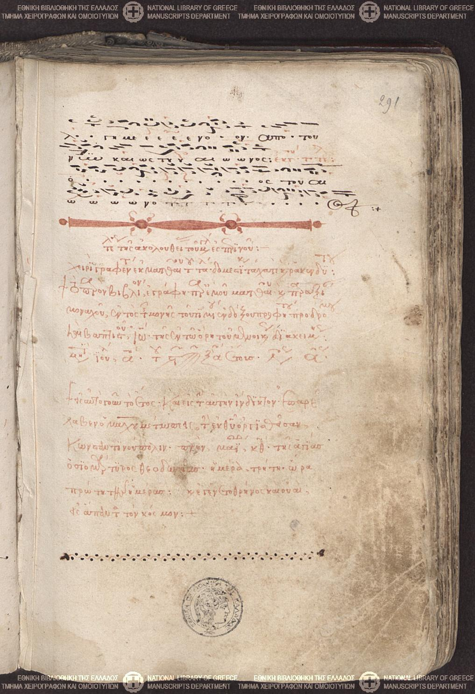

Figure 3.4. Bibliographical note in the Anthology of the Papadike NLG 2406, fol. 291r. © National Library of Greece.

You can try on your own to decipher the note and compare it with the transcription that appears below.

162

“end of the office of the Great Vespers:- |
written by the hand of Matthew the wretched; domestikos perhaps and also ragged-clad: |
† the present book was written by me, Matthew, and unworthy | monk, within the monastery of the holy
glorious prophet, forerunner | and baptist, John; situated on the mountain of Menoikion: |
in the month of July, αῃ΄; of the year ,στϠξα'; ind(iction) αης΄;‖
† in that same year, then, and in the same indiction, Mehmed Bey took over | the God-
angered Constantinople; moreover, in May, κθ΄; on the day of the holy | venerable martyr Theodosia; on the third day; at the hour

| first of the day: and there was lamentation and woe | throughout the whole world: †”xxix

The verification of the two dates found in the above colophon is carried out in the now familiar way:

α. For determining the year from the Birth of Christ:

the year ,στϠξα' is written in Arabic numerals as 6961. The corresponding subtraction is:
6961

- 5508 (because the months May and July are mentioned) 1453

1. For checking with the indiction:

6961 15

- 60 464 096

- 90 061 - 60 01 (which

# coincides with the indication of the indiction in the manuscript)

Gr. Stathis, in an article on the survival of the Greek ecclesiastical musical tradition during
the post-Byzantine period, comments on the above note as follows:

“The sorrowful news of the capture of Constantinople on 29 May 1453 found—

thirty-three days later, on 1 July—a swift-writing monk bent over, writing
with his pens and his black and red inks one of the important
codices of Byzantine Chant. The monk must have sighed and, with his red ink,
on fol. 291r, wrote the painful synaxarion: ‘in that same year and in the same indiction
Mehmed Bey took over Constantinople, which had incurred God’s wrath (...).’
He turned the leaf and continued his work. He was in the Monastery of the Honourable Forerunner, outside
Serres, and he was ...” “Matthew the monk and domestikos,” the monk. His important
codex is now the Athenian NLG 2406.” (Stathis, 1989b, p. 432).

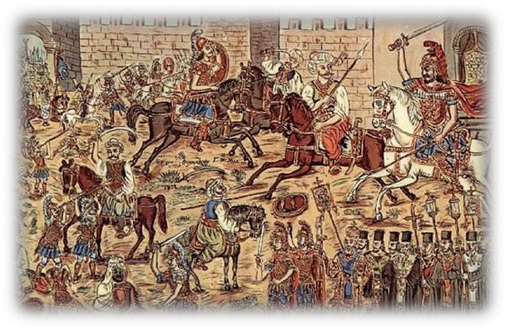
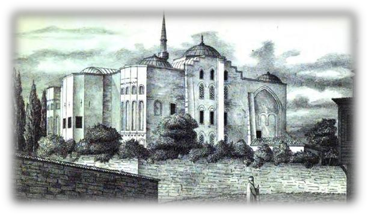

Figures 3.5.-6. Left: “Constantine Palaiologos in battle 1453,” painting by Theofilos (1932), Theofilos Museum,
Lesbos.  Right: The Church of Saint Theodosia (Gül Camii) in Constantinople, in a drawing from the catalogue
of Alexandros Paspates (1877). Byzantine topographical studies.
Sources: <https://commons.wikimedia.org/wiki/File:Theofilos_Palaiologos.jpg> (9.9.2016).
<https://commons.wikimedia.org/wiki/File:Hagia_Theodosia.JPG> (9.9.2016). See also Papathanasiou (2013).

163

# 4. Monokondylia and cryptograms

Some bibliographical notes end with a word, and at times even an entire sentence, which is usually
quite difficult to read, since it is written in one or more highly complex graphic movements,
which combine many letters into one unit—the so-called monokondylia (μονοκονδυλιά) (see Figure 3.7).

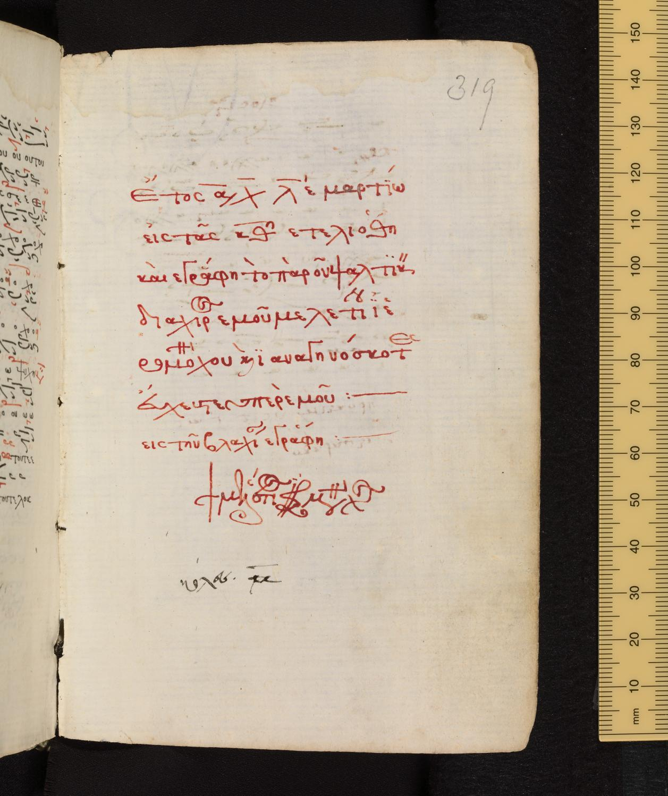

Figure 3.7. Colophon with monokondylia, in the Oxford manuscript, Bodleian Library, Jesus College 33, fol.
319r. © Jesus College, Oxford.

“In the year ,αχλε' in March / on the κθ΄ the present book of chant / was completed
and written by the hand of me, Meletios, hie/romo(nk), and you who read it / pray for me:--- / it was written in Wallachia:-

- / † Meletios hieromo(nk)”xxx

-  You can also write your own name as a monokondylia (like a signature).

164

In some manuscripts there are, in addition, graphic riddles. For the unsuspecting reader, the
message is locked; it is a cryptogram. It can be read only if the
secret alphabet used by the scribe also becomes known to the reader. An example is shown in Figure

3.8.

Figure 3.8. Copying of a cryptogram from codex Vaticanus Ottobonensis gr. 145, which was written “in the year
xxxi
,στωοα΄. ind(iction) 1. in the month of Dec(ember) 5:”

The cryptogram comes last, after the indication of the date and a monokondylia

which reads “Petros ho Telemachos.” Above the cryptogram, a later hand (in Latin
called manus recentior) stated: “here is the name of the writer.” Thus it opened the way to
finding the key to the secret alphabet. If the sequence of letters

κ ε ψ Ϡ λ ω λ ψ β ο ε ξ θ υ λ ω, conceals the name
π ε τ ρ ο ς ο τ η λ ε μ α χ ο ς, then

this means that the cryptogram is based on an alphabet which uses the 27 letters of the
alphabetic numeral system, but with a different order and value of letters, except for ε, which
we see is common.
This cryptographic system is also encountered in other manuscripts and is based on the
reverse order of the letters of the alphabetic numeral system, as follows (see
Table 3.4):

α

ρ

ι

β

σ

κ

λ

γ

τ

δ

υ

μ

φ

ν

ε

ξ

στ

χ

ζ

ψ

ο

π

η

ω

Ϟ

θ

Ϡ

Table 3.4. The method of reversing the letters in the cryptographic system of MS Vatic. Ottob. gr.

1.

-  You can also write your own name with the above secret alphabet!xxxiii

165

# 5. Dating manuscripts without a bibliographical note

Up to now we have spoken about manuscripts that state their date by means of a corresponding
bibliographical or codicological note. Nevertheless, most manuscripts lack such a
note, with the result that the palaeographer needs to propose a dating for the particular
manuscript. What are his criteria?
Table 3.5 brings together various codicological and palaeographical elements that
can lead the scholar to a correct dating of a manuscript without a bibliographical
note.

|External criteria: material and format of the manuscript,|Internal criteria: contents and stylistic features|
|---|---|
| Material of the manuscript: 1. papyrus (until approximately the 6th c.), 2. parchment (until approximately the 14th-15th c.), 3. paper (in Europe: from approximately the 12th c., but for musical MSS: chiefly from the 15th c. onward. In Egypt: already from the end of the first Christian millennium).  Form of the manuscript: 1. roll (in Classical Antiquity and in Byzantium, chiefly until the 6th c.; for texts of the Divine Liturgies even until the Palaiologan period), 2. codex (book form that spreads mainly in connection with Holy Scripture, and predominates from the 6th c. onward).  Ruling (on parchment, later also on paper), watermark (on paper), binding (if the original has been preserved).  Type of script of the text: 1. MAJUSCULE (until the 8th/9th c.; in Gospel lectionaries, however, until the 11th c.) or 2. minuscule (from the 8th/9th c. onward). Style of script (biblical, pearl-strung, ace-of-spades, etc.). Sometimes it is possible to identify the scribe, in which case the dating may be carried out on the basis of his biographical data, provided these are known.  Type of musical script (e.g. Theta notation, Old Byzantine notation, notation of the New Method, etc.) and shapes of neumes.  Miniatures.  Other graphic symbols (e.g. reference signs, tachygraphic signs).| Type of collection (e.g. Doxastarion, Complete Works of Bereketes, etc.),  genres of hymnography and composition (e.g. asmatic chants or heirmoi, kratemata),  hymnographers and composers,  style of composition (e.g. kalophonic, new embellishment),  calendar of feasts (e.g. particular later feasts or offices for local saints),  polychronia (for emperors or patriarchs),  paschal tables (tables for calculating the date of Easter for subsequent years). Of the greatest importance for determining the contents of a collection and its date is the reading of the red-lettering (rubrics), usually at the beginning of sections of the manuscript, at the beginning of feasts or individual musical pieces, but quite often also in the margins of the manuscripts.|

Table 3.5. Criteria for dating manuscripts without a bibliographical note: open lists.xxxiv

The above criteria function in combination in the palaeographer’s effort to date
a codex. We dealt with the elements concerning the palaeography of the Greek language in the
previous chapters. In the following chapters, we shall turn to musical notations, always
bearing in mind that “the relations between the Palaeography of music and the related disciplines, but chiefly
Greek Palaeography and Philology, are inseparable, and the field of study has not been exhausted.
There are still many topics of specialized research that must be carried out in order for us to have
in the future more tools for the correct approach to handwritten musical sources.”xxxv

166

# Assessment criteria for Chapter 3

Assessment criterion 1

Exercise in creating mnemonic cards for Chapter 3

##  

Assessment criterion 2
Exercise in transcribing a bibliographical note of the Byzantine period (Figure 3.9)



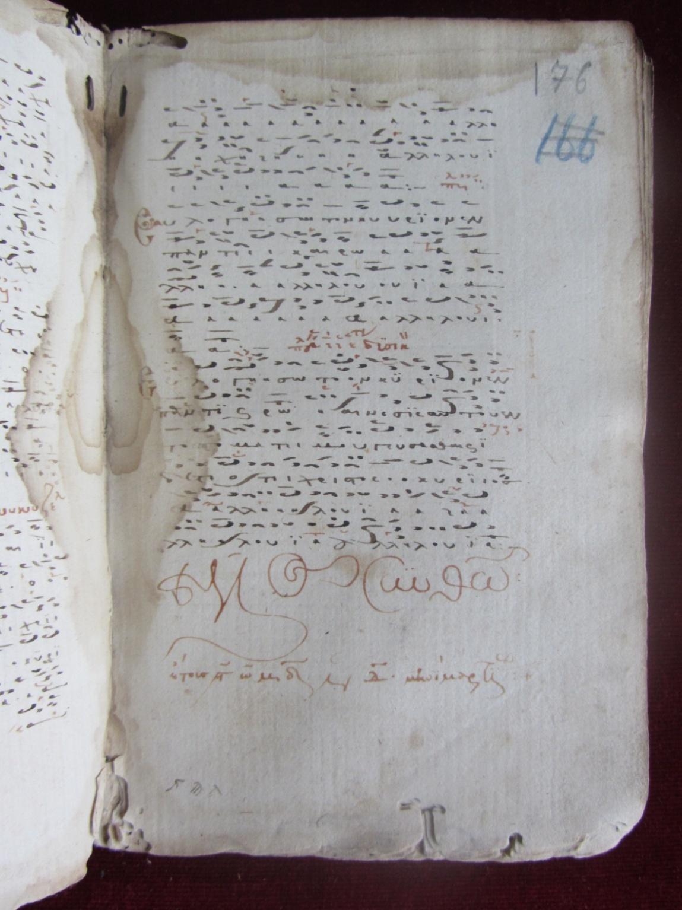

Figure 3.9. The colophon of the codex of the “Akolouthiai” (Papadike) ΕΒΕ 2458, fol. 176r. © National Library of
Greece.xxxvi

167

Assessment criterion 3
Exercise in transcribing a bibliographical note of the post-Byzantine period, with double dating (see Figure 3.10)

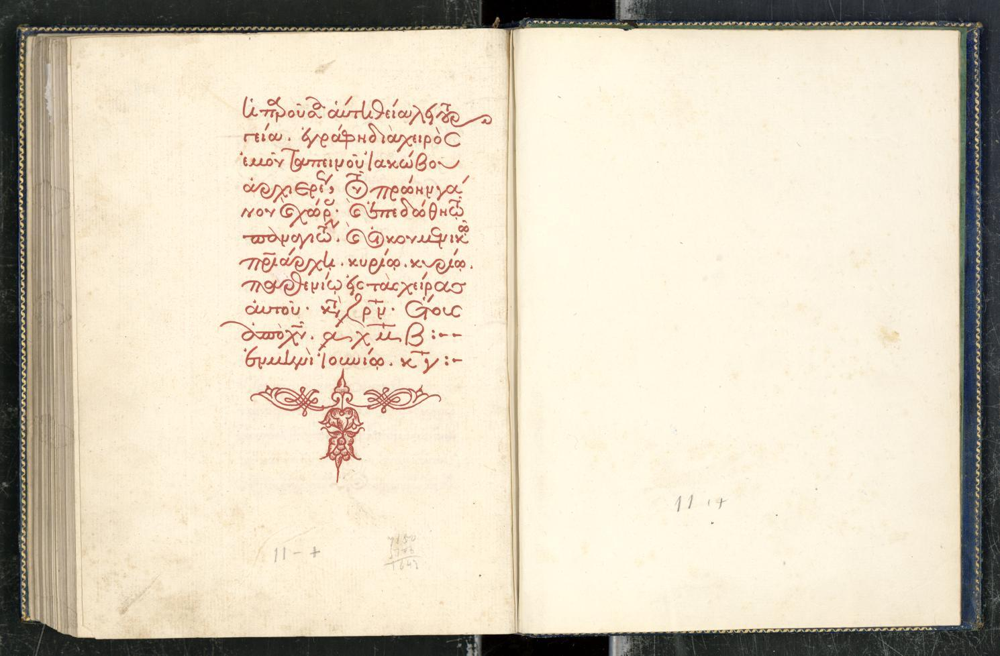



Figure 3.10. The colophon of the manuscript of the Holy Great Monastery of Vatopedi no. 1048, fols. 104v-105r. © H.G.M. Vatopedi, Mount Athos.xxxvii

168

Assessment criterion 4
Exercise in arithmetic operations for establishing the date

# 

Assessment criterion 5
Exercise in reading a single-stroke ligature (monokondylia).
A particularly complex monokondylia of the
manuscript (see Figure 3.11):

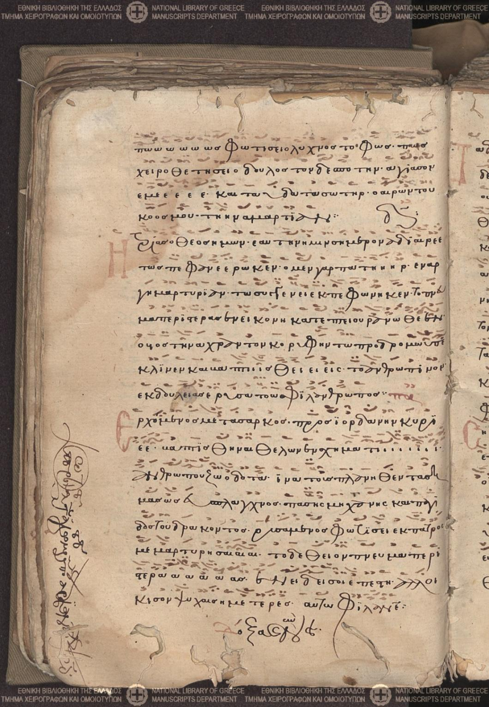

appears in the left margin of the

following

# 

Figure 3.11. Monokondylia (below in the left margin of the manuscript) in codex ΕΒΕ 2155, Sticherarion, 14th cent., fol.
69v (Politis and Politi, 1991, p. 181). © National Library of Greece.

169

# Bibliography for Chapter 3

Holy Scripture

The Old Testament according to the Seventy (Septuaginta). (1935). Scientific ed. Alfred Rahlfs, editio minor. Stuttgart:
Deutsche Bibelgesellschaft. Greek ed.: Athens: Biblical Society.

Facsimile editions of musical manuscripts

Perria, Lidia, & Raasted, Jørgen. (eds., 1992). Sticherarium Ambrosianum. MMB XI, Pars Principalis & Pars
Suppletoria. Copenhagen: Munksgaard.

Catalogues of manuscripts

Giannopoulos, Emmanouel. (2008). The Manuscripts of Byzantine Music. England. Descriptive Catalogue,
Holy Synod of the Church of Greece, IBM. Athens.
Balageorgos, Dimitrios and Kritikou, Flora. (2008). The Manuscripts of Byzantine Music, Sinai, Descriptive
Catalogue. Volume I. Holy Synod of the Church of Greece, IBM. Athens.
Politis, Linos and Politi, Maria. (1991). Catalogue of Manuscripts of the National Library of Greece, nos.
1857-2500. Treatises of the Academy of Athens, vol. 54. Athens: Publications Office of the Academy of
Athens.
Stathis, Gregorios. (1975, 1976, 1993, 2015). The Manuscripts of Byzantine Music, Mount Athos. Holy Synod of the
Church of Greece - IBM. Volumes I-IV. Athens.
Chatzigiakoumis, Manolis. (1980). Manuscripts of Ecclesiastical Music 1453-1820. A Contribution to Research
on Modern Hellenism. Athens: Cultural Foundation of the National Bank.

Books and articles

Zisimos, Georgios. (2007). Kosmas Iverites and Makedon, Domestikos of the Monastery of Iviron. IBM, Studies

1. Ed. Gr. Stathis. Athens.

Karagiannopoulos, Ioannis. (2001). The Byzantine State (4th ed.). Thessaloniki: Vanias.
Karas, Simon. (1992). John Maistor Koukouzeles and His Era. Athens: Society for the Dissemination of
National Music.
Babiniotis, Georgios. (2002). Dictionary of the Modern Greek Language (2nd ed.). Athens: Centre for Lexicology.
Papadopoulos. Anastasios (2007). Saint Theodosia (Gül Camii). In Encyclopaedia of the Hellenic World,
Constantinople. URL: <http://www.ehw.gr/l.aspx?id=10908> (10.9.2016).
Papathanasiou, Ioannis. (2013). Musical Palaeography and Greek Palaeography. Reference signs in
manuscripts with Anastasiou-type script and ace of spades. Catalogue of reference elements. Athens.
Stathis, Gregorios. (1988). The Maistor John Papadopoulos Koukouzeles (ca. 1270 - first half of the 14th cent.);
his life and work. Insert to the vinyl records in the series Byzantine and Post-Byzantine Melodists,

1. Sung by the Choir of Chanters “The Maistores of the Psaltic Art”, choir director Gr. Stathis. Athens:

Holy Synod of the Church of Greece-IBM.
Stathis, Gregorios. (1989a). The differentiation in chant as recorded in codex ΕΒΕ 2458 of
the year 1336. In Christian Thessaloniki, Palaiologan Period, 22nd Demetria, Scientific
Symposium, Patriarchal Institute for Patristic Studies, Holy Monastery of Vlatades, 29-31 Oct. 1987 (pp.

167-211). Thessaloniki: Centre for the History of Thessaloniki of the Municipality of Thessaloniki, Independent Publications no. 3.

Stathis, Gregorios. (1989b). The development of ecclesiastical music in the post-Byzantine period. Offprint
from: Memorial Volume for Metropolitan Maximos of Sardis, 1914-1986 (pp. 431-449). Geneva: Holy
Metropolis of Switzerland. Foundation for Christian Unity Atef Danial.
Buchwald, Wolfgang, Hohlweg, Armin and Prinz, Otto. (1982). Tusculum-Lexikon griechischer und lateinischer Autoren
des Altertums und des Mittelalters (3rd ed.). München, Zürich: Artemis Verlag.
Grumel, Venance. (1935). L' année du monde dans l'ère byzantine. Échos d'Orient, 34 (no 179), 319-326:
<http://www.persee.fr/web/revues/home/prescript/article/rebyz_1146-9447_1935_num_34_179_2838> (23.7.2015).
Grumel, Venance. (1958). Traité d'études byzantines I. La Chronologie. Paris: Presses Universitaires de France.

170

Kujumdzieva, Svetlana. (2004). John Koukouzeles' Sticherarion. The Formation of the Notated Anastasimatarion. Sofia:
Gutenberg Publishing House (in Bulgarian, with English summary).
Langenscheidts Großes Schulwörterbuch Lateinisch-Deutsch. (1991). Βearbeitet von Erich Pertsch auf der Grundlage
von Menge-Güthling (erweiterte Neuausgabe, 8th ed.). Berlin, München, Wien, Zürich: Langenscheidt.
Mioni, Elpidio. (1998). Introduction to Greek Palaeography. Trans. Nikolaos Panagiotakis (5th ed.).
Athens: Cultural Foundation of the National Bank.
Pennington, Anne E. (1985). Music in Medieval Moldavia, 16th Century. With an Essay by D. Conomos. Ed. Titus
Moisescu, Romanian version by Constantin Stihi-Boos. Bucharest: The Musical Publishing House.
Raasted, Jørgen. (1997). Koukouzeles' Sticherarion. In Christian Troelsgård (ed.), Byzantine Chant. Tradition and
Reform. Acts of a Meeting held at the Danish Institute at Athens, 1993, Monographs of the Danish Institute at
Athens, vol. 2 (pp. 9-21). Aarhus: Αarhus University Press.
Threatte, Leslie (1996). The Greek Alphabet. In P.T. Daniels and W. Bright (eds.), Τhe World's Writing Systems (pp.

271-280). New York, Oxford: Oxford University Press.

Ζiegler, Konrat and Sontheimer, Walther. (Eds., 1979). Der Kleine Pauly. Lexikon der Antike. Auf der Grundlage von
Pauly's Realencyclopädie der classischen Altertumswissenschaft unter Mitwirkung zahlreicher Fachgelehrter, Bd.

1. München: Deutscher Taschenbuch Verlag.

# Webography

<http://earthsky.org/earth/why-does-the-new-year-begin-on-january-1> (17.2.2016).
<http://www.infoplease.com/spot/newyearhistory.html> (17.2.2016).
<http://www.ehw.gr/l.aspx?id=10908> (10.9.2016).
<http://www.lexigram.gr/lex/arch/> (10.9.2016).
<http://www.persee.fr/web/revues/home/prescript/article/rebyz_1146-9447_1935_num_34_179_2838> (23.7.2015).
<https://el.wikipedia.org/wiki/Δυναστεία_των_Σελευκιδών> (17.2.2016).
<https://el.wikipedia.org/wiki/Verba_volant,_scripta_manent> (17.2.2016).
<https://en.wikipedia.org/wiki/Byzantine_calendar> (23.7.2015).

# Endnotes

# for Chapter 3

i Cf. Mioni (1998, pp. 103-107 and p. 155, note 37). Cf. also Babiniotis (2002, pp. 918-919).
ii Oxford, Bodleian Library, Jesus College 33, fol. 319r, manuscript of the year 1635 (Giannopoulos, 2008, pp. 199-200).
iii Sinai 1234, Mathematarion, autograph of Ioannes, priest, Plousiadenos, year 1469, colophon on fol. 444v
(Balageorgos & Kritikou, 2008, fig. 23 on p. 96 and detailed description of the manuscript, pp. 60-96).
iv Sinai 775, fol. 166r, manuscript of the 12th-13th cent. (Balageorgos & Kritikou, 2008, pp. 608 and 12-14). A corresponding Latin
maxim is: Verba volant, scripta manent, i.e. spoken words fly away, written words remain: see
<https://el.wikipedia.org/wiki/Verba_volant,_scripta_manent> (17.2.2016).
v “The present book, called the papadike, was written by / the hand of me, the humble and lowly
Athanasios, hieromonk=/ from Mountania, at the expense of the hierodeacon Gera=/simos, from the
famous island of Cyprus; in the year ,αψιεον; in the month of August, 28.” The copy was based on the corresponding
photograph from: Balageorgos & Kritikou (2008, fig. 52 on p. 435). From the same catalogue also derives the
transcription of the codicological note (p. 434). The two authors of the catalogue describe the
minuscule script of this manuscript as follows: “careful, clear, legible, of even thickness
and dense, by an experienced and practised scribe” (p. 436).
vi Cf. Mioni (1998, pp. 99-102). Threatte (1996, p. 278).
vii The present table was designed on the basis of the explanations in: Mioni (1998, p. 99).
viii The present table is based on: Mioni (1998, pp. 99-100), in combination with Threatte (1996, p. 278).
ix This section draws information chiefly from: Grumel (1958) and the same author (1935):
<http://www.persee.fr/web/revues/home/prescript/article/rebyz_1146-9447_1935_num_34_179_2838> (23.7.2015). See also
Mioni (1998, pp. 100-103).
x See Mioni (1998, p. 100).
xi See Buchwald, Hohlweg, & Prinz (1982, p. 200). For the foundation of Rome on 21 April of the year 753 BC, see
Ziegler & Sontheimer (eds., 1979, Der Kleine Pauly, vol. 4, column 1441).
xii See the colophon of Ioannes Plousiadenos, protopapas of Chandax, Crete, in his autograph Mathematarion
Sinai 1234, fol. 444v: “in the year from our Lord Jesus Christ ,αῷυῷξθῷ΄ / of the third indiction, in Venice.”
(Balageorgos & Kritikou, 2008, fig. 23 on p. 96 and transcription of the colophon on p. 95). The correspondence of the year
in Arabic numerals is: 1469.

171

xiii See Grumel (1958, especially pp. 3-4, 73, 192-193, 239-264). The same author (1935). Buchwald, Hohlweg, & Prinz (1982, p.

1. Cf. also <https://en.wikipedia.org/wiki/Byzantine_calendar> (23.7.2015). For the Seleucid kings (305-64

BC), cf. <https://el.wikipedia.org/wiki/Δυναστεία_των_Σελευκιδών> (17.2.2016).

xiv See Mioni (1998, pp. 100-101) and Grumel (1935, p. 323).
xv Cf. Grumel (1958, p. 5).
xvi The Old Testament was known in Byzantium from the Translation of the Seventy. The work of translation had
begun with 72 learned Jews in Alexandria, during the reign of Ptolemy Philadelphus (285-247

BC), and was completed toward the end of the 2nd cent. BC. The oldest manuscript preserved today with the complete

Greek text of the O.T. dates to the 4th cent. AD. The Old Testament in the translation of the Seventy (LXX), known
in Latin as Septuaginta, constitutes, together with the New Testament, the cornerstone of Byzantine
civilization. Cf. The Old Testament according to the Seventy (1935, p. XIII). Concerning the calculation of the date
of the creation of the world, cf. also the following chapters of Holy Scripture: Genesis chs. 1, 5, 10, 11, 46,
Gospel according to Matthew ch. 1, according to Luke, ch. 3, 23-37. According to V. Grumel (1958, pp. 3-4), the various
chronological systems that take as their point of departure the creation of the world are based on the following three basic
elements:

a. A mystical idea: the analogy between the time of creation and the duration of the world: the six days of

creation correspond to six millennia until the coming of the Redeemer of the world, the Lord Jesus Christ: see
Psalm 89, 4 “For a thousand years in thy sight are but as yesterday, which is past, and as a watch in the night”

1. Old Testament according to the Seventy, 1935, p. 99),

b. the ascertainment of the date of Christ’s birth, public ministry, and Crucifixion,

c. the ascertainment of the date of Christ’s Resurrection and the calculation of the feast of Easter.

xvii See Grumel (1935, p. 326). Karagiannopoulos (2001, p. 127).
xviii The chronicler George Kedrenos (11th-12th cent.), presenting in his work Synopsis of Histories important
events from the creation of the world to the year 1057 AD, uses the Byzantine chronological system in its
two forms: the initial one, with 25 March 5508 BC as its starting point, and the slightly later one, with
1 September 5509 BC as its starting point (Grumel, 1935, pp. 319, 324-325. Buchwald, Hohlweg, & Prinz, 1982, p. 439). Concerning
the celebration of New Year’s Day on 1 January (it was first instituted in Rome in the year 153 BC,
but was systematically applied within the framework of the Julian Calendar from the year 46 BC onward. It was abolished
as a feast in the Middle Ages, to be reintroduced in the year 1582, within the framework of the Gregorian Calendar), cf.
<http://www.infoplease.com/spot/newyearhistory.html> (17.2.2016) and
<http://earthsky.org/earth/why-does-the-new-year-begin-on-january-1> (17.2.2016).
xix See Grumel (1958, pp. 192-193). Mioni (1998, p. 101).
xx Langenscheidts Großes Schulwörterbuch Lateinisch-Deutsch (1991, p. 594). See also Grumel (1958, p. 192).
xxi On the Byzantine indiction of Constantine the Great and other forms of indiction (that of Diocletian
[of five-year duration], and the Egyptian [of variable duration]) Grumel provides information (1958, p. 193). Cf. also
Mioni (1998, p. 154, note 28).
xxii See Grumel (1958, p. 192).
xxiii This transfer had already taken place by the end of the 7th century in official documents, while in chronicles and other sources
it was adapted gradually, until about the 11th cent.: cf. Grumel (1935, pp. 324-325).
xxiv Together with the change in the cosmological chronological system, the numbers that must be
subtracted from the date of the manuscript in order to find the corresponding year from the Birth of Christ also change.
These numbers are double and change according to the dates, because today we count 1 January as
the beginning of the year, whereas the other systems (Byzantine, Proto-Byzantine, and Alexandrian) place it either in
March or in September. To this day the ecclesiastical year and the academic year begin on
1 September, thereby preserving an ancient tradition: see Table 3.6 below.

172

|Chronological system|Year of the creation of the world|Number to be subtracted from the date of the given manuscript|Corresponding dates|
|---|---|---|---|
|Byzantine during|25 March 5508 BC|5508 -|25 March - 31 December|
|the first half of the 7th cent.)||- 5507|1 January - 24 March|
||1 September|- 5509|1 September - 31 December|
|||- 5508|1 January - 31 August|
|Proto-Byzantine the|21 March 5509 BC|- 5509|21 March - 31 December|
|Chronicon Paschale, which was compiled between the years 631- 641)||- 5508|1 January - 20 March|
|Alexandrian (formed in the|25 March 5492 BC|- 5492|25 March - 31 December|
|early 5th cent.)||- 5491|1 January - 24 March|

Table 3.6. Cosmological chronological systems and corresponding arithmetic operations for finding the year from the
Birth of Christ.
(Sources for the creation of the table: Grumel, 1935. In this specific article there are also indications-solutions for
apparent discrepancies that arise when the dating years according to the various cosmological
chronological systems are combined with the Byzantine indiction and the corresponding operation of dividing the year from the
creation of the world by 15 does not yield the result desired at first sight: see especially op. cit., p. 325, the
case of the Uspenskij Psalter. For the date of the Chronicon Paschale, see Buchwald, Hohlweg, & Prinz,
1982, p. 159. For the formation of the Alexandrian system [year 412], see
<https://en.wikipedia.org/wiki/Byzantine_calendar> [23.7.2015]).
xxv Cf. Perria & Raasted (1992, Sticherarium Ambrosianum, Pars Suppletoria, p. 1).
xxvi For the photograph we thank the Department of Manuscripts and Rare Books of the National Library of Greece.
We also thank Mr Demosthenes Spanoudakis. Cf. also Karas (1992, pl. XVII).
xxvii Cf. also Raasted (1997, p. 19). Kujumdzieva (2004).
xxviii On the entire musicological discussion concerning the biographical data of Saint John Koukouzeles, cf.
Stathis (1988).
xxix Cf. Chatzigiakoumis (1980, p. 109). See also <http://www.lexigram.gr/lex/arch/ἰνδικτιῶνος#Hist1> (10.9.2016).
xxx An image of this leaf was published in: Giannopoulos (2008, p. 200). The transcription of the colophon
is based on the same Catalogue (p. 199). The orthographical errors have been corrected.
xxxi Copy based on: Μioni (1998, p. 112). The year ,στωοα΄ = 6871 from the creation of the world corresponds to
the year 1362 from the Birth of Christ (6871-5509 because the month is December). The indiction is reported as “1st”,
a correspondence that is also confirmed by the operation 6871 : 15 = 458, with remainder 1.
xxxii The table was created according to the explanations of Mioni (1998, p. 112).
xxxiii Data on various other cryptographic systems in the tradition of the Putna Music School (16th cent.,
in Moldavia, Romania, in Anthologies containing chants in Greek and Slavonic) are given in:
Pennington (1985, pp. 144-153, especially for the Book of Eustathios, Protopsaltes of Putna, year 1511).
xxxiv Cf. the bibliography of all the chapters of the present handbook.
xxxv Papathanasiou (2013, p. 25).
xxxvi For the photograph we thank the Department of Manuscripts and Rare Books of the National Library of Greece.
We also thank Mr Demosthenes Spanoudakis. This particular leaf was first published in Stathis (1989a,

p. 207).

xxxvii This particular leaf of this manuscript was previously published in: Litsas (2001, pp. 128-129).

173

