## Summary

This chapter offers an introduction to the study of ekphonetic notation (εκφωνητική σημειογραφία), which is
documented chiefly in manuscripts of the 9th–15th centuries and concerns “Byzantine recitative,” i.e. the melodic
reading of passages from the New and Old Testaments. After a brief presentation of the various
types of sources with ekphonetic notation (Gospel, Apostle, Prophets) and reference to hypotheses
concerning the origin and antiquity of ekphonetic practice and the corresponding notation, the
reader’s attention is directed to the Byzantine lists—didactic poems—of ekphonetic
notation. On their basis we are informed specifically about the crystallized, classical system of
ekphonetic writing (11th–12th c.), which constitutes a mnemonic system that operates with 15 pairs
of signs, which are placed each time at the beginning and end of kola (musico-rhetorical units),
guiding the melodic reading of the sacred text according to specific formulas, known on the basis of the
oral tradition of the time. In addition, a case study by Sandra Martani is presented, concerning
the ekphonetic notation in the Vienna Gospel suppl. gr. 128, which is exceptionally rich in combinations.
The chapter concludes with a presentation of the project of critical editions of the Prophetologion, by
Carsten Høeg, S. Engberg, and other collaborators of the Monumenta Musicae Byzantinae, as well as with
reference to various attempts to decipher ekphonetic notation, on the basis of the
manuscript, theoretical, and contemporary oral tradition of ekphonesis.

## Prerequisite Knowledge

The study of Chapters 2 and 3 is required. The study of the article is also recommended: Martani, Sandra.
(2003). The theory and practice of ekphonetic notation: the manuscript Sinait. gr. 213. Plainsong and
Medieval Music, 12, 15-42.

## 1. Introduction

## 1.1. Prolegomena

The so-called ekphonetic notation (ἐκφωνητική σημειογραφία) constitutes a stenographic and mnemonic guide for the intoned
reading of texts of Holy Scripture.i Quite a few copies of the Gospel Book are
highly complex works of art and monuments of Byzantine culture (see Figures 4.1-2).

174

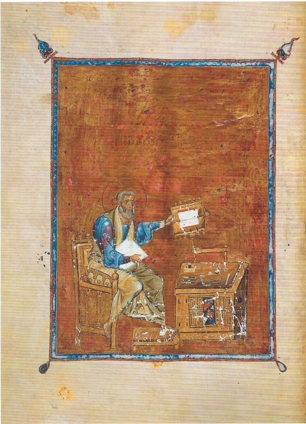
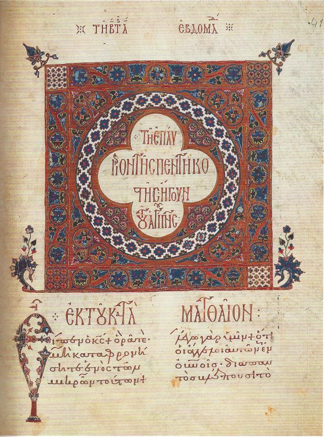

Figures 4.1-2. Gospel Book MS no. 20 of the Museum of Byzantine Culture, Thessaloniki, probably Constantinople,
last quarter of the 11th c. The Evangelist Matthew and the beginning of his Gospel pericopes.
Source: George Galavaris. (2002). The Gospel, MS 20 of the Museum of Byzantine Culture, Thessaloniki: a
hidden treasure. Museum of Byzantine Culture, 9, pp. 40-41 (figures 2-3) and p. 50 (dating). © Museum of
Byzantine Culture, Thessaloniki.

Commenting on the beauty of the above manuscript within the broader context of the Byzantine
liturgical arts, G. Galavaris emphasizes that the manuscript’s radiance “is not self-luminous. It is
not simply a play of imagination and artistic inventiveness that dazzles us. As the
faithful person reads the word of God and contemplates the preciousness of this Gospel Book, he receives from the
splendour of the ornament the energy of the radiance of Divine Grace. He encounters divine Beauty not
in order to be enchanted by it, but in order to feel the presence of God. The Gospel Book belongs to the worship
of the Church and, like the holy icons and the relics of the saints, it too is a sign of the presence of
God.”ii
The notation that accompanies the readings of Holy Scripture and, more generally, the
phenomenon of ekphonetic practice have aroused the interest of many scholars, such as, for example, the following:

 John Tzetzes, to whom, moreover, the adjective “ekphonetic” is owed as a qualifier of this

particular musical script,iii

 the Danish musicologist Carsten Høeg, author of the foundational monograph entitled “Ekphonetic

Notation,” one of the first publications of the Monumenta Musicae Byzantinae of
Copenhagen,iv

-  Father Grigore Panţiru, who dealt specifically with the famous Iași Gospel 160/IV-34,v

-  the researchers Sysse Gudrun Engberg and Sandra Martani, who published a great number of

specialized articles concerning the palaeography of ekphonetic music,

 Antonios Alyyizakis, who offered an informative “map” of present-day ekphonetic

practice, also proposing new approaches to its recording and theorizationvi, among others.
In the following sections we shall deal briefly with matters of definition, origin,
dating, sources, methodology, and periodization of ekphonetic notation, so that we may later

175

proceed to the lists of ekphonetic neumes, to the individual characteristics of the various
systems of ekphonetic script, to the question of critical editions of texts with ekphonetic
notation and of the various attempts at transcribing it, as well as to the significance of present-day
ekphonetic practice.

## 1.2. Definitions

The term ekphōnēsis (ἐκφώνησις, from the verb ἐκφωνέω) generally designates an act of public and loud
recitation. In the context of the services of the Byzantine rite, it is combined with the intoned recitation (Lat.
lectio sollemnis) of pericopes from Holy Scripture, of the kontakion, and of various prayers and petitions. It constitutes
a kind of liturgical recitative, a speech-like chant (Ger. Sprechgesang).vii
As ekphonetic notation there is known today in Byzantine musicology a special type
of Greek notation, which regulates the intoned recitation of scriptural texts. It uses
for the most part pairs of signs, which are placed above, below, or between the lines
of the scriptural text, dividing it into short musico-rhetorical phrases (the so-called cola [κώλα]), which,
in turn, are assembled into larger units, the periods.viii The ekphonetic
signs are usually written in red ink, though there are also cases in which they are
written in the same ink as the scriptural text (dark brown or black), especially in the older
MSS.ix

## 1.3. Sources of ekphonetic notation, chronological limits, periodization

The study of ekphonetic notation is based chiefly on the following kinds of sources:

- Practical sources: liturgical books with ekphonetic notation,

- theoretical sources: Byzantine lists–didactic poems with ekphonetic signs,

- the present-day oral practice of ekphōnēsis in services of the Byzantine rite,

- comparative sources (e.g. the Hebrew tradition of the ekphōnēsis of texts of the Old Testament, Latin ekphonetic notation, etc.).x

Regarding the first category of sources, it should be clarified that ekphonetic notation
is documented chiefly in manuscripts of the 9th–14th centuries, of the following three types:

1. Gospel Books,

2. Apostoloi and

3. Prophets.

In general, manuscripts with ekphonetic notation are known as Readers’ Books or Lectionaries
(from Lat. lectio = reading).xi Table 4.1 clarifies their general contents.

176

|Name of the liturgical book|Contents|Place of the readings in the services of the Byzantine rite|Performers|Remarks|
|---|---|---|---|---|
|Gospel Book, Holy Gospel Book|In the Gospel Book are entered the pericopes from the four Evangelists, adapted to their liturgical use. A Gospel Book contains chiefly two parts: A. The Synaxarion (Lat. temporale), which follows the pericopes of the movable liturgical cycle, beginning with Pascha and ending with it, in the following order: John, Matthew, Luke, Mark. B. The Menologion (Lat. sanctorale), which records the pericopes of the fixed liturgical cycle, from 1 September to 31 August. C. Smaller collections of pericopes are added, e.g. with the eothina Gospels, for Sunday Orthros (they concern the Resurrection of the Lord), etc.|● In the first part of the Divine Liturgy (Liturgy of the Word), the so-called Small Entrance takes place, with the Gospel Book in the hands of the deacon (or the priest), preceded by candle-bearing youths and the censer. A little later the reading of the Gospel pericope takes place. ● Gospel readings are also found in certain Orthros services (e.g. Sunday → eothina), in the sacraments of Baptism, Marriage, and Holy Unction, and in various other services (e.g. of the Supplicatory Canon, etc.).|● The Gospel pericopes are read by the deacon or, on very important feasts, by the patriarch or another hierarch, or by the priest. ● The reading takes place from the ambo (see Figures 4.3-4), or in front of the Beautiful Gate (central gate of the Sanctuary), or even upon the Holy Table.|● Some Gospel Books enter in their first part only the pericopes for Saturdays and Sundays, others for every day. The latter were probably intended for use in monasteries, while the former in parishes. ● Tetraevangelion is the name given to the liturgical book that records the Gospel text in continuous form, according to the four Evangelists: Matthew, Mark, Luke, and John. Some Tetraevangelia were later adapted for liturgical use, with the addition of short introductory phrases (e.g. Τῷ καιρῷ ἐκείνῳ), and/or ekphonetic notation. ● The Gospel Book with luxurious binding is mentioned in various Typika or Byzantine historical sources as a megaleion and is associated with the patriarch, the emperor, or the patriarchal throne. ● Other designations for the Gospel Book: Eklogadion \| later terminology, chiefly in Western scholarship: Evangeliarion, Evangelistarion.xii|
|Apostolos|● It contains the pericopes from the Acts of the Apostles, from the Epistles of the Holy Apostle Paul, and from the so-called Catholic Epistles (James, Peter, John, and Jude). ● It is structured by analogy with the Gospel Book (Part A: Synaxarion, Part B: Menologion).|● Apostolic readings are found chiefly in the Divine Liturgy, before the Gospel pericope. They are also found in the aforementioned sacraments and in various services such as, for example, the Lesser Blessing of Waters, etc.|● The reading is performed by the reader (or by the chanter), at the chanters’ analogion or in the solea, in front of the Sanctuary.|● Praxapostolos is the book that corresponds to the Tetraevangelion.|

177

Prophets, a Contains readings from the Old ● At Vespers of major ● It is read by Whereas the pericopes from the Apostolos and the
collection Testament in the Septuagint, feasts. the reader or the Gospel are performed to this day in intoned
known also chiefly from Genesis, ● At the Divine Liturgy of the chanter. recitation, the prophetic readings are read
as Exodus, Deuteronomy, the Books of the Presanctified Gifts and in a more plain manner, which is called
Propheto- Kingdoms, Proverbs and the Wisdom of Basil the Great “chyma” (χῦμα).xiv
Solomon, and the Prophets.
logion (eves of Christmas
and Theophany, Great
Saturday).xiii

Table 4.1. The liturgical books with ekphonetic notation, 9th–14th c.xv

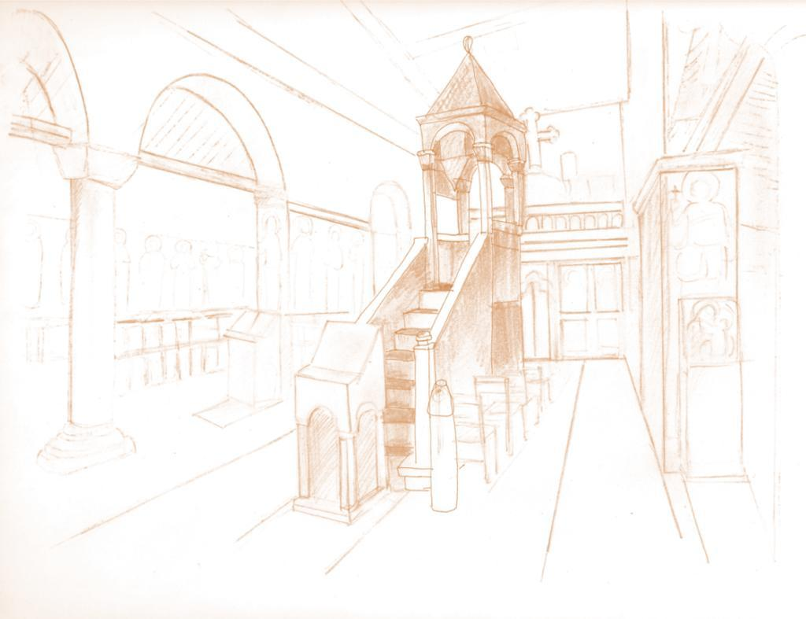

Figure 4.3. The large marble early Christian ambo (7th c., with later restorations), with stairways to the east and west, in the centre of the middle
aisle of the Church of the Dormition of the Theotokos, Kalambaka (see Pispas, 2012, pp. 22-23. Church of the Dormition of the Theotokos, Tsarouchas Publications. Office of the Pannychis, 2009).
Sketch by Georgios Tzimopoulos & Aikaterina Ioannidou (2016). In front of the western stair of the ambo there is also visible a smaller lectern that
is also used today for readings.xvi

178

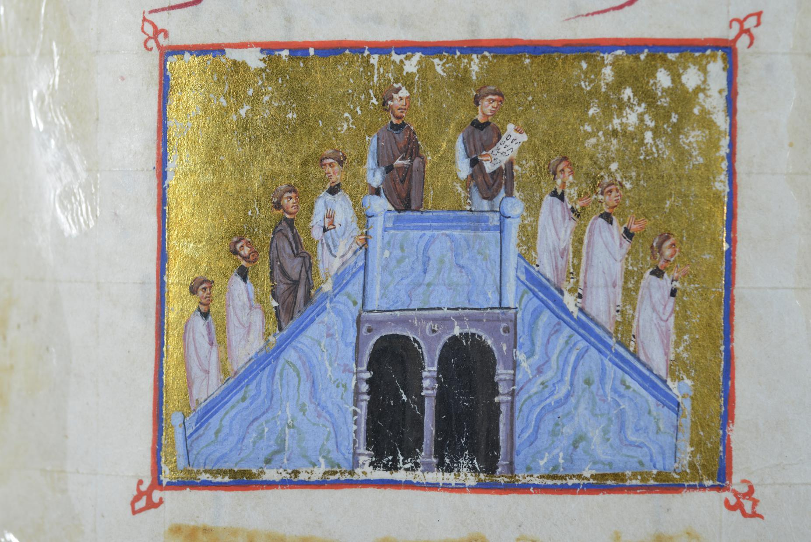

Figure 4.4. Dionysiou Monastery 587, fol. 43r, year 1059: Clerics of various ranks on an ambo. The cleric at upper right is holding a scroll.xvii © Holy Monastery of Dionysiou, Mount
Athos.

179

The sources of this period indicate an evolutionary course of the notation, which was divided by
C. Høeg and S. Engberg into the following three stages:

1. Archaic or pre-classical system: in MSS of the 9th–10th c.,

2. classical system: known from MSS of the 11th–12th c.,

3. declining system: chiefly in MSS of the 13th–14th c.xviii

Although the first verified examples of ekphonetic notation today date back only
to the 9th c., Høeg is of the opinion that this notation must have been much earlier. On the basis
of comparison with the ancient Greek system of prosodic signs, he proposes as the date of formation of
ekphonetic notation the 4th c. AD.xix However, the ekphonetic neumatic signs (σημαδόφωνα) in the famous
palimpsest Codex Ephraemi rescriptus cannot be contemporary with the first scribe of the
manuscript (5th c.), but are later additions, as palaeographical
studies by the same scholar show (see Figure 4.5).

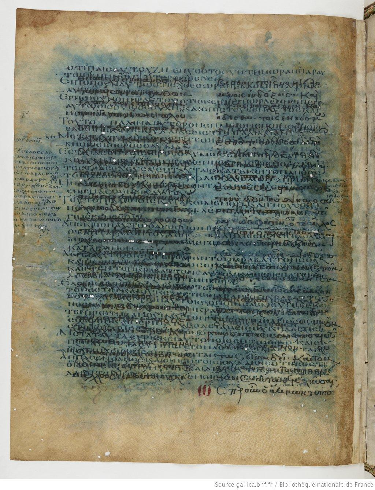

Figure 4.5. Codex Ephraemi rescriptus (National Library of France, Parisinus gr. 9, or otherwise Codex C or 04),
palimpsest MS, with lower script of the 5th c. (majuscule), containing Holy Scripture, and upper script

180

of the 13th century (minuscule), with works of Saint Ephraim the Syrian in Greek. The ekphonetic neumatic signs that
exist in various pericopes of the New Testament in the manuscript in question are later additions (probably
of the 10th or 11th century, in the early classical system of ekphonetic notation, since the signs appear in
pairs on fol. 203v, in the 2nd and 13th lines). In the present Figure: fol. 208v. In the lower script: an excerpt from the
Gospel according to John (4:51–), with several ekphonetic signs that appear more clearly (we have placed them in red
circles). The neumatic signs are a little more distinguishable in the left margin, where they are recorded together with a later
addition of text.
Source: <http://gallica.bnf.fr/ark:/12148/btv1b8470433r/f427.image> (18.8.2016). xx © Bibliothèque nationale de France.

The classical system is regarded as the “zenith” of ekphonetic notation, to which
usually also the lists of ekphonetic signs, which are contained in various codices, such as, for example,
Leimonos 38 and others.xxi Significant examples from various manuscripts with ekphonetic notation of the
archaic and classical systems (9th–12th c.) are found in Thibaut (1913, pp. 34-51).
On the other hand, ekphonetic signs in later manuscripts (15th century and
isolated cases up to the 17th century) document the disintegration of this written
musical system, which led gradually, already from the 13th century, to the dissolution of the
aforementioned pairs, to the reduction in the number of signs, to their purely graphic-
decorative presence, and finally to their disappearance from liturgical books.xxii

## 1.4. Hypotheses on the origin of Byzantine ekphonesis and ekphonetic notation

The strong convergence shown by the ekphonetic signs (sēmadophōna) at the graphic and terminological
level with the prosodic signs of the ancient Greek language makes evident the dependence of this
written musical system on the prosodic system and, indirectly, on “the actual musicality of the
Greek language.”xxiii In addition, it appears that the various punctuation systems of ancient Greek
grammar also constituted a point of reference in the formation of ekphonetic notation.xxiv
It has already been mentioned that C. Høeg argues in favor of an early genesis of the ekphonetic
parasemantic notation (4th c. AD). S. Engberg prefers, on the basis of the surviving sources, to place the
creation of ekphonetic notation in the 9th century, after Iconoclasm, in the broader
context of the Macedonian Renaissance. That is, at the same time as the transition
from majuscule to minuscule script takes place and the systematic use of prosodic
signs begins: see, e.g., the Uspenskij Tetraevangelion of the year 835 (photographs in ch. 2, Assessment
criterion 2.6), where one can observe on the first folio a kind of proto-ekphonetic
notation, in combination with prosodic signs and various punctuation marks.
Furthermore, S. Engberg connects the formation of the ekphonetic system with the important
missionary activities of the Byzantines during the 9th and 10th centuries, seeing in this notation an
effective tool for disseminating the Greek manner of reciting the Holy Scriptures also among other
peoples.xxv
Regarding the origin of Byzantine ekphonetic practice, various scholars consider that
the following are possible sources:

α. On the one hand, the traditions of ancient Greek rhetoric, epic, and theatre, with which

both the ekphonetic and the reading tradition in Byzantium are related.xxvi

β. On the other hand, the reading of Old Testament texts by the Jews of the Diaspora,

during the Hellenistic period, on the basis of the Septuagint Translation.xxvii
From the creative combination of these elements, it appears that Byzantine cantillated
recitation was born.

181

## 1.5. Methodology for the study of ekphonetic notation

As mentioned above in section 1.3, study in the field of ekphonetic notation is based
today on the combined analysis of data from:

- Liturgical books with ekphonetic notation (practical sources),

- lists-didactic poems with ekphonetic signs (a broader category of music-theoretical sources),

- the oral practice of ekphonesis today and on the basis of older recordings of readings by representative bearers of the ekphonetic tradition.

In addition, research into Byzantine ekphonetic notation is broadened through
interdisciplinary comparisons with related traditions (e.g. Hebrew, Latin, Coptic, and others).
Above all, however, the study of ekphonetic notation and of its uninterrupted oral
tradition gains depth when it is considered within the space that generated it, the space of Orthodox
worship, as it was formed in Byzantium and evolved down to the present day. Sandra Martani emphasizes:

"Only an integrated consideration of both music and liturgy permits a genuine understanding of
the totality and complexity of Byzantine worship. If such an interdisciplinary approach is
deemed important for the study of Byzantine hymnography, one can understand how essential it
is for the study of 'ekphonesis', the system used for the cantillation of Sacred Scripture within
the liturgy. In this context the interpenetration of artistic form and divine revelation is even
more intimate. Unfortunately, since the Byzantine ekphonetic notation cannot now be
deciphered, we are denied a full understanding of its richness. Nevertheless, a meticulous study
of the medieval system for the cantillation of the Scripture can potentially foster a better
understanding of its unique characteristics and the role that ekphonesis played in the
proclamation of the Scriptures in the Orthodox Church."xxviii

The study of ekphonetic notation comprises various levels, each with particular
working steps. At a first, basic level of study, the following can be done:

- Learning the ekphonetic signs, through the relevant Byzantine didactic lists and modern systematizations,

- carrying out exercises in ekphonetic notation, on the basis of codices in majuscule and minuscule script, starting from the classical system. The exercises include the transcription of the text with all additional signs (prosodic, punctuation, ekphonetic), and the identification of the musical signs.

- Listening and practice in cantillated recitation according to present-day practice.

The study can continue at a second, more advanced level, with the carrying out of the following
working steps:

- Exercises with the pre-classical and the declining system,

- study of critical editions and an attempt to prepare a small edition of a pericope, on the basis of various sources, with the preparation of the relevant apparatuses,

- study of the specialized bibliography on ekphonetic notation,

- deeper engagement with the present-day practice of cantillated recitation,

- carrying out comparative studies between Greek cantillated recitation and other related traditions.

The following sections aim to facilitate the basic study of ekphonetic notation
and to prepare the ground for the more specialized study of this notation, for those who
may later wish to proceed toward this field.

182

## 2. The signs of ekphonetic notation

## 2.1. The Byzantine Lists of Ekphonetic Sign-Formulas

The earliest Byzantine theoretical texts concerning the Psaltic Art consist of lists
of a mnemonic-didactic character, containing names and shapes of signs—corresponding melodic
formulas.
For ekphonetic notation the following six lists are known today:

- Sinai 213, fol. 116v, 10th cent.? (Harlfinger/Reinsch/Sonderkamp/Prato), without a heading. This is the earliest list of Byzantine neumes.

- Sinai 217, fol. 2r, although later than the preceding list, can nevertheless be compared with it in the number and arrangement of the signs (Martani) / 14th cent. (Høeg). The list bears the heading: «† The beginning, with God, of the tones of the Apostles and of the Gospels (sic), thus †».

- Sinai 8, fol. 303r, late 12th cent. (Høeg)/ca. late 11th cent. (Floros), without a heading. This is a didactic poem, in which the formulas of ekphonetic notation were also transcribed into Old Byzantine notation. The order of the formulas differs from that in all the other lists.

- Leimonos 38, fol. 317v, late 12th cent.? (Høeg), 12th cent. (Engberg), without a heading.

- Tbilisi Q 908, fol. 279r, 13th cent.? (Εngberg). This is a Georgian manuscript. The list of ekphonetic sign-formulas is written in Greek, but the heading is in Georgian and has the following content: «Signs and sounds of the four Gospels and of the Apostles, according to the Greek melody».xxix The lists of the Holy Monastery of Leimonos and of Tbilisi are the most complete, representing the fully developed ekphonetic notation of the classical period (11th-12th cent.). They function in a sense as «didactic pericopes», since they preserve the structure of actual scriptural readings.

- Finally, there is an additional MS, known today only from the descriptions of I. Tzetzes, probably of the 12th cent. (Engberg). xxx

We shall begin tracing ekphonetic notation with these lists as our guide (see
Figure 4.6):

183

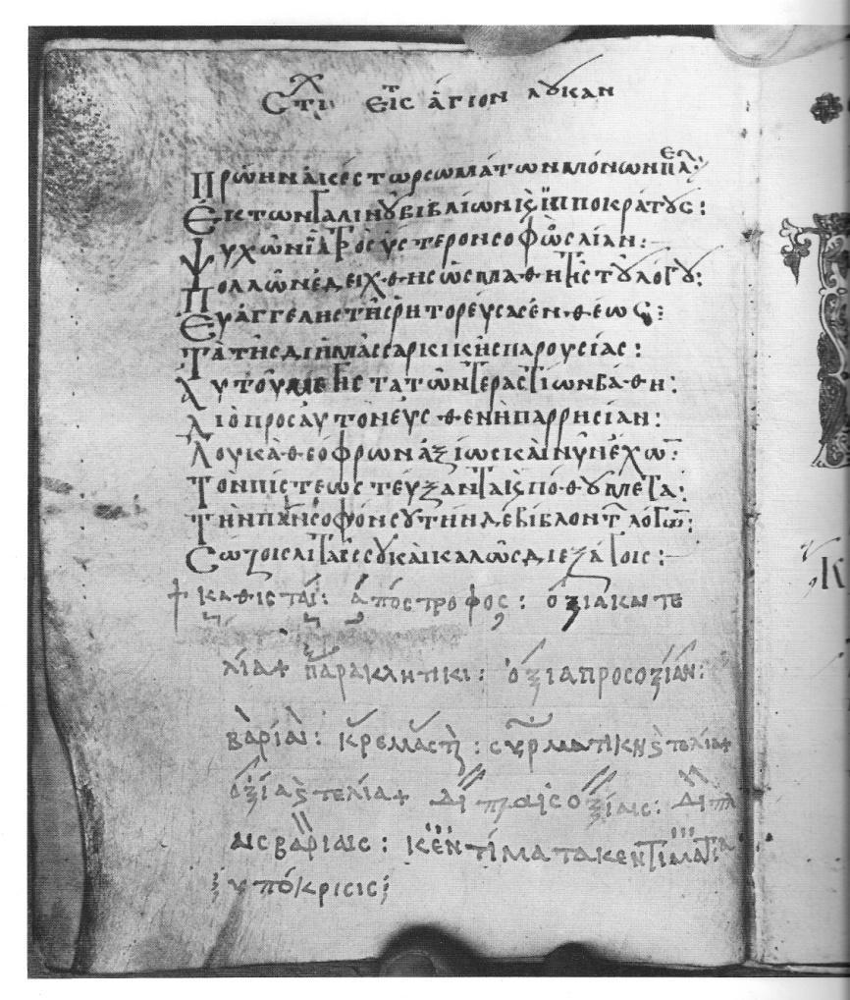

Figure 4.6. Codex Sinai gr. 213 (Gospel book), fol. 116v, with the earliest presently known list of ekphonetic
sign-formulas.xxxi © Holy Monastery of Saint Catherine, Sinai.

In Figure 4.6, two different hands appear, writing in two different types of script.
In the upper part of the folio there are encomiastic verses for Saint Luke the Evangelist, written
by the principal scribe of the manuscript, while in the lower part is the list of ekphonetic notation.

184

-  Can you identify the two kinds of script present in Figure 4.6, on the basis of your knowledge

from chapter 2 (majuscule script).xxxii

The principal scribe of the manuscript noted his name and rank on fol. 1v: the presbyter
Eustathios. He himself left on fol. 340v the following colophon (see Figure 4.7).

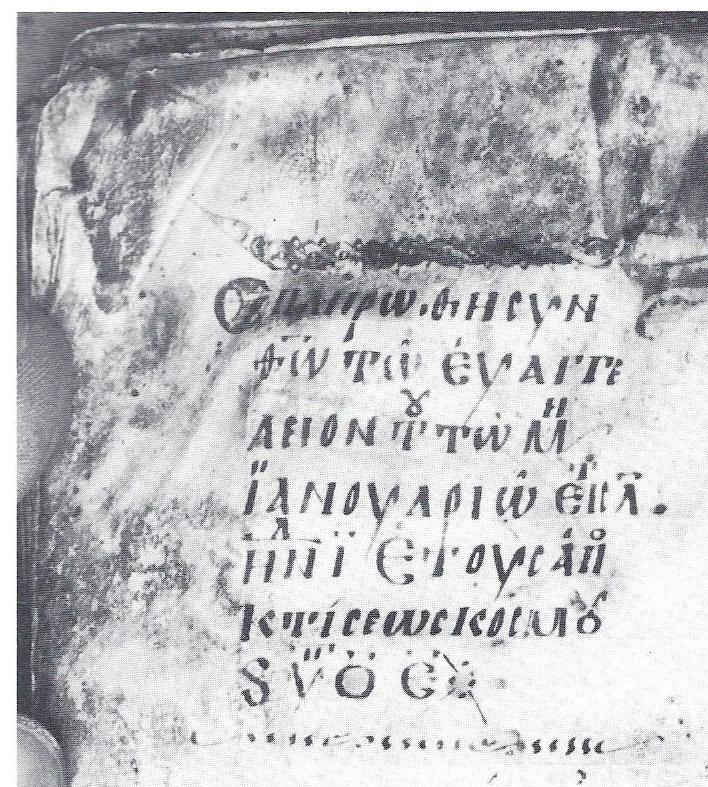

Figure 4.7. Sinai gr. 213 (Gospel book), fol. 340v, with the colophon of the manuscript.xxxiii © Holy Monastery of Saint Catherine,
Sinai.

 Can you find the date on which the presbyter Eustathios completed his laborious

work, by reading the colophon and carrying out the corresponding arithmetical calculations (see chapter 3).
The date that you find constitutes the terminus post quem for the writing of the list of ekphonetic
signs.xxxiv

 You can also read the ekphonetic list in Figure 4.6 and observe the pairs

of signs per colon. A diplomatic transcription of the list (to which the expansion
of the abbreviations has, however, also been added) is provided for comparison in Figure 4.8.

185

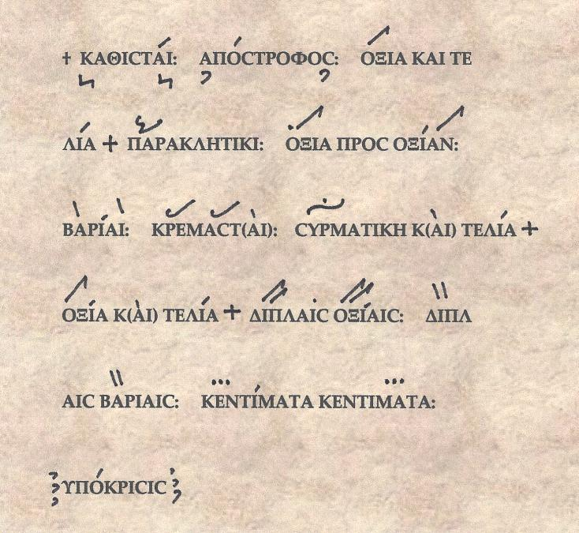

Figure 4.8. The list of neumes from the codex Sinaiticus graecus 213, fol. 116v, late 10th cent., in diplomatic transcription.
Thirteen cola are observed (musico-rhetorical units or phrases). With the exception of the parakletike, all the others
have two musical signs each: one at the beginning and the other at the end of the phrase. The signs are the same at the beginning and
the end of each phrase, except for the cola that close with a cross shape, the so-called teleia.

Figures 4.9-10 show two other lists of ekphonetic signs, each documenting
a slightly increased number of neumatic pairs:

186

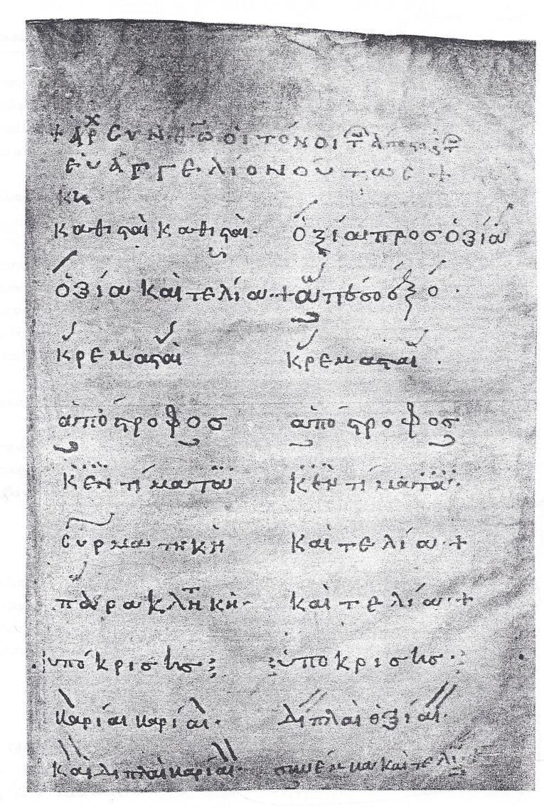
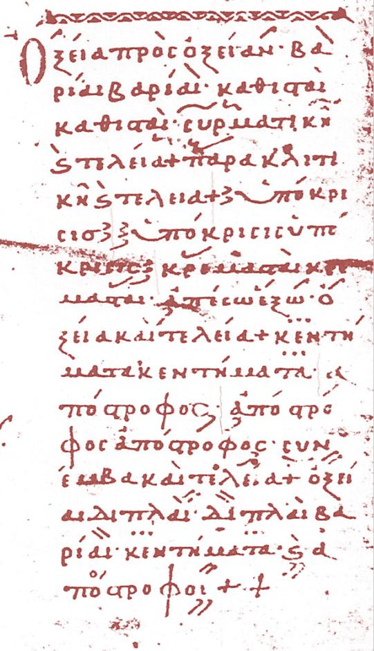

Figures 4.9-10. Left: Sinai gr. 217 (Gospel book of the 11th or 12th cent.), having on fol. 2r a later list of ekphonetic signs (14th cent. according to C. Høeg),xxxv
with the heading: «† The beginning, with God, of the tones of the Apostles and of the Gospels (sic), thus †». © Holy Monastery of Saint Catherine, Sinai.  Right: The
«didactic pericope» for emmelic recitation at the end of the Gospel book of the Holy Monastery of Leimonos on Lesbos, no. 38 (12th cent.), fol. 317v, right column. In this MS, the text is
written in dark brown ink, while the rubrics, initials, and ekphonetic signs are in red.xxxvi © Holy Monastery of Leimonos, Lesbos.

As stated above, the neumatic lists from the MSS Leimonos 38 and Tbilisi Q 908 offer the most extensive catalogues of ekphonetic
signs/formulas. Table 4.2 contains a transcription of the didactic pericope from the codex of the Holy Monastery of Leimonos. The music-theoretical
text is divided into cola with increasing numbering, and some comments are made concerning the pairs of ekphonetic signs.

187

Serial no. of musico-
rhetorical
unit
(colon)

1.

2.

3.

4.

5.

6.

7.

8.

9.

10.

11.

Music-theoretical text for emmelic
recitation

Comments

Three cola with homogeneous pairs of signs.

Two heterogeneous pairs, ending with the
shape of the cross. It should be noted:

● colon 4: besides the initial syrmatike there is

also a medial one, in a rather extended colon,

● colon 5: the parakletike, which in the list of the

MS Sinai 213 stood alone, is here
completed by the teleia. Possibly the
pairs that close with the sign of the teleia (cola
4, 5, 10, 13) could be paralleled
with the complete cadences in the present-day practice
of ekphonesis.
Two forms of hypokrisis, first with two
apostrophoi, then with three. The repetition of the
name of the sign in cola 2, 3, 7, 8, and 12b
aims at the lengthening of the text, in order to
approximate the size of a corresponding
colon in the pericopes proper.

If we exclude the pairs that end with
the teleia, the apeso exo is the only
heterogeneous pair of the classical system
of ekphonetic notation.

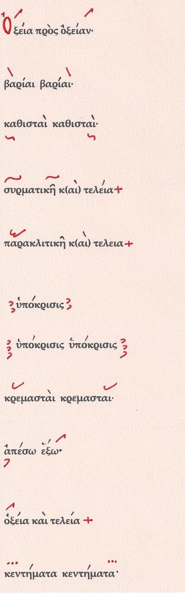

188

Probably the two cola of the apostrophoi
exemplify the various sizes that
a corresponding phrase may have in the pericopes
proper.

12a.

12b.

1.

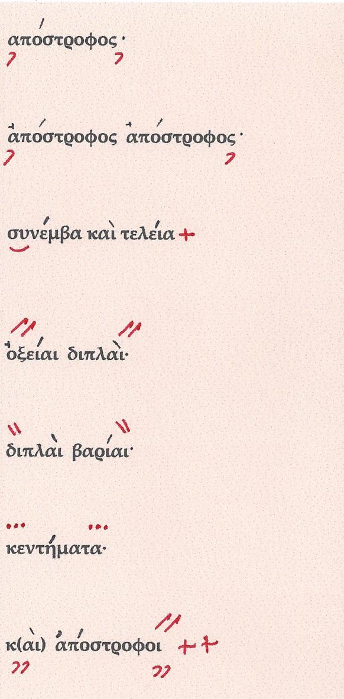

With the doubled signs begins the zone
of the final cadence of the pericope.

1.

2.

3.

In the final cadence of the pericope,
in addition to the pair of two
apostrophoi, a double oxeia and two crosses
are observed. Possibly at the final cadence the level
of melismaticity was increased. Something
similar also occurs in present-day ekphonetic practice.

1.

Table 4.2. The didactic pericope of the MS of the Holy Monastery of Leimonos, no. 38, fol. 317v: transcription & comments.xxxvii

A special case is the list of ekphonetic signs in the MS of the Holy Monastery of St Catherine, Sinai
gr. 8, fol. 303r. As shown in Figure 4.11, there are two series of notation:

- In large red shapes, ekphonetic notation, and

- above it, in smaller black shapes, a transcription into Old Byzantine notation, which allows us to understand the logic of how ekphonetic notation functions in general, and the manner of using lists of ekphonetic notation in particular.

189

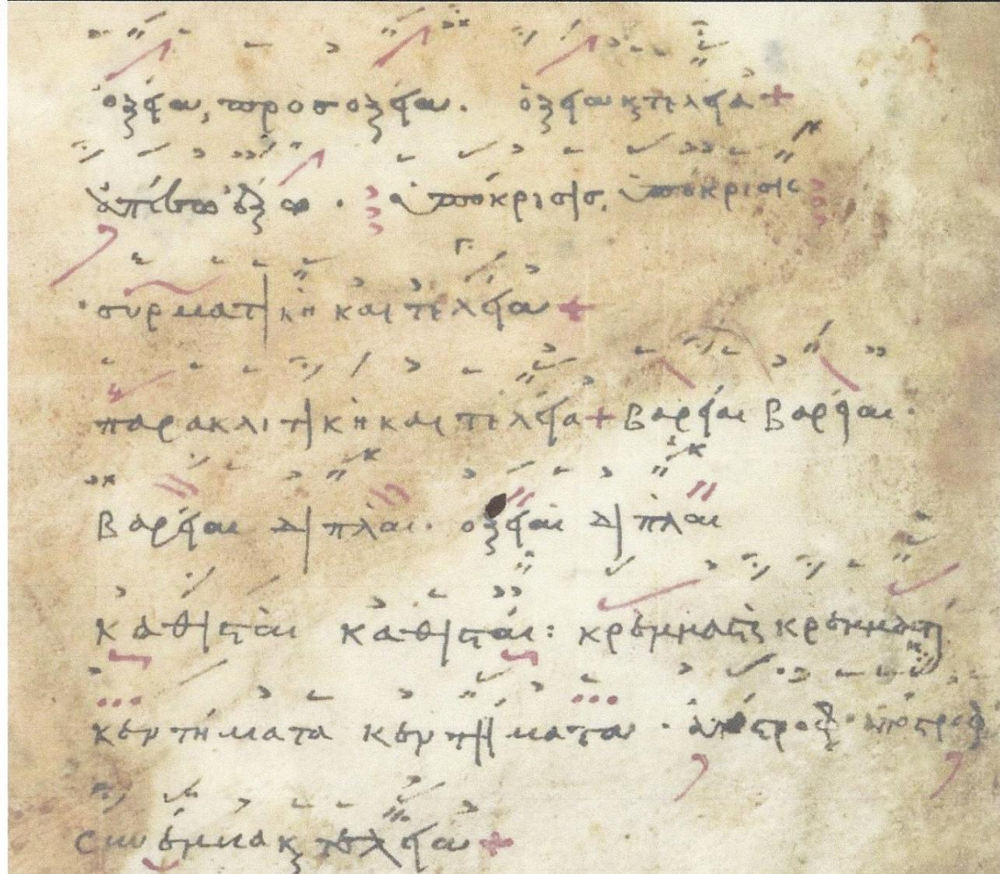

Figure 4.11. The didactic poem of ekphonetic notation of the MS Sinaiticus graecus 8 (Prophetologion, 10th or 11th
cent. [Rahlfs and Høeg]). It is found at the end of the codex, fol. 303r, and was added by a later hand (late 12th cent.
[Høeg], ca. late 11th cent. [Floros]).xxxviii © Holy Monastery of Saint Catherine, Sinai.

K. Floros clarifies that, in the case of the writing in black ink, this is Old Byzantine
notation of mixed type, which presents elements from both families of this
notation: the Hagiopolitan (the so-called «Coislin»: e.g. the hooked ison at the beginning of the
formula «parakletike» in the fourth line) and the Athonite (known as «Chartres» notation:

e.g. the special episema oligon: a small o, like a dot, and above it a stylized l, as a small

curved line, e.g. at the beginning of the thesis «apeso exo», in the second line, above the first oxeia).
Because, however, Old Byzantine notation is adiastematic, we cannot
decipher with certainty the basic intervallic relationships of each formula. Nevertheless,
C. Høeg attempted to proceed to a rendering of the general contour of the emmelic movement for each
formula (see Figure 4.12). K. Floros, in turn, revised Høeg’s transcriptional proposal
through comparisons with parallel musical theses (formulas) in manuscripts with Old Byzantine
notation, renewing the foundations for further research in this field.xxxix

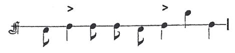

Figure 4.12. An «approximate transcription» by C. Høeg for the first ekphonetic thesis («oxeia to oxeia» sic)
of the didactic ekphonetic poem from MS Sinai 8.xl

190

## 2.2. Sketching the Set of Ekphonetic Sign-Formulas

On the basis of the Byzantine lists of ekphonetic signs/formulas mentioned in
the previous section and through the study of practical sources, various palaeographers proceeded to
the compilation of tables for this notation. Table 4.3 shows the set of the corresponding
signs.

Shapes of individual signs

Usual Some other
shapes in the shapes
classical system

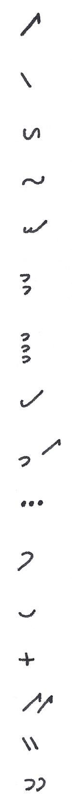

Names Remarks
of signs
Relations with the Art of Grammarxli

Similarities with
Old Byzantine
neumes
oxeia

acute prosody oxeia

grave prosody bareia

kathiste

syrmatike

parakletikexliii

(similarity of the shape to one of
the forms of the circumflex
prosodic signxlii)

hypokrisis ek dyo from “kath’ hypokrisin”: a mode
of reading texts, alongside “kata
prosodian” and “kata diastolen”,

according to which the

hypokrisis ek
trion

“ethos” of the text is brought out.xliv

bareia

syrma

parakletike,
rheuma

katabasma,
psephiston

kremaste

apeso exo

kentemata

From the

apostrophos apostrophos category
“affections” of the
prosodic
synembaxlv cf. the hyphen
signs

full stop

double oxeia

full stop: one of the punctuation
marks. In Christian texts it sometimes takes
the shape of the
cross.xlvi

double bareia

apostrophoi

petaste /

petasma

apeso exo

saxismata /

kentema and two

kentemata

apostrophos

cross

double (oxeia)

piasma

two apostrophoi

191

Table 4.3. The complete set of sign-phonemes (σημαδόφωνα) of ekphonetic notation and affinities with the systems of
prosodic signs and Old Byzantine neumes.xlvii

As we saw in the Byzantine lists of ekphonetic notation, the above signs are combined for the most part in pairs,
with one sign placed at the beginning of the musico-rhetorical unit, and the other at its end.
In the next section, the modes of combination of the ekphonetic signs will be discussed through a
historical consideration of this notation.

## 2.3. The principal characteristics of the pre-classical and classical system

It has already been mentioned that the pre-classical system of ekphonetic notation appears in Gospel Books, Apostolos lectionaries, and Prophetologia of the 9th–10th centuries, while the great flourishing of this system of notation is observed in corresponding codices of the 11th–12th centuries, with the classical system. More specifically,
it is considered that, during the 12th century, ekphonetic notation reached the highest point of its
development.xlviii The following Table 4.4, which is based on clarifications by S. Martani, brings together basic
features of the two systems, starting from the crystallised form of the classical
system:

|Classical system|Preclassical system|
|---|---|
| It operates with 15 pairs of signs, of which: - four have the teleia (τελεία) as their second sign and are placed at the end of a period of the biblical text. - The remaining pairs appear within a period. They are homogeneous, that is, they consist of the same sign at the beginning and at the end of the musico-rhetorical unit. The so-called apeso exo (ἀπέσω ἔξω) (apostrophos-oxeia) is an exception.  The use of pairs with synemba (σύνεμβα) and teleia, as well as with syrmatike (συρματική) and teleia, is frequent. In the case of the latter pair, an additional syrmatike often appears toward the middle of the musico-rhetorical unit.  The zone of the final cadence begins with pairs of double signs: double oxeiai (διπλαί οξείαι) and double bareiai (διπλαί βαρείαι), whose use is limited to the end of the pericope, kentemata (κεντήματα), apostrophos (ἀπόστροφος) (or also apostrophoi, possibly again with a double oxeia: see the list Leimonos 38), and at the end with one or two teleiai.| The signs do not always appear in pairs, but also singly (either only at the beginning or only at the end of the musico-rhetorical unit).  Pairs are formed freely.  The use of pairs with parakletike (παρακλητική) and with hypokrisis (ὑπόκρισις) is frequent.  The zone of the final cadence shows greater variety, and the use of double signs is not restricted to the end of the pericope.|

Table 4.4. The basic features of the classical and the preclassical system of ekphonetic
notationxlix

More specifically, the two evolutionary phases of ekphonetic notation present the following
symbols, according to S. Engberg (Tables 4.5-6):

192

Pairs of signs in the classical
system
The signs are in red. The black
short line represents the text.

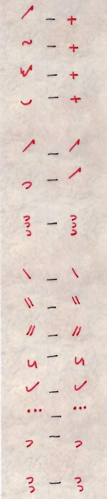

Names of pairs from
Byzantine lists of ekphonetic
signs

oxeia and teleia

syrmatike and teleia

parakletike and teleia

synemba and teleia

oxeia to oxeia

apeso exo

hypokrisis of three

bareiai

double bareiai

double oxeiai

kathistai

kremastai

kentemata

apostrophos

hypokrisis of two

Numerical Remarks
code for
critical editions

01

02

03

04

The pairs with the teleia
indicate the end of a
period.
Sometimes there is
also a middle
syrmatike.

1

2

3

4

5

6

7

8

9

10

12

The remaining pairs
are used within
a period.

inside =

low
high

outside =

The hypokrisis is often
combined with a
question in the biblical
text.

The double bareiai and
double oxeiai
are used only
in the zone of the final
cadence of the pericope.

It should be noted that the
apostrophos may also be
double in the final
cadence: see the list
Leimonos 38, colon 17.

Table 4.5. The classical system of ekphonetic notation: the basic pairs of signs (according to S.
Engberg).l

193

Signs in pairs or without
a mate
The signs are in red. The black
short line represents the text.

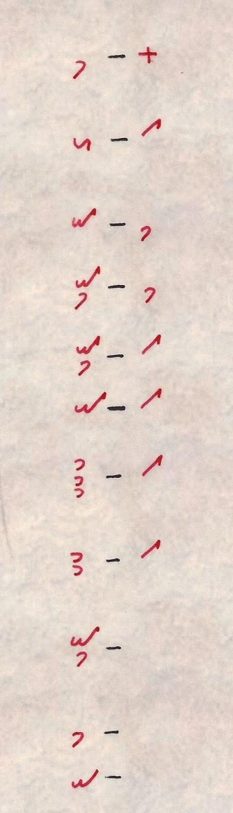

## Names of signs

Numerical Remarks
code for
critical
editions

The lists of ekphonetic signs in
Byzantine manuscripts do not include the
present pairs. The names below
are formed by analogy with the basic
pairs, to facilitate their study.

For the end of a period.

05

apostrophos and teleia

11
Heterogeneous pairs with
13 the parakletike, a
sign that
appears frequently in the
14 preclassical system.

|parakletike with apostrophos|14|preclassical system.|
|---|---|---|
|to apostrophos|||
|parakletike with apostrophos|15||
|to oxeia|||
|parakletike to oxeia|16||
|||Heterogeneous pairs with the|
|from oxeia|17|two forms of the|
||||
|hypokrisis of two to oxeia|18||
|parakletike with apostrophos|19|Signs (compound or|

kathiste to oxeia

parakletike to apostrophos

Signs (compound or
simple) which
appear only at the
beginning of the
musico-poetic
unit.

(the apostrophos
alone was added; the
clarification “alone” was added so that it not be confused with the

20

pair no. 10 [see preceding table])
parakletike (παρακλητική)

21

Table 4.6. Other pairs of signs of ecphonetic notation, based on manuscripts of the “Prophetologion” type
(according to S. Engberg), showing traces of the pre-classical system.li

With the two preceding tables we can identify the signs of ecphonetic
notation in a very large proportion of manuscripts.
Nevertheless, there are still other, rare instances of pairs, which come to light
as the detailed study of ecphonetic notation in the practical sources advances. One such
case is discussed in the next section.

194

1. A case study: the use of ecphonetic neumes in the Vienna Gospel,

suppl. gr. 128: an intermediate evolutionary stage or a local tradition?

The Gospel Vindobonense suppl. gr. 128 dates to the beginning of the 12th century and appears to have been written
in some scriptorium of the Byzantine provinces. In terms of its rubrics, however, it is associated with the
liturgy of Constantinople; moreover, the manner of script, decoration, and miniatures constitutes
an imitation of models from the workshops of the capital during the Komnenian period.lii
Of particular interest is the ekphonetic notation of this manuscript, with a multitude of unusual pairs, which Sandra Martani systematized in Table 4.7 below, on the basis of a detailed analysis of 75 pericopes from the Gospel according to John.

Pairs of signs
The signs are in red. The small black line represents the
text.

## I. Pairs for the end of a period Pairs with the teleia as final sign

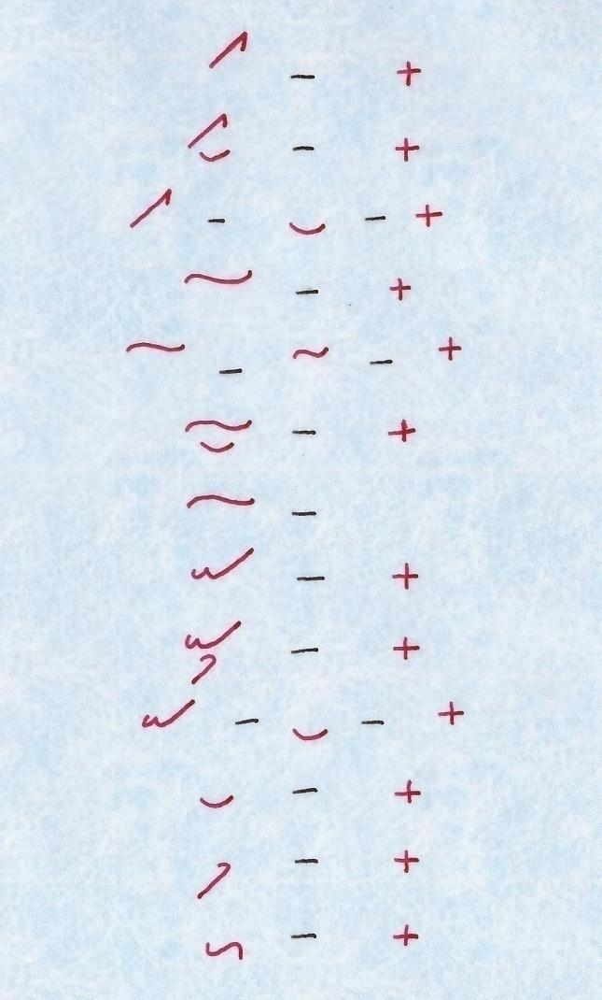

Initials of the names
of the individual signs
(α=apostrophos | β=bareia |
ββ=double bareia |
κ=kentemata | κθ=kathiste |
κρ=kremaste | ο=oxeia |
οο=double oxeia |
π=parakletike |
σρ=syrmatike |
σρ1=middle syrmatike |
ς=synemba | τ=teleia |
υ2=hypokrisis of two |
υ3=hypokrisis of three
Against a beige background: the classical pairs

|ο - τ|01|713|
|---|---|---|
|ος - τ|01a|2|
|o - ς - τ|01b|1|
|σρ - τ|02|794|
|σρ - σρ1 - τ|02|76|
|σρς - τ|02a|1|
|σρ -|02b|1|
|π - τ|03|208|
|πα - τ|03a|1|
|π - ς - τ|03b|1|
|ς - τ|04|73|
|α - τ|05|1|
|κθ - τ|06|1|

Pair codes Frequency
The codes of occurrence
of the classical combinations
in the ms.
and code 05: Engberg. The
codes of the remaining Vind. suppl.
pairs: Martani. (In gr. 128
parentheses are the codes for
the pre-classical pairs from
the Prophetologion:
Engberg)

195

II. Remaining pairs
Pairs with the oxeia as final sign

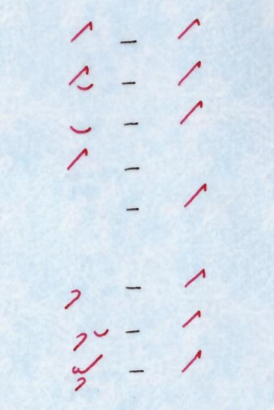

|ο - ο|1|387|
|---|---|---|
|ος - ο|1a|1|
|ς - ο|1b|1|
|o -|1c|1|
|- ο|1d|3|
|α - ο the apesō (ἀπέσω)|||
||||
||||
|ας - ο|2a|14|
|πα - ο|2b (15)|172|
|Pairs with hypokrisis of three|||
|υ3 - υ3|3|209|
|υ3ς - υ3|3a|1|
|υ3π - υ3|3b|1|
|υ3 - o|3c (17)|1|
|υ3 - αυ3|3d|4|

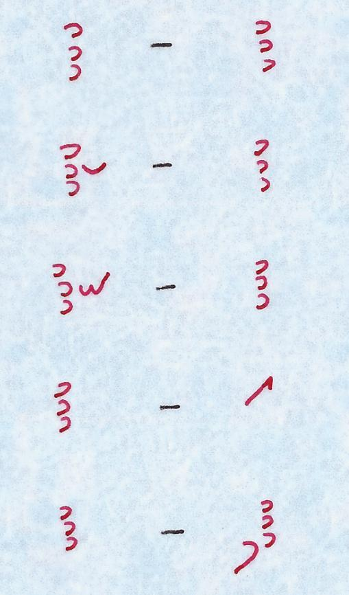

196

Pairs with bareiai

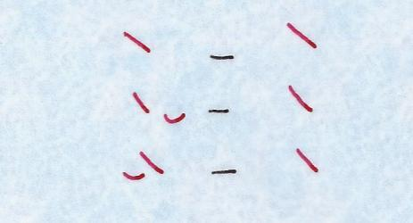

|β - β|4|112|
|---|---|---|
|βς - β|4a|58|
|ςβ - β|4b|1|
|Pairs with double bareiai|||
|ββ - ββ|5|113|
|ββς - ββ|5a|29|
|Pairs with double oxeiai|||
|οο - οο|6|17|
|οος - οο|6a|7|
|Pairs with the kathiste|||
|κθ - κθ|7|537|
|κθς - κθ|7a|138|
|ςκθ - κθ|7b|2|
|κθ - o|7c (11)|40|
|κθς - ο|7d|26|
|ςκθ - ο|7e|1|
|πκθ - ο|7f|8|
|πκθς - ο|7g|4|
|κθς -|7h|1|
|- κθ|7i|1|
|κθς - β - κθ|7j|1|

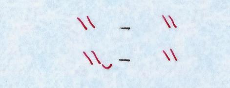
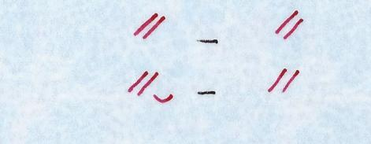
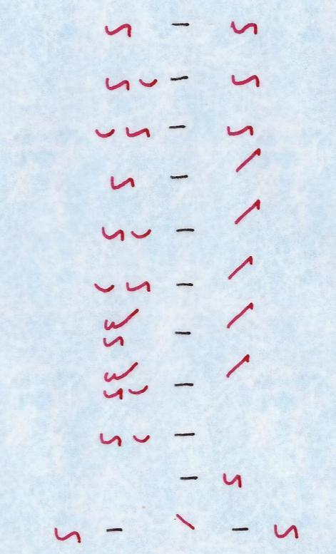

197

Pairs with kremastai

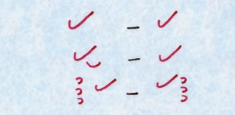

|κρ - κρ|8|193|
|---|---|---|
|κρς - κρ|8b|6|
|υ3κρ - κρυ3|8b|1|
|Pairs with kentemata|||
|κ - κ|9|203|
|κς - κ|9a|1|
|Pairs with the apostrophos|||
|α - α|10|798|
|ας - α|10a|4|
|πα - α|10b (14)|92|
|π - α|10c (13)|1|
|α -|10d (20)|1|
|- α|10e|2|
|Pairs with hypokrisis of two|||
|- -||does not occur|
|||in the ms.|
|υ2π - υ2|12a|1|

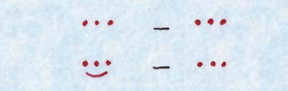
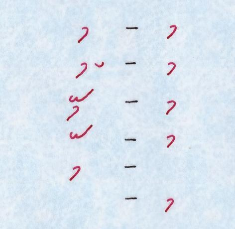

Table 4.8. A case study by S. Martani on ekphonetic notation: the Gospel Vindobonense
Suppl. gr. 128 of the early twelfth century.liii

As we see in the table above, apart from the known classical pairs (against a beige background) and
some of those of the Prophetologion, another 35 cases of pairs or isolated neumes appear in the Vienna Gospel no. 128.
Together with S. Martani we may ask whether
this is a local tradition, or an isolated case of recording, or even
an intermediate evolutionary stage of this notation. Future research on Byzantine lectionaries
may perhaps be able to answer these questions.liv
What has, however, primarily occupied scholars of ekphonetic notation from the first
half of the twentieth century to the present is:

 The preparation of critical editions of texts with ekphonetic neumes (see section 3) and

198

- the decipherment of the actual music that is “hidden” behind this stenographic system (see section 4).

## 3. Critical editions of liturgical texts with ekphonetic notation

In contrast to the printed book, which is produced in a series of identical copies, the various manuscript
copies of a text always present certain—smaller or larger—differences among themselves.
Comparisons among various manuscripts of the Holy Scriptures began in the early Christian
period and continued during the Byzantine centuries. Later, in the age of Humanism, classical
philologists and theologians began wide-ranging comparative studies of manuscripts, with the aim of
creating critical editions of Greek and Latin texts. From the nineteenth century onward, similar studies began to
be undertaken for Gregorian chant (the school of the monks of Solesmes), and from the twentieth century
also for Byzantine music.lv
In general, the undertaking of a critical edition of a text rests on the collection of the relevant
manuscripts, the determination of their mutual relationships, and their selection and grouping through the
creation of a special diagram, the so-called stemma codicum. The editor’s basic tool
is the collation of sources (comparative study of the manuscripts), and the selection of the best codex

(the oldest/the most complete/by a reliable copyist) as the guide (Lat. dux) for the reconstruction of the

original form of the particular text. This procedure (known as emendatio in Latin, from the
verb emendo = I remove errors, I perfect), requires deep study and complex processes of judgment
on the part of the editor (corrections, supplements, etc.).lvi The collation of sources also permits the
preparation of the critical apparatus, in which the various variants are condensed (all of them or a selection,
at the editor’s discretion) from the manuscript tradition of the text, and possibly also various other
proposals for correction on the part of other editors. The language used in compiling
critical apparatuses is, in the overwhelming majority of cases, Latin, thus continuing the tradition of the
Humanists.lvii
A special case, however, is presented by the undertaking of critical editions of Byzantine liturgical
musico-poetic texts, which proves particularly multifaceted, not only because it involves a double
text (words + music), but also because the texts usually have both a very rich and
long-lasting written tradition and a dynamic oral presence within the worship life of the
Church. Thus many and multi-layered variants arise in the texts and especially in the musical
notation. Consequently, the creation of a stemma codicum is often impossible (because of the
large number of sources and the volume and variety of the variants). Earlier musical editions
attempted to present a critical text consisting of elements taken from various
manuscripts, which would in each case reflect the majority of the sources. During the twentieth
century it became clear, however, that the principal aim of the editor of a Byzantine musico-poetic text could
not be the reconstruction of its archetypal form, since this is usually lost in the depths of
time, and the assembly of heterogeneous elements from later manuscripts with various differences
among them leads only to a text without historical substance. By contrast, a critical edition
of a Byzantine musico-poetic text today aims at bringing out its basic forms/versions,
in each case relying on a dux, as well as at the concise presentation of the various variants from
the remaining manuscripts, in one or more critical apparatuses. lviii
Figure 4.12 shows the way in which critical editions of biblical texts
with ekphonetic notation began at the renowned publishing organization Μonumenta Musicae Byzantinae in
Copenhagen during the 1930s. Carsten Høeg prepared a critical edition of the pericope from the
Gospel according to John (1:18–28), which is chanted on the Monday after Easter. It is based on the
collation of eighteen Gospel Books and one Tetraevangelion, dated between the tenth and fourteenth centuries,
that is, from all the evolutionary stages of ekphonetic notation. The manuscripts in question are listed
below, first with the numerical code used in the critical apparatuses, and beside it
in parentheses with other details of the manuscript:

150 (London, Br. M. Harl. 5598, Gospel Book in majuscule script, year 995),
159 (Jerusalem, Meg. Pan. 1, Gospel Book, year 1061),
402 (Gospel Book of the year 1089),

199

408 (Gospel Book, 12th c.),lix
409 (Athens, EBE 187, Gospel Book, 11th c., with neumes difficult to read),
434 (Athens, EBE 68, Gospel Book, 12th c.),
675 (Gospel Book, 12th c.; from the particular pericope only cola 1–13 survive),
805 (Patmos, Monastery of St John the Evangelist 68, Gospel Book in majuscule script, 10th c.),
806 (Patmos, St John Ev. 69, Gospel Book in majuscule script, 10th c., only cola 45–57 survive),
807 (Patmos, St John Ev. 70, Gospel Book in majuscule script, 10th c.),
812 (Patmos St John Ev. 75, Gospel Book, 11th c.),
813 (Patmos, St John Ev. 77, Gospel Book, year 1069),
822 (Patmos, St John Ev. 93, Gospel Book, year 1205),
996 (Jerusalem, Patriarchal Library, Sabas 23, Gospel Book, 11th c.),
1086 (Mount Athos, Monastery of the Great Lavra 86, Gospel Book in majuscule script, 10th c.),
1091 (Mount Athos, Lavra 92, Gospel Book in majuscule script, 10th c.),
1101 (Gospel Book, 14th c.),lx
1371 (Patmos, St John Ev. 98, Gospel Book, 14th c.),
e 2297 (Patmos, St John Ev. 72, Tetraevangelion, 10th–11th c.).lxi

The editor divided the biblical text into musico-rhetorical units (with increasing numbers in
parentheses), on the basis of the pairs of ekphonetic notation. Below is given the reconstructed
musico-poetic text as prepared by C. Høeg, together with its two critical apparatuses: first for the
variants in the biblical text, and then for the variants in the ekphonetic notation. The edition does not
include prosodic signs or punctuation marks, in order to avoid confusion with the ekphonetic neumes. The
critical apparatuses, which always have as their point of reference for the respective variants the critical
text that stands above them, are very concise. For this reason, it was considered advisable to
add a few clarifications in blue.

200

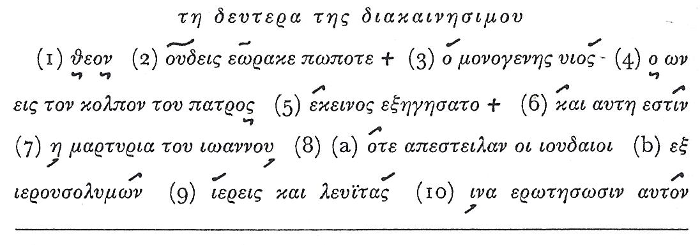
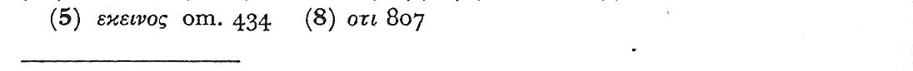
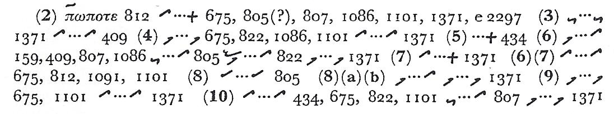

Clarifications:

A. For the first critical apparatus, which concerns the text: in colon 5, the ms. with code 434 (i.e. EBE 68),

omitted the word ἐκεῖνος (om.: abbreviation for omisit, in Latin). In col. 8, the ms. with code 807 (Patmos 70)
has the word ὅτι, instead of ὅτε, which is attested in the remaining manuscripts.lxii

B. For the second critical apparatus, which concerns the notation:

in col. 2 we see that ms. 812 (Patmos 75) places the middle syrmatike on the first syllable of the word πώποτε, while
all the other mss. have it at the beginning of the word ἑώρακε. In the same colon, οὐδεὶς ἑώρακε πώποτε, the mss. with the
codes 675, 805 (the ekphonetic signs are not clearly visible), 807, 1086, 1371 and e 2297 do not have the neumes
syrmatike - middle syrmatike and teleia, but write the pair oxeia and teleia. With the three small dots between
the first and the last sign of the pair, the editor each time represents the biblical text that constitutes
the particular colon.
In col. 3, ms. 1371 (Patmos 98) has the pair kathistai, while in ms. 409 (EBE 187) we read oxeia to oxeia.
Similarly, we see various variants in the following cola.
In colon 6, four mss. of the tenth and eleventh centuries (specifically the mss. with the codes 159, 409, 807, 1086) have the
apesō exō. In the same colon, ms. 805 (Patmos 68 of the tenth century) has the archaic pair kathiste and oxeia (see in
Table 4.8 the pair with symbol 7c), 822 (Patmos 93 of the thirteenth century) likewise the pre-classical/rare conjunction
parakletike with apostrophos and oxeia (see in Table 4.8 the pair with symbol 2b), while ms. 1371 (Patmos 98 of the
fourteenth century) has the well-known classical pair apostrophos.
In col. 7 the aforementioned ms. has oxeia and teleia.

Cols. 6–7: There are, however, four other manuscripts (with codes 675, 812, 1091 and 1101), which do not
present two separate musico-rhetorical units, but unite the words “and this is the testimony of John” into a single phrase, with the oxeia pros oxeian (οξεία προς οξείαν).
In colon 8, ms. 805 (Patmos 68) has the kremastai (κρεμαστές), while ms. 1371 (Patmos 98) divides the text into two
musico-rhetorical units: (colon 8a) when the Jews sent, with apeso exo (απέσω έξω), and (colon 8b) from Jerusalem, with the
apostrophos (απόστροφος) pair.

 You may also read the rest of the pericope, trying to understand in detail the two

critical apparatuses.

201

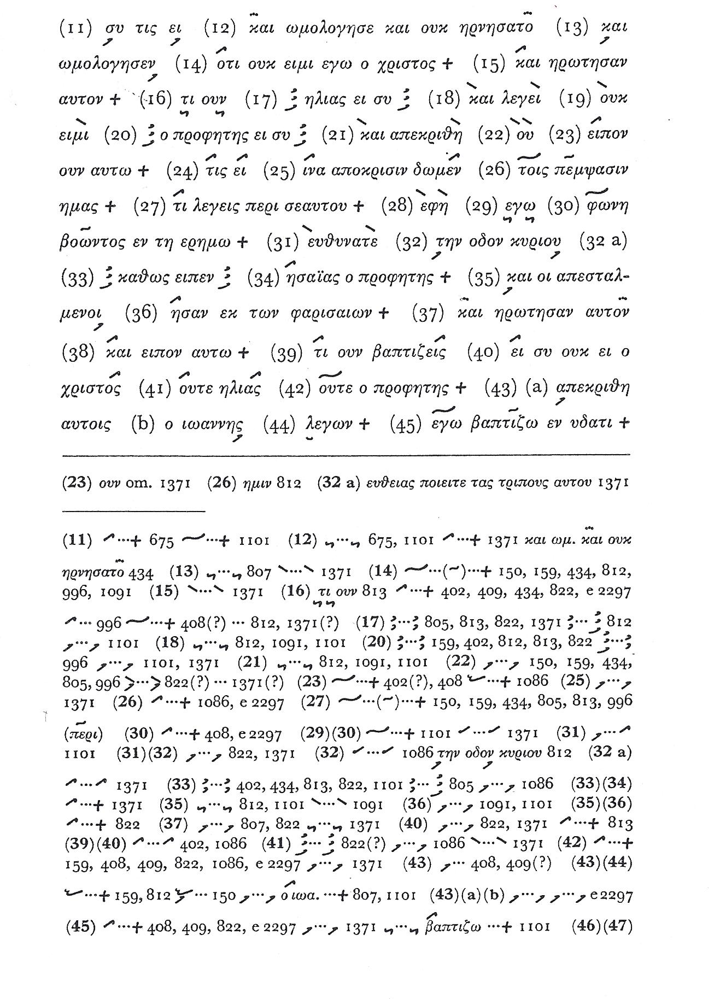

202

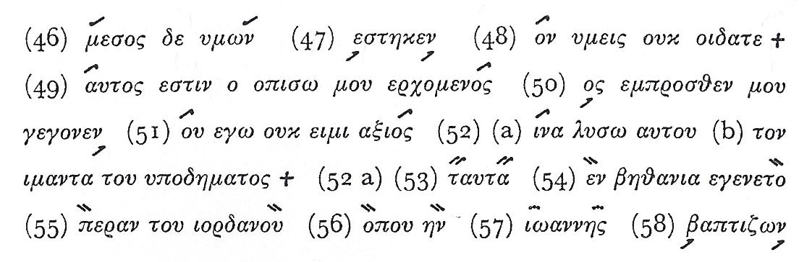
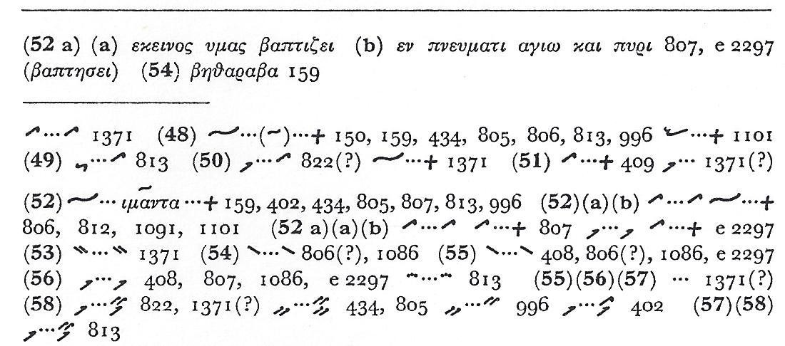

Figure 4.12. Critical edition of the pericope for Monday of Renewal Week (Monday after Easter, from the
Gospel according to John, chapter 1, verses 18-28), in a critical edition by Carsten Høeg.
Source: Carsten Høeg. (1935). La notation ekphonétique. MMB, Subsidia I, fasc. 2. Copenhague: Levin & Munksgaard, pp.

94-96. © Monumenta Musicae Byzantinae, Copenhagen.

Critical editions of biblical texts with ekphonetic notation continued in Copenhagen
in a special series of the Monumenta Musicae Byzantinae, called Lectionaria. Between the years
1939-1981 the Prophetologium was published, in two parts (with individual fascicles): A. The readings of the
movable cycle of feasts (Synaxarion), edited by Carsten Høeg and Günther Zuntz, and B. The
readings of the fixed cycle of feasts (Menologion), edited by Gudrun Engberg.lxiii As dux for
the ekphonetic notation in the critical editions of the Prophetologium, the manuscript
Oxford Bodl. Laud. gr. 36 of the 11th century was usually selected.lxiv In recent decades preparation has continued for
the critical edition of pericopes from the Apostolos and the Gospel, by G. Engberg and S. Martani,
respectively. As one can see, this is highly specialized work, requiring dedication,
patience, and perseverance.
The apparatuses of the critical editions of the Prophetologium and other related comparative studies of
sources with ekphonetic notation that have been carried out to date document the fact that the
division of the biblical text into musico-rhetorical units (cola) and into periods constitutes a
stable element of the written tradition. With regard, however, to the notation itself, it is observed
that, despite the many points of convergence among the manuscripts, there are nevertheless no two sources that
agree in all notational details within a pericope.lxv It is obvious that
such variety at the written level presupposes a very rich oral tradition.
The crucial question, however, is: how are these pairs of ekphonetic signs, which
are found in Byzantine Lectionaries, to be interpreted? The next section deals with various attempts to decipher
ekphonetic notation.

203

## 4. Attempts to Decipher Ekphonetic Notation

## 4.1. The General Framework

We saw in the preceding sections that, with the help of the Byzantine catalogues–didactic poems on ekphonetic notation, we can identify by name the various pairs of signs that occur in the Gospels, the Apostolos, and the Prophetologia, and observe the frequency of their occurrence, as well as their relationship to the biblical text.
Long engagement with ekphonetic notation led S. Martani to propose a revision of the way in which palaeographers analyse ekphonetic notation. More specifically, she proposes distinguishing between structural and ornamental neumes ('structural' and 'ornamental' neumes). The first category includes signs that display a high degree of stability in the way they are used and provide the framework of the recitation, while the second category includes signs that alternate more frequently, perhaps depending on local traditions or on the level of festivity

(e.g. the parakletike [παρακλητική]).lxvi
Constantine Psachoslxvii relates Byzantine emmelic recitation (εμμελής απαγγελία) to the manner of movement of the

so-called middle voice, of which Aristides Quintilianus (probably late 3rd–early 4th c.

AD) speaks, noting that it was in use for the recitation of poems and combined elements from the manner of

movement both of the spoken voice and of the melodic voice:
«As for voice (movement: Winnington-Ingram), one kind is by nature simple, and another not simple;
and of the latter one is continuous, another intervallic, and another middle.
Continuous voice, then, is that which produces relaxations and tensions imperceptibly because of a certain speed,
while intervallic voice is that which has its pitches manifest, but the intervening elements (instead of μεταξύ, the manuscripts have: μέτρα)
imperceptible; and middle voice is that composed of both.
The continuous, then, is that in which we converse,
the middle that in which we perform the readings of poems,
and the intervallic is that which, between the simple voices, produces definite intervals and single notes, and is also called melodic.»lxviii
On the modes, styles, and ethos of reading during the late Byzantine period, we can gather some information from Saint Gregory of Sinai (ca. 1255/1265?–after 1337). This leading representative of Hesychasm, first referring to cases/excesses that probably occurred at that time in various ecclesiastical settings, then sketches the ideal manner of reading for hesychast monks, which leads to the strengthening of the mind and of prayer:
«Let your reading be in solitude,
not with a voice of boastful pomp,
not in a rush of elaborately wrought eloquence
or with elegance of speech
or with the pleasure of melody,
or, though absent as if present, being insensibly despoiled by passion for the pleasing of certain people,
nor again insatiably, because “measure in all things is best”;
nor harshly,
nor sluggishly and carelessly,
but solemnly,
moderately,
steadily,
prudently,
rhythmically,
and noetically and psychically, or also rationally.»lxix

204

## 4.2. Investigations

During the twentieth century, various attempts were made to transcribe or describe the meaning of the ekphonetic signs by scholars such as, for example, C. Høeg, E. Wellesz, Fr. Grigore Panțiru, Kostas Ioannidis, and Reinhard Flender.lxx
Figures 4.13–14 show examples from the transcription proposals of the first two scholars mentioned.

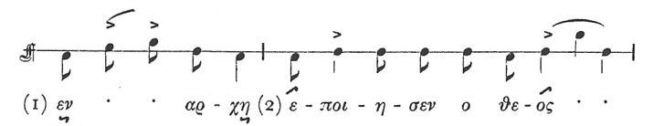
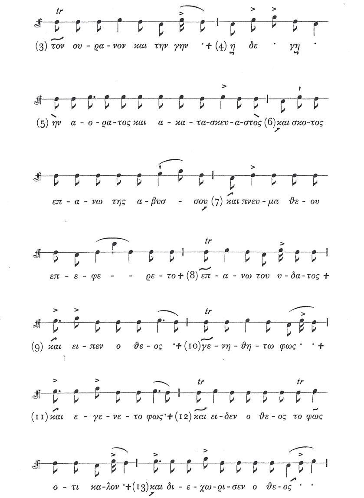
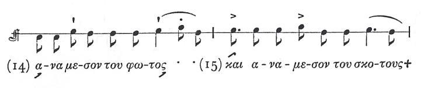

Figure 4.13. A transcription by C. Høeg for the first verses of Genesis (1:1–4).
Source: Carsten Høeg. (1935). La notation ekphonétique. MMB, Subsidia I, fasc. 2. Copenhague: Levin & Munksgaard, pp. 1–34. © Monumenta Musicae Byzantinae, Copenhagen.

According to C. Høeg, the above, “approximate” and “experimental transcription” offers “one, and not the only, possibility of adapting” the formulas of the didactic ekphonetic pericope of MS Sinai 8 (see Figure 4.11) to this particular text of Genesis.lxxi Today this transcription has chiefly historical value, since it reveals the initial steps in the effort to transcribe ekphonetic

205

notation on the part of Western researchers.lxxii In addition, Høeg was also interested in the living practice of recitation in Greece. He published two transcriptions into staff notation of emmelic recitations by Metropolitan Irenaios of Samos and expressed the wish that “one day, a Greek priest will reveal to us the secrets of this tradition.”lxxiii
Another approach is evident in E. Wellesz’s descriptions of the ekphonetic signs, which focus more on the probable effect of the individual signs and less on the formulas that would correspond to the pairs of ekphonetic signs (e.g. kremaste [κρεμαστή] = “rise of the voice with slight emphasis,” kathiste [καθιστή] = “narrative style,” synemba [συνέμβα] = “a kind of legato, which joins two words in a single breath”).lxxiv
Continuing the effort to investigate ekphonetic notation, Fr. Grigore Panțiru proposed a different transcription of it, based on the view that the signs indicate definite intervals, always in relation to the base of the recitation, symbolized by the kathiste and the teleia (τελεία), which he equates with the pitch Ni (C′), in a modal environment similar to today’s plagal fourth mode. In other words, he considers that each pair of ekphonetic signs must begin on a specific pitch, which is determined in relation to the base of the recitation. More specifically:
the signs oxeia (οξεία) and kremaste are interpreted as an ascending voice (Pa, the latter with dynamic emphasis),
the syrmantike (συρμαντική), the parakletike, and the kentemata (κεντήματα) as ornamental movements (the first: Zo–Ni–Zo–Ni–Pa; the other two signs: Pa–Vou–Pa),
the synemba as the joining of two words,
the apostrophos (απόστροφος) and the bareia (βαρεία) as signs that descend by one step, depending on the preceding note (the first: Ni, Zo, Ke, or Di; the second: Zo, Ke, Di),
the apeso exo (απέσω έξω) as an ascent from the pitch below the base to the pitch above it (Zo–Ni–Pa),
the hypokrisis ek trion (υπόκρισις εκ τριών) as a descending triphonia (Di),
the double oxeia (διπλή οξεία) as an ascent by one step with emphasis or more slowly (Pa), and, correspondingly, the double bareia (διπλή βαρεία) as a descent by one step with emphasis and lengthening (on the notes Zo, Ke, or Di, depending on what precedes).lxxv
In his transcription effort, Fr. Panțiru made use of the experience of the oral tradition of emmelic recitation as it was known to him in Romania during the last century. He stressed that “without the contribution of tradition, the signs remain enigmatic. The essential identity between emmelic recitation (he means that of the Byzantine period) and the traditional one reveals to us the mystery of the meaning of these enigmatic signs.”lxxvi An example of his transcription appears in Figure

4.14.

206

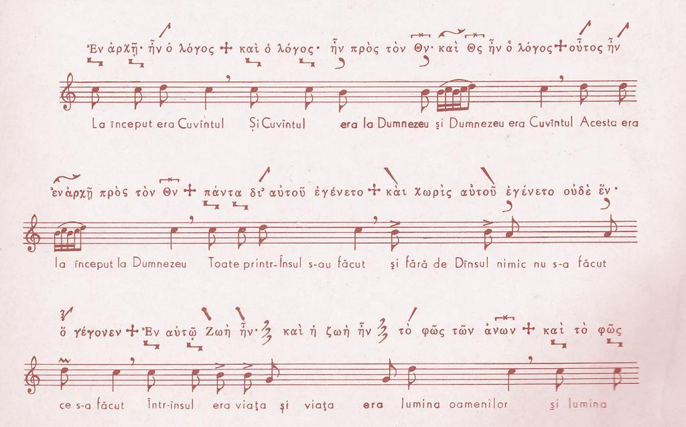
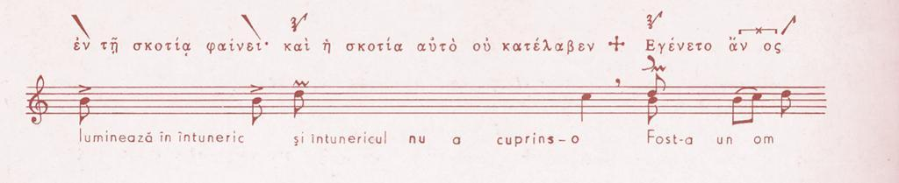

Figure 4.14. The beginning of the pericope for Easter Sunday (from the Gospel according to John, 1:1–5), with ekphonetic notation from the Evangeliary of Iași, 160/IV-34, 10th c., fols. 4v–5v, and with staff transcription by Fr. Grigore Panțiru. Beneath the staff there is a Romanian translation of the text.
Image source: Panțiru, Grigore. (1971). Notația și ehurile muzicii bizantine. București: Editura Muzicală a Uniunii
Compozitorilor, pp. 13–14. By kind permission of the aforementioned publishing house.

As can be seen in Figure 4.14, what is transferred to the staff is not standardized formulas for each pair of signs, but a kind of intervallic framework-skeleton of the recitation, while the intermediate notes in each kolon must be supplied by the reader on the basis of oral tradition.
The transcriptions of Fr. Panțiru, which achieved limited circulation mainly in Romanian higher education, in the course on the Palaeography of Byzantine Music, nevertheless constitute a very important stage in the study of ekphonetic notation, since they mark the beginning of a larger-scale and substantive effort to combine data from Byzantine manuscripts with the present-day tradition of emmelic recitation.
New research questions are also opened up by the expanded study of reading traditions in Byzantium (see Zographou, 2010). On the basis of its findings, the various pairs of ekphonetic signs could be regarded not only as mnemonic indications for standardized formulas, but perhaps also as indications for different ways of shading the voice, phrasing, and conveying ethos, with a view to interpreting the meanings of the scriptural text.lxxvii

207

## 5. The Present-Day Practice of Recitation

From the preceding sections it becomes apparent that thorough knowledge of the transmitted manner of emmelic recitation now constitutes a basic prerequisite, an indispensable “aural compass” for the in-depth study of ekphonetic notation.
Nevertheless, in recent decades a decline has been observed in the practice of emmelic recitation, since, on the one hand, the number of churches in which the Gospel pericope in the Divine Liturgy is no longer recited emmelically but simply read is increasing, and, on the other, there are more and more cases of improvisatory recitative in scales not customary in Greek ecclesiastical music (Western influences, such as the “minor,” or eastern influences, e.g. recitation in various maqams).lxxviii
In an effort to address this situation, Greek scholars and cantors devoted a range of papers in 2001 to “ekphonetic notation and practice,” with reference to the Prophetologion, the Apostolos, the Gospel, as well as to other texts recited in the services of the Orthodox Church, such as the kontakion, various prayers, and litanies.lxxix In the same year (2001), Antonios Alygizakis’s paper entitled “The Ekphonetic Psaltic Practice: the ‘Plain’ and the ‘Ekphōnōs’ Readings” was also published; it offers a “map” of the status quo of present-day ekphonetic practice and a new proposal for its notation. Some central points of the aforementioned paper are presented briefly below:

1. An important desideratum in the study of ekphonetic notation is the clarification of its relationship to more recent ekphonetic practice.lxxx

2. The “ekphonetic melos” constitutes an integral element of the Divine Liturgy (readings, exclamations, the old Leitourgika, the In Thee Rejoiceth of the Divine Liturgy of Basil the Great, etc.), of the Akathist Hymn (the oikoi of the Akathist, the prayers Spotless, Undefiled – And Grant Us), of the services of the daily cycle (Vespers, Orthros: exclamations, litanies, the Eothinon Gospel, etc.), of occasional services (Blessing of Waters, Mysteries, Funeral Service), of the services of Holy Week (e.g. the twelve Gospels of the Service of the Passion, Today He Is Suspended, the Hymn of the Three Children), of the Great Hours, of the Parakleses (e.g. during the period around the Fifteenth of August), etc.lxxxi
3. The careful study of phonographically and/or notationally recorded intonations by traditional chanters such as the Protopsaltes of the Great Church of Christ Iakovos Nafpliotes, Konstantinos Psachos, Metropolitan Irenaios of Samos, the Protopsaltes of the Metropolis of Athens Spyridon Peristeris, Simon Karas, Fr. G. Vallindras, and many others, enabled A. Alygizakis to establish the existence of the following basic types of intonation and to analyse their characteristics: α. Emmelic recitation in the chroa of the kliton (χρόα του κλιτού) (see Figures 4.15–16), with enharmonic intervals: this constitutes the oldest and most widespread form of emmelic recitation. It presents imperfect cadences on the pitch Zo΄ and especially on Ke, while the perfect cadences and the final cadence occur on Ni΄. Readings of Gospel pericopes are more ornamented in comparison with the Apostolos pericopes. The ethos of the emmelic recitation is supplicatory and entreating. β. Emmelic recitation in the plagal fourth mode (see Figure 4.15, first kanonion), with soft diatonic intervals. The intonation moves chiefly around the pitch Ni΄ and its character is more emphatic. γ. Emmelic recitation in the second mode, with soft chromatic intervals. The intonation revolves around the pitch Di, one degree below and two above.lxxxii

208

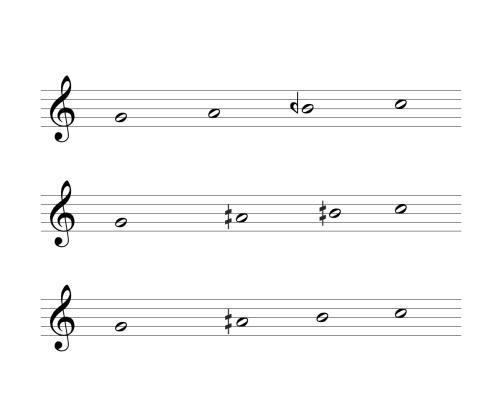
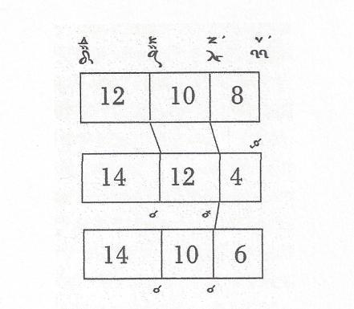

## Figure 4.15. The basic tetrachord of emmelic recitation in soft diatonic form (first kanonion (κανόνιο)

corresponding to the plagal fourth mode) and in the chroa of the kliton (see the corresponding phthora at the upper right in the second
kanonion), in two versions: hard (second kanonion) and soft (third kanonion), according to A.
Alygizakis.lxxxiii

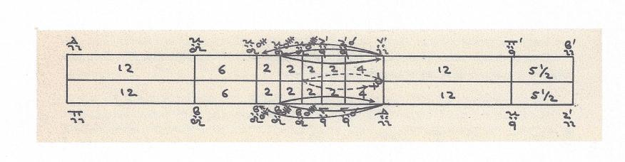

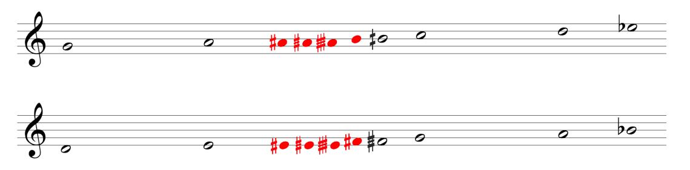

## Figure 4.16. Simon Karas identifies the mode in which traditional emmelic recitation (εμμελής απαγγελία) is performed as

a third tetraphonic enharmonic mode. He considers that the chroa (χρόα) of the enharmonic genus is of a single form and that the various other
instantiations of the pitches Ke-Zo' which appear in ekphonetic practice (ἐκφωνητική πράξη) in the various rotational
movements (see the notes in red in the staff transcription), constitute attractions (ἔλξεις) of the two
aforementioned pitches.lxxxiv It should be emphasized that the various attempts at theorization in the form
of rules are later than ekphonetic practice and may differ from one another.
Practice, therefore, comes first; it is extremely refined and multifaceted. The attractions, which above
are rendered with two moria (ηχομόρια), are in essence subtle slides, dynamic pitches in motion, “a wave, not
an interval” (Ioannis Chasanidis).lxxxv

1. The so-called “chyma” (χῦμα) readings are simple readings, which for the most part move within a very limited ambitus (about three semitones) and concern chiefly the Psalms (e.g. the Prooimiakos at Vespers, the Hexapsalmos at Orthros), but also various prayers (e.g. the Our Father), the Symbol of Faith, and others.lxxxvi

2. In order to ensure a “dignified liturgical ekphonetic melody,” A. Alygizakis proposes a new way of notating it, using the signs of the New Method, in red. The signs are added above the text of the pericopes, which retains its prosodic signs and punctuation marks. In melismas, the initial pitch of the melisma is written first in normal size, while the remaining pitches follow in smaller characters, slanting upwards.

3. The notations of emmelic recitation can also be combined with their formal analysis, which examines elements relating to the structure of the pericope (division into musico-rhetorical phrases), the types of cadences, and the number of syllables per phraselxxxvii (see Figure 4.17).

209

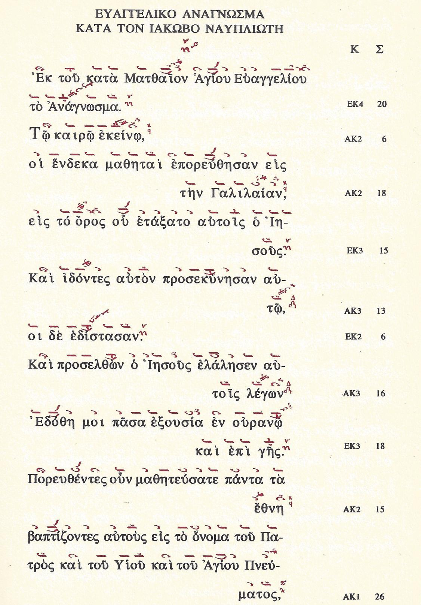

210

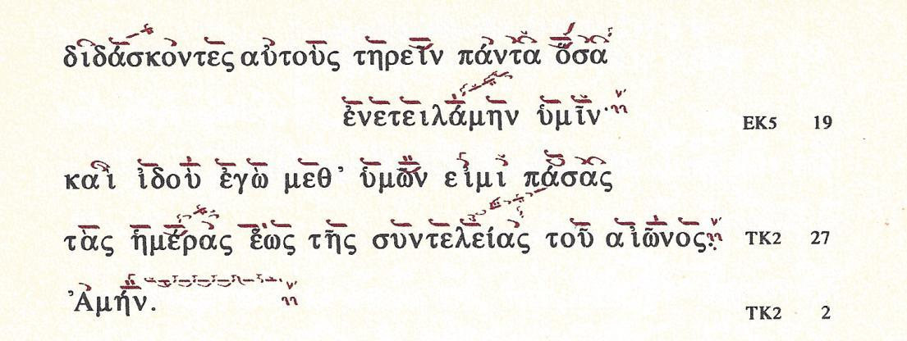

Figure 4.17. The pericope containing the end of the Gospel according to Matthew (chap. 28, 16-20), in a notation by A. Alygizakis,
according to the emmelic recitation of the Protopsaltes of the Great Church of Christ, Iakovos Nafpliotis. The
text is divided into musico-rhetorical units. On the right are indicated the types of cadences, according to the
typology proposed by the same Byzantine musicologist (AK = imperfect cadence, EK = perfect cadence, TK = final
cadence), as well as the number of syllables per phrase.lxxxviii
Source: Alygizakis, Antonios. (2001). Ekphonetic practice; the “chyma” and the “ekphonos” readings. In
Achilleas Chaldaiakis (ed.), Holy Synod of the Church of Greece - Institute of Byzantine Musicology, Theory
and Practice of the Psaltic Art, Proceedings of the First Panhellenic Conference on the Psaltic Art, Athens, 3-5
November 2000. Athens, plates 14-15. By kind permission of the Institute of Byzantine Musicology.

 You can attempt to recite the above pericope by following the signs

of the New Method. Afterwards you can make a transcription onto the staff by printing the template
that is available beside it  . When your transcription is ready, compare it with the one found here .
By listening to the corresponding recording  you can observe the close relationship between speech and
emmelic recitation and try to summarize the principal elements of the musicological
analysis of this pericope. Afterwards, you can compare your own comments with the following
observations:

The aforementioned recitation by Iakovos Nafpliotis is in the chroa of the kliton (κλιτόν) and follows the
tradition of the Patriarchal Church of Constantinople. It brings out the indissoluble relationship between speech and emmelic
recitation, which is realized on several levels:

- First, on the microsyntactic level, since the contour of each phrase is shaped according to the sequence of stressed and unstressed syllables, the former usually being brought out through small melismas and the latter flowing in syllabic recitation,

- then on the mesosyntactic and macrosyntactic levels, since the division of the text into 14 cola and 6 periods faithfully follows the meaning of the text. Each period concludes with a perfect cadence on the base of the mode (Ni'), while within the periods the cola end in imperfect cadences (on the pitches Ke, Di, Zo').

- Finally, the climax of the pericope is observed at colon 14, lending the text a graduated progression toward the confirmatory “amen” (= so be it), the last syllable of which is adorned with the largest melisma of this entire emmelic recitation.

The number of syllables per colon ranges between 6 and 26 syllables, while in the zone of
the final cadence it ranges between 27 and 2.

211

The limited range (Di-Pa', with an opening to the upper Ga' at the final cadence), the ascending
and descending leaps Di-Ni'-Di and the ascending leaps Di-Pa, the many repetitions of the pitches Zo'
and Ni' as recitation tones, as well as the almost standardized cadences, which—as in
rhetorical texts—remain emphatically in the listener’s ear, create the framework for “clearly
stable, simple, and alternating melodic patterns.”lxxxix
All the above elements give this manner of emmelic recitation an exemplary
character.
In conclusion, we see that ekphonetic notation and the practice of emmelic recitation
present exceptional musicological and artistic interest. With roots in the musicality of the
ancient Greek language, in the ancient Greek prosodic signs and in the punctuation systems of the
Alexandrian grammarians, in the readings of the Old Testament in the synagogues during the Hellenistic
period, as well as in the rhetorical, epic, and theatrical art of Late Antiquity, a
compact graphic system was created in Byzantium, documented in MSS chiefly of the ninth to fourteenth centuries and
reaching the height of its development during the eleventh to twelfth centuries. While this graphic system declines
during the late Byzantine period and disappears in the post-Byzantine years, ekphonetic practice
is transmitted uninterruptedly on the oral level down to our own day, where a new
way of notating present-day ekphonetic practice with the signs of the New Method is also proposed, for teaching
purposes.
Byzantine lists—didactic ekphonetic pericopes—allow us to identify the old
signs and to trace the way they functioned. Taking these lists as a point of departure, during the first
half of the twentieth century the systematic rediscovery of ekphonetic notation began, along with persistent work on
the manuscripts and the preparation of critical editions (Copenhagen School). The systematic correlation of
palaeographical research with the study of transmitted ekphonetic practice in all its manifestations,
as well as with the tracing of modes of reading in Byzantium, promises much, both for a deeper
understanding of Byzantine ekphonetic notation and for the support and safeguarding of
present-day ekphonetic practice.

212

## Assessment criteria for chapter 4

Assessment criterion 1:

Exercise in creating mnemonic cards for chapter 4

Assessment criterion 2:
Transcription exercise of the Gospel pericope “In the beginning was the Word,” from the
Gospel of Iași, in majuscule liturgical script and with ekphonetic
notation: see Figure 4.18.

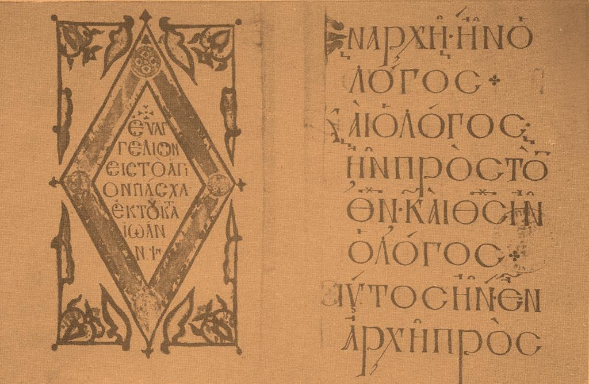

Figure 4.18. The «Gospel from Iași»: ms. 160/IV-34 of the Central University Library "M. Eminescu", Iași, 10th c., fols. 4v-5r, with the beginning of the Gospel reading for Pascha (John 1:1-2), in majuscule liturgical script «of an extremely high level of refinement», and with ekphonetic notation of the classical type (also containing some pairs of signs from the pre-classical period). This luxurious codex probably comes from Constantinople xc
Image source: Panțiru, Grigore. (1971). Notația și ehurile muzicii bizantine. București: Editura Muzicală a Uniunii Compozitorilor, p. 161. The photograph was included with the permission of the aforementioned publishing house.

213

Assessment Criterion 3:
Exercise in transcribing the Gospel pericope When the Sabbath had passed, from
the codex of the Holy Monastery of Dionysiou no. 587, in minuscule liturgical script and with
ekphonetic notation: see Figures 4.19.a-c.

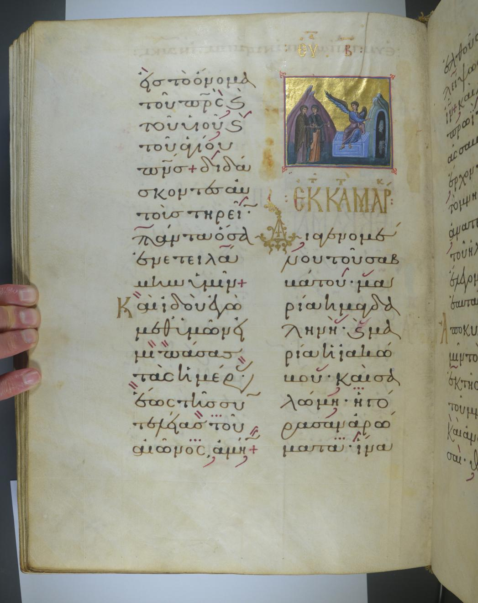

Figure 4.19.a. Beginning of the Second Eothinon Gospel, which is read at the Orthros of the Resurrection, from the codex
of the Holy Monastery of Dionysiou no. 587, fol. 167v, year 1059, in minuscule liturgical script, with ekphonetic notation
of the classical type.xci © Holy Monastery of Dionysiou, Mount Athos.

214

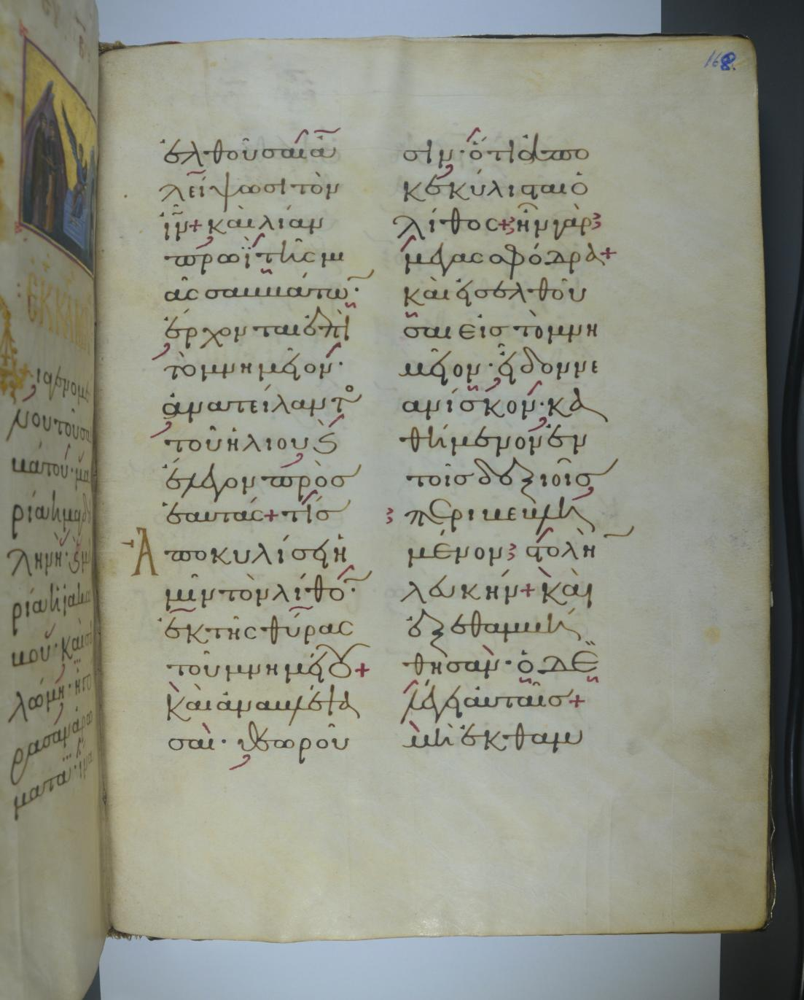

Figure 4.19.b. Continuation of the Second Eothinon Gospel, from the codex of the Holy Monastery of Dionysiou no. 587, fol. 168r. Also noteworthy
is the small double bareia (βαρεία) in dark ink, on the word «de» (third line from the bottom in the second column), which appears
sometimes in the same and/or in a similar position, as an aid to the reading aloud of various ecclesiastical
texts (see Zografou, 2010, p. 224, together with ch. 2, Figure 2.53.b of the present handbook), documenting the
connection between the various modes of reading liturgical texts and between their corresponding graphic
systems. © Holy Monastery of Dionysiou, Mount Athos.

215

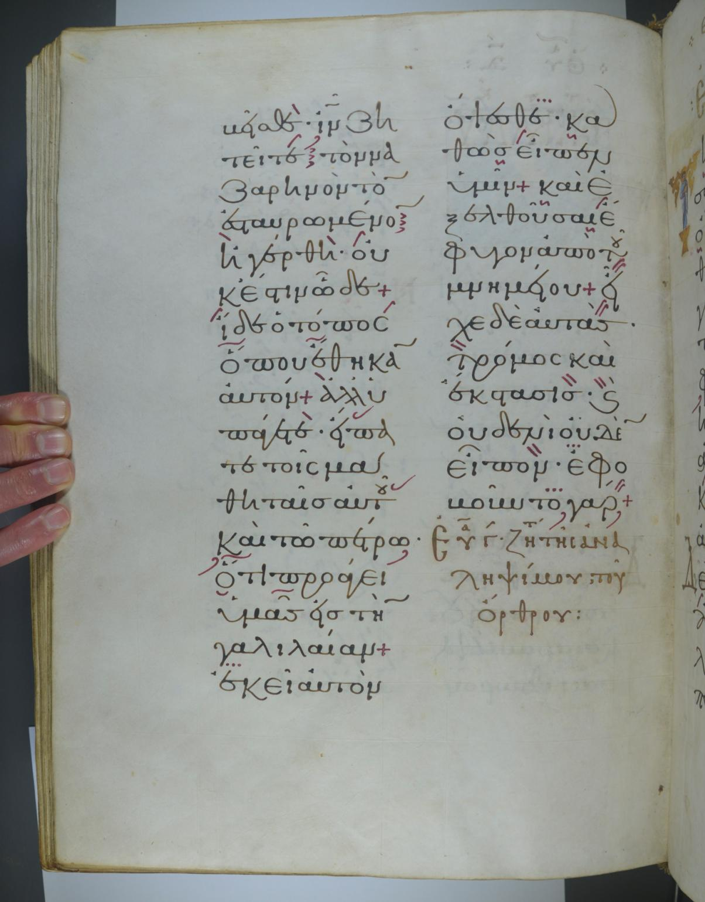

Figure 4.19.c. Continuation and end of the Second Eothinon Gospel, from the codex of the Holy Monastery of Dionysiou 587, fol. 168v.

© Holy Monastery of Dionysiou, Mount Athos.

216

Assessment Criterion 4:

Exercise in identifying material, script, and notation in a manuscript fragment of the
Holy Monastery of Zografou: see Figures 4.20.a-b. 

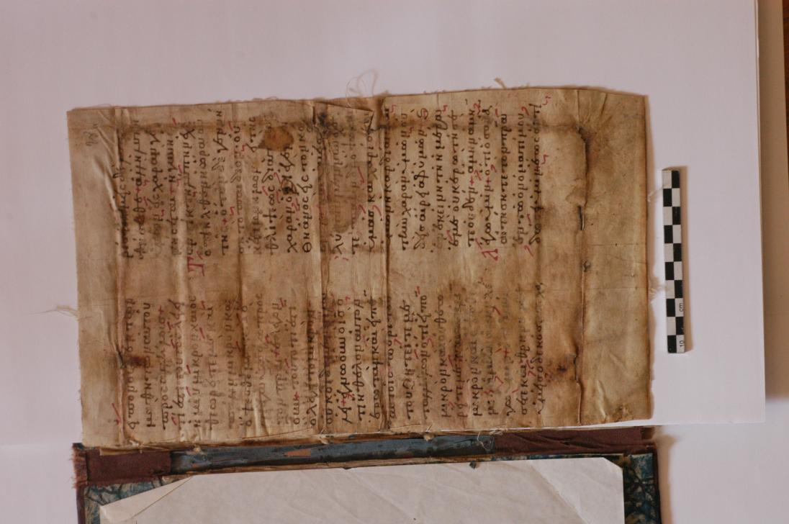
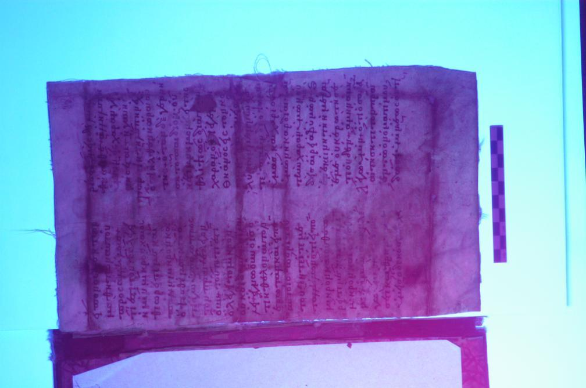

The light

Figures 4.20.a-b. Two photographs of a manuscript fragment of the Library of the Holy Monastery of Zografou. The second was taken under
a lamp with mild ultraviolet light. © Holy Monastery of Zografou, Mount Athos.xcii

217

## Assessment Criterion 5

## Exercise in the transcription and analysis of an ekphonetic reading in the present-day practice of intoned recitation  & 

### Assessment criterion 6

### Visit the website <http://www.csntm.org/Manuscripts.aspx> and make a list of manuscripts with ekphonetic notation that interest you

### Bibliography for Chapter 4

### Holy

Scripture

The New Testament. (2003). The original text and translation in the Modern Greek vernacular. Athens: Hellenic Bible Society.
The Old Testament according to the Seventy (Septuaginta). (1935). Scholarly ed. Alfred Rahlfs, editio minor. Stuttgart:
Deutsche Bibelgesellschaft. Greek ed.: Athens: Bible Society.
Novum Testamentum Graece. (1993). Post Eberhard et Erwin Nestle, editione vicesima septima revisa, communiter
ediderunt Barbara et Kurt Aland, Johannes Karavidopoulos, Carlo M. Martini, Bruce M. Metzger, Apparatum
criticum novis curis elaboraverunt Barbara et Kurt Aland una cum Instituto Studiorum Textus Novi Testamenti
Monasterii Westphaliae. Stuttgart: Deutsche Bibelgesellschaft.

### Liturgical books and

texts of the Holy Fathers

The Sacred Services of Holy and Great Week (3rd ed.). Athens: Brotherhood of Theologians «Zoe».
Saint Gregory of Sinai. (1996). Fifteen chapters on hesychia and on the two modes of prayer. In
Niketas Stethatos, Elias Ekdikos, Theoleptos, Nikephoros, Gregory of Sinai, Complete Works, Text-
translation-commentary by Eleftherios Meretakis, Philokalia of the Neptic and Ascetic Fathers 20, EPE.
Thessaloniki: Publishing House of Eleftherios Meretakis «To Byzantion» and Patristic Publications «Gregory
Palamas».
Hieratikon. (2005, 5th ed.). Athens: Apostoliki Diakonia of the Church of Greece.

Facsimile editions of manuscripts

Harlfinger, Dieter, Reinsch, Diether Roderich, Sonderkamp, Joseph A. M., in Zusammenarbeit mit Prato, Giancarlo.
(1983). Specimina Sinaitica. Die datierten griechischen Handschriften des Katharinen-Klosters auf dem Berge
Sinai, 9. bis 12. Jahrhundert. Berlin: Dietrich Reimer Verlag.
Mocquereau, Dom André et Dom Cabrol. (Eds., 1889). Paléographie musicale, Fac-similés phototypiques des
principaux manuscrits de chant grégorien, ambrosien, mozarabe, gallican. Series I, vol. I. Abbaye Saint-Pierre de
Solesmes. <https://archive.org/details/palographiemus1889gaja> (8.6.2015).

Panțiru, Grigore. (1982). Lecţionarul evanghelic de la Iași (Ms. 160/IV-34: sec. XI). București: Editura Muzicală.

Theoretical writings

Kampanas, Georgios. (1989). Theory of musical notation, vol. I. Athens: Kastaniotis Editions.
Karas, Simon. (1982). Method of Greek Music. Theoretical treatise. 2 vols. Athens: Society for the Dissemination of
National Music.

Alexandrescu, Dragoș. (2004). Teoria muzicii, vol. I. București: Editura Universității Naționale de Muzică.
Aristides Quintilianus. De musica libri tres. (1963). Ed. R.P. Winnington-Ingram. Leipzig: Teubner.
<https://archive.org/details/AristidesQuintilianus> (10.9.2016).

218

Aristides Quintilianus. On Music. In Three Books. (1983). Translation, with Introduction, Commentary, and Annotations
by Thomas J. Mathiesen. New Haven and London: Yale University Press.
Aristide Quintilien. La Musique. (1999). Traduction et commentaire de François Duysinx. Bibliothèque de la Faculté de
Philosophie et Lettres de l'Université de Liège, CCLXXVI. Genève: Diffusion Librairie Droz.

Books and articles

Aligizakis, Antonios. (2001). The ekphonetic practice: the “plain” (chyma) and the “aloud” (ekphōnōs) readings. In
Achilleus Chaldaiakis (ed.), Holy Synod of the Church of Greece - Foundation for Byzantine Musicology,
Theory and Practice of the Art of Chant, Proceedings of the 1st Panhellenic Conference on the Art of Chant,
Athens, 3-5 November 2000 (pp. 89-139). Athens.
Vergotis, Georgios. (1988). Lexicon of liturgical and ceremonial terms. Thessaloniki, 1988.
Galavaris, George. (2002). The Gospel, ms 20 of the Museum of Byzantine Culture, Thessaloniki: a
hidden treasure. Museum of Byzantine Culture, 9, 37-53.
Zographou, Anastasios. (2010). “Successively”, “through the middle”, “by itself”, “by enactment”. The preservation of
ancient prosody in liturgical texts. Ecclesiastical Pharos, 71, 213-230.
Treasures of Mount Athos. Series A. Illustrated manuscripts. Representations - headpieces - initial
letters. (1973, 1975, 1979, 1991). Patriarchal Institute for Patristic Studies. Volumes I-II: Styl.
Pelekanidis, Panag. K. Christou, Chrys. Mavropoulou-Tsioumi, Sot. N. Kadas. Volume III: Styl. Pelekanidis,
Panag. K. Christou, Chrys. Mavropoulou-Tsioumi, Sot. N. Kadas, Aik. Katsarou. Volume IV: Panag. K.
Christou, Chrys. Mavropoulou-Tsioumi, Sot. N. Kadas, Aik. Kalamartzi-Katsarou. Athens: Ekdotiki
Athinon.
Holy Church of the Dormition of the Theotokos. Kalambaka. Series of postcards. Kalambaka: Tsarouchas Editions.
Karavidopoulos, Ioannis. (2001). Introduction to the New Testament (2nd ed.). Thessaloniki: Pournaras.
Litsas, Efthymios. (2001). Brief introduction to Greek palaeography and codicology. Issue 2. Plates with
selected samples of writing and comments. Thessaloniki: University Studio Press.
Michaelides, S. (1999). Encyclopedia of ancient Greek music (3rd ed.). Athens: Cultural Foundation of the
National Bank.
Babiniotis, Georgios. (2002). Dictionary of the modern Greek language (2nd ed.). Athens: Centre for Lexicology.
Pispas, Ioannis S., Protopresbyter. (2012). The Holy Church of the Dormition of the Theotokos in Kalambaka (5th
ed.). Kalambaka.
Spyrakou, Evangelia. (2008). The choirs of chanters according to the Byzantine tradition. Foundation for Byzantine
Musicology. Studies, 14. Published by Gr. Stathis. Athens.
Floros, Constantine. (1998). The Greek tradition in the musical scripts of the Middle Ages. Introduction to Neumatic
Studies. Transl.-ed. Kostas Kakavelakis, philol. ed. N. Avramopoulos. Thessaloniki: Ziti.
Psachos, Konstantinos. (1978). The parasemantic notation of Byzantine music, or historical and technical
survey of the notation of Byzantine music from the first Christian centuries
to our own time (2nd greatly enlarged ed., ed. G. Chatzitheodorou). Athens: Dionysos.

Alexandru, Maria. (2000). Studie über die 'grossen Zeichen' der byzantinischen musikalischen Notation, unter
besonderer Berücksichtigung der Periode vom Ende des 12. bis Anfang des 19. Jahrhunderts. Doctoral
dissertation. 3 vols. Kopenhagen: Universität Kopenhagen, Humanistische Fakultät.
Bidez, J., & Drachmann, A. B. (1938). Emploi des signes critiques, disposition de l' apparat dans des éditions savantes
de textes grecs et latins (edition nouvelle A. Delatte/A. Severyns). Bruxelles - Paris: Union Académique
Internationale.
Borghi, Renato, & Zappalà, Pietro. (Eds., 1995). L'edizione critica tra testo musicale e testo letterario. Università degli
Studi di Pavia, Scuola di Paleografia e Filologia Musicale - Cremona. Atti del Convegno Internazionale (Cremona

4-8 ottobre 1992). Studi e Testi Musicali, Nuova Serie 3. Lucca: Libreria Musicale Italiana.

D' Agostino, Marco e Martani, Sandra. (2005). Iași 160 (IV-34) e Vat. gr. 351: Due lezionari evangelici gemelli in
maiuscola liturgica con notazione musicale. Bollettino della Badia Greca di Grottaferrata, terza serie, 2, 17-42.
D' Agostino, Marco e Martani, Sandra. (2007/2010). Parma, Biblioteca Palatina, cod. Pal. 14 (Lezionario del Nuovo
Testamento). Crisopoli, Bollettino del Museo Bodoniano di Parma, 13 (nuova serie 1), 127-151.
Engberg, Sysse Gudrun. (1995). Greek Ekphonetic Notation. The Classical and Pre-Classical Systems. In Jørgen Raasted
and Christian Troelsgård (eds.), Palaeobyzantine Notations. A Reconsideration of the Source Material (pp. 33-55).
Hernen: A.A. Bredius Foundation.
Engberg, Sysse Gudrun. (2006). The Prophetologion and the triple-lection-theory - the genesis of a liturgical book. In
Monumenta Musicae Byzantinae, 75th Anniversary, The current state of Byzantine Musical Studies after 75 years

219

of Monumenta Musicae Byzantinae, Acts of the International Conference held at Carlsberg Academy,
Copenhagen, 16-17 June, 2006, Bollettino della Badia Greca di Grottaferrata, terza serie, vol. 3, 67-92.
Floros, Constantin. (1970). Universale Neumenkunde. 3 vols. Kassel: Bärenreiter Antiquariat, Kassel-Wilhelmshöhe.
Høeg, Carsten. (1935). La notation ekphonétique. MMB, Subsidia I, fasc. 2. Copenhague: Levin & Munksgaard.
Ionescu, Gheorghe. (1994). Lexicon al celor care, de-a lungul veacurilor, s-au ocupat cu muzica de tradiție bizantină în
România. București: Diogene.
Jäger, Gerhard. (1975). Einführung in die Klassische Philologie. München.
Langenscheidts Großes Schulwörterbuch Lateinisch-Deutsch. (1991). Bearbeitet von Erich Pertsch auf der Grundlage
von Menge-Güthling (erweiterte Neuausgabe, 8th ed.). Berlin, München, Wien, Zürich: Langenscheidt.
Liddell, H. G, Scott, R., Jones, H. St. and McKenzie, R. (1990). A Greek-English Lexicon, With a Supplement 1968 (repr.
of 9th edition). Oxford: Clarendon Press.
Martani, Sandra. (19992). Musica, teologia e liturgia. Sulle tracce di un' interpretazione della notazione ecfonetica
bizantina. Rivista Internazionale di Musica Sacra, Nuova Serie XX. Libreria Musicale Italiana, 9-47.
Martani, Sandra. (2000). Neume Combinations in the Ekphonetic Notation of the Manuscript Vienna Suppl. Gr. 128. In
Pravoslavna Monodija (pp. 178-195). Kyiv: National Ukrainian Music Academy P. Tchaikovsky.
Martani, Sandra. (2003a). The theory and practice of ekphonetic notation: the manuscript Sinait. gr. 213. Trans. Joseph
Dyer. Plainsong and Medieval Music, 12 (1), 15-42.
Martani, Sandra. (2003b). La notazione ecfonetica negli evangeliari greci tra XII e XIII secolo: un sistema notazionale
che inizia a disgregarsi. In Alexander Rausch (ed.), Institutum Musices Feldkirchense, Annales, 3 (pp. 1-9).
Tutzing: verlegt bei Hans Schneider.
Panțiru, Grigore. (1971). Notația și ehurile muzicii bizantine. București: Editura muzicală a Uniunii Compozitorilor.
Raasted, Jørgen. (1995). Koukouzeles' Revision of the Sticherarion and Sinai gr. 1230. In I. Szendrei and D. Hiley,
Laborare fratres in unum. Festschrift László Dobszay zum 60. Geburtstag, Spolia Berolinensia 7 (pp. 261-277).
Hildesheim.
Reynolds, L. D., & Wilson, N. G. (1992). Scribes and Scholars. A Guide to the Transmission of Greek and Latin
Literature (3rd ed.). Oxford: Clarendon Press.
Schlötterer, Reinhold. (1971). Edition byzantinischer Musik. In Thrasybulos Georgiades (ed.), Musikalische Edition im
Wandel des historischen Bewußtseins (pp. 28-49). Kassel: Bärenreiter.
Spronk, Klaas, Rouwhorst, Gerard and Royé, Stefan. (2013). Challenges and Perspectives. Collected Papers, resulting
from the expert meeting of the Catalogue of Byzantine Manuscripts programme held at the PThU in Kampen, the
Netherlands on 6th-7th November 2009, Catalogue of Byzantine Manuscripts in their Liturgical Context, Subsidia

I. Turnhout, Belgium: Brepols Publishers.

Thibaut, Jean-Baptiste. (1912). Monuments de la Notation Ekphonétique et Neumatique de l'Église Latine. St.
Petersburg. Reprint Hildesheim, Zürich, New York: Georg Olms Verlag, 1984.
Thibaut, Jean-Baptiste. (1913). Monuments de la Notation Ekphonétique et Hagiopolite de l'Église Grecque. St.
Petersburg. Reprint with Appendix Introduction by Oliver Strunk. Hildesheim, New York: Georg Olms Verlag,
1976.
Troelsgård, Christian. (2011). Byzantine Neumes. A New Introduction to the Middle Byzantine Musical Notation. MMB,
Subsidia IX. Copenhagen: Museum Tusculanum Press.
Wellesz, Egon. (1962). A History of Byzantine Music and Hymnography (2nd ed. revised and enlarged). Oxford:
Clarendon Press.
West, Martin L. (1973). Textual Criticism and Editorial Technique applicable to Greek and Latin texts. Stuttgart:
Teubner.

Recordings - DVD

Service of the Pannychis (Παννυχίς). Sunday of the Veneration of the Cross 2009. Address by Emeritus Professor of the University of
Athens Mr Gr. Stathis. Performance by the choir of chanters «Trikkis Melodoi», choirmaster Dim.
Balageorgos. DVD production: Grigorios D. Karpouzas. Holy Metropolis of Stagoi and Meteora, Holy
Byzantine Church of the Dormition of the Theotokos, Kalambaka.
Aligizakis, Antonios. (Ed., 2008). Byzantine music by the Protopsaltes of the Great Church of Christ
Iakovos Nafpliotis. Constantinople: Kalan.
And let us sing praises. Ecclesiastical hymns recorded in 1930 by Melpo Merlier. (2000). Sung by
Metropolitan Eirenaios Papamichael of Samos, Simon Karas and the Choir of the Society for the Dissemination of
National Music, Dimitris Papapostolis and Dimitris Karonis. Eds. M. Dragoumis, K. Drygianakis
and Th. Moraitis. Athens: Centre for Asia Minor Studies.

## Online resources and videos

220

<http://gallica.bnf.fr/ark:/12148/btv1b8470433r/f14.image> (17.12.2014).
<http://www.csntm.org/Manuscripts.aspx> (10.9.2016).
<http://www.skypoint.com/members/waltzmn/ManuscriptsUncials.html#uC>
<http://www.solesmes.com/GB/> editions/livres.php?cmY9MjEy (14.11.2014).
<http://www.thetravelbook.gr/article.asp?catid=29841&subid=2&pubid=64179233>
<https://archive.org/details/AristidesQuintilianus> (10.9.2016).
<https://archive.org/details/palographiemus1889gaja> (8.6.2015).
<https://www.youtube.com/watch?v=jbXNlQUjqlk> (11.9.2016).

1.

(10.9.2016)

## Endnotes

## for chapter 4

i See Martani (2003a, p. 17). Floros (1998, p. 117).
ii Galavaris (2002, p. 53). Cf. also Martani (2003a, pp. 15-22), and especially the following passage: "The Fourth Council of
Constantinople (869-870), restating and clarifying decrees of the Second Council of Nicaea (787), saw in the book of the
Gospels a figure (typos) of Christ, and therefore an object worthy of veneration. Symeon of Thessalonica (d. 1429) took
up this theme in his commentary on the Divine Liturgy. The appearance of the book itself skrikingly exemplified its
dignity. Back and front covers reproduced scenes from salvation history, often executed in precious materials (gold,
silver, enamel and semiprecious stones). The care with which the contents of the manuscript were prepared often bore
witness to its symbolic value. Gold and silver letters were used, sometimes for the entire text; decorated initials,
ornamental borders and miniatures are also frequently found." (p. 17).
iii Cf. Martani (2003a, p. 17, n. 8), where the article by Ioannes Tzetzes (1885), The Invention of
Byzantine Notation, Parnassos, 9, p. 441, is mentioned. See also Psachos (1978, p. 27, n. 19).
iv Høeg (1935).
v Cf. the monograph by Grigore Panțiru (1982). See also Ionescu (1994, pp. 273-275).
vi Cf. Alygizakis (2001).
vii Cf. Liddell, Scott, Jones, & McKenzie (1990, p. 526). Babiniotis (2002, p. 581). Vergotis (1988, p. 46).
Text by Gregorios Stathis in the announcement leaflet of the two-day conference “Ekphonetic Notation and
Practice”, Holy Synod of the Church of Greece, Institute of Byzantine Musicology, Athens, 9-11 November 2001.
Martani (19992, p. 24). Høeg (1935, p. 137). Langenscheidts Grosses Schulwörterbuch Lateinisch-Deutsch (1991, p.
1113).
viii Cf. Martani (2003a, p. 23).
ix Cf. Høeg (1935, p. 75). Engberg (1995, pp. 38-39).
x Cf. Høeg (1935). Τhibaut (1912/1984).
xi Cf. Floros (1998, p. 116). Karavidopoulos (2001, p. 39).
xii Cf. Karavidopoulos (2001, pp. 38-39). In his monograph C. Høeg (1935) prefers the term Evangeliary, while
with regard to the term Evangelistarium he stresses that it should be used only for the lists indicating the readings
for each feast, which are also found within the Tetraevangelia (p. 70, n. 1).
xiii For a third reading in the Divine Liturgy until the 7th century (according to others until the 5th or the 8th cent.),
placed before the Apostle and the Gospel, cf. Μartani (2003a, p. 19). Cf., however, also Εngberg (2006).
xiv Cf. Alygizakis (2001).
xv The present table draws its data from the following bibliography: Høeg (1935, pp. 71-74). Martani (2003a, pp. 16,
18-20). Vergotis (1988, pp. 105, 109-110). The Old Testament according to the Seventy (1935). Hieratikon (2005, pp. 114-115).
The New Testament (2003, p. 529). Cf. also Spronk, Rouwhorst, & Royé (2013, pp. 55-182). For a general
overview and samples of manuscripts of the Holy Bible, cf. the website <http://www.csntm.org/Manuscripts.aspx>
(10.9.2016).
xvi Cf. also the photograph of the ambo: <http://www.thetravelbook.gr/article.asp?catid=29841&subid=2&pubid=64179233>
(10.9.2016).
xvii This image became more widely known through its publication in: Treasures of Mount Athos (vol. I, 1973,
p. 179, fig. 220 and description on p. 439). See also a similar image with the Exaltation of the Precious Cross on the ambo (ibid.
p. 193, fig. 239). See also Moran (1986, fig. 1, for the manuscript indication).
xviii See Høeg (1935, pp. 109-127). Engberg (1995).
xix Cf. Høeg (1935, pp. 108 and 137).
xx See also fol. 203v of the same palimpsest, where some ekphonetic signs can be seen squeezed
between the older biblical text—also an indication that they were added later. For clarifications concerning the
Codex Ephraemi cf. Høeg (1935, pp. 107-108, 116-121). Μartani (2003a, p. 23). See also
<http://www.skypoint.com/members/waltzmn/ManuscriptsUncials.html#uC> (17.12.2014). With regard to the types of script,

221

the majuscule could be identified as biblical, the minuscule as liturgical (?). I also thank
Father Filotheu Bălan for pointing out this manuscript, as well as the students nun Timothea Țerea, Fr. Nicolae
Letea and Elena Chirvasă for interesting discussions on the same subject.
xxi Cf. Martani (2003a, pp. 25-30). See also below in the present chapter, section 2.1.
xxii Cf. Høeg (1935, pp. 81-82, 123-127, 137). Martani (2003a, pp. 23-24). The same author (2003b).
xxiii “Ancient Greek differs from most European languages in that it conveys sung
information through the accentuation, pitch, and duration of the syllables of words. One would therefore not be mistaken
in characterising the pronunciation of the Greek language as a kind of speech-chant (speech-song - Sprechgesang);
it was characteristically called prosody. Dionysius of Halicarnassus (1st cent. AD) bears witness that the linguistic
melos in the Greek language moved within the tonal range of a fifth.” (Floros, 1998, pp. 114-115, 117).
xxiv See Zografou, 2010 and chap. 2, Assessment criterion 6, together with endnote xcvi of the aforementioned
chapter.
xxv Cf. Engberg (1995, p. 55). Cf. also the list of ekphonetic signs-formulas from the Tbilisi MS Q
908, fol. 279r, which is discussed below, section 2.1.
xxvi Cf. Martani (2003a, p. 23). Zografou (2010, pp. 213-214 et passim).
xxvii Cf. Høeg (1935, p. 153).
xxviii Martani (2003a, p. 16).
xxix Cf. the paper and the related photocopy (handout) by Ms Sysse Engberg from the Conference Palaeobyzantine
Notations II, Congress Held at Hernen Castle (The Netherlands) in October 1996 (with extensive reference to the
Tbilisi list).
xxx Cf. Harlfinger, Reinsch, Sonderkamp, & Prato (1983, pp. 14-16: 15 and pl. 7). Høeg (1935, pp. 17-31 and pls. I-III).
Floros (1970, vol. II, p. 212). Engberg (1995, p. 35). Martani (2003a, pp. 25-30 and pl. 1 on p. 35 [comparison of the first
five lists]). Engberg, handout from the paper at the Conference Palaeobyzantine Notations II, Congress Held at
Hernen Castle (The Netherlands) in October 1996.
xxxi Photograph from: Harlfinger, Reinsch, Sonderkamp, & Prato (1983, pl. 7).
xxxii The first hand writes in slightly slanting pointed majuscule script ("schwach geneigte
Spitzbogenmajuskel"), of South Italian type, while the second hand writes in Alexandrian display majuscule script ("in
einer Art alexandrinischer Auszeichnungsmajuskel"): Harlfinger, Reinsch, Sonderkamp, & Prato (1983, p. 15). For the
second type of script, cf. also Litsas (2001, pp. 40-41). Cf. also Table 2.4 of the present handbook (chap.

2).

xxxiii Photograph from: Harlfinger, Reinsch, Sonderkamp, & Prato (1983, pl. 9).
xxxiv In the colophon we read the following:
COMPLETED WITH
G(O)D THIS GOS
PEL IN THE MO(NTH) _
OF JANUARY ON THE 30.
I(ND)ICTION 10 YEAR FROM
THE CREATION OF THE WORLD
_ _ _
S Y O Є
The presbyter Eustathios finished copying the Sinai codex 213 in the year ‚στυοε´ = 6475 from the creation of the
world, on the 30th of January, indiction 10 = 10th. The arithmetical calculations we make in order to verify the
date are as follows:
6475 - 5508 (because the month is January) = the year 967 from the Birth of Christ,
6475 : 15 = 431, with a remainder of 10, which corresponds to the indiction.
Thus the year 967 constitutes the terminus post quem, i.e. the point in time after which the list of ekphonetic signs was
written by the second hand. It is possible that the second hand can be dated to the last quarter
of the 10th century, on account of the musical notation, as will also become clear below in the main text of this
chapter.
xxxv Photograph from: Høeg (1935, pl. II, scanned from S. Engberg’s handout at the Conference Palaeobyzantine
Notations II, Congress Held at Hernen Castle [The Netherlands] in October 1996).
xxxvi Photograph from: Høeg (1935, pl. I [excerpt]). The indication of the colours of the inks and of the folio (317v),
according to Ηøeg (1935, p. 18). In pl. I of the same work, however, folio 318r is mentioned.
xxxvii For other transcriptions and comments, cf. Høeg (1935, pp. 18-20). Ηandout by S. Engberg at the Conference
Palaeobyzantine Notations II, Congress Held at Hernen Castle (The Netherlands) in October 1996, p. 7. Martani (2003a,

pp. 25-30, 35).

xxxviii Photograph from: Rev. Konstantinos Terzopoulos, "Byzantine chant: history-forms-function-influence", presentation poster
23.09.2010, Aquinas Institute of Theology, St. Louis, Missouri. We thank Father Konstantinos

222

Terzopoulos. See Høeg (1935, pp. 20-31 and pl. III). Floros (1970, vol. II, p. 212). For an identification of the ekphonetic
signs of this list, see Martani (2003a, pl. 1 on p. 35).
xxxix Høeg (1935, pp. 26-31). Floros (1970, vol. II, pp. 210-213).
xl Høeg (1935, pp. 26-27): transcription approximative (approximate transcription, conventionally in the F clef).
xli Cf. Høeg (1935, pp. 36-42). See also Tables 2.2-3 of the present handbook.
xlii Cf., however, also the view of Høeg (1935, p. 38): absence of the circumflex from the ekphonetic system, since this
took shape at a time when the differentiated accentuation of the circumflex in relation
to the acute had already been lost (by the end of the 3rd cent. AD at the latest).
xliii With regard to the spelling of the name of this sign of ekphonetic notation, opinions diverge:

a. parakletike, from the verb parakalō, or b. paraklitike, from the verb paraklinō. The first version is

documented by almost all the Byzantine lists of ekphonetic signs and is defended by scholars such as I.
Tzetzes, C. Floros, and others. The second form occurs in the list of ekphonetic signs in the MS Leimonos 38, and
is used in publications by J.B. Thibaut, C. Høeg, S. Engberg, S. Martani, and others. Cf., indicatively, Floros
(1970, vol. II, p. 210, n. 210). Ηøeg (1935, pp. 19, 40 [interpretation of the word “paraklitike” from the verb “paraklinō”,
“accent incliné”]). Engberg (1995, p. 34).
xliv Høeg (1935, pp. 36-37, with nn. 1-2). See also note xcvi at the end of chap. 2 of the present handbook.
xlv For the grammatical form of the name “synemba”, as an aorist imperative of the verb synembainō, like
“kataba” or “diaba”, see Høeg (1935, p. 37). See also Liddell, Scott, Jones, & McKenzie (1990, p. 1707). The form
“synemba” is given in: Psachos (1978, pp. 28-29) and Floros (1998, p. 118).
xlvi Høeg (1935, p. 37).
xlvii The present table draws its data from: Floros (1998, p. 118 and pp. 115-116). Engberg (1995, pp. 40-41, 43-44,

48). Høeg (1935, especially 36-42, 111, 125). Gospel Iași, Biblioteca Centrală a Universității Ms. 160/IV-34, fols. 4v-

11v, in: Panțiru (1971, pp. 161-164). The verbal differentiation of the hypokrisis (in groups of two or three) was taken from: Martani
(2000, p. 188, pl. 3). Alexandru (2000, vol. III, pp. 3-6).
xlviii "In the 12th century the Ekphonetic notation was supposed to have reached its highest level of development in the so-
called 'classical' system" (Martani, 2000, p. 178).
xlix See Martani (2003a, p. 25). The same author (2000, p. 178).
l The present table is based on: Engberg (1995, pp. 34-35, pl. 1). An explanation of the names of the pairs is given by the same author
author, on pp. 51–52. On hypokrisis, see p. 45. The numerical codes of the pairs were proposed by S.
Engberg and are used in the critical editions of the Prophetologion in the series Monumenta Musicae Byzantinae,
as well as in many musicological studies concerning ekphonetic notation (see Engberg, 1995, p. 35).
Martani (2000, p. 188, table 3).
li The signs and numerical codes of the neumatic pairs in this table were taken from Engberg (1995, p.
36, table 2). See also Martani (2000, p. 178 and p. 188 with table 3).
lii See Martani (2000, p. 178).
liii The present table is based on: Martani (2000, p. 178 and pp. 185–187, table 1).
liv Martani (2001, p. 182).
lv Cf. Dom André Mocquereau et Dom Cabrol (eds., 1889), Paléographie musicale, Fac-similés phototypiques des
principaux manuscrits de chant grégorien, ambrosien, mozarabe, gallican, with the continuation of the series until 1974, under
various editors: <https://archive.org/details/palographiemus1889gaja> (8.6.2015). <http://www.solesmes.com/GB/>
editions/livres.php?cmY9MjEy (14.11.2014). See also Schlötterer (1971).
lvi Cf. Jäger (1975, p. 52). Langenscheidts Grosses Schulwörterbuch Lateinisch-Deutsch (1991, p. 398).
lvii Cf. Babiniotis (2002, p. 1650). West (1973). Reynolds & Wilson (1992). Bidez & Drachmann (1938). Jäger
(1975, pp. 42–59).
lviii Cf. Raasted (1995, pp. 268–271). Borghi & Zappalà (1995).
lix On MSS 402 and 408, see Høeg (1935, p. 81).
lx See Høeg (1935, p. 82).
lxi The list with the codes of the sources that were collated for this particular pericope of the Monday after
Pascha (that is, of Bright Week) is found in Høeg (1935, p. 94). The codes are analysed ibid., pp. 77–83,
pages on which many other Gospels, Apostolos books, and Prophetologia with ekphonetic notation are also mentioned. In
turn, Høeg bases himself on the works of C. R. Gregory: Textkritik des Neuen Testamentes, I and III (Leipzig, 1901,
1909) and Die griechischen Handschriften des Neuen Testaments (Leipzig, 1908).
lxii For further information concerning the manuscript tradition of the text of this pericope, cf. Novum
Testamentum Graece (1993).
lxiii For a detailed catalogue of the MMB editions, cf. Troelsgård (2011, pp. 138–142).
lxiv Cf. Engberg (1995, p. 36).
lxv Cf. Engberg (1995, pp. 37–38).
lxvi Martani (2003a, p. 27).
lxvii 1978, p. 20 with n. 20.

223

## Aristides Quintilianus, De Musica (ed. Winnington-Ingram, 1963), Book I, chap. IV, p. 5, line 24–p. 6, line 7

lxviii

One translation of this passage might be as follows: “The voice can be either simple or not simple;
and the latter has the following subcategories: continuous, intervallic, and intermediate.
The continuous voice is that which makes tensions and relaxations (risings and fallings) imperceptible, because of
speed;
the intervallic voice is that which does indeed have manifest pitches, but the spaces between them are not apparent;
the intermediate voice is that which has elements of both the preceding subcategories.
The continuous voice, then, is that which we use when we speak;
the intermediate voice is that in which we read poems;
and the intervallic voice is that which produces, between the simple voices, intervals (leaps) of a definite size
and stops (on various degrees); this is also called the melodic voice.”
For further details, cf. Aristides Quintilianus, On Music. In Three Books (trans. Mathiesen, 1983, pp. 14, 76).
Aristide Quintilien, La Musique (trans. Duysinx, 1999, pp. 26–27). For these two books we thank Father
Prokopios Didilis. Cf. also Michaelidis (1999, p. 45). For the translation, the following were also used: Liddell, Scott,
Jones, & McKenzie (1990) and Babiniotis (2002). Cf. also note xcvi at the end of chap. 2 in the present
work.
lxix Saint Gregory of Sinai, Chapters 15 on Hesychia and on the Two Modes of Prayer (1996, ed.
Meretakis, Philokalia of the Neptic and Ascetic Fathers 20, chap. 11, p. 492). We have chosen a different layout of the
text, one that highlights the various concepts and facilitates the understanding of the ancient Greek text.
In the aforementioned edition, p. 493, the following rendering by Meretakis into Modern Greek is given:
“Do your reading alone,
not in a voice meant for display and boasting,
nor with an effort at polished eloquence
or elegance of speech
or melodic pleasure,
nor should you be unwittingly carried away by passion and read in order to please certain people, when
none are present,
nor, again, with greediness, for ‘measure in all things is best,’
nor with harshness,
or with sluggishness and indifference,
but with dignity,
in the proper manner,
with steadiness,
with prudence,
with good rhythm,
with the participation of the mind, the soul, and reason.” And Saint Gregory of Sinai continues:
“For, by acquiring strength through all these things, the mind acquires a habit capable of praying aloud; whereas if it
does the reading with the opposites of the things mentioned above, it acquires darkening and torpor and
ecstasy, so that the mind suffers within the brain and is weak in prayer.”
For further comments, see Martani (2003a, p. 22).
lxx Cf. bibliographical references in: Martani (2003a, p. 26, n. 66).
lxxi The methodology followed by Høeg was the following:

a. The approximate transcription of the didactic passage from the Sinai MS, on the basis of the Palaeo-Byzantine

notation that clarifies the individual pairs of ekphonetic signs (see Figure 4.11),

b. the attempt to adapt these formulae to the data of the pericope from Genesis.

These transcriptions are conventionally made in the F clef. Only one line is used, above
and below which the notes are placed. The eighth note serves as the unit of time, and constitutes
the basic value of all the Palaeo-Byzantine signs of the aforementioned didactic passage. Exceptions are the
diple (διπλή) and the two apostrophoi (ἀπόστροφοι), which are rendered with a quarter note. In addition, the apoderma (ἀπόδερμα) is a special case,
corresponding to a dot that is added either to an eighth note or to a quarter note, depending on the sign it
accompanies. The oxeia (ὀξεία) is rendered with marcato >, the two kentemata (κεντήματα) with staccato ·, the petaste (πεταστή) with a symbol known as
staccatissimo ʹ in Western musical notation. These particular symbols had been established by the founders of the
MMB for transferring Middle Byzantine notation to the staff. Høeg himself (1935) doubts that the
corresponding signs of Palaeo-Byzantine notation had this meaning (see pp. 27–28, n. 2). On the
Western symbols, cf. Alexandrescu (2004, pp. 59, 66). Kampanas (1989).

224

lxxii Høeg (1935, p. 32, n. 2) also proposed the examination of heirmoi and stichera in which
passages of biblical pericopes are incorporated verbatim, since there is some possibility there of finding indications also for the manner of intoned
recitation in Byzantine times.
lxxiii Høeg (1935, pp. 128–136: 128). See also the CD And let us hymn. Ecclesiastical hymns recorded in 1930
by Melpo Merlier (2000).
lxxiv See Wellesz (1962, pp. 252–253).
lxxv Cf. Panțiru (1971, pp. 11–13).
lxxvi Panțiru (1971, pp. 11–12). Cf. also the table with intervallic correspondences by pairs of signs (e.g. kathistē–
kathistē: do′–do′, kathistē–oxeia: do′–re′, etc.): ibid., pp. 12–13.
lxxvii Cf., for example, a relationship to be investigated among the following three elements:

1. the manner of reading excerpts of a text “by hypokrisis” (the reader is called upon “to reproduce

in the reading shades of voice, thereby indicating feelings and characterizations of actions
and persons.” A familiar form of hypokrisis is the question (Zographou, 2010, pp. 220–221, but also 222–224),

1. the sign “ ) ” (like an apostrophe), which may be used in liturgical texts to indicate a

question, and

1. the pairs “hypokrisis of two” (ὑπόκρισις ἐκ δύο) and “hypokrisis of three” (ὑπόκρισις ἐκ τριῶν) of ekphonetic notation, which consist of

two or three apostrophoi, respectively.
lxxviii Cf. Alygizakis (2001, p. 139). Cf. also the statement by Metropolitan John Zizioulas of Pergamon
on this subject (ibid., p. 91, n. 93). The Metropolitan contrasts intoned recitation, with a
doxological spirit and eschatological consciousness, with the rational manner of reading for didactic and moralizing purposes.
He also refers to “the serious danger inherent in non-intoned reading, namely that the
subjective element of declamation may enter in. This is a much more serious danger than the one usually
observed, namely the display of the reader’s musical and chanting abilities at the expense of the
meaning of the text during intoned reading. It is obvious that the Church must train
readers in the correct intoned reading of scriptural texts, rather than proceed to its
abolition.”
lxxix Cf. the programme of the two-day conference entitled Ekphonetic Notation and Practice, organized by the Holy
Synod of the Church of Greece – Institute of Byzantine Musicology, Athens, 9–10 November 2001, with a text by the
director of the IBM, Gregorios Stathis.
lxxx Cf. Alygizakis (2001, p. 92).
lxxxi Cf. Alygizakis (2001, pp. 94–98).
lxxxii Cf. Alygizakis (2001, pp. 98–106, 108).
lxxxiii The Byzantine kanonia (κανόνια) from: Alygizakis (2001, p. 105). According to the author (ibid., p. 101), the third kanonion
is used when the intoned recitation revolves around the pitch Zo′, whereas the second kanonion is used in the
motion Ni′–Zo′–Ke and, conversely, Ke–Zo′–Ni′.
lxxxiv See Karas (1982, vol. II, pp. 148–152). The kanontion is found on p. 150.
lxxxv This statement comes from an interview given by Mr Ioannis Chasanidis, Protopsaltes of the

Holy Monastery of Saint Theodora, Thessaloniki, to the doctoral candidate Adrian Sîrbu, in 2013.

The Protopsaltes of Tinos, Mr Dimitrios Nerantzis, associated intoned recitation with the ancient Greek enharmonic
genus (statement in a discussion within the framework of the International Conference of the Institute of Byzantine Musicology, “Theory
and Practice of the Psaltic Art,” Athens, 2006 [?]). A comparison of sounds from present-day ekphonetic practice in
kliton (κλιτόν) with the ancient Greek tetrachord of the enharmonic genus reveals a remarkable affinity
(see Figure 4.21):


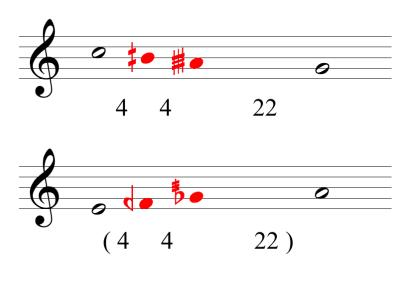

Figure 4.21. Descending tetrachord with two enharmonic dieses below its high base—a common sound of
intoned recitation today—in comparison with an ascending tetrachord of the ancient Greek enharmonic genus. The two
tetrachords stand in a mirror relationship.
(On the ancient Greek enharmonic genus, cf. Michaelidis, 1999, p. 114).

225

lxxxvi Cf. Alygizakis (2001, pp. 106–107).
lxxxvii Cf. Alygizakis (2001, pp. 109, 117–140).
lxxxviii On the typology of ekphonetic cadences in Byzantine and Western notation, cf. Alygizakis
(2001, pp. 120–128). On the recording of Nafpliotis, cf. Alygizakis (ed., 2008). Cf. also
<https://www.youtube.com/watch?v=jbXNlQUjqlk> (11.9.2016). A simplified notation of the same Gospel
reading is found in Alygizakis (2001, pl. 17).
lxxxix Alygizakis (2001, p. 108).
xc Cf. Panțiru (1982). On date and provenance, see D' Agostino & Martani (2005, pp. 18, 23 et passim). For a
study of the Gospel pericope of the Resurrection, cf. Martani (2003a, pp. 38–40) and the same author (1999, pp. 35–36).
xci On this codex, cf. Treasures of the Holy Mountain (vol. I, 1973, p. 439). For the photography we thank
Dr Stefanos Alexandrou.
xcii We thank Father Athanasios Zographitis. Photography: Dr Stefanos Alexandrou. This fragment has not
yet been catalogued and has no number.
For an analysis of ekphonetic notation from a MS in minuscule script of the 12th c., cf. also D' Agostino
& Martani (2007/2010).

226
