## Summary

This chapter outlines the development of the notation of Greek music from the third century AD to the twelfth century, chiefly on the basis of fragments and local musical notations. Important findings are presented that document various attempts to record pre-Byzantine and Byzantine music, using a variety of graphic systems which, however, for the most part saw limited use and dissemination in the early Christian and Byzantine world. The Oxyrhynchus Papyrus, no. 1786 (second half of the third century AD), with ancient Greek alphabetic vocal notation, the Notation of Hermoupolis, the “Theta” and “Double” notations, as well as other local notations, constitute important evidence for the presence of Greek musical scripts during the first Christian millennium.

## Prerequisite knowledge

The study of

chapters 1-4 is required.

## 1. Prolegomena

Few testimonies of practical sources for Greek music have survived from the first Christian millennium.
They are chiefly fragments or monuments of more limited geographical scope, which nevertheless
show the roots from which the great tradition of melodic notations of the second
millennium was born (Palaeobyzantine, Middle Byzantine, and that of the New Method).
On the other hand, during the sixth and eighth centuries there were great flowerings in the field of
Byzantine hymnography, with the cultivation of the kontakion and the kanon.i Since in Byzantine Music
the poetic word and the melos that clothes it constitute an indissoluble unity,ii we may
suppose that the music of those periods too must have undergone corresponding developments, on the basis
of a strong oral tradition.
Below will be presented in summary the famous Oxyrhynchus Papyrus no. 1786 with
ancient Greek alphabetic vocal notation, as well as various primordial notations that are
documented: in early Christian papyri, in fragments of Coptic provenance from the
John Rylands Library of the University of Manchester (Hermoupolis notation), in the palimpsest
codex Garrett 24 from the Firestone Library (Princeton), in various Greek, Slavic, and Syro-Melkite
manuscripts of the eighth to sixteenth centuries (“Theta” Notation, and the related “Double” Notation), in various
Sinaitic manuscripts (Sinaitic notation), in parchment fragments of the Kappadochos archive from the
Department of Music Studies of the University of Athens (Cypro-Palestinian Notation), and in other
sources.iii

## 2. The Oxyrhynchus Papyrus no. 1786 with ancient Greek vocal alphabetic notation

In the ancient Greek city of Oxyrhynchus, which lies on a western branch of the Nile in Upper
Egypt, the oldest written monument of Christian music was found in 1918. The
papyrus in question was assigned the inventory number 1786 and was published for the first time by A. S. Hunt.iv
The Oxyrhynchus Papyrus 1786 is dated to the second half of the 3rd century AD and contains a fragment
of a hymn to the Holy Trinity. It is written in the learned Greek language, in the Doric dialect and in
prosodic metre, more specifically in anapaestic monometers. Above the words of the poetic text,
in majuscule script, symbols can be discerned—the so-called musical signs (σημεῖα μουσικά) or musical punctuation (μουσική στίξις)—of an
ancient Greek system of notation. This is the type of ancient Greek alphabetic vocal
notation, which is based on the Ionic alphabet.v The music recorded in this
fragment is in the diatonic Hypolydian harmonia. Thus, this particular papyrus constitutes not only the
first document of Christian music, but, at the same time, also the last document of ancient Greek
music, owing to its notation and its musical texture.vi In Figure 5.1 and its associated
files this papyrus is presented in its contexts, together with editions, analyses, and performances
of it, in the form of a music-educational presentation.vii

227

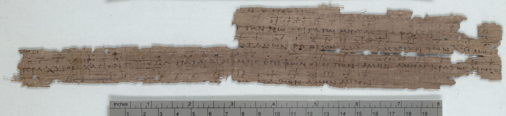

Figure 5.1. The Oxyrhynchus Papyrus 1786, (P.Oxy.XV 1786), second half of the 3rd century AD. Hymn to the Holy Trinity in ancient Greek alphabetic vocal notation. The
oldest monument of Christian music (on the basis of its content) and the last monument of ancient Greek music (on the basis of its notation and musical texture).
It is kept in the Papyrology Rooms, Sackler Library, Oxford. First published by A.S. Hunt, in 1922.
Image source: <http://163.1.169.40/gsdl/collect/POxy/index/assoc/HASH011f/50b846c7.dir/POxy.v0015.n1786.a.01.hires.jpg> (11.9.2016). Included in the present
work with the kind permission/by Courtesy of the Egypt Exploration Society and Imaging Papyri Project, Oxford.
For a guided tour through the space and time of the excavations at Oxyrhynchus, cf. <http://www.papyrology.ox.ac.uk/POxy/VExhibition/exhib_welcome.html> (11.9.2016).
Cf. also: Adam, Sotiria. (2012). The Oxyrhynchus Papyrus. The End of One Era and the Beginning of Another: <https://www.youtube.com/watch?v=X6cTHpXj-KU>

(11.9.2016). A recent monograph on this hymn was provided by Cosgrove (2011).

228

## 3. Early Christian hymns on papyri and ostraca, with elements of primordial notation systems

### 3.1. Some Introductory Remarks

Oxyrhynchus Papyrus 1786, discussed in the previous section, has remained to this day
the only known witness to a Christian hymn with ancient Greek musical notation.
Reference has already been made in chapter 2 of the present handbook to the famous Rylands Papyrus 470, in which, between the words of the hymn, there appear a double
acute accent, two small curved signs, as well as a colon, perhaps connected with the musical performance
or the reading aloud of the Theotokion (θεοτοκίον) (see
Figure 2.46.a).
The journey toward tracing the evolutionary course of Greek music during the first
Christian millennium continues through the careful examination of hymnographic sources on papyri,
ostraca, parchment, and early paper, in which attestations of echoi (modes), special uses
of prosodic signs, or various other symbols such as double or multiple acute accents, double grave accents,
hook-shaped forms, and others appear from time to time (cf. Papathanasiou & Boukas, 2003. Troelsgård, 2007. Sarischouli, 1995).
Below we shall refer briefly to some of the most important finds.

### 3.2. Papyrus Berolinensis 21319viii

A special place among the papyri containing fragments of Byzantine hymnography is also occupied by
Papyrus no. 21319 from the Egyptian Museum and Papyrus Collection of the State Museums of
Berlin. It is of unknown provenance, but, according to its editor, P. Sarischouli, it probably
comes from Egypt, on the basis of certain influences from the Coptic language that can be discerned in the
text. According to the same scholar, the Berlin Papyrus may be dated to the 6th or 7th, or
even to the 8th century. It is written in a careful right-sloping majuscule book hand.ix
It contains fragments of three Theotokion troparia (perhaps stichera or kathismata), which focus
on the Annunciation of the Most Holy Theotokos.
What is noteworthy for the palaeographer of Byzantine music is the signs of musico-poetic
punctuation (middle stops) and especially one of the earliest indications of an initial modal martyría, in combination
with a primitive notation, consisting of dots and hook-shaped forms placed above
some letters (or syllables): see photographs of the original from the Egyptian Museum & the
Papyrus Collection of the State Museums of Berlin (Figures 5.2.a-b) and the diplomatic
transcription and proposed restoration of the text by P. Sarischouli (Figures 5.3-4).

.x

229

1.

2.

3.

4.

5.

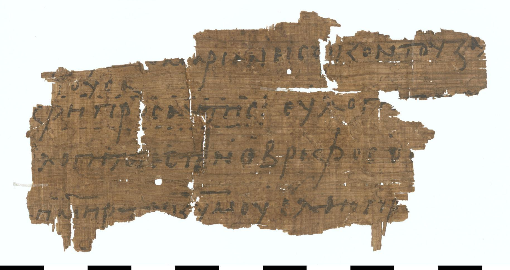

Figure 5.2.a. Papyrus Berolinensis 21319, side → (recto, running parallel to the fibres of the papyrus), 6th/7th or 8th c., of unknown provenance, with a fragment
of a Theotokion troparion in a right-sloping majuscule book hand. A kind of primitive notation is visible, consisting of dots above some
letters (lines 1-4) and a hook-shaped form (line 4, above the letter Ε). At the beginning of the second line, the first eleven letters are in a dotted frame.
This indicates that they should be erased. In the fourth line appear the characteristic abbreviations for two nomina sacra: M(HT)HΡ and Κ(ΥΡΙΟ)Υ.

Sources: The clarifications are based on Sarischouli (1995, pp. 48-56).

© Staatliche Museen zu Berlin - Ägyptisches Museum und Papyrussammlung, Scan: Berliner Papyrusdatenbank, P 21319.

230

1.

2.

3.

4.

5.

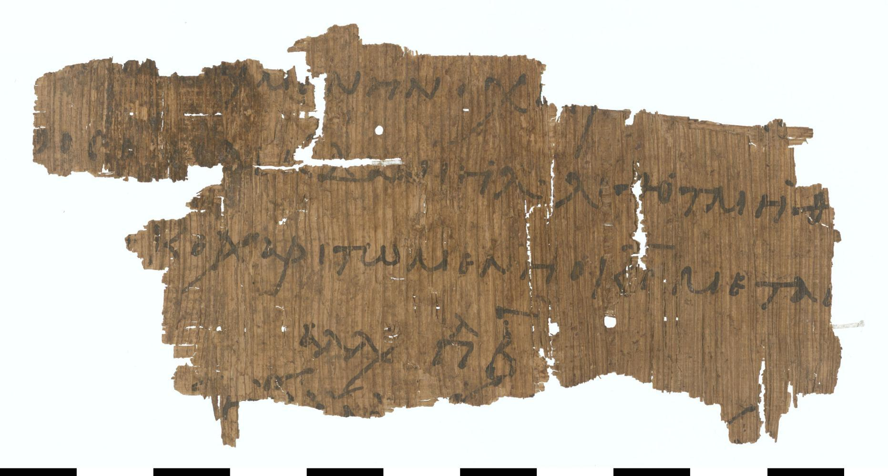

Figure 5.2.b. Papyrus Berolinensis 21319, side ↓ (verso, writing running perpendicular to the fibres of the papyrus), 6th/7th or 8th c., of unknown provenance, with a fragment
of two Theotokion troparia in a right-sloping majuscule book hand. In the third line there is an abbreviation of the word K(YΡΙΟ)Σ.
Signs of musico-poetic punctuation are visible (middle stops, in lines 1-3), as well as signs of a primitive notation: dots above some letters
(end of the second line), the indication of the plagal second mode (line 4), and several mainly hook-shaped forms at the beginning of the second troparion (line 5).
Sources: The clarifications are based on Sarischouli (1995, pp. 48-56).

- © Staatliche Museen zu Berlin - Ägyptisches Museum und Papyrussammlung, Scan: Berliner Papyrusdatenbank, P 21319. 231

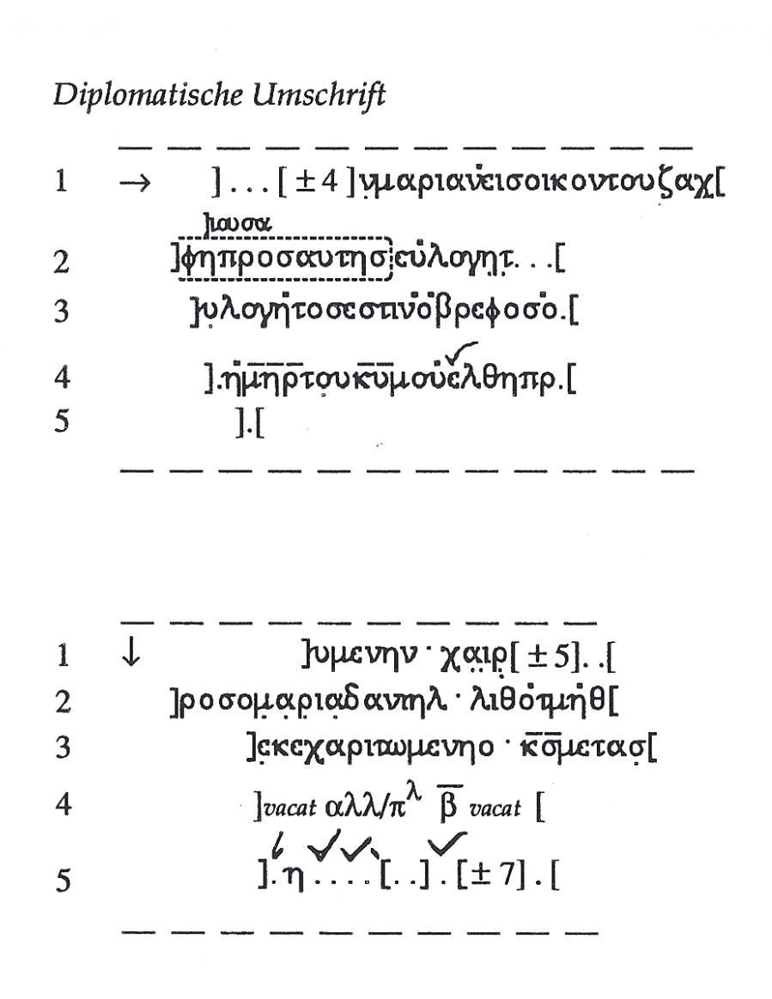

Di

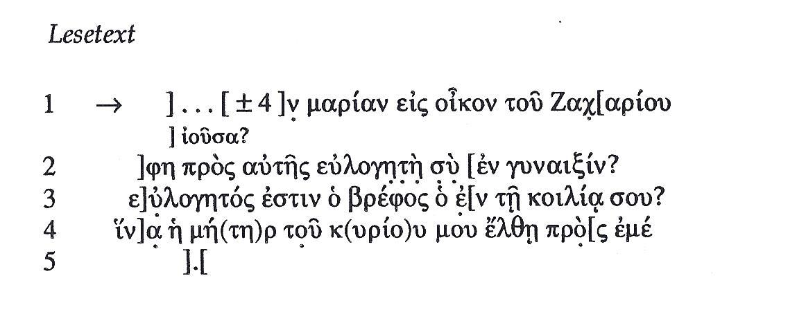
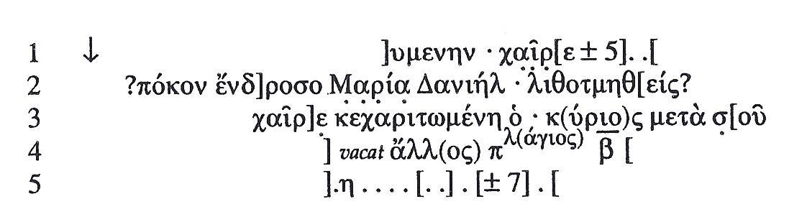

Figures 5.3-4. Diplomatic transcription (left) and restoration of the text (right) of the Theotokion troparia from Papyrus Berolinensis 21319, by Panagiota
Sarischouli. For the special symbols used in the edition, cf. ch. 2, section 2.5. of the present book.
Source: Sarischouli, Panagiota. (1995). Berliner Griechische Papyri. Christliche literarische Texte und Urkunden aus dem 3. bis 8. Jh. n. Chr. Serta Graeca, hrsg. von Kl.
Alpers, D. Harlfinger, D.R. Reinsch, Bd. 3. Wiesbaden: Dr. Ludwig Reichert Verlag, pp. 55-56. © Dr. Ludwig Reichert Verlag Wiesbaden.

232

As emerges from the edition and commentary of the aforementioned philologist, the poetic texts of the
troparia combine elements from the Gospel according to Luke (ch. 1, 26-45) with references to events
and prophecies of the Old Testament (Daniel 9, 20-25, but also 2, 34 ff. | Judges 6, 36-40), which
in Christian tradition are interpreted as prefigurations of the Birth of our Lord Jesus
Christ from the Ever-Virgin Mary.

## 4. The notation of Hermoupolisxi

South of Oxyrhynchus, near the banks of the Nile, lay the ancient Egyptian city of Khmoun,
called Hermoupolis in Greek.xii Probably from there, and reflecting the tradition of Egyptian
Christians (the so-called Copts), come five manuscript fragments in Greek
right-sloping majuscule script, which are preserved today in the papyrus collection of the
John Rylands Library of the University of Manchester, as Papyri Rylands Coptici 25recto-29recto.
The five fragments are written on early Eastern paper and contain hymnographic texts in
Greek, concerning the Most Holy Theotokos, the feast of Christmas, and others. The many grammatical
and orthographic errors support the hypothesis that the scribe/scribes
of the manuscripts were not of Greek origin.
The five manuscripts are of particular interest for Byzantine Musicology, since
above the text there appears a musical notation consisting mainly of the sign of the acute,
which may stand alone, double, triple, etc., up to sevenfold.
The musicologists Ioannis Papathanasiou and Nikolaos Boukas, who recognized this
notation as a distinct musical script with local use and named it the notation of
Hermoupolis, date the five manuscripts between the 7th and 9th centuries and propose an intervallic
reading of their notation. The basic principles of the proposed reading are as follows:

- Where there is no musical sign, the base of the mode is rendered,

- the number of acutes indicates the number of voices (intervals of a second) in ascent, always in relation to the

base of the mode, and not measured from the preceding note.
Table 5.1 records the signs that appear in the five Coptic manuscripts.

|||||||
|---|---|---|---|---|---|
|Shape|Intervallic value|Shape|Intervallic value|Shape|Comments|
||1 voice||1 voice?|•|Dot placed above the text, perhaps as a sign|

2 voices

||3 voices||;|
|---|---|---|---|
||4 voices||;|

5 voices

6 voices

7 voices

2 consecutive
voices?

of repetition?

Table 5.1. The signs of the notation of Hermoupolis and their possible intervallic values, always in relation to the
base and not to the preceding note, according to I. Papathanasiou and N. Boukas.xiii

233

As an example for the study of this notation, the ms P. Rylands Copt. 25r was selected, with

the first musical record of the hymn Ἐπὶ σοὶ χαίρει, Κεχαριτωμένη (Figure 5.5).xiv The hymn
is attributed to Saint John of Damascus (ca. 675-ca. 753/4).xv

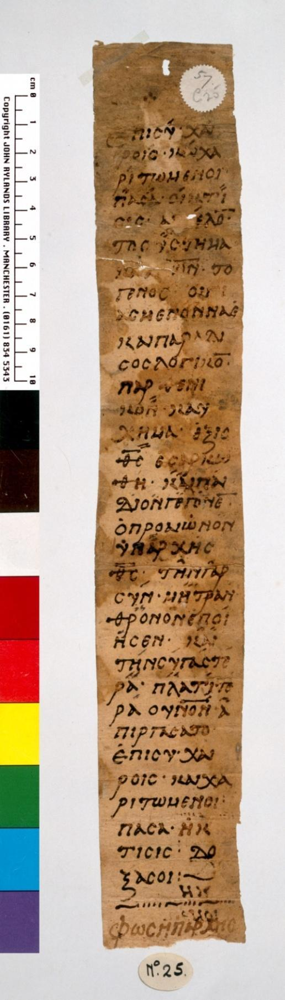

Figure 5.5. P. Rylands Copt. 25r, with the hymn “Ἐπὶ σοὶ χαίρει,” on paper, 32x5 cm, probably 8th c., from the John Rylands
Library, Manchester, with the notation of Hermoupolis.xvi © University of Manchester.

234

In Byzantine chant, from the period of the Kalophonia (Καλοφωνία) (13th-15th c.) to the present, the Ἐπὶ σοὶ
χαίρει, Κεχαριτωμένη - Τὴν γὰρ σὴν μήτραν (plagal fourth - first mode) is known chiefly as the great
megalynarion of the Divine Liturgy of Basil the Great (Ἱερατικόν, 2004, p. 174. Συλλειτουργικόν,
2006, p. 155. Gousi, 2015, pp. 185-186). It may constitute an object of interartistic studies,
since the words of the hymn were a source of inspiration not only for Byzantine and post-Byzantine
composers, but also for icon painters (see Figure 5.6).

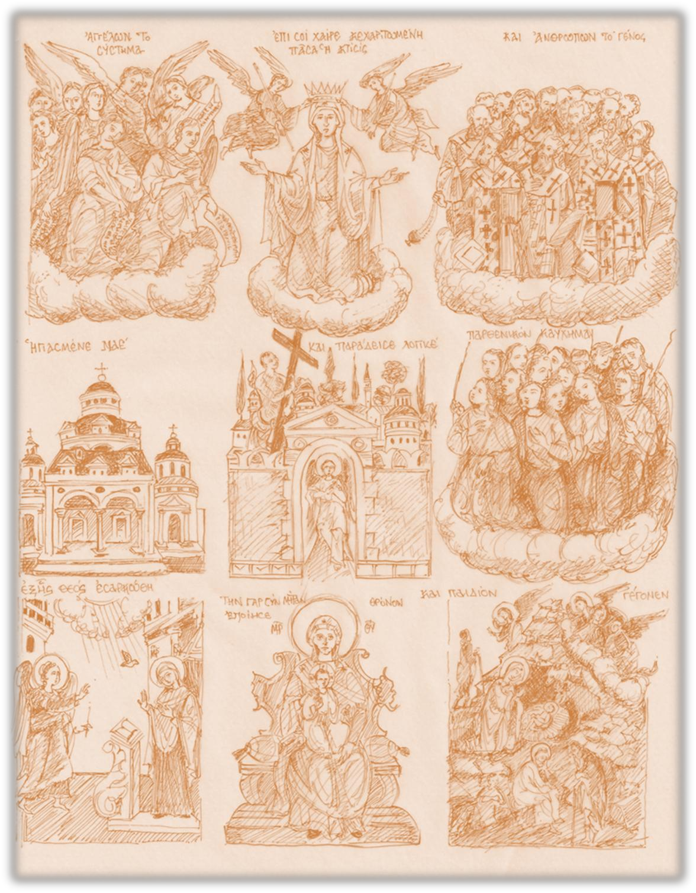

Figure 5.6. “Ἐπὶ σοὶ χαίρει,” iconographic sketch by G. Tzimopoulos & Aik. Ioannidou (2016), based on
a corresponding post-Byzantine icon of the Cretan School, from Mezzojuso in Sicily (photograph in:
Perniciaro-OMègasEsperinòs-VesproSolenne-paginesole.pdf [23.5.2015]).

235

## 5. The Princeton Palimpsestxvii

The palimpsest codex preserved in the Firestone Library, Princeton, in the Garrett Collection, with
no. 24, is of great importance for Byzantine hymnography, since it is perhaps the oldest surviving
example of the Jerusalem Heirmologion in the Greek language, with heirmoi by Saint John
of Damascus, Kosmas the Melodist, Andrew of Crete, Cyprian, as well as several so-called
“Sinaitic” heirmoi. The heirmoi are organized by mode and ode (e.g. first mode: all the heirmoi of the first
ode, then all those of the second or the third ode, etc., up to the ninth ode. The heirmoi of the second
mode, the third mode, etc., follow in the same way, up to the plagal fourth mode).
At the same time, the Garrett 24 Palimpsest is also of special interest for
tracing the beginnings of Byzantine notation: see Figure 5.7.

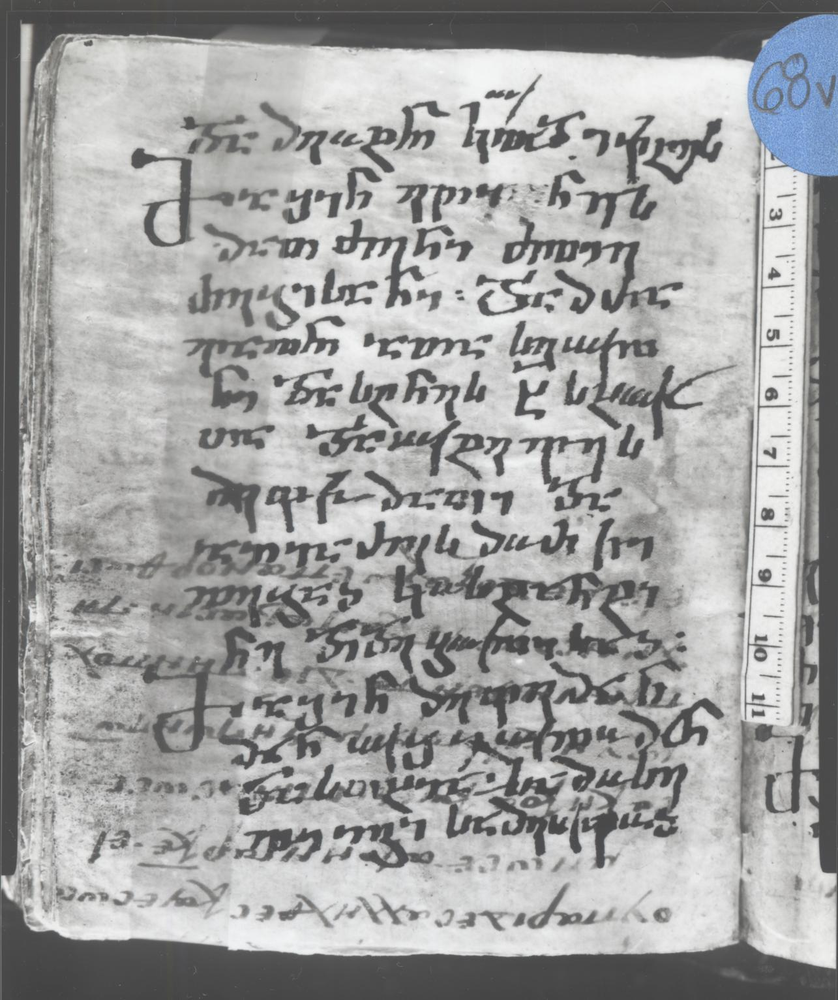
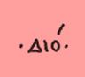

Figure 5.7. The palimpsest codex of the Firestone Library, Princeton, Garrett Collection, no. 24, fol. 68v. The ms
contains, as undertexts, fragments of various texts in Greek and a few leaves in Syriac. Among the

236

Greek texts in the undertext, the fragments from an old Jerusalem Heirmologion stand out, in a
pointed oblique majuscule script with elements of minuscule scriptxviii (fols. 63-70). These leaves were probably
written in the broader zone of “Syria/Palestine/Egypt” and may be dated to the period between
the end of the 7th century (terminus post quem) and before the year 800 (terminus ante quem).
Overtext: “not later than the 11th century,” written probably at the Holy Monastery of Saint Catherine on Sinai, in
Old Georgian (here the Georgian letters appear upside down, since the later scribe turned the old
parchment over in order to write the new text).
Sources and copyright: The photograph is published in the present handbook by the kind permission of
Rare Books and Special Collections, Firestone Library, Princeton. An image of this leaf was first published in
Raasted, Jørgen. (1992). The Princeton Heirmologion Palimpsest. Cahiers de l'Institut du Moyen-Âge Grec et Latin, 62,
fig. 2. The present caption is based on the aforementioned article.

On folio 68v of the Garrett 24 Palimpsest (Figure 5.7), J. Raasted (1992, pp. 226-228) identified in the

lines 1-2 the heirmos Προβλεπτικῶς ὁ προφήτης, by Cyprian, and in lines 3-7 the heirmos Ὑμνῶ
σε, by Saint Kosmas the Melodist, both in the second mode.
As can be seen in the image above, in the 5th line of fol. 68v the word ΔΙΟ (= for this
reason) is visible between high stops, and with an acute above the final syllable. In many cases
διό plays a special role in the structure of Byzantine troparia (heirmoi, stichera), since it marks the
beginning of their final section, introducing the conclusion of the piece.xix A glance at the codex of
Grottaferrata EγII with Middle Byzantine notation reveals that the heirmos Ὑμνῶ σε carries on the
corresponding word the thesis known as thematismos eso (θεματισμός ἔσω): see Figure 5.8.

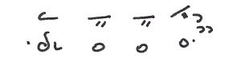

G# a h dc h

Figure 5.8. The formula of the thematismos eso on the word “διό,” in the heirmos Ὑμνῶ σε, second mode, poem by Saint Kosmas
the Melodist. Copy from the Heirmologion Grottaferrata EγII, year 1281, fol. 36r (Tardo, 1951, MMB 3. Raasted,
1992, p. 224). Raasted (1995, p. 59) calls the melisma on the syllable -ο- "a structuralizing melsima".

## 6. Theta Notation

According to J. Raasted (1995, p. 57), Theta Notation is “a primitive notation that was
used for marking melismas in pieces that were otherwise simple, non-
melismatic. The marking was usually made with the letter Θ alone, or in combination with signs of
Coislin notation. (...) it was widely disseminated, in sources dating from the 8th to the 16th
century (or even later), and in use over an extended area, in Greek, Slavic, and Syro-
Melkite liturgical manuscripts.”xx
The same scholar hypothesizes that the roles of Theta Notation were:

 indicative, i.e. to serve as a guide for the hymnographers of kanons, who would write

prosomoia on the models of the heirmoi,

-  mnemonic, to remind chanters of the points where there is a melisma,

-  normative, allowing also a control of the performance by the person responsible for the chanting

(the hegoumenos or another cleric).xxi
In some cases, apart from Θ, other symbols also appear, such as circumflexes and
double or triple vertical strokes (British Library, Additional MS 24.378: Raasted, 1995, pp. 58-59).

237

Below is an example of a sticheron with Theta Notation, from the ms of the Holy Monastery of the Great
Lavra Γ 12 of the 10th or early 11th c.: see Figure 5.9.

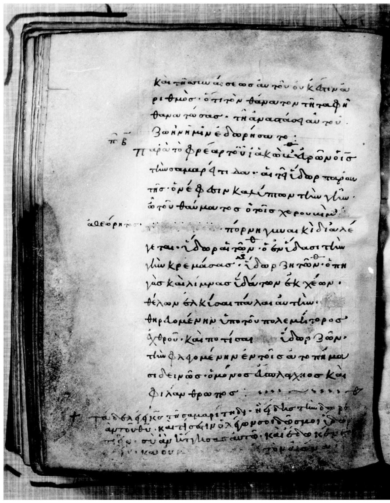

Figure 5.9. The Sticherarion Laurensis Γ 12 of the Holy Monastery of the Great Lavra of Mount Athos, 10th c. (Strunk, Raasted)
/ early 11th c. (Floros), fol. 65v, with the sticheron “Παρὰ τὸ φρέαρ τοῦ Ἰακώβ,” in “Theta” notation.xxii © for the
photograph from microfilm: Patriarchal Institute for Patristic Studies, Thessaloniki.

238

## 7. Archaic musical scripts in Syro-Melkite manuscripts. The Theta and Double Notations

During the Byzantine period, the Syro-Melkites constituted a religious community which, unlike
the Monophysite Syrians, followed the Orthodox tradition of the emperor of the Eastern Roman
Empire. The word Melkite, etymologically, derives from the Semitic melek (ךלמ), which means
king.xxiii
Syro-Melkite liturgical manuscripts attracted the scholarly interest of various
Byzantine musicologists, such as Heinrich Husmann (1975, 1978), J. Raasted (1979), and others.
Apart from instances of the use of Theta Notation, sometimes in combination with double acutes and
double graves, Raasted also observed the existence of a related musical script, which he called
Double Notation, because of the predominance of the double acute (see Figure 5.10).
There is no lack, however, of points where the number of acutes multiplies noticeably, possibly in
some analogy with the density of the melisma, and where other signs also appear, such as the
grave and others: see Figures 5.11-12.

239

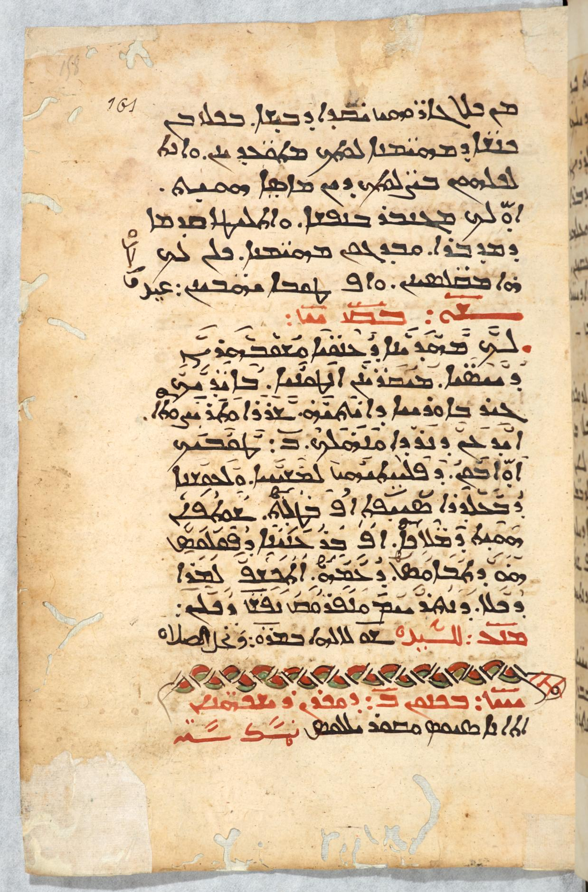

Figure 5.10. “Double” notation in the Syro-Melkite manuscript Parisinus syriacus 136, fol. 161r (because the book
is read from right to left), year 1521, with the sticheron “Τῶν μοναστῶν τὰ πλήθη,” in honor of Saint Anthony
the Great (17 January). See also Raasted (1979, B, p. 61, para. 11, and p. 77, para. 22). © Bibliothèque nationale de
France.

240

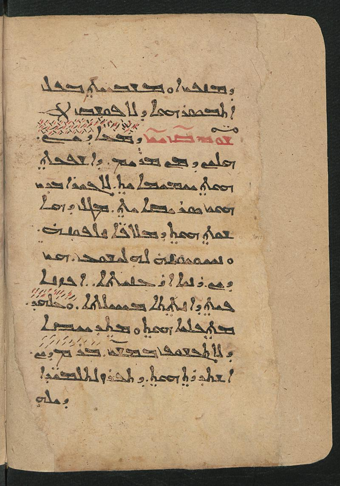
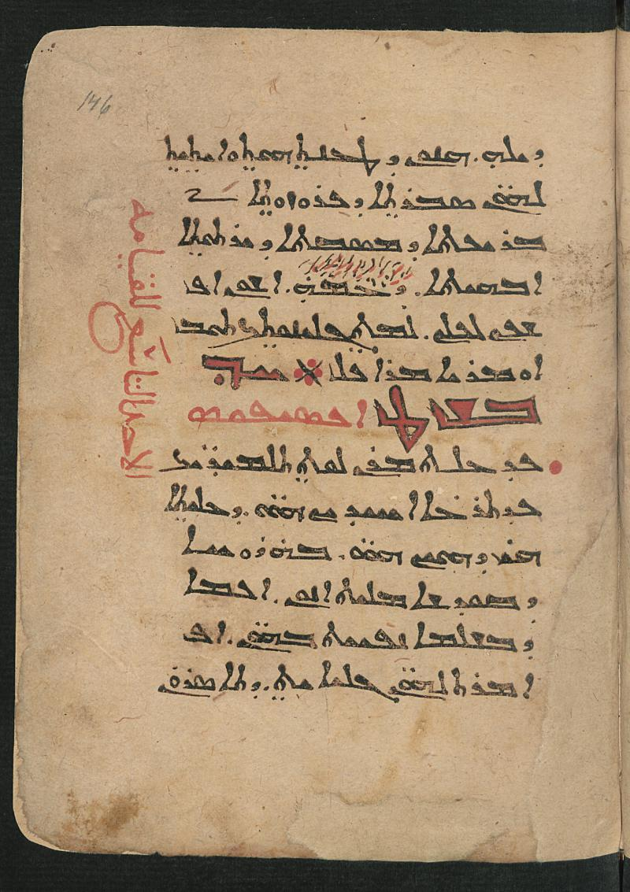

Figures 5.11a-b. Forms of primitive notation in a Syro-Melkite manuscript: Berlin, Sachau 100, 14th-15th c., fol. 145v (we first read the leaf that is
on the right) and 146r (left), with the eighth Eothinon “Τὰ τῆς Μαρίας δάκρυα”.
Sources: <http://digital.staatsbibliothek-berlin.de/werkansicht?PPN=PPN730225240&PHYSID=PHYS_0007&DMDID=DMDLOG_0001> (8.8.2016) and Raasted (1979, B, p.
56, para. 5 and p. 55, para. 3, together with A, p. 18). ©Berlin, Staatsbibliothek zu Berlin, Preussischer Kulturbesitz.

241

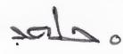

The collection of church music Berlin Sachau 100, 14th-15th c., presents, for example, in the same Syriac word , which corresponds
to the Greek δι' ἧς, various neumatizations, perhaps in relation to different levels of melismaticity in musical performance (see Figure 5.12):

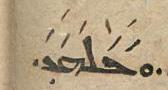

1. 19v

fol. 33v

1. 70r

fol. 71r

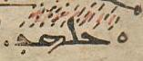

Figure 5.12. Proto-Byzantine neumatizations in the Syro-Melkite ms Berlin, Sachau 100, 14th - 15th c. Apart from the black and red little strokes, on fol. 70r
a black Θ or Φ is also visible.
Sources: <http://digital.staatsbibliothek-berlin.de/werkansicht?PPN=PPN730225240&PHYSID=PHYS_0007&DMDID=DMDLOG_0001> (8.8.2016)
and Raasted (1979, A, p. 18 and B, p. 55, para. 3). © Berlin, Staatsbibliothek zu Berlin, Preussischer Kulturbesitz.

242

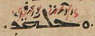
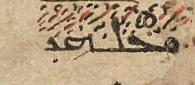

## 8. Cypro-Palestinian Notation

Cypro-Palestinian notation was the name given by I. Papathanasiou to a kind of primitive musical
script found in parchment liturgical fragments of the second half of the 12th and the first quarter of the
13th century, originating from the “broader area of Cyprus-Palestine” (Papathanasiou, 2003, p. 82).
Today these fragments are kept in the library of the Department of Music Studies of the
University of Athens, in the Kapadochos archive, nos. 1 and 2.
This local musical notation operates with the acute, the grave, and the
circumflex, which are placed in various combinations above the words of the hymnographic text:
see Figures 5.13-15.

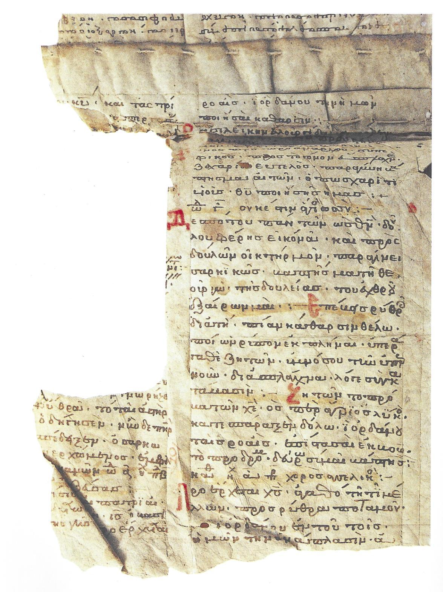

Figure 5.13. Liturgical parchment fragment from the archive of D. Chr. Kapadochos, ms no. 1, fol. 2, second half of the 12th c., with
Cypro-Palestinian notation. Possible provenance: from the “broader area of Cyprus-Palestine”

243

(Papathanasiou, 2003, pp. 82-83). © Department of Music Studies of the National and Kapodistrian University of
Athens. Photograph source: Papathanasiou, Ioannis. (2003). Liturgical parchment fragments from the private
archive of Dimitrios Chr. Kapadochos. In Efstathios Makris (ed.), The two aspects of the Greek musical heritage.
Tribute to the memory of Spyridon Peristeris. Proceedings of the Musicological Meeting, 10-11 November 2000, Athens Concert
Hall, Academy of Athens, Publications of the Centre for Research in Greek Folklore no. 18 (pp. 81-

102). Athens, p. 94, pl. A2.

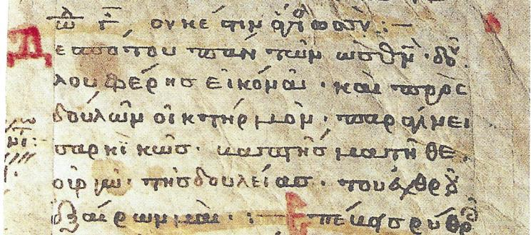

Figure 5.14. Detail of the Kapadochos 1 fragment, fol. 2. © Department of Music Studies of the National and
Kapodistrian University of Athens. Photograph source: Papathanasiou (2003, p. 94, detail of pl. A2).

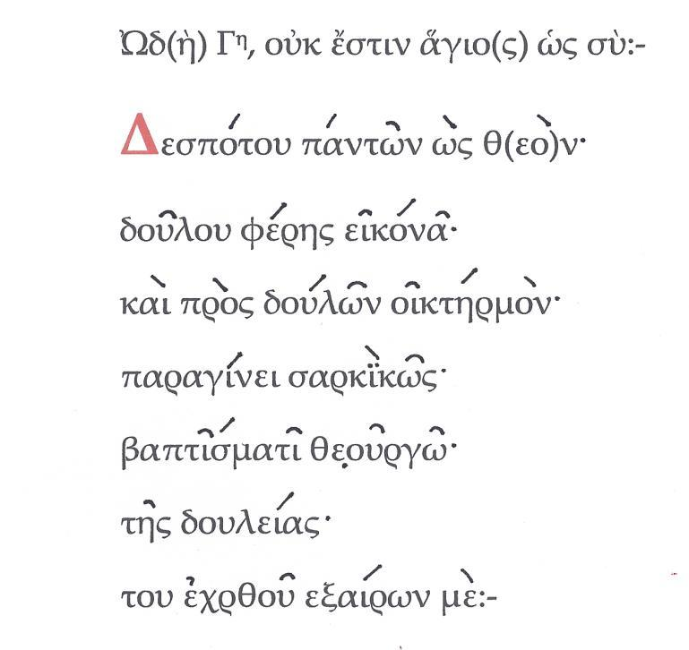

Figure 5.15. A transcription of the upper troparion, with division into cola on the basis of the punctuation marks of the ms, and with
correction of spelling errors. In the third line from the end, the first syllable of the word “θεουργω” is
separated in the manuscript from the remaining syllables, since it is at the end of a line, and there is a lower
stop after it (see Figure 5.14).

244

## 9. In search of musical scripts in Greek Sinaitic manuscripts of the first Christian millenniumxxiv

Jean-Baptiste Thibaut, one of the pioneers of Byzantine musical palaeography, published at the
beginning of the 20th century his magnum opus in the field of Byzantine Musical Palaeography, entitled
Μonuments de la Notation Ekphonétique et Hagiopolite de l'Église Grecque. This book includes,
alongside various facsimiles of valuable manuscripts, a first edition of the Sinaitic Codex L
(Codex Sinaiticus Liturgicus), which is today in the Russian National Library, Sankt Petersburg,
as RNB. Gr. 44: (Τhibaut, 1913, pp. 17-30 and documents 1*-11*).
As Alexandra Nikiforova and Tinatin Chronz emphasize, this manuscript constitutes a
unique 9th-century collection, with readings, prayers, and chants of the Hagiopolite type, probably from
the region of Egypt: see Figures 5.16-17.

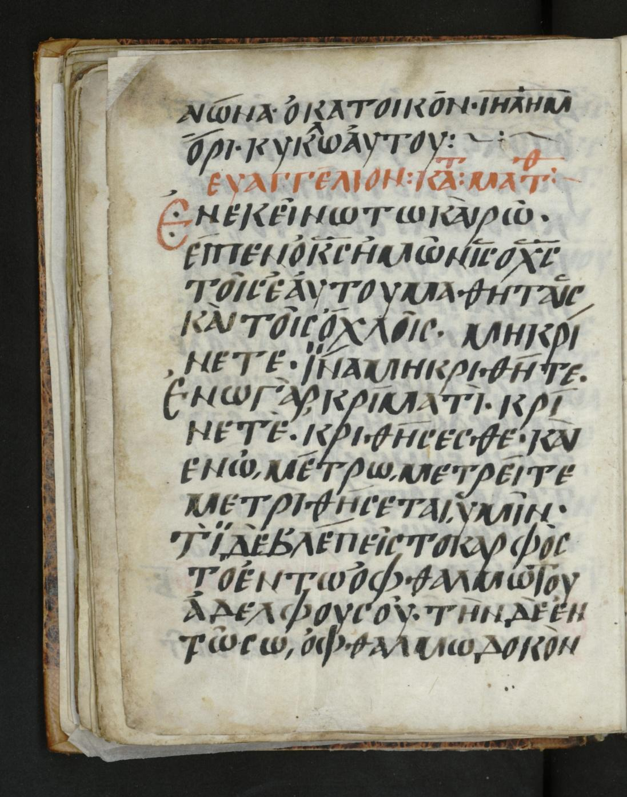

Figure 5.16. Codex Sinaiticus Liturgicus RNB Gr. 44, fol. 34v, 9th c., with the beginning of the reading from the Gospel according to
Matthew 7, 1-3a,xxv in pointed oblique majuscule script, with double accents on some words.

© National Library of Russia, St. Petersburg.

245

1.

2.

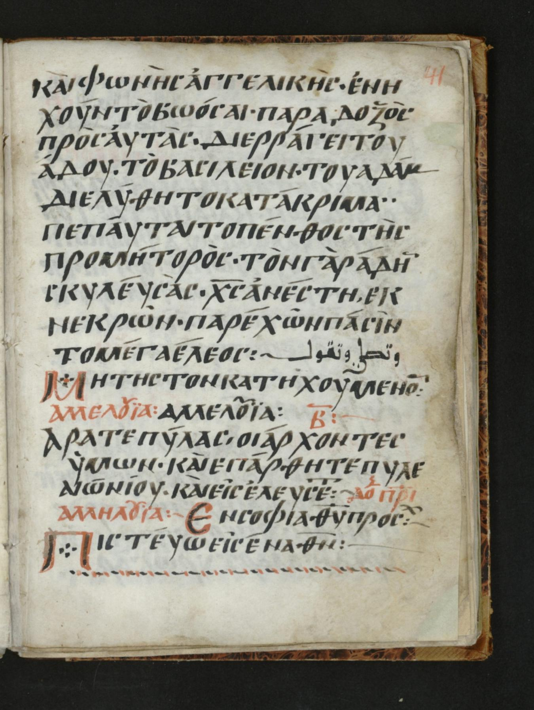

1.

2.

Figure 5.17. Codex Sinaiticus Liturgicus RNB Gr. 44, fol. 41r, with the second part of the sticheron eis synaxin “Tὸ
ζωοδόχον σου μνῆμα,” in the third mode, the deacon’s exhortation “Μή τις τῶν κατηχουμένω(ν)” at the beginning of the second
part of the Divine Liturgy, the “Ἀλληλούϊα - (ἦχος [;]) β΄ Ἄρατε πύλας... (Psalm 23, 7) - Δόξ(α) Π(ατ)ρί -
Ἀλληλούϊα” in the place of the Cherubic Hymn. There follows the deacon’s exhortation “Ἐν σοφίᾳ Θ(εο)ῦ πρόσχ(ωμεν)” and
the incipit of the Creed follows.xxvi In lines 2, 7-9, and 15 various words with double
accentuation are observed. In addition, at the end of the 5th line there is a special form (two small apostrophoi). © National Library of
Russia, St. Petersburg.

246

As we saw in the preceding figures, the codex preserves a primitive musical script. A
study of the entire codex reveals that the musical script appears with two levels of density:

 A simpler and sparser form, which to a large extent could be identified with what we saw

in the preceding section as Cypro-Palestinian notation, since it operates chiefly with the acute,
grave, and circumflex, which are placed in various combinations above some words of the
readings (Apostolos and Gospel readings: see Figures 5.16-18), and
a more complex and denser one, which appears in some prokeimena,xxvii and could possibly
be described as a local (Egyptian?) variety of “Double” notation: see Figure 5.19.

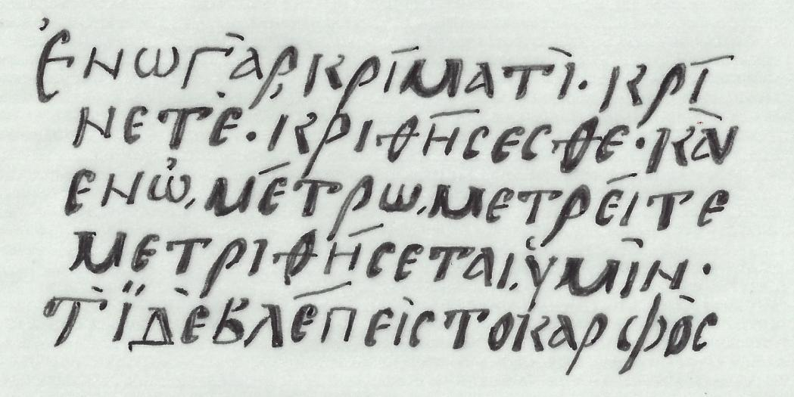

Figure 5.18. Copy from the codex Sinaiticus Liturgicus RNB Gr. 44, fol. 34v (fragment from the Gospel according to Matthew
7, 2-3a),xxviii in pointed oblique majuscule script, with double accents on some words (resembling
Cypro-Palestinian notation). On the second syllable of the second line: small grave. At the beginning of the last
line the iota has either a trema/diaeresis (prosodic sign), or a diple. The former is the more probable, since above
and to the right on the Τ there is a small grave. On the second syllable of the word ΒΛΕΠΕΙΣ there is a small circumflex.

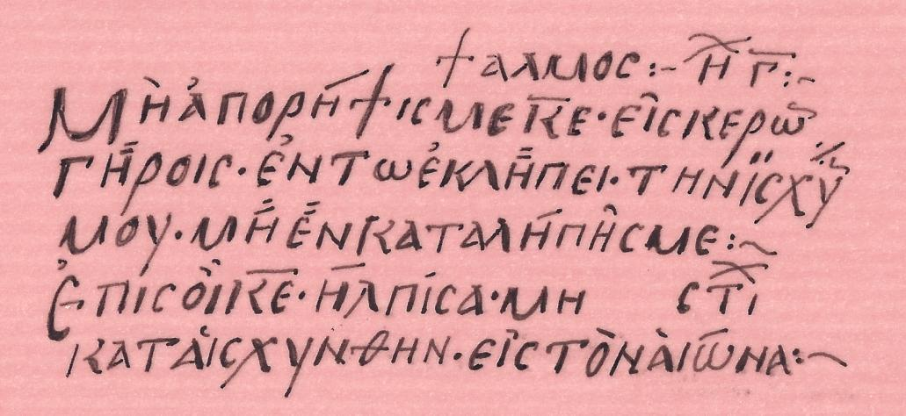

Figure 5.19. Copy from the codex Sinaiticus Liturgicus RNB Gr. 44, fol. 37r: Prokeimenon in the third mode (Psalm 70, 9)
and verse (Psalm 30, 2),xxix with “Double” notation (of Egyptian type?).

According to J.-B. Thibaut (1913, p. 17), the individual signs found in the codex in question
are the following: see Table 5.2.

Simple signs

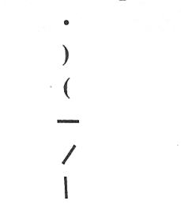

Composite signs

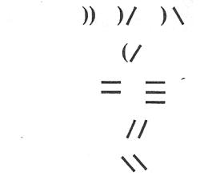

247

Table 5.2. The signs of the Sinaitic Liturgical Codex, according to Thibaut. The same scholar relates them
to “Coptic ekphonetic notation,” making reference to P. Rylands Copt. 25r and the other fragments of the
same family, that is, to the notation which I. Papathanasiou & N. Boukas named “Notation of
Hermoupolis” (see above, section 4 and Figure 5.5).
Source: Thibaut, Jean-Baptiste. (1913). Monuments de la Notation Ekphonétique et Hagiopolite de l'Église Grecque. St.
Petersburg. Reprint with Appendix Introduction by Oliver Strunk. Hildesheim, New York: Georg Olms Verlag, 1976, p.

1. For two facsimiles of this ms, see ibid., pp. 18-19.

The same broader background seems also to be shared by the fragment of a Tropologion that is numbered
among the New Finds of Sinai, Majuscule Codex 37, of the 9th-10th century (see Archbishop
Damianos, Archim. Sophronios, Peltikoglou and Nikolopoulos, 1998, photo 66. Géhin & Frøyshov, 2000, p.
179).
In the fragment in question as well, in the sticheron Πάντα σου θαυμαστά, in the first mode, words with
more than one accent are found. In the same sticheron there is a “ΔΙΟ” between two punctuation marks and with a
double grave on the final syllable (Figure 5.20).

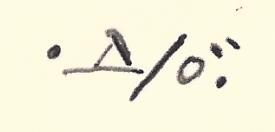

Figure 5.20. Sinai, New Finds MG 37, fragment of a Tropologion, 9th-10th c.: the word ΔΙΟ as an independent colon with
a melisma on the final syllable.
Copy from: Archbishop Damianos, Archim. Sophronios, Peltikoglou and Nikolopoulos, 1998, photo 66.xxx

Striking is the triple salutation in a stepwise progression at the end of the same sticheron (Πάντα
σου θαυμαστά), where the “χαῖρε” each constitute separate cola, with different and perhaps more
melismatic treatment, as one may infer from the dense punctuation and the more complex
neumatization of the syllables, with double acutes. In the penultimate word, “ψυχαις,” there appears the
combination of double and single acute, which in Old Byzantine notation would become known by the
name “dyo” (δύο):xxxi see Figure 5.21.

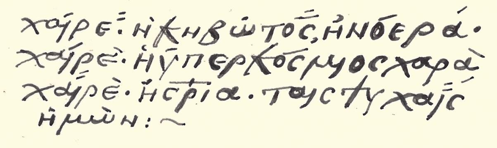

Tropologion, 9th-10th c.: the end of the sticheron “Πάντα σου

Figure 5.21. Sinai, New Finds MG 37, fragment of a
θαυμαστά,” in the first mode.
Copy from: Archbishop Damianos, Archim. Sophronios, Peltikoglou and

Nikolopoulos, 1998, photo 66.

On the basis of the above Sinaitic manuscripts L and MG 37, one may hypothesize that during the
last two centuries of the first Christian millennium, in the broader region of Palestine -
Egypt - Sinai, there were coordinated efforts to support musical memory, both for
emmelic recitation and for the melodic rendering of liturgical texts of Christian worship.
It seems that in this broader family of manuscripts of the 9th and 10th centuries from the aforementioned
region, a mnemonic notation is used, related to the “Cypro-
Palestinian” and “Double” notations, which we might perhaps conventionally call “Sinaitic”
(on the basis of the manuscripts in which it is found). It is based on the prosodic system and may
display various gradations of complexity, depending on the musical texture of the piece in question,
i.e.:

248

1. simpler, with words bearing double or triple accentuation, with the use of the acute, grave, and circumflex,

2. more complex, where double acutes, double graves, and sometimes triple acutes and others are also added. The root of the double and triple accentuations of words with the prosodic signs acute, grave, and

circumflex may probably be sought in the prehistory of the polytonic system.
According to the famous classical philologist Eduard Schwyzer (1990, vol. I, pp. 374-375), before the
establishment of the Byzantine system of polytonic accentuation known to this day, which is used
consistently only from the 9th and 10th centuries, but goes back to a reform by Theodosius
of Alexandria (around the year 400 AD), there existed the Alexandrian system, according to which
unaccented syllables could be rendered with the grave, while accented syllables with an acute or circumflex,
or even without an accent, leading in some cases to words with multiple prosodic signs: see Figure 5.22.

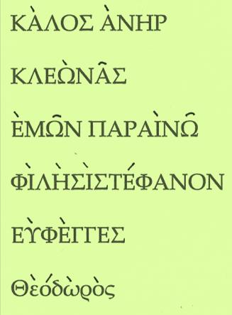

Figure 5.22. Cases of accentuation, according to the Alexandrian system. The final example in minuscule
script is from Byzantine sources, which mention the specific word as an example of an earlier form of
accentuation.
The examples are from: Schwyzer (1990, vol. I, pp. 374-375).xxxii

Future studies will be able:

 to continue the identification of palaeographic

details for the individual primitive musical notations,

 to investigate the possible relationships between the primitive

musical scripts and the Alexandrian prosodic system,

 to trace the points of contact with the principal written tradition of

Byzantine music - both with ekphonetic notation and with Old Byzantine.
It seems that from Sinaitic notation there is a direct line of development toward the archaic
Old Byzantine notation of the Hagiopolite family, which will be discussed more extensively in the next chapter.

249

## Assessment criteria for Chapter 5

Assessment criterion 1
Study the Oxyrhynchus Papyrus 1786, on the basis of Figure 5.1. and the
associated files.

Assessment criterion 2
Study the Notation of Hermoupolis, on the basis of Figure 5.5. and its
associated files.

Assessment criterion 3
Study “Theta” Notation, on the basis of Figure 5.9. and its associated files
.

Assessment criterion 4
Learn the names and basic characteristics of the various kinds of
notation encountered in manuscripts of the first Christian millennium,
from ancient Greek alphabetic vocal notation to Cypro-
Palestinian and Sinaitic notation, on the basis of Table 1.7 from the first
chapter of the present handbook.

## Bibliography for Chapter 5

Holy Scripture and Liturgical Books

The New Testament. The original text with a translation into the vernacular. (2003). Athens: Hellenic Bible Society.
Hieratikon. (2004). 5th ed. Athens: Apostoliki Diakonia of the Church of Greece.
Joyous Pentecostarion. (1994). Athens: Apostoliki Diakonia of the Church of Greece.
Sylleitourgikon, or the Order of the Reader and the Cantor. 5th ed. Mount Athos: Holy Monastery of Simonos Petras.
Novum Testamentum Graece. (1993). Post Eberhard et Erwin Nestle, editione vicesima septima revisa, communiter
ediderunt Barbara et Kurt Aland, Johannes Karavidopoulos, Carlo M. Martini, Bruce M. Metzger, Apparatum
criticum novis curis elaboraverunt Barbara et Kurt Aland una cum Instituto Studiorum Textus Novi Testamenti
Monasterii Westphaliae. Stuttgart: Deutsche Bibelgesellschaft.

Facsimile editions of musical manuscripts and printed musical collections

Iakovos Protopsaltes of the Great Church of Christ. (1836). Doxastarion. Rendered without alteration into
the New Method of Music by Chourmouzios Chartophylax. Ed. Theodoros P.P. Paraschos
Phokeus. 2 vols. Constantinople: Isak de Castro. Repr. Katerini: Tertios, 1990, ed. I. Papachronis.

Husmann, Heinrich. (1975, 1978). Ein Syro-melkitisches Tropologion mit altbyzantinischer Notation. Göttinger
Orientforschungen, I. Reihe Syriaca, Bd. 9,1-2. Wiesbaden: Harrassowitz.
Strunk, Oliver. (Ed., 1966). Specimina Notationum Antiquiorum. Folia selecta ex variis codicibus saec. x, xi, & xii
phototypice depicta. Monumenta Musicae Byzantinae VII, Pars Principalis & Pars Suppletoria. Hauniae: Ejnar
Munksgaards Forlag.

Catalogues of Manuscripts

250

Damianos, Archbishop of Sinai, Pharan and Raitho, Sophronios Archimandrite, Peltikoglou, V. and Nikolopoulos, P.N.
(1998). The Holy Monastery and Archdiocese of Sinai. The New Finds of Sinai. Athens: Ministry of Culture -
Mount Sinai Foundation.
Sachau, Eduard. (1899). Verzeichnis der syrischen Handschriften der Königlichen Bibliothek zu Berlin. Berlin: Α. Asher
& Co. <https://archive.org/details/diehandschriften2301preu> (8.8.2016).
Spyridon of the Laura and Eustratiades, Sophronios. (1925). Catalogue of the Greek Manuscripts in the Library of the
Laura on Mount Athos. Harvard Theological Studies XII. Cambridge: Harvard University Press. Repr. New York:
Kraus Reprint Co., 1969.

### Theoretical Treatises

Alypius. Introduction to Music. (1995). Ed. Archim. Ath. Siamakis. Prespes.

Books, articles

Alexandru, Maria. (2016). Introduction to Byzantine Music. Thessaloniki: University Studio Press.
Aspiotis, Nikolaos. (1997). Ancient Greek Musicians. Athens.
Vokotopoulos, Panagiotis L. (1995). Greek Art. Byzantine Icons. Athens: Ekdotiki Athinon.
Giannou, Dimitris. (1995). History of Music. Volume I. Thessaloniki: University Studio Press.
Giannou, Dimitris, Goulaki-Voutyra, Alexandra and Themelis, Dimitrios. (1998). Greek and European Music.
An Illustrated Historical Introduction. Thessaloniki: Society of Friends of Music of Thessaloniki.
Goulaki-Voutyra, Alexandra. (General supervision, 2012). Greek Musical Instruments. Investigations in visual and
literary testimonies (2000 BC - 2000 AD). Thessaloniki: Archive of Musical Iconography, Department
of Music Studies.
Gousi, Vasiliki. (2015). The Art of Prosopography in Byzantine Music. The Figure of the Virgin Mary.
Doctoral dissertation. Aristotle University of Thessaloniki, Department of Music Studies. Volos.
Detorakis, Theochari. (1995, 2003). Byzantine Literature. The Persons and the Texts. 2 vols. Heraklion, Crete.
Holy Monastery of Saint Dionysios. (2003). The Frescoes of the Katholikon. Mount Athos: Holy Monastery of Dionysiou.
Iordanidou, Anna. (1991). The Verbs of Modern Greek (11th ed.). Athens: Patakis.
Karkos, K. and Meletlidis, E. (1978). Elements of Ancient Greek, Latin, and Modern Greek Metrics. Thessaloniki:
Pournaras.
Mandilaras, V. (1980). Papyri and Papyrology. Athens.
Michailidis, S. (1999). Encyclopedia of Ancient Greek Music (3rd ed.). Athens: Cultural Foundation of the
National Bank.
Balageorgos, Dimitrios and Anastasiou, Grigorios. (Eds., 2010). Theory and Practice of the Psaltic Art. The
Oktoechos. Proceedings of the 3rd International Musicological and Psaltic Conference, Athens, 17-21
October 2006. Athens: Holy Synod of the Church of Greece, Institute of Byzantine Musicology, publ.
Gr. Stathis.
Papathanasiou, Ioannis. (2003). Liturgical parchment fragments from the private archive of Dimitrios Chr.
Kapadochos. In Efstathios Makris (ed.), The Two Aspects of the Greek Musical Heritage. Tribute
in memory of Spyridon Peristeris. Proceedings of the Musicological Meeting, 10-11 November 2000, Athens
Concert Hall, Academy of Athens, Publications of the Centre for Research in Greek Folklore no. 18

(pp. 81-102). Athens.

Papathanasiou, Ioannis and Boukas, Nikolaos. (2001). The hymn “Ἐπὶ σοὶ χαίρει Κεχαριτωμένη” in the Byzantine
musical tradition. Mousikologia, 15, 138-152.
Papathanasiou, Ioannis and Nikolaos Boukas. (2003). Byzantine musical notation and its use up to the
10th century. The oral and written tradition of early Byzantine chant. Mousikologia, 17, 184-197.
Sophianos, D. Z. (1990). Meteora. A Travelogue. Meteora: Edition of the Holy Monastery of the Transfiguration (Great
Meteoron).
Stathis, Grigorios. (2014). “Ἐπὶ σοὶ χαίρει - Τὴν γὰρ σὴν μήτραν” and the concluding “Ἐπὶ σοὶ χαίρει”.
Anatolis to periichima, 1, 343-400.
Sotirchos, P.M. (2011). Angel in the Flesh. Macarius the Great the Egyptian. Athens: Astir.
Tsaferis, Vasilios. (n.d.). Jerusalem, Holy Places, Pilgrim Guide of the Orthodox Christian. Herzliya: Palphot.
Tsigaridas, Efthymios. (2003). Manuel Panselinos, From the Protaton. Exhibition catalogue. Scholarly ed.
Efthymios Tsigaridas, catalogue authors Efthymios Tsigaridas et al. Thessaloniki: Agioritiki Estia.
Tsolakidis, Christos D. (2001). Hagiologion of Orthodoxy (2nd ed.). Athens: Ch. D. Tsolakidis Publications.

251

Chatzigiakoumis, Manolis. (1999). The Ecclesiastical Music of Hellenism after the Fall (1453-1820). An Outline
of History. Athens: Centre for Research & Publications.

Bagnall, R. (Ed., 2009). The Oxford Handbook of Papyrology. Oxford: Oxford University Press.
Cosgrove, Charles. (2011). An Ancient Christian Hymn with Musical Notation: Papyrus Oxyrhynchus 1786: Text and
Commentary. Studien und Texte zu Antike und Christentum. Tübingen: Mohr Siebeck.
Cuvigny, Hélène. (2009). The finds of papyri: the Archaeology of Papyrology. Translated by Adam Bülow-Jacobsen. In
Roger S. Bagnall (ed.), The Oxford Handbook of Papyrology (pp. 30-58).
Frøyshov, Stig. (2013a). Greek Hymnody. In Watson, J.R. & Hornby, Emma (eds.), The Canterbury Dictionary of
Hymnology. <https://uio.academia.edu/StigSimeonFr%C3%B8yshov> (11.9.2016).
Frøyshov, Stig. (2013b).
Hornby, Emma (eds.), The Canterbury Dictionary of
Hymnology. <https://uio.academia.edu/StigSimeonFr%C3%B8yshov> (11.9.2016).
Frøyshov, Stig. (2013c).
Emma (eds.), The Canterbury Dictionary of
Hymnology. <https://uio.academia.edu/StigSimeonFr%C3%B8yshov> (11.9.2016).
Frøyshov, Stig. (2013d).
Emma (eds.), The Canterbury Dictionary of
Hymnology. <https://uio.academia.edu/StigSimeonFr%C3%B8yshov> (11.9.2016).
Géhin, Paul and Frøyshov, Stig. (2000). Nouvelles découvertes sinaïtiques: à propos de la parution de l'Inventaire des
manuscrits grecs. Revue des Études Byzantines, 58, 167-184.
Gnilka, Joachim. (1983). Der Christushymnus des Philipperbriefes (2,6-11) und die neutestamentliche Hymnendichtung.
In H. Becker and R. Kacynski (eds.), Liturgie und Dichtung, vol. I (pp. 173-185). St. Ottilien.
Kazhdan, A., et al. (Eds., 1991). The Oxford Dictionary of Byzantium. 3 vols. New York, Oxford: Oxford University Press.
Kujumdzieva, Svetlana. (2012). The Tropologion: Sources and Identifications of a Hymnographic Book. In Chr.
Hannick, Chr. Troelsgård, Sv. Kujumdzieva (ed.-in-chief), St. Harkov (ed.), Byzantium without Borders:
Hymnography and Music in the Byzantine World, 22nd International Congress of Byzantine Studies, Sofia, 22-27
August 2011, Bulgarian Musicology, 3-4, 9-22.
Liddell, H. G, Scott, R., Jones, H. St. and McKenzie, R. (1990). A Greek-English Lexicon, With a Supplement 1968 (repr.
of 9th edition). Oxford: Clarendon Press.
Nikiforova, Alexandra. (2015). The Oldest Greek Tropologion Sin.Gr. ΜΓ 56+5: Α New Witness to the Liturgy of
Jerusalem from outside Jerusalem with First Edition of the Text. Oriens Christianus, 98, 138-173.
Nikiforova, Alexandra, and Chronz, Tinatin. (forthcoming). A New Approach to the "Codex Sinaiticus Liturgicus"
RNB.Gr. 44: Introduction, Publication, Discussion.
Papathanasiou, Ioannis and Boukas, Nikolaos. (2004). Early diastematic notation in Greek Christian hymnographic texts
of Coptic origin. A Reconsideration of the Source Material. In Gerda Wolfram (ed.), Palaeobyzantine Notations
III, Acta of the Congress held at Hernen Castle, The Netherlands, in March 2001, Eastern Christian Studies, 4 (pp.

|Rite of Constantinople. In Watson, J.R. &|
|---|
||
|Rite of Jerusalem. In Watson, J.R. & Hornby,|
||
|Byzantine Rite. In Watson, J.R. & Hornby,|
||

1-25). Leuven, Paris, Dudley MA: A.A. Bredius Foundation, Peeters.

Pöhlmann, Egert and West, Martin. (2001). Documents of Ancient Greek Music. Oxford: Clarendon Press.
Pöhlmann, Egert and Spiliopoulou, Ioanna. (2007). Ancient Greek Music within the Context of Ancient Greek
Poetry. Scholarly ed. P. Vlagopoulos. Corfu: Ionian University, Department of Music Studies,
Laboratory of Greek Music.
Raasted, Jørgen. (1962). A primitive palaeobyzantine musical notation. Classica et Mediaevalia, 23, 167-171.
Raasted, Jørgen. (1979). Musical Notation and Quasi-Notation in Syro-Melkite Liturgical Manuscripts. CIMAGL, 31 A &
B, 11-37 & 53-77.
Raasted, Jørgen. (1992). The Princeton Heirmologion Palimpsest. CIMAGL, 62, 219-235.
Raasted, Jørgen. (1995). Theta Notation and Some Related Notational Types. In Jørgen Raasted and Christian Troelsgård
(eds.), Palaeobyzantine Notations. A Reconsideration of the Source Material (pp. 57-62). Hernen: A.A. Bredius
Foundation.
Sarischouli, Panagiota. (1995). Berliner Griechische Papyri. Christliche literarische Texte und Urkunden aus dem 3. bis

1. Jh. n. Chr. Serta Graeca. Beiträge zur Erforschung griechischer Texte. Herausgegeben von Kl. Alpers, D.

Harlfinger, D.R. Reinsch, Bd. 3. Wiesbaden: Dr. Ludwig Reichert Verlag.
Schneider, Wolfgang. (1989). Grammatik des Biblischen Hebräisch: Ein Lehrbuch. (7 Aufl.). München: Claudius
Verlag.
Schwyzer, Eduard. (1990). Griechische Grammatik, auf der Grundlage von Karl Burgmanns Griechischer Grammatik.
Erster Band: Allgemeiner Teil. Lautlehre. Wortbildung. Flexion. (Sechste, unveränderte Auflage). München: C.H.
Beck'sche Verlagsbuchhandlung.
Thibaut, Jean-Baptiste. (1913). Monuments de la Notation Ekphonétique et Hagiopolite de l'Église Grecque. St.
Petersburg. Reprint with Appendix Introduction by Oliver Strunk. Hildesheim, New York: Georg Olms Verlag,
1976.
Troelsgård, Christian. (1995). The Prokeimena in Byzantine Rite, Performance and Tradition. In Cantus Planus, Papers
Read at the 6th Meeting, Eger, Hungary 1993, vol. I (pp. 65-77). Budapest: Hungarian Academy of Sciences.

252

Troelsgård, Christian. (1997). The Use of Single Psalm-verses for Prokeimena and Allelouiaria in the Uncial Codex
Sinaiticus L. In Musica Antiqua Europae Orientalis X, Acta Musicologica, vol. 1 (pp. 129-138). Bydgoszcz:
Filharmonia Pomorska.
Troelsgård, Christian. (2007). A New Source for the Early Octoechos? In Byzantine Musical Culture, First International
Conference of the American Society of Byzantine Music and Hymnology, September 10th-15th, 2007, Athens (pp.

668-679). <http://www.asbmh.pitt.edu/page/12/Troelsgard.pdf> (11.9.2016).

Wellesz, Egon. (1962). A History of Byzantine Music and Hymnography (2nd ed. revised and enlarged). Oxford:
Clarendon Press.
West, Μ. L. (1999). Ancient Greek Music. Trans. Stathis Komninos. Athens: Papadimas.
What Do You Know About Icons? (2001 ). Transl. Rev. C. Terzopoulos. Holy Community of St. John the Baptist, Kareas
Attiki 2001.

### Recordings and Documentaries

Adam, Sotiria. (2012). The Oxyrhynchus Papyrus. The End of One Era and the Beginning of Another:
<https://www.youtube.com/watch?v=X6cTHpXj-KU> (11.9.2016).
Greek Byzantine Choir. Lykourgos Angelopoulos. (1990). Ancient Greek and Byzantine Music at
Epidaurus. Athens. Digital D.D.A. cassette. ELBYCH 10.
Themelis, Dimitrios. (2009). DOC MUS In the Footsteps of Orpheus, ancient Greek music. Leibethria. Documentary:
<https://www.youtube.com/watch?v=Ys5Lk2hL1aQ> (11.9.2016).

Atrium Musicae de Madrid. Gregorio Paniagua. (2000). Musique de la Grèce Antique. Arles: Harmonia Mundi. HMA
1951015.
Ensemble Kérylos. Bélis, Annie. (2016). D'Euripide aux premiers chrétiens. Musiques de l'antiquité grecque et romaine.
France.

Webography

<http://digital.staatsbibliothekberlin.de/werkansicht?PPN=PPN730225240&PHYSID=PHYS_0007&DMDID=DMDLOG>
_0001 (8.8.2016).
<http://el.wikipedia.org/wiki/Ερμούπολις_η_μεγάλη> (21.5.2015).
<http://el.wikipedia.org/wiki/Οξύρρυγχος_Άνω_Αιγύπτου> (23.2.2017).
<http://learnaramaic.blogspot.gr/2013/03/the-word-for-king-in-biblical-aramaic.html#.V9XdxTWK9eo> (12.9.2016).
<http://www.asbmh.pitt.edu/page/12/Troelsgard.pdf> (11.9.2016).
<http://www.papyrology.ox.ac.uk/Poxy/> (18.03.2012).
<https://hymnology.hymnsam.co.uk/> (11.9.2016).
<https://uio.academia.edu/StigSimeonFr%C3%B8yshov> (11.9.2016).

## Endnotes for Chapter 5

i Cf. Frøyshov (2013a-d). Alexandru (2016, pp. 54-59, 83).
ii Cf. Wellesz (1962, p. vi).
iii For a general overview of the early forms of Byzantine script, cf. Papathanasiou & Boukas (2003).
iv Cf. Wellesz (1962, p. 152 and n. 2). On Oxyrhynchus, see also
<http://el.wikipedia.org/wiki/Οξύρρυγχος_Άνω_Αιγύπτου> (23.2.2017).
v Another type of ancient Greek musical script is alphabetical instrumental notation. For more
information on ancient Greek music and its notation, cf., indicatively, the following bibliography:
Michailidis (1999, pp. 242-244). Pöhlmann & West (2001). Pöhlmann & Spiliopoulou (2007). Alypius, Introduction to
Music (1995). Themelis (2009). West (1999). Goulaki-Voutyra (general supervision, 2012, pp. 13-106, 173-197). See also
the articles by the scholars Ch. Spyridis, St. Psaroudakis and A. Konstantinidis in Balageorgos & Anastasiou (eds.,

2010, pp. 83-126). Aspiotis (1997).
vi We thank Professor E. Pöhlmann for this clarification. Cf. also some performances of the hymn, such as:

- Greek Byzantine Choir (Angelopoulos, 1990), with Modern Greek pronunciation of the text,

- Atrium Musicae de Madrid (Paniagua, 2000), with Erasmian pronunciation of the text),

253

- Ensemble Kérylos (Bélis, 2016. With isokratema and with an interpretation of the dot above the syllables as an appoggiatura

[usually the dot in this position is interpreted as an indication of a syllable in arsis]). We thank Ms Anne Weddigen
for information concerning the 2016 recording.
vii For an introduction to ancient Greek music, cf. Giannou, Voutyra and Themelis (1998, pp. 19-82).
viii The present section is based on Sarischouli (1995, pp. 48-64 and pl. IV).
ix "Die Schrift ist eine ziemlich regelmäßige Buchschrift mit einem deutlichen rechts geneigten Duktus, die sich als ein
gutes Beispiel für sloping majuscule (nach der Bezeichnung von Cavallo-Maehler, Bookhands) erweist" (Sarischouli,
1995, pp. 53-54).
x See Sarischouli (1995, pp. 48-64 and pl. IV). Troelsgård (2007): <http://www.asbmh.pitt.edu/page/12/Troelsgard.pdf>

1. Alygizakis (1985, pp. 83-95). Wellesz (1962, pp. 72-77). Alygizakis (1985, pp. 83-95). Alexandru (2016, p.

70).

xi The present section is based on: Papathanasiou & Boukas (2004). Papathanasiou & Boukas (2001).
xii See <http://el.wikipedia.org/wiki/Ερμούπολις_η_μεγάλη> (21.5.2015).
xiii The present table is based on: Papathanasiou & Boukas (2004, pp. 14, 16, 17).
xiv Today, the Ἐπὶ σοὶ χαίρει is known in Orthodox Christian worship as a Theotokion kathisma in the plagal fourth mode,
which is chanted after the second stichologia of Sunday Matins, and as the great megalynarion of the Divine Liturgy of
Basil the Great, in place of the Ἄξιον ἐστίν. From the second quarter of the 14th century onward, the aforementioned megalynarion
circulated chiefly in a setting by Xenos Korones, one of the principal exponents of Byzantine
Kalophony, in the plagal fourth mode and in the first tetraphonos (first and second part of the composition, respectively). From the second half of the 17th c.
onward, only the second part of the hymn, Τὴν γὰρ σὴν μήτραν, is often transmitted; one century later it would be
abridged by John Protopsaltes and Peter the Peloponnesian, who also made an exegesis of the hymn
in the Middle Byzantine exegetical notation. At the beginning of the 19th c. the hymn (in abridged form, but also in full)
was transcribed into the analytical notation of the New Method by Gregory Protopsaltes and Chourmouzios Chartophylax.
In present-day practice of the Psaltic Art, the first part of the megalynarion is usually melodically recited, while the second part
is chanted in a slow melos, which is based on the aforementioned abridgement by John Protopsaltes: cf. Stathis
(2014). See also Papathanasiou & Boukas (2001).
xv See the entry "John of Damascus", in Kazhdan et al. (eds., 1991, vol. II, pp. 1063-1064).
xvi Image from: Papathanasiou & Boukas (2004, p. 16, pl. 1).
xvii The present section is based on Raasted (1992).
xviii Description by G. Cavallo, in Raasted (1992, p. 220, n. 5).
xix Cf. also the διό with the same role in the famous christological hymn in the New Testament, in the Epistle to the Philippians
of the Holy Apostle Paul, ch. 2, 5-11: 9. See also Gnilka (1983).
xx Raasted provides an open list of manuscripts preserving Theta notation (1995, pp. 60-62).
xxi See Raasted (1995, p. 59).
xxii The codex contains stichera of the Triodion and Pentecostarion. Most of the stichera on fols. 1-45 are
written in Palaeobyzantine notation of the Athonite type (Chartres II), while many stichera on fols. 46v-83v
display “Theta” notation: cf. Floros (1970, vol. I, pp. 52-53). See also Strunk (ed., 1966, Specimina,
Pars Suppletoria, p. 29) and Raasted (1995, p. 60).
xxiii Schneider (1989, p. 211). See also <http://learnaramaic.blogspot.gr/2013/03/the-word-for-king-in-biblical->
aramaic.html#.V9XdxTWK9eo (12.9.2016).
xxiv We warmly thank our colleagues Alexandra Nikiforova, Stig Frøyshov and Tinatin Chronz for valuable
indications concerning the Tropologia and the Hagiopolite liturgical tradition of the first millennium, which they
provided to us during the 23rd International Congress of Byzantine Studies, Belgrade, 25-27 August 2016, and
afterwards. The present section takes as its point of departure the following aids: Nikiforova (2015). Nikiforova & Chronz (forthcoming). Géhin & Frøyshov (2000). Archbp. Damianos, Archim. Sophronios, Peltikoglou and Nikolopoulos (1998).
We especially thank Ms Nikiforova for indicating musical notation in the Codex Sinaiticus Liturgicus and
for her help in studying it.
xxv Identification of the passage from: Nikiforova & Chronz (forthcoming).
xxvi For more information, cf. Nikiforova & Chronz (forthcoming).
xxvii Cf. also Troelsgård (1995, p. 70, and 1997).
xxviii Identification of the passage from: Nikiforova & Chronz (forthcoming).
xxix Identification of the passages from: Nikiforova & Chronz (forthcoming).
xxx Double bareiai on individual syllables for highlighting the structure of a period and for indicating the manner
of its recitation we also saw in a patristic text from an unpublished Athonite manuscript, in the following form:

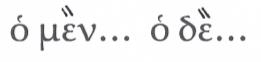

We thank Mr St. Alexandrou for access to the photograph.
xxxi Cf. the list of melodies from the manuscript Lavra Γ 67, fol. 159r: chap. 6,

section 2.1.

254

xxxii In Schwyzer (vol. I, p. 374), all the examples that we have taken for Figure 5.20 are in minuscule
script, except for the last. We changed the script from minuscule to majuscule in lines 2-5, since the use of capital letters
seems more likely to us, on the basis of the descriptions of the aforementioned philologist and of the
indication Pind.-Pap. in relation to the example φὶλὴσὶστέφανον.

255
