## Σύνοψη

Το παρόν κεφάλαιο εισάγει τον αναγνώστη στη μελέτη της παλαιοβυζαντινής σημειογραφίας (10ος-12ος αι.), ένα
κεφάλαιο μείζονος σημασίας για τη Βυζαντινή Μουσικολογία ειδικότερα και για τη Μουσικολογία γενικότερα,
καθώς για πρώτη φορά καταστρώνονται στη μουσική γραφή ευρεία στρώματα του παλαιού, κλασικού,
βυζαντινού μουσικού ρεπερτορίου - της Ars antiqua byzantina, η οποία θα αναδειχθεί σημείο αναφοράς όχι
μόνο για την ελληνική εκκλησιαστική μουσική, αλλά και για το λατινικό και το παλαιοσλαβικό χορικό.
Μετά από μια σύντομη αναφορά στους μεγάλους ερευνητές οι οποίοι διαμόρφωσαν τον τομέα της
συστηματικής μελέτης παλαιοβυζαντινής σημειογραφίας (J.-B. Thibaut, K. Φλώρος, Ο. Strunk, J. Raasted κ.ά.),
παρουσιάζονται πρώτα συνοπτικά, μετά και πιο αναλυτικά, οι δύο οικογένειες της παλαιοβυζαντινής
σημειογραφίας: αθωνική (Chartres) και αγιοπολίτικη (Coislin). Η μελέτη ξεκινάει με δείγματα
αντιπροσωπευτικών χειρογράφων των δύο σημειογραφικών οικογενειών και συνεχίζεται με τα παλαιότερα
θεωρητικά των μελωδικών σημειογραφιών. Πιο συγκεκριμένα, παρουσιάζεται η λίστα «μελωδημάτων» στο χρο
Λαύρα Γ 67, φ. 159α για την αθωνική σημειογραφία, και η αντίστοιχη λίστα σημαδιών από τον «Αγιοπολίτη»
για την ομώνυμη παρασημαντική. Κατόπιν προχωράμε σε μια συνολική θεώρηση των παλαιοβυζαντινών
σημειογραφιών και των επιμέρους εξελικτικών τους σταδίων, βάσει μελετών του Κ. Φλώρου. Το κεφάλαιο
ολοκληρώνεται με δείγματα διάφορων χειρογράφων με παλαιοβυζαντινή σημειογραφία και αντίστοιχες ασκήσεις
ανάγνωσης κειμένων και ταύτισης παλαιοβυζαντινών σημειογραφιών.

## Προαπαιτούμενη γνώση

Η μελέτη τω προηγούμενων κεφαλαίων (1-5) διευκολύνει κατά πολύ την κατανόηση του παρόντος κεφαλαίου.
Επίσης συστήνεται η μελέτη του εξής βιβλίου: Φλώρος, Κωνσταντίνος. (1998). Η ελληνική παράδοση στις
μουσικές γραφές του μεσαίωνα. Εισαγωγή στη Νευματική Επιστήμη. Μετφρ.-επιμ. Κώστας Κακαβελάκης, φιλολ.
επιμ. Ν. Αβραμόπουλος. Θεσσαλονίκη: Ζήτη.

## 1. Εισαγωγή

### 1.1. Προλεγόμενα, μελετητές, αρχαιότατοι κώδικες

Στο προηγούμενο κεφάλαιο, είδαμε διάφορες μουσικές σημειογραφίες κυρίως της πρώτης χριστιανικής
χιλιετίας, οι οποίες είχαν περιορισμένη διάδοση και διασώθηκαν ως επί το πλείστον αποσπασματικά.
Σε αντίθεση με τις αρχέγονες μορφές βυζαντινών μουσικών γραφών, η παλαιοβυζαντινή
σημειογραφία αποτελεί το πρώτο μεγάλο και συμπαγές γραφικό μουσικό σύστημα των Βυζαντινών, το οποίο
χρησιμοποιήθηκε για την καταγραφή τροπαρίων και ύμνων από τα τέλη της πρώτης χιλιετίας και μέχρι τα
τέλη του 12ου αιώνα.
Ανάμεσα στους αρχαιότερους κώδικες με παλαιοβυζαντινή σημειογραφία που διασώθηκαν μέχρι
σήμερα, αριθμούνται, μεταξύ άλλων, τα εξής χειρόγραφα:

- Τα Ειρμολόγια:

-  Λαύρας Β 32, περίπου από τα μέσα του 10ου αι. ("not earlier than 950": [Strunk, επιμ., 1966,

Specimina, Pars Suppletoria, σ. 11-13: 13]/β΄ μισό 10ου αι. [Floros, 1970, τ. Ι, σ. 63]), με 312 φύλλα,

-  Petropolitanus graecus 557, τέλη 10ου αι. (Floros, 1970, τ. Ι, σ. 64), με 16 φύλλα,

-  Εσφιγμένου 54, αρχές 11ου αι. (Floros, 1970, τ. Ι, σ. 64), με 139 φύλλα,

-  Πάτμου 55, αρχές 11ου αι. (Floros, 1970, τ. Ι, σ. 64), με 198 φύλλα,

- το Στιχηράριο Rizov F 1650k/op4/3, στα Κεντρικά Κρατικά Αρχεία στη Σόφια, τέλη 10ου αι. (βλ.

Atanasov, 2012, σ. 84).
H χρονολόγηση αυτών των χειρογράφων αποτελεί ένα δύσκολο εγχείρημα, καθώς είναι χωρίς
βιβλιογραφικό σημείωμα και οι παλαιοβυζαντινές σημειογραφίες παρουσιάζουν πολλές ιδιαιτερότητες, ειδικά
στα πρώτα στάδιά τους. Σύμφωνα με τον O. Strunk, η αρχαιότερη πηγή είναι το σπάραγμα Ειρμολογίου
Petrop. gr. 557, το οποίο έγινε γνωστό μέσα από σειρά πανομοιοτύπων στα Μνημεία εκφωνητικής και
αγιοπολίτικης σημειογραφίας της Ελληνικής Εκκλησίας του J.-B. Thibaut (1913, σ. 65-72 και πίν. vi-xxiii). O
Strunk επισημαίνει σχετικά με το προαναφερθέν σπάραγμα τα εξής: "Only a little later than the Codex

liturgicusi and perhaps our earliest source with musical notation is the tenth-century Heirmologion fragment
received from the Archimandrite Antonin (MS 557 [...]). Its priority is contested only by the Heirmologion
Patmos 55, to which the character of its notation intimately relates it; both sources are clearly earlier than their
nearest rival, the Heirmologion Laura B. 32."ii Σύμφωνα με τον Γκέρτσμαν (1996, τ. Ι, σ. 40-47 και πίν. 1-2),
το σπάραγμα Ειρμολογίου Αγ. Πετρουπόλεως 557 μπορεί να τοποθετηθεί χρονολογικά στο πρώτο μισό του
10ου αιώνα: βλ. Εικόνα 6.1.

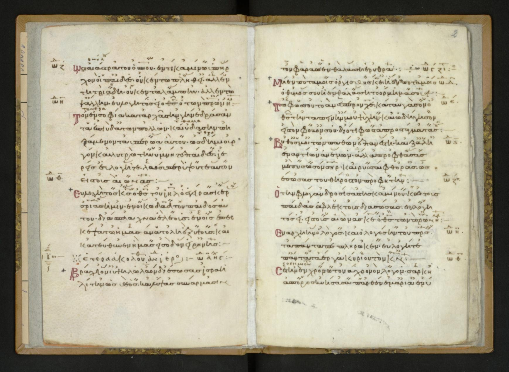

Εικόνα 6.1. Petropolitanus graecus 557, φ. 1β-2α. Σπάραγμα Ειρμολογίου, ένα από τα παλαιότερα χφα με παλαιοβυζαντινή παρασημαντική, αγιοπολίτικου τύπου (Coislin I
σύμφωνα με το Φλώρο, "archaic Coislin" σύμφωνα με τον Strunk).iii Προτεινόμενες χρονολογίες: 10ος αι.: Strunk / a΄ μισό 10ου αι.: Gertsman / τέλη 10ου αι.: Φλώρος. Στα
παρόντα φύλλα φαίνεται, από το κάτω μέρος του φ. 1β και μέχρι κάτω στο φ. 2α «Ι΄ ἑτέρα ἀκολουθ(ία) ἀνδ(ρέα) ἱερο(σολυμίτου):-ᾠδ(ὴ) α΄ ἦχ(ος) γ΄:- Βραχίονι
ὑψηλῷ». Πρόκειται για τη δεκάτη ακολουθία του γ΄ ήχου. Πριν απ' αυτήν φαίνονται οι ειρμοί της έβδομης μέχρι ενάτης ωδής της ενάτης ακολουθίας.iv

- © Εθνική Βιβλιοθήκη Ρωσίας, St. Petersburg. 258

To παλαιότερο χρονολογημένο χειρόγραφο που γνωρίζουμε σήμερα είναι το Στιχηράριο Petrop. gr.
789, του έτους 1106, το οποίο γράφηκε στην Ι.Μ. Βατοπαιδίου (βλ. Γκέρτσμαν, 1996, τ. Ι, σ. 54-55 και πίν. 5-
6, καθώς και Strunk, επιμ., 1966, Specimina, Pars Suppletoria, σ. 7):v βλ. Εικόνα 6.2.

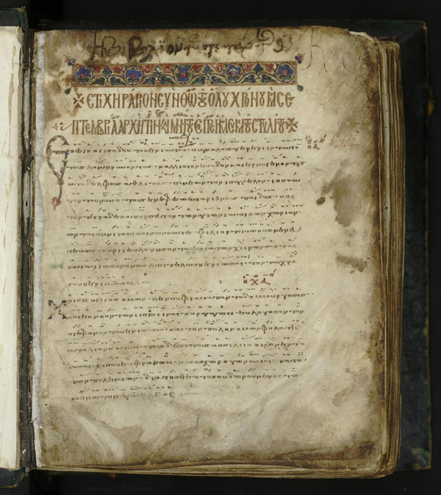

Εικόνα 6.2. Στιχηράριο Petropolitanum graecum 789 (νέος αριθμός: Русское археологическое общество No 1), φ. 1α.
To πρώτο χρονολογημένο χειρόγραφο βυζαντινής μουσικής, έτ. 1106. «† Στιχηράριον σὺν Θ(ε)ῷ τοῦ ὅλου χρόνου·
μὴν σεπτεμβρίου α΄, ἀρχὴ τῆς ἰν(δίκτου) καὶ μνήμ(η) τοῦ ὁσ(ίου) π(ατ)ρ(ὸ)ς ἡμῶ(ν) συμε(ὼν) τοῦ στυλίτου †».
Φαίνονται τα δύο πρώτα στιχηρά σε ήχο α΄: «Ἐπέστη ἡ εἴσοδος τοῦ ἐνιαυτοῦ» και «Χριστὲ ὁ Θεὸς ἡμῶν ὁ ἐν
σοφίᾳ».vi Παλαιοβυζαντινή σημειογραρία αγιοπολίτικη (Coislin V). © Εθνική Βιβλιοθήκη της Ρωσίας, St. Petersburg.

Από τους αρχαιότερους κώδικες μέχρι σήμερα, έχουμε πάνω από χίλια χρόνια αδιάκοπης χρήσης
βυζαντινής μουσικής γραφής, σε τεράστιο αριθμό χειρογράφων (ανάμεσα σε επτά και δέκα χιλιάδες) και
πληθώρα έντυπων εκδόσεων (από το έτος 1820 και μετά). Πρόκειται για μια μοναδική στην παγκόσμια
ιστορία της μουσικής πορεία, η οποία διακρίνεται από αργές, αλλά συνεχείς εξελίξεις, με αποτέλεσμα, η
σήμερα εν χρήσει γραφή της Νέας Μεθόδου να αποτελεί μια οργανική συνέχεια της παλαιοβυζαντινής και
μεσοβυζαντινής σημειογραφίας.
Η παλαιοβυζαντινή σημειογραφία, με την οποία μπορούμε να πάμε πίσω προς τις ρίζες του
υμνογραφικού-μουσικού ρεπερτορίου της ελληνικής Ψαλτικής Τέχνης, διαφωτίζοντας ταυτόχρονα και άλλες,
συγγενείς μουσικές παραδόσεις, κέντρισε το ενδιαφέρον διάφορων μελετητών από τις αρχές του 20ού αιώνα
μέχρι σήμερα. Αναφέρονται, ενδεικτικά, τα εξής πρόσωπα και έργα:

• J.-B. Thibaut, με το έργο του Μνημεία της εκφωνητικής και αγιοπολιτικής σημειογραφίας της

Ελληνικής Εκκλησίας (1913),

- Η.J.W. Tillyard, με διάφορα άρθρα για τα παλαιοβυζαντινά νεύματα (π.χ. 1937),

- Oliver Strunk, με τα μνημειώδη Specimina notationum antiquiorum (1966),

- Jørgen Raasted, με την έκδοση του παλαιοβυζαντινού Ειρμολογίου Σάββα 83 (1968),

- Gerda Wolfram, με την έκδοση του Sticherarium antiquum Vindobonense (1987),

- Κωνσταντίνος Φλώρος, με το μεγάλο ερευνητικό εγχείρημα της Παγκόσμιας/Καθολικής Νευματικής

Επιστήμης (1970), όπου συγκρίνονται παλαιοβυζαντινές, παλαιοσλαβικές και λατινικές μεσαιωνικές
σημειογραφίες μεταξύ τους,

• τα Πρακτικά των τριών συμποσίων αφιερωμένων στις παλαιοβυζαντινές σημειογραφίες, τα οποία

είαχαν πραγματοποιηθεί στο Κάστρο Χέρνεν της Ολλανδίας (Raasted & Troelsgård, επιμ., 1995.
Troelsgård & Wolfram, επιμ., 1999. Wolfram, επιμ., 2004),

• τα Πρακτικά των βυζαντινομουσικολογικών ανακοινώσεων του ΚΒ΄ Διεθνούς Συνεδρίου

Βυζαντινών Σπουδών στη Σόφια (Hannick, Troelsgård, Kujumdzieva & Harkov, επιμ., 2012).

### 1.2. Σημειογραφικά συστήματα, χρονολογικά πλαίσια και στάδια εξέλιξης των παλαιοβυζαντινών σημειογραφιών

Ήδη στο αρχαϊκό στάδιό της, στο Ειρμολόγιο Λαύρα Β 32, η παλαιοβυζαντινή σημειογραφία εμφανίζεται σε
δύο παραπλήσιες μορφές, οι οποίες αναγνωρίστηκαν ως δύο οικογένειες ή θυγατρικά συστήματα μιας ίδιας -
σήμερα ακόμα αναζητούμενης - αρχέτυπης παλαιοβυζαντινής παρασημαντικής. Η μία οικογένεια επικράτησε
να ονομάζεται Chartres (Σαρτρ), η άλλη Coislin (Κοαλέν). Τα αντίστοιχα ελληνικά ονόματα είναι:
σημειογραφία αθωνική και αγιοπολίτικη. Τα προαναφερθέντα γαλλικά ονόματα συσχετίζονται, το κάθε ένα,
με αντιπροσωπευτικό χειρόγραφο από συλλογές γαλλικών βιβλιοθηκών, ενώ τα ελληνικά ονόματα
προσδιορίζουν τις γεωγραφικές ζώνες όπου πιθανότατα εξελίχθηκαν στην αρχή οι δύο νευματικές
οικογένειες: Άγιον Όρος και Ιεροσόλυμα-Άγιοι Τόποι, ανστίστοιχα.vii Επιπλέον, συγκριτικές μελέτες ανάμεσα
στην εκφωνητική και την παλαιοβυζαντινή σημειογραφία ανέδειξαν τη στενή σχέση ανάμεσα στα δύο είδη
μουσικών γραφών (13 κοινά σημάδια, σύμφωνα με τον Κ. Φλώρο).viii
Ο παρακάτω Πίνακας 6.1 παρουσιάζει μια γενική επισκόπηση των δύο παλαιοβυζαντινών
νευματικών συστημάτων:

|Παλαιοβυζαντινή σημειογραφία (πβ), ή  Χρονολογικά όρια: 10ος αι. - τέλη 12ου αι.  Κύρια χαρακτηριστικά: • Αδιαστηματική σημειογραφία: δεν δείχνει με οξεία δείχνει μία, δύο ή τρεις φωνές προς τα πάνω). • Πολύ υψηλό επίπεδο στενογραφικότητας - μουσικές πληροφορίες, στο πλαίσιο πολύ δυνατής αποκωδικοποίηση της γραφής.  Νευματικές οικογένειες: Με κοινή ρίζα (μια αρχέτυπη συγγενή σημειογραφικά συστήματα, τα οποία Κάποια βασικά στοιχεία των δύο σημειογραφικών|βυζαντινή σημειογραφία» (Γρ. Στάθης): την ποσότητα των διαστημάτων (δεν ξέρουμε δηλ. εάν η σημειογραφία: καταγράφονται μόνο επιλεκτικά οι παράδοσης, η οποία εξασφαλίζει τη σωστή σημειογραφία), εξελίσσονται παράλληλα δύο αρκετά κοινά σημάδια, αλλά και μερικές βασικές διαφορές. αναφέρονται επιγραμματικά παρακάτω:|
|---|---|
|1. Αγιοπολίτικη/Coislin σημειογραφία|2. Αθωνική/Chartres σημειογραφία|
|• Γαλλικό όνομα των|συστημάτων:|
|Με βάση το Ειρμολόγιο αρ. 220 της συλλογής Coislin της Εθνικής Γαλλικής Βιβλιοθήκης (Bibliothèque nationale de France).|Με βάση μερικά φύλλα του Στιχηραρίου Λαύρας Γ 67, που φυλάγονταν μέχρι το Β΄ Παγκόσμιο Πόλεμο (1944) στη Βιβλιοθήκη Νομού Σαρτρ (Bibliothèque Municipale de Chartres).|
|• Γεωγραφική||
|Συνδυάζεται ιδιαίτερα με τους Αγίους Τόπους, αλλά διαδίδεται και ευρύτερα στη βυζαντινή επικράτεια. Αποτελεί τη ρίζα για τη λεγόμενη «σηματική σημειογραφία» των Σλάβων (Φλώρος).|Συνδυάζεται ιδιαίτερα με το Άγιον Όρος και την Κωνσταντινούπολη, αλλά διαδίδεται και ευρύτερα στη βυζαντινή επικράτεια. Αποτελεί τη ρίζα για την παλαιοσλαβική λεγόμενη|
|• Κυριότερα|και ιστορική σημασία:|
|- Σημειογραφία πιο λιτή, στηριγμένη σε πέντε βασικά σημάδια (οξεία, πεταστή, βαρεία, κλάσμα, απόστροφος) και τους πολλαπλούς συνδυασμούς τους. - Απ' αυτό το σημειογραφικό σύστημα κυρίως θα εξελιχθεί, κατά το 12ο αιώνα, η μεσοβυζαντινή σημειογραφία, πρόγονος της νυν εν χρήσει μουσικής παρασημαντικής.|- Σημειογραφία πιο περίπλοκη, με πολλά σύνθετα σημάδια, υψηλού στενογραφικού επιπέδου κωδικοποίησης. - Κυρίως απ' αυτό το σημειογραφικό σύστημα θα αντλήσουν κατά την εποχή της Καλοφωνίας, ιδίως το 14ο- 15ο αιώνα, οι μαΐστορες αρκετά από τα λεγόμενα μεγάλα σημάδια, για να εμπλουτίσουν τη μεσοβυζαντινή σημειογραφία.|
|||
| Σύμφωνα με τον O. Strunk: Coislin αρχαϊκή, σχετικά και πλήρως εξελιγμένη.  Σύμφωνα με τον Κ. Φλώρο: Coislin I-VI.| Σύμφωνα με τον O. Strunk: Chartres αρχαϊκή, ενδιάμεση, σχετικά και πλήρως εξελιγμένη.  Σύμφωνα με τον Κ. Φλώρο: Chartres I-IV.|
|- Οι τέσσερις πρώτες εξελικτικές φάσεις των δύο αιώνα όμως αρχίζει και επικρατεί περισσότερο η αθωνική σημειογραφία αρχίζει και πέφτει σε δυσχρηστία. - H συγκριτική μελέτη των επιμέρους φάσεων της Coislin IV, και ιδιαίτερα κατά τις φάσεις Coislin V και σταθερά βήματα προς τη διαμόρφωση της διαστηματικής Floros και A. Doda). - Εκτός από τις δύο οικογένειες Chartres και Coislin, με στοιχεία τόσο από τη μία όσο και από την άλλη|συστημάτων, πορεύουν παράλληλα. Κατά τον 11ο σημειογραφία και περίπου στα μέσα του 11ου αιώνα η σημειογραφίας δείχνει ότι, τουλάχιστον από το η εξελικτική πορεία της σημειογραφίας κατευθύνεται με των φωνητικών της σημαδιών (σύμφωνα με τους C. και δείγματα μεικτής παλαιοβυζαντινής σημειογραφίας, οικογένεια.|

Πίνακας 6.1. Παλαιοβυζαντινές σημειογραφίες με μια συνοπτική ματιά.ix

Στις Εικόνες 6.3-17 υπάρχουν διάφορα δείγματα των εξελικτικών σταδίων της παλαιοβυζαντινής
σημειογραφίας. Για περισσότερες εικόνες με χφα σε παλαιοβυζαντινή σημειογραφία, ο αναγνώστης μπορεί να
συμβουλευθεί τις πανομοιότυπες εκδόσεις στη σειρά Monumenta Musicae Byzantinae, Facsimiles (τ. VII-X,
σε επιμέλεια των Strunk [1966], Raasted [1968], Strunk & Follieri [1975] και Wolfram [1987]), Floros (1970,

τ. III) και Παπαθανασίου (2002, πίν. 16-22), Strunk (1977c, για τα περίφημα Μηναία του 11ου αι. από την

1. S. Elia di Carbone: χφα Κρυπτοφέρρης Δ.α.xiii-xvii και Biblioteca Vallicelliana στη Ρώμη, αρ. Ε.55 με

αρχαϊκή παλαιοβυζαντινή σημειογραφία), π. Thibaut (1913, σ. 73-83), Père Petresco (1932, πίνακες Ι-XX,
XXVI-XXVIII, με χφα από τις βιβλιοθήκες της Κρυπτοφέρρης και των Παρισίων BnF), Atanasov (2012, για
χφα της Αχρίδας, Σόφιας κ.ά.), Bucca (2011, με χφα της Κάτω Ιταλίας. Βλ. και άρθρο της ίδιας υπό έκδοση,
με σημαντικές αναφορές στις απαρχές της παλαιοβυζαντινής σημειογραφίας), Πατρώνας (2016) κ.ά.x

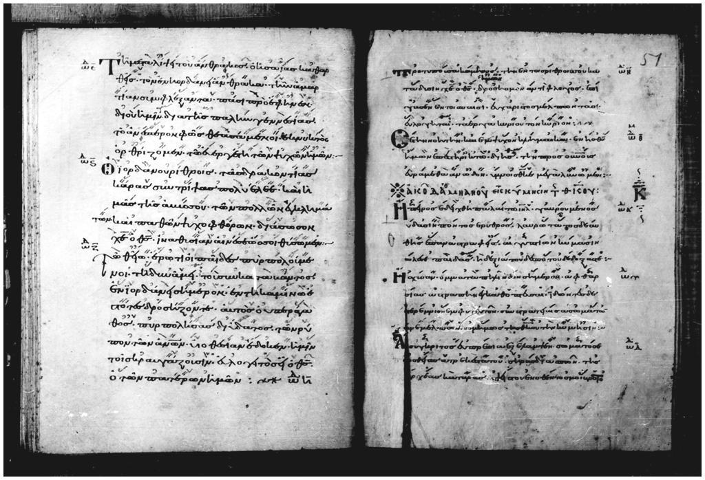

Εικόνα 6.3. Το Ειρμολόγιο της Ιεράς Μονής Μεγίστης Λαύρας του Αγίου Όρους, αρ. χφου Β 32, μέσα 10ου αι. (Strunk), με αρχαϊκή παλαιοβυζαντινή σημειογραφία αθωνικού
τύπου (Chartres Ι, σύμφωνα με το Φλώρο: αριστερά, φ. 50β) και αγιοπολίτικου τύπου (Coislin Ι, σύμφωνα με το Φλώρο: δεξιά, φ. 51α). To παρόν χφο είναι ένας από τους
παλαιότερους κώδικες βυζαντινής μουσικής που γνωρίζουμε σήμερα.xi © για τη φωτογραφία από μικροταινία: Πατριαρχικό Ίδρυμα Πατερικών Μελετών, Θεσσαλονίκη.

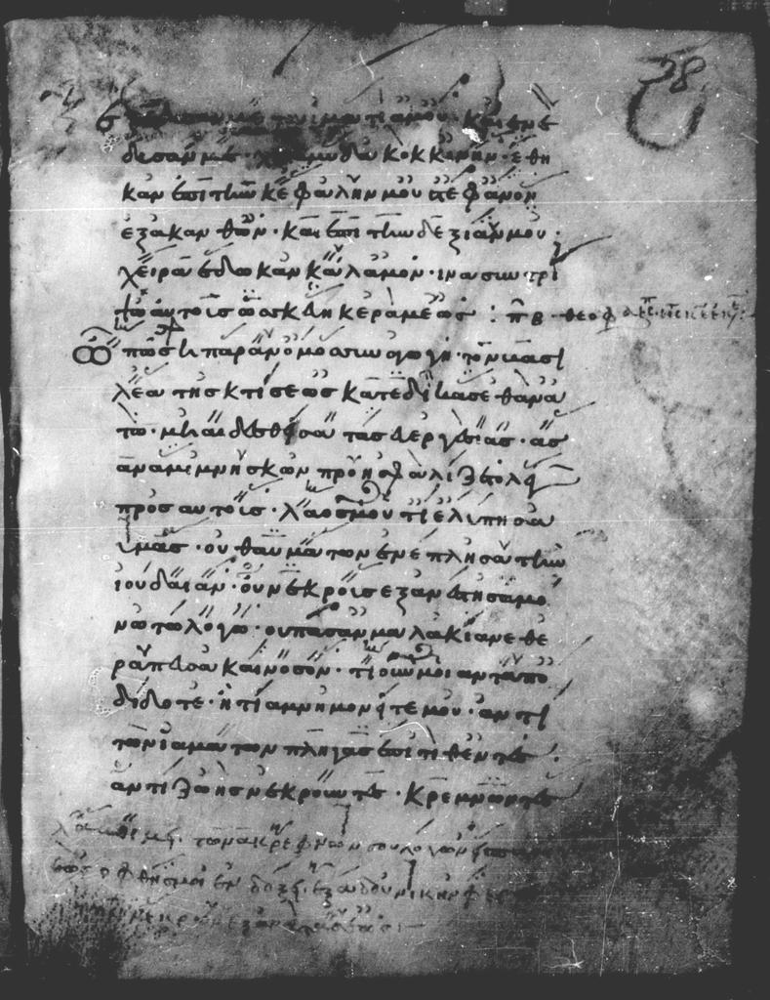
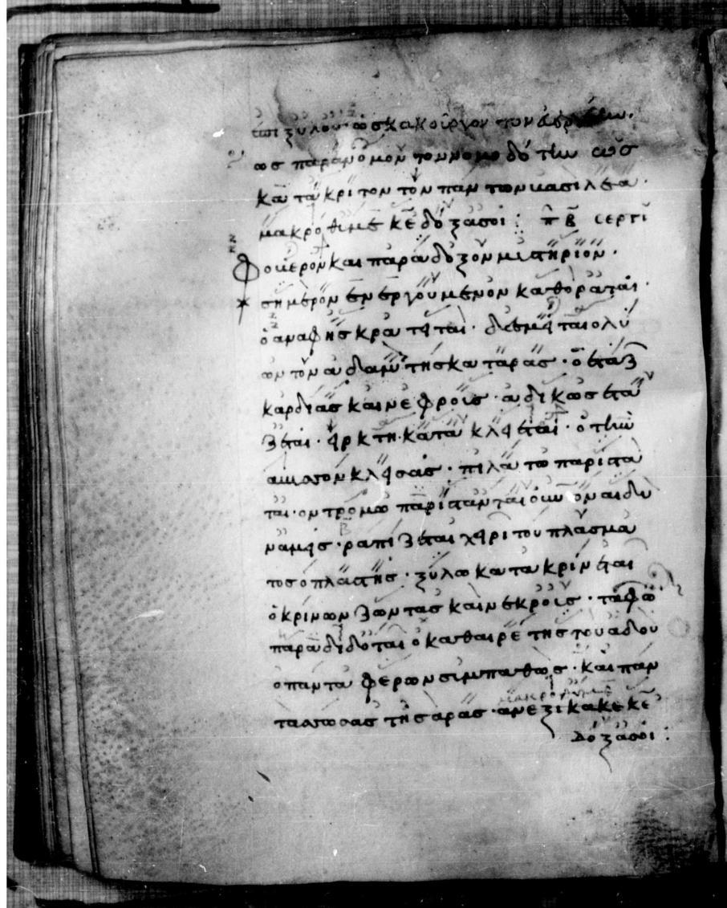

Εικόνες 6.4.α-β. Το Στιχηράριο Laurense Γ 12 της Ιεράς Μονής Μεγίστης Λαύρας του Αγίου Όρους, 10ος αι. (Strunk, Raasted) / αρχές 11ου αι. (Floros), φ. 38α-β, με στιχηρά
της Μεγάλης Παρασκευής σε παλαιοβυζαντινή αθωνική σημειογραφία (Chartres II).xii © για τη φωτογραφία από μικροταινία: Πατριαρχικό Ίδρυμα Πατερικών Μελετών,
Θεσσαλονίκη.

.

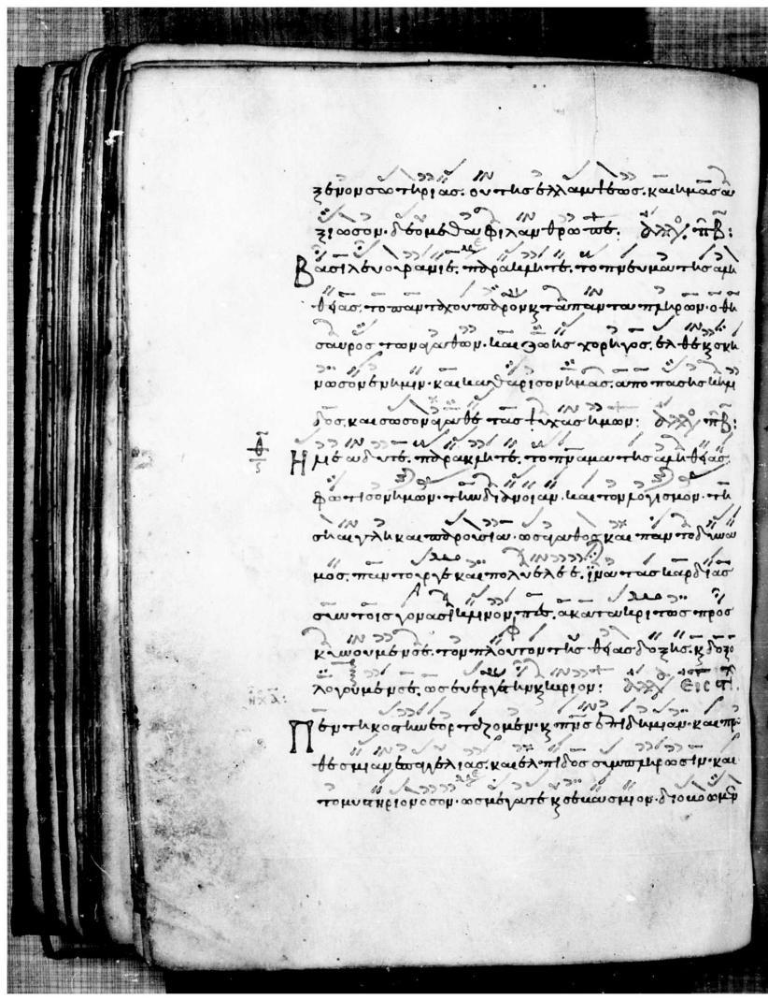
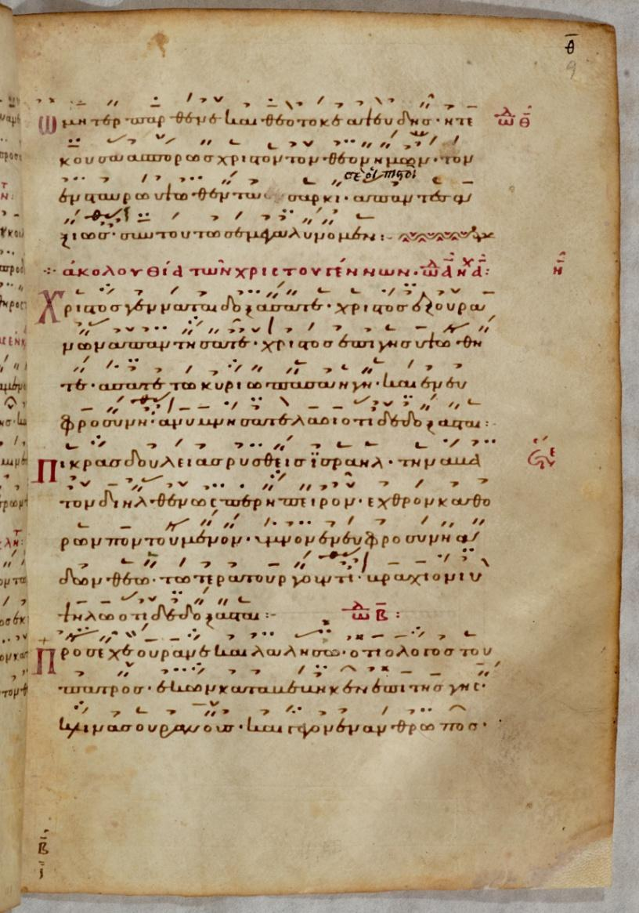

Εικόνες 6.5-6. Τα δύο χειρόγραφα στα οποία οφείλονται οι ονομασίες Chartres και Coislin για τον προσδιορισμό των δύο οικογενειών της παλαιοβυζαντινής
σημειογραφίας. Αριστερά: Στιχηράριο Laurense Γ 67, από την Ιερά Μονή Μεγίστης Λαύρας του Αγίου Όρους, αρχές 11ου αι., σε παλαιοβυζαντινή αθωνική σημειγραφία,
Chartres III (Floros, 1970, τ. Ι, σ. 53-54), φ. 96β, με το «Βασιλεῦ οὐράνιε» και άλλα στιχηρά της Πεντηκοστής. © για τη φωτογραφία από μικροταινία: Πατριαρχικό Ίδρυμα
Πατερικών Μελετών, Θεσσαλονίκη.  Δεξιά: Ειρμολόγιο Coislin 220, από την Εθνική Βιβλιοθήκη της Γαλλίας, αρχές 12ου αι., σε παλαιοβυζαντινή αγιοπολίτικη σημειγραφία,
μεταξύ Coislin V-VI (Floros, 1970, τ. Ι, σ. 65-66), φ. 9α, με Ακολουθία των Χριστουγέννων, ήχος α΄.xiii © Bibliothèque nationale de France.

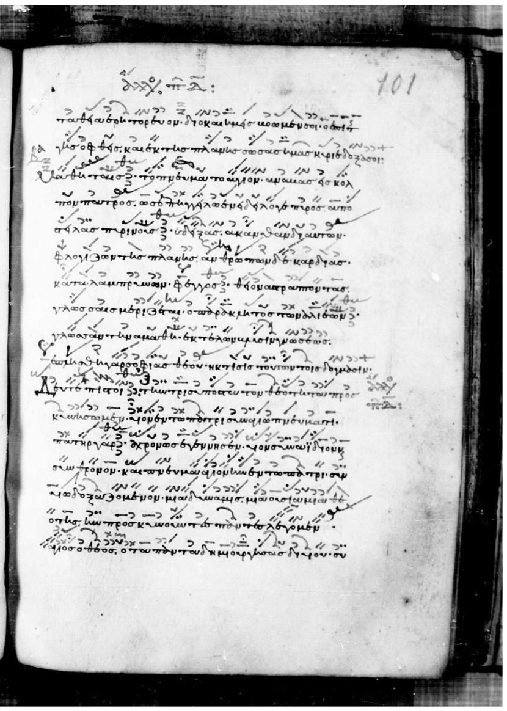
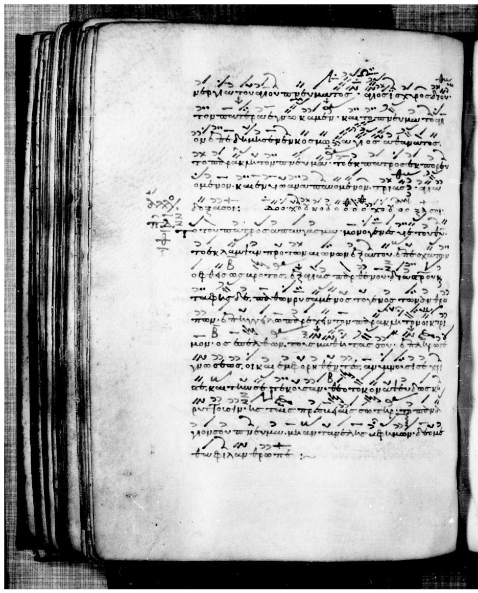

Εικόνες 6.7.α-β. To Στιχηράριο Λαύρας Γ 67, φ. 101α-β, σε παλαιοβυζαντινή μεικτή σημειογραφία (Coislin III + σημάδια της Chartres), με το περίφημο στιχηρό του Λέοντος
ΣΤ' του Σοφού, «Δεῦτε πιστοί, τὴν τρισυπόστατον θεότητα προσκυνήσωμεν», σε ήχο πλ. δ΄, για την Πεντηκοστή. 'Όπως παρατηρεί ο Φλώρος, το «δόξα σοί» στο τέλος
του στιχηρού εμφανίζεται σε δύο εκδοχές: πρώτα σε παλαιό στιχηραρικό στυλ, και μετέπειτα σε ασματικό στυλ, σε πολύ μελισματική μορφή.xiv © για τη φωτογραφία από
μικροταινία: Πατριαρχικό Ίδρυμα Πατερικών Μελετών, Θεσσαλονίκη.
266

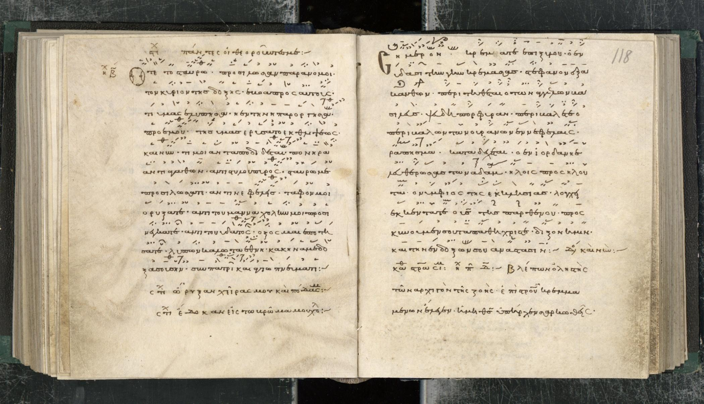

Εικόνα 6.8. To Τριώδιο Vatopedense 1488, α΄ μισό 11ου αι. (Strunk)xv / β΄ μισό 11ου αι. (Floros), φ. 117β-118α, με τα δύο τελευταία στιχηρά των Μεγάλων Ωρών της Μεγάλης
Παρασκευής. Αριστερά: «Ὅτε τῷ σταυρῷ», σε παλαιοβυζαντινή αγιοπολίτικη σημειογραφία, Coislin V. Δεξιά: «Σήμερον κρεμᾶται», σε παλαιοβυζαντινή αθωνική
σημειογραφία, Chartres IV (Floros, 1970, τ. Ι, σ. 55-56, 309-310 και τ. III, εικ. 51-52). © Ιερά Μεγίστη Μονή Βατοπαιδίου, Άγιον Όρος. Για την πανομοιότυπη έκδοση
ολόκληρου του χφου στη σειρά των Monumenta Musicae Byzantinae, βλ. Follieri & Strunk (επιμ., 1975).

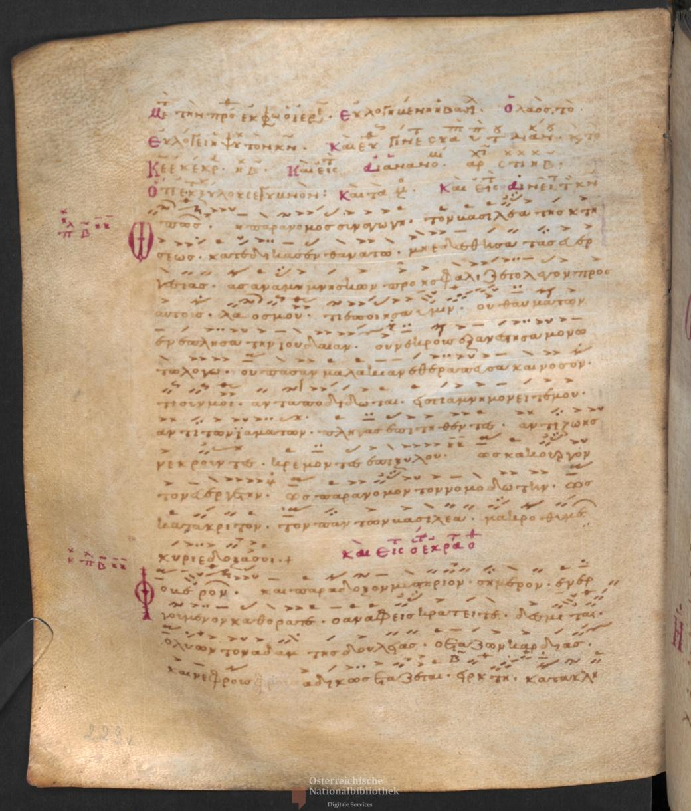
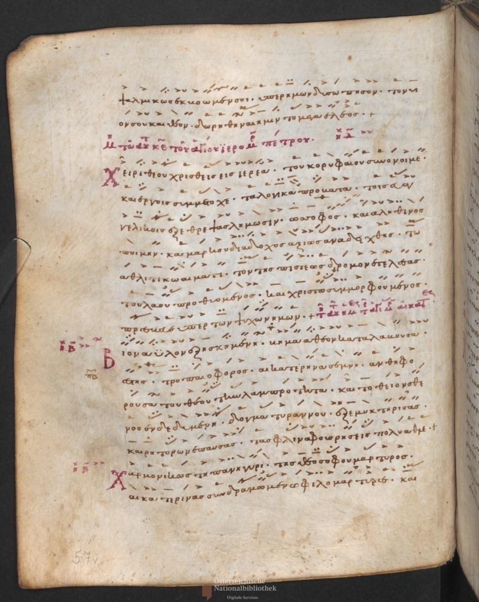

Εικόνες 6.9-10. To Sticherarium Antiquum Vindobonense (Codex Vindobonensis theologicus graecus 136), α΄ μισό 12ου αι. (Wolfram), σε παλαιοβυζαντινή αγιοπολίτικη
σημειογραφία, Coislin V (Floros, 1970, τ. Ι, σ. 57-58). Αριστερά: φ. 57β, με στιχηρά εις τιμήν των Αγίων Πέτρου Ιερομάρτυρος και Αικατερίνης της Μεγαλομάρτυρος, 25
Νοεμβρίου.  Δεξιά: φ. 229β, με στιχηρά της Μεγάλης Παρασκευής (βλ. και Floros, 1970, τ. Ι, σ. 55-56, 309-310 και τ. III, εικ. 51-52). © Österreichische Nationalbibliothek,
Wien. Για την πανομοιότυπη έκδοση ολόκληρου του χφου στη σειρά των Monumenta Musicae Byzantinae, βλ. Wolfram (επιμ., 1987).

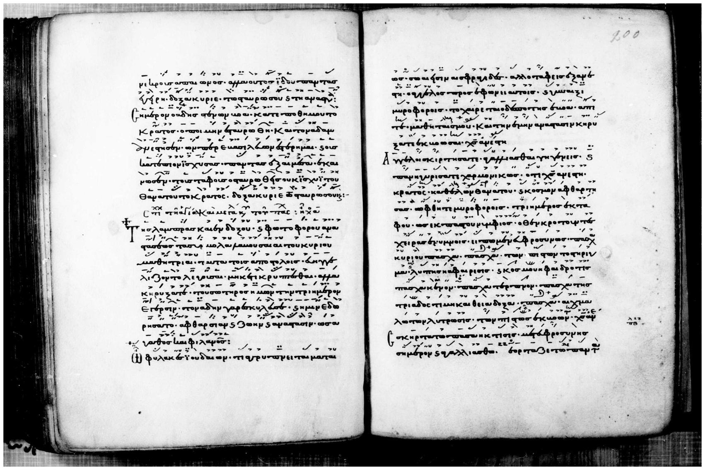

Εικόνα 6.11. Το Στιχηράριο Laurense Δ. 28, της Ιεράς Μονής Μεγίστης Λαύρας του Αγίου Όρους, αρχές 12ου αι. (Floros), στα τελευταία εξελικτικά στάδια της
παλαιοβυζαντινής σημειογραφίας: αριστερά, φ. 199β, σε αγιοπολίτικη (Coislin VI) και δεξιά, φ. 200α, σε αθωνική (Chartres IV).xvi © για τη φωτογραφία από μικροταινία:
Πατριαρχικό Ίδρυμα Πατερικών Μελετών, Θεσσαλονίκη.

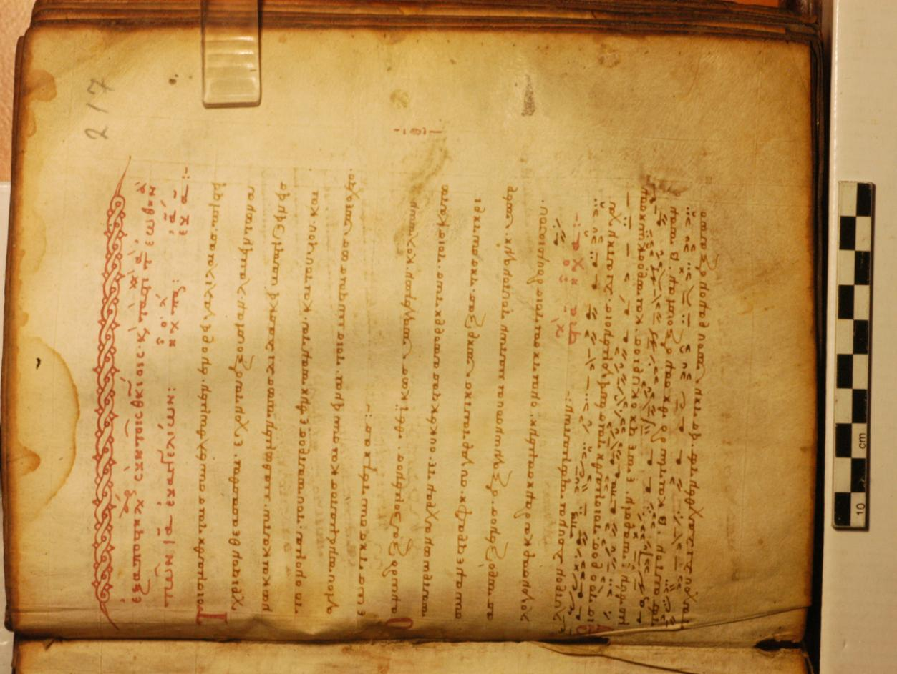
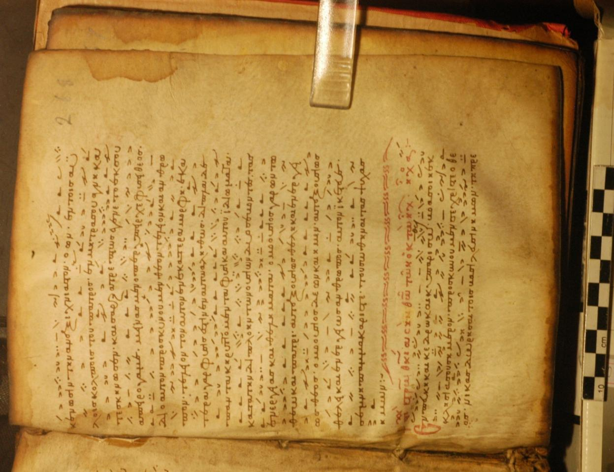

Εικόνες 6.12-13. Το Στιχηράριο της Ι.Μ. Καρακάλλου, αρ. 1536/23 (Λάμπρου) / αρ. 74 (Στάθη), τέλη 12ου αι., φ. 217α (αριστερά) με εξαποστειλάρια και αρχή των εωθινών,
και 268α (δεξιά), με την αρχή σταυροθεοτοκίων, σε αγιοπολίτικη σημειογραφία (Coislin VI).xvii © Ιερά Μονή Καρακάλλου, Άγιον Όρος.

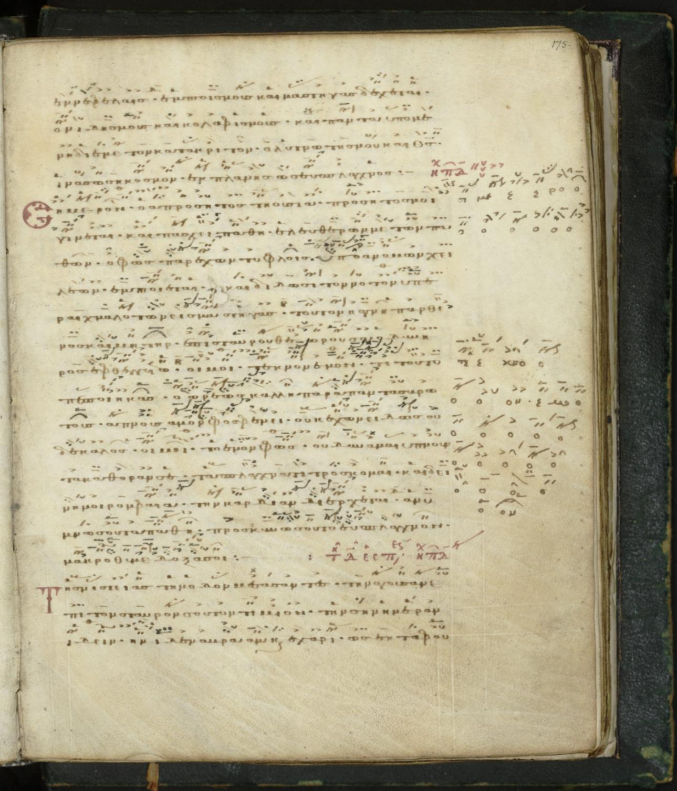

Εικόνα 6.14. Στιχηράριο Petropolitanum graecum 789 (νέος αριθμός: Русское археологическое общество No 1), φ

175α. To πρώτο χρονολογημένο χειρόγραφο βυζαντινής μουσικής, έτ. 1106. Στην παρούσα εικόνα φαίνονται τρία στιχηρά
της Σταυροπροσκυνήσεως: 1. Το τέλος του στιχηρού «Σήμερον ὁ δεσπότης τῆς κτίσεως», σε ήχο πλ. δ΄ νανα, σε
παλαιοβυζαντινή σημειογραφία αγιοπολίτικη (Coislin V). 2. Έπεται το στιχηρό «Σήμερον ὁ ἀπρόσιτος τῇ οὐσίᾳ
προσιτός μοι γίνεται», σε ήχο πλ. δ΄, σε μελισματική υφή. Φαίνεται ότι πάνω σε μια απλούστερη μορφή του στιχηρού
έχει γίνει μια επεξεργασία προς το μελισματικότερο, μαζί με μια επικαιροποίηση (modernization) της σημειογραφίας, με
επέμβαση από δεύτερο, λίγο μεταγενέστερο χέρι (μέσα-β΄ μισό 12ου αι.;), και με τη χρήση μαύρης μελάνης (Coislin VI). Στη
δεξιά ώα προστέθηκαν αργότερα (13ος αι;), σε μεσοβυζαντινή γραφή τα κώλα «Σήμερον» και «τέκνον· ἐμόν» (οδυρμός
της Παναγίας κάτω από το Σταυρό).xviii Τα δύο προαναφερθέντα στιχηρά είναι περίφημα ποιήματα του Λέοντος ΣΤ΄ του
Σοφού.xix 3. Τέλος, στο κάτω μέρος του φύλλου βρίσκεται η αρχή του στιχηρού «Τῆς νηστείας τὴν ὁδὸν μεσάσαντες»,
σε ήχο πλ. δ΄, για την Τετάρτη εσπέρας της δ΄ εβδομάδας της Μεγάλης Τεσσαρακοστής (Coislin V). © Εθνική Βιβλιοθήκη
της Ρωσίας, St. Petersburg.

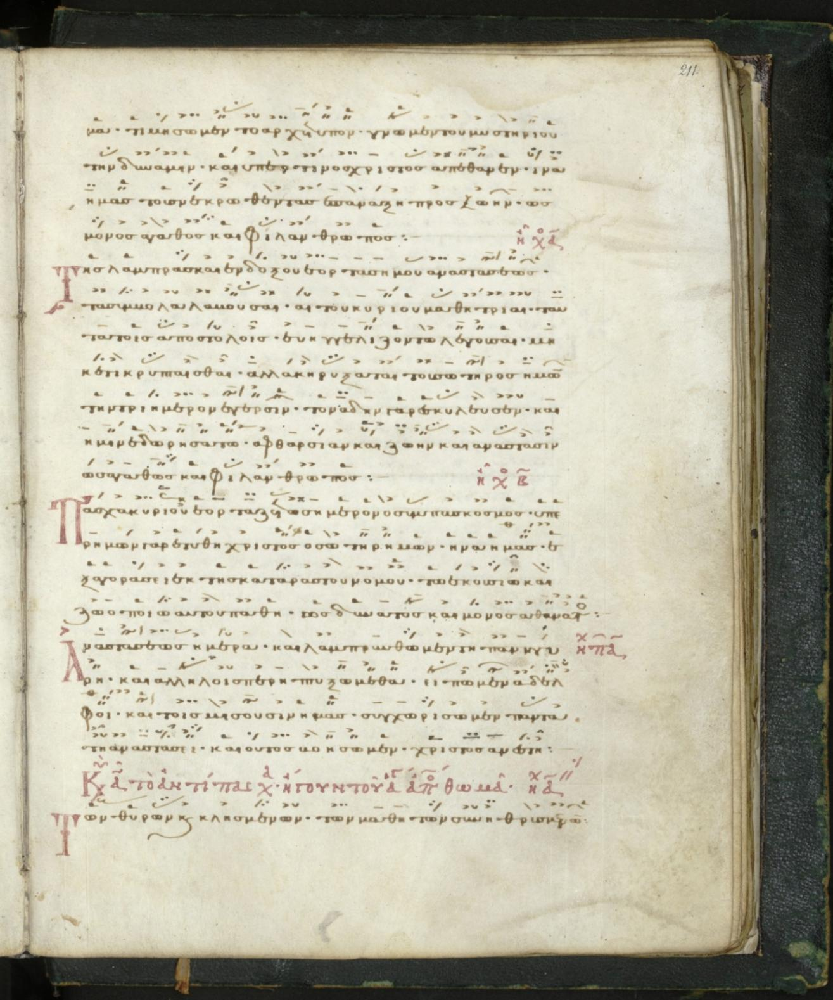

Εικόνα 6.15. Στιχηράριο Petropolitanum graecum 789 (νέος αριθμός: Русское археологическое общество No 1), φ

211α. To πρώτο χρονολογημένο χειρόγραφο βυζαντινής μουσικής, έτ. 1106. Παλαιοβυζαντινή σημειογραφία αγιοπολίτικη
(Coislin V). Στιχηρά της Κυριακής του Πάσχα: 1. τέλος του στιχηρού «Ἀναστάσεως ἡμέρα καρποφορήσωμεν
ἑαυτούς», σε ήχο α΄, 2. «Τῆς λαμπρᾶς καὶ ἐνδόξου ἑορτασίμου ἀναστάσεως», ήχος α΄, 3. «Πάσχα Κυρίου
ἑορταζέτω σήμερον ὁ σύμπας κόσμος», ήχος β΄, και 4. «Ἀναστάσεως ἡμέρα καὶ λαμπρυνθῶμεν τῇ
πανηγύρει», ήχος πλ. α. Έπεται η αρχή του στιχηρού «Τῶν θυρῶν κεκλεισμένων», μετά τον ερυθρόγραφο τίτλο:
«Κυ(ριακὴ) α' τὸ Ἀντίπασχα· ἤγουν τοῦ ἁγ(ίου) ἀπο(στόλου) Θωμᾶ· ἦχ(ος) α΄». Από τα τέσσερα προαναφερθέντα
στιχηρά του Πάσχα, μόνο το τέταρτο έμεινε σε λειτουργική χρήση.xx

© Εθνική Βιβλιοθήκη της Ρωσίας, St. Petersburg.

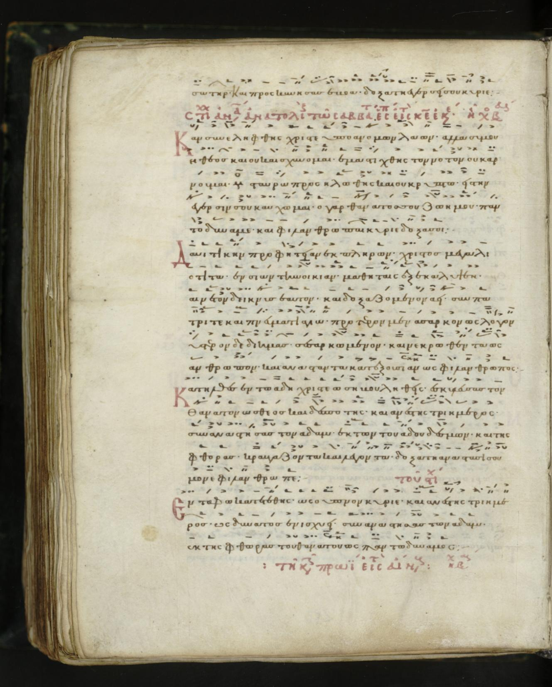

Εικόνα 6.16. Στιχηράριο Petropolitanum graecum 789 (νέος αριθμός: Русское археологическое общество No 1), φ.
250β. To πρώτο χρονολογημένο χειρόγραφο βυζαντινής μουσικής, έτ. 1106. Παλαιοβυζαντινή σημειογραφία αγιοπολίτικη
(Coislin V), με μερικές συμπληρώσεις/διορθώσεις σε πιο σκούρο μελάνι (Coislin VI). Περιέχονται «Στιχ(ηρὰ)
ἀνα(στάσιμα) ἀνατολι(κὰ) τῷ σαββάτ(ῳ) ἑσπ(έρας) εἰς τ(ὸ) κ(ύρι)ε ἐκέ(κραξα)· ἦχο(ς) βαρ(ύς)»: «Κἂν
συνελήφθης Χριστὲ ὑπὸ ἀνόμων ἀνδρῶν», «Δαυιτικὴν προφητείαν ἐκπληρῶν», «Κατῆλθες ἐν τῷ ᾅδῃ
Χριστέ».xxi Έπονται η ερυθρόγραφη ένδειξη «τοῦ στίχ(ου)» και το ανατολικό «Ἐν τάφῳ κατετέθης ὡς ὁ ὑπνῶν».xxii
Στην κάτω ώα η ρουμπρίκα: «τῇ κυ(ριακῇ) πρωῒ εἰς τ(οὺς) αἴν(ους): ἦχ(ος) βαρ(ύς)». © Εθνική Βιβλιοθήκη της
Ρωσίας, St. Petersburg.

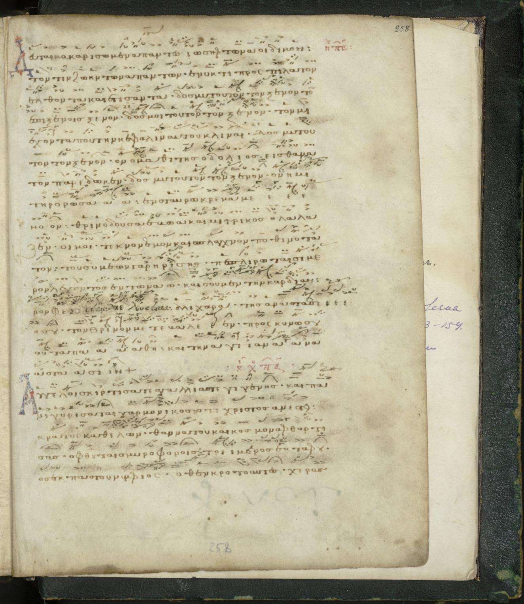

Εικόνα 6.17. Στιχηράριο Petropolitanum graecum 789 (νέος αριθμός: Русское археологическое общество No 1), φ.
258α. To πρώτο χρονολογημένο χειρόγραφο βυζαντινής μουσικής, έτ. 1106. Δύο περίφημα στιχηρά με υψηλό επίπεδο
μελισματικότητας, τα οποία μπορούν να περιγραφούν ως εκδοχές «με επιρροή από το στυλ του Ψαλτικού» (Floros):
«Δεῦτε μακαρίσωμεν πάντες Ἰωσὴφ τὸν ἀοίδιμον», σε ήχο πλ. β΄, για το Μέγα Σάββατο, και «Ἄγγελοι
σκιρτήσατε», σε πλ. α΄, για το Πάσχα.xxiii Παλαιοβυζαντινή σημειογραφία αγιοπολίτικη (Coislin V-VI), με διάφορα
σημάδια του Ψαλτικού. Στο πρώτο στιχηρό διακρίνονται πολλά σβησίματα και διορθώσεις με μαύρο μελάνι.

© Εθνική Βιβλιοθήκη της Ρωσίας, St. Petersburg.

## 2. Θεωρητικά των παλαιοβυζαντινών σημειογραφιών

Η μελέτη των δύο παλαιοβυζαντινών νευματικών συστημάτων θα ήταν εξαιρετικά δύσκολη, εάν δεν θα
μπορούσαμε να συμβουλευθούμε, δίπλα στις πρακτικές πηγές (μουσικά χειρόγραφα), και αντίστοιχα
μουσικοθεωρητικά στοιχεία της ίδιας περιόδου (10ος-12ος αιώνας). Ευτυχώς, τόσο για την αθωνική όσο και
για την αγιοπολίτικη σημειογραφία, διασώθηκαν θεωρητικά στοιχεία, τα οποία μας επιτρέπουν σήμερα, να
ταυτίσουμε πολλά από τα παλαιοβυζαντινά σημάδια, να ανιχνεύσουμε τις απαρχές της βυζαντινής οκταηχίας
και, γενικότερα, να αφουγκραστούμε τις πρώτες εξελίξεις του μουσικοθεωρητικού στοχασμού γύρω από την

Ψαλτική Τέχνη. Τα δύο θεωρητικά είναι τα εξής:

• Λίστα νευμάτων στο Στιχηράριον Λαύρας Γ 67, φ. 159α, με την επιγραφή: Σὺν Θεῷ ἀρχαὶ

τῶν μελῳδημάτων (αρχές 11ου αι. [Φλώρος]): σημειογραφία αθωνική (Chartres III),xxiv

• Ἁγιοπολίτης (χρονολογία σύνταξης: 12ος αι., με μεταγενέστερες επεξεργασίες): σημειογραφία

αγιοπολίτικη (Coislin).xxv
Παρακάτω θα δούμε τα σύνολα παλαιοβυζαντινών σημαδιών ή/και θέσεων (μελωδικών φορμουλών),
τα οποία αναφέρονται στα δύο θεωρητικά.

### 2.1. Αθωνική σημειογραφία (Chartres)

Ξεκινάμε διαβάζοντας την περίφημη λίστα, η οποία βρίσκεται στο τέλος του Στιχηραρίου Λαύρας Γ 67, ενός
κώδικα ο οποίος περιέχει στιχηρά του Τριωδίου, Πεντηκοσταρίου και της Οκτωήχου. Το στιχηραρικό
ρεπερτόριο αυτού του χειρογράφου, το οποίο πιθανότατα προέρχεται από την Κωνσταντινούπολη, περικλείει,
μεταξύ άλλων, τουλάχιστον 41 στιχηρά του βασιλιά Λέοντος ΣΤ΄ του Σοφού (886-912, Εικόνα 6.18), καθώς
και μερικές συνθέσεις (στιχηρά και εξαποστειλάρια) του γιού του, Κωνσταντίνου Ζ΄ του Πορφυρογεννήτου

(913-959), γεγονός το οποίο οδήγησε τον Κ. Φλώρο να ονομάσει το συγκεκριμένο χειρόγραφο «κώδικα

βασιλικό».xxvi

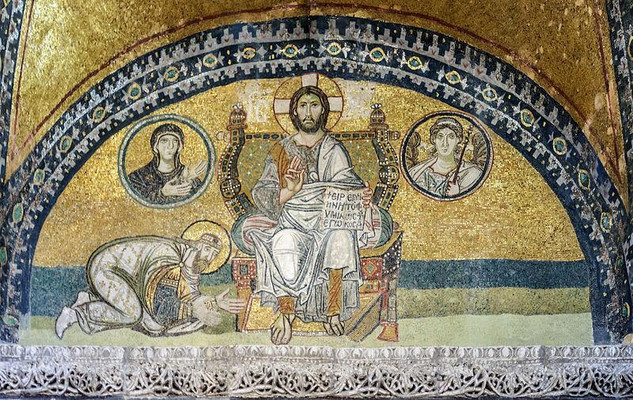

Εικόνα 6.18. Ο αυτοκράτωρ Λέων ΣΤ΄ ο Σοφός, προσκυνώντας τον Κύριο Ιησού Χριστό Παντοκράτορα. Αριστερά και δεξιά, η Υπεραγία
Θεοτόκος και ο Αρχάγγελος Γαβριήλ. Ψηφιδωτό πάνω από τις βασιλικές πύλες της Αγίας Σοφίας, Κωνσταντινούπολη, περ. έτ. 912.
Πηγή: <https://commons.wikimedia.org/wiki/File:Hagia_Sophia_Imperial_Gate_mosaic_2.jpg> (14.9.2016).xxvii

Η προαναφερθείσα λίστα νευμάτων, η οποία ανακαλύφτηκε από τον Tillyard το 1912, αποτελεί το
παλαιότερο θεωρητικό των βυζαντινών μελωδικών σημειογραφιών (βλ. Εικόνα 6.19).

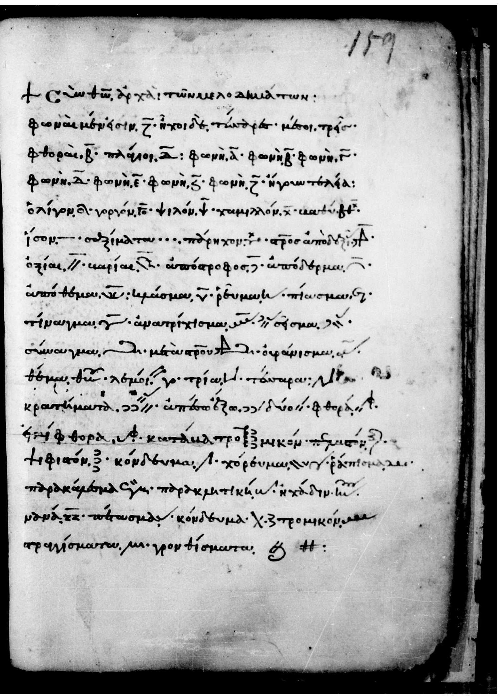

Εικόνα 6.19. Τα «μελωδήματα» της αθωνικής παλαιοβυζαντινής σημειογραφίας: Η περίφημη λίστα από το Στιχηράριο

Ι.Μ.Μ. Λαύρας Γ 67, φ. 159α (αρχές 11ου αι. [Floros]).xxviii © για τη φωτογραφία από μικροταινία: Πατριαρχικό Ίδρυμα

Πατερικών Μελετών, Θεσσαλονίκη.

### 2.2. Αγιοπολίτικη σημειογραφία (Coislin)

Μια αντίστοιχη λίστα σημαδιών, αυτή τη φορά για την αγιοπολίτικη σημειογραφία, βρίσκεται στο αρχαιότερο
σωζόμενο εγχειρίδιο Ψαλτικής Τέχνης, το οποίο φέρει τον τίτλο Βιβλίον Ἁγιοπολίτης συγκεκροτημένον
ἔκ τινων μουσικῶν μεθόδων. Το ανώνυμο αυτό εγχειρίδιο, το οποίο συνδυάζεται με την παράδοση της
Αγίας Πόλης (Ιεροσόλυμα), διασώζεται σε διάφορες εκδοχές. Η πληρέστερη πηγή του είναι στο χειρόγραφο
Parisinus graecus 360, φ. 216α-237α, από το 14ο αιώνα. Ωστόσο, η θεωρητική ύλη του Αγιοπολίτη είναι
παλαιότερη και ποικίλη, αναφερόμενη στην παλαιοβυζαντινή αγιοπολίτικη σημειογραφία, στη μεσοβυζαντινή
σημειογραφία, αλλά και στην αρχαιοελληνική μουσική θεωρία. Το μουσικοθεωρητικό αυτό συμπίλημα
μάλλον χρονολογείται κατά τον 12ο αι.xxix
Στις § 21-22 του Αγιοπολίτη (επιμ. Raasted, 1983, σ. 28-30) καταχωρούνται τα εξής (πρωτότυπο
κείμενο με μαύρα γράμματα, σε γαλάζιο, μερικά σχόλια που προέρχονται από τον εκδότη του κειμένου):

§ 21. «Τόνοι δὲ τοῦ ἄσματός εἰσιν οὗτοι· ἰσότης, ὀλίγον, μετ' ὀλίγον, μέσον,
ὑπέρμεσον, ἄκρον καὶ τέλειον·»
Σύμφωνα με σχόλιο του εκδότη, πρόκειται εδώ για μια μίξη βυζαντινών και
αρχαιοελληνικών όρων για τις επτά χορδές του επτάχορδου οργάνου (αναφέρεται
επίσης στην § 103). Ο ίδιος μουσικολόγος παρατηρεί μια ομοιότητα με την αρχή
της λίστας Λαύρα Γ 67, όπου γίνεται λόγος για επτά φωνές, με τελευταία επίσης
την «τελεία».
«κατὰ δὲ τὴν <ἱστορίαν;> ὕστερον ἐπηυξύνθησαν <εἰς ιε΄;> παρὰ τῶν
ἱκανῶς τὴν αὐτῶν ἀκριβωσαμένων δύναμιν».
Η παράδοση του κειμένου είναι προβληματική σ' αυτό το σημείο, αλλά πιθανόν
εδώ γίνεται αναφορά στη δημιουργία του «τελείου συστήματος».
§ 22. «Τοσαῦτα καὶ αἱ τῶν φωνῶν ἰδιότητες τῶν ἐν ἐκκλησίᾳ
παραδεδομένων προσᾴδεσθαι τῷ Θεῷ εἰσίν, οἱ δεκαεννέα ποσούμενοι
μετὰ τῶν τεσσάρων πνευμάτων καὶ στοιχείων λεγομένων· ὧν καὶ τὰ
ὀνόματά εἰσι ταῦτα· ἶσον, ὀλίγον, ὀξεῖα, πετασθή, κούφισμα, βαρεῖα,
ἀπόστροφος, κατάβασμα, κύλισμα, ἀνατρίχισμα, ἀπόδερμα, ἀντικένωμα,
ξηρὸν κλάσμα, κράτημα, σύρμα. σὺν αὐτοῖς τὰ τέσσαρα πνεύματα·
κέντημα, ὑψηλή, χαμηλὸν καὶ ἐλαφρόν. ὁμοῦ δεκαεννέα καὶ ἡμίτονα τρία·
σεῖσμα, κλάσμα μικρὸν καὶ παρακλητική.»
Αυτή η παράγραφος αναφέρεται στα σημάδια ή/και τις θέσεις (μουσικές
φόρμουλες) που συνοδεύουν τα λειτουργικά κείμενα της εκκλησιαστικής μουσικής
(αξιοσημείωτο το ρήμα προσᾴδεσθαι) και αριθμεί συνολικά 22 ονόματα
σημαδιών, καταχωρημένων σε τρεις κατηγορίες: τόνοι (15 στον αριθμό· αυτή η
πρώτη κατηγορία συνεπάγεται από τα συμφραζόμενα, βλ. § 21 και άλλες εκδοχές
του Αγιοπολίτη), πνεύματα (4) και ημίτονα (3).

Στον Αγιοπολίτη, λοιπόν, τεκμηριώνεται και η πρώτη ταξινόμηση των σημαδιών της
Ψαλτικής Τέχνης. Ο Κ. Φλώρος την ονόμασε «αγιοπολίτικη», σε αντιδιαστολή με τη
μεσοβυζαντινή ταξινόμηση, την οποία θα δούμε στο επόμενο κεφάλαιο.
Η αγιοπολίτικη ταξινόμηση σημαδιών αναφέρεται σε μορφή ερωταποκρίσεων και με
καταγραφή των σχημάτων των σημαδιών στην Προθεωρία η οποία υπάρχει στην αρχή του
σπαράγματος Petropolitanum graecum 495, φ. 1β. Το συγκεκριμένο χφο, γνωστό ως το
«Στιχηράριο του Νεοφύτου, ιερομονάχου από τη Δαμασκό», χρονολογείται κατά το α΄ μισό του
13ου αιώνα (πρβλ. Gertsman, 1994, σ. 230)xxx: βλ. Εικόνα 6.20.

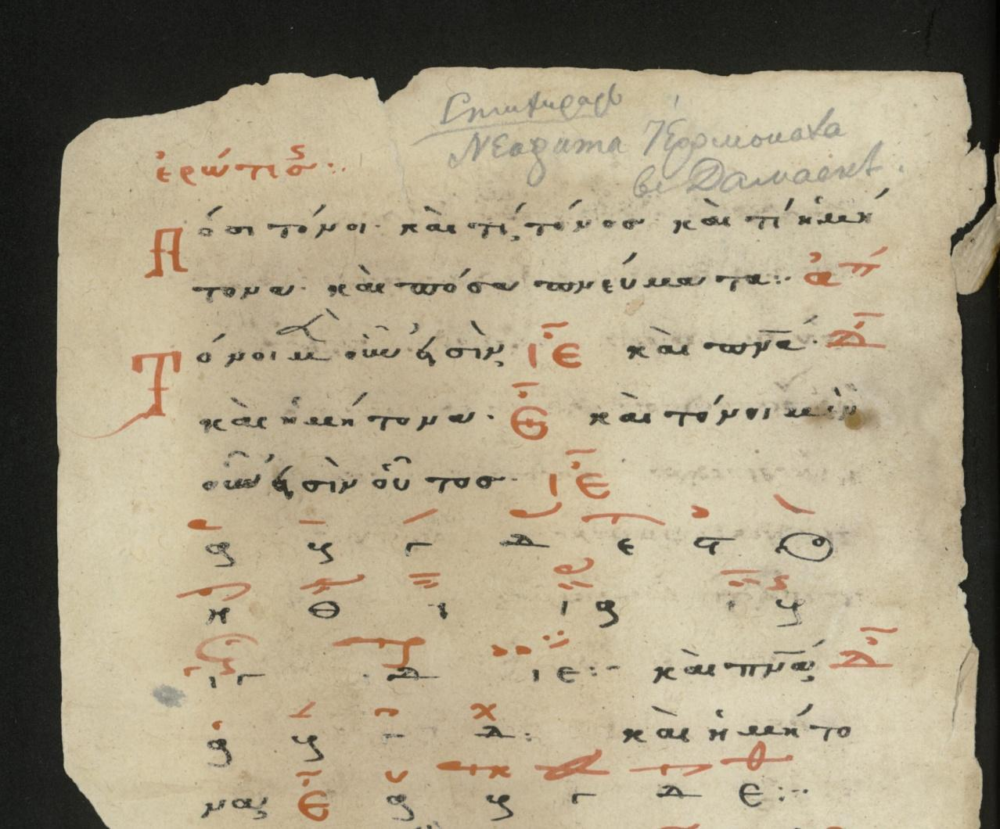

Εικόνα 6.20. Η αγιοπολίτικη ταξινόμηση των σημαδιών σε μορφή ερωταποκρίσεων, σύμφωνα με το σπάραγμα

Petropolitanum graecum 495, φ. 1β (απόσπασμα), α΄ μισό του 13ου αιώνα. © Εθνική Βιβλιοθήκη της Ρωσίας, St.
Petersburg.
Βλ. και Gertsman (επιμ., 1994, πίν. LII και σ. 229-240).

Εκτός από τις τρεις κατηγορίες, τόνοι, πνεύματα και ημίτονα, ο κώδικας Vaticanus Barberinus graecus
300, φ. 9β-10α (15ος αι.) και άλλα χειρόγραφα με την αγιοπολίτικη ταξινόμηση αναφέρουν μια τέταρτη
κατηγορία σημαδιών, με το όνομα μέλη, περιλαμβάνοντας τα σημάδια ψηφιστοκατάβασμα και
εξιστρεπτοκατάβασμα.
Πιο συγκεκριμένα, η λίστα σημαδιών σύμφωνα με τον προαναφερθέντα κώδικα, έχει ως εξής (βλ.
Πίνακα 6.2):

### Α. Τόνοι

### Β. Ἡμίτονα

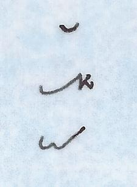

1. τὸ ἶσον

2. τὸ ἐλαφρὸν κλάσμα

3. τὸ ὀλίγον

4. τὸ κούφισμα

5. ἡ ὀξεῖα

6. ἡ παρακλητική

7. ἡ πετασθή

8. τὸ ἀπόδερμα

9. ἡ/ὁ ἀπόστροφος

10. ἡ βαρεῖα

11. τὸ ἀντικένωμα

12. τὸ κράτημα

13. τὸ ἐλαφρόν

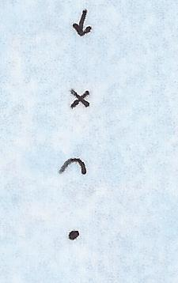

1. ἡ διπλῆ

2. τὸ κέντημα

3. τὸ ἀνάσταμα

4. τὸ πίασμα

5. τὸ κατάβασμα

6. τὸ τριπλοῦν, ἤτοι

τὸ σεῖσμα

1. τὸ παρακάλεσμα

### Γ. Πνεύματα

1. ἡ ὑψηλή

2. ἡ χαμηλή

### Δ. Μέλη

1. τὸ

ψηφιστοκατάβασμα

1. τὸ

ἐξιστρεπτοκατάβασμα

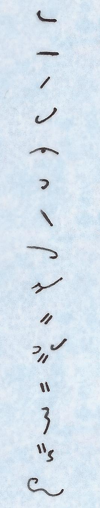
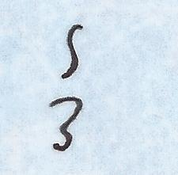

Πίνακας 6.2 Η λίστα αγιοπολίτικων νευμάτων, με βάση τον κώδικα Vaticanus Barberinus graecus 300, φ. 9β-10α (15ος
αι.) και αντίστοιχο πίνακα του Κ. Φλώρου.xxxi

Συγκρίνοντας τις δύο παραπάνω λίστες αγιοπολίτικων σημαδιών, παρατηρούμε, εκτός από την
προσθήκη της κατηγορίας «μέλη» στον τελευταίο πίνακα, και ελαφρές διαφοροποιήσεις ως προς τα σημάδια
που συμπεριλαμβάνονται στην κάθε κατηγορία. Μόνο η ομάδα των «πνευμάτων» είναι σταθερή σε όλες τις
πηγές με αγιοπολίτικη ταξινόμηση σημαδιών.
Παρ' όλες τις μικρές διακυμάνσεις στα περιεχόμενά τους, οι δύο λίστες (Petrop. gr. 495 και Barb. gr.

1) έχουν κάθε φορά από 24 νεύματα - μια φανερή αναλογία προς τα 24 στοιχεία της ελληνικής αλφαβήτου.

## 3. Προς μια συστηματοποίηση του συνόλου των σημαδιών της παλαιοβυζαντινής σημειογραφίας. Μεθοδολογικά ζητήματα

Στην προηγούμενη ενότητα είδαμε τα σημάδια της παλαιοβυζαντινής σημειογραφίας, τα οποία αναφέρονται
στη λίστα νευμάτων του χφου Λαύρας Γ 67 και στον Αγιοπολίτη. Όταν μελετάει όμως κανείς τις πρακτικές
πηγές, έρχεται αντιμέτωπος με πολλά άλλα σημάδια, τα οποία δεν αναφέρονται στα θεωρητικά.
Μια άλλη δυσκολία για το σύγχρονο μελετητή, έγκειται στην ίδια τη φύση της παλαιοβυζαντινής
σημειογραφίας, η οποία είναι αδιαστηματική. Ωστόσο, επειδή η παράδοση της Ψαλτικής Τέχνης, ειδικά στο
παλαιό, κλασικό στυλ (10ος-13ος αι. και αργότερα) είναι πολύ σταθερή, πολλά από τα κομμάτια τα οποία είναι
γραμμένα σε παλαιοβυζαντινή παρασημαντική μπορούν να συγκριθούν με αντίστοιχες πηγές σε
μεσοβυζαντινή σημειογραφία. Η συστηματική αντιπαραβολή πηγών οδήγησε τον H.J.W. Tillyard και
μετέπειτα και άλλους ερευνητές στο συμπέρασμα ότι τόσο οι παλαιοβυζαντινές, αδιαστηματικές, όσο και
οι αντίστοιχες μεσοβυζαντινές, διαστηματικές νευματοποιήσεις, κωδικοποιούσαν (στη συντριπτική
πλειοψηφία) τις ίδιες μελωδίες.xxxii
Η πολυετής συνδυαστική μελέτη πρακτικών και μουσικοθεωρητικών πηγών της
παλαιοβυζαντινής σημειογραφίας, σε σύγκριση με αντίστοιχα θεωρητικά και μουσικά χειρόγραφα της
μεσοβυζαντινής σημειογραφίας, βάσει του τριπτύχου σχήμα-ονομασία-μουσική σημασία των σημαδιών,
δηλαδή από παλαιογραφικής-ονοματολογικής-σημασιολογικής σκοπιάς,xxxiii οδήγησε τον Κωνσταντίνο
Φλώρο σε σημαντικά συμπεράσματα ως προς:

 το σύνολο των χρησιμοποιούμενων στα παλαιοβυζαντινά μουσικά χειρόγραφα νευμάτων, τις

γραφικές μορφές, τις ποικίλες ονομασίες και τους πολυσχιδείς μουσικούς ρόλους τους, και

 τα χαρακτηριστικά στοιχεία τα οποία σηματοδοτούν την εξελικτική πορεία της αθωνικής και της

αγιοπολίτικης σημειογραφίας γενικότερα.
Ο ίδιος παλαιογράφος μαρτυρεί:

«Όταν κάποιος τελικά ταξινομήσει πλήρως και καταλογογραφήσει όλα τα
παλαιοβυζαντινά και τα παλαιοσλαβικά νεύματα, είναι αδύνατο να καταπνίξει μέσα
του το αίσθημα του θαυμασμού που αυθόρμητα τον καταλαμβάνει, παρατηρώντας
την υψηλής στάθμης μουσική γραφοτεχνική του Βυζαντίου με την τόσο πληθωρική
και λεπτομερειακή μορφή της. Τη βλέπει κανείς να παρουσιάζεται πανοραμικά και
ολοκληρωμένη. Στη σημειογραφία Chartres και στην παλαιοσλαβική κοντακάρια
σημειογραφία, ο αριθμός των σημαδιών που χρησιμοποιούνται υπερβαίνει κατά πολύ
τον αριθμό εκατό.»xxxiv

Προτού προχωρήσουμε στη θεώρηση του συνόλου των παλαιοβυζαντινών σημαδιών, είναι αναγκαίο
να πούμε λίγα στοιχεία σχετικά με τις επιμέρους εξελικτικές φάσεις των δύο παλαιοβυζαντινών συστημάτων
μουσικής γραφής.

### 3.1. Διακριτά στοιχεία των επιμέρους εξελικτικών φάσεων της παλαιοβυζαντινής σημειογραφίας

Η βυζαντινή παρασημαντική βρίσκεται, ως ζωντανό πολιτισμικό εργαλείο, σε συνεχόμενη εξέλιξη. Επιπλέον,
η παλαιογραφική έρευνα φέρνει στο φως συνέχεια νέες πηγές, εμπλουτίζοντας τις γνώσεις σχετικά με τα
παλαιότερα τεκμήρια και τα εξελικτικά στάδια της παλαιοβυζαντινής παρασημαντικής.xxxv Είδαμε στις
προηγούμενες ενότητες ότι η διαδρομή ανάπτυξης της παλαιοβυζαντινής σημειογραφίας μπορεί να διαιρεθεί
σε διάφορες φάσεις. Αυτό γίνεται βάσει των εξής κριτηρίων:

• Αριθμός συλλαβών του κειμένου οι οποίες δεν φέρνουν κανένα νεύμα πάνω τους

(ανευματοποιημένες συλλαβές),

- το γραφικό σχήμα των σημαδιών,

- συγκεκριμένες αλλαγές στον αριθμό των σημαδιών και στον τρόπο γραφής μερικών σημαδιών,

δηλαδή «σημειογραφικοτεχνικές μεταλλαγές», όπως α. η εισαγωγή νέων σημαδιών, β. η εξακρίβωση της
σημασίας κάποιων σημαδιών με την προσθήκη άλλων σημαδοφώνων, γ. η αναλυτικότερη καταγραφή
μερικών στενογραφικών σημαδιών (στην αθωνική σημειογραφία).xxxvi

Ο παρακάτω Πίνακας 6.3 περιέχει μια σύντομη αναφορά σε ευδιάκριτα στοιχεία των δύο
παλαιοβυζαντινών συστημάτων, καθώς και σε σημαντικές πρακτικές πηγές των αντίστοιχων εξελεκτικών
φάσεων, σύμφωνα με τον Κ. Φλώρο.

Αγιοπολίτικη σημειογραφία (Coislin)

Αθωνική σημειογραφία (Chartres)

Φάση Πηγές Χαρακτηριστικά Πηγές Φάση
(ενδεικτικά) (ενδεικτικά)
Coislin • Ειρμολόγια:  Πολλές συλλαβές του ποιητικού κειμένου χωρίς • Ειρμολόγιο Chartres
I Πετρούπολης 557 σημαδόφωνα, Λαύρας Β 32 I
(απόσπασμα),
Πάτμου 55,  λείπουν το ίσον, το ολίγον, το κούφισμα και ο (10ος αι.).
Εσφιγμένου 54, συνδυασμός απόστροφος+2 κεντήματα,
Λαύρας Β 32
(φυλλάδιο  το μέγα κράτημα και το ξηρόν κλάσμα
Coislin). παρουσιάζονται ως συζεύξεις (Konjunktur: τα
συστατικά σημάδια γραμμένα ξεχωριστά):

 οι τελείες χρησιμοποιούνται τόσο για τη στίξη του

μουσικοποιητικού κειμένου, όσο και ως σημάδια
επανάληψης του ίδιου φθόγγου (στο τέλος φράσεων).

 σπάνια χρήση  εμφανίζονται ήδη πολλά

γραμματονευμάτων, από τα σημάδια της
Chartres σημειογραφίας,

 πολύ σπάνια χρήση
τόσο από τα θεμελιώδη,

μεγάλων σημαδιών.
όσο και από τα πολύ
χαρακτηριστικά μεγάλα
σημάδια.

|Coislin II|• 8 στιχηρά από τα Μηναία του Carbone (από την Καλαβρία της Κάτω Ιταλίας, παλαιά στην ιδιοκτησία της Ι.Μ. Προφήτου Ηλιού): σήμερα Codices Cryptenses Δ.α. XIII-XVII, μέσα 11ου αι.| Πολλές συλλαβές του σημαδόφωνα.  Εμφανίζεται το αγκυλωτό ίσον ως καταληκτικό σημάδι.|κειμένου χωρίς  Εμφανίζονται το ευθυγραμμισμένο ίσον και το επίσημα ολίγου (δηλ. βραχυγραφία της λέξης ολίγον), τα οποία είναι πολύ χαρακτηριστικά για τη σημειογραφία Chartres.|• Λαύρας Γ 12, Γ 72 και Γ 74 (Στιχηράρια από τις αρχές 11ου αι.).|Chartres II|
|---|---|---|---|---|---|
|Coislin III|• 27 στιχηρά από τα Μηναία του Carbone • Ειρμολόγιο I.M. Αγ. Σάββα του Ηγιασμένου 83, αρχές 11ου αι. (Heirmologium Sabbaiticum, ΜΜΒ 8, επιμ. Raasted), με| Συχνή χρήση της αποστρόφου, πάνω σε συλλαβές οι οποίες στις προηγούμενες φάσεις ήταν χωρίς νεύματα από πάνω. Ο Φλώρος διακρίνει, σύμφωνα με τη σημασία της, τρεις αποστρόφους: descendens (κατιούσα), repetens (επαναληπτική),| Εισαγωγή του κουφίσματος και διάφορων γραμματονευμάτων (βαθύ, δέλτα),  πολύ συχνή χρήση των εξής σημαδιών: απόστροφος με συντόμευση ολίγου από πάνω, χαμηλή, ράπισμα, απόστροφος+2 κεντήματα,|• Στιχηράριο Λαύρα Γ 67 (οι κανονικές του νευματοποιήσεις, καθώς υπάρχουν και μερικά στιχηρά με αρχαϊκή πβ σημειογραφία).|Chartres III|

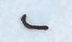

||σημειογραφικές ιδιαιτερότητες (σε Coislin II-III).|ascendens (ανιούσα): βλ. π.χ. Floros (1970, τ. III, σ. 61, παρ. 29).| καταγραφή του ξηρού κλάσματος ως σύμπτυξη (Ligatur: τα συστατικά σημάδια ενώθηκαν μεταξύ τους):|||
|---|---|---|---|---|---|
|Coislin IV|• Μηναία του Carbone: οι| Εισάγονται το ολίγον της Coislin| Σχεδόν όλες οι συλλαβές του ποιητικού|• Στιχηράριο Τριωδίου της Ι.Μ.Μ.|Chartres IV|
||νευματοποιήσεις.|και το κούφισμα,  για επαναλήψεις προηγούμενου φθόγγου χρησιμοποιείται μόνο το ίσον της Coislin σημειογραφίας,  εμφανίζεται η πρακτική της ὑποτάξεως των σημαδιών, με την παλαιοβυζαντινή της μορφή, π.χ. όπου η οξεία χάνει τη διαστηματική της αξία και ψάλλεται το ίσον, όμως με την ποιότητα (τον τρόπο εκτέλεσης) της οξείας,  η θέση του θεματισμού αρχίζει να καταγράφεται πιο αναλυτικά.|νεύματα,  πολύ συχνή χρήση του επισήματος ολίγον της Chartres σημειογραφίας.|Βατοπαιδίου 1488, β΄ μισό 11ου αι. (Triodium Athoum, MMB IX, επιμ. Follieri/Strunk), • Σινά 1219 (Στιχηράριο, μέσα 11ου αι.).||
|Coislin V και VI|Γύρω στα 60-70 χειρόγραφα, εκ των οποίων αναφέρονται, ενδεικτικά: - σε Coislin V: τα Στιχηράρια: • Αχρίδας 53 (τέλη 11ου αι.), • Βιέννης theol. gr. 136, α΄ μισό 12ου αι. (Sticherarium antiquum Vindobonense, ΜΜΒ Χ, επιμ. Wolfram), - μεταξύ Coislin V και VI:| Αυξάνεται το επίπεδο αναλυτικότητας στην καταγραφή του θεματισμού,  τα μεγάλα σημάδια αρχίζουν - σποραδικά στην Coislin V και ολοένα και πιο συστηματικά στην Coislin VI - να συμπληρώνονται με έμφωνα σημάδια, με απώτερο σκοπό το διαστηματικό προσδιορισμό των αντίστοιχων μελωδικών θέσεων.||||

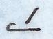

Ειρμολόγιο
Parisinus, fonds
Coislin 220,

- σε Coislin VI:

Στιχηράριο
Λαύρας Δ 28
(αρχές 12ου αι.).

Πίνακας 6.3. Οι επιμέρους εξελικτικές φάσεις της αθωνικής και της αγιοπολίτικης σημειογραφίας και τα κυρίως
χαρακτηριστικά τους, σύμφωνα με τον Κωνσταντίνο Φλώρο.xxxvii

### 3.2. Συστηματοποιώντας το σύνολο των παλαιοβυζαντινών νευμάτων

Στην προσπάθειά του να συγκροτήσει έναν πλήρη και καλά οργανωμένο πίνακα των παλαιοβυζαντινών
σημαδιών που συναντώνται σε θεωρητικές και πρακτικές πηγές του 10ου-12ου αιώνα, ο Κωνσταντίνος Φλώρος
ξεκίνησε από τα δεδομένα των δύο παραδοσιακών καταλόγων σημαδιών, Λαύρας Γ 67, φ. 159α και
Αγιοπολίτη, διευρύνοντας όμως τόσο τις κατηγορίες σημαδιών της αγιοπολίτικης σημειογραφίας, όσο και το
περιεχόμενο της κάθε κατηγορίας.
Δεδομένου ότι το μεγαλύτερο ποσοστό του συνόλου των παλαιοβυζαντινών σημαδιών είναι κοινό και
για τα δύο σημειογραφικά συστήματα (αγιοπολίτικη και αθωνική), ο τελικός συγκεντρωτικός πίνακας
νευμάτων μπορεί να είναι κοινός, με μερικές διευκρινίσεις εκεί όπου ένα σημάδι είναι χαρακτηριστικό μόνο
του ενός συστήματος.
Ο Πίνακας 6.4 αποτελεί μια επιτομή αντίστοιχου πίνακα του Φλώρου για τα παλαιοβυζαντινά και
παλαιοσλαβικά σημάδια. Για τον σκοπό του παρόντος εγχειριδίου, κρατήσαμε μόνο τα παλαιοβυζαντινά
νεύματα με τα πιο χαρακτηριστικά σχήματά τους. Αξιοποιώντας τις ενδόμυχες κατηγορίες της θεωρίας της
Ψαλτικής, ο Φλώρος υιοθέτησε τις κατηγορίες των «Τόνων» («απλών» και «σύνθετων») και των «Ημιτόνων»
από τον Αγιοπολίτη, και πρόσθεσε, βάσει παλαιογραφικών μελετών και με τη βοήθεια θεωρητικών της
μεσοβυζαντινής σημειογραφίας, τρεις άλλες κατηγορίες «Γραμματονεύματα», «Θήτα και θέματα», «Φθοραί».

### Α. ΤΟΝΟΙ ΑΠΛΟΙ και συνδυασμοί τους

#### α. Σημάδια επανάληψης

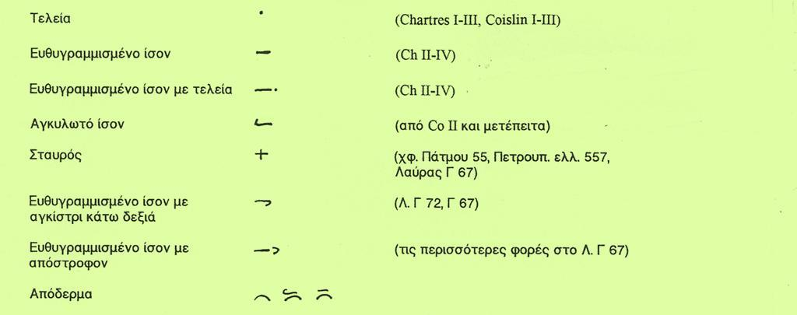

1. Σημάδια ανάβασης

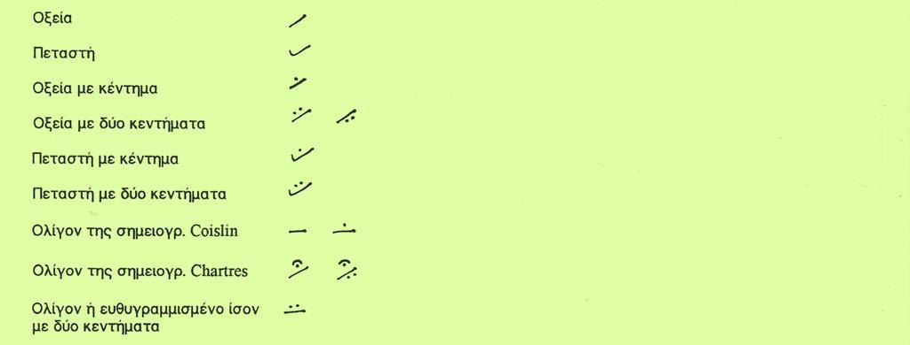

1. Σημάδια

κατάβασης

δ. Σημάδια για δύο ή περισσότερους φθόγγους

### Β. ΗΜΙΤΟΝΑ ή ΗΜΙΦΩΝΑ

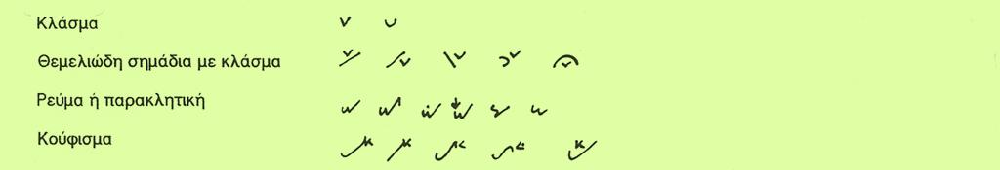

### Γ. ΓΡΑΜΜΑΤΟΝΕΥΜΑΤΑ (ΓΡΑΜΜΑΤΑ)

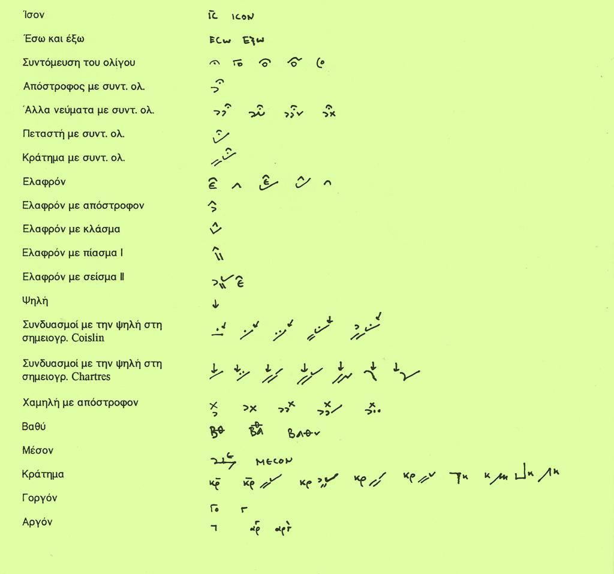

### Δ. ΤΟΝΟΙ ΣΥΝΘΕΤΟΙ (ΣΥΝΤΟΠΟΘΕΤΗΜΕΝΑ ΣΗΜΑΔΙΑ)

1. Συντοποθετήσεις μέσω διπλασιασμού των θεμελιωδών σημαδιών

1. Συντοποθετήσεις με τη διπλή στην

αρχή (ως «κεφαλόνευμα»)

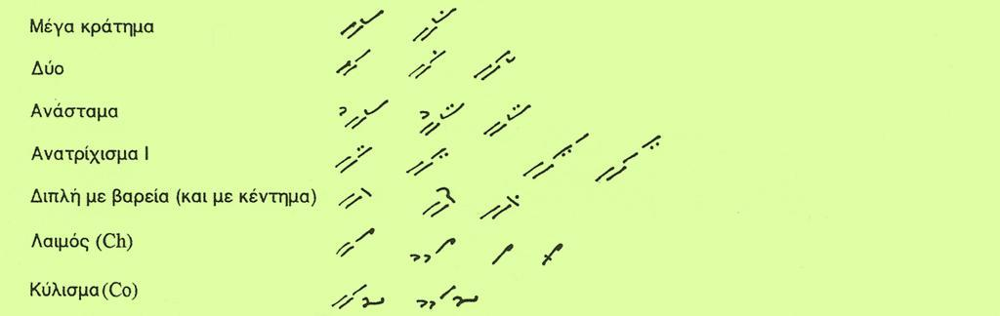

1. Συντοποθετήσεις με τις δύο αποστρόφους στην αρχή (ως «κεφαλόνευμα»)

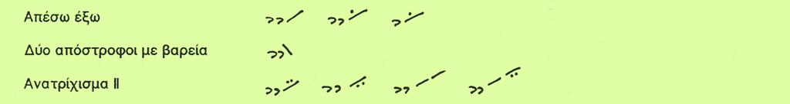

1. Συντοποθετήσεις με το πίασμα στην αρχή (ως «κεφαλόνευμα»)

1. Συντοποθετήσεις με το κλάσμα στο τέλος (ως «καταληκτήριο νεύμα»)

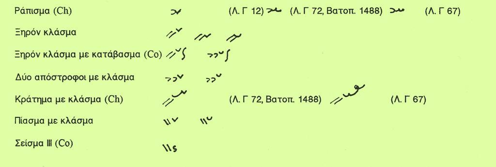

στ. Συντοποθετήσεις με την οξεία και τη βαρεία

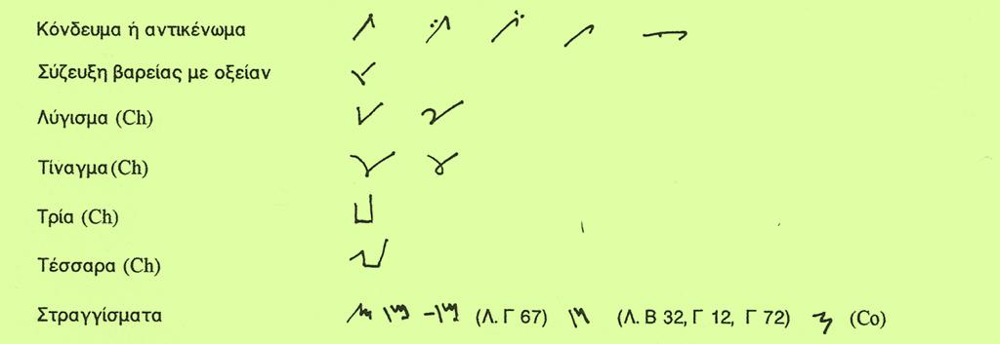

#### ζ. Συντοποθετήσεις με το κατάβασμα

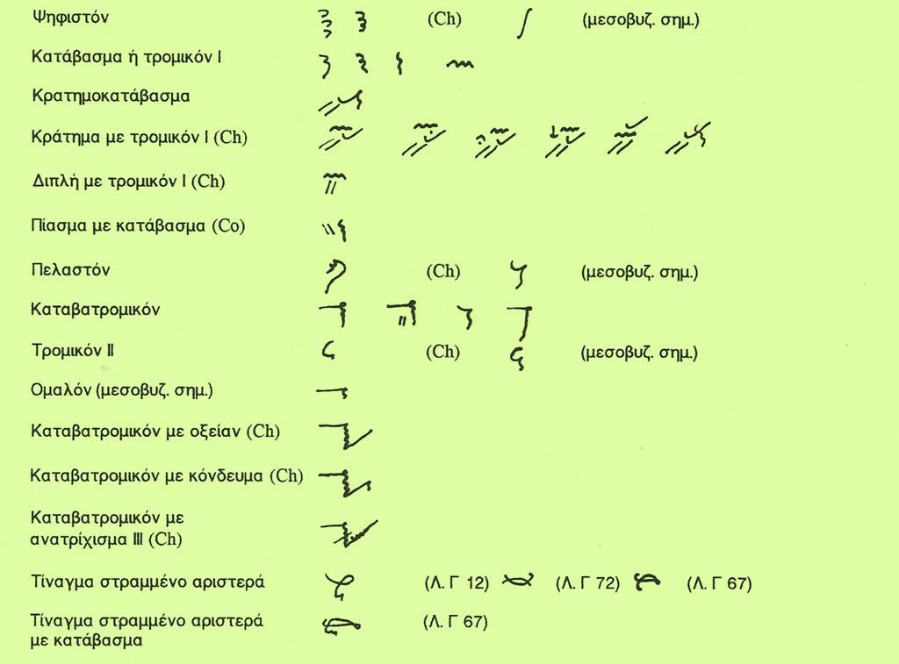

#### η. Ομάδες σύνθετων τόνων

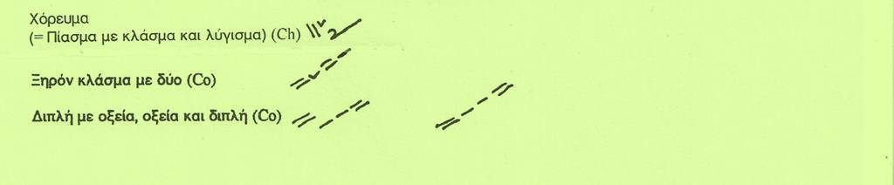

### Ε. ΘΗΤΑ και ΘΕΜΑΤΑ

#### Ομάδα α΄ Θέση προέλευσης: Θέμα απλούν

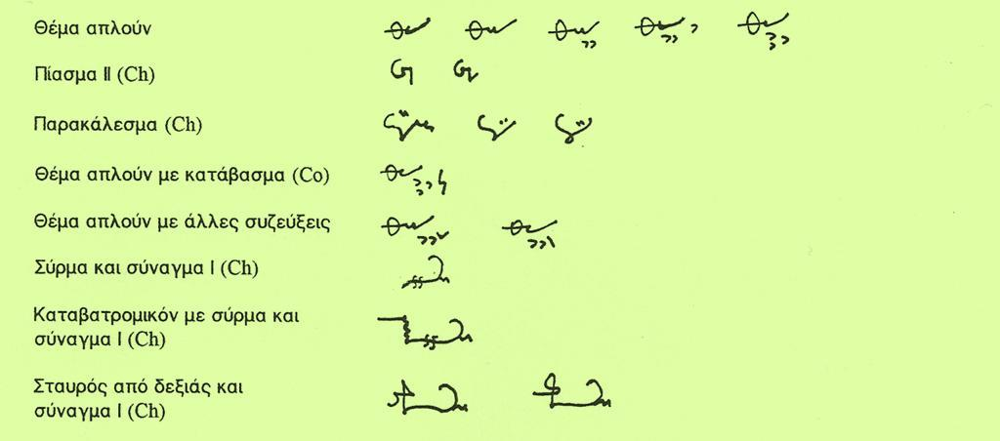

#### Ομάδα β΄ Θέση προέλευσης: Θεματισμός

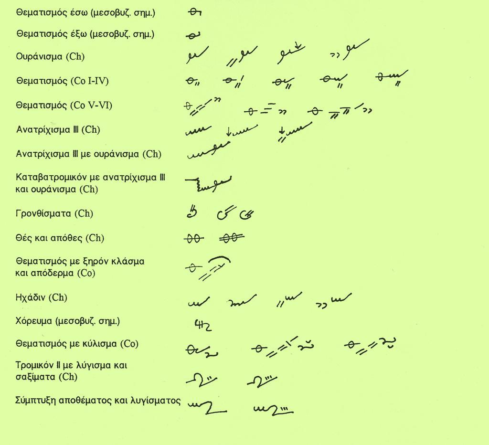

## Ομάδα γ΄

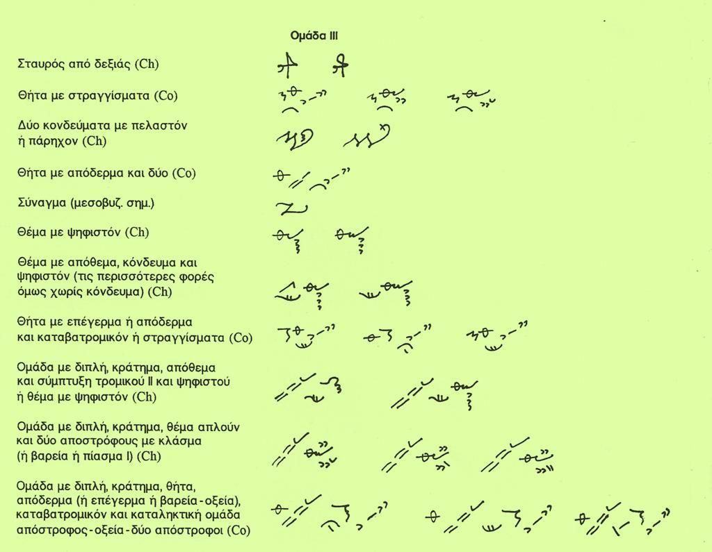

### ΣΤ. ΦΘΟΡΑΙ

Πίνακας 6.4. Σύνοψη των παλαιοβυζαντινών σημαδιών, με βάση τις μελέτες του Κωνσταντίνου Φλώρου.xxxviii

## 4. Μεθοδολογία έρευνας

Στις προηγούμενες ενότητες παρουσιάστηκαν ιστορικά στοιχεία και πηγές της παλαιοβυζαντινής
παρασημαντικής, μαζί με αντίστοιχα χειρόγραφα θεωρητικά. Επίσης, δόθηκαν συγκεντρωτικοί πίνακες με τα
επιμέρους χαρακτηριστικά των εξελικτικών φάσεων της αγιοπολίτικης (Coislin) και αθωνικής (Chartres)
σημειογραφίας, καθώς και ένας συνοπτικός πίνακας με τα σημάδια της παλαιοβυζαντινής σημειογραφίας,
σύμφωνα με έρευνες του Κ. Φλώρου.
Μια κλασική μέθοδος μελέτης ενός τροπαρίου ή ύμνου σε παλαιοβυζαντινή σημειογραφία
περιλαμβάνει κυρίως τα εξής βήματα εργασίας:

1. Σε πολύ αρχικό στάδιο ή/και όταν δεν είναι εύκολα προσβάσιμες οι πηγές, μπορούμε να ξεκινήσουμε

κάνοντας μια αντιγραφή του κομματιού από το χειρόγραφο ή από μια φωτογραφία του: βλ. Εικόνα 6.21.

1. Στη συνέχεια γίνεται μεταγραφή του μουσικοποιητικού κειμένου, με αναπτύξεις των συντομογραφιών και

διορθώσεις ορθογραφικών λαθών, και με χωρισμό σε μουσικοποιητικές ενότητες. Έπεται η ταύτιση των
σημαδιών, με βάση τα θεωρητικά της παλαιοβυζαντινής σημειογραφίας και τους αντίστοιχους πίνακες
σημαδιών: βλ. Εικόνα 6.22.

1. Σε ένα πιο προχωρημένο στάδιο μπορούν να ακολουθήσουν αντιπαραβολές πηγών, δηλαδή σύγκριση

περισσότερων πηγών που έχουν το ίδιο κομμάτι (ή προσόμοιό του),xxxix σε διάφορες εξελικτικές φάσεις της
παλαιοβυζαντινής σημειογραφίας και σε μεσοβυζαντινή σημειογραφία, ενδεχομένως και σε παλαιοσλαβικές
σημειογραφίες κ.ά.: βλ. Εικόνα 6.23.
Τέτοιες συγκριτικές μελέτες μπορούν να επεκταθούν χρονικά τόσο προς τα πίσω (πηγές σε πρωτόγονες
σημειογραφίες, εφόσον υπάρχουν), όσο και μπροστά, προς τις εξηγήσεις των αντίστοιχων κομματιών στη
Νέα Μέθοδο (βλ. κεφ. 11).

1. Στην περίπτωση που ένα κομμάτι διασώθηκε μόνο σε παλαιοβυζαντινή σημειογραφία, ο έμπειρος

παλαιογράφος μπορεί να προτείνει μια μεταγραφή in campo aperto (σε ανοιχτό πεδίο), προσανατολιζόμενος
με βάση τον ήχο του κομματιού και τους δεσπόζοντες φθόγγους του, τις καταλήξεις και άλλες θέσεις
(φόρμουλες), οι οποίες συνδυάζονται σταθερά με συγκεκριμένες μελωδικές βαθμίδες: βλ. Εικόνα 6.24.

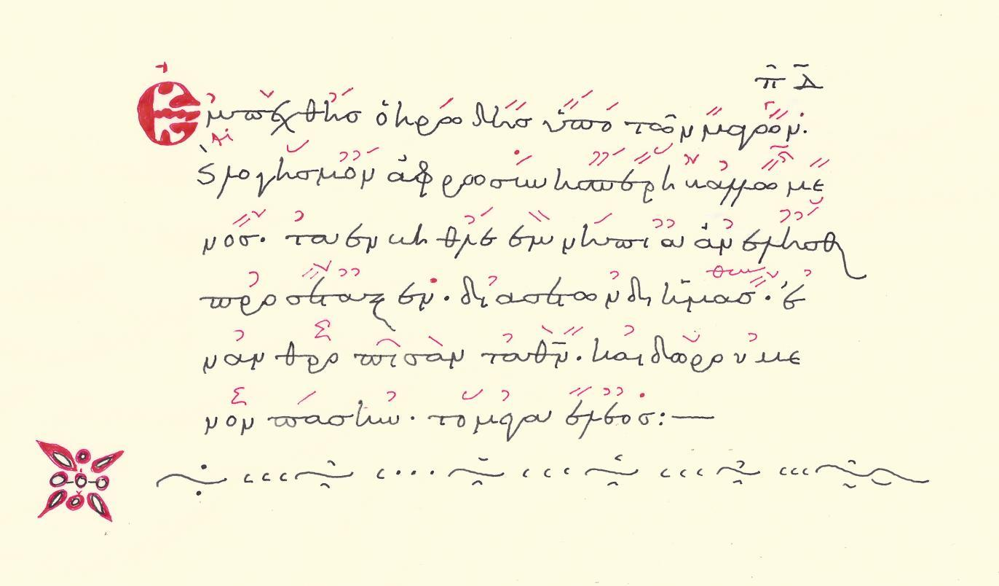

Εικόνα 6.21. Το στιχηρό «Ἐμπαιχθεὶς ὁ Ἡρώδης», σε ήχο πλ. δ΄, από το Στιχηράριο Rizov F 1650k/op4/3, στα
Κεντρικά Κρατικά Αρχεία στη Σόφια, τέλη 10ου αι., σε αρχαϊκή παλαιοβυζαντινή σημειογραφία.
Μια φωτογραφία από το πρωτότυπο βρίσκεται σε: Atanasov (2012, σ. 84).
Παρατηρείται ότι όλα τα σημαδόφωνα είναι γραμμένα με κόκκινο μελάνι. Όμοιες περιπτώσεις βρίσκονται και σε άλλα χφα
με παλαιοβυζαντινή σημειογραφία, π.χ. Αγίου Παύλου 102/Α (10ου αι.: Στάθης, 1993, σ. 913, πίν. Α ΄) και Αχρίδας 39 (τέλη
11ου αι.: Atanasov, 2012, σ. 85).

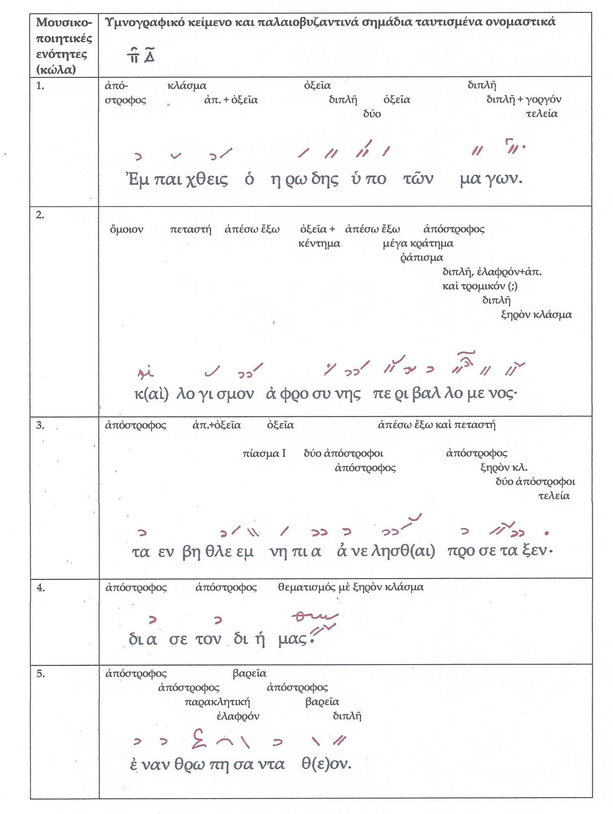

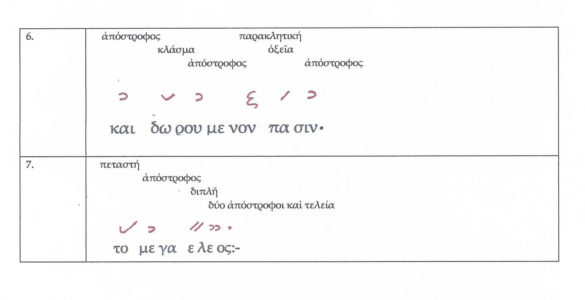

Εικόνα 6.22. Μεταγραφή του στιχηρού «Ἐμπαιχθεὶς ὁ Ἡρώδης», σε ήχο πλ. δ΄, από το Στιχηράριο Rizov F
1650k/op4/3, στα Κεντρικά Κρατικά Αρχεία στη Σόφια, τέλη 10ου αι., με διαίρεση σε μουσικοποιητικές ενότητες
και ταύτιση σημαδιών, βάσει του Πίνακα 6.4. Σύμφωνα με τον Atanasov (2012, σ. 84), η σημειογραφία
περιγράφεται ως Coislin I. Στο κώλον 2 φαίνεται ένα ράπισμα στην 5η συλλαβή από το τέλος, σημάδι το οποίο
συνήθως συνδυάζεται με τη σημειογραφία Chartres (Floros, 1970, τ. III, σ. 44).

- 

- 

- 

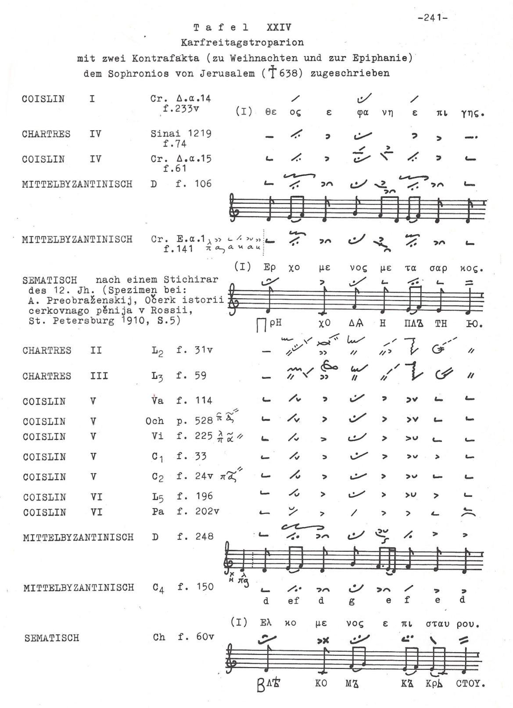

Εικόνα 6.23. Δείγμα αντιπαραβολής πηγών σε παλαιοβυζαντινή, παλαιοσλαβική και μεσοβυζαντινή σημειογραφία: το
στιχηρό  «Ἑλκόμενος ἐπὶ Σταυροῦ» σε ήχο πλ. α΄ (Μεγάλης Παρασκευής) και τα προσόμοιά του: «Ἐρχόμενος
μετὰ σαρκός» (Χριστουγέννων) και  «Θεὸς ἐφάνη ἐπὶ γῆς» (Θεοφανείων). Τα πεντάγραμμα συσχετίζονται κάθε
φορά με τις πηγές σε μεσοβυζαντινή σημειογραφία. © Constantin Floros.
Πηγή: Floros, Constantin. (1970). Universale Neumenkunde. Kassel: Bärenreiter Antiquariat, Kassel-Wilhelmshöhe, τ.
III, σ. 241. Μια μετάφραση του παραδείγματος βρίσκεται σε: Φλώρος, Κωνσταντίνος. (1998). Η ελληνική παράδοση στις
μουσικές γραφές του μεσαίωνα. Εισαγωγή στη Νευματική Επιστήμη. Μετφρ.-επιμ. Κώστας Κακαβελάκης, φιλολ. επιμ. Ν.
Αβραμόπουλος. Θεσσαλονίκη: Ζήτη, σ. 136, πίν. 1α.

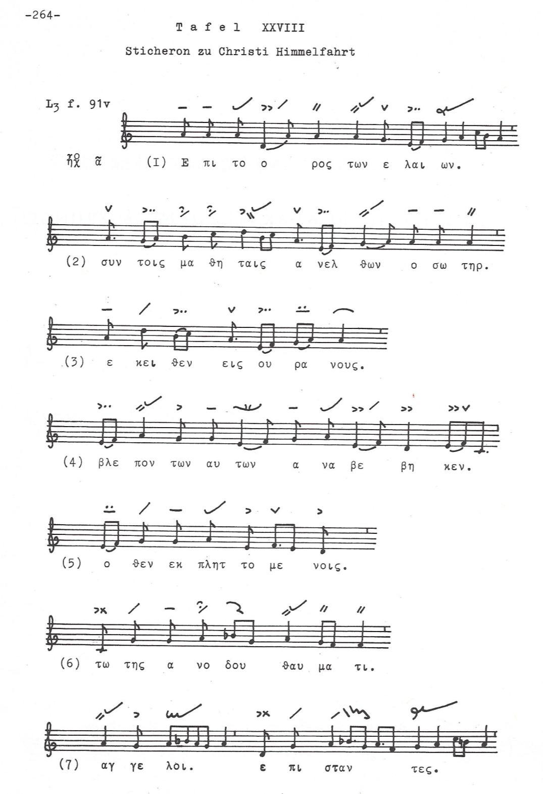

Εικόνα 6.24. Δείγμα μεταγραφής παλαιοβυζαντινής σημειογραφίας in campo aperto: Το πρώτο μισό του στιχηρού «Ἐπὶ τὸ
ὄρος τῶν ἐλαιῶν», από το χφο Λαύρας Γ 67, φ. 91β, σε Chartres III, και μεταφορά των δομικών φθόγγων στο
πεντάγραμμο. © Constantin Floros.
Πηγή: Floros, Constantin. (1970). Universale Neumenkunde. Kassel: Bärenreiter Antiquariat, Kassel-Wilhelmshöhe, τ.
III, σ. 264. Μια μετάφραση του πίνακα βρίσκεται σε: Φλώρος, Κωνσταντίνος. (1998). Η ελληνική παράδοση στις
μουσικές γραφές του μεσαίωνα. Εισαγωγή στη Νευματική Επιστήμη. Μετφρ.-επιμ. Κώστας Κακαβελάκης, φιλολ. επιμ. Ν.
Αβραμόπουλος. Θεσσαλονίκη: Ζήτη, σ. 163, πίν. 3α.

## Κριτήρια αξιολόγησης για το κεφάλαιο 6

Κριτήριο αξιολόγησης 1:
Μεταγράψτε τη Λίστα μελωδημάτων από το χφο Λαύρας Γ 67, φ. 159α (Chartres
III), με βάση την Εικόνα 6.19 και το συναφές αρχείο της.

Κριτήριο αξιολόγησης 2:
Μεταγράψτε την αγιοπολίτικη ταξινόμηση σημαδιών από το χφο Πετρούπολης 495,

φ. 1β, με βάση την Εικόνα 6.20 και το συναφές αρχείο της.

Κριτήριο αξιολόγησης 3:
Άσκηση με αρχαϊκή αγιοπολίτικη σημειογραφία (Coislin I):

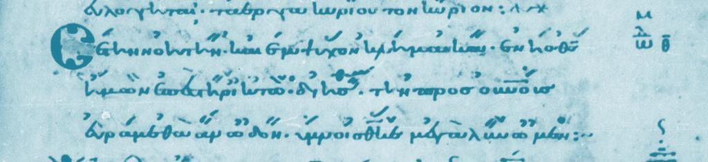

Εικόνα 6.25. Απόσπασμα από το Ειρμολόγιο Λαύρας Β 32, μέσα 10ου αι. (Strunk), φ. 51α, με αρχαϊκή παλαιοβυζαντινή
σημειογραφία αγιοπολίτικου τύπου (Coislin Ι). © για τη φωτογραφία από μικροταινία: Πατριαρχικό Ίδρυμα Πατερικών
Μελετών, Θεσσαλονίκη.

Κριτήριο αξιολόγησης 4:
Άσκηση με σχετικά εξελιγμένη αθωνική σημειογραφία (Chartres III):

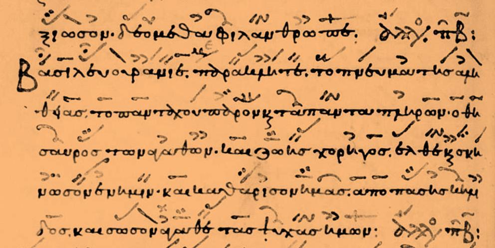

Εικόνα 6.26. Απόσπασμα από το Στιχηράριο Λαύρας Γ 67, αρχές 11ου αι. (Floros), φ. 96β, με παλαιοβυζαντινή αθωνική
σημειογραφία (Chartres III). © για τη φωτογραφία από μικροταινία: Πατριαρχικό Ίδρυμα Πατερικών Μελετών,
Θεσσαλονίκη.

Κριτήριο αξιολόγησης 5:
Άσκηση με πλήρως εξελιγμένη αγιοπολίτικη σημειογραφία (Coislin V), από ένα άλλο
γνωστό χειρόγραφο: 

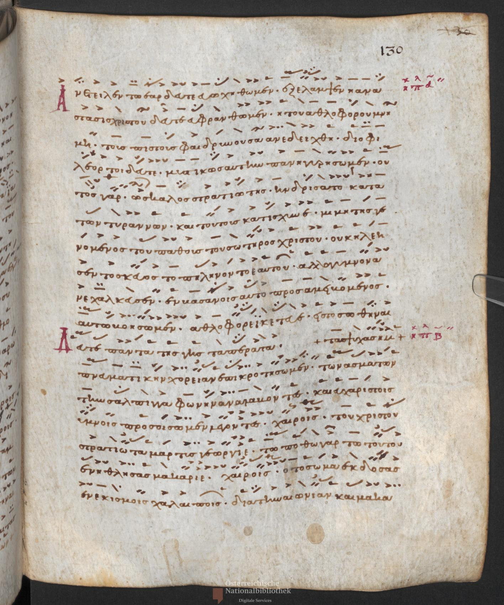

Εικόνα 6.27. To στιχηρό «Ἀνέτειλε τὸ ἔαρ» εις τιμήν του Αγίου Γεωργίου του Τροπαιοφόρου (κγ΄ Απριλίου), από το
Sticherarium Antiquum Vindobonense (Codex Vindobonensis theologicus graecus 136), α΄ μισό 12ου αι. (Wolfram), σε
παλαιοβυζαντινή αγιοπολίτικη σημειογραφία, Coislin V (Floros, 1970, τ. Ι, σ. 57-58), φ. 130α. © Österreichische
Nationalbibliothek, Wien.

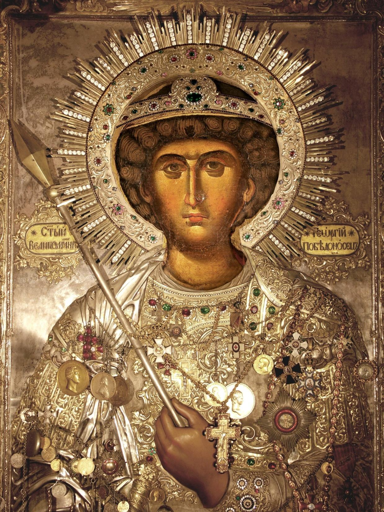

Εικόνα 6.28. Ο Άγιος Μεγαλομάρτυς Γεώργιος ο Τροπαιοφόρος. Θαυματουργή εικόνα από την Ι.Μ. Ζωγράφου, 14ος αι.

© Ιερά Μονή Ζωγράφου, Άγ. Όρος.

### Κριτήριο αξιολόγησης 6

Άσκηση αντιπαραβολής πηγών σε παλαιοβυζαντινή και μεσοβυζαντινή
παρασημαντική, με το στιχηρό «Κατῆλθες ἐν τῷ ᾅδῃ». 

### Κριτήριο αξιολόγησης 7

### Δημιουργήστε μνημοτεχνικές καρτέλες για το κεφάλαιο 6

## Βιβλιογραφία για το κεφάλαιο 6

### Λειτουργικά βιβλία και

έντυπες μουσικές συλλογές

Ἀναστασιματάριον τῆς ψαλτικῆς παραδόσεως τοῦ ιε΄ αἰῶνος. (1999). Επιμ. & πρόλογος Αντώνιος Αλυγιζάκης.
Ψαλτικά Βλατάδων 2. Μουσικοδιδασκάλων Πατριαρχικής Σχολής Εκκλησιαστικής Μουσικής, Μουσική
Βιβλιοθήκη, τόμος α΄. Θεσσαλονίκη: Πατριαρχικόν Ίδρυμα Πατερικών Μελετών.
Μηναῖον τοῦ Ἀπριλίου. (ά.χ.). Αθήνα: Εκδόσεις Φως.
Παρακλητική. (1997). Αθήνα: Εκδόσεις Φως.
Πεντηκοστάριον χαρμόσυνον. (1994). Αθήνα: Έκδοση της Αποστολικής Διακονίας της Εκκλησίας της Ελλάδος.

Πανομοιότυπες εκδόσεις μουσικών χειρογράφων παλαιών τε και νέων

Παπαγιάννης, Κωνσταντίνος, Πρωτοπρεσβύτερος. (2005). Μουσικὸν Πεντηκοστάριον. Επιμ. Εμμανουήλ
Γιαννόπουλος. Θεσσαλονίκη: University Studio Press.
Follieri, Enrica, and Strunk, Oliver. (Επιμ., 1975). Triodium Athoum. Monumenta Musicae Byzantinae, Facsimiles IX,
Pars Principalis & Pars Suppletoria. Copenhagen: Ejnar Munksgaards Forlag.
Perria, Lidia, and Raasted, Jørgen. (Επιμ., 1992). Sticherarium Ambrosianum. MMB, Facsimiles XI, Pars Principalis &
Pars Suppletoria. Copenhagen: Munksgaard.
Raasted, Jørgen. (Επιμ., 1968). Hirmologium Sabbaiticum. Monumenta Musicae Byzantinae, Facsimiles VIII. 3 vols.:
Pars Suppletoria & Pars Principalis 1-2. Copenhagen: Ejnar Munksgaards Forlag.
Strunk, Oliver. (Επιμ., 1966). Specimina Notationum Antiquiorum. Folia selecta ex variis codicibus saec. x, xi, & xii
phototypice depicta. Monumenta Musicae Byzantinae, Facsimiles VII, Pars Principalis & Pars Suppletoria.
Copenhagen: Ejnar Munksgaards Forlag.
Wolfram. Gerda. (Επιμ., 1987). Sticherarium antiquum Vindobonense. Monumenta Musicae Byzantinae, Facsimiles X,
Pars Principalis & Pars Suppletoria. Wien: Verlag der Österreichischen Akademie der Wissenschaften.

### Θεωρητικά

Raasted, Jørgen. (Επιμ., 1983). The Hagiopolites, A Byzantine Treatise on Musical Theory. Preliminary Edition. Cahiers
de l' Institut du Moyen-Âge Grec et Latin, 45.
Gertsman, Evgeny Vladimirovich. (Επιμ., 1994). Petersburg Theoreticon. Odessa: Variant Publishers.

Κατάλογοι μουσικών χειρογράφων

Γκέρτσμαν, Ευγένιος. (1996). Τὰ ἑλληνικὰ μουσικὰ χειρόγραφα τῆς Πετρουπόλεως. Κατάλογος. Τόμος Α.
Ἐθνικὴ Βιβλιοθήκη Ρωσσίας. Ἁγία Πετρούπολις: Γλαγόλ.
Στάθης, Γρηγόριος. (1975, 1976, 1993, 2015). Τὰ χειρόγραφα βυζαντινῆς μουσικῆς, Ἅγιον Ὄρος. Ιερά Σύνοδος της
Εκκλησίας της Ελλάδος - ΙΒΜ. Τόμοι Α΄-Δ΄. Αθήνα.
Bucca, Donatella. (2011). Catalogo dei manoscritti musicali greci del SS. Salvatore di Messina (Biblioteca Regionale
Universitaria di Messina). Roma: Comitato Nazionale per le Celebrazioni del Millenario della Fondazione
dell'Abbazia di S. Nilo a Grottaferrata.
Βιβλία και άρθρα

Αλεξάνδρου, Μαρία. (2010). Ἐξηγήσεις καὶ μεταγραφὲς τῆς βυζαντινῆς μουσικῆς. Σύντομη εἰσαγωγὴ στὸν
προβληματισμό τους. Θεσσαλονίκη: University Studio Press.
Αλυγιζάκης, Αντώνιος. (1992). «Βασιλεῦ οὐράνιε Παράκλητε», ἰδιόμελο, ἦχος πλ. β΄. Σε Πρακτικά ΙΒ΄
Θεολογικού Συνεδρίου. Ανάτυπο. Θεσσαλονίκη.
Αρβανίτης, Ιωάννης. (2010). Ο ρυθμός των εκκλησιαστικών μελών μέσα από τη παλαιογραφική έρευνα και την εξήγηση
της παλαιάς σημειογραφίας. Διδακτορική διατριβή. 2 τ. Ιόνιο Πανεπιστήμιο, Τμήμα Μουσικών Σπουδών.
Κέρκυρα.

Ευστρατιάδης, Σωφρόνιος και Σπυρίδων μοναχός Λαυριώτης. (1932). Εἱρμολόγιον. Ἁγιορειτικὴ Βιβλιοθήκη 9.
Chennevières-sur-Marne: L'Ermitage.
Παπαθανασίου, Ιωάννης. (2002). Εγχειρίδιο Μουσικής Παλαιογραφίας. Πρώτη Ενότητα. Δυτικές νευματικές
σημειογραφίες. Αθήνα: Διογένης.
Πατρώνας, Γεώργιος. (2016). Ένα άγνωστο μουσικό σπάραγμα από την Ιερά Μονή Ξηροποτάμου.
<www.muse.gr/el/mus-e-journal/122-2016-03-23-1405-46> (12.1.2017).
Στάθης, Γρηγόριος. (1992). Οἱ ἀναγραμματισμοὶ καὶ τὰ μαθήματα τῆς βυζαντινῆς μελοποιΐας. IBM, Μελέται 3
(β΄ έκδ.). Αθήνα.
Φλώρος, Κωνσταντίνος. (1998). Η ελληνική παράδοση στις μουσικές γραφές του μεσαίωνα. Εισαγωγή στη Νευματική
Επιστήμη. Μετφρ.-επιμ. Κώστας Κακαβελάκης, φιλολ. επιμ. Ν. Αβραμόπουλος. Θεσσαλονίκη: Ζήτη.
Χατζηδάκη, Νανώ. (1994). Ελληνική Τέχνη. Βυζαντινά ψηφιδωτά. Αθήνα: Εκδοτική Αθηνών.

Adsuara, Clara. (1999). Asmatic, Psaltic and 'Kalophonic' Fragments in Palaeobyzantine Notation. Σε Chr. Troelsgård &

G. Wolfram (επιμ.), Palaeobyzantine Notations II, Acta of the Cogress Held at Hernen Castle (The Netherlands)

in October 1996 (σ. 47-61). Hernen: Brediusstichting.
Alexandru, Maria και Troelsgård, Christian. (2008). Η σημασία της Παπαδικής λεγόμενης προθεωρίας για την έρευνα
της βυζαντινής και μεταβυζαντινής μουσικής. Σε Basile Atsalos et Niki Tsironi (eds.), Actes du VIe Colloque
International de Paléographie Grecque (Drama, 21-27 septembre 2003), (τ. II, σ. 559-572 & τ. III, σ. 1221-
1233). Athènes: Société Hellénique de Reliure.
Atanasov, Asen. (2012). Musical Manuscripts in Ochrid and Tirana. Σε Chr. Hannick, Chr. Troelsgård, Sv. Kujumdzieva
(ed.-in-chief), St. Harkov, Byzantium without Borders: Hymnography and Music in the Byzantine World, 22nd
International Congress of Byzantine Studies, Sofia, 22-27 August 2011, Bulgarian Musicology, 3-4, 81-88.
Bucca, Donnatella. (υπό δημοσίευση). Una nuova, e più precoce, testimonianza datata (an. 1021/1022) di notazione
musicale paleobizantina. Nea Rhome.
Doda, Alberto. (1995). Coislin Notation. Problems and Working Hypotheses. Σε Jørgen Raasted και Christian Troelsgård
(επιμ.), Palaeobyzantine Notations. A Reconsideration of the Source Material (σ. 63-79). Hernen: A.A. Bredius
Foundation.
Floros, Constantin. (1970). Universale Neumenkunde. 3 τ. Kassel: Bärenreiter Antiquariat, Kassel-Wilhelmshöhe.
Hannick, Christian. (1994). Βυζαντινὴ μουσική. Μετφρ. Δημήτρη Γιάννου. Σε Herbert Hunger, Βυζαντινὴ
λογοτεχνία. Ἡ λόγια κοσμικὴ γραμματεία τῶν Βυζαντινῶν (τ. Γ΄, σ. 383-434). Αθήνα: Μορφωτικό Ίδρυμα
Εθνικής Τραπέζης.
Hannick, Chr., Troelsgård, Chr., Kujumdzieva, Sv., ed. in chief, and Harkov, St. (Επιμ., 2012). 22nd International
Congress of Byzantine Studies - Sofia, 22-27 August 2011. Byzantium Without Borders: Hymnography and
Music in the Byzantine World. Bulgarian Musicology, No 3-4. Sofia.
Jung, Annette. (1998). The Long Melisms in the Non-Kalophonic Sticherarion. Διδακτορική διατριβή. Copenhagen
University, Humanistic Faculty.
Jung, Annette. (1999). Early Marginal Additions in Palaeobyzantine Musical Manuscripts. Σε Chr. Troelsgård & G.
Wolfram (επιμ.), Palaeobyzantine Notations II, Acta of the Cogress Held at Hernen Castle (The Netherlands) in
October 1996 (σ. 37-46). Hernen: Brediusstichting.
Petresco, Père J.-D. (1932). Les idiomèles et le canon de l' Office de Noël (d' après des manuscrits grecs des XIe, XIIe,
XIIIe et XIVe s.). Préface de M. A. Gastoué. Paris: Librairie Orientaliste Paul Geuthner.
Raasted, Jørgen. (1969). Observations on the Manuscript Tradition of Byzantine Music. I. A List of Heirmos Call-
Numbers, based on Eustratiades' Edition of the Heirmologion. CIMAGL, 1, 1-12.
Raasted, Jørgen. (1974). Modernization and Conversion. Two Types of Notational Change and their Consequences for
the Transmission of Byzantine Music. Σε H. Glahn, S. Sørensen, and P. Ryom (eds.), International Musicological
Society, Report of the Eleventh Congress, Copenhagen 1972 (τ. II, σ. 775-777). Copenhagen: Edition Wilhelm
Hansen, Stockholm: AB Nordiska Musikförlaget κ.ά.
Raasted, Jørgen και Troelsgård, Christian. (Επιμ., 1995). Palaeobyzantine Notations. A Reconsideration of the Source
Material. Hernen: A.A. Bredius Foundation.
Strunk, Oliver. (1977a). St. Gregory Nazianzus and the Proper Hymns for Easter. Σε O. Strunk, Essays on Music in the
Byzantine World, ed. Kenneth Levy (σ. 55-67). New York: W.W. Norton & Company.
Strunk, Oliver. (1977b). A further Note on the Proper Hymns for Easter. Σε O. Strunk, Essays on Music in the Byzantine
World, ed. Kenneth Levy (σ. 202-207). New York: W.W. Norton & Company.
Strunk, Oliver. (1977c). The Menaia from Carbone at the Biblioteca Vallicelliana. Σε O. Strunk, Essays on Music in the
Byzantine World, ed. Kenneth Levy (σ. 285-296). New York: W.W. Norton & Company.
Thibaut, Jean-Baptiste. (1913). Monuments de la Notation Ekphonétique et Hagiopolite de l'Église Grecque. St.
Petersburg. Reprint with Appendix Introduction by Oliver Strunk. Hildesheim, New York: Georg Olms Verlag,
1976.
Tillyard, H.J.W. (1937). Byzantine Neumes: The Coislin Notation. Byzantinische Zeitschrift, 37, 345-358.

Troelsgård, Christian. (1999). An Early Constantinopolitan Sticherarion, MS Leukosia, Archbishopric of Cyprus,
Mousikos 39, and its Notated Exaposteilaria Anastasima. Σε Chr. Troelsgård & G. Wolfram (επιμ.),
Palaeobyzantine Notations II, Acta of the Cogress Held at Hernen Castle (The Netherlands) in October 1996 (σ.

159-172). Hernen: Brediusstichting.

Troelsgård, Christian. (2003). A List of Sticheron Call-Numbers of the Standard Abridged Version of the Sticherarion.
Part I (The Cycle of the Twelve Months). CIMAGL, 74, 3-20.
Troelsgård, Christian. (2011). Byzantine Neumes. A New Introduction to the Middle Byzantine Musical Notation. MMB,
Subsidia IX. Copenhagen: Tusculanum Press.
Troelsgård, Christian και Wolfram, Gerda. (Επιμ., 1999). Palaeobyzantine Notations II. Acta of the Cogress Held at
Hernen Castle (The Netherlands) in October 1996. Hernen: Brediusstichting.
Wolfram, Gerda. (Επιμ., 2004). Palaeobyzantine Notations III. Acta of the Cogress Held at Hernen Castle, The
Netherlands, in March 2001. Leuven, Paris, Dudley MA: A.A. Bredius Foundation, Peeters.

Διαδικτυογραφία

<http://commons.wikimedia.org/wiki/File:Hagia_Sophia_Imperial_Gate_mosaic_2.jpg#/media/File:Hagia_Sophia_Imperi>
al_Gate_mosaic_2.jpg (11.6.2015).
<http://web.pvaigaiou.gov.gr/library/view_more_en.php?id=168&status=1&type=manuscript> (15.9.2016).
<https://en.wikipedia.org/wiki/Sticheron> (12.9.2016).

## Σημειώσεις τέλους για το κεφάλαιο 6

i Βλ. κεφ. 5, τελευταία ενότητα.
ii Από την εισαγωγή του Oliver Strunk για την επαναστατική έκδοση του Thibaut (1913/1976, σ. III). Σύμφωνα με τον
ίδιο μελετητή, η σημειογραφία του σπαράγματος από την Αγ. Πετρούπολη 557 ανήκει στην αρχαϊκή Coislin (Strunk,
επιμ., 1966, Specimina, Pars Suppletoria, σ. 4-5).
iii Floros (1970, τ. Ι, σ. 64). Σύμφωνα με τις περιγραφές του Φλώρου (ό.π.), το σπάραγμα «περιέχει 18 ακολουθίες
(κανόνες) του γ΄ ήχου, ξεκινώντας από το τέλος της β΄ ωδής της 9ης ακολουθίας και σταματώντας μέσα στην 8η ωδή της
26ης ακολουθίας». Βλ. και Strunk (επιμ., 1966, Specimina, Pars Suppletoria, σ. 5).
iv Πρβλ. Raasted (επιμ., 1968, Hirmologium Sabbaiticum, Pars Suppletoria, σ. 57). Βλ. επίσης Raasted (1969, σ. 5), όπου
αναφέρεται μια λεπτομερής αρίθμηση ειρμών (heirmos call-numbers) των ακολουθιών του γ΄ ήχου, με αφορμή την
γενική αρίθμηση ακολουθιών την οποία είχε προτείνει ο Σωφρόνιος Ευστρατιάδης (1932). Για τις ακολουθίες Θ΄ και Ι΄
του τρίτου ήχου, αντιστοιχούν οι αριθμοί ακολουθιών του Ευστρατιάδη 72 και 73. Αντίστοιχα, οι αριθμοί ειρμών αυτών
των δύο ακολουθιών είναι: 874-884 και 885-900.
v "The earliest dated Byzantine MS with musical (as distinguished from ekphonetic) notation is the Sticherarion
completed in the monastery of Vatopedi on Mount Athos by a certain Anthes on May 31, 1106, preserved today in
the Public Library of Leningrad, where it has the number 789. At the opposite extreme is the Triodion Sinai 754,
completed in the year 1177, the latest dated MS in which the Coislin notation is appropriately used, and by a
curious coincidence this same year also saw the completion of our earliest dated example of the Middle Byzantine
notation, the Sticherarion Sinai 1218." (Strunk, επιμ., 1966, Specimina, Pars Suppletoria, σ. 7-8). Η σημειογραφία του
κώδικα Petrop. gr. 789 μας φάνηκε ότι μπορεί να ενταχθεί στο στάδιο Coislin V (αυτοψία του χφου στην Αγ.
Πετρούπολη, 19.10.2016).
vi Πρόκειται για τα στιχηρά με αριθμό 1 και 2 στη στάνταρ συντομευμένη εκδοχή (SAV) του Στιχηραρίου, η οποία
επικρατεί περίπου από τα μέσα του 11ου αιώνα και μετά, σύμφωνα με τον Oliver Strunk: πρβλ. Troelsgård (2003, σ. 3-4).
vii Για τα γαλλικά ονόματα και παλαιότερες ονομασίες, πρβλ. Strunk (επιμ., 1966, Specimina, Pars Suppletoria, σ. 1-7).
Φλώρος (1998, σ. 119-121). Για τα ελληνικά ονόματα, πρβλ. Στάθης, Μάθημα «Βυζαντινή Σημειογραφία και
Παλαιογραφία», Εθνικό και Καποδιστριακό Πανεπιστήμιο Αθηνών, Τμήμα Μουσικών Σπουδών, ακαδημαϊκό έτος
1997-1998. Πρβλ. επίσης Φλώρος (1998, σ. 121, για την αγιοπολίτικη ταξινόμηση σημαδιών) και Παπαθανασίου (2002,
πίνακες 16-17, για την Αθωνική σημειογραφία).
viii Για περισσότερες λεπτομέρειες, πρβλ. Φλώρος (1998, σ. 117-119).
ix Ο παρών πίνακας στηρίζεται στην εξής βιβλιογραφία: Strunk (επιμ., 1966, Pars Principalis & Pars Suppletoria). Floros
(1970) και του ιδίου (1998). Doda (1995). Στάθης (1992, σ. 48). Παπαθανασίου (2002, πίν. 16-23).
x Πρβλ. επίσης <http://web.pvaigaiou.gov.gr/library/view_more_en.php?id=168&status=1&type=manuscript> (15.9.2016),
για το Τριώδιο Ι.Μ. Λειμώνος 31, Λέσβος (12ος αι., μερικά τροπάρια με σημειογραφία Coislin). Περισσότεροι σύνδεσμοι
για χειρόγραφα βυζαντινής μουσικής on-line αναφέρονται σε: <https://en.wikipedia.org/wiki/Sticheron> (12.9.2016).

xi Τα δύο φύλλα αυτά ήδη δημοσιεύθηκαν σε: Floros (1970, τ. III, εικ. 13-14. Για περισσότερα πανομοιότυπα βλ. ό.π.,
εικ. 15-18). Για τη χρονολόγηση, βλ. Strunk (επιμ., 1966, Specimina, Pars Suppletoria, σ. 13): "not earlier than 950". O
Floros (1970, τ. I, σ. 63-64) χρονολογεί το ίδιο χφο στο β΄ μισό του 10ου αιώνα και σημειώνει ότι είναι σε σημειογραφία
Chartres I, με εξαίρεση ενός φυλλαδίου του χφου (φ. 51α-58β), το οποίο γράφηκε σε Coislin I.
xii Ο κώδικας περιέχει στιχηρά του Τριωδίου και Πεντηκοσταρίου. Τα περισσότερα στιχηρά του φύλλων 1-45 είναι
γραμμένα σε παλαιοβυζαντινή σημειογραφία αθωνικού τύπου (Chartres II), ενώ πολλά στιχηρά των φύλλων 46β-83β
παρουσιάζουν τη σημειογραφία «Θήτα»: πρβλ. Floros (1970, τ. Ι, σ. 52-53 και τ. III, εικόνες 19-21, με τα φύλλα 36α,
38α και 42α του χφου Λαύρας Γ 12). Για τη χρονολόγηση βλ. επίσης Strunk (επιμ., 1966, Specimina, Pars Suppletoria, σ.

1) και Raasted (1995, σ. 60).

xiii To φύλλο 9α του Ειρμολογίου Coislin 220 έγινε γνωστό στην επιστημονική κοινότητα ήδη στο α΄ μισό του 20ού
αιώνα, μέσα από τη δημοσίευσή του σε: Père Petresco (1932, πίν. XXVI).
xiv Το στιχηρό αυτό δημοσιεύθηκε σε: Floros (1970, τ. III, εικόνες 29-30, με σχετικές λεζάντες, και τ. Ι, σ. 339). Για
περισσότερες εικόνες από το χφο αυτό, πρβλ. ό.π. (τ. III, εικόνες 25-36). Το Στιχηράριο Λαύρας Γ 67 (περιέχει Τριώδιο,
Πεντηκοστάριο, Οκτώηχο) είναι γραμμένο ως επί το πλείστον σε αθωνική σημειογραφία (Chartres III). Ο Φλώρος
συμπεραίνει όμως ότι ο γραφέας του χφου αυτού είχε τέσσερα ανθίβολα (πρότυπα από τα οποία αντέγραψε, γερμ.
Vorlagen), καθώς ομάδες στιχηρών του ίδιου χφου παρουσιάζουν αρχαϊκή παλαιοβυζαντινή σημειογραφία Coislin I
(Floros, 1970, τ. III, εικόνα 31), Chartres I (ό.π., εικόνα 33), ή ακόμα μια μεικτή μορφή παλαιοβυζαντινής
σημειογραφίας με βάση την Coislin III και στοιχεία της Chartres (ό.π., εικόνες 25-26, 29-30, 35-36). Για μια περιγραφή
των αρχαϊκών και μεικτών νευματοποιήσεων του Στιχηραρίου Λαύρας Γ 67, πρβλ. Floros (1970, τ. Ι, σ. 332-340). Για
μια ανοιχτή λίστα στιχηρών του Λέοντος ΣΤ΄ του Σοφού (ιδιόμελα, θεοτοκία, σταυροθεοτοκία) με βάση
παλαιοβυζαντινά Στιχηράρια και Ειρμολόγια, καθώς και το Στιχηράριο Ambrosianum A 139 sup. σε μεσοβυζαντινή
γραφή, βλ. Floros (1970, τ. III, σ. 14-18. Στον τ. Ι, σ. 351-352 γίνεται αναφορά στα 11 εωθινά του ίδιου βασιλιά -
μελωδού).
xv Πρβλ. Troelsgård (2011, σ. 139).
xvi Πρβλ. Floros (1970, τ. Ι, σ. 59-60). Τα δύο φύλλα αυτά ήδη δημοσιεύθηκαν σε: Floros (1970, τ. III, εικ. 65-66).
Σύμφωνα με τον ίδιο μουσικολόγο, το χφο Λαύρας Δ 28 είναι γραμμένο σε Coislin VI, με εξαίρεση πέντε στιχηρά σε
Chartres IV, στα φύλλα 199β-201α: Ὢ φύλακες Ἰουδαίων, Ἄγγελοι σκιρτήσατε, Σκιρτάτω πᾶσα ἡ κτίσις, Τὸ
Πάσχα τοῦτο τὸ μέγα, Πάσχα τὸ μέγα τὸ τῆς ἐνδόξου καὶ θείας ἀναστάσεως (Floros, 1970, τ. Ι, σ. 330). Για μια
σύγχρονη μελοποίηση του στιχηρού Ἄγγελοι σκιρτήσατε, πρβλ. Παπαγιάννης, Μουσικὸν Πεντηκοστάριον (2005,

σ. 577-578). Για την ένδειξη αυτής της μελοποίησης ευχαριστούμε τον συνάδελφο κύριο Εμμανουήλ Γιαννόπουλο.

xvii Πρβλ. Στάθης (2015, σ. 401-403).
xviii Για διαδικασίες επικαιροποίησης και μεταγραφής από μια φάση ή ένα στάδιο σημειογραφίας σε ένα άλλο, πάνω στο
ίδιο χειρόγραφο, πρβλ. Raasted (1974, σ. 775): "it is important to retain the notion of the scribe - the good scribe, at least

- as a potential composer or re-shaper of the melodies which he was copying. Bearing in mind that the products of the
scribes were intended for practical use, we can be sure that the average scribe wanted his product to be up-to-date; in this
field there seems to be little room for an antiquarian interest in preserving the old and obsolete (...). Undoubtedly a
transcription from one notational system into another must have been much more difficult affair than the modernization
within a system, an operation which any intelligent scribe must have been able to perform in scribendo". Για προσθήκες
στις ώες παλαιοβυζαντινών μουσικών χειρογράφων και διάφορους τρόπους ερμηνείας αυτών, πρβλ. Jung (1999).
xix Πρβλ. Sticherarium Ambrosianum A 139 sup., φ. 205α-β (Perria & Raasted, eds., 1992). Βλ. και Jung (1998, σ. 78-80,

97-100, 175, 185, καθώς και τα παραδείγματα 20-25, 28 ). Σύμφωνα με την A. Jung (ό.π., σ. 100), "the long melisms in

the stichera of the standard abridged version are formulaic and very old. Their form and behavior follow the tradition of
the sticheron genre, and a decisive influence from the psaltikon style has not been found, but an influence from a
tendency towards more embellished melodies is felt from the 12th century. Hymns embellished with melisms are sung at
important Church festivals, particularly Stauroproskynesis and Good Friday, and the presence of a melism in the hymn
might depend on the liturgical setting. The melismated hymns have been found also in the oldest extant manuscripts, and
the tradition has been stable". Βλ. όμως και Floros (1970, τ. II, σ. 259-260).
xx Για την πρώιμη παράδοση των στιχηρών του Πάσχα, εκ των οποίων αρκετά βασίζονται σε Ομιλίες του Αγίου
Γρηγορίου του Θεολόγου για τη συγκεκριμένη γιορτή, βλ. Strunk (1977a & b).
xxi Για τη λεπτομερέστερη μελέτη της πολύ ενδιαφέρουσας σημειογραφίας σ' αυτό το στιχηρό, πρβλ. το Κριτήριο
αξιολόγησης 6 στο τέλος του παρόντος κεφαλαίου.
xxii Για τα τέσσερα αυτά ανατολικά στιχηρά του Εσπερινού της Κυριακής (τελείται Σάββατο το βράδυ), πρβλ. Perria &
Raasted (eds., Sticherarium Ambrosianum, Pars Suppletoria, 1992, σ. 10, 21, 26, 32). Παρακλητική (1997, σ. 351).
xxiii O Floros (1970, τ. II, σ. 259-260 και τ. III, πανομοιότυπα 60-64) αναφέρει έξι στιχηρά μεγάλων εορτών, τα οποία στο
χφο Κρυπτοφέρρης Ε.α.11, φ. 22α-23β και 29β, του έτους 1112, καταγράφονται με παλαιοβυζαντινή αγιοπολίτικη
σημειογραφία (Coislin V), σε πολύ μελισματική υφή, την οποία ο προαναφερθείς μουσικολόγος προσδιορίζει ως «στυλ
του Ψαλτικού» ("psaltischen Stils"). Συγκεκριμένα, το στιχηρό «Δεῦτε μακαρίσωμεν ἅπαντες Ἰωσὴφ τὸν ἀοίδιμον»
εμφανίζεται στο χφο της Κρυπτοφέρρης Ε.α.11 ως ακόμα πιο μελισματικό, σε σχέση με την εκδοχή που υπάρχει στο

Στιχηράριο Petrop. gr. 789, φ. 258α. Ο Oliver Strunk χαρακτήρισε τα μελισματικά στιχηρά του κώδικα της
Κρυπτοφέρρης ως «καλοφωνικά», ενώ η Clara Adsuara προτείνει τον όρο «πρώτο-καλοφωνικά» για τα ίδια κομμάτια:
βλ. Adsuara (1999, σ. 47, 54, 56, 60). Βλ. επίσης Troelsgård (1999, σ. 172), όπου δημοσιεύεται το στιχηρό «Ἄγγελοι
σκιρτήσατε» από το πρώιμο κωνσταντινουπολίτικο Στιχηράριο της Λευκωσίας, Αρχιεπισκοπή Κύπρου, χφο Μουσικό
39, από τα μέσα του 11ου αι. (το συγκεκριμένο στιχηρό όμως αποτελεί μεταγενέστερη προσθήκη). Στο προαναφερθέν
χφο το στιχηρό εμφανίζεται σε μια ακόμα πιο μελισματική μορφή, σε σχέση με την εκδοχή του Petrop. gr. 789. Ο
Troelsgård (ό.π., σ. 163) σημειώνει σχετικά με την εκδοχή του «Ἄγγελοι σκιρτήσατε» στο χφο της Λευκωσίας ότι "As
a whole, the notation of this piece is somewhat reminiscent of the melismatic Heothina and 'proto-kalophonic' stichera of
Cryptensis E.α.XI." To πολύ ενδιαφέρον θέμα των διάφορων επιπέδων μελισματικότητας στο παλαιό (προ-καλοφωνικό)
βυζαντινό ρεπερτόριο, καταγραμμένο σε παλαιο- και μεσοβυζαντινή παρασημαντική, αναμένει ακόμα μιας ενδελεχούς
συγκριτικής μελέτης.
xxiv Βλ. Floros (1970, τ. I, σ. 54-55, 351-352). Ο Oliver Strunk (επιμ., 1966, Specimina, Pars Suppletoria, σ. 29)
χρονολογεί το ίδιο χειρόγραφο στο 10ο αιώνα.
xxv Βλ. Raasted (επιμ., 1983, Hagiopolites). Πρβλ. και Hannick (1994, σ. 406-410). Φλώρος (1998, σ. 102).
xxvi Floros (1970, τ. Ι, σ. 32, 53-54, 82 ["der königliche Codex Lavra Γ. 67"], 83 -85, 351-352).
xxvii Για την περιγραφή του ψηφιδωτού, πρβλ. Χατζηδάκη (1994, σ. 57, εικ. 33).
xxviii Εικόνα από το μικροφίλμ του Πατριαρχικού Ιδρύματος Πατερικών Μελετών, Ι.Μ. Βλατάδων, Θεσσαλονίκη. Η
λίστα αυτή δημοσιεύθηκε πολλές φορές. Βλ. π.χ. Floros (1970, τ. III, πανομοιότυπο 1).
xxix Πρβλ. Raasted (επιμ., 1983, Hagiopolites, σ. 1-3). Hannick (1994, σ. 406-410).
xxx Πρβλ. και Alexandru & Troelsgård (2008, τ. II, σ. 563-564).
xxxi Πρβλ. Φλώρος (1998, σ. 123). Floros (1970, τ. Ι, σ. 113 και τ. III, πανομοιότυπα 9-10). Ακολουθήσαμε τον τρόπο
καταγραφής των ονομάτων των σημαδιών, όπως στον κώδικα Barberinus gr. 300, φ. 9β-10α. Για τα σχήματα των
σημαδιών ακολουθήσαμε όμως τον Φλώρο, καθώς το χειρόγραφο, όντας μεταγενέστερο, έχει τα μεσοβυζαντινά σχήματα
των αντίστοιχων σημαδιών.
xxxii Βλ. Φλώρος (1998, σ. 119).
xxxiii Φλώρος (1998, σ. 130).
xxxiv Φλώρος (1998, σ. 124-125).
xxxv Πρβλ. Bucca (υπό δημοσίευση).
xxxvi Φλώρος (1998, σ. 131).
xxxvii Ο πίνακας αυτός στηρίζεται στην εξής βιβλιογραφία, όπου και παραπέμπεται o αναγνώστης για περισσότερα
στοιχεία: Φλώρος (1998, σ. 130-135). Floros (1970, ειδικά τ. I, σ. 50-66 [περιγραφή πηγών]). Αλεξάνδρου (2010, σ.

123).

xxxviii Ο παρών πίνακας αποτελεί επιτομή και μετάφραση από: Floros (1970, τ. III, σ. 39-50), η οποία πραγματοποιήθηκε
το 2002-2003, για το μάθημα «Παλαιογραφία Βυζαντινής Μουσικής», στο Τμήμα Μουσικών Σπουδών του Α.Π.Θ. H
μετάφραση των διάφορων κατηγοριών των σημαδιών βασίστηκε εν πολλοίς σε: Φλώρος (1998, σ. 119-164). Μια άλλη
μετάφραση του ίδιου πίνακα υπάρχει σε: Αρβανίτης (2010, τ. Β΄, πίνακας 13, σ. 23-29).
xxxix Προσόμοιο είναι ένα υμνογραφικό ποίημα το οποίο βασίζεται σε ένα μοντέλο (το λεγόμενο αυτόμελο), το οποίο το
απομιμείται ως προς τη μετρική του, με βάση τις αρχές της ισοσυλλαβίας και ομοτονίας (ίδιος αριθμός συλλαβών και
ίδια τοποθέτηση τονούμενων συλλαβών στα επιμέρους κώλα-ημιστίχια), και του οποίου υιοθετεί τη μελωδία.
