## Summary

This chapter deals with Middle Byzantine notation, an intervallic musical script in use for approximately 700 years (mid-12th to mid-19th century), which arose from Old Byzantine Hagiopolite notation and was followed by the New System. Its long course may be subdivided into various evolutionary phases, the best known being the fully developed, the late, and the exegetical phase, which prepares the work of the Reformers of 1814–15. The tracing of the signs of Middle Byzantine notation is first addressed through the study of the Protheoria (Προθεωρία) of the Papadike, in two versions: the Protopapadike of Neophytos Hieromonk from Damascus, Petropolitanus gr. 495, and a late form of the Protheoria of the Papadike from an autograph by Demetrios Lotos, Protopsaltes of Smyrna, ms. Holy Monastery of Docheiariou 338. Subsequently, the sounded and unsounded signs of Middle Byzantine notation are presented in the form of multicoloured tables, as an aid for their systematic learning by readers. The chapter continues with the presentation of a methodology for the first steps in studying manuscripts in Middle Byzantine notation, through the transfer of the sounded signs to the staff or into an alphabetic system. The study of Middle Byzantine notation continues in the following chapters through to the end of the book.

## Prerequisite Knowledge

For a better understanding of the present chapter, study of chapters 1–6 is required. Also,
the study of the following monograph on Middle Byzantine notation is recommended: Troelsgård, Christian. (2011).
Byzantine Neumes. A New Introduction to the Middle Byzantine Musical Notation. MMB, Subsidia IX.
Copenhagen: Tusculanum Press.

## 1. Prolegomena

## 1.1. Dating and Some Milestones

Middle Byzantine notation, more generally known also as the Old System, was in use for approximately seven
centuries. It evolved out of the final stage of Old Byzantine Hagiopolitan
notation (Coislin VI), probably during the first half of the twelfth century (Papathanassiou, 1997, p. 57).
Among the oldest specimens of this notation known to us today are two stichera
in the Patmian manuscript 218, which had been sent in the year 1166 to the Holy Monastery of Saint John the
Theologian on Patmos and otherwise contains stichera in Coislin V and VI: Figure 7.1.
The historical course of Middle Byzantine notation, which spread throughout the
Byzantine Empire and developed further in the post-Byzantine period in Greek and
foreign-language manuscripts (Romanian, Slavic, etc.), comes to an end around the middle of the nineteenth century,
when the analytical notation of the New Method definitively prevails.

305

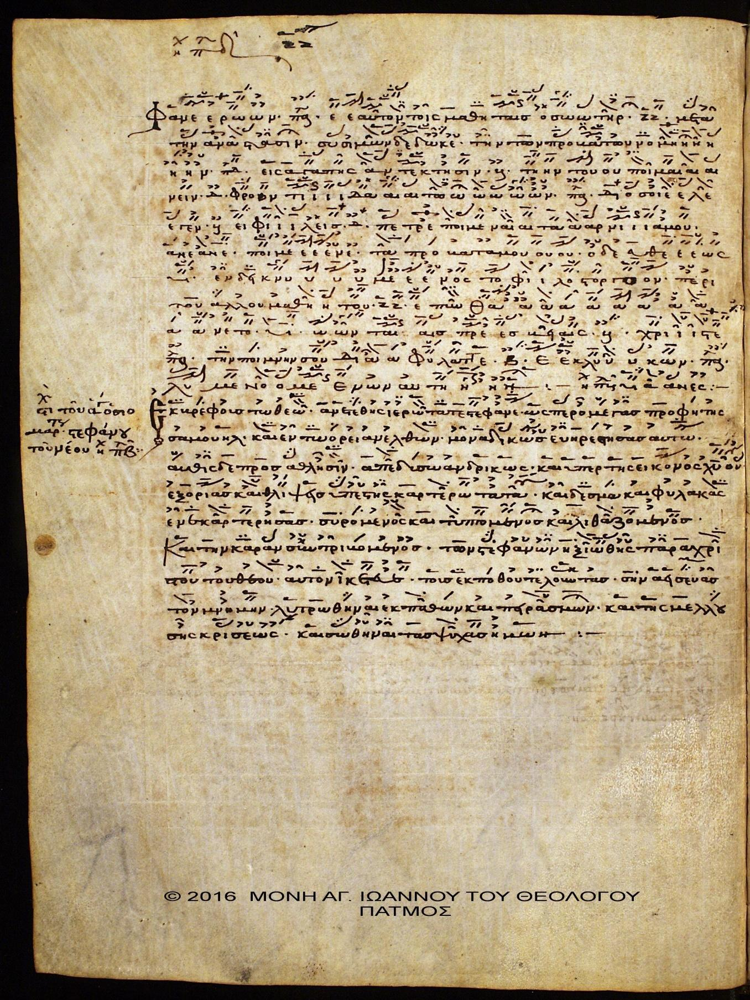

Figure 7.1. One of the oldest specimens of Middle Byzantine notation, from the Sticherarion Patmiacum 218, year
1166, fol. 132v, with the eleventh Eothinon by Emperor Leo the Wise, mode pl. IV nana, and a sticheron for the
Venerable Martyr Stephen the New, mode pl. II. © Holy Monastery of Saint John the Theologian, Patmos.i

Some of the manuscripts that may be regarded as milestones of Middle Byzantine
notation are the following three:

306

- Holy Monastery of St Catherine at Sinai, Sticherarion no. 1218, of the year 1177: it is the first

dated manuscript in which all the stichera are written in Middle Byzantine notation
(of a transitional stage, since a few remnants of Old Byzantine
neumatic notation also appear):ii see Figure 7.2,

• National Library of Greece no. 2458, of the year 1336: the first dated Papadike

(Akolouthiai), compiled by Saint John Koukouzeles, where also for the first time
the names of the composers of the kalophonic period are systematically mentioned: see Figure 7.3,

• Holy Monastery of Iviron on Mount Athos, no. 1250: Papadike, ca. year 1670, which contains the Trisagion

for the Dead, Athenian (Trisagion nekrosimon athinaiïkon), in an exegesis by Balasios the Priest, inaugurating the written tradition of
exegesis in Byzantine notation: see Figure 7.4.

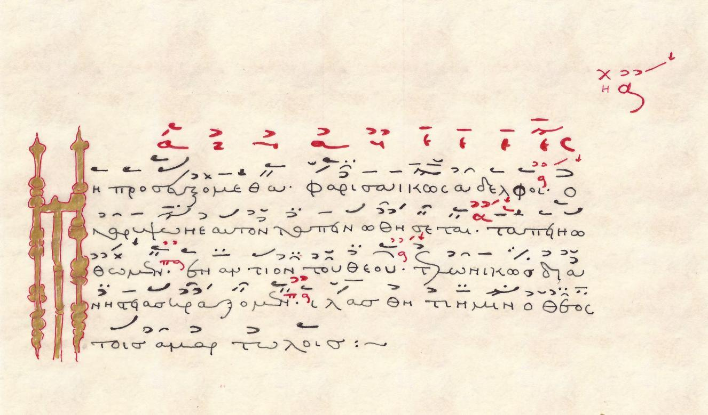

Figure 7.2. Codex of the Holy Monastery of St Catherine at Sinai, no. 1218, year 1177, fol. 155r, in copy, with the first
sticheron of the Triodion, “Let us not pray in a Pharisaic manner,” in the first mode. The Sinai 1218 codex is the oldest
dated codex with Middle Byzantine notation.
Source: The photograph of the original from which the copy was made is found in: Balageorgos &
Kritikou (2008, p. 30).iii

307

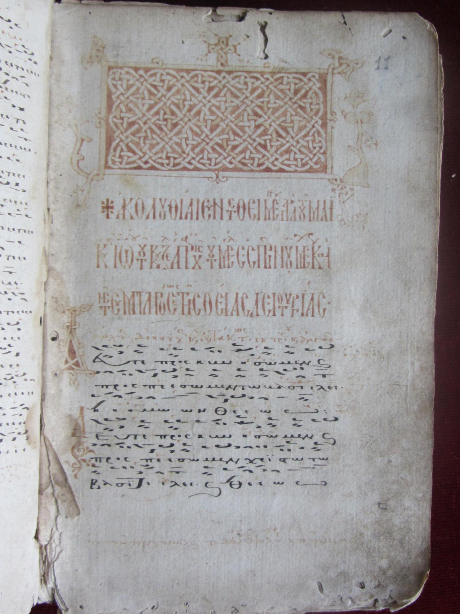

1. NLG 2458, fol. 11r, year 1336: the oldest dated Papadike, whose compiler was St John

Koukouzeles. Late Middle Byzantine notation. © National Library of Greece.iv

308

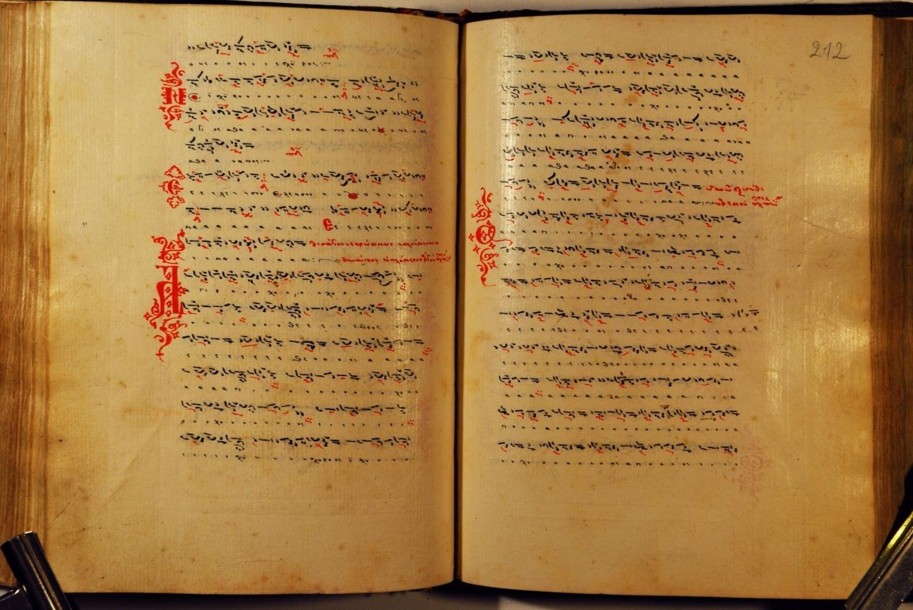

Figure 7.4. Holy Monastery of Iviron, no. 1250, fols. 211v-212r, autograph of Balasios the Priest, around the year 1670. On the left
is the “funeral Trisagion, called Athenian, sung slow,” mode pl. II nenano, in
late Middle Byzantine notation, and on the right “by the same, explained by me,” in the same mode, in Middle Byzantine exegetical
notation. © Holy Monastery of Iviron, Mount Athos.
Cf. also Stathis (2015, p. 920, for a previous publication of the image and information for the caption, and pp.

686-706 for the detailed description of the manuscript).

The researcher may find important specimens from various manuscripts of Middle Byzantine notation of different provenances and
evolutionary stages in: Chatzigiakoumis (1980), Troelsgård (2011, pp. 95-
116), Stathis (1975, 1976, 1993, 2015), idem (2006), Balageorgos & Kritikou (2008),
Giannopoulos (2008, 2005a, 2005b, 2016), Chaldaiakis (2005), etc. (see references below, section 6).

## 1.2. Significance and Main Characteristic

Between Old Byzantine and Middle Byzantine notation there intervenes a paradigm shift
in the history of notation (Ger. notationsgeschichtlicher Paradigmenwechsel).v
This change concerns the mode of encoding and the clarity of the musical information that
the new notation conveys in relation to the older. More specifically, Constantine
Floros emphasizes that
“In contrast to the Old Byzantine notations, Middle Byzantine
notation is diastematic. This means that it indicates the
intervallic relationships with great precision. This is not achieved with the aid
of a system represented by lines, but with the aid of signs that
determine its intervallic relationships. With the aid of specific
rules that govern these relationships, there is revealed in this notation
an astonishing transparency and an enormous wealth of representational shaping
and flexibility.”vi

309

The significance of this change was also highlighted by Oliver Strunk, father of
American Byzantine musicology, who stressed that from the period in which
Middle Byzantine notation took shape during the twelfth century,vii “and until the time of Chrysanthos, whose
first publication appeared in 1821, the notation used in the
tradition of Byzantine chant underwent no radical change. With the general acceptance
of the principle of diastematicity right from the beginning of this long
period, Byzantine musicians had taken a crucial step (a crucial step), a step
no less crucial than the corresponding one taken in the West a little earlier”
(the reference is to Guido d'Arezzo, ca. 1030). “And once this crucial step had been taken,
there was no longer any possibility of return. In the light of this historical moment, the
notational innovations of John Koukouzeles and his fellow maistores
and their successors are revealed as mere expansions of an already secured
system, prompted by the ever greater and more urgent
needs of a rapidly evolving musical style.”viii

## 1.3. Phases of Development

Although the next radical paradigm shift for Byzantine notation would take place with the
New Method in 1814/15, Middle Byzantine notation nevertheless underwent a quiet and continuous development between the twelfth and the beginning of the
nineteenth century. Research into this evolutionary course
has continued from the end of the nineteenth century to the present day, without yet having been completed. For this reason,
the various proposals mentioned below for division into individual phases in the development of
notation within these seven centuries constitute epistemological
tools still in formation, open to additions and revisions as research
on this subject advances in the future.
The palaeographical research conducted during the twentieth century and the beginning of the twenty-first century revealed the
fact that both Old Byzantine and Middle Byzantine notation change not only
diachronically but also synchronically, depending on the repertory being recorded at any given time.ix In
general terms, however, we could for the time being retain the following subcategories with regard
to Middle Byzantine notation, which is known in foreign-language bibliography also as
Round Notation:x

• Transitional, between Old Byzantine Hagiopolitan (Coislin VI) and Middle Byzantine (twelfth

century),

- early, developed, and fully developed Middle Byzantine notation (twelfth-fifteenth/sixteenth century),

- late Middle Byzantine notation (first half of the fourteenth-ca. mid-nineteenth century), especially formerly

known also as Kukuzelian notation.
For Middle Byzantine notation from 1175 to 1670 the term
Middle Full Byzantine Notation (Gr. Stathis) is also used.

• Exegetical Middle Byzantine notation (ca. 1670-1814/15 and in some manuscripts until the middle of the

nineteenth century). The exegetical use of MB notation, which appears in various, ever more numerous
manuscripts from 1670 until the Reform of the Three Teachers, may be
regarded—because of its particular importance for the more analytical recording of melos—and
as a distinct evolutionary period, under the name Transitional Exegetical Notation (Gr.
Stathis).

A rough sketch of the general characteristics of Middle Byzantine notation over the
course of the centuries could include the following:

 It is a diastematic notation, with various degrees of shorthand compression. This notation

shows clearly, through its so-called phonetic signs (emphona), the structural intervals of a
piece, what we may call the metrophonic structure of a troparion/hymn. Elements that
concerned the musical shaping of the piece (rhythm, embellishments at various levels, expression)
were realized according to the then-current performance practice of the Psaltic Art and were transmitted at the
written level through the great hypostases of cheironomy, and at the practical level through
cheironomy (the artful direction of the choir of chanters) and the art of oral musical exegesis.

310

- The musical and notational unit is not the isolated sign, but consists of the

sung syllable, since music is born from the text, according to E. Jammers.xi
Various theseis (θέσεις), that is, melodic figures with a characteristic structure
(intervals recorded with the phonetic signs and the ison), as well as with
a characteristic performance (rhythm, embellishments, expression), are adapted to the hymnographic text.
Many theseis are identified with special names in music-theoretical writings
(e.g. parakletike [παρακλητική], ouranisma [οὐράνισμα], etc.).

 As mentioned above, the boundaries between the individual stages of development of MB notation are not

absolute. The notation changes not only with the passage of time, but can also
differ among the various genera of Byzantine chant composition (e.g. the MB notation of the
Psaltikon includes in its soloistic chants certain special signs that do not appear in the other
musical collections). Nevertheless, we can observe some general tendencies:

- At the beginning, MB notation is very spare, especially when compared with the final stages of Old Byzantine

Athonite notation (Chartres III and IV).

- During the period of Kalophony (second half of the thirteenth-fifteenth century), with the contribution of St John Koukouzeles and

the other maistores, MB notation begins gradually to be enriched with various great
signs (the so-called aphona, or great hypostases, or signs of cheironomy), many of which
are written in red ink).
Some of these derive from Old Byzantine notation (especially from the Athonite). The difference between
fully developed MB notation and late MB notation lies in the increased number of aphonous signs
in the latter. The density of use of the great signs (in simple form or in various combinations
of aphona) increases ever more during the post-Byzantine period and reaches its peak during
the second half of the seventeenth-first half of the eighteenth century (First Flourishing after the Fall, or Renaissance of Byzantine music
[Chatzigiakoumis, 1999, pp. 41-66]).

 Already from the beginning of the sixteenth century there are written testimonies to the phenomenon of musical exegesis at the

theoretical level (Akakios Chalkeopoulos). Early stages of exegesis are also attested in
Slavic manuscripts with Kievan or partes notation, chiefly during the seventeenth and eighteenth centuries (see chap.

11). A long oral tradition of exegesis precedes this, perhaps from the fourteenth centuryxii or even

earlier. From around the year 1670 onward there is an intense effort within Byzantine
notation to give graphic form to the until then oral exegesis, through the ever more
analytical recording of the melos (= sonic result), especially of the papadic genus, and later
of other genera as well (sticheraric and heirmologic). Thus many more intervallic
signs (the so-called emphona and the ison) are used for the more accurate recording of the melodic movement of the
theseis, beyond their structural pitches, while by contrast many of the great signs are set aside,
since their melic content was recorded in greater detail.
On the basis of the exegetical tradition, MB notation appears as a refined and multilayered
shorthand system, in which the signs cannot be interpreted in isolation, but in relation to
their context (mode, melodic degree, genus, species, style, level of festivity, manner of performance
chorally or soloistically, poetic text, etc.). For the above reasons, D. Giannou called this
notation a 'context sensitive notation'.xiii Exegesis, that is, the traditional mode of
decoding the notation, may have various types/levels (“slow,” “short,”
even “syllabic” or “mixed” [Arvanitis]).xiv

 The Reform of 1814/15, which brings a second paradigm shift in the development of

notation, comes in essence as the culmination of a long series of efforts
oriented toward the simplification and perfection of MB notation, with the ultimate aim of the
analytical recording of the melodies and their easier teaching.

## 2. Tracing Middle Byzantine Notation - The Protheoria of the Papadike

The principal didactic music-theoretical text during the period in which Middle Byzantine
notation was in use was the so-called Protheoria of the Papadike.
The Protheoria of the Papadike, known in foreign bibliography simply as the Papadike, constituted
a flexible collection of short texts, tables, and didactic poems, all of which together served
as the basis of the musical preliminary training of chanters from the thirteenth to the beginning of the nineteenth century.

311

In other words, it was a corpus of notes, which was shaped together with the needs of
teaching, in relation to the development of the repertory. The Protheoria of the Papadike also constitutes
a reliable mirror of the development of Middle Byzantine notation and, more generally, of
music-theoretical thought.
The Protheoria has an extremely rich written tradition. There are, however, no two identical copies
of this text. Nevertheless, certain main categories and various versions
of them can be distinguished:

• A. The Protopapadike of the first developmental stages of Middle Byzantine notation,

versions of which were included in old Sticheraria, and

• B. the Protheoriai of the Papadike, which reflect and regulate late Middle Byzantine

notation. These were formed chiefly during the period of Kalophony, with the contribution of
maistores such as, for example, John Glykys, Saint John Koukouzeles, Xenos
Korones, John Kladas, Gregory Bounes Alyates, and they exist in a great
variety of versions, from shorter ones (3 folios) to very extensive ones (30 folios and more).
They are usually found at the beginning of codices of the Papadike or Anthology of the Papadike type.
During the post-Byzantine period, on the one hand the bulky Protheoriai are copied, and in part
enriched, sometimes assuming a monumental character; on the other hand there is also created

• C. a shorter version, with the most basic elements for preliminary training, which is also placed

at the beginning of Anastasimatarion manuscripts.

Below and in the next three chapters we shall examine various Protheoriai of the Papadike, for
the learning of the basic elements concerning Middle Byzantine notation.

## 2.1. The Protopapadikexv

The term Protopapadike was proposed by the Danish Byzantinomusicologist Christian Troelsgård, for the naming
of the older versions of the Protheoria, which accompany the teaching and the developmental course
of Middle Byzantine notation in its first stages. The various versions of the Protopapadike
deal in a very summary way with subjects concerning: a. the oktoechos (martyriai, lists
of apechemata) and/or b. the sign-sounds (sēmadophōna) of Middle Byzantine notation (categorization of signs and
corresponding lists, intervallic-metrophonic value of the phonetic signs, theseis).
Various versions of the Protopapadike have so far been identified in the following manuscripts:

• At the end of the Sticherarion of the Holy Monastery of St Catherine at Sinai, no. 1218 of the year 1177, fol. 271r, a list

of apechemata, by the main scribe, Nikephoros the Priest (Raasted), or by a later hand (thirteenth century,
Harlfinger et.al.),xvi

• in the St Petersburg fragment 495, which, according to Porphyrius Uspensky,

comes from the Sticherarion of Neophytos Hieromonk from Damascus (first half of the thirteenth century), fols. 1v-4v.
By the hand of Neophytos hieromonk (and domestikos) are also the parallagai of echemata in the Sticherarion
Sinai 1231 (year 1235/36), as well as the table with the metrophonic value of the signs of Middle Byzantine
notation in the manuscript of the Holy and Great Monastery of Vatopedi 1492 (year 1241/42). xvii

• In the Sticherarion Parisinus gr. 261 (year 1289), fols. 139v-140v: a list of signs of the papadic art,

categorization of the signs into phonetic and melic signs, the martyriai of the eight modes, with corresponding names
of ancient Greek harmoniai.xviii
Below we shall follow in the footsteps of the teacher Neophytos Hieromonk from Damascus,
in order to hear the first formulations of musical theory concerning Middle Byzantine notation:
see Figures 7.5.a-d. This theoretical text became more widely known through the edition of E.
Gertsman (1994, pl. LII-LVIII and pp. 229-240).

312

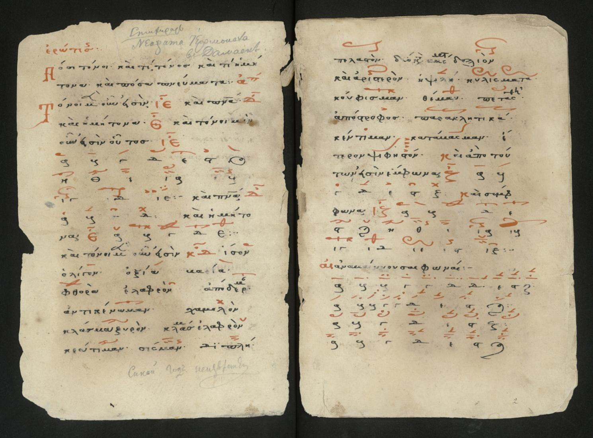

Figure 7.5.a. The Protopapadike according to codex Petropolitanus gr. 495 (fragment of a Sticherarion, whose scribe was Neophytos Hieromonk from Damascus),xix first half

of the thirteenth century, fols. 1v-2r. At the upper left is the Hagiopolitan classification of the signs, which concerns Old Byzantine notation. In the middle of fol. 1v (see the arrow
on the left) the list of the 24 tones of Middle Byzantine notation then begins. From the middle of fol. 2r there follows the early Middle Byzantine categorization of the
signs into emphona and symphona (see the arrow on the right). Below follows a list with the ascending voices. © National Library of Russia, St. Petersburg.

313

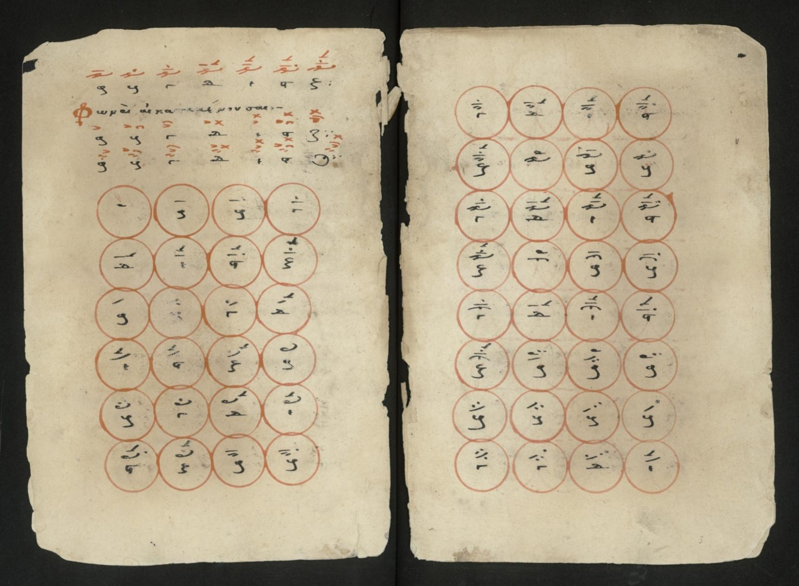

Figure 7.5.b. Protheoria of the Papadike from ms Petr. gr. 495, fols. 2v-3r, with the continuation of the ascending voices (upper left), after which follow the descending
voices, and an impressive table with the signs of Middle Byzantine music in little red circles, each time containing the shape of the signs and the indication of their
intervallic value, with Greek numerals. © National Library of Russia, St. Petersburg.

314

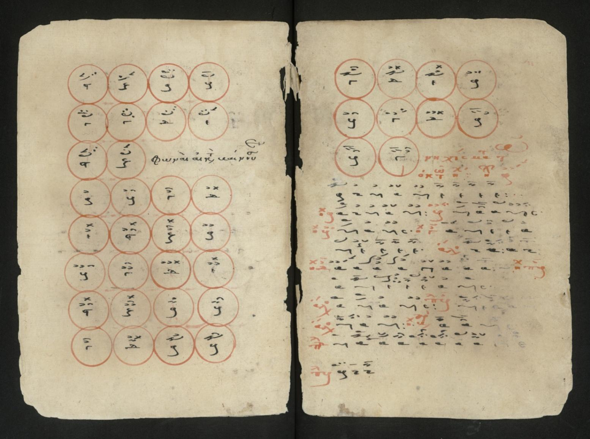

Figure 7.5.c. Continuation of the Protheoria of the Papadike from ms Petr. gr. 495, fols. 3v-4r, with the completion of the table of the metrophonic value of the Middle Byzantine
signs. From the middle of fol. 4r there follows a list of apechemata, with the title: “intonations of the eight modes.”

- © National Library of Russia, St. Petersburg. 315

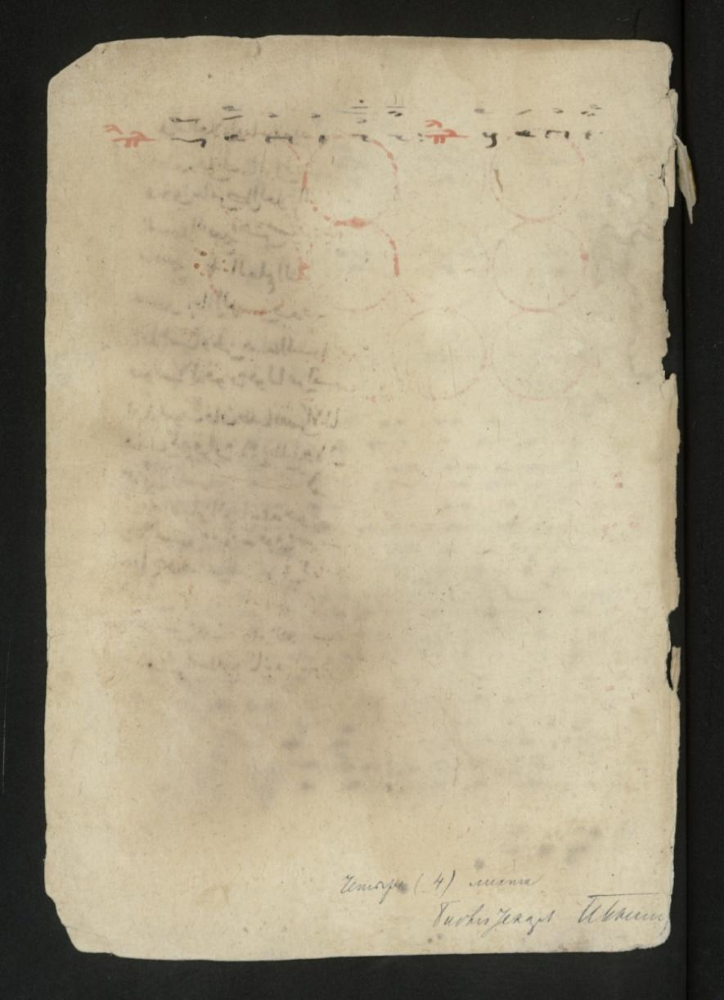

Figure 7.5.d. End of the Protheoria of the Papadike from ms Petr. gr. 495, fol. 4v, with the “intonations” of the plagal fourth mode.

© National Library of Russia, St. Petersburg.

316

## 2.2. Studying Late Forms of the Protheoria of the Papadike

## 2.2.1. Contents of the Protheoria of the Papadike

During the 14th century, the Protheoria underwent many changes, until, from the beginning of the 15th century
onward—at least with regard to its first part, which includes short excerpts of theoretical
text and lists of signs—it settled into several more stable forms. On the basis of preparatory studies by

J. Raasted for a critical edition of the Protheoria, four related types (A-D) can be distinguished

for its first part. A synoptic account of the various elements that may
appear, often in a different order, in Protheoriai of the Papadike from the 14th to the early 19th century,
is given in Table 7.1:

|I. Theoretical part of the Protheoria, based on the preparations for a critical edition by J. Raasted|
|---|
||
|i. Title (with variations by type)|
|Separate signs|
|ii. of the ison|
|iii. The and|
|Emphona|
|iv. List of emphona signs|
|v. Division into somata and pneumata|
|vi. Intervallic value (metrophonia)|
|vii. Summary concerning the emphona|
||
|viii. List of aphona signs|
|ix. Phthorai|
|x. of the|
|xi.|
|Oktoechos|
|xii. Mesoi of the authentic modes|
|xiii. and and|
|xiv. Plagal modes: ancient Greek names|
|xv. names of apechemata and initial martyriai|
|xvi. of the|
|Signs in combinations|
|xvii. Short cheironomic exercise|
|xviii. ascending and descending|
|xix. The|
|II. Practical part of the Protheoria: includes lists of apechemata and a great variety of didactic methods (e.g. the Mega Ison of St John Koukouzeles), as well as diagrams (wheels and the tree of parallage, etc.).|

Table 7.1. General outline of contents for Protheoriai of the Papadike, 14th–early 19th c.xx

317

## 2.2.2. Late Middle Byzantine classification of signsxxi

We saw in the Protopapadike of Hieromonk Neophytos (Petr. gr. 495) that the 24 Middle Byzantine
neumes, under the general designation tonoi, presented two subcategories:
emphona and
symphona (Figure 7.5.α.).

This is a complete analogy with the 24 elements of the Greek alphabet and the two categories
of letters, vowels and consonants.
In the late versions of the Protheoria, the corresponding categories of signs are differentiated and
branch as follows:
emphona (with the subcategories: somata and pneumata),
aphona or great signs or great cheironomic hypostaseis,
argiai and
phthorai (the latter initially fewer in number and incorporated into the list of great signs).

An important Protheoria from ms. no. 338 of the Holy Monastery of Docheiariou on Mount Athos (an Anthology
written in the year 1767 by Dimitrios Lotos “from the island of Chios”, the Protopsaltes of Smyrna),xxii gives us
the opportunity to trace the fundamentals of the theory of Psaltike roughly five decades before the
Reform of the Three Teachers: see Figures 7.6.α-θ.

318

## I

## i

1.

2.

3.

## v

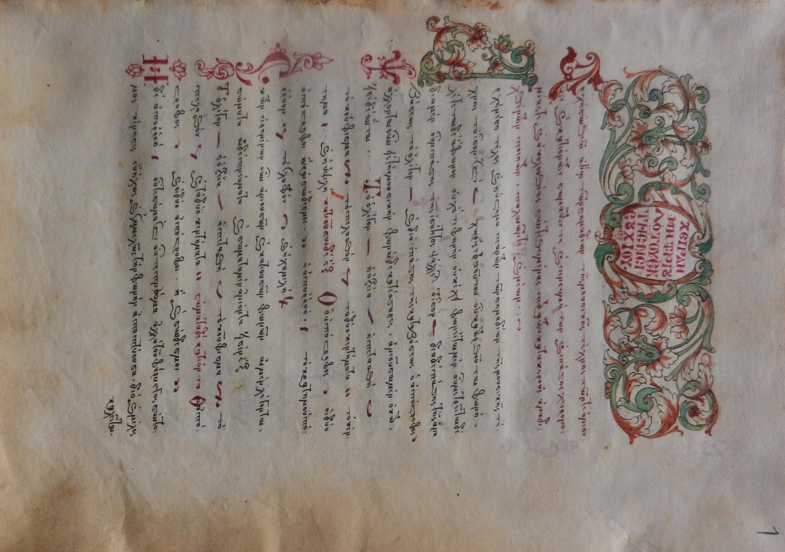

Figure 7.6.a. Protheoria in the manuscript of the Holy Monastery of Docheiariou no. 338, autograph of Demetrios Lotos, year 1767, fol. 1r. Beginning of the
theoretical part of the Protheoria. The Roman numerals at the far right refer to the constituent elements of the
Protheoria, as noted in Table 7.1. Cf. also Stathis (1975, p. 406). © Holy Monastery of Docheiariou, Mount Athos.

319

## vi

## vii

## xix

## ix

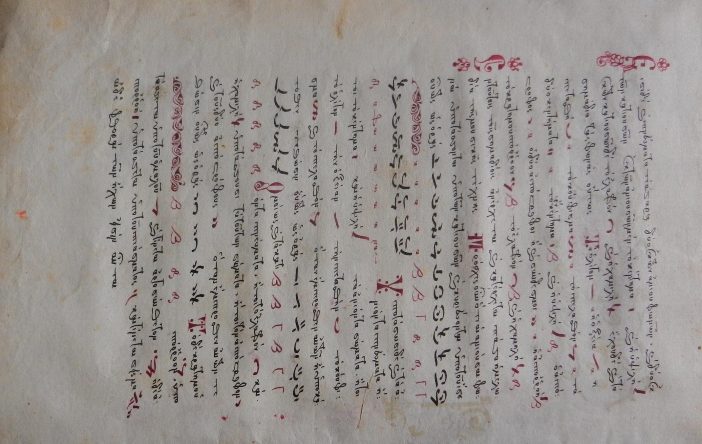

Figure 7.6.b. Docheiariou 338, autograph of Demetrios Lotos, year 1767, fol. 1v. Continuation of the theoretical part of the
Protheoria. © Holy Monastery of Docheiariou, Mount Athos.

320

## xi

## viii

## xii

## xviii

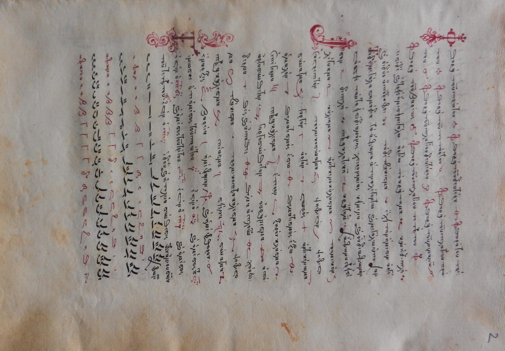

Figure 7.6.c. Docheiariou 338, autograph of Demetrios Lotos, dated 1767, f. 2r. Continuation of the theoretical part of the
Protheoria (Προθεωρία). © Holy Monastery of Docheiariou, Mount Athos.

321

## II

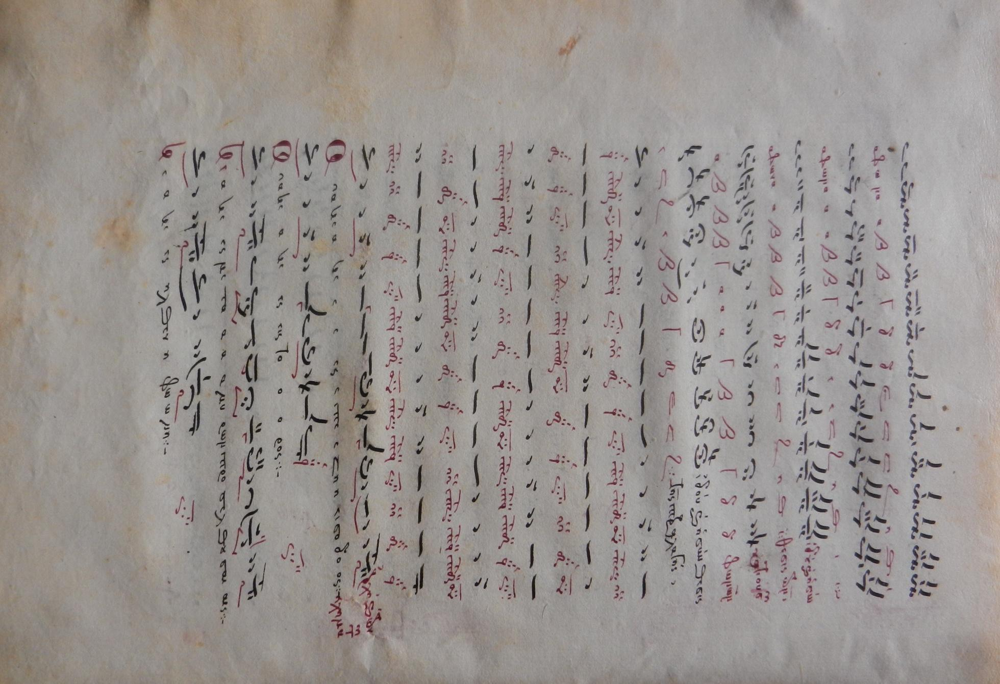

Figure 7.6.d. Docheiariou 338, autograph of Demetrios Lotos, dated 1767, f. 2v. Completion of the theoretical part of the
Protheoria and beginning of the Practical part: parallage exercises, intonation formulas (apechemata).

© Holy Monastery of Docheiariou, Mount Athos.

322

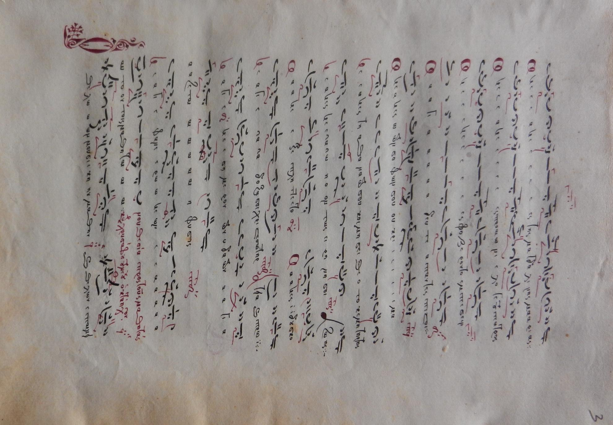

Figure 7.6.e. Docheiariou no. 338, autograph of Demetrios Lotos, dated 1767, f. 3r. Continuation of the practical part of the
Protheoria: completion of the list of intonation formulas and beginning of the Nouthesia (Admonition) of Chrysaphes the New, in an eight-mode version. ©

Holy Monastery of Docheiariou, Mount Athos.

323

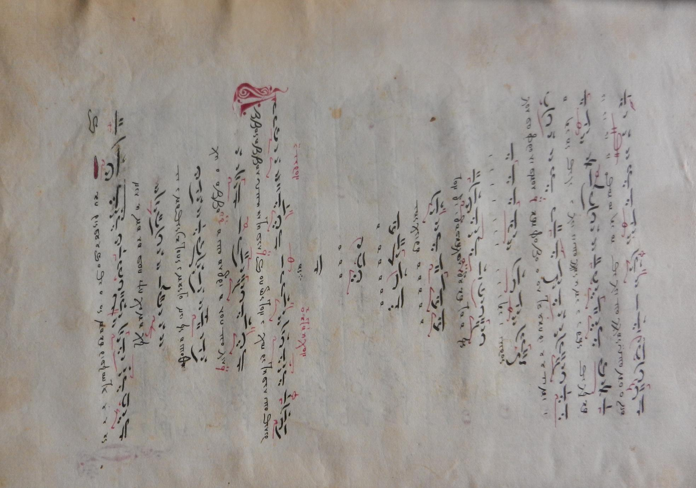

Figure 7.6.f. Docheiariou no. 338, autograph of Demetrios Lotos, dated 1767, f. 3v. Continuation of the practical part of the
Protheoria, with the completion of Chrysaphes’ Nouthesia and the beginning of the eight-mode Method “An abba met an
abba.” © Holy Monastery of Docheiariou, Mount Athos.

324

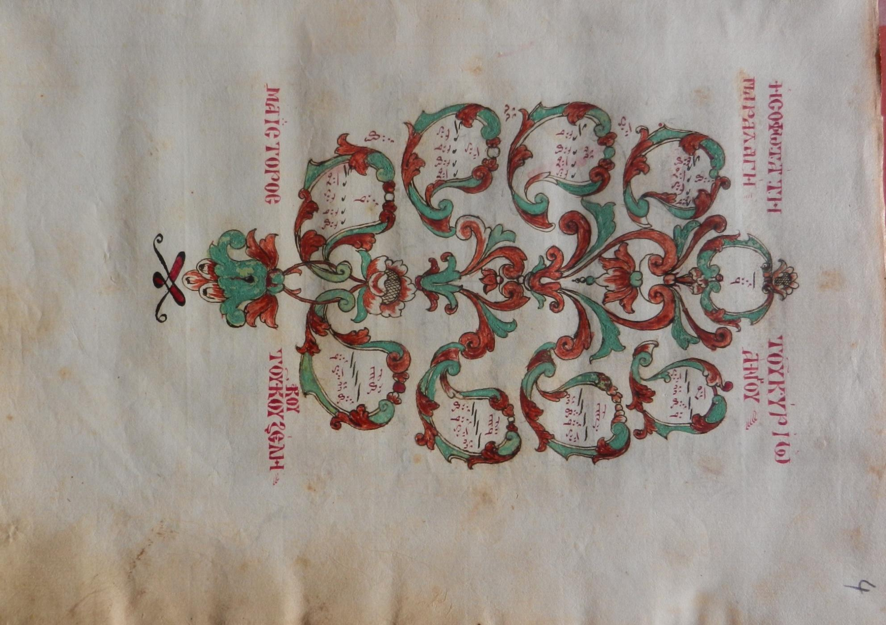

Figure 7.6.g. Docheiariou no. 338, autograph of Demetrios Lotos, dated 1767, f. 4r. Continuation of the practical part of the
Protheoria, with the diagram of the Tree of Parallage by Saint John Koukouzeles. © Holy Monastery of Docheiariou, Mount
Athos.

325

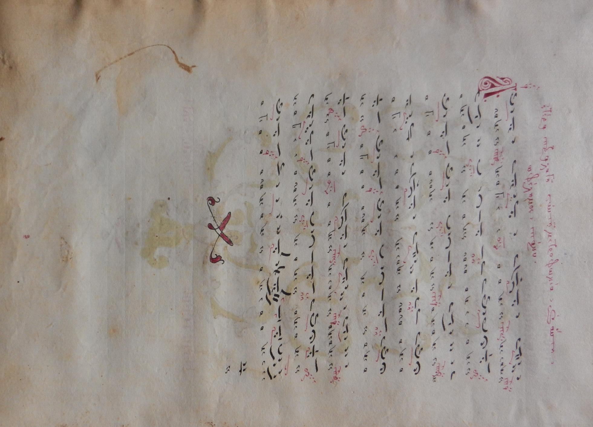

Figure 7.6.h. Docheiariou no. 338, autograph of Demetrios Lotos, dated 1767, f. 4v. Continuation of the practical part of the
Protheoria, with a method of parallage & metrophony (μετροφωνία). © Holy Monastery of Docheiariou, Mount Athos.

326

## xiv

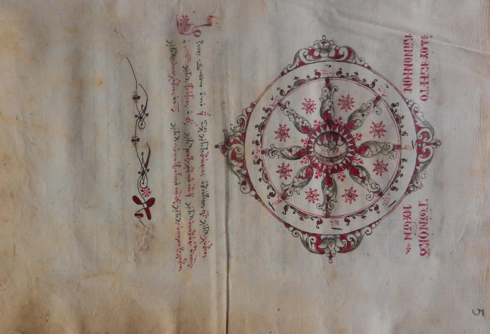

Figure 7.6.i. Docheiariou no. 338, autograph of Demetrios Lotos, dated 1767, f. 5r. End of the practical part of the
Protheoria, with the Kanonion (Κανόνιον) of the eight modes. Beneath the diagram are added the ancient Greek names of the modes
(element xiv of the theoretical part, according to Raasted’s numbering). © Holy Monastery of Docheiariou, Mount Athos.

327

## 3. The Signs of Middle Byzantine Notation

Having seen above an important specimen of a Protheoria of the Papadike (Παπαδική) from the late post-Byzantine
period, we shall turn back to a corresponding Protheoria from the codex Vaticanus Barberinus graecus
300, ff. 2r-4v (15th c.), which has already served as an aid for palaeographical research, e.g. that of Fr. Lorenzo
Tardoxxiii and of Constantin Floros. The latter published it in facsimile plates,xxiv on the basis
of which the signs of Middle Byzantine notation will be presented below, in conjunction with
corresponding sections from other Protheoriai: Tables 7.2-8 and Figures 7.5.-8.

## 3.1. The Voiced Signs of Middle Byzantine Notation

We begin with the voiced signs, that is, the neumes that record the intervals of the pieces:
Table 7.2.

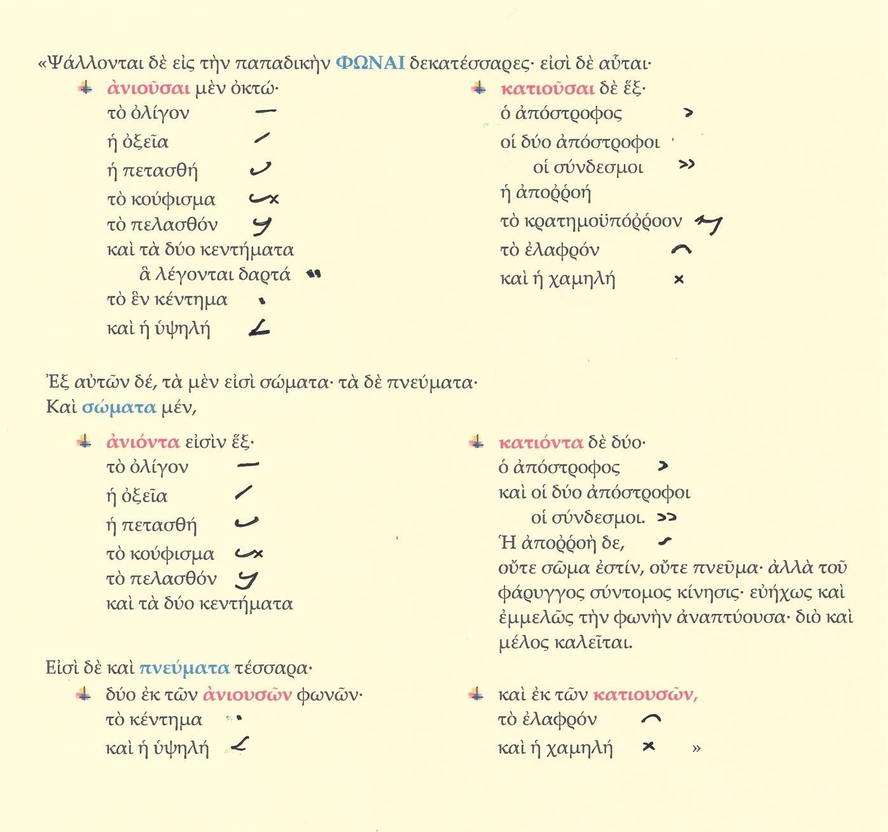

Table 7.2. The fourteen “voices” (here in the sense of voiced signs) of Middle Byzantine notation,
ascending & descending, bodies & spirits, according to the Protheoria of the Papadike Vatic. Barb. gr. 300, fols. 2r-3r.
Source: The present copy is based on Floros (1970, vol. III, facsimiles 3-6).

Each of the above signs has an intervallic value, which is shown in the following
Table 7.3.

328

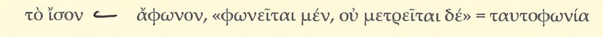

Ascending phōnai
Bodies (intervals of a second)

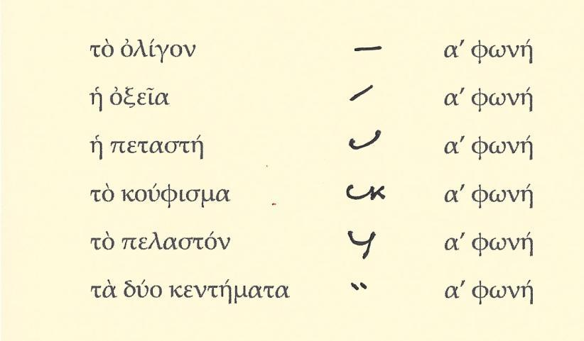
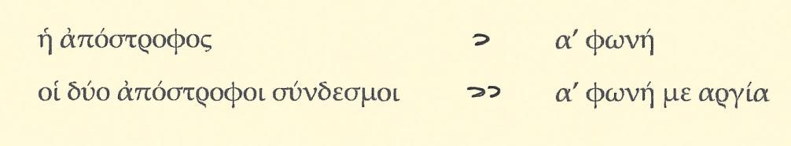

Descending phōnai

Neither bodies nor spirits

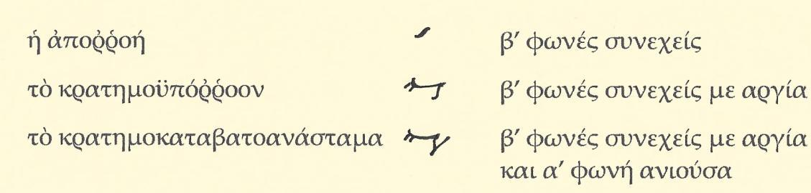

Spirits (leaps)

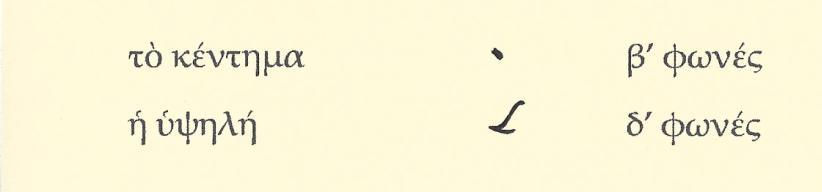
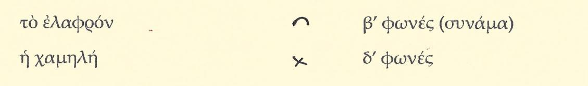

Table 7.3. The metrophonia, or the quantity, of the voiced signs according to the teaching of the Protheoria of the Papadike. The unit of measurement for intervals
is the phōnē = interval of a second. The size of one phōnē depends on the mode and on the degrees between which the interval is formed. One

329

phōnē, then, constitutes the interval of a second, β΄ phōnai the interval of a third, γ΄ phōnai the interval of a fourth, and so on. For pedagogical reasons we have
also included the ison in the present table, although in the Protheoriai of the Papadike it is not included among the voiced signs, but among the aphonic ones.xxv

The various voiced signs are combined with one another in various ways, in order to form all the intervals, simple and compound, that
are needed for the notation of chant. In most late protheoriai of the Papadike there are corresponding tables, e.g. in ms. EBE 2401
from the first half of the 15th century (see Figures 7.7.a-b):

Figures 7.7.a-b. Lists with the metrophonic
value of the signs of Middle Byzantine
notation, from the Protheoria of the
Papadike in ms. EBE 2401, 15th c.,xxvi

1. fols. 13r-v.

- © National Library of Greece, Athens.

Left (fol. 13r): the heading of the list
is: Ҡ With holy God, the beginnings of the
ascending phōnai.”

 Right (fol. 13v), in the left margin of the

manuscript the descending
signs are introduced by the rubric:
“the descending phōnai are as follows.”
Then follow “the ascending with
the descending” (see the rubric in the
right margin), and a little below
it is noted that
“the ascending subject the
descending” (see right margin).

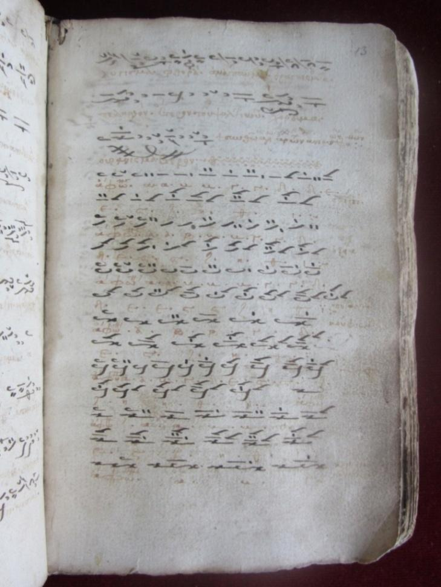

330

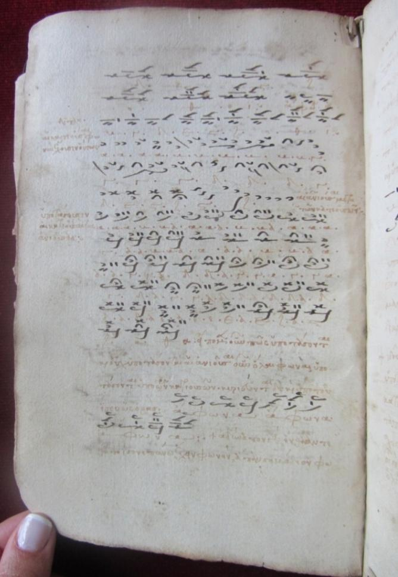

In the lists of the Protheoria of ms. EBE 2401 we saw a large number of combinations with voiced
signs, and with some great signs such as the kratēma, the kratemokouphisma (last line of fol.
13r) and the diplē. One naturally wonders what the rules are for combining the signs with one
another in order to form the various intervals. Below there is a concise account of the principles
for combining voiced signs, in the form of five rules (see Table 7.4):

|The importance of gesture in shaping orthographyxxvii * Cf. Apostolopoulos (2002, p. 95). ** See especially Gabriel Hieromonk (ed. Hannick & Wolfram, lines 154-155).|
|---|
|The placement of the voiced signs and the phenomenon of subordination|
|Ascending bodies in combination with descending voiced signs and with the ison|

331

|Composition of two ascending bodies|
|---|
|The two kentēmata|

Table 7.4. Basic principles for combining the voiced signs of Middle Byzantine notation, for the notation
of various intervals, with various operations.xxviii

The various combinations of signs are based on these basic principles; the next Table (7.5) shows them, and with its help we shall later proceed to the study
of musical pieces in Middle Byzantine notation.

332

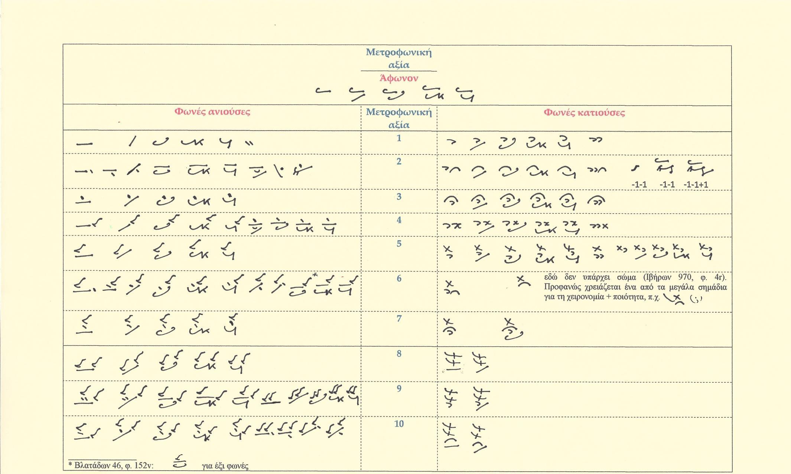

Table 7.5 General table with the metrophonic value of the voiced signs of Middle Byzantine notation and with the ison.xxix

333

## 3.2. The Aphonic Signs of Middle Byzantine Notation: a First Look

The voiced signs were those neumes of Middle Byzantine notation that were related
primarily to the structural level of a piece, i.e. to its quantitative dimension (Ger. Struktursinn),
measured in phōnai. The great signs constituted the category of signs that concerned
the qualitative substance of the piece, the level of musical performance (Ger. Aufführungssinn).xxx
The operations of the great signs concern:

-  rhythm,

-  various levels of embellishment and/or transformation of the metrophonic structure of the piece, which

is recorded with the ison and the voiced signs, as well as

 musical expression.

The principal aid to psaltic performance in Byzantine times and until approximately the first half of the 17th
century was the art of conducting, which was called cheironomia.
Whereas the Protopapadike of Neophytos Hieromonk (Petr. gr. 495), which presents an early
Middle Byzantine categorization of signs, presents only 17 shapes in the group of symphōna, the
corresponding section of great signs in the late Middle Byzantine categorization of signs
usually includes around 40 shapes, together with their names. The list of great signs
always begins with the ison. The reason is explained to us by the first paragraph of the Protheoriai, which in ms.
EBE 2401 has the following wording (see Figure 7.8):

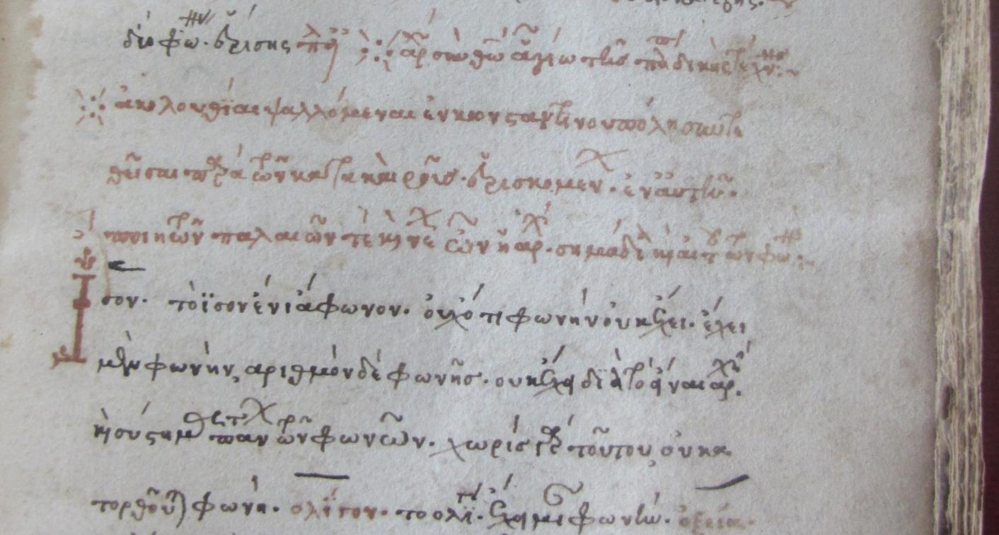

Figure 7.8. The beginning of the Protheoria of the Papadike from ms. EBE 2401, 15th c., fol. 11r. © National Library of
Greece.

From the paragraph on the ison it becomes clear that the concept of the aphonic in the theory of the Psaltic Art does not
concern elements that are not heard, but aspects of musical becoming that are indeed heard,
but are not measured by the unit of the phōnē (interval of a second). In other words, the aphonic signs
are placed beyond the basic calculation of phōnai, which constitute the melodic skeleton of a
piece and are recorded by the voiced signs.
The list of great signs continues with various shapes and names of neumes, as
can be seen, for example, in Table 7.6, which is based on the Protheoria of the Papadike of ms. Vat. Barb. gr.
300, fol. 4v.

334

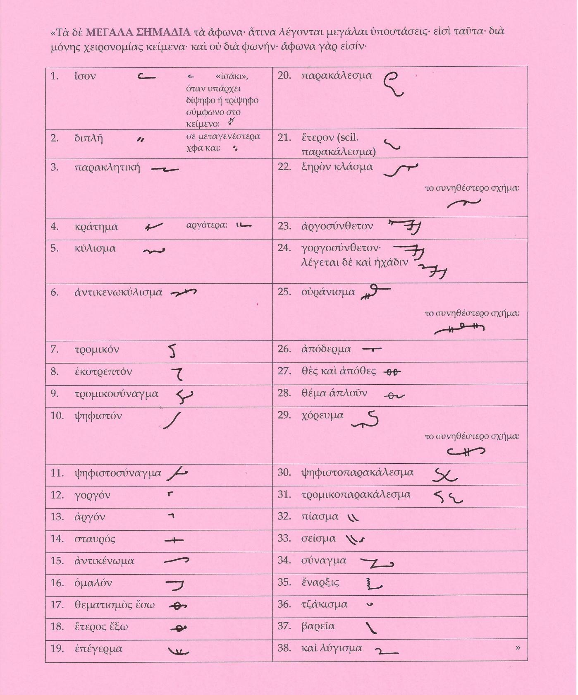

Table 7.6. List of great signs from the Protheoria of the Papadike of ms. Vaticanus Barberinus graecus 300,

fol. 4v. Source: The present copy is based on Floros (1970, vol. III, facsimiles 7-8). The most common

shapes have been added for some signs, which in Barb. gr. 300 are presented in more specific forms. Some later shapes have also been supplied, which differ from those customary in the Byzantine and early post-Byzantine period.

Some signs from the list of great hypostases, which are especially associated with rhythm,
and more specifically with various forms of delay, reappear, together with the two apostrophoi, the syndesmoi
from the category of voiced signs, in a special group known as “argiai”
(the accentuation of the word on the penult, “argíes,” is also customary): see Table 7.7.

335

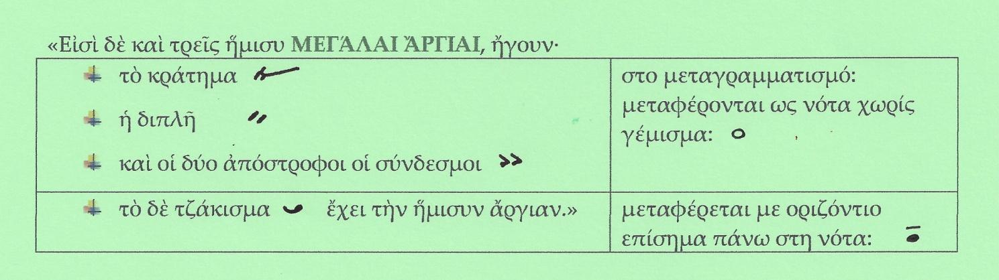

Table 7.7. The group of argiai from the Protheoria of the Papadike of ms. Vaticanus Barberinus graecus 300, fol.
4r. Source: The present copy is based on Floros (1970, vol. III, facsimile 7).

Finally, another small group may be formed, especially from the 15th century onward, with the
phthorai: see Table 7.8.

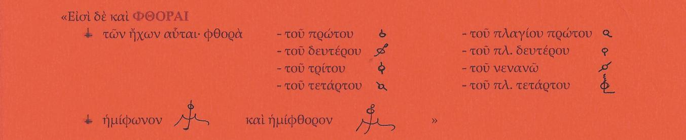

Table 7.8. The group of phthorai from the Protheoria of the Papadike of ms. Vaticanus Barberinus graecus 300, fol.
3r. Source: The present copy is based on Floros (1970, vol. III, facsimile 6).

## 4. Methodology for the Study of Middle Byzantine Notation

Once the signs of Middle Byzantine notation have been learned, the
palaeographical study of individual troparia and hymns may begin, in two cycles:

1. First acquaintance with the piece, for which the following working steps are proposed:

A. General overview of the piece:

-  Reading and understanding the poetic text,

-  division into musico-poetic units, based on the meaning of the text and with the help of punctuation marks

and martyrias.

1. Study by musico-poetic phrase:

-  Copying the text and signs, with their simultaneous identification,

-  chanting the isons and the voiced signs of the piece, on the basis of which the

intervallic skeleton or, in other words, the metrophonic structure of the specific troparion or hymn is recorded. Alongside
the chanting, and in order to facilitate the palaeographical study of the old notation,
a transfer of the intervals may be made below each musico-poetic phrase onto the staff or
into a special alphabetic system, as shown in the following sections.
II. Deepening the study of the piece by seeking its musical exegesis in the transcriptions
of the Three Teachers and other exegetes, a topic that will concern us mainly in chapters
10 and 11.

## 4.1. Transfers of Voiced Signs onto the Staff or into an Alphabetic System: Possibilities and Limits

## 4.1.1. On Terminology: Transcription versus Transnotation

Byzantine music is par excellence a tradition in which the oral element is the sine qua non for
its correct learning (see Figure 7.9).

336

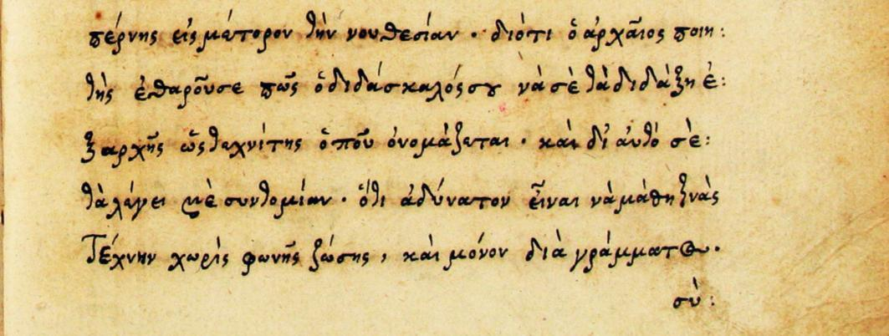

Figure 7.9. Excerpt from the anonymous theoretical text of ms. EBE 968, fol. 117r, 17th-18th c. (Zannos): “for
the ancient composer trusted that your teacher would teach them to you from the beginning, as the craftsman he is called;
for it is impossible for anyone to learn an art without a living voice, and by writing alone.” © National
Library of Greece.

For the above reason, a palaeographical study finds its completion when
it has also listened to the oral tradition.
A basic tool of the musicologist-palaeographer consists of transcriptions. The transcriptions that
are used today in Byzantine Musicology are of various kinds and may be
classified into categories, depending on the system into which they are made and on the level at which
the oral tradition is or is not taken into account: see Table 7.9.

|||and|
|---|---|---|
||Neo-Byzantine|Transcription into the analytical notation of the New System.|
|system into which the transfer is made|Staff|Transfer of Middle Byzantine notation onto the staff (see also below).|
||Alphabetic|Rendering of the isons and the voiced signs of Middle Byzantine notation with letters of the Latin alphabet.|
|Reference, or not, to the oral tradition. The article "Transcription" by the ethnomusicologist Ter Ellingson provided the impetus for the terminological differentiation of the various kinds of transcription of Byzantine music (see 1992, p. 111).|transcription proper (transcription)|It is made when the oral tradition is also taken into account.  In the terminology of the Psaltic Art, the exegeseis of the Three Teachers and their successors, from the stenographic Middle Byzantine notation into the analytical notation of the New Method, are called transcriptions.  In the case where transcriptions proper are made on the staff, more levels of clarity may be distinguished: a. schematic transcription: when only pitches & rhythm are rendered,|
|||b. the detailed transcription constitutes a “protocol” of a specific performance, with the notation of all details (embellishments, attractions, fluctuations of tempo, etc.),|
|The term metagrammatismos is also used in Codicology. A. Dain defines it as “the passage from one alphabet to another” (Dain, 1964, pp. 164-165 and Raasted, 1972, p. 775).|transnotation (transnotation)|c. combination of schematic and detailed transcription. It is carried out when the transfer of symbols from Middle Byzantine notation into another graphic system is made only on the basis of the notation and the theoretical texts, without taking the oral tradition into account. The two forms of transnotation more widely used today are: a. staff transnotation (open, with pitches only, without indication of rhythm and other elements of the oral tradition), b. alphabetic transnotation. (For more information, cf. Alexandrou, 2010, section 3.1).|

Table 7.9. Types of transcriptions from Middle Byzantine notation: an open list.

337

The formation of various kinds of transnotation as a scholarly tool for the study of
the Christian medieval chant of the East is due to foreign scholars such as H. Tillyard, K.
Levy, E. Jammers, J. Raasted, H. Husmann, M. Haas, and others.xxxi

## 4.1.2. Basic Principles of Alphabetic Transnotation

Alphabetic transnotation was widely disseminated through the studies of J. Raasted during the decades 1960-
1990. Referring to the Latin medieval theorist Pseudo-Odo, the Danish musicologist considered
that the alphabetic transnotation of Middle Byzantine notation could function rather as a
substitute solfège, and not as an indication of absolute or relative pitches:xxxii see Figures 7.10.-12.

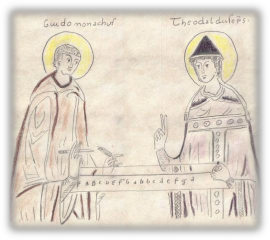

Figure 7.10. Copy of a miniature from ms. Vienna 51, fol. 35v, with Guido d'Arezzo and Bishop Theodal,
to whom Guido dedicated his famous handbook "Micrologus" (ca. 1026-1028). On the monochord that
they hold are inscribed the notes of the tonal system of Pseudo-Odo (Anonymous of the early 11th century, author
of the theoretical Dialogus de musica), which Guido Aretinus also adopted.
Source: the copy of the miniature and the caption are based on Atkinson (2009, cover, pp. 212, 228-229, with
n. 78).

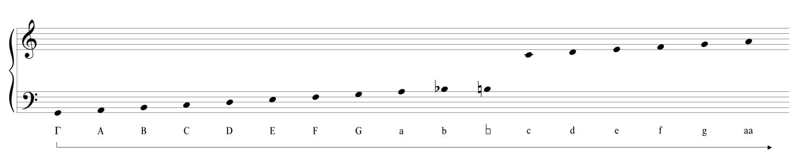

Figure 7.11. The alphabetic system of Pseudo-Odo/Guido d'Arezzo. The note Zo appears as b molle (with
a round form, "b rotundum", corresponding to flattened Zo) and b durum (with a squared form, "b quadratum",
corresponding to natural Zo).
Source: Atkinson (2009, p. 212 with ex. 6.9 and p. 214).

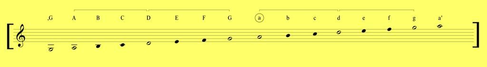

Figure 7.12. The alphabetic transnotation system of Middle Byzantine notation and corresponding notes on the
staff. In the low register capital letters are used (A-G), while in the high register lowercase letters are used (a-g). In
the present work we shall use the symbol h for natural Zo΄, and the symbol b for lowered Zo΄.xxxiii

338

## 4.1.3. Historical Notes on Transnotations

Between the third and fifth decades of the 20th century (until 1958), the collaborators of the Monumenta
Musicae Byzantinae of Copenhagen had issued the series Transcripta, in which large
strata of the Byzantine repertory were published in staff notation: see a sample in Figure 7.13.

## Sticheron for the Entry into the Temple of the Most Holy Theotokos, transcribed into staff notation according to the transcription principles of the MMB

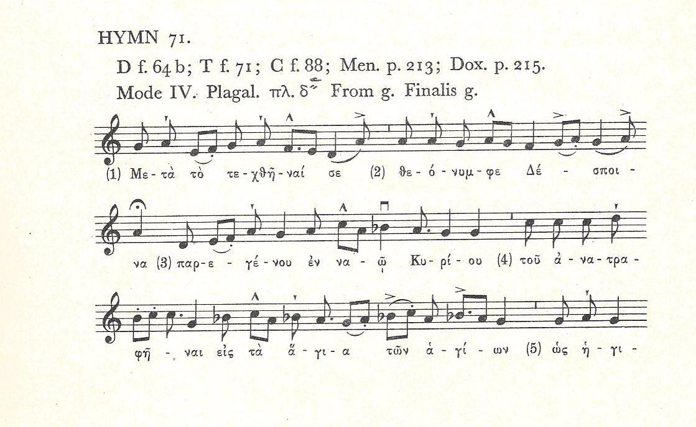
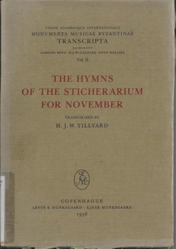
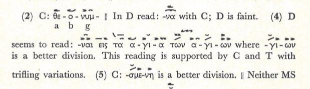

pp. 126-127

Figure 7.13. A sample from the Transcripta series of the Monumenta Musicae Byzantinae, with transcriptions into
staff notation by H.J.W. Tillyard (1938). At the bottom a critical apparatus can be seen for the sticheron
“After you had been born.”

The Transcripta series of the MMB essentially presents transnotations with an indication of free
rhythm and with specified shapes for transferring the ison, the sounded signs, and some
unsounded signs into staff notation. The rules for transferring the neumes of Middle Byzantine
notation into staff notation for the Transcripta series are codified in Tillyard’s book,
Handbook of the Middle Byzantine Musical Notation (1935), a handbook that enjoyed very wide
circulation in the Western world. This particular manner of transnotation allows the reader who
knows well the MMB rules for transfer into staff notation to recognize, behind each note, the
corresponding sign of Middle Byzantine notation. The interpretative model on which these
transcriptions are based is shown schematically in Figure 7.14.

339

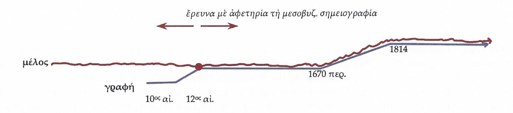

Figure 7.14. Initial model for the interpretation of the Old Method according to the MMB (up to the 1950s),
which reflects the view that Middle Byzantine notation is already analytic and not
stenographic.xxxiv

However, the maturation of musicological reflection on the importance of oral tradition in the study of
old Byzantine music, and the recognition of various degrees of stenographic character in it, gradually led
to a reconsideration of the entire transcription project (Raasted,
1986) and to a preference for alphabetic transnotation as a research tool. From the
multidimensional Middle Byzantine notation, only the ison signs and the
sounded signs are transferred into the alphabetic system, on the basis of the teaching of the Protheoria of the Papadike; that is, only the backbone of the
piece and not its melos, while the elements that concerned the level of performance (rhythm, embellishment
at various levels, expression) are left out, since they were transmitted through the oral tradition of the
period.xxxv The alphabetic form of transnotation is practical, occupying only a little space and
at the same time facilitating musicological analyses with the aid of computers (e.g. statistical
analyses of the number of occurrences of various pitches or formulae, etc.).
From the last decade of the twentieth century, however, a new, open form of
staff transnotation began to prevail, less abstract than the alphabetic one, in which only the pitches
are indicated on the staff, with black notes. For the major lengthening signs, white
notes are used conventionally. As in alphabetic transnotation, neither the rhythm of
Middle Byzantine notation nor the remaining elements that concerned the level of performance are
transferred into staff notation. Various scholars add legati to indicate groups of pitches that together form various
melodic theseis (e.g. the tromikon, etc.: see Troelsgård, 2011).

## 4.1.4. Basic principles of open staff transnotation

In the exercises and musical examples with Middle Byzantine notation in the present handbook
we use both modern kinds of transnotation: alphabetic and new staff transnotation.
The latter method is based on the following:

 Only the pitches are transnotated onto the staff, as recorded by the ison and by the sounded signs of Middle Byzantine notation.

 For the transnotation of the aforementioned signs, filled notes without stems are used: Fig. 7.15.1.

 The so-called major lengthening signs: the diplē, the two linked apostrophoi, and the kratema, are conventionally transferred into staff notation as unfilled notes (white notes): Fig. 7.15.2.
The compound signs that contain the kratema are transnotated similarly, that is:

-  the kratemohyporrhoon,

-  the kratemokatabatoanastama,

-  the argosyntheton: Fig. 7.15.3.-5.

- The small klasma (tzakisma), which according to the Protheoria of the Papadike constitutes a half-lengthening sign, is transnotated with a black note, with a small line above it (horizontal episema): Fig. 7.15.6.

340

## 1. For the ison & the sounded signs

## 2. On the great retardations (argiai)

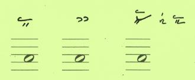

## 3.-5. On the signs that contain the kratema (κράτημα)

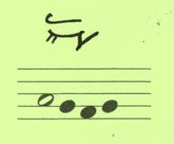
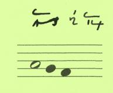

## Kratēmo-hyporroon (κρατημοϋπόρροον) Kratēmo-katabatoanastama (κρατημοκαταβατοανάσταμα)

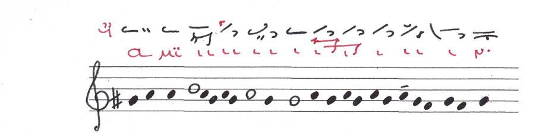
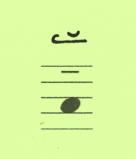

## 6. On the klasma (κλάσμα)

## argosyntheton (αργοσύνθετον)

Figures 7.15.1-6. Possibilities for staff transcription of the emphona (vocal signs) and the argiai (lengthening signs).

 For the apostrophos (απόστροφος) that is placed before the elaphron (ancestor of the continuous elaphron of the New Method)

a small passing note is conventionally used: Fig. 7.15.7.

 The hyporrhoe (υπορροή), which is subordinated to the piasma (πίασμα), creating the seisma (σείσμα), is conventionally transcribed with

two small-size sixteenth notes:xxxvi Fig. 7.15.8.

 At points where the poetic text has a double or triple consonant, from the era of Kalophony and

until the Reform of the Three Teachers, the use of a small ison
(“isaki”xxxvii) with or without a gorgon (γοργόν), before the main emphonon sign of the particular syllable, is often observed. Sometimes,
instead of a small ison there is an apostrophos, followed by the ison in normal or small form. These
signs may be represented, conventionally, on the staff as appoggiaturas:xxxviii Fig. 7.15.9:

341

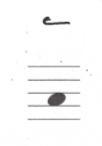

## 7. On the ancestor of the continuous elaphron

## 8. On the seisma (σείσμα)

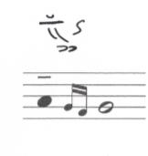

## 9. On the “small ison” (ισάκι) and the “small apostrophos” (αποστροφάκι) at a point where the text has a double or triple consonant

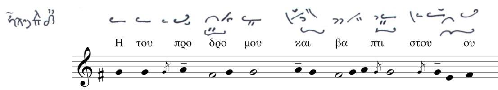

Figures 7.15.7–9. Possibilities for staff transnotation for the apostrophos before the elaphron (ελαφρόν), for the seisma (σείσμα), and for the small ison or the apostrophos in the case of a double or triple consonant.

 The use of the five-line staff does not automatically imply that the equal-tempered system is valid for transnotations. The finer accidentals are, however, avoided, since they can determine microintervallic relationships among the notes, as the first measurements of microintervals in the Psaltic Art date only to the period of the Reform, in the early nineteenth century.xxxix For the rough indication of chromaticism in the family of the second mode (second, plagal second, nenano), and for other cases of stable or transitional alterations in the transnotations, the following symbols are conventionally used:

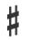

 When sources in Middle Byzantine and Neo-Byzantine notation are compared, with the addition of transnotations and transcriptions, the theoretical bases of the modes in the Old and the New Method often do not coincide. In such cases, F or C clefs may also be used for the transnotation, as appropriate, in order to facilitate visually the comparison of the sources and, at the same time, to preserve the respective theoretical bases of the modes (see Fig. 7.16.a).

342

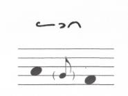

## The clefs follow one another at the interval of a third: descending ascending

## do3 do1 do1 do1 do1 do1 do1 do1 do1 do1 Do

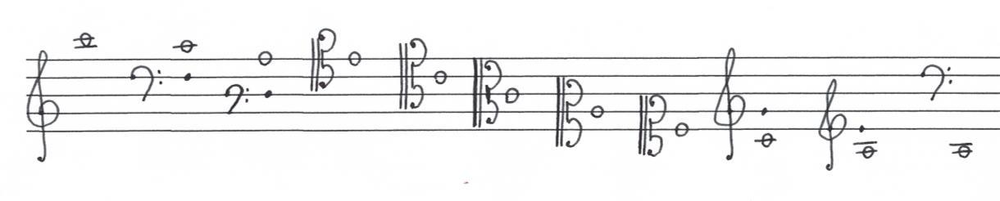

Violino Basso Baritono (Baritono) Tenoro Alto Mezzo- Soprano Violino (Sopra- Basso
soprano nino)

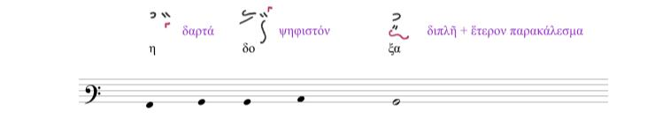

Example of the use of the baritone clef
for the transnotation of Middle Byzantine notation,
in an excerpt from a papadic chant
in plagal fourth mode (old theoretical
base: Di), to facilitate visually
comparison with the transcription from
the New System (new theoretical base:
Ni).

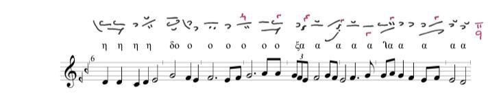

Figure 7.16.a. The clefs of European music succeed one another at the interval of a third. Some of them are
very useful also for transnotation, since they facilitate the comparison of sources with different theoretical
bases.xl

It should also be pointed out that Byzantine music is usually rendered by male voices.
This can be recorded—although it is rarely done—also in transcriptions/transnotations with a
small octave sign 8 below the G clefs and the C clefs for female voices, indicating the
octava bassa: see Figure 7.16.b.

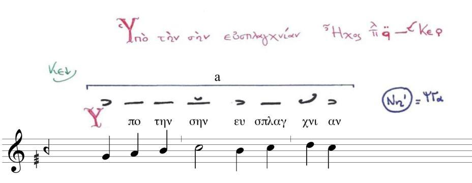

8

Figure 7.16.b. The indication octava bassa on the G clef, for transcriptions of Byzantine music on the
staff. For further details, cf. Troelsgård, 2011.xli

343

## 4.2. Examples for First Steps in Working with Middle Byzantine Notation

The present section presents a few examples concerning the two types of transnotation
currently used in the international literature: see Figures 7.17.a and b.

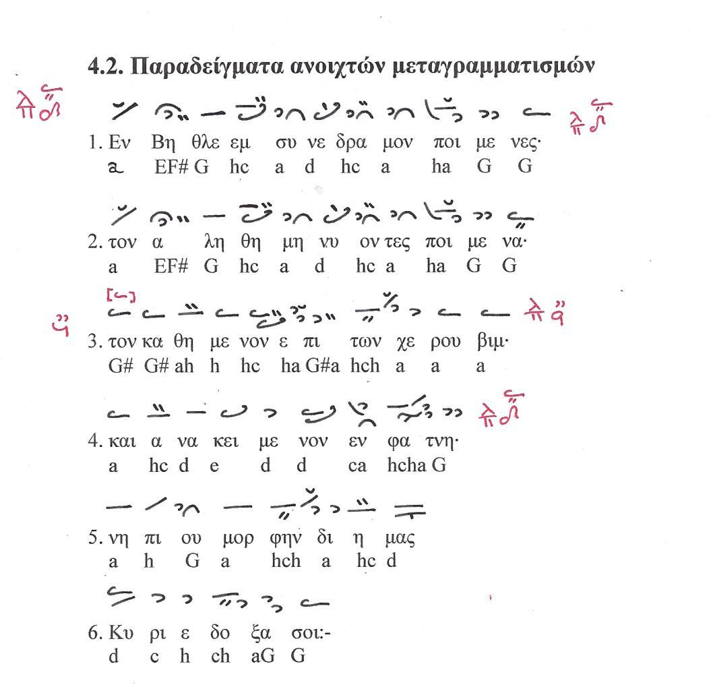

Figure 7.17.a. The Christmas sticheron “Shepherds assembled in Bethlehem,” in plagal fourth mode, from the Sticherarium
Ambrosianum A 139 sup., fol. 85r, year 1341, poem by St Germanus I, Patriarch of Constantinople (ca. 640-ca.
730),xlii old melody, classical Byzantine: copying of the neumes, division into musical-poetic units (kola), and
alphabetic transnotation.
Source for the Byzantine notation: Perria & Raasted (eds., 1992), Sticherarium Ambrosianum.

344

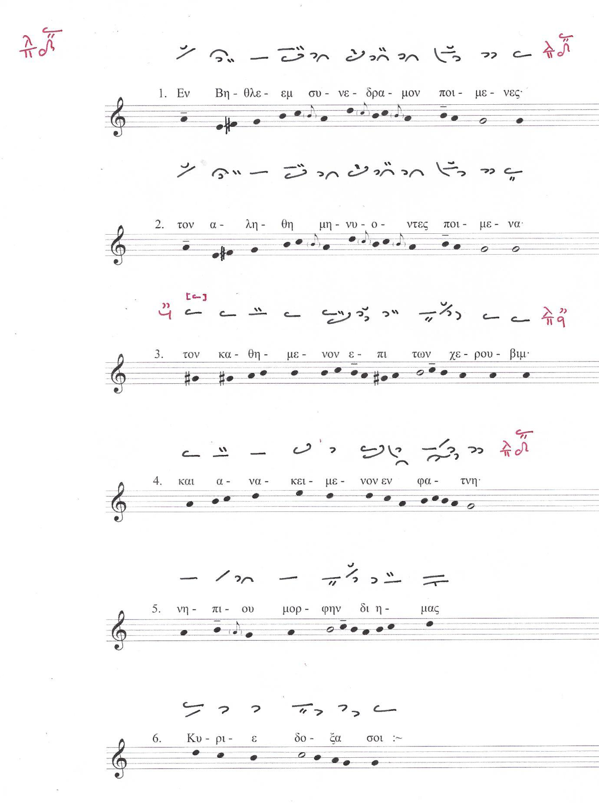

Figure 7.17.b. The same Christmas sticheron “Shepherds assembled in Bethlehem,” in plagal fourth mode, from the
Sticherarium Ambrosianum A 139 sup., fol. 85r, year 1341: copying of the neumes, division into musical-poetic units
(kola), and open staff transnotation.
Source for the Byzantine notation: Raasted & Perria (eds., 1992), Sticherarium Ambrosianum.

345

In several manuscripts there appear, in addition to the main musical lines, small
variants written in red ink: see Figure 7.18.a.

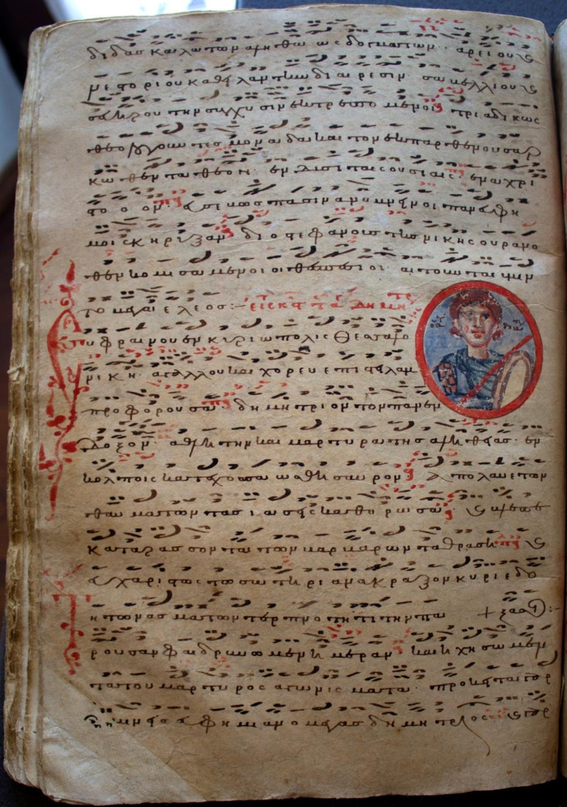

Figure 7.18.a. The sticheron “Rejoice in the Lord, city of Thessaloniki,” in first mode, poem by George Sikeliotes,
old melody, classical Byzantine, and miniature of Saint Demetrios the Myroblyte in a circular frame, from the
Sticherarion of the Holy Monastery of Koutloumousiou 412, fol. 35v, mid-14th c. (description of the ms.: Stathis, 1993, pp. 253-255. Description
of the miniatures: Treasures of Mount Athos, vol. I, 1973, pp. 294-295 and 465-467. Publication of the miniature:
Kyriakoudis, 2005, p. 152, fig. 93). Fully developed Middle Byzantine notation.

© Holy Monastery of Koutloumousiou, Mount Athos.

346

In cases of musical lines with variants, we can use both
methods of transnotation in parallel (staff for the main line and alphabetic for the
variants): see Figure 7.18.b.

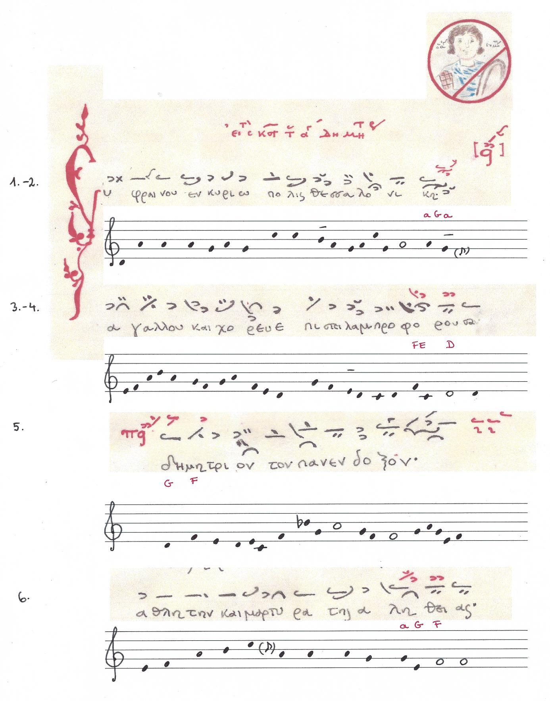

347

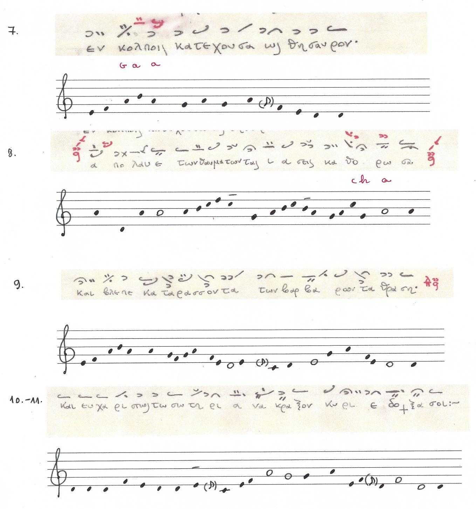

Figure 7.18.b. The sticheron “Rejoice in the Lord, city of Thessaloniki,” in first mode, poem by George Sikeliotes,
old melody, classical Byzantine: copying of neumes from the Sticherarion of the Holy Monastery of Koutloumousiou 412, fol. 35v, mid-14th
c. (Stathis, 1993, p. 253), with division of the sticheron into musical-poetic phrases and the addition of staff
transnotation. For the red variants (variants), alphabetic transnotation was used.xliii

## 5. Recapitulation - Conclusions

In the present chapter a brief introduction to Middle Byzantine notation was given.
Topics were presented concerning:

-  the signs (sounded and unsounded),

-  the methodology for the study of Middle Byzantine notation,

-  the types of transnotation (staff and alphabetic) and their basic principles.

Nevertheless, these are only the first steps of study. In the following chapters we shall seek
evidence concerning the oktoechos and the level of performance.

348

It must be emphasized that the two types of transnotation presented in Figures 7.17-
18, the alphabetic and the open staff type, concern only the level of the structure of the pieces,
their quantitative dimension. They leave open all the elements that were transmitted viva voce and
concerned the qualitative dimension of the pieces: exact sizes of intervals, unwritten
changes, rhythm, melodic developments of the formulae (theseis) - embellishments of various levels, dynamics, articulation,
timbre, phrasing, ethos. In other words, only the metrophonic structure of the piece is transnotated
(what is recorded with the ison and the sounded signs), and not its melos (sonic result).
Consequently, transnotations do not serve as scores for musical performance, but
serve scholarly purposes, being tools in the hands of the musicologist that
facilitate the comparison of sources and his analytical-morphological and stylistic inquiries.

1. From the Old to the New System: some manuscript samples from the

Byzantine and post-Byzantine period, from various genera and genres of composition

In Figures 7.19-45 there are various samples of Middle Byzantine notation, in particular
stages of its development, and a few images with the analytical notation of the New Method, offering a
first brief guided tour of the world of musical manuscripts from the middle of the 12th to the beginning of the
19th century. For more images with mss. in Middle Byzantine notation, the reader may
consult the important samples found:

 In the facsimile editions of entire codices of the Byzantine period, in the series Monumenta Musicae

Byzantinae, Facsimiles (vols. I-IV and XI edited by Høeg, Tillyard & Wellesz [1935], Høeg [1938, 1956],

1. Tardo [1951] and Perria & Raasted [1992]),

-  in the plates of representative manuscripts, chiefly of the Byzantine period, from the New Introduction to

Middle Byzantine Notation by Christian Troelsgård (2011, pp. 95-116), from the selection of Fr. Petresco
(1932, pls. XXI-XXV, XXIX-XXXIII), of Bucca (2011), Harlfinger, Reinsch, Sonderkamp & Prato
(1983, pls. 144-148),

 in the plates of dated musical codices of the period of Ottoman rule, from the edition of

Hatzigiakoumis (1980),

 in the rich plates that accompany the analytical catalogues and other musicological

studies of Stathis (1975, 1976, 1993, 2015 and 2006), Giannopoulos (2005a, 2005b, 2008, 2016),
Chaldaiakis (2005), Balageorgos & Kritikos (2008), Gertsman (1996 and Gertsman, 1994), Fr. Βucescu,
Catrina, Barnea, Dănilă & al. (2010), Vasile & al. (2010), Vasile (2007, 2008),

 in the facsimile editions of entire codices of the Music School of Putna (e.g. eds. Ciobanu,

Ionescu & Moisescu, 1981. Ciobanu & Ionescu, 1984. Moisescu, 1994) and of the Romanian Psaltic tradition of
Filothei Sin Agăi Jipei (ed. Fr. Barbu-Bucur, 1981, 1984, 1986, 1992), in the series Izvoare ale Muzicii
Românești, etc.
In addition, the reader can also find on the internet various codices with
Middle Byzantine notation for study.xliv

349

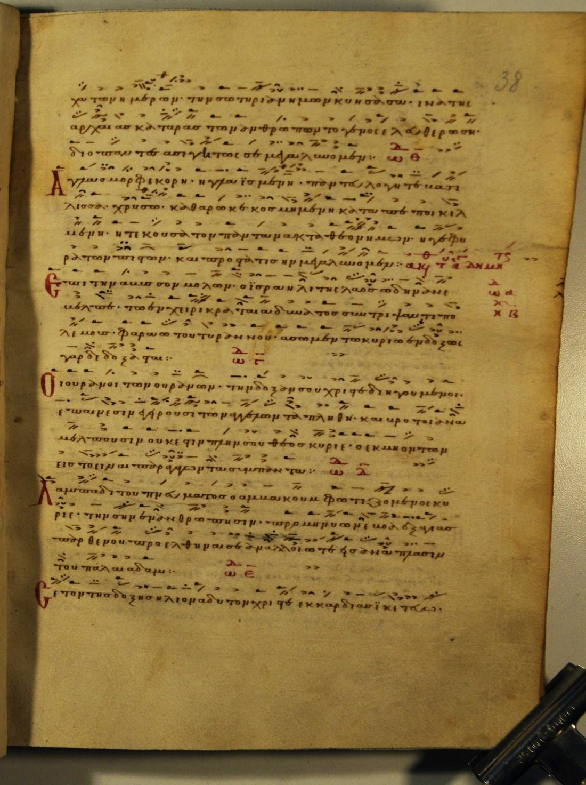

Figure 7.19. Heirmologion Iviron (Hiberorum) 470, fol. 38r.xlv Middle Byzantine transitional notation (Coislin VI-
Middle Byzantine I, around the year 1150, according to Floros, 1970, vol. I, p. 66). In the middle of the folio begins the
“Office of Saint Demetrios, mode 2,” of which odes 1, 3, 4 and the beginning of 5 are visible.
The ms. is known in the literature as Codex H. © Holy Monastery of Iviron, Mount Athos.
For the facsimile edition of the entire ms. in the series Monumenta Musicae Byzantinae, see Høeg (ed.,
1938, Facsimiles II).

350

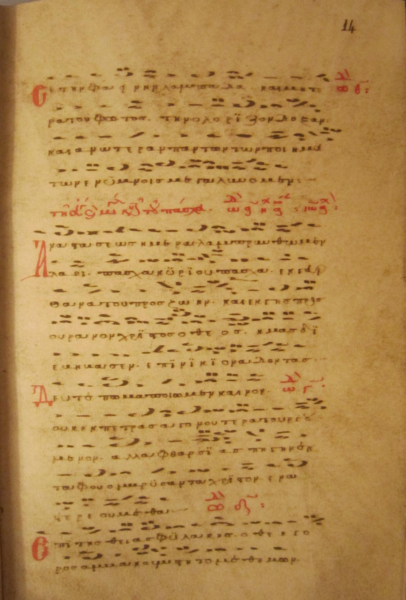

Figure 7.20. Heirmologion Grottaferrata EgII, year 1281, fol. 14a. Fully developed Middle Byzantine
notation.xlvi A little above the middle of the folio begins the Office “on holy and great Sunday of
Pascha. Ode 1, mode 1: John the monk: Day of Resurrection.” These are the heirmoi of the Canon
of Pascha, a poem by Saint John of Damascus. This canon was called "The golden Kanon" or "The Queen of
Kanons" (Wellesz, 1962, p. 206). The codex is referred to in the international literature with the siglum G.
For the facsimile edition of the entire ms. in the series Monumenta Musicae Byzantinae, see Tardo (ed.,
1951, Facsimiles III). The photograph comes from the aforementioned edition and has been included here with the
kind permission of Monumenta Musicae Byzantinae.xlvii

351

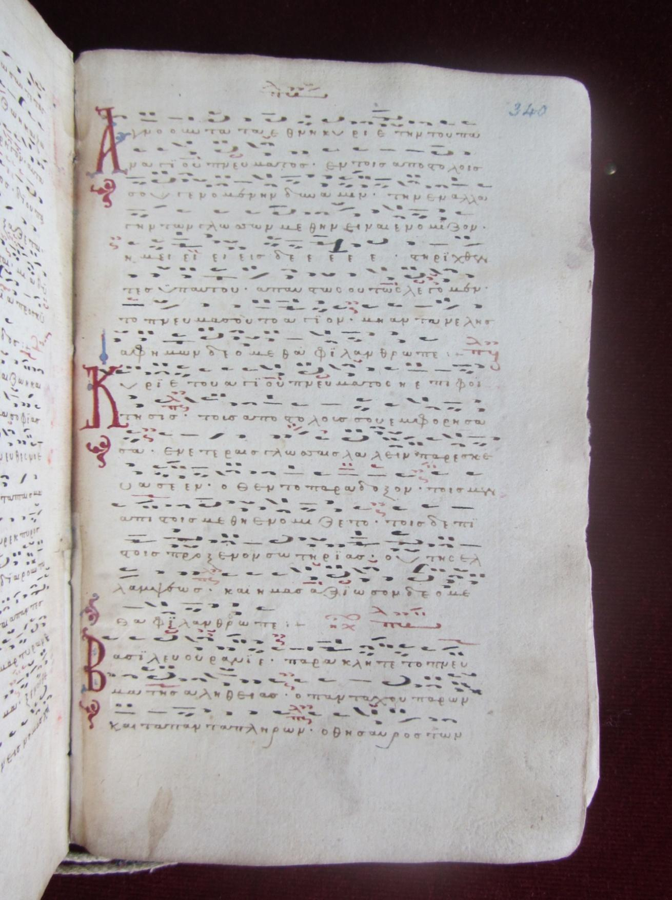

Figure 7.21.a. EBE 884, year 1340/1, Old Sticherarion in the edition of St John Koukouzeles (copy by
Athanasios from an exemplar corrected by “Koukouzeles of old”). Fully developed Middle Byzantine notation.
On fol. 340r: stichera of Pentecost. Below: beginning of the sticheron “Heavenly King,” in plagal second mode.

© National Library of Greece. Cf. also Raasted (1995b and 1997).

352

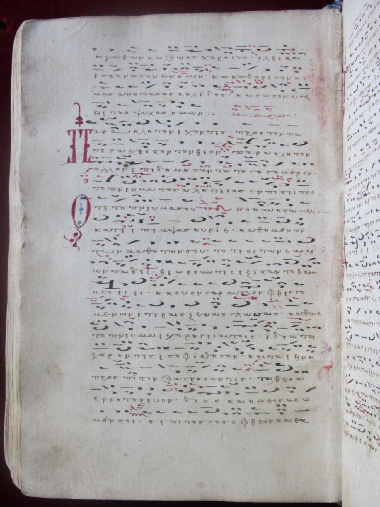

Figure 7.21.b. EBE 884, year 1340/1, fol. 340v, with the continuation of the sticheron “Heavenly King” and other stichera
of Pentecost: “Having the Paraclete” in grave mode, and “When you sent down your Spirit, Lord,”
in plagal fourth mode. © National Library of Greece.

353

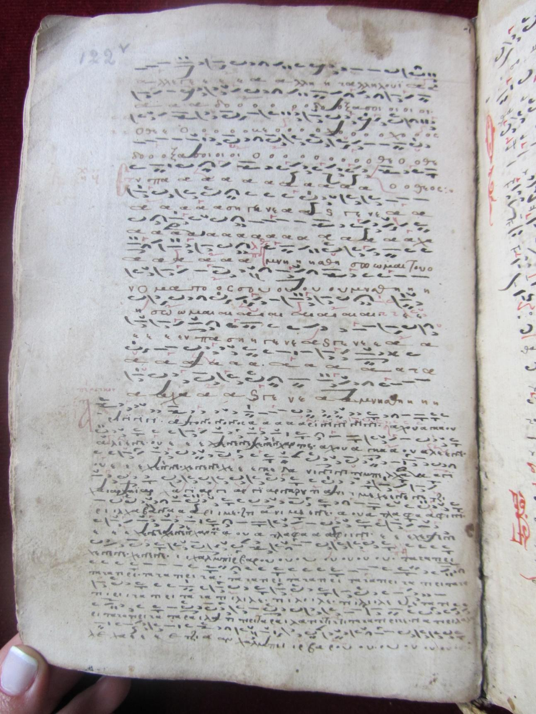

Figure 7.22. EBE 2401, 15th c.,xlviii fol. 122v, with the “Persikon” (lower part of the folio): the first monument of secular
music in Byzantine notation (late Middle Byzantine) and, at the same time, the first written source for Persian
music. © National Library of Greece. Cf. also Kalaitzidis (2012, p. 341, fig. 1).xlix

354

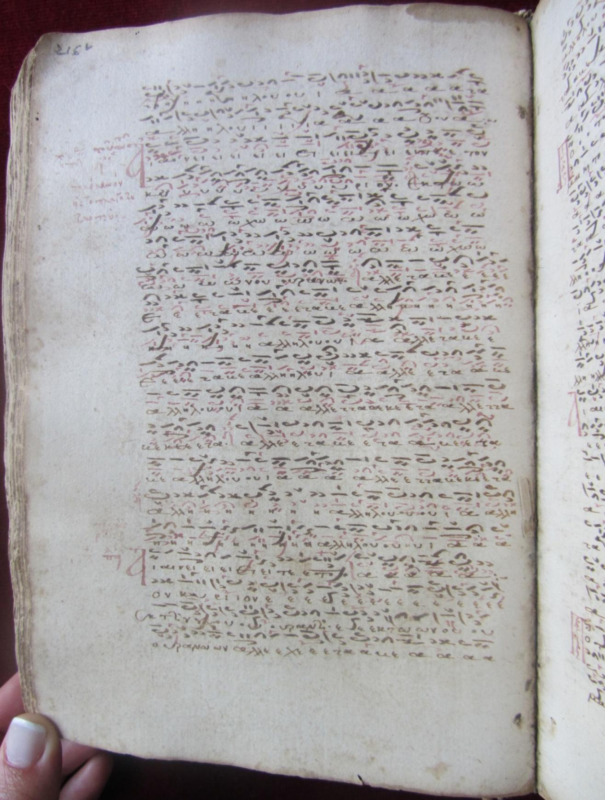

Figure 7.23.a. EBE 2401, 15th c., fol. 216v, with a sample of polyphony in Middle Byzantine notation. In the upper part
begins one of the two Koinonika “Praise [the Lord]” by Manuel Gazes (a composer from the late 14th-early 15th century, who
also travelled to Crete). It is chanted by two voices: in mode 4 the upper voice, with notational signs in brown, and
in plagal fourth mode the lower voice, with notational signs in red ink. The second “Praise [the Lord]” by Gazes, in mode 4-plagal 4, is found
in the same ms., fol. 328r. © National Library of Greece. Cf. Adamis (1986).l

355

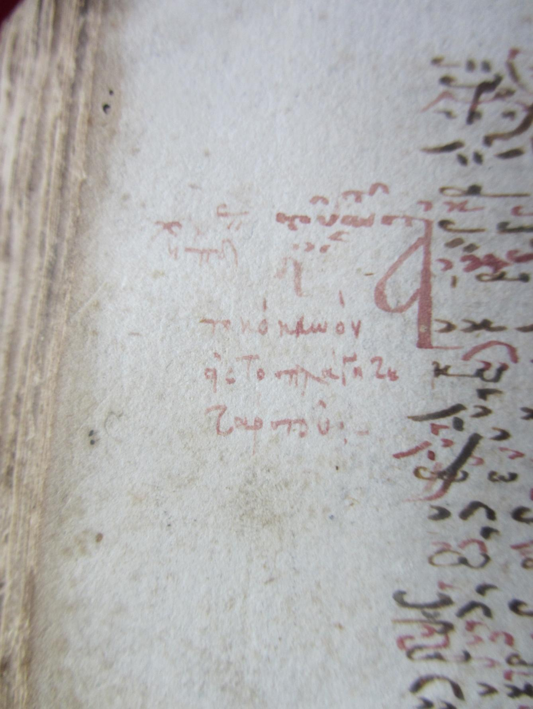

Figure 7.23.b. EBE 2401, 15th c., fol. 216r, detail with the red writing in the left margin of the ms.,
clarifying the manner of performance: “by the same” (i.e. by Gazes), martyria of mode 4. With a finer pen: martyria:
mode plagal 4 and note “the red [part] in plagal fourth (sic).” © National Library of Greece.

356

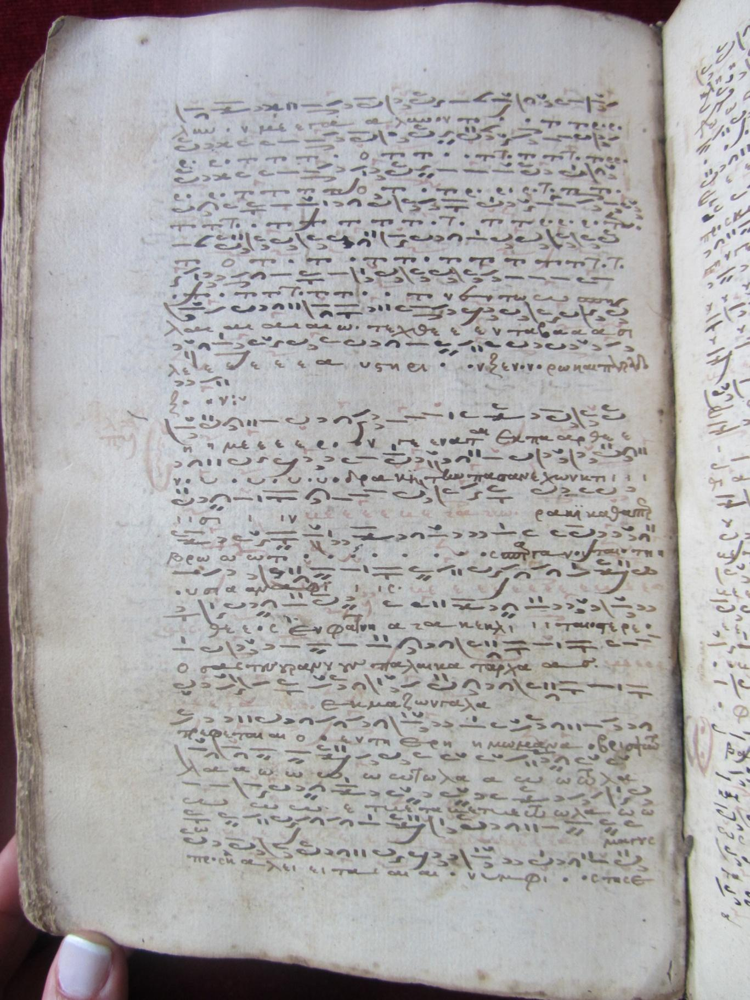

Figure 7.24.a. EBE 2401, 15th c., fol. 291v, with the twelfth troparion of the Great Hours on the Eve
of Christmas “Today is born of a Virgin,” plagal second mode, in melismatic style,li and with extensive intonation formulas
between the verses, written with echematic syllables in red ink. © National Library of Greece.

357

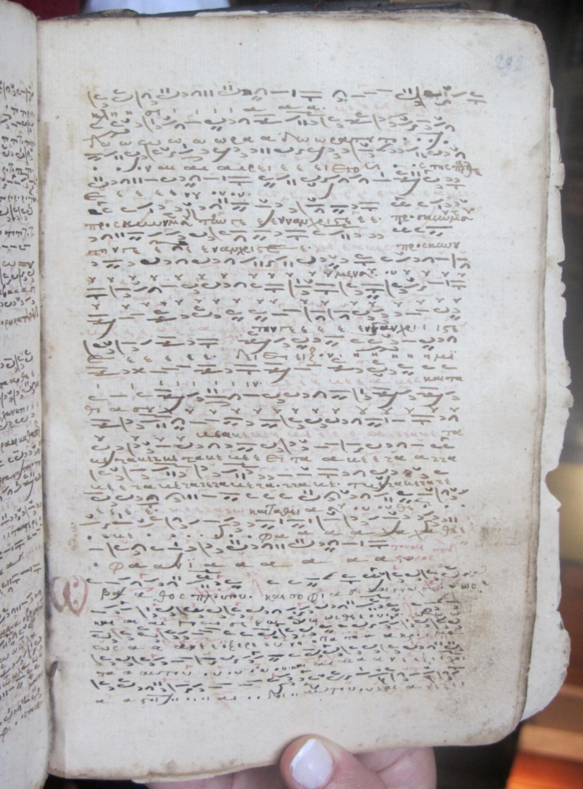

Figure 7.24.b. EBE 2401, 15th c., fol. 292r, with the continuation of “Today is born of a Virgin.”

© National Library of Greece.

358

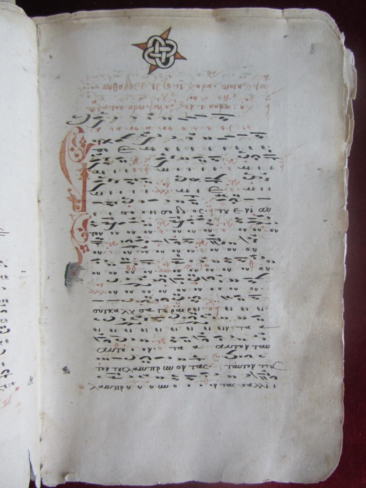

Figure 7.25. EBE 2406, Anthology of the Papadike, autograph of Matthew monk and domestikos, Holy Monastery of the Timios
Prodromos, Serres, year 1453.lii The photograph shows fol. 8r, with the beginning of the “Method for the Sticherarion” by
Xenos Korones, a famous didactic poem of the period of kalophony, in late Middle Byzantine notation.liii

© National Library of Greece.

359

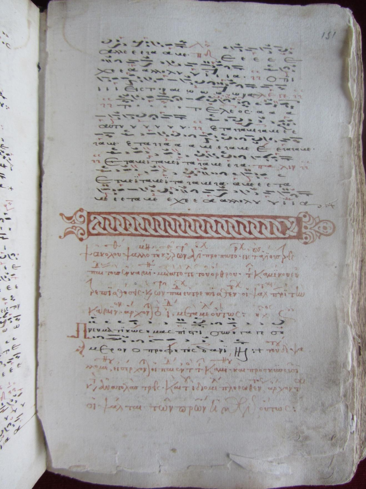

Figure 7.26.a. EBE 2406, year 1453, fol. 151r, with the beginning of the Office of the Three Children in the Furnace:
Ҡ office sung on the Sunday of the Holy Forefathers; for the holy three children
in the furnace; after the end of Orthros; when the furnace has been prepared; and the children
prepared; the chanters around the furnace; they begin the idiomelon, with melody thus: mode 2
Spiritually, faithful, we...”. © National Library of Greece. Cf. also Velimirović (1962). Adamis (2002).liv

360

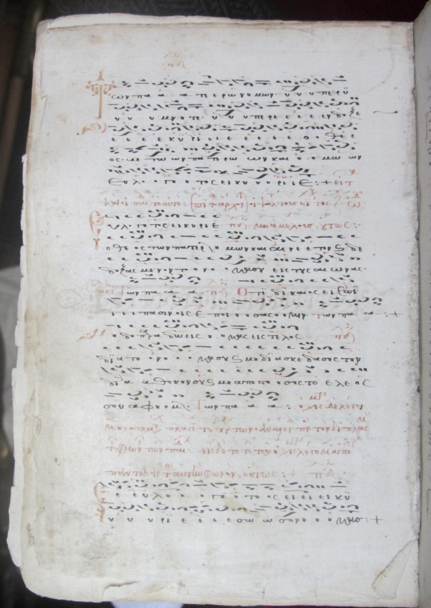

Figure 7.26.b. EBE 2406, year 1453, fol. 151v, with the continuation of the Office of the Three Children in the Furnace.

© National Library of Greece.

361

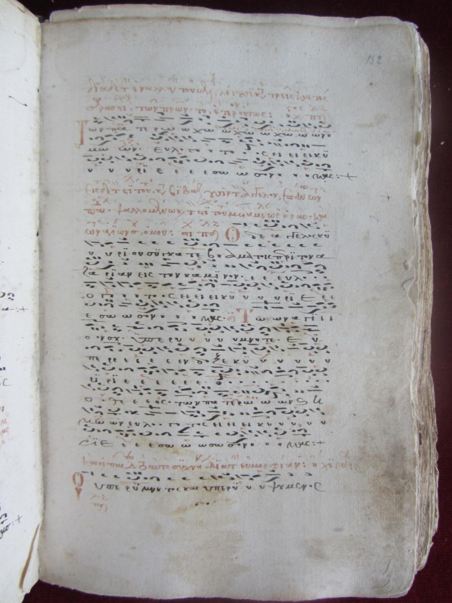

Figure 7.26.c. EBE 2406, year 1453, fol. 152r, with the continuation of the Office of the Three Children in the Furnace.

© National Library of Greece.

362

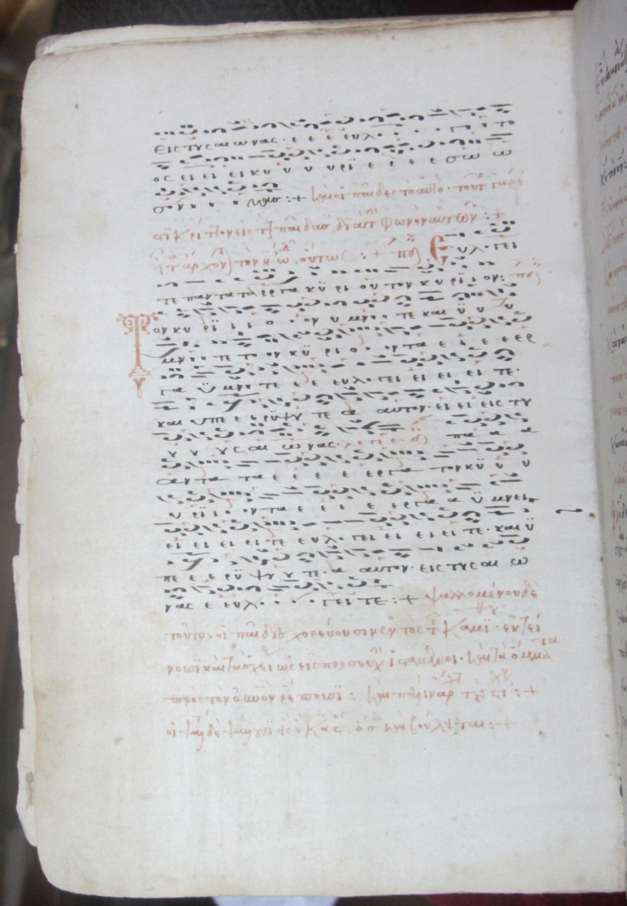

Figure 7.26.d. EBE 2406, year 1453, fol. 152v, with the continuation of the Office of the Three Children in the Furnace.

© National Library of Greece.

363

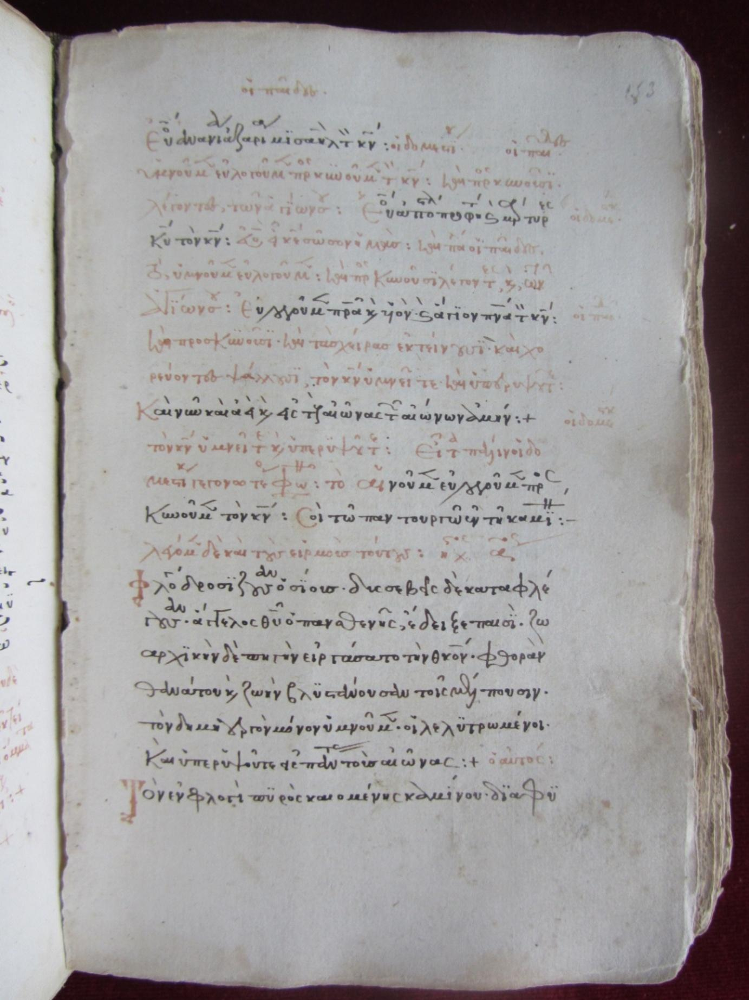

Figure 7.26.e. EBE 2406, year 1453, fol. 153r, with the continuation of the Office of the Three Children in the Furnace.

© National Library of Greece.

364

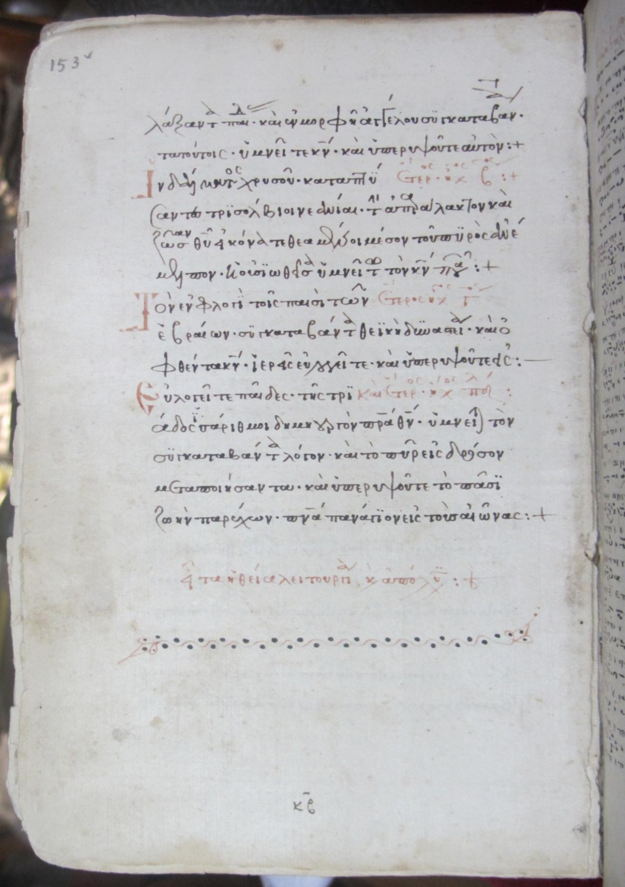

Figure 7.26.f. EBE 2406, year 1453, fol. 153v, with the end of the Office of the Three Children in the Furnace.

© National Library of Greece.

365

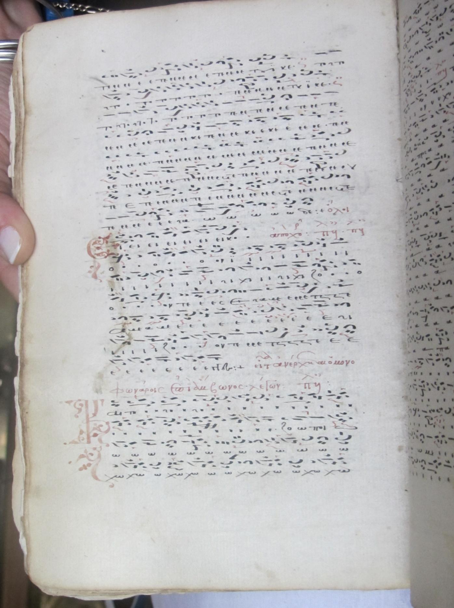

Figure 7.27.a. EBE 2406, year 1453, fol. 237v, with an excerpt from the Great and asmatic Cherubic Hymn of Michael
Ananeotes, mode 2. The photograph shows instructions written in red for the kalophonic performance. © National
Library of Greece.

366

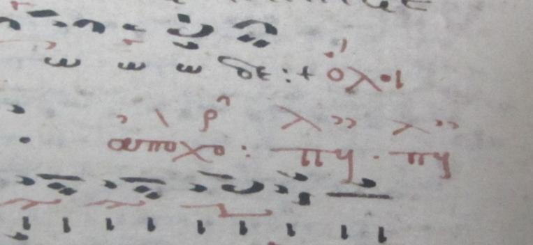
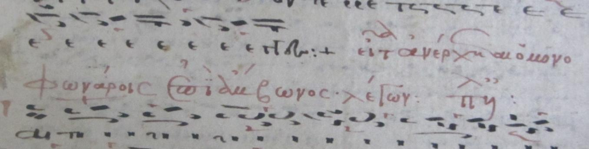

Figures 7.27.b-c. EBE 2406, fol. 237v (details): instructions for the practice of performance: “all from the choir” on
one side, and “then the soloist goes up onto the ambo, saying” on the other. © National Library of
Greece.

For the present Cherubic Hymn, Evangelia Spyrakou (2008, p. 407) gives the whole plan of the performance,
according to the red indications on fols. 236v-239r of ms. EBE 2406:

“Cherubic Hymn called great and asmatic, an old composition by the domestikos kyr Michael
Ananeotes. From the choir, all together. Mode 2 (outside) Neaanes, We who the Cherubim, mystically -
The soloist from outside; 2 (outside) Oototo, terrere
All from the choir; plagal 2 Representing -
then the soloist goes up onto the ambo; saying; plagal 2 And to the life-giving... alleluia -
then say it from the choir; third and third Say, alleluia
another, the domestikos from outside; and he says a kratema mode 2 (outside) Neanes -
composition of kyr John the lampadarios; 2 (inside) Tototo, terere - 2 (inside) Lou, alleluia.”
Cf. also Office of the Pannychis. Sunday of the Veneration of the Cross 2009, “Melodists of Trikki,”
choirmaster Dimitrios Balageorgos.

367

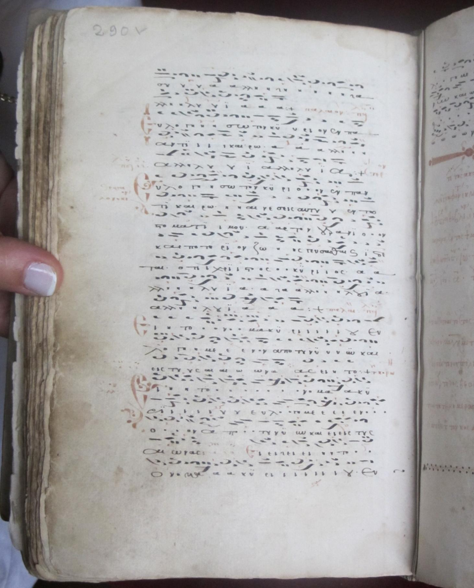

Figure 7.28.a. EBE 2406, year 1453, in late Middle Byzantine notation, fol. 290v: 1. “I will bless the Lord at
all times” and 2. “Blessed be the name of the Lord,” in various versions: 1.1. “old” and 1.2. “another,
Thessalonian,” 2.1. “old” and 1.2. “another by Korones.” © National Library of Greece.

368

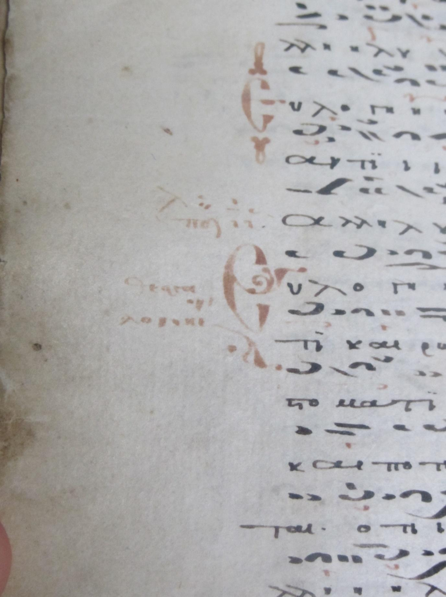

Figure 7.28.b. EBE 2406, year 1453, detail from fol. 290v, with the indication of a local tradition: “Thessalonian,”
in plagal fourth triphonos. © National Library of Greece.

369

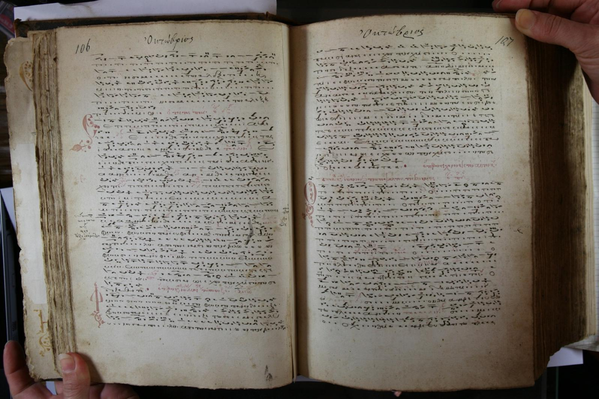

Figure 7.29. The kalophonic mathema “Guard [us], all-glorious one,” melody by Saint John Koukouzeles, from the ms. of the
Holy Metropolis of Zakynthos, Gritsanis Collection, no. 7, pp. 106-107, mid-second half of the 15th c., in late Middle Byzantine
notation, probably an autograph of Manuel Doukas Chrysaphes.lv © Holy Metropolis of Zakynthos.

370

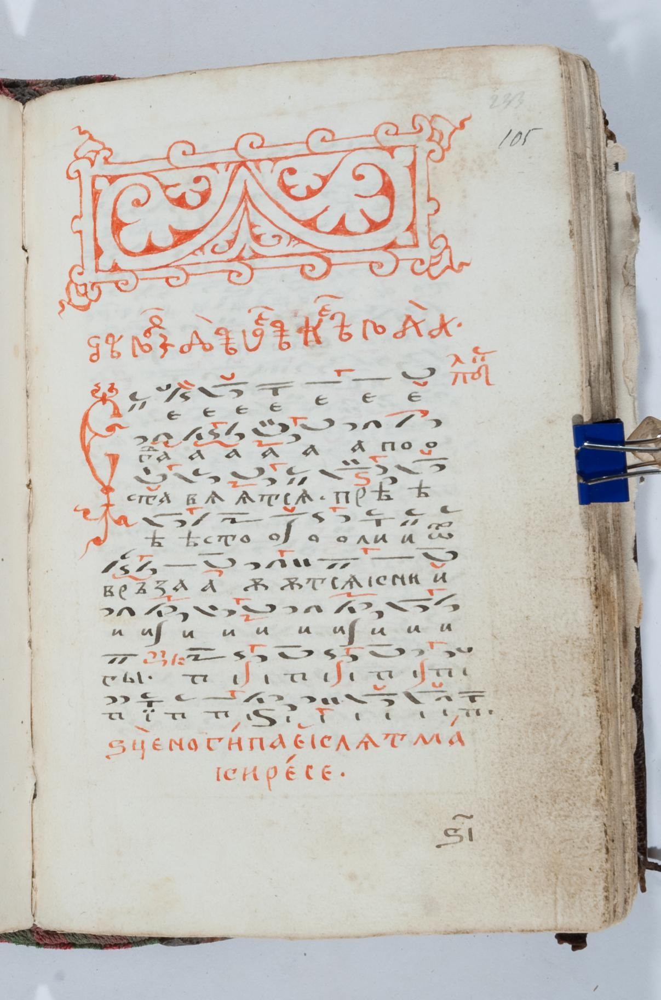

Figure 7.30.a. The Anthologion of Eustatie, Protopsaltes of Putna, year 1511, in late Middle Byzantine notation.
Today it is in Moscow, at the State Historical Museum, Șciukin Collection, no. 350. In the photograph: fol. 105r, with
the beginning of the kalophonic sticheron (“When the thrones are set,” in the Slavonic language,
Middle Bulgarian version), plagal fourth mode, for Meatfare Sunday, a poem by Eustatie. Before the beginning of the
piece and below the heading there is a rubric with a Cyrillic cryptogram of the type called "taraberic"
(deciphered as: = here (?) begin the kratemata). Cf. Pennington (1985, pp.
105, 123, 125) and Ciobanu & Ionescu (1983, p. 487). © State Historical Museum, Moscow.

371

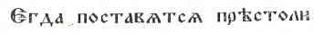
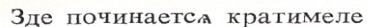

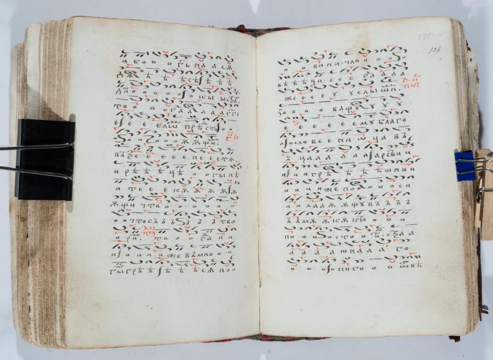
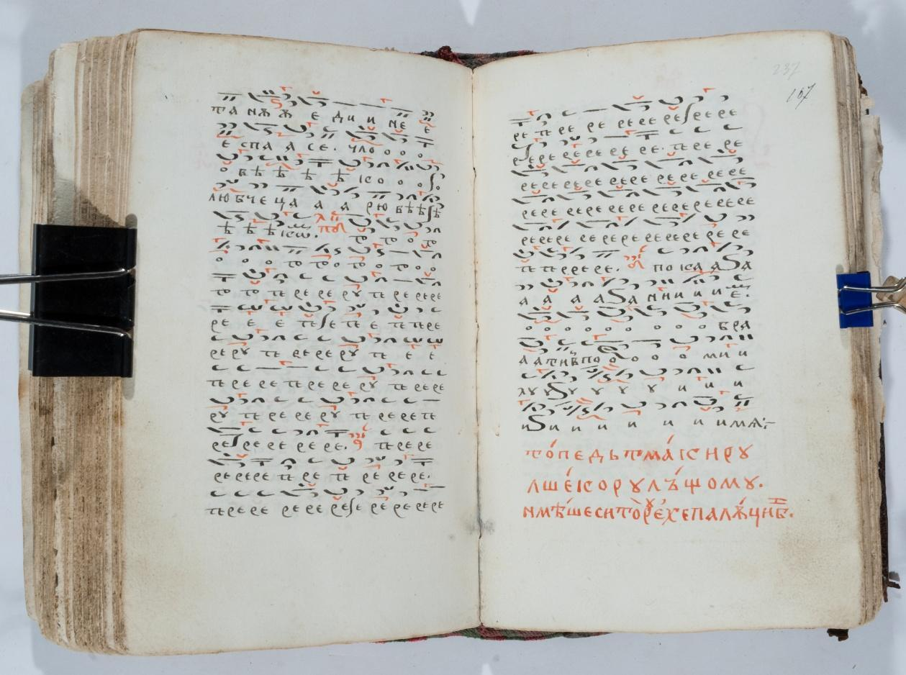

Figures 7.30.b-c. The Anthologion of Eustatie Protopsaltes of Putna, year 1511, Șciukin, no. 350, fols. 105v-107r, with the
continuation and the end of the kalophonic sticheron “When the thrones are set,” in Slavonic. © State Historical Museum,
Moscow.

372

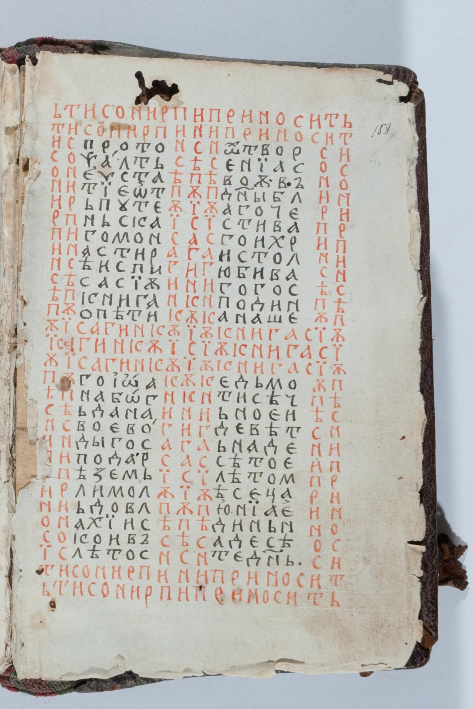

Figure 7.31. The colophon of the Anthologion Șciukin, no. 350, fol. 158r, in Slavonic. A translation could be
as follows: “The Protopsaltes Eustatie from Putna Monastery wrote this book of chants from his own poems,
in the days of our Orthodox and Christ-loving lord Ioan Bogdan Voivode, despot of Moldavia-Wallachia, in
the year 7019, in the month of June, day 11.” The corresponding calculation is: 7019 - 5508 = 1511. Cf. Ciobanu & Ionescu
(1983, p. 97). © State Historical Museum, Moscow.

373

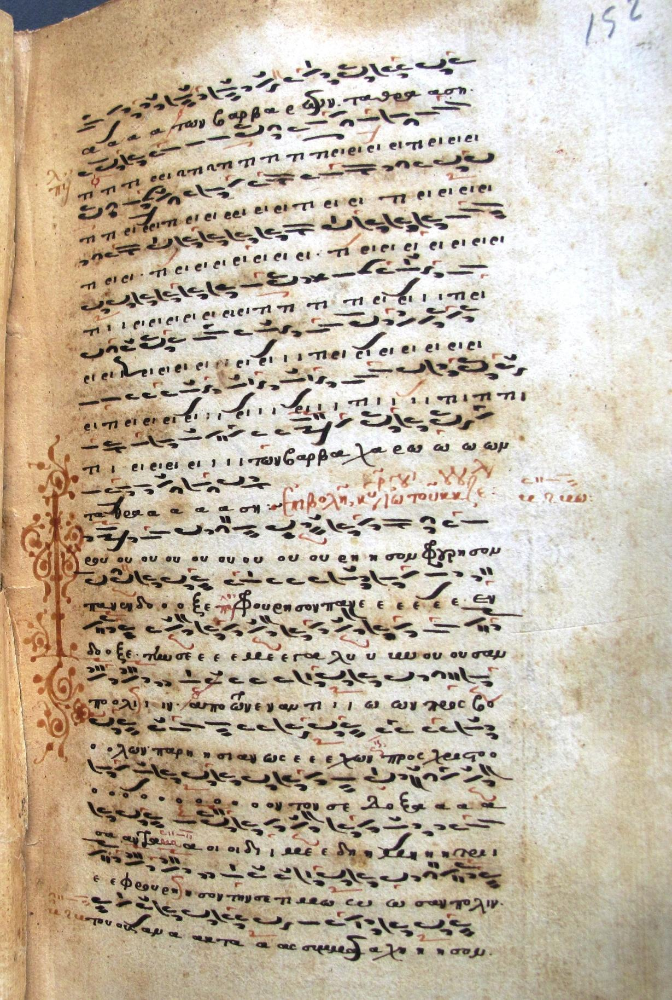

Figure 7.32.a. Holy Monastery of Vlatadon, ms. no. 46, Anthology and Mathematarion of the Sticherarion of Manuel Chrysaphes, in
a copy by Leontios monk, year 1551. In the photograph: fol. 152r, “Epibole, by kyr John
Koukouzeles; nenano: Guard [us], all-glorious one,” in honour of the Holy Great-Martyr Demetrios. For the ms. and
other facsimiles, cf. Hatzigiakoumis (1980, pp. 116-117 and sample 10). © Holy Royal Patriarchal and
Stavropegic Monastery of Vlatadon, Thessaloniki.

374

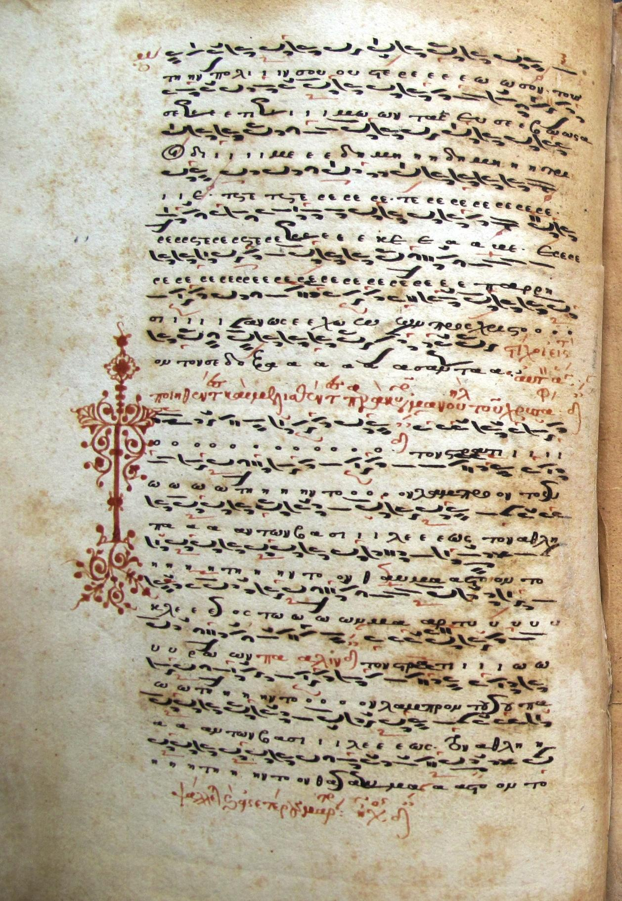

Figure 7.32.b. Holy Monastery of Vlatadon, ms. no. 46, year 1551, fol. 152v, with the continuation of the epibole “Guard [us].” There follow
“Verses to the same saint, composed and set to melody by kyr Manuel Chrysaphes:
[mode] 4 The radiant soldier” (a fifteen-syllable mathema). At the bottom in the margin the red
note: “it is also chanted for other martyrs: mode 4.” © Holy Royal Patriarchal and
Stavropegic Monastery of Vlatadon, Thessaloniki.

375

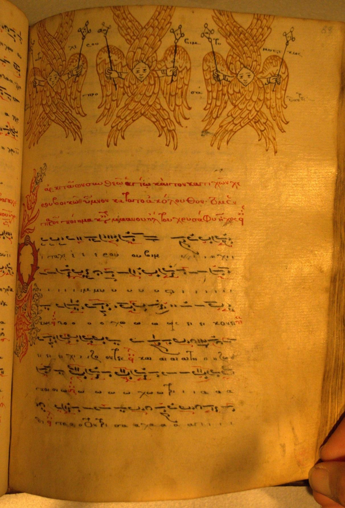

Figure 7.33.a. Anthology, Copenhagen, Royal Library NkS 4466 (4o), “written between 1679-1681”
(Alexandrescu, 2013, p. 37), by Ioannes Kampazournas, for use in the Danubian Principalities (Raasted, 1976,

p. 569). A most beautiful ms., with many miniatures of angels or also of other subjects, with artistic initials, etc. On

the present fol. 88r the heading introduces a new section with the words: “one should begin, with holy God, also the according-to-mode
Cherubic hymns in the following order; the present composition is by kyr Manuel Chrysaphes, mode 1 We who
the Cherubim.” It was included in the present work with the kind permission of the Royal Library of
Copenhagen/by Courtesy of the Royal Library of Copenhagen.lvi

376

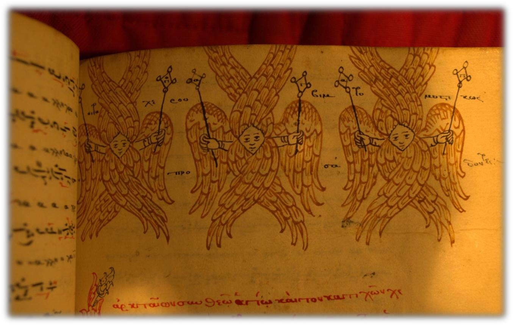

Figure 7.33.b. Detail of fol. 88r from the Anthology NkS 4466 of the Royal Library of Copenhagen, with
a depiction of three six-winged Cherubim holding in their hands banners (or representations of six-winged ones) with the inscription
“holy.”lvii Between the Cherubim there are recorded in two rows excerpts from the Cherubic Hymn: “those who
mystically sing the Cherubic hymn.” This codex, on the basis of the many depictions of angels (a very
impressive Wheel of parallage on fol. 14r with angels [see Figure 8.39 of the present book], also
miniatures/initials with angels on fols. 10r, 89r) could be called the “Codex of the Angels.”
It was included in the present work with the kind permission of the Royal Library of Copenhagen/by
Courtesy of the Royal Library of Copenhagen.

377

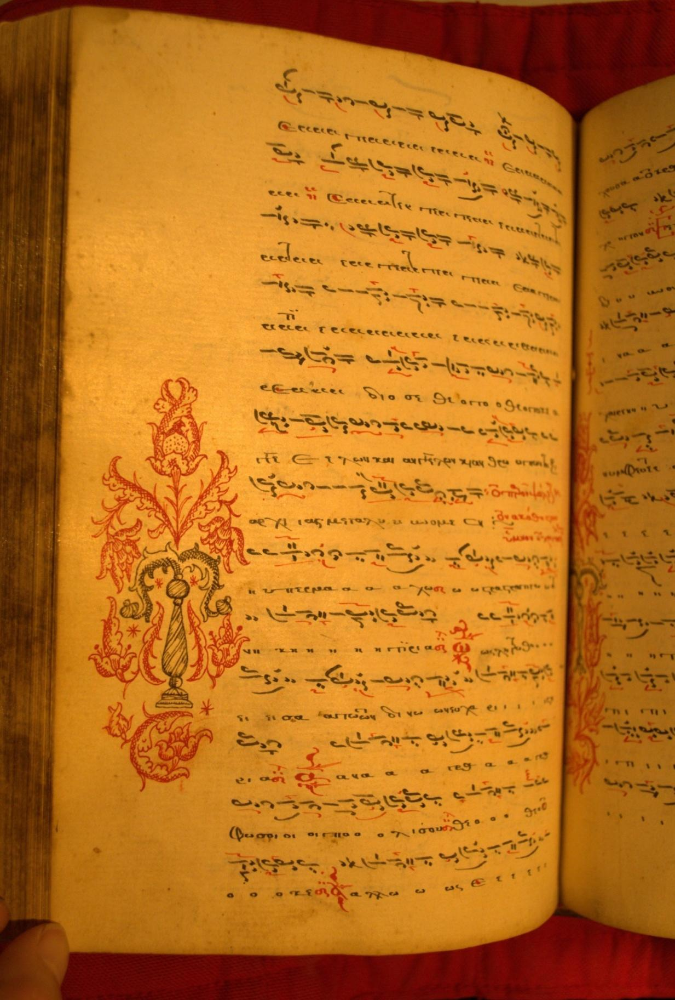

Figure 7.34.a. Copenhagen, Royal Library, NkS 4466 (4o), fol. 262v: “the present [piece] is chanted for the Akathist
Hymn, mode plagal 4 To you, the Champion General.”lviii
The photograph was included in the present work with the kind permission of the Royal Library
of Copenhagen/by Courtesy of the Royal Library of Copenhagen.

378

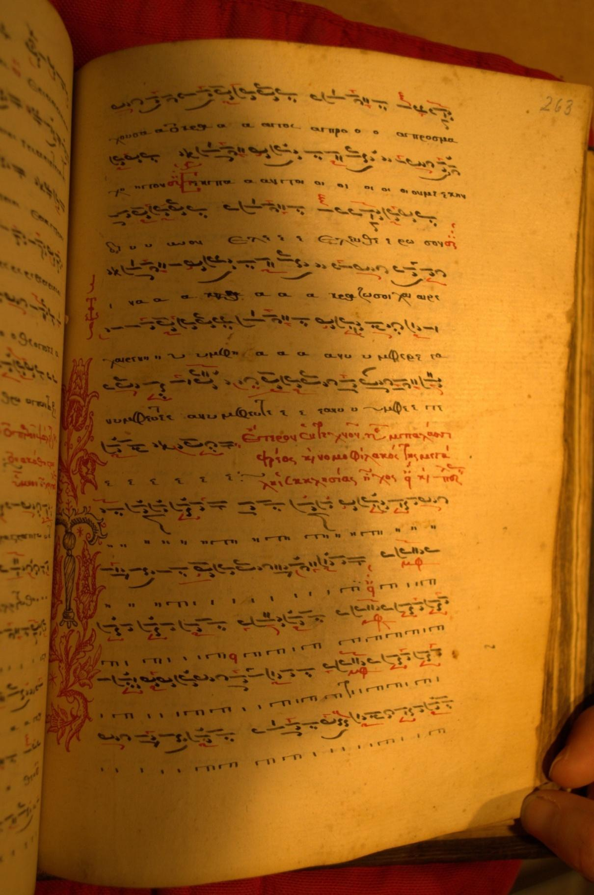

Figure 7.34.b. Copenhagen, Royal Library, NkS 4466 (4o), fol. 263r, with the continuation of the ancient setting of the second
prooimion of the Akathist Hymn. There follows “another artful [piece] by kyr(?) Balasios, priest and nomophylax of the
Great Church, mode 1 and plagal 4 Ti ti ti...”. The photograph was included in the present work with
the permission of the Royal Library of Copenhagen.

379

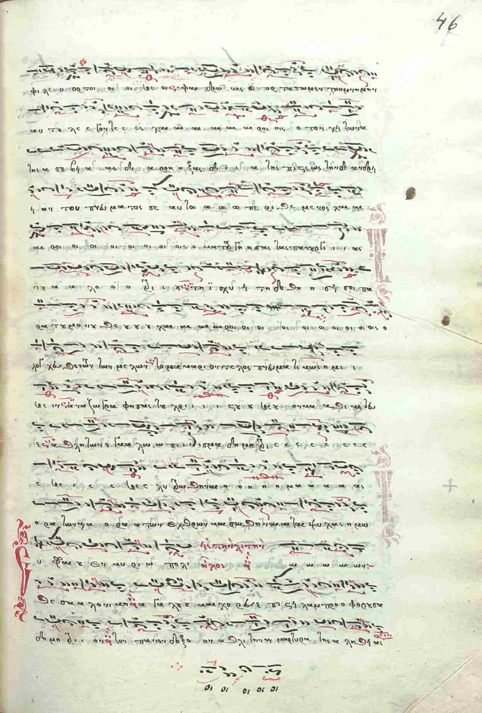

Figure 7.35.a. Ms. no. 3 of the Study Room of Classical Philology of the Faculty of Philosophy of Aristotle
University of Thessaloniki, fol. 46r. Sticherarion of Germanos of New Patras, with late Middle Byzantine notation, 18th
c. In the lower part of the photograph: beginning of the sticheron “Rejoice in the Lord, city of Thessaloniki,” mode 1, at the
Lity of Saint Demetrios (26 October). © Central Library of A.U.Th.
For a more detailed description and more photographs of the ms., see: Politis, Sotiroudis and Sakellaridou-
Sotiroudi (1991, p. 4). <http://digital.lib.auth.gr/collection/Manuscripts?ln=el> (no. 108, [ARC-2007-37889]) and
<http://digital.lib.auth.gr/record/79607/files/1.pdf> (19.8.2016).

380

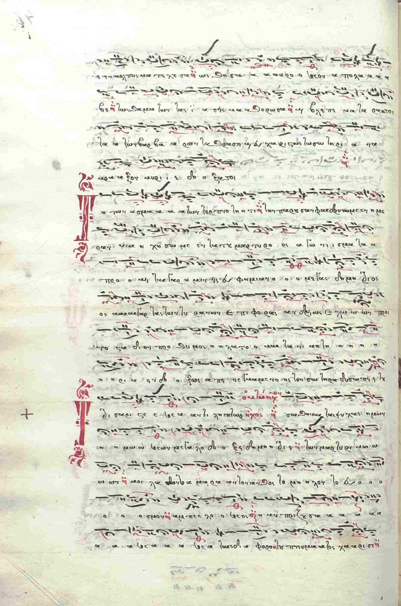

Figure 7.35.b. Ms. no. 3 of the Study Room of Classical Philology of the Faculty of Philosophy of Aristotle
University of Thessaloniki, fol. 46v, with the continuation of the sticheron “Rejoice in the Lord, city of Thessaloniki” and
other stichera for Saint Demetrios. In the lower part of the folio begins the famous eight-mode sticheron “Thrice-excellent
helper of ours,” poem by John Staurakios (see “Holy Week” of Saint Demetrios, ed.
Fountoulis, 1986, pp. 86-88). © Central Library of A.U.Th.

381

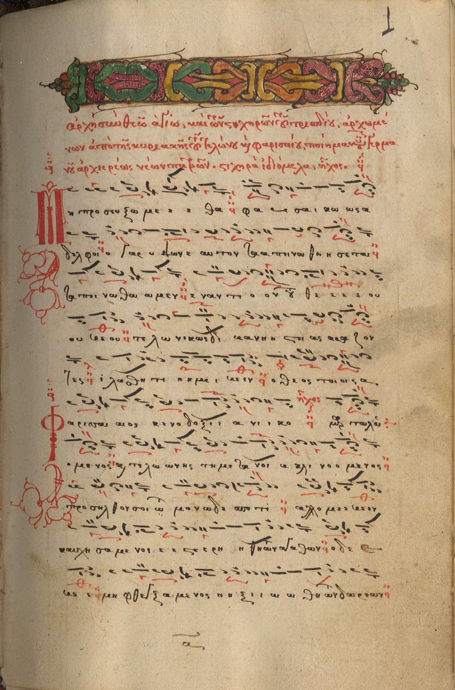

Figure 7.36. Ms. no. 33 of the Study Room of Classical Philology of the Faculty of Philosophy of Aristotle
University of Thessaloniki, fol. 1r. Anthology of the Sticherarion of the Triodion and Pentecostarion, in a setting by Germanos
of New Patras, with late Middle Byzantine notation. Autograph of Melchizedek hierodeacon of Pantokrator, Monastery of
Prodromos, Skopelos, year 1740. In the photograph: beginning of the Triodion, with the sticheron “Let us not pray
like the Pharisee,” mode 1, etc.

© Central Library of A.U.Th. For a more detailed description and more photographs of the ms., see:

Politis, Sotiroudis and Sakellaridou-Sotiroudi (1991, p. 34). <http://digital.lib.auth.gr/collection/Manuscripts?ln=el>
(no. 28, [ARC-2007-38233]) and <http://digital.lib.auth.gr/record/80008/files/1.pdf> (19.8.2016).

382

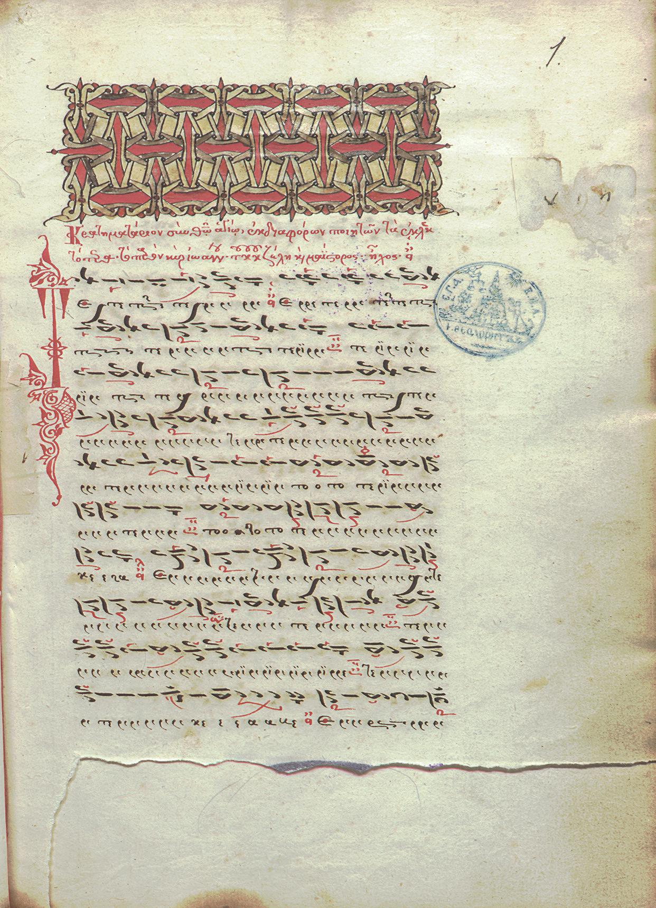

Figure 7.37. Ms. no. 45 of the Study Room of Classical Philology of the Faculty of Philosophy of Aristotle
University of Thessaloniki, fol. 1r. Kratematarion, with late Middle Byzantine notation, year 1740, autograph of
Ignatios, prosmonarios of the Holy Lavra. In the photograph: beginning of a kratema by the maistor John Koukouzeles,
mode 1. The ms. is extremely carefully executed, with artistic headings. © Central Library of A.U.Th.
For a more detailed description and more photographs of the ms., see: Politis, Sotiroudis and Sakellaridou-
Sotiroudi (1991, pp. 46-47). <http://digital.lib.auth.gr/collection/Manuscripts?ln=el> (no. 16, [ARC-2007-38328]) and
<http://digital.lib.auth.gr/record/80113/files/1.pdf> (19.8.2016).

383

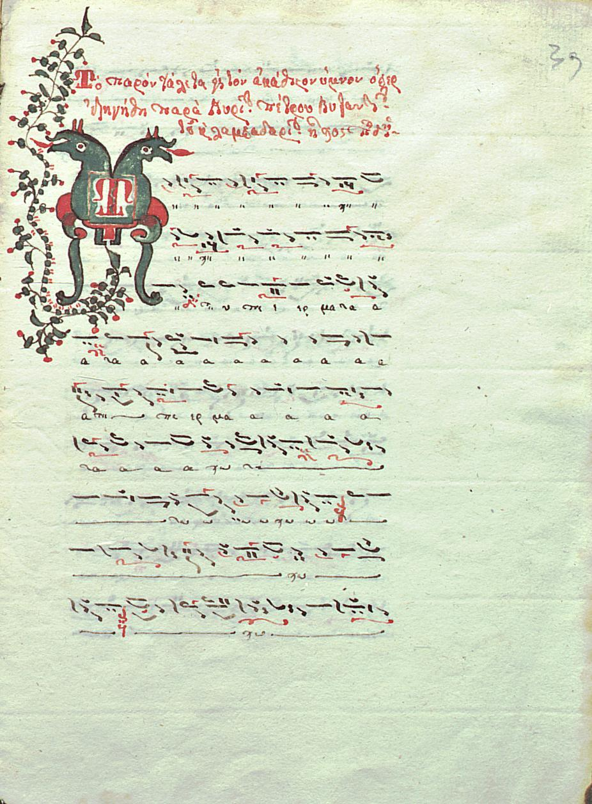

Figure 7.38. Ms. no. 99a of the Study Room of Classical Philology of the Faculty of Philosophy of Aristotle
University of Thessaloniki, p. 39. Anthology of the Papadike, late 18th c. In the photograph: beginning of Petros
Byzantios’s exegesis of the slow “To you, the Champion General,” plagal fourth mode (exegetical Middle Byzantine notation). © Central Library of

A.U.Th.

For a more detailed description and more photographs of the ms., see: Politis, Sotiroudis and Sakellaridou-
Sotiroudi (1991, pp. 93-94). <http://digital.lib.auth.gr/collection/Manuscripts?ln=el> (no. 37, [ARC-2007-38196]) and
<http://digital.lib.auth.gr/record/79963/files/1.pdf> (19.8.2016).

384

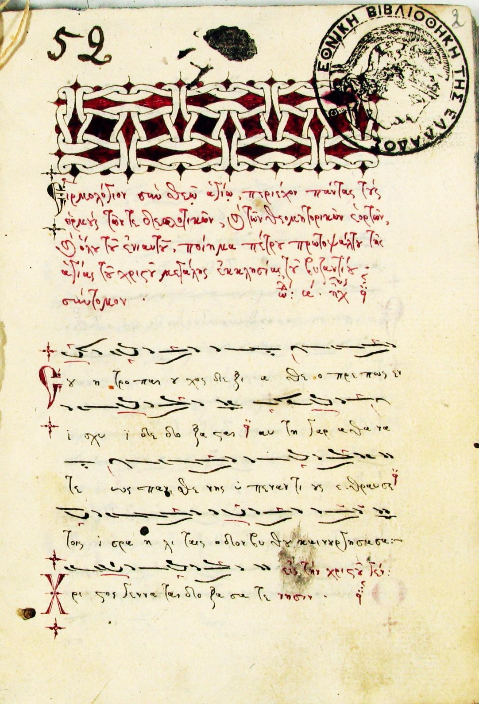

Figure 7.39. EBE 964, autograph of Petros Byzantios, year 1806, fol. 2r: “Heirmologion, with holy God, containing
all the heirmoi of the Feasts of the Lord, of the Theotokos, and of the whole year,
composition of Petros Protopsaltes of the Holy Great Church of Christ, the Byzantios; concise;
ode: 1; mode 1; Your trophy-bearing right hand.” The Heirmologion of Petros Byzantios is organized by mode and
ode. In the lower part of the folio is visible the beginning of the heirmos of ode 1 of the Canon of Christmas, “Christ
is born, glorify [him].”lix

385

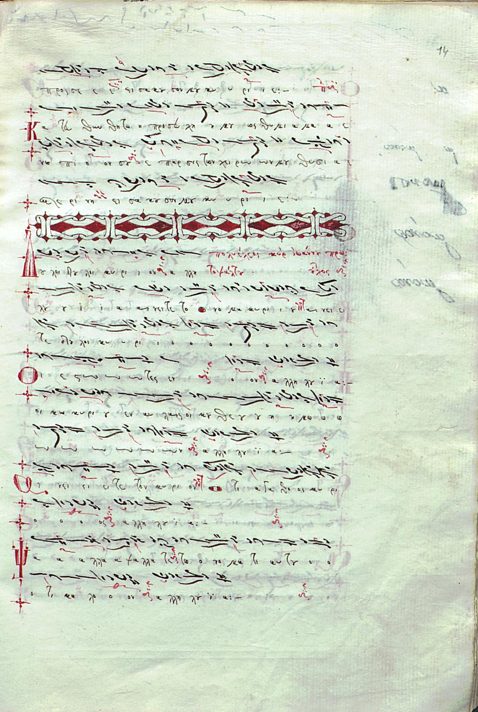

Figure 7.40. Ms. no. 57 of the Study Room of Classical Philology of the Faculty of Philosophy of Aristotle
University of Thessaloniki, fol. 14r. Anthology, autograph of Petros Byzantios, year 1796, in exegetical Middle Byzantine
notation. In the photograph: beginning of the Polyeleos of John Protopsaltes, mode 4. © Central Library of

A.U.Th.

For a more detailed description and more photographs of the ms., see: Politis, Sotiroudis and Sakellaridou-
Sotiroudi (1991, pp. 61-62). <http://digital.lib.auth.gr/collection/Manuscripts?ln=el> (no. 98, [ARC-2007-37960]) and
<http://digital.lib.auth.gr/record/79680/files/1.pdf> (19.8.2016).

386

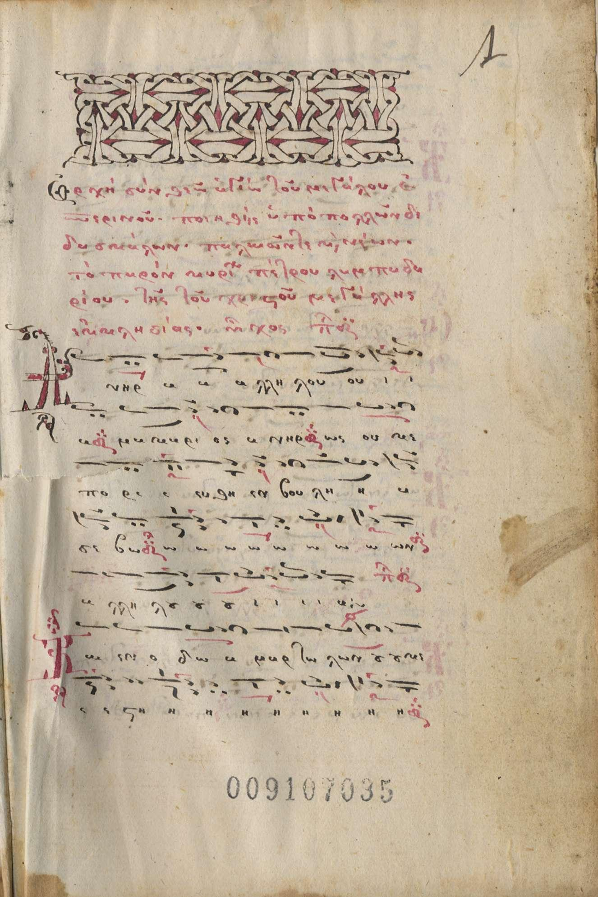

Figure 7.41. Ms. no. 30 of the Study Room of Classical Philology of the Faculty of Philosophy of Aristotle
University of Thessaloniki, fol. 1r. Papadike, second half of the 18th c., with exegetical Middle Byzantine notation. In the
photograph: beginning of “Blessed is the man,” plagal fourth mode, by Petros Peloponnesios. © Central Library of A.U.Th.
For a more detailed description and more photographs of the ms., see: Politis, Sotiroudis and Sakellaridou-
Sotiroudi (1991, pp. 32-33). <http://digital.lib.auth.gr/collection/Manuscripts?ln=el> (no. 31, [ARC-2007-38223]) and
<http://digital.lib.auth.gr/record/79993/files/1.pdf> (19.8.2016).

387

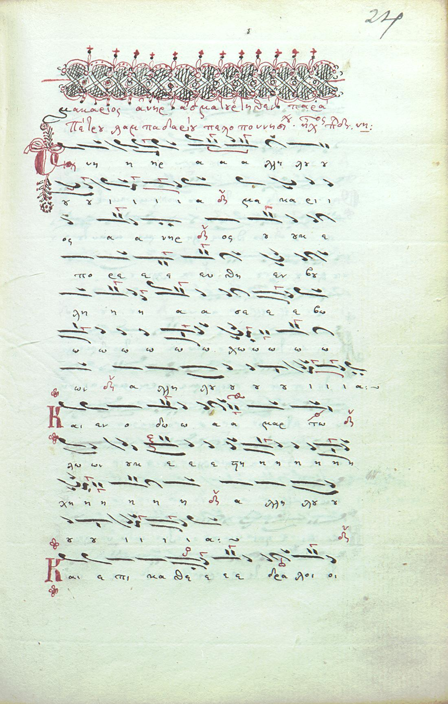

Figure 7.42. Ms. no. 7 of the Study Room of Classical Philology of the Faculty of Philosophy of Aristotle
University of Thessaloniki, fol. 24r. Volume IV of an Anthology of the Papadike, early 19th c., with notation of the New
Method. In the photograph: beginning of “Blessed is the man,” plagal fourth mode, melody by Petros Peloponnesios. © Central
Library of A.U.Th.
For a more detailed description and more photographs of the ms., see: Politis, Sotiroudis and Sakellaridou-
Sotiroudi (1991, p. 6). <http://digital.lib.auth.gr/collection/Manuscripts?ln=el> (no. 101, [ARC-2007-37952]) and
<http://digital.lib.auth.gr/record/79672/files/1.pdf> (19.8.2016).

388

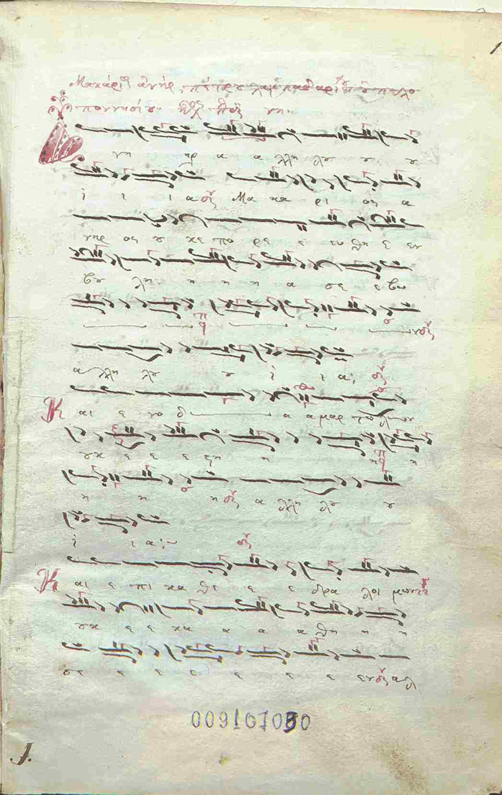

Figure 7.43. Ms. no. 14 of the Study Room
of the University of Thessaloniki, fol. 1r. Anthology
photograph: beginning of “Blessed is the man,”

A.U.Th.

For a more detailed description and more photographs of the
Sotiroudi (1991, pp. 12-13). <http://digital.lib.auth.gr/collection/Manuscripts?ln=el> (no. 79,
<http://digital.lib.auth.gr/record/79795/files/1.pdf> (19.8.2016).

of Classical Philology of the Faculty of Philosophy of Aristotle
of the Papadike, early 19th c., with notation of the New Method. In the
plagal fourth mode, melody by Petros Peloponnesios. © Central Library of

ms., see: Politis, Sotiroudis and Sakellaridou-
[ARC-2007-38054]) and

389

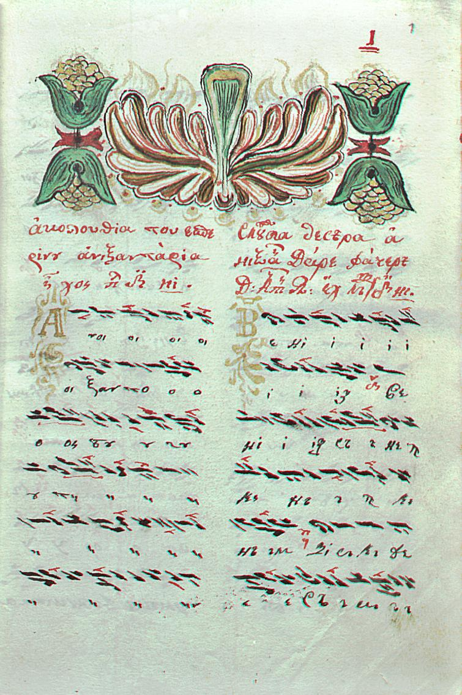

Figure 7.44. Ms. no. 64 of the Study Room
of the University of Thessaloniki, fol. 1r. Bilingual
Method. In the photograph: beginning of the

© Central Library of A.U.Th.

For a more detailed description and more photographs of the
Sotiroudi (1991, p. 68).
<http://digital.lib.auth.gr/record/79741/files/1.pdf> (19.8.2016).

of Classical Philology of the Faculty of Philosophy of Aristotle
Papadike (Greek-Romanian), 19th c., with notation of the New
Anoixantaria, plagal fourth mode. The Romanian text in Cyrillic characters.

ms., see: Politis, Sotiroudis and Sakellaridou-
<http://digital.lib.auth.gr/collection/Manuscripts?ln=el> (no. 88, [ARC-2007-38011]) and

390

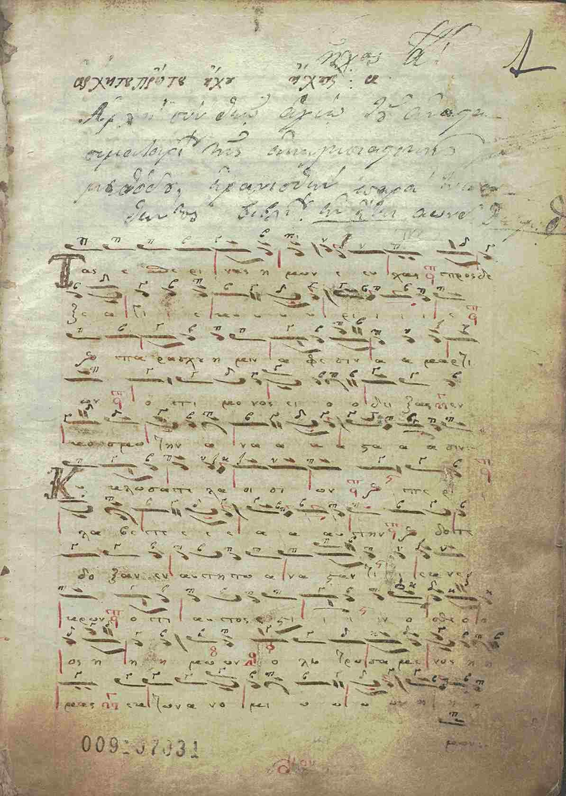

Figure 7.45. Ms. no. 15 of the Study Room of Classical Philology of the Faculty of Philosophy of Aristotle
University of Thessaloniki, fol. 1r: “Beginning, with holy God, of the Anastasimatarion of the ecclesiastical method,
excerpted from a printed book in the year ,αωνδ' [1854]. Dec. 9.” Notation of the New Method, with
the addition of four-beat measures and initials of the notes of parallage. (The measures continue up to fol. 59r, while the
initials of the notes are only on the first folio). © Central Library of A.U.Th.
For a more detailed description and more photographs of the ms., see: Politis, Sotiroudis and Sakellaridou-
Sotiroudi (1991, pp. 13-14). <http://digital.lib.auth.gr/collection/Manuscripts?ln=el> (no. 77, [ARC-2007-38061]) and
<http://digital.lib.auth.gr/record/79803/files/1.pdf> (19.8.2016).

391

## Evaluation Criteria for Chapter 7

Evaluation criterion 1a-c:
Creation of mnemonic theoretical and practical cards for

Middle Byzantine notation and the teaching game “NEUME”

   

Evaluation criterion 2:
Exercise in diplomatic transcription for an excerpt of the Protopapadike
Petropolitanus graecus 495, fol. 2v 

Evaluation criterion 3:
Exercise in transcribing the title and the paragraph on the ison from the Protheoria
of the Papadike, on the basis of ms. EBE 2401 

Evaluation criterion 4:
Exercise in transnotation of the heirmos “Day of Resurrection,” from the Heirmologion
of Grottaferrata EgII   & 

Evaluation criterion 5:
Exercise in transnotation of the heirmoi of the Canon of Christmas in the old
style, from the Heirmologion of Grottaferrata EgII   & 

Evaluation criterion 6:
Exercise in transnotation of the sticheron Mid-feast of the Feast in the old style,
from the Sticherarion A 139 sup. (MMB IX)   &  

Evaluation criterion 7:
Exercise in transnotation and comparison of the sticheron Prayer is a wondrous weapon in the old style, on the basis of two Sticheraria of 1340/1341

Assessment criterion 8:
Exercise in transnotation of the heirmos (εἱρμός) “Having gone down to the abyss” in the old style,
based on the Heirmologion Iviron 470 (transitional Middle Byzantine notation)  & 

392

## Assessment criterion 9

Exercise in transnotation of the Paschal troparion “Christ is risen”, from
the Sticherarion of Chrysaphes the Younger. Slow version, in late
Middle Byzantine notation, from the MS Naoussa, Euxeinos Lesche Pontion 33, year 1729, fol.
101r (facsimile and description in: Giannopoulos, 2005b, pp. 68-69 and 120, with
pl. 6a)lx 

Assessment criterion 10:
Exercise in reading and transcription from the Protheoria of the Papadike (Παπαδική), based on
the autograph of Demetrios Lotos from the island of Chios (MS Docheiariou Monastery 338, year
1767, fols. 1r-1v) 

## Bibliography for Chapter 7

## Liturgical books and

printed musical collections

“Holy Week” of Saint Demetrios. (1989). Ed. Ioannis Fountoulis. Texts in Liturgics, 17.
Thessaloniki: Publication of the Church of Saint Demetrios.
Ioannis Lampadarios and Stephanos, 1st Domestikos of the Great Church of Christ. (1850).
Pandect of the sacred ecclesiastical hymnody of the whole year. Volume 1. Vespers.
Constantinople: Patriarchal Printing House.
Joyful Pentecostarion. (1994). Athens: Publication of the Apostoliki Diakonia of the Church of Greece.
Petros Lampadarios the Peloponnesian. (1820). Concise Doxastarion. Translated according to the new method
of Music by the Most Learned Teachers of the new System. Ed. Petros Ephesios.
Bucharest. Repr. Athens: Koultoura.

Facsimile editions of musical and other manuscripts

Ciobanu, Gheorghe, & Ionescu, Marin. (1983). Antologhionul lui Evstatie Protopsaltul Putnei. Izvoare ale Muzicii
Româneşti, Vol. V, Documenta. Βucureşti: Editura Muzicală.
Ciobanu, Gheorghe, Ionescu, Marin, & Moisescu, Titus. (1981). Școala muzicală de la Putna, Manuscrisul nr. I-26/Iași.
Antologhion din Biblioteca Centrală Universitară "Mihai Eminescu" - Iași. Izvoare ale Muzicii Româneşti, Vol.
IV, Documenta. Βucureşti: Editura Muzicală.
Filothei Sin Agăi Jipei. (1981, 1984, 1986, 1992). Ed. Fr. Sebastian Barbu-Bucur. Psaltichie Rumănească. I Catavasier,
II Anastasimatar, III Stihirar, IV Stihirar-Penticostar. Izvoare ale Muzicii Românești, vol. VII A-D. București

(VII A-C): Editura Muzicală. Buzău (VII D).

Harlfinger, D., Reinsch, D.R., Sonderkamp, J.A.M., in Zusammenarbeit mit Prato, G. (Eds., 1983). Specimina Sinaitica.
Die datierten griechischen Handschriften des Katharinen-Klosters auf dem Berge Sinai, 9. bis 12. Jahrhundert.
Berlin: Dietrich Reimer Verlag.
Høeg, Carsten. (Ed., 1938). Heirmologium Athoum. MMB, Facsimiles II. Copenhagen: Ejnar Munksgaard.
Høeg, Carsten. (Ed., 1956). Contacarium Ashburnhamense. MMB, Facsimiles IV. Copenhagen: Ejnar Munksgaard.
Høeg, Carsten, Tillyard, H.J.W., and Wellesz, Egon. (Eds., 1935). Sticherarium. MMB, Facsimiles I. Copenhagen: Ejnar
Munksgaard.
Moisescu, Titus. (1994). Manuscrisul de la Dobrovăţ. Ms. 258 / Leimonos. Izvoare ale Muzicii Româneşti, Vol. XI,
Monumenta "Şcoala Muzicală de la Putna". Βucureşti: Editura Muzicală.
Perria, Lidia, & Raasted, Jørgen. (Eds., 1992). Sticherarium Ambrosianum. MMB, Facsimiles XI, Pars Principalis & Pars
Suppletoria. Copenhagen: Munksgaard.
Strunk, Oliver. (Ed., 1966). Specimina Notationum Antiquiorum. Folia selecta ex variis codicibus saec. x, xi, & xii
phototypice depicta. Monumenta Musicae Byzantinae, Facsimiles VII, Pars Principalis & Pars Suppletoria.
Hauniae: Ejnar Munksgaards Forlag.
Tardo, Lorenzo. (Ed., 1951). Hirmologium Cryptense. MMB, Facsimiles III, Pars Principalis & Pars Suppletoria. Roma.

393

## Catalogues of Byzantine and

post-Byzantine manuscripts

Giannopoulos, Emmanouil. (2005a). The manuscripts of the Psaltic Art of the Island of Andros. Analytical
descriptive catalogue. Andriaka Chronika, 36. Andros: Kaireios Library.
Giannopoulos, Emmanouil. (2005b). Archive of Manuscripts of the Psaltic Art. Society for Macedonian
Studies, Scientific Treatises, Philological and Theological Series, 20. Thessaloniki.
Giannopoulos, Emmanouil. (2008). The manuscripts of Byzantine music. England. Descriptive catalogue.
Holy Synod of the Church of Greece, IBM. Athens.
Giannopoulos, Emmanouil. (2016a). Basic bibliography for the manuscript codices of Psaltike. In E.
Giannopoulos, The Psaltic Art. Word and Melody in the worship of the Orthodox Church. Volume B (pp. 473-530).
Thessaloniki: Kyriakidis.
Gertsman, Evgeny. (1996). The Greek musical manuscripts of Petersburg. Catalogue. Volume A.
National Library of Russia. Saint Petersburg: Glagol.
Balageorgos, Dimitrios and Kritikou, Flora. (2008). The manuscripts of Byzantine music, Sinai, descriptive
catalogue. Volume A. Holy Synod of the Church of Greece, IBM. Athens.
Politis, Linos. (1991). Catalogue of manuscripts of the University of Thessaloniki. Edited and supplemented by

P. Sotiroudis and A. Sakellaridou-Sotiroudis. Thessaloniki: Aristotle University of Thessaloniki,

Central Library.
Politis, Linos and Politi, Maria. (1991). Catalogue of manuscripts of the National Library of Greece, nos.
1857-2500. Treatises of the Academy of Athens, vol. 54. Athens: Publications Office of the Academy of
Athens.
Stathis, Gregorios. (1975, 1976, 1993, 2015). The manuscripts of Byzantine music, Mount Athos. Holy Synod of the
Church of Greece - IBM. Volumes A-D. Athens.
Stathis, Gregorios. (1989). Chant differentiation as recorded in codex NLG 2458 of the
year 1336. In Scientific Symposium Christian Thessaloniki - Palaiologan Era. Centre for
the History of Thessaloniki of the Municipality of Thessaloniki, Independent Publications 3. 22nd Demetria, P.I.P.M., Vlatadon
Monastery, 29-31 October 1988 (pp. 165-211). Thessaloniki.
Stathis, Gregorios. (2006). The manuscripts of Byzantine music, Meteora. Holy Synod of the Church of
Greece - IBM. Athens.
Chaldaiakis, Achilleus. (2005). The manuscripts of ecclesiastical music, Island Greece, descriptive
catalogue, vol. A, Hydra. Holy Synod of the Church of Greece, IBM. Athens.
Chatzigiakoumis, Manolis. (1975). Musical manuscripts of the Ottoman period (1453-1832). Volume one. Athens.
Chatzigiakoumis, Manolis. (1980). Manuscripts of Ecclesiastical Music 1453-1820. Contribution to the study
of Modern Hellenism. Athens: Cultural Foundation of the National Bank.

Alexandrescu, Ozana. (2005). Catalogul manuscriselor de tradiție bizantină din secolul al XVII-lea. București: Arvin
Press.
Alexandrescu, Ozana, & Suceava, Daniel. (2010). Catalogul manuscriselor muzicale de tradiție bizantină din secolul al

XVIII-lea (Fondul grecesc din Biblioteca Academiei Române). Volumul I. Academia Română, Institutul de Istoria

Artei "G. Oprescu". București: Editura Muzicală.
Alexandrescu, Ozana. (2015). Catalogul manuscriselor muzicale de tradiție bizantină din secolul al XVIII-lea (Fondul
grecesc din Biblioteca Academiei Române). Volumul II. Academia Română, Institutul de Istoria Artei "G.
Oprescu". București: Editura Muzicală.
Bucca, Donatella. (2011). Catalogo dei manoscritti musicali greci del SS. Salvatore di Messina (Biblioteca Regionale
Universitaria di Messina). Roma: Comitato Nazionale per le Celebrazioni del Millenario della Fondazione
dell'Abbazia di S. Nilo a Grottaferrata.
Bucescu, Fr. Florin, Catrina, Constantin, Barnea, Alexandrel, Dănilă, Zamfira & al. (2010). Grantul "Catalogul
manuscriselor de musică sacră din Moldova - secolele XI-XX". Volumul I. Universitatea de Arte "George
Enescu" - Iași. Iași: Editura "Artes".
Schartau, Bjarne. (1994). Codices graeci haunienses. Ein deskriptiver Katalog des griechischen Handschriftenbestandes
der Königlichen Bibliothek Kopenhagen, mit zwei Appendices von Erik Petersen. Kopenhagen: Museum
Tusculanum Press.
Vasile, Vasile & al. (2010). Grantul "Catalogul manuscriselor de musică sacră din Moldova - secolele XI-XX".
Volumul II. Universitatea de Arte "George Enescu" - Iași. Iași: Editura "Artes".
Vasile, Vasile. (2007, 2008). Tezaur muzical românesc din Muntele Atos. 2 vols. București: Editura Muzicală.

394

Theoretical writings

Akribeia. Ed. Bjarne Schartau, Anonymous Questions and Answers on the Interval Signs. Monumenta Musicae
Byzantinae, Corpus Scriptorum de Re Musica, ΙV. Wien: Verlag der Österreichischen Akademie der
Wissenschaften, 1998.
Apostolopoulos, Thomas. (2002). Apostolos Konstas of Chios and his contribution to the theory of the Musical
Art. IBM, Studies 4. Ed. Gr. Stathis. Athens.
Gabriel Hieromonachos. On the signs in psaltike. Ed. Chr. Hannick and G. Wolfram, Gabriel
Hieromonachos, Abhandlung über den Kirchengesang. Monumenta Musicae Byzantinae, Corpus Scriptorum de
Re Musica, Ι. Wien: Verlag der Österreichischen Akademie der Wissenschaften, 1985.
Karas, Simon. (1982). Method of Greek music. Theoretical. 2 vols. Athens: Society for the Dissemination of
National Music.

Gertsman, Εvgeny Vladimirovich. (Ed., 1994). Petersburg Theoreticon. Odessa: Variant Publishers.
Tardo, Lorenzo, Jeromonaco. (1938). Lʼ antica melurgia bizantina nellʼ interpretazione della Scuola Monastica di
Grottaferrata. Grottaferrata.

Books and articles

Adamis, Michalis. (1986). Polyphonic ecclesiastical music in fifteenth-century Byzantium. Musicologia, 2, issue 1,

51-63.

Adamis, Michalis. (2002). Service for the Three Holy Children in the Furnace. Malbork, Poland. (5 pages [from
a concert programme?]).
Alexandrou, Maria. (2010). Exegeseis and transcriptions of Byzantine music. A brief introduction to
their problems. Thessaloniki: University Studio Press.
Alygizakis, Antonios. (2005). Musical manuscripts. In Alexandros Makridis, Nikolaos Toutos and Georgios
Fousteris (eds.), Saint Demetrios in the art of Mount Athos (pp. 49-58). Thessaloniki: Mount Athos
Centre.
Arvanitis, Ioannis. (2003). The rhythmic and metrical structure of Byzantine heirmoi and stichera as a means
and as the result of a new rhythmic interpretation of Byzantine chant. In Eustathios Makris (ed.),
The two aspects of the Greek musical heritage. Tribute in memory of Spyridon Peristeris, Academy of
Athens, Publications of the Centre for the Study of Greek Folklore, no. 18 (pp. 151-176). Athens.
Arvanitis, Ioannis. (2006). Indications and proofs for the concise interpretation of the Old Sticherarion.
In Gr. Anastasiou (ed.), Theory and Practice of the Psaltic Art. The genera and species of
Byzantine psaltic composition. Proceedings of the 2nd International Congress of Musicology and Psaltike,
Athens, 15-19 October 2003. Holy Synod of the Church of Greece - IBM (pp. 233-253). Athens:
Ed. Gr. Stathis.
Arvanitis, Ioannis. (2010). The rhythm of ecclesiastical chants through palaeographical research and the exegesis
of the old notation. Doctoral dissertation, 2 vols. Ionian University, Department of Music Studies.
Corfu.
Giannopoulos, Emmanouil St. (2016). The Psaltic Art. Word and Melody in the Worship of the Orthodox Church. Volume
B. Thessaloniki: Kyriakidis Publications.
Detorakis, Theochariis. (1995 and 2003). Byzantine Philology. The persons and the texts. 2 vols. Heraklion,
Crete.
Treasures of Mount Athos. Series A. Illuminated manuscripts. Representations - headpieces - initial
letters. (1973, 1975, 1979, 1991). Patriarchal Institute for Patristic Studies. Volumes A-B: Styl.
Pelekanidis, Panag. K. Christou, Chrys. Mavropoulou-Tsioumi, Sot. N. Kadas. Volume C: Styl. Pelekanidis,
Panag. K. Christou, Chrys. Mavropoulou-Tsioumi, Sot. N. Kadas, Aik. Katsarou. Volume D: Panag. K.
Christou, Chrys. Mavropoulou-Tsioumi, Sot. N. Kadas, Aik. Kalamartzi-Katsarou. Athens: Ekdotiki
Athinon.
Iordanidou, Anna. (2000). The verbs of Modern Greek (11th ed.). Athens: Patakis.
Kyriakoudis, Evangelos. (2005). Portable and paper icons, illuminated manuscripts. In
Alexandros Makridis, Nikolaos Toutos and Georgios Fousteris (eds.), Saint Demetrios in the art
of Mount Athos (pp. 85-152). Thessaloniki: Mount Athos Centre.
Babiniotis, Georgios. (2002). Dictionary of the Modern Greek language (2nd ed.). Athens: Centre for Lexicology.

395

Boukas, Nikolaos. (2004). The tradition of the heirmologic Byzantine melodies of the varys mode from the 10th to the
16th century. Doctoral dissertation. Ionian University, Department of Music Studies. Corfu.

Spyrakou, Evangelia. (2008). The choirs of cantors according to the Byzantine tradition. Institute of Byzantine
Musicology. Studies, 14. Published by Gr. Stathis. Athens.
Stathis, Gregorios. (1975). The old Byzantine notation and the problem of its transcription into
staff notation. Byzantina, 7, 427-460.
Stathis, Gregorios. (1992). The anagrammatismoi and the mathemata of Byzantine composition. IBM, Studies 3
(2nd ed.). Athens.
Stathis, Gregorios. (1997). Course file “Analytical Byzantine notation”. Athens: National and
Kapodistrian University of Athens, Department of Music Studies.
Stathis, Gregorios. (1998). Course file “Byzantine notation and palaeography”. Athens: National
and Kapodistrian University of Athens, Department of Music Studies.
Stathis, Gregorios. (2001d). "Double melody". A presentation of cases of "Latin Music"
in manuscripts of Byzantine Music. In Honour to the teacher. An expression of love for
Professor Gregorios Th. Stathis (pp. 656-674). Athens: Anatolis to Periichema.
Floros, Konstantinos. (1998). The Greek tradition in the musical scripts of the Middle Ages. Introduction to Neumatic
Science. Transl.-ed. Kostas Kakavelakis, philol. ed. N. Avramopoulos. Thessaloniki: Ziti.
Chatzigiakoumis, Manolis K. (1999). The ecclesiastical music of Hellenism after the Fall (1453-1820).
Outline of a history. Athens: Centre for Research & Publications.
Chatzidaki, Nano. (1994). Greek Art. Byzantine Mosaics. Athens: Ekdotiki Athinon.

Alexandrescu, Ozana. (2013). Ioan Kampazournas în Țara Românească. In Nicolae Gheorghiță, Costin Moisil and Daniel
Suceava (eds.), Simpozionul Internațional de Muzicologie Bizantină. 300 de ani de românire (1713-2013), ediția
a II-a (pp. 33-37). Universitatea Națională de Muzică din București. Academia Română - Institutul de Istoria Artei
"G. Oprescu". București: Glissando. Editura Universității Naționale de Muzică București.
Alexandru, Maria. (2000). Studie über die 'grossen Zeichen' der byzantinischen musikalischen Notation, unter
besonderer Berücksichtigung der Periode vom Ende des 12. bis Anfang des 19. Jahrhunderts. Doctoral
dissertation. 3 vols. Kopenhagen: Universität Kopenhagen, Humanistische Fakultät.
Alexandru, Maria. (2011). Christ our God, ein emblematisches Sticheron zum Hl. Kreuz. Ansätze zu einem
multiprismatischen Analysemodell aufgrund von J. Raasteds Strukturierungsmethode byzantinischer Troparia.
Études Byzantines et Post-byzantines, 6, pp. 325-345, plates 1-7.2 & appendices I-II.
Alexandru, Maria, & Troelsgård, Christian. (2008). The importance of the so-called protheoria of the Papadike for the study of
Byzantine and post-Byzantine music. In Basile Atsalos et Niki Tsironi (eds.), Actes du VIe Colloque
International de Paléographie Grecque (Drama, 21-27 septembre 2003), (vol. ΙΙ, pp. 559-572 & vol. ΙΙΙ, pp. 1221-
1233). Athènes: Société Hellénique de Reliure.
Alexandru, Maria, & Troelsgård, Christian. (2013). The development of a didactic tradition - The elements of the
Papadike. In Gerda Wolfram & Christian Troelsgård (eds.), Tradition and Innovation in Late- and Postbyzantine
Liturgical Chant, Proceedings of the Congress held at Hernen Castle, the Netherlands, 30 October - 3 November
2008 (pp. 1-57). Leuven - Paris - Walpole MA: Α.Α. Bredius Foundation, Peeters. Eastern Christian Studies, 17.
Atkinson, Charles M. (2009). The Critical Nexus. Tone-System, Mode, and Notation in Early Medieval Music. Oxford:
University Press.
Danuser, Hermann. (1998). Vortrag. In Ludwig Finscher (ed.), Die Musik in Geschichte und Gegenwart, Allgemeine
Enzyklopädie der Musik, begründet von Friedrich Blume (zweite, neubearbeitete Auflage), vol. 9 (cols. 1817-
1836). Kassel-Basel-London-New York-Prag: Bärenreiter, Stuttgart-Weimar: Metzler.
Floros, Constantin. (1970). Universale Neumenkunde. 3 vols. Kassel: Bärenreiter Antiquariat, Kassel-Wilhelmshöhe.
Huglo, Michel, & Brockett, Clyde. Odo. In L. Macy (ed.), Τhe New Grove Dictionary of Music Online. Retrieved from
<http://www/grovemusic.com> (25.11.2005).
Husmann, Heinrich. (1972). Strophenbau und Kontrafakturtechnik der Stichera. Archiv für Musikwissenschaft, xxix, 150-
161 and 213-234.
Jammers, Ewald. (1962). Musik in Byzanz, im päpstlichen Rom und im Frankenreich: Der Choral als Musik der
Textaussprache. Abhandlungen der Heidelberger Akademie der Wissenschaften, Phil.-hist. Kl. Heidelberg.
Kalaitzidis, Kyriakos. (2012). Post-Byzantine Music Manuscripts as a Source for Oriental Secular Music (15th to Early
19th Century). Τransl. Kiriaki Koubaroulis & Dimitri Koubaroulis. Istanbuler Texte und Studien herausgegeben
vom Orient‐Institut Istanbuls, Bd. 28. Würzburg: Ergon Verlag.
Levy, Kenneth. (1958). The Byzantine Sanctus and its Modal Tradition in East and West. Annales musicologiques, 6, 7-

1.

Lütteken, Laurenz. (1997). v. Mensuralnotation. Part of the entry Notation. In Ludwig Finscher (ed.), Die Musik
in Geschichte und Gegenwart, Allgemeine Enzyklopädie der Musik, begründet von Friedrich Blume (zweite,

396

neubearbeitete Auflage), vol. 7 (cols. 323-339). Kassel-Basel-London-New York-Prag: Bärenreiter, Stuttgart-
Weimar: Metzler.
Papathanassiou, Ioannis. (1997). The musical notation of the Sticherarion MS Vat. Barb. gr. 483. In Christian Troelsgård
(ed.), Byzantine Chant. Tradition and Reform, Acts of a Meeting held at the Danish Institute at Athens, 1993.
Monographs of the Danish Institute at Athens, vol. 2 (pp. 53-67). Athens: The Danish Institute at Athens.
Distributed by Aarhus University Press.
Petresco, Père J.-D. (1932). Les idiomèles et le canon de l' Office de Noël (d' après des manuscrits grecs des XIe, XIIe,
XIIIe et XIVe s.). Préface de M. A. Gastoué. Paris: Librairie Orientaliste Paul Geuthner.
Raasted, Jørgen. (1966a). Intonation formulas and modal signatures in Byzantine musical manuscripts. MMB, Subsidia

VII. Copenhagen: Munksgaard.

Raasted, Jørgen. (1966b). Some Reflections on Byzantine Musical Style. Studies in Eastern Chant, 1, 57-66.
Raasted, Jørgen. (1986). Thoughts on a Revision of the Transcription Rules of the Monumenta Musicae Byzantinae.
CIMAGL, 54, 13-37.
Raasted, Jørgen. (1995a). An Old Melody for Tῇ Ὑπερμάχῳ. In Alberto Doda (ed.), Studi di Musica Bizantina in
onore di Giovanni Marzi. Studi e Testi Musicali, Nuova Serie 6 (pp. 3-14). Lucca.
Raasted, Jørgen. (1995b). Koukouzeles' Revision of the Sticherarion and Sinai gr. 1230. In J. Szendrei and D. Hiley
(eds.), Laborare fratres in unum. Festschrift László Dobszay zum 60. Geburtstag, Spolia Berolinensia 7 (pp. 261-

277).

Raasted, Jørgen. (1995c). Byzantinische Neumen und Kirchengesang. Ein Minimalkursus für neugierige Musikologen
anderer Fachgebiete. Copenhagen, 1993, published in: Cantus Planus 6, vol. Β.
Raasted, Jørgen. (1997). Koukouzeles' Sticherarion. In Christian Troelsgård (ed.), Byzantine Chant. Tradition and
Reform. Acts of a Meeting held at the Danish Institute at Athens, 1993, Monographs of the Danish Institute at
Athens, vol. 2 (pp. 9-21). Aarhus: Αarhus University Press.
Tillyard, H.J.W. (1935, repr. 1970). Handbook of the Middle Byzantine Musical Notation. Second impression, with a
postscript by Oliver Strunk. Monumenta Musicae Byzantinae, Subsidia, Vol. I, Fasc. 1. Copenhague:
Munksgaard.
Tillyard, H. J. W. (1938). The Hymns of the Sticherarium for November. Monumenta Musicae Byzantinae, Transcripta II.
Copenhague: Levin & Ejnar Munksgaard.
Troelsgård, Christian. (2011). Byzantine Neumes. Α Νew Introduction to the Middle Byzantine Musical Notation. MMB,
Subsidia IX. Copenhagen: Tusculanum Press.
Velimirović, Miloš. (1962). Liturgical Drama in Byzantium and Russia. Dumbarton Oaks Papers, 16, 349-385. URL:
<http://www.jstor.org/stable/1291166> (30.04.2009).
Wellesz, Egon. (1962). A History of Byzanitne Music and Hymnography (2nd ed. revised and enlarged). Oxford:
Clarendon Press.
Wolfram, Gerda. (2008). Die melodische Tradition des Psaltikon im Vergleich mit dem kalophonischen Repertoire. In
Gerda Wolfram (ed.), Tradition and Innovation in Late- and Postbyzantine Liturgical Chant, Acta of the
Congress held at Hernen Castle, the Netherlands, in April 2005 (pp. 79-104). Leuven - Paris - Dudley MA: Α.Α.
Bredius Foundation, Peeters. Eastern Christian Studies, 8.
Wolfram, Gerda. (2013). Xenos Korones' Method of the Sticherarion. In Gerda Wolfram & Christian Troelsgård (eds.),
Tradition and Innovation in Late- and Postbyzantine Liturgical Chant, Proceedings of the Congress held at
Hernen Castle, the Netherlands, 30 October - 3 November 2008 (pp. 123-134). Leuven - Paris - Walpole MA:

Α.Α. Bredius Foundation, Peeters. Eastern Christian Studies, 17.

Recordings, broadcasts, etc.

Holy Pascha. From the Service of the Resurrection. Sung by the Choir of the Vatopaidi Fathers. Holy and Great
Monastery of Vatopaidi. University of Crete Press. P.E.K./C.U.P. 27.
Service for the Three Holy Children in the Furnace. Transcription, reconstruction of the Service by Michalis
Adamis, Greek Byzantine Choir, choirmaster Lykourgos Angelopoulos. Ed. Sotiria Adam, direction
Stella Arkenti. Athens, 2011. DVD of a broadcast from the Parliament Channel.
Service of Pannychis. Sunday of the Veneration of the Cross 2009. Address by Emeritus Professor of the Univ.
of Athens Mr Gr. Stathis. Performance by the choir of cantors “Trikkis Melodoi”, choirmaster Dim.
Balageorgos. DVD production: Gregorios D. Karpouzas. Holy Metropolis of Stagoi and Meteora, Holy
Byzantine Church of the Dormition of the Theotokos, Kalambaka.
Greek Byzantine Choir. Lykourgos Angelopoulos. (1990). Ancient Greek and Byzantine music at
Epidaurus. Athens. Digital D.D.A. cassette. ELBYCH 10.

Cappella Romana. Alexander Lingas. (2011). Medieval Byzantine Chant. Mt. Sinai: Frontier of Byzantium. From the
Vespers for St. Catherine & the Service of the Furnace. CR407-CD.

397

Webography

<http://www/grovemusic.com> (25.11.2005).
<http://www.jstor.org/stable/1291166> (30.04.2009).
<https://en.wikipedia.org/wiki/Sticheron> (12.9.2016).

## Endnotes for chapter 7

i For the description of codex Patmos 218 and an earlier publication of this and other folios of

this manuscript, cf. Floros (1970, vol. Ι, pp. 60-61 and ΙΙΙ, facsimiles 67-72). Cf. also Troelsgård (2011, p.

95).

ii Cf. Papathanassiou (1997, p. 57). Two other important manuscripts with Middle Byzantine transitional notation
are the following: Patmos 221 (Psaltikon, dated between 1168-1179 or 1161-1180: Papathanassiou, 1997, p. 57) and
Iviron 470 (Heirmologion, around 1150: Floros, 1970, vol. Ι, p. 66). Cf. also Troelsgård (2011, pp. 95-97).
iii For further information regarding this MS, cf. Balageorgos & Kritikou (2008, pp. 29-31). Harlfinger,
Reinsch, Sonderkamp, & Prato (eds., 1983, pp. 56-57 and pls. 144-148).
iv For a detailed description of this MS, cf. Stathis (1989).
v For the concept of a paradigm shift in the development of old Western musical notation, cf. Lütteken (col.

335: zeitlicher Paradigmenwechsel, regarding the passage from modal [Modalnotation] to mensural notation

[Mensuralnotation], 13th-14th c., and col. 339: notationsgeschichtlicher Paradigmenwechsel, regarding the changes in
notation during the late 16th and the 17th century, with the consolidation of monody and the formation of the Western
notation still in use today [moderne, noch heute gültige Taktnotation]).
vi Floros (1998, p. 148).
vii The date of the formation of Middle Byzantine notation is placed in the 1st half of the 12th century
(Papathanassiou, 1997, p. 57) or around 1150 (Τroelsgård, 2011, back cover).
viii "From about 1175 until the time of Chrysanthos, whose first publication appeared in 1821, the notation used in
the transmission of Byzantine chant underwent no radical change. With the general acceptance of the diastematic
principle at the very beginning of this long time-span, Byzantine musicians had taken a crucial step, a step no less
crucial than the analogous one taken in the West at a somewhat earlier date, and once this crucial step had been
taken, there could be no turning back. In the light of this historic moment, the notational innovations of Joannes
Koukouzeles, his fellow maistores, and their followers stand revealed as mere extensions of an established system,
called forth by the increasingly exacting demands of a rapidly evolving musical style." (Strunk, ed., 1966,
Specimina, Pars Suppletoria, p. 1). A Greek translation of this passage is also found in Stathis (1998, p. 38,
translation of the specific passage by Melina Karoumpali).
ix Cf., for example, the chapter “Periods of Byzantine composition, in parallel with the development of
Byzantine notation”, in Stathis (1992, pp. 47-59).
x As Troelsgård notes (2011, p. 30, footnote 86), the term Middle Byzantine notation derives from

E. Wellesz (1916), while that of Round notation (Round notation - Runde Notation) derives from Hugo

Riemann (1909). According to Troelsgård, the latter designation, which is based chiefly on the form of the ison (more
rounded in Middle Byzantine notation, in relation to the hooked form of the Old Byzantine ison
of the Coislin notation), is less successful, since the hooked form of the ison is also observed in MSS with
early Middle Byzantine script. The periodizations that follow in the main text are based on the following aids:
Floros (1970, vol. I, pp. 50-66). Troelsgård (2011). Stathis (1992, pp. 47-59). Papathanassiou (1997). Boukas (2004, pp. 42-

59). For earlier proposals for the periodization of Byzantine notation, of which the most prevalent was:

Εarly Byzantine (ca. 950-1200), Middle Byzantine or Round notation (ca.1100-1450), Late Byzantine (1400-1821),
Modern or Chrysanthine (from 1821), cf. Tillyard (1935, pp. 13-18).
xi See Jammers (1962, pp. 70, 41, 6, 85). Cf. also Alexandrou (2010, p. 29, n. 49, and p. 75).
xii Cf. Stathis (1975, pp. 211-213).
xiii Cf. Themelis, Dimitrios and Giannou, Dimitrios. (2001). Introductory note by members of the Selection Committee
for the election of a faculty member in the Department of Music Studies. Thessaloniki: Aristotle University of Thessaloniki,

p. 9 (document of the Secretariat of the Department of Music Studies).

xiv Cf. Arvanitis (2006, pp. 244-253). Alexandrou (2010, pp. 36-43).
xv The present section takes as its starting point: Alexandru & Troelsgård (2008, especially vol. ΙΙ, pp. 562-567 and vol. ΙΙΙ, pp. 1223-
1225).
xvi Cf. Harlfinger, Reinsch, Sonderkamp, & Prato (eds., 1983, pp. 56-57 and pl. 7). Raasted (1966a, p. 48).

398

||
|---|
||

xvii Cf. Gertsman (ed., 1994, pp. 229-240 and pls. LII-LVIII).
xviii Cf. Floros (1970, vol. ΙΙΙ, facsimile 2). Alexandru & Troelsgård (2008, vol. ΙΙ, p. 564 and vol. ΙΙΙ, p. 1223).
xix Alexandru & Troelsgård (2008, vol. ΙΙ, p. 563).
xx The table was taken, with some changes, especially concerning the four types of Protheoria, from: Alexandru &
Troelsgård (2008, vol. ΙΙ, pp. 567-568). Cf. also the same authors (2013).
xxi Cf. Floros (1970, vol. Ι, pp. 117-119).
xxii For descriptions of the MS, cf. Stathis (1975, pp. 406-417) and Chatzigiakoumis (1980, Part B, pp. 170-171, Part
D, pl. 83 and Part E, pl. 16).
xxiii Cf. Tardo (1938, pp. 151-163).
xxiv Floros (1970, vol. ΙΙΙ, facsimiles 3-8).
xxv For the ison, cf. Iviron 970, f. 2r. The aporrhoe, which is included neither among the somata nor among the pneumata,
is sometimes also called “melos”, perhaps under the influence of the Hagiopolite classification of signs, which
had a corresponding subcategory of signs: cf. chap. 6, Table 6.2.
xxvi According to Politis & Politi (1991, pp. 394-395), the MS is probably dated between the years 1452-1469.
A slightly earlier date (early 15th c.) is found in Kalaitzidis (2012, pl. 1).
xxvii On cheironomia, cf. further information in chap. 10 of the present work.
xxviii Cf. the Protheoria of the Papadike in various manuscripts. Gabriel Hieromonachos, On the signs in psaltike
(ed. Hannick & Wolfram, 1985). Raasted (1966a, the inserted booklet "A Key to the Round Notation").
Cf. also Troelsgård (2011, the inserted booklet "Quick Reference Card").
xxix The present table is based on the following sources and aids: Protheoria of the Papadike from the MS of the Holy Monastery of Iviron
970, ff. 3v-4r, from the facsimile edition in Stathis (1997, pp. 40-41).
xxx For the conceptual pair Struktursinn - Aufführungssinn in Western European music, cf. Danuser (1998). For
the levels of structure and performance in Byzantine music, cf. Alexandru (2000, vol. Ι, pp. 196-362).
xxxi Cf. Tillyard (1935, repr. 1970, pp. 22-23). Levy (1958, p. 30). Jammers (1962, pp. 158-160). Husmann (1972, p.

229). Raasted (1966b, pp. 59-60, and idem, "A method of structuralization, demonstrated by three examples",

handout for the course Extensive lecture of stichera, University of Copenhagen, 11.11.1994, published
in: Alexandru, 2011, Anhang I, before p. 337). For further information, cf. Alexandrou (2010, example 11).
xxxii Cf. Raasted (1995c, p. 10) and Huglo & Brockett, "Odo" (chiefly no. 3, on Pseudo-Odo, Dialogus de musica):
<http://www.grovemusic.com> (25.11.2005, with thanks to Dr Anna Karanikola). Alexandrou (2010, section 3.2.4.2).
xxxiii Cf. Raasted (1966a, especially p. 8).Troelsgård (2011, p. 40). Alexandrou (2010, section 3.2.4.1).
xxxiv Alexandrou (2010, table 8).
xxxv For further information regarding various kinds of transfer of Byzantine music to staff notation, cf. Lingas
(2003).
xxxvi See Wellesz (1966, p. 404).
xxxvii Cf. Karas (1982, Theoretical, vol. Α, pp. 181-183) on the isaki. Cf. also Mazaraki (1992, pp. 129-130).
xxxviii Example of the small ison and the apostrophos in similar position from the MS of the Holy Monastery of Konstamonitou 84, f. 196r,
year 1748: Figure 7.15.9. We have conventionally named the apostrophos in this position “apostrophaki”, by analogy with the
“isaki”, to facilitate students’ understanding. Cf. also Troelsgård (2011, p. 46: "Small interval
signs").
xxxix For details regarding successive measurements of micro-intervals in the East during the 19th and early 20th
century, cf. Chatzimichelakis (2013).
xl Sketch based on lectures by the late Professor Dragoș Alexandrescu, Conservatorul de muzică Ciprian
Porumbescu, Bucharest, 1988-1989.
xli For the present musical example, see chap. 2, Exercise 1, Contexts.
xlii Cf. Detorakis (2003, p. 280).
xliii The copying of the neumes was done on the basis of the microfilm of MS Koutloumousiou 412, from the Patriarchal Institute
for Patristic Studies, Vlatadon Monastery, Thessaloniki, together with a detail of the sticheron in a colour
photograph in: Kyriakoudis (2005, p. 152, fig. 93). Also consulted, for the transliteration and the
authorship of the sticheron: Perria & Raasted (eds., 1992), Sticherarium Ambrosianum, Pars Principalis & Pars Suppletoria

(p. 57).

xliv Cf. a list with electronic addresses in the article "Sticheron" on Wikipedia:
<https://en.wikipedia.org/wiki/Sticheron> (12.9.2016).
xlv For an earlier publication of this folio, cf. Alygizakis (2005, p. 54, fig. 2).
xlvi Cf. Boukas (2004, p. 43).
xlvii We thank Mr Demosthenis Spanoudakis for the photograph from the edition of the codex.
xlviii Concerning the date of the MS, see Kalaitzidis (2012, plate 1: early 15th c.) and Politis & Politi (1991, pp.

314-336: probable date: 1452-1469).

xlix We thank Mr Demosthenis Spanoudakis for photographing folios from codex NLG 2401 for the present handbook.

399

l A recording of the second koinonikon Aineite by Gazes, in mode IV-plagal IV, based on the transcription by Michalis
Adamis (1986, pp. 59-61), was made by the Greek Byzantine Choir, dir. Lykourgos Angelopoulos
(1990). Cf. also MS Dochariou 315 (late 16th-early 17th c.), ff. 66v-67r, containing another koinonikon
Aineite, plagal IV mode, with double lines (black and red) and with the inscription “double melos, according to
the chant of the Latins” (Stathis, 1975, pp. 348-352 and pl. XIV). On the whole subject of the double melos, cf.
Stathis (2001d).
li Cf. also Floros (1970, vol. ΙΙ, pp. 259-260, regarding the old style of the Psaltikon in some stichera) and Wolfram
(2008, on similarities and differences between the styles of kalophony and of the Psaltikon).
lii Cf. description of the MS in: Chatzigiakoumis (1980, pp. 109-110). We thank Mr Demosthenis Spanoudakis for
photographing some folios from codex NLG 2406 for the present handbook.
liii Cf. Wolfram (2013).
liv For recording-reconstructions cf. Service for the Three Holy Children in the Furnace.
Transcription, reconstruction of the Service by Michalis Adamis, Greek Byzantine Choir, choirmaster Lykourgos
Angelopoulos. Ed. Sotiria Adam, direction Stella Arkenti. Athens, 2011. DVD of a broadcast from the Parliament Channel
(with thanks to Mr Angelopoulos and Ms Adam). Cf. also Cappella Romana (Lingas, 2011).
lv We thank Mr Athanasios Trikoupis for the photograph. For further information regarding this MS,
cf. chap. 11, assessment criterion 7, Figure 11.44.
lvi For a description of this manuscript, cf. Schartau (1994, pp. 327-335). We thank Mr Giuseppe Sanfrattelo for photographing the folios from
MS ΝkS 4466.
lvii Cf. also Chatzidaki (1994, p. 245).
lviii For the slow exegesis of the ancient Tē Hypermachō, see Ioannis Lampadarios & Stephanos, 1st Domestikos (1850,
Pandect, pp. 384-389). Cf. also Raasted (1995a). Psaltikon Ashburnhamensis L 64, f. 108r ff., year 1286,
provenance: Grottaferrata, in Høeg (ed., 1956, MMB ΙV).
lix For further information regarding this MS, cf. Chatzigiakoumis (1975, p. 365).
lx Cf. the Christos anesti in concise and slow-concise versions, and as “another slow one, ancient melos, as
sung on Mount Athos”, together with corresponding scores in the New Method, on the CD Holy Pascha (P.E.K. 27) and
in the accompanying booklet.

400
