Summary
This chapter focuses on issues concerning the manner of teaching in the Old System. More
specifically, it deals with the concept of metrophony (μετροφωνία), that is, the quantitative measurement of individual
intervals, musical lines, and entire pieces, in conjunction with parallage with
polysyllabic pitch names, and with the transition to melos, i.e. the traditional sonic result. The
sources on which this chapter is based consist of theoretical manuals, lists of signs, and
didactic poems. A central place is occupied by the methods “Choros tetradekapyrseutos” and “Theologe
parthene”. In connection with the latter, reference is also made to the question of chromaticism in the practice and
theory of medieval psalmody.

Prerequisite knowledge
Knowledge of the

New Method is required, as well as the study of chapters 7-8.

## 1. Didactic approaches in the New and the Old System

Chrysanthos of Madytos determines in his Introduction (1821) that the learning of pieces in the new,
analytical notation will take place in two steps: 1. Parallage, with the application of the monosyllabic
pitch names to each note sign, and 2. Melos, with the pronunciation of the syllables of the text on each
pitch sign (see Figures 9.1.-2).

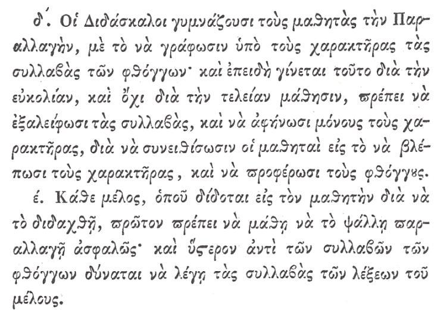

Figure 9.1. The process of learning pieces in the New Method: parallage and melos.
Source: Chrysanthos of Madytos (1821). Introduction to the Theoretical and Practical Aspects
of Ecclesiastical Music. Paris: Rigniou (repr. Koultoura), p. 11.

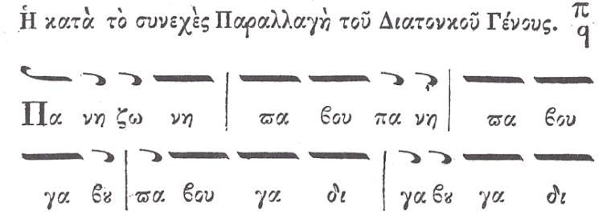

of ecclesiastical

Figure 9.2. Example of parallage in the New Method.
Source: Chrysanthos of Madytos (1821). Introduction
to Music. Paris: Rigniou (repr. Koultoura), p. 9.

to the Theoretical and Practical Aspects of Ecclesiastical

The same music theorist informs us that, according to the Old System, the didactic procedure
was more complex and included three steps: parallage, metrophony, and melos (see Figure

9.3.).

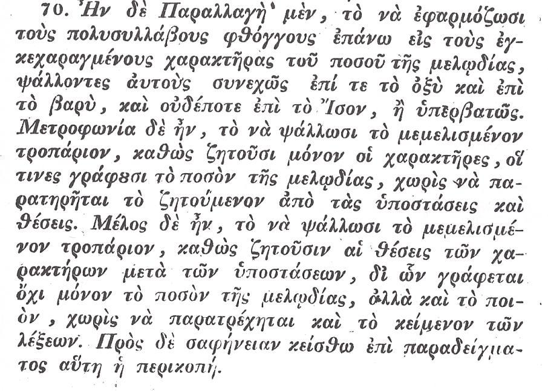
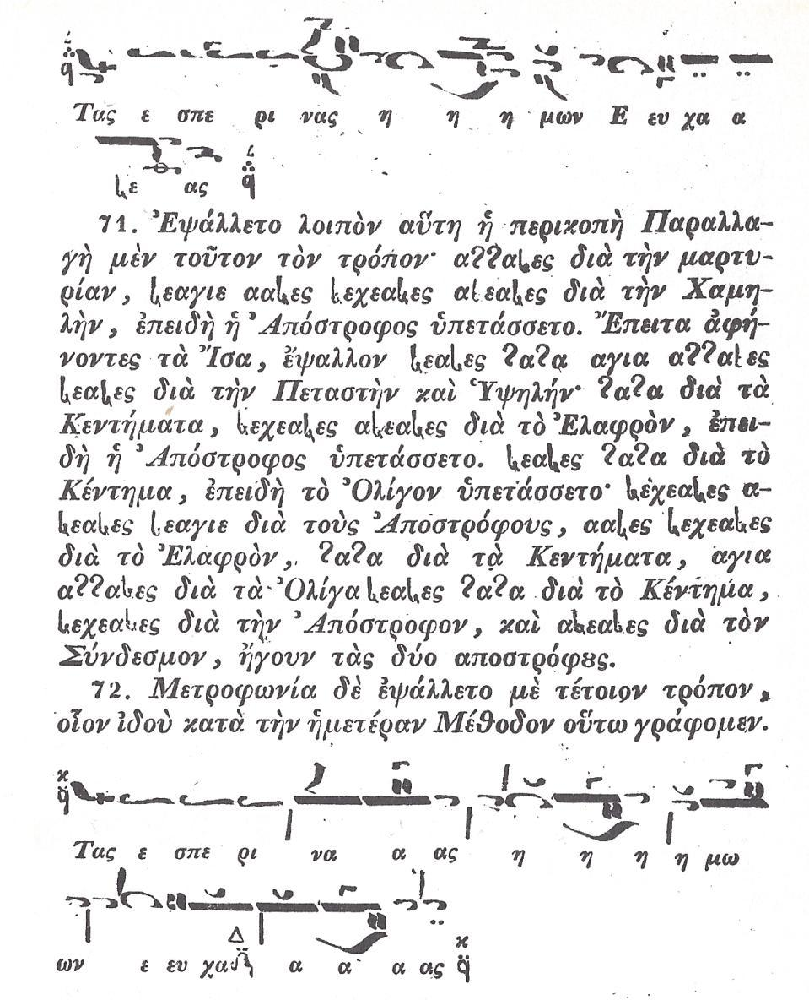

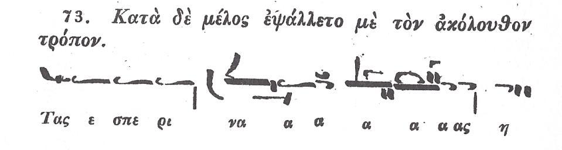
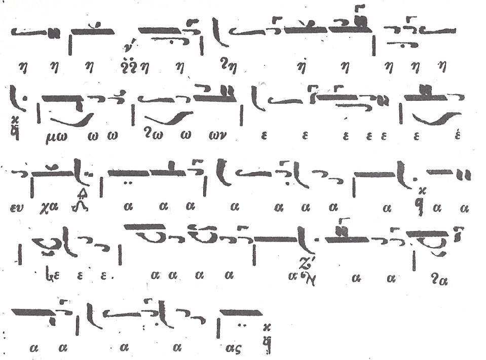

Figure 9.3. The didactics of the Old Method, according to Chrysanthos: parallage - metrophony - melos, with the
example of the first phrase of the resurrectional sticheron of the first mode “Our evening prayers”, text by Saint
John of Damascus (c. 675 - c. 753/4),i melos by Panagiotes Chrysaphes the New (“fl. c. 1650-1685”).ii
Source: Chrysanthos of Madytos (1832). Great Theoretical Treatise on Music. Ed. P. Pelopides. Trieste: Michael
Weis (repr. Koultoura), pp. xlvi-xlviii, §§ 70-73.

The triptych parallage (a kind of solfège with the polysyllabic pitch names ananes, neanes, etc.) -
metrophony (performance of the voiced signs of the old stenographic notation with a basic
rhythm) - melos (full rendering of the melodic content of the formulae, on the basis of oral tradition), in
Chrysanthos’s description, constituted the didactic model in the Old System, as it had matured
by the late post-Byzantine period.
In the first half of the 15th century, however, Gabriel Hieromonachos mentions the first two elements of the
triptych in reverse order (see Figure 9.4.):

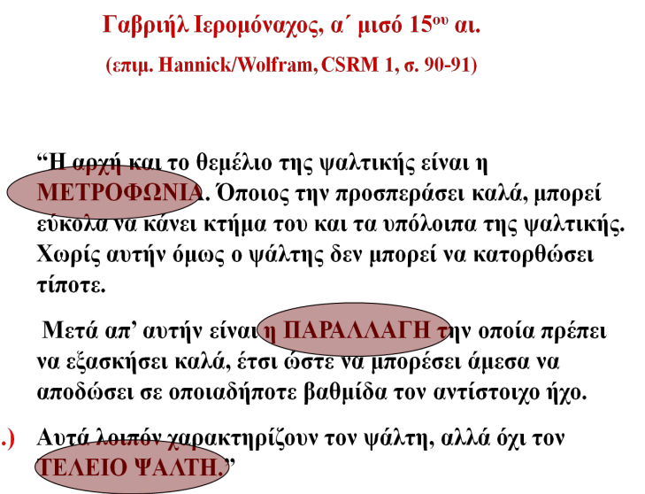

Figure 9.4. Stages in the career of a 15th-century chanter, according to Gabriel Hieromonachos.iii

Attempting to interpret the statements of Gabriel Hieromonachos through a more general
consideration of Middle Byzantine notation (practical sources, theoretical writings, and the present-day
tradition of psalmody), we observe that the first two elements mentioned by the great
late Byzantine theorist concern the level of the structure of the pieces, whereas the elements beyond these,
which characterize the perfect chanter, point to the level of performance and are related to the
musical-liturgical process itself (see Table 9.1).

Level of - Concerns intervallic articulation.
structure: the - It is written by means of:
“quantity” • the ison and the voiced signs,

• the martyria.

M - It is learned by means of:
U • metrophony,
S • parallage.
I Level - Concerns musical formation (Gestaltung) in the domains:
C of performance: • time → rhythm, tempo,
A the “quality”
L • intervallic space (pitch), → shapings-ornamentations of various levels (from
small breaks of the voice up to large and
P complex transformations of the melodic
I skeleton), modulations,
E • expression → dynamics, articulation, timbre, phrasing, ethos.
C
E - It is indicated by means of cheironomy:
• hand shape,
• graphic representation: especially the
great signs of cheironomy.

- It is decoded traditionally through EXEGESIS.

- The sonic result is called MELOS.

Table 9.1. Main components of Middle Byzantine notation and of musical performance in the Old System.iv

Another schematic representation of the triple didactic progression according to the Old Method could
also take the following form (see Figure 9.5):

Figure 9.5. Metrophony-Parallage-Melos and other key concepts in the Theory of Psalmody according to the Old Method.

In order, however, for the key concepts metrophony, parallage, cheironomy, exegesis,
and melos to become more comprehensible, it will be necessary to examine them in sequence, in the remainder of the present chapter and in the next two
chapters of the book.

## 2. In Search of the Concept of Metrophony

### 2.1. Prolegomena: the concept of diastematicity

The concept of metrophony is directly combined with that of diastematicity, that is, with the capacity
of a musical notation to record accurately the quantitative dimension of the intervals it
uses. We saw in chapter 6 that the final stages of Paleo-Byzantine notation
are characterized by a pronounced movement toward diastematicity, which is achieved through the clear
definition of the various combinations of the voiced signs: see Figure 9.6.

The case of the Thematismos
from the adiastematic Hagiopolitan notation:

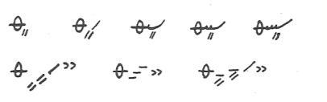

Coislin I-IV

Coislin V-VI

to the diastematic Middle Byzantine notation

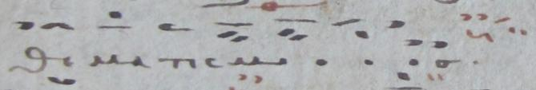

Figure 9.6. The course of Byzantine notation from adiastematicity toward diastematicity.
Sources: Floros (1970, vol. III, p. 48). EBE 2458, year 1336, fol. 3r, excerpt from the Mega Ison of Saint John
Koukouzeles.v

The critical step toward diastematicity (Strunk, 1966, p. 1) was made within a symbolic
graphic system (Doda, 1995, p. 65), in contrast to Western music, where the analogous step
was made through the exploitation of the vertical axis of writing and the introduction of lines, leading toward the
formation of the staff (Figure 9.7).

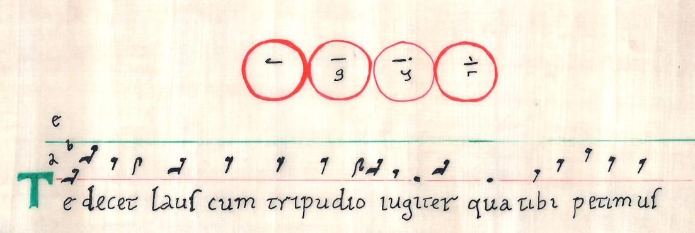

Figure 9.7. Diastematicity in East and West: symbolism (“conventional signs on a horizontal line”) and
iconicity (indication of pitch on the basis of a vertical axis).
Sources: Copies from Petropolitanus gr. 495, fol. 2v, first half of the 13th c., and Parisinus lat. 10508 of the National Library
of France, fol. 6r, 12th c., from the Benedictine Abbey of Saint-Evroult d'Ouche, with “French neumes of the second
epoch” and lines added later, of two kinds: 1. lines incised in the parchment with a
pointed object (not visible in the image), with the key letters a (la) and e (mi) at the beginning of the line, and 2.
colored lines in red (F - Fa) and green (c-do).vi

### 2.2. Metrophony in Byzantine and post-Byzantine theoretical writings

Etymologically, the word metrophony derives from the verb “to measure” and the noun “voice” (φωνή), which, in the
specific context denotes the interval of a second. In other words, metrophony is the
process of quantitatively determining the intervals of psalmody, with the second as the unit of measurement. As a
result, an interval of four voices corresponds to the interval of a fifth in the theory of
Western European music, the heptaphonia is an octave, etc.
The concept of metrophony is presented in various ways in lists of signs, in didactic poems,
and in theoretical texts.

#### 2.2.1. Metrophony in lists of signs

In lists of signs, the concept of metrophony appears abstractly (for each sign separately) and
takes the following forms:

- Numerical, with the indication of the intervallic value beside or beneath the sign (see Figure

1. , the red circles, and Figure 9.8),

- verbal, with a relevant clarification beside the sign (see Figure 9.9).

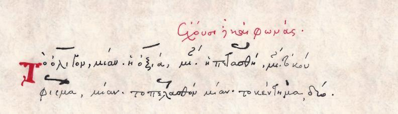

Figures 9.8-9. Numerical and verbal indications of the intervallic value of the pitch signs in the Protheoria of the
Papadike. Left: beneath the combinations with the ison: “voiceless”, and then indications for 1 or 2 voices. Right:
“the oligon, one”, etc.
Sources: Copies of excerpts from the Protheoriai of the mss.: left: Jerusalem, Patriarchate, collection of the Holy Monastery of
Sabbas the Sanctified, ms. 602, fol. 11r, 14th c. (Papadopoulos-Kerameus), right: Holy Monastery of Iviron 970, fol. 2v, year 1686,
autograph of Kosmas Makedonos (Stathis).vii

#### 2.2.2. Metrophonia (μετροφωνία) in didactic poems

In didactic poems, the concept of metrophonia is combined with two types of exercises:

A. Troparia (usually stichera) that were fashioned into exercises in metrophonia + parallage (παραλλαγή), through

the resolution of all leaps into stepwise movements (metrophonia) and the addition of modal signatures
beneath each ascending or descending voice (parallage). Some of the best-known didactic poems
of this category are Choros tetradekapyrseutos and Theologe parthene, which will
be presented in greater detail below.

B. Exercises in a single mode or in the oktoechos, with ascending and descending movements within intervallic frameworks of one,

two, three, four, seven, ten, and eleven voices. Exercises of this kind may be brief or
very long, the best known being the famous method of Gregory Bounes Alyates Ne houtos oun
anebaine, in plagal fourth mode.

##### 2.2.2.1. “A choir lit by fourteen torches” (Χορός τετραδεκαπύρσευτος): an example of metrophony (μετροφωνία), parallage (παραλλαγή), and melos (μέλος) in a diatonic mode

Taking as his point of departure the idiomelon of the Old Sticherarion “A choir lit by fourteen torches” in the first mode, in honour of the Holy
Forty Martyrs of Sebaste (see Figures 9.10-11), an anonymous Byzantine teacher
created an exercise that combines metrophony with parallage (see Figure 9.12).

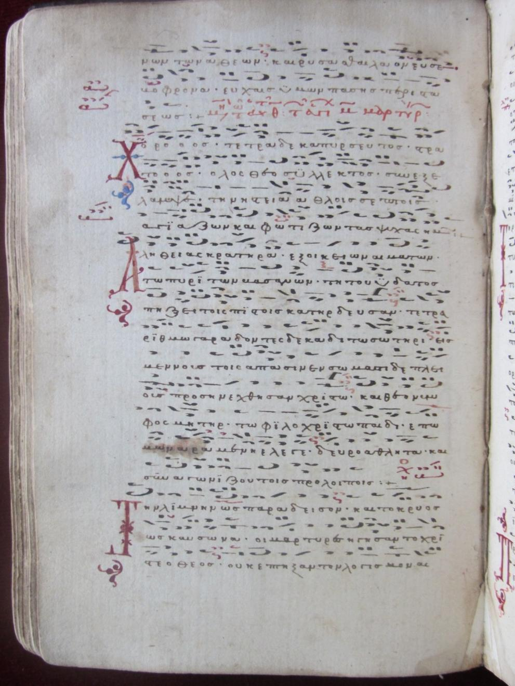
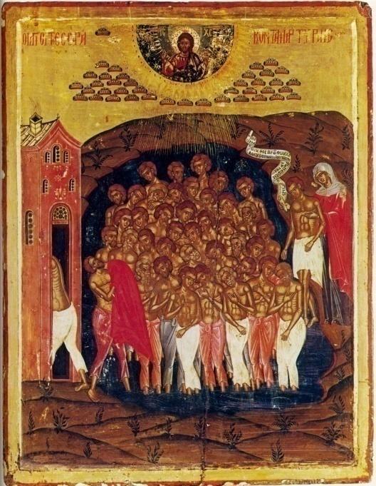

Figures 9.10-11. “A choir lit by fourteen torches” and other stichera in honour of the Holy Forty Martyrs of
Sebaste (early fourth century AD. Commemorated on 9 March), from the Sticherarion of NLG 884, fol. 155v, year 1340/41, in
Middle Byzantine, fully developed notation. © National Library of Greece.

 Seventeenth-century portable icon with the martyrdom of the Holy Forty Martyrs.

Source for the image: <https://upload.wikimedia.org/wikipedia/el/2/22/40_Μάρτυρες.jpg> (11.4.2016).

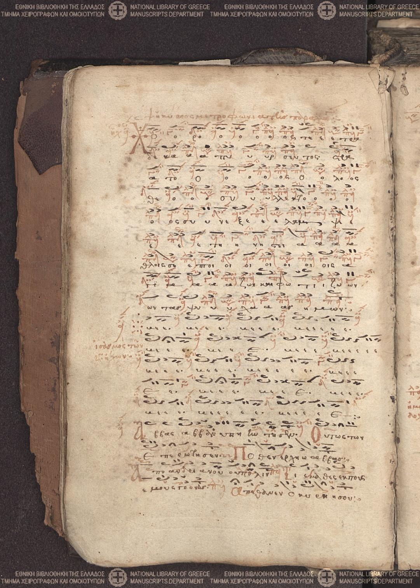

Figure 9.12. “The principal metrophony of the parallag(e):- mode 1: A choir lit by fourteen torches” and other
methods from the Protheoria of the Papadike in MS NLG 2401, fol. 20v, prob. 1452-1469 (Politis & Politi, 1991, p. 314-

336). © National Library of Greece.

A comparison between the sticheron and the exercise in metrophony and parallage could
take the following form (see Figure 9.13):

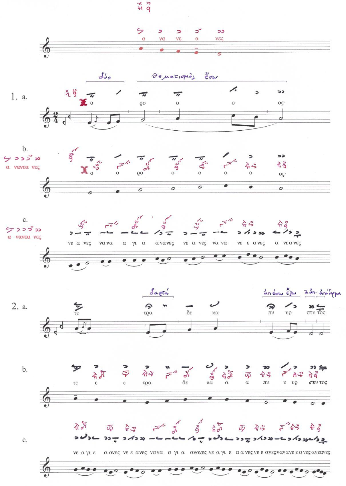

Hear them by clicking

Figure 9.13. The first verse (cola 1-2) of the old sticheron “A choir lit by fourteen torches,” in mode 1:

a. Neumes from Iviron 952, fol. 112 (?), with a transcription rendering a rhythmic interpretation of Middle Byzantine

notation, according to the research of Ioannis Arvanitis (2003, 2010). b. Exercise in metrophony and
parallage from MS NLG 2401, fol. 20v, with transnotation. c. Restoration of the parallage, according to
the parallage exercise from codex NLG 2406, fol. 15v, and transnotation.viii

In the first half of the nineteenth century, Chourmouzios made an exegesis of the old sticheron “A choir
lit by fourteen torches” in the New Method (see Figure 9.14), and thus today we are able to
listen to the slow melos of this sticheron: Listen to the beginning by clicking 

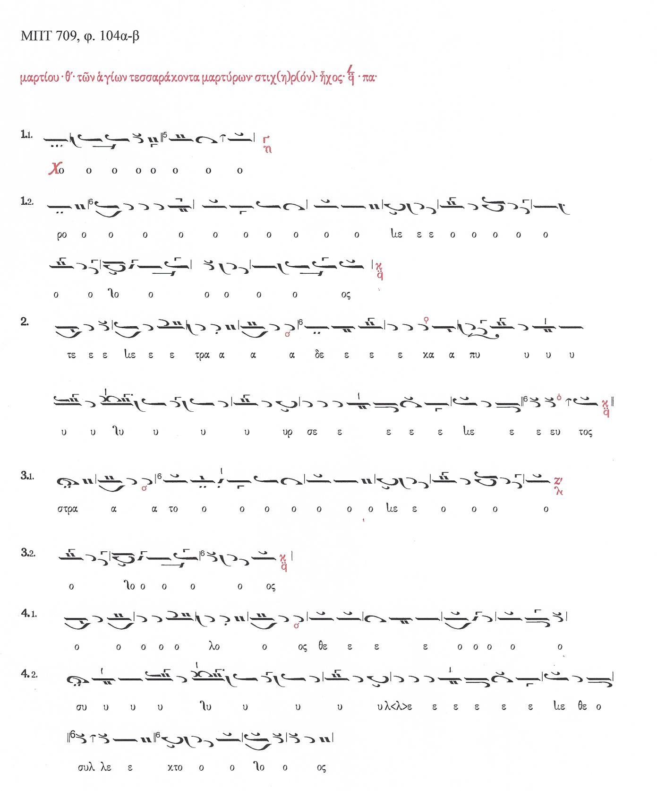

Figure 9.14.a. The exegesis by Chourmouzios Chartophylax of the old sticheron “A choir lit by fourteen torches,” in
mode 1, based on his autograph MPT 709, fol. 104r-v. The piece was divided into musico-poetic phrases (cola), and
barlines were added to indicate the measures.ix

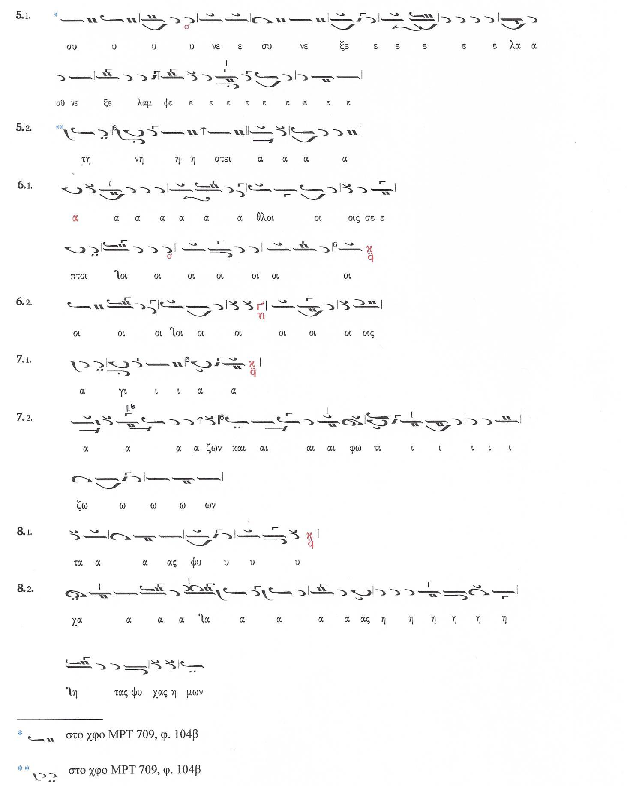

Figure 9.14.b. Continuation and conclusion of Chourmouzios’s exegesis of the sticheron “A choir lit by fourteen torches,”
based on the autograph MPT 709, fol. 104v.

Proceeding to a comparison of all the aforementioned sources, we observe the direct
connection between the original text, the metrophony, the parallage, and the slow exegesis (see
Figure 9.15):

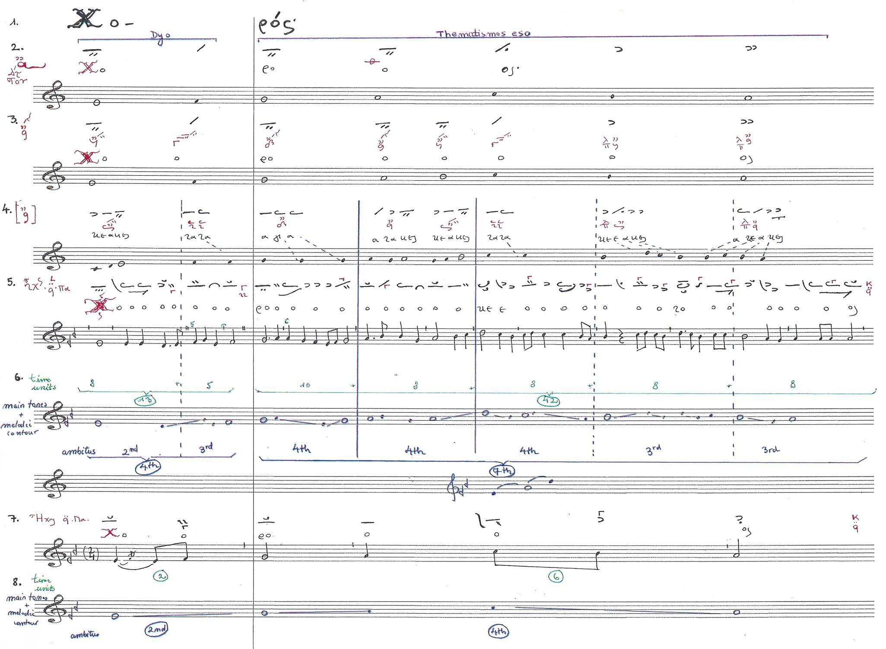

Figure 9.15. The first word of the old sticheron “A choir lit by fourteen torches,” in a comparison of sources:

1. Hymnographic text. 2. Neumes from MS Iviron 952, fol. 112; and transnotation. 3. Exercise in

metrophony and parallage from codex NLG 2401, fol. 20v. 4. Restoration of the parallage based on MS
NLG 2406, fol. 15v, and transnotation. 5. Slow exegesis by Chourmouzios, from: MPT 709, fol. 104r, with
schematic transcription. 6. Reductive analysis of the exegesis (primary time-units, structural pitches and melodic
contour, range). 7. Syllabic interpretation in the New Method and transcription onto the staff, according to
the research of Ioannis Arvanitis (2003, 2010). 8. Reductive analysis of the preceding interpretation.x

##### 2.2.2.2. “O Virgin Theologian” (Θεολόγε παρθένε): the apparent conflict between “from parallage” (ἀπὸ παραλλαγῆς) and “from melos” (ἀπὸ μέλους)

A special case is the method “O Virgin Theologian,” in mode 2, which is based on the old sticheron of the same name
for the feast of the Translation of Saint John the Evangelist (26 September),xi
a poem by Theophanes (NLG 884) or by the Studite (A 139 sup.): see Figures 9.16-17.

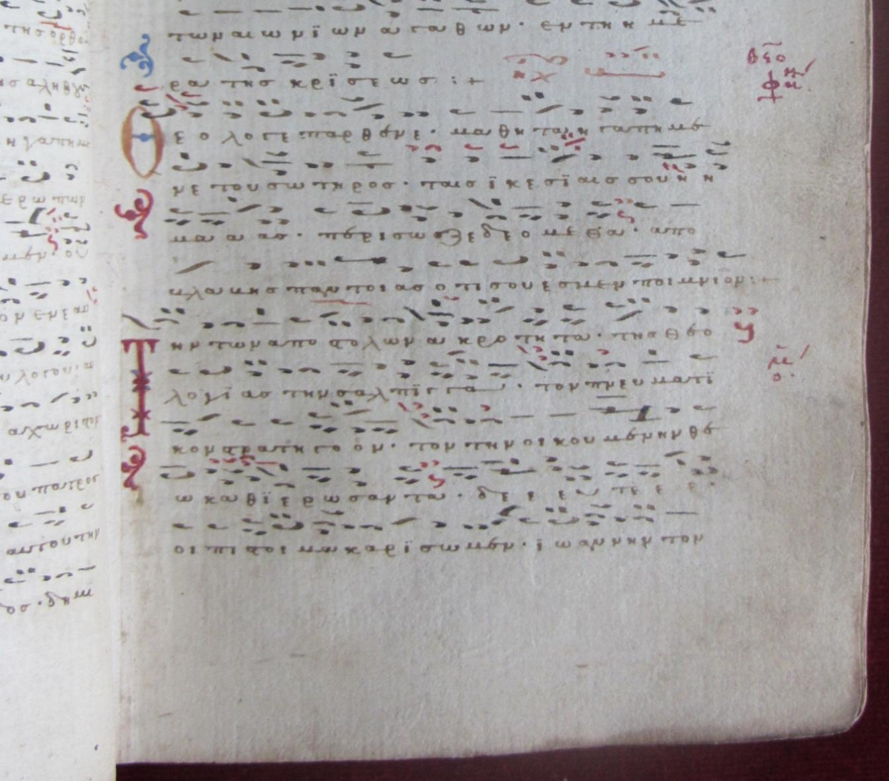

Figure 9.16. The sticheron “O Virgin Theologian,” in mode 2, from the Old Sticherarion corrected by Saint
John Koukouzeles, MS NLG 884, fol. 37r, year 1340/1. © National Library of Greece.xii
Listen to the metrophonic and rhythmic structurexiii of the sticheron (chromatic version), by clicking .
Clarification: The recording was based on Ambrosianum A 139 sup., fol. 23v (from the facsimile edition of Perria
& Raasted, 1992, MMB Facsimiles XI), which has the same emphōna signs (only at the word blabēs is there a petaste instead
of the oxeia that we see in Figure 9.16) and, in addition, two medial martyriai (at the end of cola 1 and 3, as
heard in the recording).

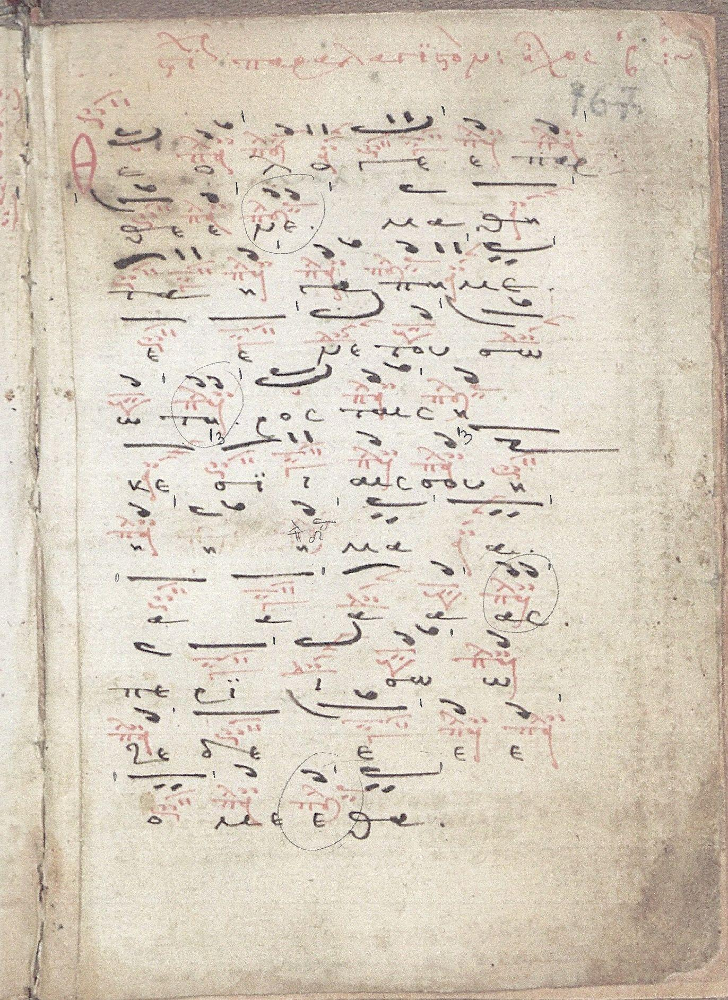

Listen to the metrophony and the parallage (diatonically), by clicking  & .
Figure 9.17.a. “Stich(er)on for paral\<l\>age: mode 2: O Virgin Theologian,” in MS NLG 928, fol. 167r, late fifteenth
century (Conomos). © National Library of Greece.xiv

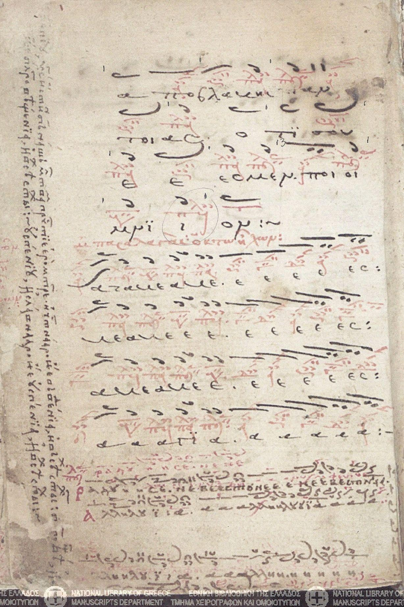

Figure 9.17.b. Continuation of the same sticheron for parallage, MS NLG 928, fol. 167v, late fifteenth century (Conomos).

© National Library of Greece.

Chourmouzios’s slow exegesis of the sticheron “O Virgin Theologian,” in the old style, is presented
in Figure 9.18.

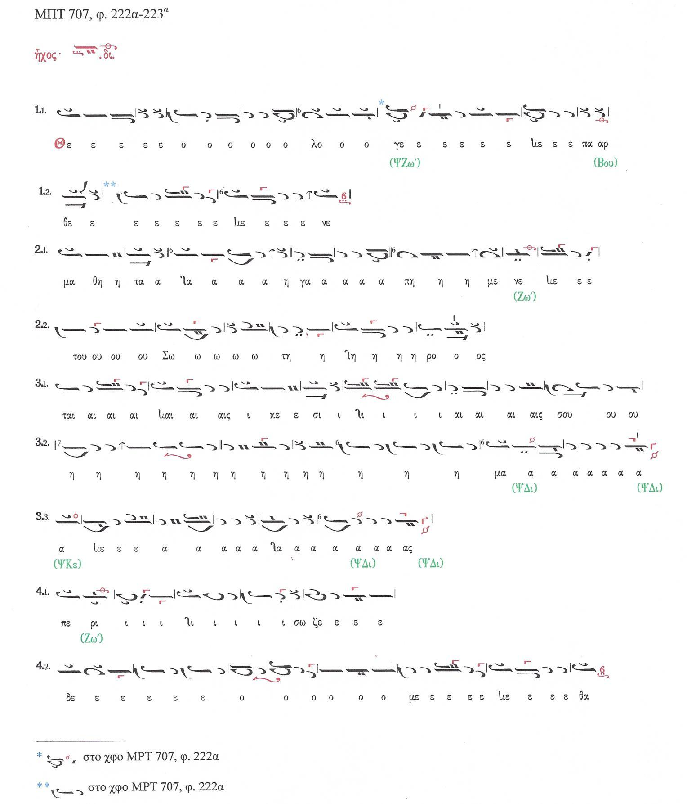

Listen to the parallage and the melos of the exegesis by clicking  & .
Figure 9.18.a. The exegesis by Chourmouzios Chartophylax of the old sticheron “O Virgin Theologian,” in mode 2, based on
his autograph MPT 707, fol. 222r-v. The piece was divided into musico-poetic phrases (cola), and
barlines were added to indicate the measures.xv

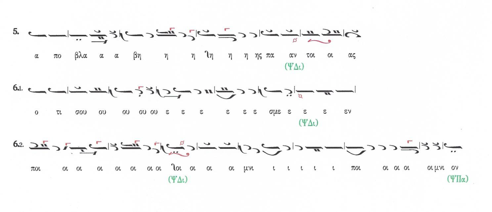

Figure 9.18.b. Continuation and conclusion of Chourmouzios’s exegesis of the sticheron “O Virgin Theologian,” based on
his autograph MPT 707, fol. 222v-223r.

Comparing the three sources above (Figures 9.16-18) with one another, one observes that the
original old sticheron and the exegesis are in the chromatic genus. For the New Method this is apparent
straightforwardly from the martyriai and phthorai. For the Old System, the element of chromaticism (that is,
the presence of an augmented second within the mode) is inferred from the use of the martyriai. A comparison
of the piece in the Old Sticheraria NLG 884 (fol. 37r), A 139 sup. (fol. 23v, year 1341), and Copenhagen NkS
4960 (fol. 22r-v, fourteenth century) shows that all the medial martyriai belong to the family of mode 2.
The use of the martyria for the mesotēs of mode 2 in the old notation implies a structure of
similar diphonies.xvi It follows that the pitch G will be sharpened: the first diphony of the mode, E F G#, will
show a similarity (though not identity) with the second diphony, G# a h.
Nevertheless, the sticheron for parallage in codex NLG 928, fol. 167r-v, uses beneath the
pitch signs of the metrophony the martyriai according to the system of tetraphony, that is, of the trochos. For the pitch
G it sets the martyria . It follows that here the pitch G will be natural.

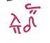

As mentioned in chapter 8, section 3.5, this contradiction leads us to a very interesting
phenomenon of the old notation, which various theorists such as Chrysaphes the Elder (verses 438-452)
and the Anonymous theorist of MS NLG 968 (fol. 167r) interpret through the antithetical conceptual
pair “from parallage” - “from melos.”xvii During the Byzantine and early post-Byzantine period,
a form of parallage predominates that is based entirely on the system of tetraphony, as
documented by the diagrams of the Composite Trochos, the Tree of Parallage, and the Kanonion
of the Eight Modes. The intervals are diatonic (augmented seconds are absent). Nevertheless, in pieces
belonging to the family of mode 2, the melos requires different, chromatic sonorities, and the martyriai of mode 2
in practical sources usually follow one another not by tetraphony, but by diphony: see Figures 8.47
and 9.19-20.

from parallage: pl. 4th

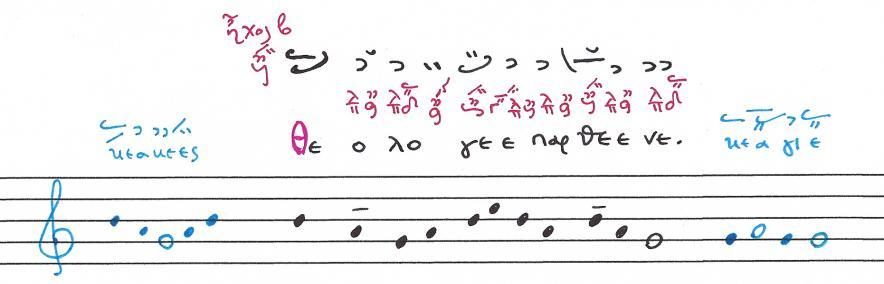

from melos

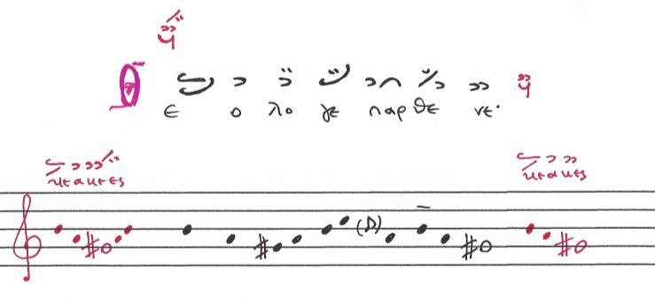

Figure 9.19. The first phrase of the sticheron “O Virgin Theologian,” mode 2, from MS A 139 sup., fol.23v, and the corresponding
phrase of the homonymous “sticheron for parallage” from MS NLG 928, fol. 167r, with transnotations.

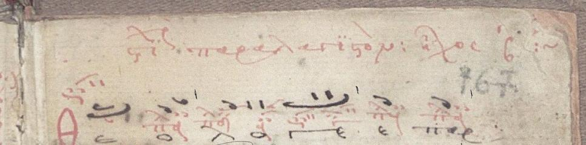
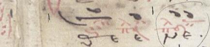
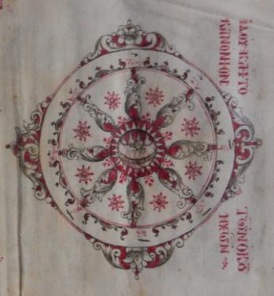

Metrophony as the rendering of a
troparion, only with stepwise movements,
without leaps, and its union with
DIATONIC PARALLAGE, as we
know it from the simple trochos.

Figure 9.20. The first phrase of the sticheron “O Virgin Theologian” as an exercise in metrophony & parallage, from MS NLG
928, fol. 167r, and the “Kanonion of the Eight Modes” from MS Holy Monastery of Dochiariou 338 (year 1767), fol. 5r. Within the blue
circle appears the martyria of the plagal fourth mode, which also appears in the exercise in metrophony & parallage. © for the
manuscript excerpts: National Library of Greece. Holy Monastery of Dochiariou.

Whereas parallage during the Byzantine and early post-Byzantine period is based on the diatonic
trochos, and other successions of martyriai are interpreted as “from melos” or as “double parallage,”xviii during the
late Middle Byzantine period the special intervals of the modes that are based
on systems other than the diatonic trochos are also theorized. Thus, for the sticheron “O Virgin Theologian” there is now
a corresponding kanonion with the specific mode (2): see Figure 9.21.

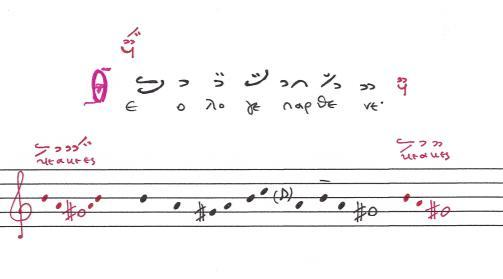
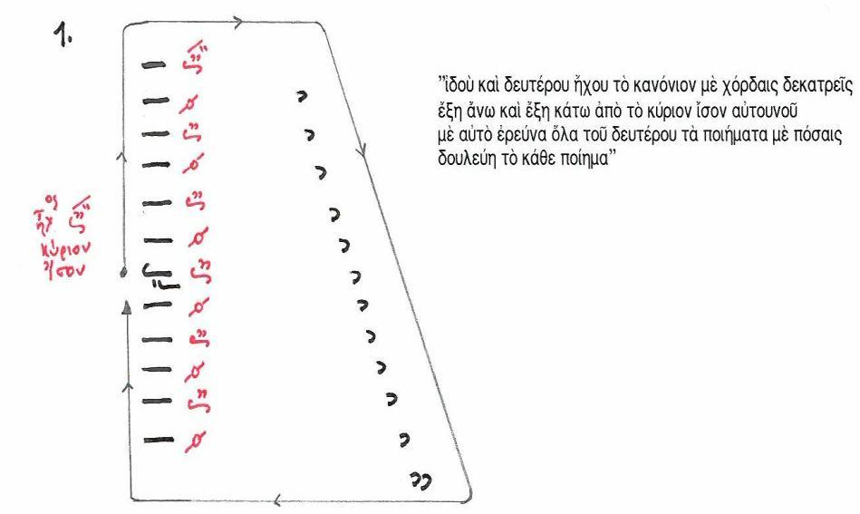

Figure 9.21. The beginning of the sticheron “O Virgin Theologian” from Sticherarium Ambrosianum A 139 sup., fol. 23v, with
transnotation, and a kanonion of mode 2, copied from the Anonymous theorist of MS NLG 968, fol. 180v.
Sources: Perria & Raasted (eds., 1992, MMB Facsimiles XI). Giannopoulos (2013, p. 116) and Alexandru (2000, vol. III, p.

17).

Comparing the old sticheron with its slow exegesis in the New Method, one observes a
complete agreement between the old notation, which records with its emphōna signs the
structural pitches of the melos, and the new notation, where the actual sonic result unfolds
analytically through the characters of Neo-Byzantine notation. From each structural pitch of the
original there springs a small melodic development. We might say that it is like matryoshkas, where
each large doll carries within it a series of likenesses in smaller form: see
Figure 9.22.

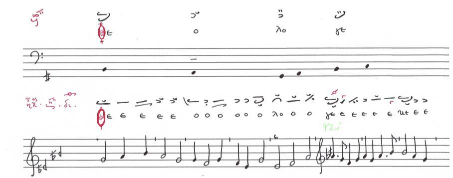
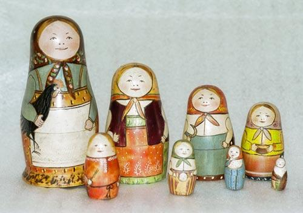

Figure 9.22. The beginning of the sticheron “O Virgin Theologian” from Sticherarium Ambrosianum A 139 sup., fol. 23v, with
transnotation, and the slow exegesis by Chourmouzios, from MS NLG 707, fol. 222r, with schematic transcription on the
staff. Below: Matryoshka, work by the Russian artists Zvezdochkin and Malyutin, year 1892, Sergiev Posad Toy
Museum, from:
<https://upload.wikimedia.org/wikipedia/commons/3/3d/First_matryoshka_museum_doll_open.jpg> (8.5.2016).

The frequent alternation of the phthorai of mode 2 and of nenano in the exegesis, although in Middle Byzantine
notation they are entirely absent, is due to the fact that mode 2 in the old sticheraric melos
goes for the complete cadences to its low base, which coincides with the base of the plagal second mode.
In the Old System, the two modes have a common scale (from the pitch E - Vou). In the New Method, the
scales were differentiated, and mode 2 has Di as its high, melodic base and Ni as the low base of the scale,
whereas the plagal second is theoretically constructed from Pa. When the melos in the exegesis proceeds by
diphony, we are in mode 2, and when melodic developments by triphony predominate, we turn toward
the plagal, with pseudo-parallage (Ga = Pseudo-Di and Ni = Pseudo-Pa, where the piece ends).

##### 2.2.2.3. Isasmos (ἰσασμός) of the Eight Modes

Another aspect of metrophony is realized through the so-called isasmos of the eight modes. This is a
method in which the modes are presented in pairs (the authentic mode and its plagal), chiefly through stepwise
descending-ascending movements, within increasing intervallic frameworks (from one up to four phonai): see
Figures 9.12 (in the middle) and 9.23.

|1. mode|1st G a|a G a|a GF Ga a GF E FG a|
|---|---|---|---|
|2.|a E a|a D|a ¦ mode 2nd-pl.2nd h a h h aG FE FG h*|
|3.|h a h|h aG ah|h aG FGa h¦mode 3rd-barys chaGF|
|4.|Ga c|c G c|c F c ¦mode 4th-pl./4th d c d|
|5.|d ch cd|d ch|d d ch aG ah d|

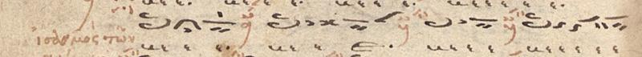
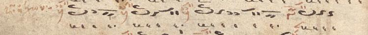

1. h: according to the MS, the transnotation ought to be : a. We have corrected it, however, to an ascent of two phonai, by analogy with the corresponding position
at the beginning of row 4., since in the isasmoi the final pitch of each formula coincides with the first .

Figure 9.23. The “Isasmos of the Eight Modes” from the Protheoria of the Papadike in MS NLG 2401, fol. 20v, prob. 1452-1469
(Politis & Politi, 1991), with the addition of alphabetic transnotation.xix © For the MS excerpts: National
Library of Greece.

##### 2.2.2.4. Gregory Bounes Alyates’ “Method of metrophony”: a brief note

The largest and most complicated exercise in metrophony is due to Gregory Bounes Alyates, the last
protopsaltes of Hagia Sophia in Constantinople before the Fall. It has a rich manuscript
tradition, and a host of epithets in the rubrics of the codices emphasize its importance: “very
useful,” “most useful,” “very beautiful.”xx Its incipit is “Ne, thus then ascend, thus
then descend,” and the method was written in the plagal fourth mode, at the same time documenting the
fundamental place of this mode in the teaching of the Psaltic Art.
Based on lists of signs, the eight-mode Great Ison of Saint John Koukouzeles, and
earlier exercises in metrophony, Alyates’ method presents an almost endless palette
of possibilities for measuring intervallic frameworks of one, two, three, four, five, seven, ten, and
eleven phonai. The verbal text beneath the sign-phonai is music-theoretical in character,
clarifying each time the intervallic framework that is traversed. An excerpt is given in
Figure 9.24.

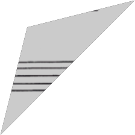

Figure 9.24.a. Excerpt from the “Method of metrophony” of Gregory Bounes Alyates:
examples of theseis for two phonai (nos. 26-28). Signs and text from the Protheoria of MS
Patriarchate of Jerusalem, Anastasis Collection, no. 45, fol. 13v-14r, eighteenth century. Added are: identification of theseis,
summing of the ascending and descending phonai of each thesis, open transnotation, a diagram
of melodic contour, and syllabic interpretation, according to the research of I. Arvanitis (2003 and 2010).xxi

Figure 9.24.b. Excerpt from the “Method of metrophony” of Gregory Bounes Alyates:
examples of theseis for two phonai (nos. 29-31).

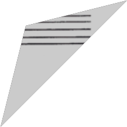

Figure 9.24.c. Excerpt from the “Method of metrophony” of Gregory Bounes Alyates:
examples of theseis for two phonai (nos. 32-34).

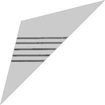

Figure 9.24.d. Excerpt from the “Method of metrophony” of Gregory Bounes Alyates:
examples of theseis for two phonai (nos. 35, 45-46. In between there intervene theseis in other intervallic
frameworks).

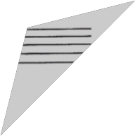

Figure 9.24.e. Excerpt from the Method of metrophony of Gregory Bounes Alyates: examples
of theseis for two phonai (nos.47-48).

This Method of metrophony by Alyates constitutes a legacy of Byzantine musical
theory and pedagogy and shows how music-theoretical reflection systematizes and regulates
elements of musical practice and composition. For more information concerning this method, the
reader is referred to a previous, more extensive account.xxii The calculations of the phonai
shown on the right, beside the lines in Middle Byzantine notation in Figures 9.24a-e, will
be discussed in the next section.

#### 2.2.3. Metrophony in music-theoretical handbooks

We have already seen above (section 1 of the present chapter) the importance that Gabriel
Hieromonachos assigns to metrophony and parallage for learning the Psaltic Art.
At the beginning of the sixteenth century, Akakios Chalkeopoulos (“fl. ca. 1490-1530”)xxiii speaks in
his Akribologēmata, among other things, also about the measuring of the phonai, which he presents as an arithmetical
check for the correctness or otherwise of the notation of musical pieces. More specifically, the Cretan
music theorist gives the example of the first verse from the Fourth Eothinon in mode 4, clarifying that
“it has ascending phonai, 19; likewise also descending.” The metrophonic calculation could be
clarified as follows (see Figure 9.25):

|1. 2. Ascending phonai: + 4 + 4 + 1 + 2 + 2 + 2 + 1 + 3 3. = 19|
|---|
|Descending phonai: -4 - 4 - 1 -1-1-1 - 1-1-1 = 19 - 2 - 2|

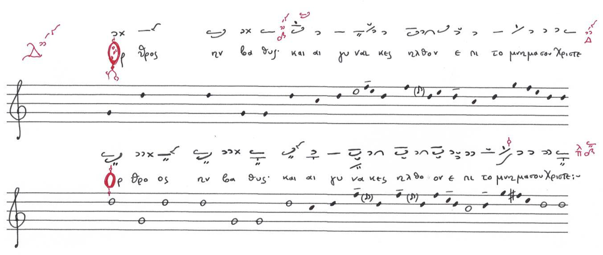

Figure 9.25. The beginning of the Fourth Eothinon in mode 4, copied from the codices: 1. A 139 sup., fol. 299r, year 1341 and 2. NLG
917, fol. 3r, year 1500-1520, autograph of Akakios Chalkeopoulos (Chatzigiakoumis, 1980, p. 113). In no. 3 we give an
analytical account of the individual number of ascending and descending phonai, which are finally summed, leading
to the total of 19 ascending and likewise 19 descending phonai.

An original diagram for the teaching of metrophony is used by the Anonymous author of
MS NLG 968 (see Figure 9.26):

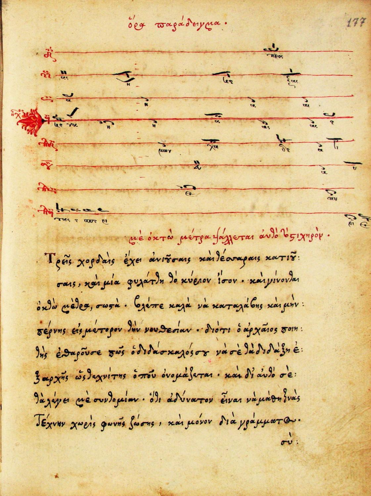

Figure 9.26. Kanonion of metrophony in the Anonymous author of MS NLG 968, fol. 177r, seventeenth century (Giannopoulos, 2013, p. 98, 111-

1. © National Library of Greece.

As is evident in the above kanonion and the explanatory words that follow it,xxv the

anonymous teacher, who probably used the psaltery (kanonaki) as an auxiliary teaching
instrument, places the musico-poetic text “Our evening prayers” (first verse of the first
Resurrectional sticheron of Saint John of Damascus in the setting by Chrysaphes the Younger, mode 1)
in eight measures in the form of strings: three above and four below the central ison. The diagram
visualizes the metrophonic structure of the piece through the use of a vertical axis: see Figure 9.27.

Pa΄

Nē΄

Zo΄

Ke

Di

Ga

Vou

Pa

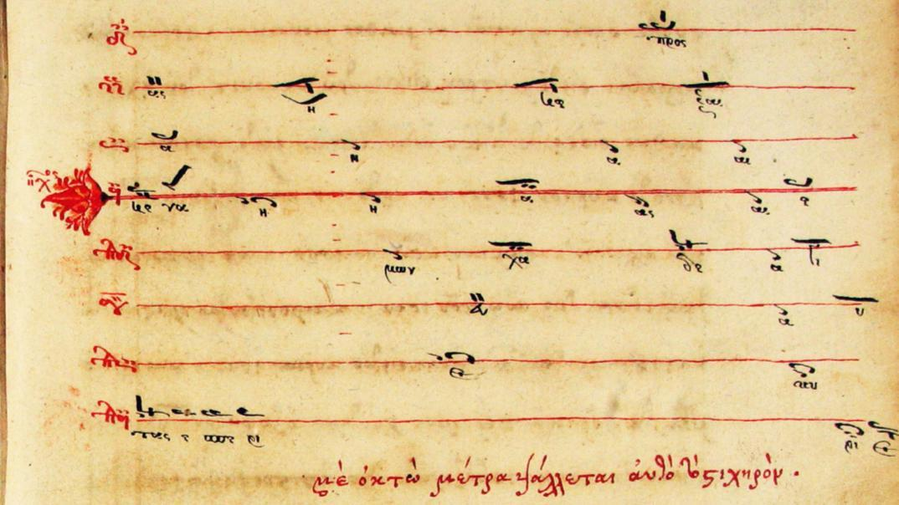

Listen to the beginning of the diagram by pressing 
Figure 9.27. The kanonion (κανόνιο) of metrophonia (μετροφωνία) in the Anonymous author of MS EBE 968, fol. 177r, with the addition of the corresponding
notes in the New Method for the eight strings of the diagram (left) and with the beginning of the resurrectional sticheron in
a setting by Chrysaphes the New, in late Middle Byzantine notation, together with a transfer of the metrophonic structure onto
the five-line staff.xxvi © for the MS excerpt: National Library of Greece.

After the Anonymous author of MS EBE 968 comes Chrysanthos of Madytos. As we saw
in section 1 of the present chapter, the great theorist of the New Method uses the
same musical example, “Our evening prayers,” in a setting by Chrysaphes the New, in order to
explain the mode of instruction according to the Old System, placing at the beginning of the triptych the
parallage (παραλλαγή), and subsequently the metrophonia and the melos (μέλος). In Figure 9.28 the two
aforementioned theorists are set in comparison; they appear to record the late post-Byzantine pedagogical
practice concerning metrophonia:

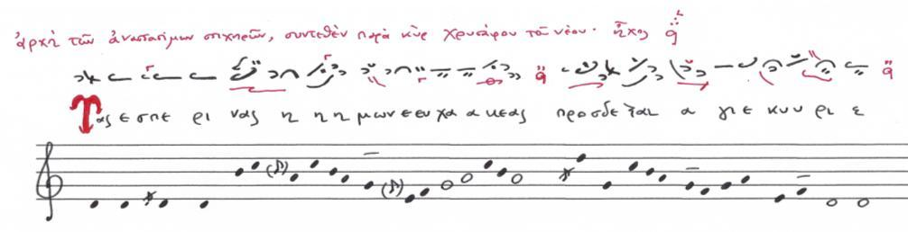

-  The original sticheron (as Chrysanthos cites it, 70)

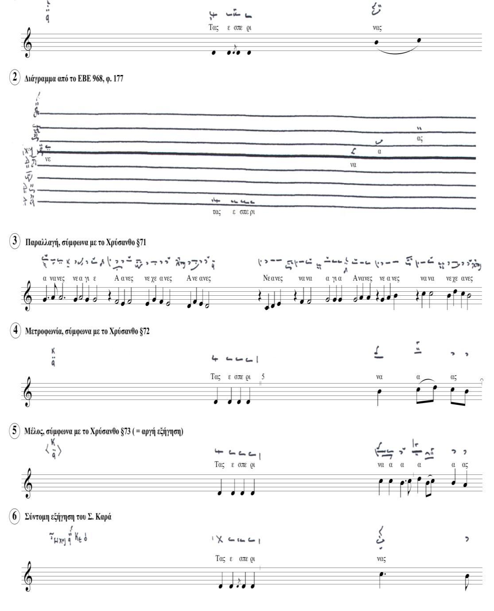

- Parallage, according to Chrysanthos

- 71

- Metrophonia, according to Chrysanthos 72

- Melos, according to Chrysanthos 73 (slow exegesis)

Figures 9.28.a.-c. Parallage, metrophonia, and melos: The example of the sticheron “Our evening prayers” in the Anonymous author of MS EBE 968 and in Chrysanthos:
comparison of sources.xxvii Listen to excerpts 1, 3, 4, 5, 6, by pressing     

a

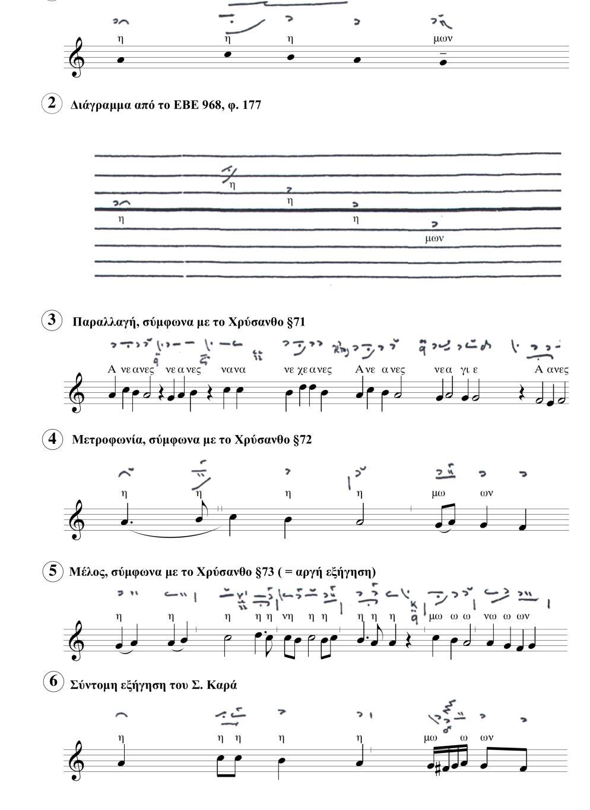
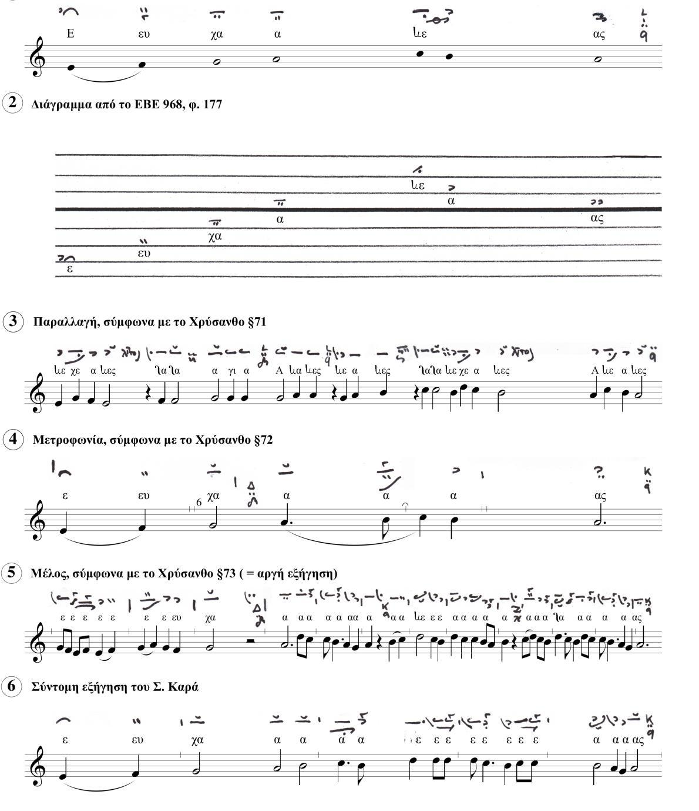

## 3. Metrophonia - Parallage - Melos: the example of the intonation formula (ἀπήχημα) of the first mode 503

A good example for understanding the relationship metrophonia - parallage - melos is the intonation formula of the first mode: see Figure 9.29.

One

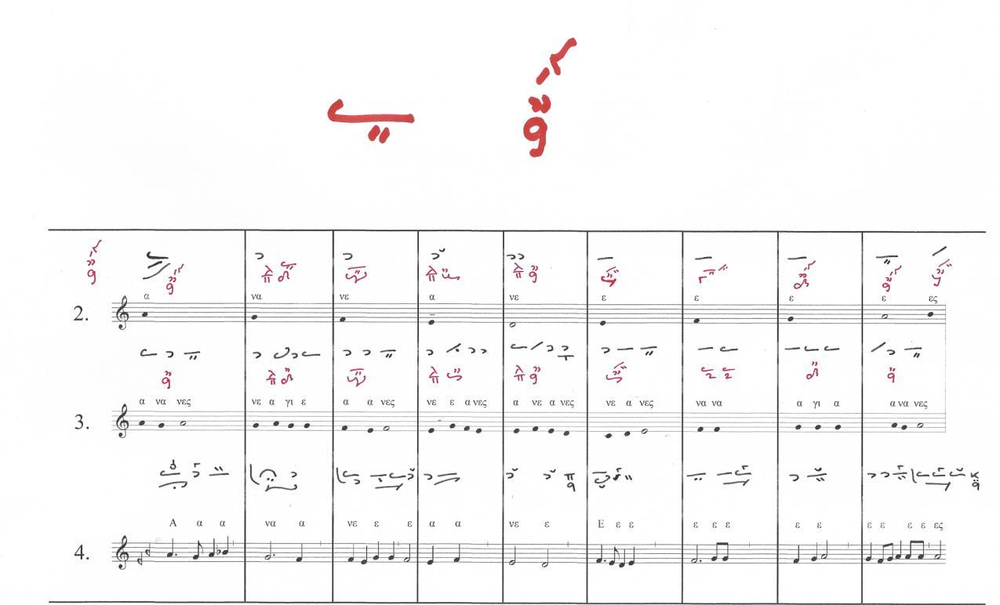

1.

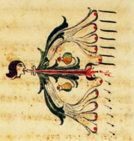

Listen to lines 2&3 and 4 

Figure 9.29. 1. The diagram of the “perfect voice” (τελεία φωνή), EBE 968, fol. 176r, 17th c. (Giannopoulos, 2013, pp. 98, 110) ¦ Ison (ἴσον) and martyria (μαρτυρία) of the first mode in the Old System ¦
Cross-section of a matryoshka. 2. “Another useful parallage” (Tardo, 1938, p. 158) with transcription. 3. Codex Chrysander, pp. 17-18 (ed. Fleischer, 1904). 4. Chrysanthos
(1938, § 309): “The melody of this (sc. the intonation formula of the First mode), as it has been preserved from tradition, is written thus according to our
system.”xxviii © for the MS excerpt: National Library of Greece.

If we suppose that from the unfolding of the initial ison of the first mode its intonation formula is born, we can follow step by step,
through its metrophonia and parallage, how we arrive at its melos, by means of the art of slow exegesis. A schematic representation of the relationship
between the initial ison, the metrophonia, the parallage, and the melos of the intonation formula of the first mode is shown in Figure 9.30.

1.

2.

3.

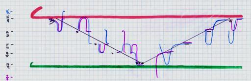

Figure 9.30. “Give me a piece, and I will show you how it is born from an ison” (Chr. Samaras).xxix Schematic depiction of the musical example in Figure 9.29:

1. The initial, generative ison-drone. 2. The metrophonia of the old intonation formula of the first mode, with stepwise movements only. The green ison below indicates the base of the plagal

first mode. 3. In purple, the movement of the parallage, and in light blue, the movement of the melos.xxx

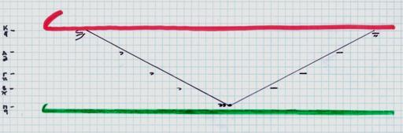

## 4. The old intonation formulas of the eight modes and their slow exegesis, according to Chrysanthos

In his Great Theoretical Treatise, in the chapter “On intonation formulas,” Chrysanthos provides the slow exegeses for the old intonation formulas of the eight modes, as
they were preserved by tradition down to his time: see Tables 9.2.a-c.

|Mode I II III IV|Old Method|Exegesis in the New Method by Petros Peloponnesios:|
|---|---|---|

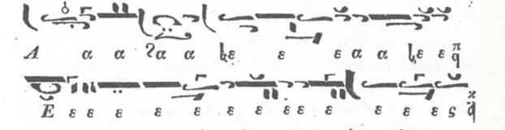
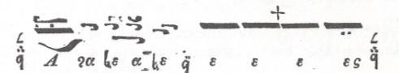
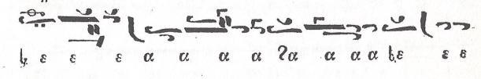
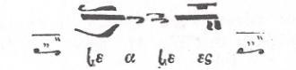
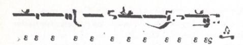
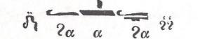
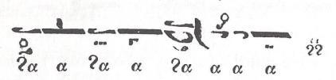
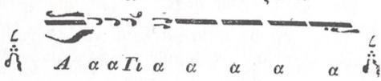
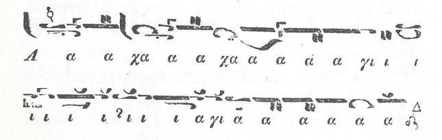
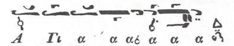

Table 9.2.a. The intonation formulas of the authentic modes in stenographic and analytical notation, according to Chrysanthos, Great Theoretical Treatise (1832, §§ 309-312).

|Mode pl. I pl. II Varys pl. IV|Old Method|Exegesis in the New Method|
|---|---|---|

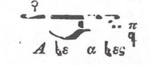
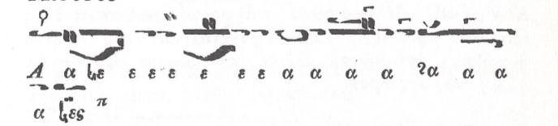
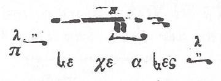
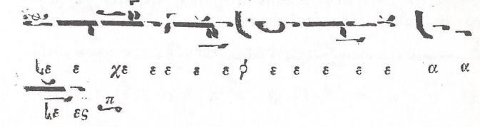
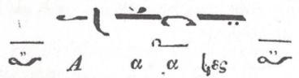
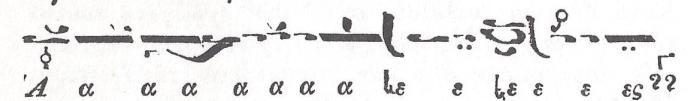
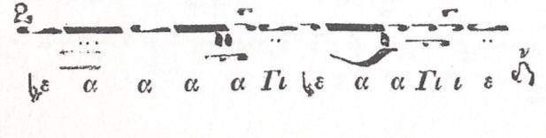
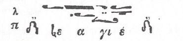

Table 9.2.b. The intonation formulas of the plagal modes in stenographic and analytical notation, according to Chrysanthos, Great Theoretical Treatise (1832, §§ 313-316).

Mode Old Method

Exegesis in the New Method

lege- tos

pl. 2nd
nena-
no

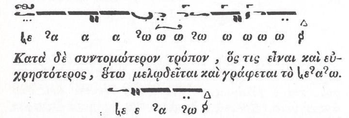

Table 9.2.γ. The apechemata of legetos and nenano in stenographic and analytical writing, according to Chrysanthos, Great Theoretikon (1832, § 318). For the
orthography of the neumes of the apechema of nenano in Middle Byzantine writing, cf. ch.8, Table 8.4. of the present handbook.

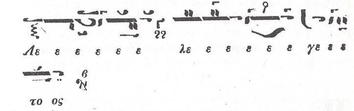
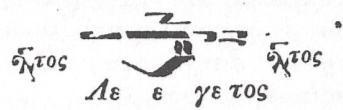
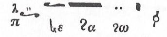

## 5. Conclusions on the concept of metrophonia (μετροφωνία)

In conclusion, we can say that metrophonia in the Old System constituted a highly complex
concept, with various semantic layers:

 In lists of neumes it appears as an indication of the number of voices (intervals of a second) contained in

each vocal sign (ἔμφωνο σημάδι) separately, and in combinations of vocal signs with one another,

 in didactic poems it is presented exclusively with stepwise movements and in combination with

parallage (παραλλαγή), or with a great variety of theseis (formulaic positions) within intervallic frameworks of one up to as many as eleven voices,
having both stepwise movements and leaps, and bearing underlaid text that is either hymnographic or
music-theoretical,

 in theoretical manuals, metrophonia is referred to:
 as the foundation of the Psaltic Art (Gabriel Hieromonachos),
 as a way of tallying the voices of a phrase or a piece for orthographic checking (Akakios
Chalkeopoulos),
 as a method for understanding the structural pitches (phthongoi) — the basic intervallic structure of a piece,
with the aid of a special kanonion (κανόνιο), representing the pitches of the mode as strings, and placing
the sign-voices (σημαδόφωνα) on them along a vertical axis (Anonymous author of MS EBE 968, post-Byzantine period),
 as the simple rendering of the vocal signs of a piece in Middle Byzantine notation, with
a basic rhythm and with the poetic text of the particular troparion or hymn, as
preparation for a slow exegesis (Chrysanthos).

## Assessment criteria for Chapter 9

### Assessment criterion 1

Create indexing cards

for the central concepts of the present

 

chapter.

### Assessment criterion 2

Study the method “The Fourteen-Beacon Choir” (Choros tetradekapyrseutos).

### Assessment Criterion 3

Study the method “Theologe Parthene” and learn it as metrophonia, parallage, and melos, from Figures 9.16-22 and the associated files.

### Assessment Criterion 4

Watch the presentation by the Byzantine Music Palaeography Group,
entitled: Contemporary Questions and Answers on Key Concepts of
Psaltic Art in the Old System: metrophonia (μετροφωνία), parallage (παραλλαγή), and melos (μέλος). 

### Assessment Criterion 5

Study the example “It Was Deep Dawn,” from Figure 9.25.

### Assessment Criterion 6

Study the music-theoretical example “Our Evening Prayers” by
Anonymous from MS EBE 968 and the corresponding one by Chrysanthos, from Figures

9.3. and 9.26-28.

### Assessment criterion 7

Learn by heart the intonation formula (απήχημα) of the first mode, together with its metrophony (μετροφωνία), parallage (παραλλαγή), and exegesis (εξήγηση) (Figure 9.29)

## Bibliography for Chapter 9

Facsimile editions of musical and

other manuscripts. Printed musical collections

Alygizakis, A. (ed., 1999). Anastasimatarion of the psaltic tradition of the fifteenth century. Psaltika
Vlatadon 2. Music Teachers of the Patriarchal School of Ecclesiastical Music, Music
Library, vol. I. Thessaloniki: Patriarchal Institute for Patristic Studies.
Massip, C. (2007). Le livre de musique. Conferences Leopold Delisle. Paris: Bibliothèque nationale de France.
Perria, Lidia, & Raasted, Jørgen. (Eds., 1992). Sticherarium Ambrosianum. MMB, Facsimiles XI, Pars Principalis & Pars
Suppletoria. Copenhagen: Munksgaard.
Strunk, Oliver. (ed., 1966). Specimina Notationum Antiquiorum. Folia selecta ex variis codicibus saec. x, xi, & xii
phototypice depicta. Monumenta Musicae Byzantinae VII, Pars Principalis & Pars Suppletoria. Hauniae: Ejnar
Munksgaards Forlag.

Liturgical books

Menaion for September. (2002). (2nd ed.). Athens: Apostoliki Diakonia of the Church of Greece.

Catalogues of Byzantine musical and other manuscripts

Politis, Linos and Politi, Maria. (1991). Catalogue of manuscripts of the National Library of Greece (nos.
1857-2500). Athens.
Stathis, Gregorios. (1975, 1976, 1993, 2015). The manuscripts of Byzantine music, Mount Athos. Holy Synod of the
Church of Greece - IBM. Vols. I-IV. Athens.
Hatzigiakoumis, Manolis. (1980). Manuscripts of Ecclesiastical Music 1453-1820. A contribution to the study
of Modern Hellenism. Athens: National Bank of Greece Cultural Foundation.

Theoretical treatises and

studies on theoretical treatises

Hagiopolites. Ed. J. Raasted, The Hagiopolites, A Byzantine Τreatise on Musical Theory. Preliminary Edition.
Cahiers de l' Institut du Moyen-Âge Grec et Latin, 45 (1983).
Alygizakis, A. (ed., 2008). The Theoretikon of Akakios Chalkeopoulos. In Melourgia, year I, issue I, ed. A.
Alygizakis (pp. 354-363). Thessaloniki.
Gabriel Hieromonachos. On the signs in psaltic art. Ed. Chr. Hannick and G. Wolfram, Gabriel
Hieromonachos, Abhandlung über den Kirchengesang. Monumenta Musicae Byzantinae, Corpus Scriptorum de
Re Musica, Ι. Wien: Verlag der Österreichischen Akademie der Wissenschaften, 1985.
John Plousiadenos. Explanation of parallage. In Antonios Alygizakis, The oktoechos in Greek liturgical
hymnography (pp. 235-239). Thessaloniki: Pournaras, 1985.
Karas, Simon. (1982). Method of Greek music. Theoretical treatise. 2 vols. Athens: Society for the Dissemination of
National Music.

Manuel Chrysaphes. On the matters considered in the art of chanting and on those about which some hold wrong opinions. Ed.

D. Conomos, The Treatise of Manuel Chrysaphes, The Lampadarios: On the Theory of the Art of Chanting and on

Certain Erroneous Views That Some Hold About it. Monumenta Musicae Byzantinae, Corpus Scriptorum de Re
Musica, II. Wien: Verlag der Österreichischen Akademie der Wissenschaften, 1985.
Mavroeides, Marios. (1999). The musical modes in the Eastern Mediterranean. The Byzantine echos, the Arabic maqam, the
Turkish makam. Athens: Fagotto.
Chourmouzios Chartophylax. Introduction to the theoretical and practical aspects of ecclesiastical music.
Introduction, critical edition of the text by Emmanouil St. Giannopoulos (2nd ed.). Thessaloniki:
University Studio Press, 2007.
Chrysanthos, Archbishop of Dyrrachium, from Madytos. Great Theoretikon of Music. Ed. P. Pelopides.
Trieste: printing house M. Weis, 1832, repr. Koultoura.

Alexandru, Maria. (2013). Observations on the diastematic principles in Byzantine musical notations, with emphasis on
Gregorios Mpounes Alyates' method of metrophonia, and some links to analogous phenomena in Western Chant.
Paper Read at the Sixteenth Meeting of the Study Group 'Cantus-Planus', Vienna 2011. Artes, 13, 129-182.
Alexandru, Maria, & Troelsgård, Christian. (2008). The significance of the so-called protheoria of the Papadike for the study of
Byzantine and post-Byzantine music. In Basile Atsalos et Niki Tsironi (eds.), Actes du VIe Colloque
International de Paléographie Grecque (Drama, 21-27 septembre 2003), (vol. ΙΙ, pp. 559-572 & vol. ΙΙΙ, pp. 1221-
1233). Athènes: Société Hellénique de Reliure.
Gertsman, Εvgeny Vladimirovich. (ed., 1994). Petersburg Theoreticon. Odessa: Variant Publishers.
Giannopoulos, Emmanouil. (2013). Collections of Byzantine Chant Treatises in Manuscripts of the 17th and 18th
Centuries. The Continuation of the Tradition. In Gerda Wolfram & Christian Troelsgård (eds.), Tradition and
Innovation in Late- and Postbyzantine Liturgical Chant II, Proceedings of the Congress held at Hernen Castle, the
Netherlands, 30 October - 3 November 2008, Eastern Christian Studies, 17 (Leuven, Paris, Walpole, MA: A.A.
Bredius Foundation, Peeters), 97-122.
Stathes, Gregorios. (2006b). The Monumenta Musicae Byzantinae - Corpus Scriptorum de Re Musica (CSRM) project
Akakios Chalkeopoulos' Ἀκριβολογήματα ('Akrivologemata' or 'Precise instructions') of Music. Paper presented at the
Symposium The Current State of Byzantine Musical Studies after 75 Years of MMB, Copenhagen, June 2006.
Tardo, Lorenzo Jeromonaco. (1938). L'antica melurgia bizantina nell' interpretazione della Scuola Monastica di
Grottaferrata.

Books and articles

Alexandrou, Maria. (2010). Exegeseis and transcriptions of Byzantine music. A brief introduction to their
problematic. Thessaloniki: University Studio Press.
Alexandrou, Maria. (2016). Introduction to Byzantine Music. Library of Musicology 5, director: Dimitrios
Giannou. Thessaloniki: University Studio Press.
Alygizakis, Antonios. (1985). The oktoechos in Greek liturgical hymnography. Thessaloniki: Pournaras.
Arvanitis, Ioannis. (2003). The rhythmic and metrical structure of Byzantine heirmoi and stichera as metre and as
the result of a new rhythmic interpretation of the Byzantine melos. In Efstathios G. Makris (ed.), The two
aspects of the Greek musical heritage. Tribute to the memory of Spyridon Peristeris. Proceedings of the
Musicological Meeting 10-11 November 2000, Athens Academy Mansion, Academy of Athens,
Publications of the Centre for Research in Greek Folklore no. 18 (pp. 151-176). Athens.
Arvanitis, Ioannis. (2010). The rhythm of ecclesiastical melodies through palaeographical research and the exegesis
of the old notation. Doctoral dissertation, 2 vols. Ionian University, Department of Music Studies.
Corfu.
Karas, Simon. (1992). John maistor Koukouzeles and his age. Athens: Society for the Dissemination of
National Music.
Karas, Simon. (1993). Genera and intervals in Byzantine music (2nd ed.). Athens: Society for the Dissemination
of National Music.
Papathanasiou, Ioannis. (2002). Handbook of Musical Palaeography. First Unit. Western neumatic
notations. Athens: Diogenes.
Stathis, Gregorios. (1997). Course file “Analytical Byzantine notation”. Athens: National and
Kapodistrian University of Athens, Department of Music Studies.
Floros, Konstantinos. (1998). The Greek tradition in the musical scripts of the Middle Ages. Introduction to Neumatic
Science. Trans.-ed. Kostas Kakavelakis, philological ed. N. Avramopoulos. Thessaloniki: Ziti.

Hatzigiakoumis, Manolis. (1999). The ecclesiastical music of Hellenism after the Fall (1453-1820). Sketch
of a history. Athens: Centre for Research & Publications.
Psachos, Konstantinos. (1978). The parasemantic notation of Byzantine music, that is, a historical and technical
survey of the notation of Byzantine music from the first Christian centuries
to our own time. (2nd ed., greatly enlarged, ed. G. Hatzitheodorou). Athens: Dionysos.

Alexandru, Maria. (2000). Studie über die 'grossen Zeichen' der byzantinischen musikalischen Notation, unter
besonderer Berücksichtigung der Periode vom Ende des 12. bis Anfang des 19. Jahrhunderts. Doctoral
dissertation. 3 vols. Kopenhagen: Universität Kopenhagen, Humanistische Fakultät.
Alexandru, Maria, & Tsougras, Costas. (2008). On the Methodology of Structural Analysis in Byzantine and Classical
Western Music - A Comparison. In Ε. Cambouropoulos, R. Parncutt, M. Solomos, D. Stefanou, C. Tsougras
(eds.), CIM08, 4th Conference on Interdisciplinary Musicology, Musical Structure, Thessaloniki, 3-6 July 2008,
Proceedings. Department of Music Studies, Aristotle University of Thessaloniki, 2008. <http://web.auth.gr/cim08>

(pp. 1-19).

Danuser, Hermann. (1998). Vortrag. In Ludwig Finscher (ed.), Die Musik in Geschichte und Gegenwart, Allgemeine
Enzyklopädie der Musik, begründet von Friedrich Blume (zweite, neubearbeitete Auflage), vol. 9 (cols. 1817-
1836). Kassel-Basel-London-New York-Prag: Bärenreiter, Stuttgart-Weimar: Metzler.
Fleischer, Oskar. (1904). Die spätgriechische Tonschrift. Berlin: Verlag Georg Reimer.
Floros, Constantin. (1970). Universale Neumenkunde. 3 vols. Kassel: Bärenreiter Antiquariat, Kassel-Wilhelmshöhe.
Gemoll, Wilhelm. (1988). Griechisch-Deutsches Schul- und Handwörterbuch. Neunte Auflage, durchgesehen und
erweitert von Kark Vretska, mit einer Einführung in die Sprachgeschichte von Heinz Kronasser. München / Wien:

G. Freytag Verlag / Hölder-Pichler-Tempsky: 1954 (Neuauflage 1988).

Jaschinski, Andreas. (ed., 2001). Νοtation. MGG Prisma. Kassel, Basel, London, New York, Prag: Βärenreiter.
Stuttgart, Weimar: Metzler.
Kazhdan, Alexander P. (1991). John of Damascus. In A. P. Kazhdan, A.-M. Talbot, A. Cuthler, T. E. Gregory, & N. P.
Ševčenko (eds.), The Oxford Dictionary of Byzantium, vol. II (pp. 1063-1064). New York, Oxford: Oxford
University Press.
Papathanassiou, Ioannis. (1997). The musical notation of the Sticherarion MS Vat. Barb. gr. 483. In Christian Troelsgård
(ed.), Byzantine Chant. Tradition and Reform, Acts of a Meeting held at the Danish Institute at Athens, 1993.
Monographs of the Danish Institute at Athens, vol. 2 (pp. 53-67). Athens: The Danish Institute at Athens.
Distributed by Aarhus University Press.
Raasted, Jørgen. (1986). Chromaticism in medieval and post-medieval Byzantine Chant. A new approach to an old
problem. Cahiers du Moyen-Âge Grec et Latin, 53, 15-36.
Raasted, Jørgen. (1995). Koukouzeles' Revision of the Sticherarion and Sinai Gr. 1230. In J. Szendrei, & D. Hiley
(eds.), Laborare fratres in unum. Festschrift László Dobszay zum 60. Geburtstag, Spolia Berolinensia 7 (pp. 261-

277). Hildesheim.

Stathes, Gr. Th. (1982). "Difficult theseis" and "Exegesis". Jahrbuch der Österreichischen Byzantinistik, 32/7, 49-61.
Study Group for Byzantine Musical Palaeography from the School of Musical Studies of the Aristotle University
Thessaloniki. (2008). Remarks on the transmission of Byzantine Chant. The sticheron "Χρυσέοις ἔπεσι" -
"With golden words" in honour of St. John Chrysostom. Ed. Maria Alexandru. Studia palaeographica,
Preliminary version, Nr. 1. Iași: Centrul de Studii Bizantine Iași.
Troelsgård, Christian. (1999). Kromatik i byzantinsk kirkesang? Nogle betragtninger omkring skala- og tonalitets-
begrebet i den middelaladerlige og eftermiddelalderlige tradition. Offprint from: C. Bach-Nielsen, Tr. Nørager, P.
Thyssen (eds.), Ordet og livet. Festskrift til Christian Thodberg (pp. 66-79). Århus.
Troelsgård, Christian. (2011). Byzantine Neumes. Α Νew Introduction to the Middle Byzantine Musical Notation. MMB,
Subsidia IX. Copenhagen: Tusculanum Press.
Zannos, Ioannis. (1994). Ichos und Makam. Orpheus 74. Bonn.

### Webography

<http://web.auth.gr/cim08>
<http://www/catbyz.htm> (printed May 2000).
<https://de.wikipedia.org/wiki/Matrjoschka#/media/File:Russian-Matroshka2.jpg>

(8.5.2016).

## Endnotes for Chapter 9

i Kazhdan (1991, p. 1063).
ii Hatzigiakoumis (1999, p. 41).
iii “For the so-called metrophonia is, as it were, the beginning and foundation. For he who has practised this well may easily
also acquire the other things of psaltic art; without it the chanter would have accomplished nothing. After this comes
parallage, which one must practise well, and in such a way that, in whatever pitch one may be, one is readily able
to render its echos. These things, then, characterize the chanter, but not yet the perfect one.”: Gabriel Hieromonachos, On
the signs in psaltic art (ed. Hannick & Wolfram, CSRM, vol. Ι, 1985, lines 587-594).
iv On the conceptual pair Struktursinn - Aufführungssinn, rendered here as structural level - performance level,
cf. Danuser (1998). On its application to Byzantine Music, see Alexandru (2000, vol. Ι, pp. 196-362).
On the pair quantity-quality, see, however, also Hagiopolites (ed. Raasted, 1983, § 30, pp. 37-38), where quality
is combined with the echoi. Cf. also Chourmouzios (ed. Giannopoulos, 2007, p. 77), concerning the intonation formula of the second
echos: “among us, however, it is intoned only with nes, which indicates the quality of neanes.”
v For the photography we thank Mr. Demosthenes Spanoudakis.
vi The copies of the musical examples and the corresponding caption are based on the following bibliography: Massip
(2007, pp. 21 and 41, pl. 9), Gertsman (1994, pl. LIV). For more information concerning the introduction of lines
into the Latin musical tradition, cf. Atkinson (2009, p. 229): "Guido first explains the underlying principle, a system
of lines and spaces articulating a tonal matrix in acoustic space: «The notes are so arranged that each sound, however
often it may be repated in a melody, is found always in its own row. And in order that you may better distinguish these
rows, lines are drawn close togethter, and some rows of sounds occur on the lines themselves, others in the intervening
intervals or spaces. All these sounds on one line or in one space sound alike.»"
vii The copy was made on the basis of the microfilm of ms. Monastery of St Sabas 602 from the Collection of the Monumenta Musicae

Byzantinae in Copenhagen and from the facsimile edition of the Protheoria of Kosmas the Macedonian in Stathis
(1997, p. 38). For the dating of the manuscripts, see <http://www/catbyz.htm> (printed May 2000) and Stathis (1997, p.

33).

viii The present example comes from: Study Group for Byzantine Musical Palaeography (2008, p. 17).
ix The division into rhythmic feet is based on: Karas (1982, vol. I, pp. 142-153).
x The example comes from Alexandru & Tsougras (2008, p. 5, pl. 4).
xi For the poetic text, cf. also Menaion for September (2002, p. 381.)
xii For the photography we thank Mr. Demosthenes Spanoudakis. Regarding ms. EBE 884, cf. Karas (1992,

p. 37 and pl. XVII). Raasted (1995).

xiii The rendering of the basic rhythmic structure is in accordance with the findings of research by Ioannis Arvanitis, which
show many points of convergence with research by the scholars E. Jammers, J.v. Biezen, M. & I. Shkolnik: for
further details and bibliography, cf. Alexandrou (2010, pp. 41-42 and 74-75).
xiv In Figures 9.17.a-b there were added a division into disemic rhythmic feet, according to the research of Arvanitis
(2003 and 2010), as well as small circles at the points of cadences. These additions were made for the coordination of the
performance of the exercise by the Byzantine Music Palaeography Group. A diatonic transcription of the
method Theologe parthene, based on ms. EBE 928, f. 167r-v, is found in: Manuel Chrysaphes, On the matters
considered (ed. Conomos, CSRM, vol. ΙΙ, p. 74).
xv The division into rhythmic feet is based on: Karas (1982, vol. I, pp. 142-153).
xvi Cf. Zannos (1994, p. 142). Troelsgård (1999). Raasted (1986). Alexandru (2000, vol. Ι, pp. 217-219).
xvii Cf. Raasted (1966, pp. 26 and 46).
xviii Cf. John Plousiadenos, Explanation of parallage (ed. Alygizakis, 1985, p. 237, line 87 and p. 238,
lines 107-109).
xix A staff transcription of the Isasmoi, based on the ms. of Iviron Monastery 973, f. 15v, early fifteenth c.
(Stathis, 1993, p. 739), is found in Alexandru (2013, par. 12).
xx Cf. detailed references to the manuscripts and their rubrics for the present method in Alexandru (2013,
par. 17). See also Gemoll (1988, p. 819).
xxi Figures 9.24.a-e come from Alexandru (2013, par. 21.a-g).
xxii Cf. Alexandru, 2013, pp. 179-182 and 203-222.
xxiii Hatzigiakoumis (1999, p. 32).
xxiv This important diagram has been published several times: see, e.g., Psachos (1987, pl. XX). Alygizakis (1985, p.

272).

xxv “This sticheron is chanted with eight metra; it has three strings ascending and four descending,
and one keeps the main ison; and they make eight metra, correct; take care to understand and do not

take the admonition lightly; because the ancient poet assumed that your teacher would teach them to you
from the beginning as the craftsman that he is called; and for this reason he tells them to you briefly; for it is impossible
for anyone to learn an art without a living voice, and only by means of writing;” EBE 968, f. 177r. There follows a
more extensive account by the anonymous theoretician concerning the correct reading of the diagram, which the student
may find in: Giannopoulos (2013, pp. 111-113).
xxvi The copying of the beginning of the resurrectional sticheron was based on a digital photograph from an eighteenth-century
Papadike (;), f. 8v. For the photograph we thank Father Nektarios Paris. The diagram presents a
similarity to various examples from the Musica enchiriadis: cf. Atkinson (2009, pp. 124-126).
xxvii The example comes from: Alexandru (2000, vol. ΙΙΙ, p. 16).
xxviii This image is based on: Alexandru & Tsougras (2008, fig. 2). For a model on which the
photograph of the modern Russian matryoshka doll was based, cf.
<https://de.wikipedia.org/wiki/Matrjoschka#/media/File:Russian-Matroshka2.jpg> (8.5.2016).
xxix From an oral discussion with the composer Professor Mr. Christos Samaras, in the Department of Music Studies of the
Aristotle University of Thessaloniki (around 2008).
xxx This image is based on: Alexandru & Tsougras (2008, fig. 3).
