## Σύνοψη

Στο παρόν κεφάλαιο συνεχίζεται η μελέτη της μεσοβυζαντινής σημειογραφίας, με μια εμβάθυνση στο θέμα της
χειρονομίας ως παραδοσιακής τέχνης διεύθυνσης βυζαντινού χορού, η οποία έφτασε στο ζενίθ της κατά την
εποχή της Καλοφωνίας (13ος-15ος αι.). Μέσα από μια ιστορική προσέγγιση παρουσιάζονται διάφορα ορόσημα
στην εξέλιξη της χειρονομίας, με τη βοήθεια μουσικοεικονογραφικών και μουσικοθεωρητικών πηγών, ιδίως του
Γαβριήλ Ιερομονάχου (α΄ μισό 15ου αιώνα). Έπεται μια συστηματική προσέγγιση της χειρονομίας και
ακολουθούν διάφορα παραδείγματα τα οποία επιτρέπουν το σχηματισμό μιας πιο συγκεκριμένης ιδέας για τα
διάφορα χειρονομικά σχήματα και τους θεολογικούς συμβολισμούς τους (Μ. Βλεμύδης και Ανώνυμος του χφου
της Ι.Μ. Σινά 1764). Στα ποικίλα σχήματα των «υπερστάσεων» και μεγάλων υποστάσεων μας εισάγουν τα χφα
Καστοριάς 8 και Κωνσταμονίτου 86. Επίσης, αναφέρονται οι ως επί το πλείστον ετυμολογικές ερμηνείες των
μεγάλων σημαδιών της μεσοβυζαντινής σημειογραφίας από το Γαβριήλ Ιερομόναχο. Η μελέτη των μεγάλων
σημαδιών συνεχίζεται σύμφωνα με το τρίπτυχο σχήμα - όνομα - μουσική σημασία (Φλώρος), με τρία
instrumenta studiorum:

a. Έναν συνοπτικό πίνακα για τα γραφικά σχήματα των μεγάλων σημαδιών, σε όλα τα στάδια της βυζαντινής

παρασημαντικής, από την παλαιοβυζαντινή στη Νέα Μέθοδο,

β. ένα γλωσσάριο ονομάτων νευμάτων, όπου συγκεντρώνονται πληροφορίες από λεξικά σχετικά με την

ετυμολογία, και πολλαπλές ερμηνείες από διάφορα θεωρητικά της βυζαντινής, μεταβυζαντινής και νεότερης
εποχής, και

γ. έναν αλφαβητικό κατάλογο θέσεων (μουσικών φορμουλών) σε μεσοβυζαντινή σημειογραφία, οι οποίες στην

πλειοψηφία τους συνδυάζονται με μεγάλα σημάδια, έχοντας ως κεντρικό σημείο αναφοράς το διδακτικό ποίημα
«Μέγα Ίσον» του Αγίου Ιωάννου του Κουκουζέλη, τόσο στην πρωτότυπη γραφή, από το περίφημο χφο ΕΒΕ
2458 του έτους 1336, όσο και από την αργή εξήγηση του Χουρμουζίου Χαρτοφύλακος.

## Προαπαιτούμενη γνώση

Προαπαιτείται η μελέτη των κεφαλαίων 7-9. Επίσης, προτείνεται η μελέτη της μονογραφίας: Moran, Neil K. (1986).
Singers in Late Byzantine and Slavonic Paintings. Byzantina Neerlandica 9. Leiden.

## 1. Προσδιορισμοί και ορόσημα της ιστορικής εξέλιξης της χειρονομίαςi

H μουσική χειρονομία μπορεί να προσδιοριστεί ως «κίνηση του χεριού, η οποία κανονίζει το μουσικό
γίγνεσθαι».ii
Μορφές χειρονομίας τεκμηριώνονται ήδη από την Αρχαιότητα στη μεσογειακή λεκάνη, σε χώρες
όπως την Αίγυπτο, την Παλαιστίνη και την Ελλάδα:iii βλ. Εικόνα 10.1.

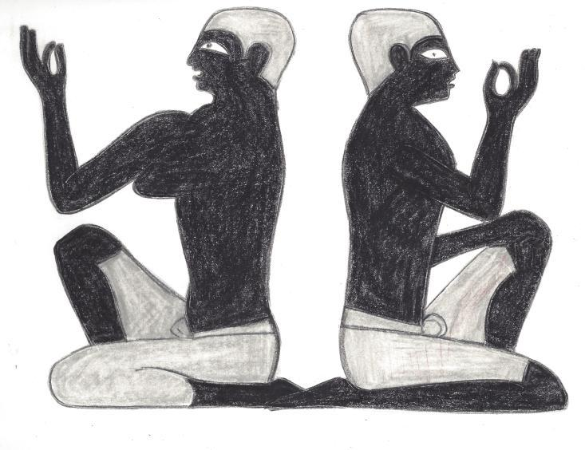

Εικόνα 10.1. Απεικονίσεις χειρονομίας στην Αρχαία Αίγυπτο, σε μνημείο από την Τετάρτη Δυναστεία, περ. 2600 π.Χ.
Αντίγραφο των Γ. Τζημόπουλου & Αικ. Ιωαννίδου (2016).iv

515

Στο Βυζάντιο, η καλλιέργεια της χειρονομίας αποδεικνύεται ιδιαίτερα διαμέσου ιστορικών,
εικονογραφικών και λειτουργικών πηγών. Μια εντυπωσιακή γραμματειακή πηγή είναι η περιγραφή του
ψαλτικού γίγνεσθαι στους ιερούς ναούς της Αγίας του Θεού Σοφίας και του Αγίου Δημητρίου, Πολιούχου
Θεσσαλονίκης, το έτος 900 περίπου, από τον Ιωάννη Καμινιάτη:
«ἐκεκλήρωντο γὰρ ἐν ἑκάστῳ τούτων τάγματα ἱερέων, δι΄ ὧν μυστικὴ
τελεῖται λατρεία, καὶ ἀναγνωστῶν συστήματα, δι' ὧν ἡ τῶν ᾀσμάτων
σπουδάζεται ὑμνῳδία ἀμοιβαδὸν τοὺς στίχους ἀλαλάζοντες, καὶ ταῖς
χειρονομίαις τῶν μελῶν τὸν φθόγγον διατιθέντες, καὶ μεγάλην τινὰ
καὶ ἀξιοθέατον χορείαν συνιστῶντες, τῷ τε εἴδει τῆς ἀστραπτούσης
στολῆς τὰς τῶν ὁρώντων θέλγοντες ὄψεις, καὶ τῇ τεχνωμένῃ τῶν
ψαλμῶν λύρᾳ τὴν ἀκοὴν κατατέρπνοντες.»v
O ρόλος της χειρονομίας στην εφεύρεση της μουσικής παρασημαντικής δεν είναι ακόμα πλήρως
εξακριβωμένος. Μερικά σημάδια όμως φαίνεται ότι γεννήθηκαν από αντίστοιχες κινήσεις του χεριού (π.χ. η
πεταστή, ο σταυρός κ.ά.).vi Επίσης, μπορούμε να υποθέσουμε ότι η χειρονομία έπαιζε σημαντικό ρόλο στο
πλαίσιο της παλαιοβυζαντινής σημειογραφίας, ιδιαίτερα στα μελισματικά γένη μελοποιίας.
Για τη θέση της χειρονομίας στη μουσική εκπαίδευση μιλάει ο Νικόλαος Μεσαρίτης (1163/4 - †
1220), περιγράφοντας με γλαφυρό τρόπο σκηνές από τα εκπαιδευτήρια στον Ιερό Ναό των Αγίων Αποστόλων
στην Κωνσταντινούπολη:
«Ἐκεῖθεν ἴδοις ὡς πρὸς δυσμὴν [ὑμνῳδοὺς] ψαλτῳδοὺς σὺν παισὶ
νηπιόχοις σχεδὸν καὶ ὑποψελλίζουσιν καὶ τῆς θηλῆς ἀρτίως
ἀποσπασθεῖσιν, οἳ καὶ ἀνοίγουσι στόμα καὶ λαλοῦσι σοφίαν καὶ
καταρτίζουσιν αἶνον τῷ πάντων βασιλεῖ καὶ θεῷ καὶ τοῖς ἁγίοις αὐτοῦ
τοῖς τὴν ἐκείνου πολιτείαν μιμησαμένοις καὶ τὰ παθήματα. μικρὸν
παριὼν μειρακίοις ἐντύχοις σὺν νεανίσκοις ἄρτι τὸν μείρακα
παραμείβουσιν, εὔρυθμον μέλος καὶ σύμφωνον ἁρμονίαν ἐκ φάρυγγος, ἐκ
στόματος, ἐκ γλώττης, ἐκ χειλέων, ἐξ ὀδόντων προπέμπουσι. νωμῶσιν
οὗτοι καὶ χεῖρα πρὸς φωνῶν καὶ ἤχων ἐξίσωσιν τὸν ἀρτιμαθῆ
χειραγωγοῦσαν οἷον τοῦ μὴ τοῦ συντόνου ἐξολισθαίνειν κἀκ τοῦ
ῥυθμοῦ καταπίπτειν μηδ̉ ἐκ τῆς συμφωνίας ἐκνεύειν καὶ διαμαρτάνειν
τοῦ ἐμμελοῦς.» (Ηeisenberg, 1908, σ. 20-21, ενότητα 9. Βλ. και Wellesz, 1962,

1. 62-63, υποσημ. 3. Βuchwald, Hohlweg & Prinz, 1982, 521-522. Φλώρος, 1998,

σ. 99-107).

Ένας πρώτος προσδιορισμός της βυζαντινής μουσικής χειρονομίας βρίσκεται στον Ψευδο-
Δαμασκηνό VII (μέσα-τέλη του 14ου αιώνα):
«χειρονομία ἐστὶ νόμος παραδεδομένος τῶν ἁγίων πατέρων, τοῦ τε ἁγίου
Κοσμᾶ τοῦ ποιητοῦ καὶ τοῦ ἁγίου Ἰωάννου τοῦ Δαμασκηνοῦ. Ἡνίκα γὰρ
ἐξέρχεται ἡ φωνὴ τοῦ μέλλοντος ψάλλειν τι, παραυτίκα καὶ ἡ
χειρονομία, ὡς ἵνα παραδεικνύει ἡ χειρονομία τὸ μέλος.»vii
Κατά την εποχή της Καλοφωνίας (τέλη 13ου-15ος αιώνας), η χειρονομία γνώρισε μια
μεγάλη άνθηση, όπως τεκμηριώνουν:

- τα πολλά μεγάλα σημάδια, «τὰ τῆς χειρονομίας», στα μουσικά χειρόγραφα,

- οι ποικίλες μέθοδοι για την εκμάθηση των σημαδιών της χειρονομίας (π.χ. το Μέγα Ίσον του Αγίου Ιωάννου του Κουκουζέλη),

- οι διάφορες ερμηνείες περί χειρονομίας στα μουσικά θεωρητικά εγχειρίδια (π.χ. το σύγγραμμα του Μιχαήλ Βλεμύδη),viii

- οι πολύ ρεαλιστικές απεικονίσεις ψαλτών κατά την Παλαιολόγεια εποχή (π.χ. στον Ι.Ν. Αγίου Νικολάου Ορφανού, Άνω Πόλη Θεσσαλονίκης): βλ. Εικόνα 10.2.

516

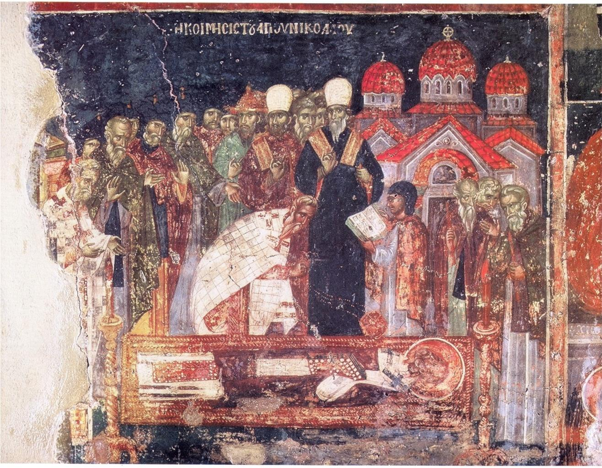

Εικόνα 10.2. Η Κοίμησις του Αγίου Νικολάου, σκηνή από τον κύκλο του Βίου του Αγίου Νικολάου, τοιχογραφία
από τον Ι.Ν. Αγίου Νικολάου Ορφανού στην Άνω Πόλη Θεσσαλονίκης, ανώνυμου αγιογράφου των αρχών του
14ου αιώνα. Πίσω από τη σωρό του Αγίου διακρίνονται, μεταξύ άλλων: ένας νεαρός κανονάρχης, κρατώντας
ανοιχτό βιβλίο στον «Άμωμο» (Ψαλμός 118, ο οποίος ψέλνεται στην Εξόδιο Ακολουθία), και τρεις δομέστικοι
φορώντας σφικτούρια σε διάφορα χρώματα, και τα χαρακτηριστικά τους καπέλα (δύο με άσπρα σκαράνικα και
ένας με το τριγωνικό σκιάδιον). Οι τρεις δομέστικοι κάνουν το σχήμα της οξείας με το δεξί τους χέρι.
Αξιοσημείωτη είναι η «ιδιαίτερη εκφραστική του βλέμματος» των τριών δομεστίκων.ix
Πηγή: Μπακιρτζής, Χ. (Επιμ., 2003). Ἅγιος Νικόλαος Ὀρφανός, Οἱ Τοιχογραφίες. Φωτογραφίες Βασίλης Τσώνης.
Αθήνα: Ακρίτας, εικόνα 77 και σχόλια στις σ. 80-85: 81. © Βασίλης Τσώνης | Υπουργείο Πολιτισμού & Αθλητισμού -
Εφορεία Αρχαιοτήτων Πόλης Θεσσαλονίκης.

Η πιο αναλυτική περιγραφή της χειρονομίας οφείλεται στο Γαβριήλ Ιερομόναχο (α΄ μισό 15ου
αιώνα). Βάσει αυτής, μπορούμε να συμπεράνουμε ότι η χειρονομία είχε τους εξής ρόλους:

1. Βοηθητικός: «ὡς βοηθῷ τινι καὶ συνεργῷ χρώμεθα (sc. τῇ χειρονομίᾳ)

ἐν τοῖς ᾄσμασιν. Ὥσπερ γὰρ οἱ διαλεγόμενοι ἀναπαύεσθαι δοκοῦσι καὶ
ποριμώτεροι γίνονται τὴν χεῖρα κινοῦντες ἔνιοι δὲ καὶ ἑαυτοὺς ὅλους,
οὕτω καὶ οἱ ψάλται κρεῖττον ᾄσουσι τὴν χεῖρα κινοῦντες».x

1. Δεικτικός: Η χειρονομία είναι «ἡ (...) νέμουσα διὰ τῆς χειρὸς τὰς

προσηκούσας ποιεῖν θέσεις.»xi Εντούτοις πρέπει όμως να σημειωθεί ότι η
χειρονομία δεν μπορεί να δείξει τη μετροφωνία (το ποσό των διαστημάτων):
«ἐπεὶ γὰρ ὁ ἀπόστροφος καὶ ἡ χαμηλὴ κατὰ μὲν τὴν χειρονομίαν εἰσὶ
ταὐτά, διαφέρουσι δὲ κατὰ τὰς φωνάς, ὁ μὲν γὰρ ἀπόστροφος ἔχει μίαν

517

φωνήν, ἡ δὲ χαμηλὴ τέσσαρας, ἀλλὰ καὶ αἱ τρεῖς καὶ αἱ δύο φωναὶ αἱ
κατιοῦσαι τὴν τοῦ ἀποστρόφου ἔχουσι χειρονομίαν, ὁ γράφων
ἀποβλέπων πρὸς τὴν χειρονομοῦσαν οἶδε μὲν ὡς κατιοῦσαν ἢ
κατιούσας φωνὰς λέγει, τὸν δὲ ἀριθμόν ὁπόσος ἐστὶν οὐκ οἶδε»:xii βλ.
Εικόνα 10.3.

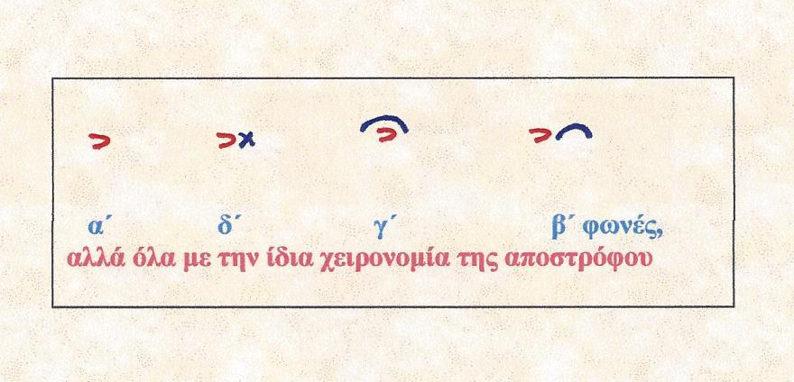

Εικόνα 10.3. Μια απεικόνιση των λόγων του Γαβριήλ Ιερομονάχου (στίχοι 706-712), αναφορικά με τη
σχέση ανάμεσα στα σώματα και τα πνεύματα: τα πρώτα δίνουν τη χειρονομία τους και στα δεύτερα.

1. Συντονιστικός: «εἰ μὴ ἦν ἡ χειρονομία, παμφωνία ἐγένετο ἂν ἀλλ' οὐ

συμφωνία. Ἐπεὶ γὰρ ἅπαντες οὐκ ἄλλας καὶ ἄλλας λέγομεν φωνὰς ἀλλὰ
τὰς αὐτὰς πάντες, συνέβαινεν ἂν τὸν μὲν προλαμβάνειν τὸν δὲ ἕπεσθαι,
καὶ τὸν μὲν ἔσω τὸν δὲ ἔξω λέγειν, εἰ μὴ ἦν τι τὸ ὁδηγοῦν πάντας
συμφωνεῖν. Τοῦτο δ' ἔστιν ἡ χειρονομία πρὸς γὰρ τὴν δομεστίκου χεῖρα
ἅπαντες ἀποβλέποντες συμφωνοῦμεν, καὶ διὰ ταῦτα χρήσιμός ἐστι,
μᾶλλον δὲ χρησιμοτάτη καὶ τιμιωτάτη ἐστὶν ἡμῖν ἡ χειρονομία μόνον μετὰ
σεμνότητος.»xiii

1. Προσδιοριστικός της μουσικής ορθογραφίας: «ταύτας (id est τὰς θέσεις)

διακρίνει καὶ θεωρεῖ εἴτε καλῶς ἔχουσιν εἴτε μὴ ἡ χειρονομία. Ἐπεὶ γὰρ
ἕξ εἰσι τὰ ἀνὰ μίαν φωνὴν ἔχουσα σημάδια, ἔμελλέ τις ταῦτα τιθέναι
ἀδιαφόρως καὶ μὴ εἰς τὸν οἰκεῖον ἕκαστον τόπον, εἰ μὴ ἦν ἡ χειρονομία ἡ
γνωρίζουσα ἡμῖν τὸν ἑκάστου τόπον.»xiv

Απ' όλα τα παραπάνω μπορούμε να συμπεράρουμε ότι η χειρονομία ήταν αρμόδια προς την έντεχνη
διαμόρφωση του άσματος και έπρεπε να ληφτεί υπόψη στην καταγραφή των κομματιών. Ο Γαβριήλ
Ιερομόναχος υπογραμμίζει ότι η χειρονομία αποτελεί ένα στοιχείο εκ των ουκ άνευ για την Ψαλτική:
«οὐδοτιοῦν γάρ ἐστι δυνατὸν εἰπεῖν τινα δίχα χειρονομίας ἐν τῇ ψαλτικῇ.»xv Ενώ το ίσον και τα
σώματα (τα σημάδια τα οποία δείχνουν μία ανιούσα ή μία κατιούσα φωνή [διάστημα δευτέρας]) έχουν δικές
τους χειρονομίες, τα πνεύματα (ελαφρόν, χαμηλή, κέντημα και υψηλή) δεν έχουν. Εφόσον όμως πρέπει να
χειρονομούνται και τα πηδήματα, τα πνεύματα συντίθενται με τα σώματα, έτσι ώστε «μεταδεδώκασι τὰ
ἔχοντα τὴν χειρονομίαν σημάδια τοῖς μὴ ἔχουσι, καὶ τούτῳ τῷ τρόπῳ ἔχουσι πάντα
χειρονομεῖσθαι.»xvi
Η Προθεωρία της Παπαδικής παρουσιάζει τα μεγάλα σημάδια (βραχυγραφία ΜγΣ) ως τα κατ'
ἐξοχήν σημάδια της χειρονομίας, όπως φαίνεται από τις ερυθρές επικεφαλίδες των αντίστοιχων καταλόγων
σημαδιών: «ταῦτα εἰσὶν τὰ ἄφωνα σημάδια, τὰ διὰ τῆς χειρονομίας, ἅτινα λέγονται μεγάλαι
ὑποστάσεις»xvii ή, σε μεταγενέστερα χειρόγραφα, «τὰ δὲ μεγάλα σημάδια τὰ ἄφωνα, ἅτινα λέγονται
μεγάλαι ὑποστάσεις, εἰσὶν ταῦτα, διὰ μόνης χειρονομίας κείμενα καὶ οὐ διὰ φωνήν, ἄφωνα
γὰρ εἰσίν.»xviii
Ο Γαβριήλ Ιερομόναχος μας πληροφορεί επίσης για το γενικό ρόλο των ΜγΣ: όπως τα προσωδιακά
στοιχεία στη Γραμματική, παρομοίως και τα ΜγΣ στην Ψαλτική χρησιμεύουν στον προσανατολισμό μέσα

518

στο μουσικό κείμενο και στη διαμόρφωσή του, δείχνοντας ρυθμό ή αγωγή, δυναμική και άλλες λεπτομέρειες
της εκτέλεσης:
«Ἐπεὶ δὲ οὐ μόνον χρῄζομεν τῶν εἰκοσιτεσσάρων γραμμάτων ἀλλὰ
δεόμεθα καὶ τῶν δέκα προσῳδιῶν διὰ τὴν εὐφωνίαν τοῦ λόγου, οὕτως οὐ
μόνον εἰσὶ χρήσιμα τὰ δεκαπέντε φωνητικὰ σημάδια ἀλλὰ καὶ τὰ λστ΄ τὰ
ἄφωνα, ἃ καὶ λόγον προσῳδιῶν ἔχουσι ἐν τῇ ψαλτικῇ. Ταῦτα γὰρ
ὥσπερ ὁδηγός ἐστι καὶ ἡγεμὼν τοῦ οὕτως ἢ οὕτως εἰπεῖν, ἢ ἀργῶς
μεταχειρίσασθαι τὰς φωνὰς ἢ συντόμως, ἢ μετὰ τόνου ἢ ἡσύχως. Τὰς μὲν
γὰρ φωνὰς ποιοῦσιν, ὡς εἴπομεν, τὰ φωνητικὰ σημάδια, τὰς δὲ ἀργίας
καὶ συντομίας καὶ τὰς ἄλλας ἰδέας τῶν μελῶν ταῦτα τὰ μεγάλα
σημάδια.»xix
Ταυτόχρονα, τα ΜγΣ υπενθυμίζουν στο χοράρχη την αρμόζουσα κίνηση του χεριού:
«Ἰδοῦ γὰρ τίθεμεν ὀλίγον καὶ ἐφεξῆς ὀξεῖαν, μετὰ δὲ ταῦτα τρεῖς
ἀποστρόφους καὶ ἀνερχόμεθα τὰς δύο φωνάς, τῆς τε ὀλίγου καὶ τῆς
ὀξείας καὶ τὰς τρεῖς κατιούσας τῶν τριῶν ἀποστρόφων. Οὐ μὴν
γινώσκομεν ὅπως δεῖ ταύτας εἰπεῖν ἢ ἀργῶς ἢ συντόμως, εἰ μὴ τὸ γοργὸν
ἢ τὸ ἀργὸν ἐπάνω τεθῇ, ἀλλ' οὐδὲ πῶς δεῖ σχηματίσαι τὴν φωνὴν ἢ πῶς
ταύτην χειρονομῆσαι τὴν θέσιν, ἐὰν μὴ καὶ τὸ τρομικὸν ὑπογράψωμεν.
Καί εἰσιν οὐν χρήσιμα διὰ ταῦτα τὰ μεγάλα σημάδια»:xx βλ. Εικόνα 10.4.

Εικόνα 10.4. Μια απεικόνιση των λόγων του Γαβριήλ Ιερομονάχου (στίχοι 251-258), αναφορικά με τη σχέση ανάμεσα στα
έμφωνα και τα άφωνα σημάδια, με παράδειγμα τη θέση του τρομικού.

Κατά την εποχή του νέου καλλωπισμού (16ος/17ος-18ος αι. περ.), ο αριθμός των ΜγΣ αυξάνεται
θεαματικά στα μουσικά χειρόγραφα. Το φαινόμενο αυτό μπορεί να ερμηνευτεί σαν καταγραφή της
χειρονομίας, για την διάσωση της παράδοσης, σε μια περίοδο κατά την οποία η υψηλή τέχνη διεύθυνσης
ψαλτικών χορών των βυζαντινών χρόνων σταδιακά πέφτει σε λησμονή. Από την άλλη μεριά, η κάμψη της
χειρονομίας συνδέεται με την εμφάνιση της γραπτής εξήγησης.xxi
Ένα τελευταίο τεκμήριο περί της χρήσης της έντεχνης χειρονομίας στην Ψαλτική ανήκει στο
δομινικανό μοναχό Jacques Goar (1601-1653):xxii
«Η λέξη "χειρονομεῖν" δεν σημαίνει απλώς το να σηκώνεται και να κατατίθεται το
χέρι κατά τη συνήθεια της αλλαγής του μέτρου (ad numerum manus modulandi
moram) και το να προσδιορίζει την τάξη. Αντίθετα, οι Έλληνες ψέλνουν σπάνια στο
αναλόγιο (εννοεί από βιβλία). Ο κανονάρχης λέει τα κόμματα των τροπαρίων από το
βιβλίο και ενώπιον όλων ο διευθυντής του χορού δείχνει με διάφορες κινήσεις και
χειρονομίες του δεξιού του χεριού, με δάχτυλα σηκωμένα, χαμηλωμένα, ξαπλωμένα,
συρρικνωμένα ή ενωμένα, αντί των μουσικών χαρακτήρων, τα διάφορα σχήματα του
άσματος και τα γυρίσματα των φωνών. Έτσι λοιπόν, όλοι οι υπόλοιποι κοιτάζουν με
προσοχή σ' αυτόν τον αρχηγό του άσματος, ακολουθώντας τον κανόνα ολόκληρης
της εκτέλεσης (totius modulationis regulam).»xxiii
Κατά το α΄ μισό του 18ου αιώνα, ο Κύριλλος Μαρμαρηνός αναφέρει πως η χειρονομία εστερείτο
πλέον θεωρητικής βάσης και εκτελείτο μόνο πρακτικά.xxiv Σχετικά με τα ΜγΣ παρατηρεί ότι
«Ἔχουσι καὐτὰ τὴν ἐνέργειαν αὐτῶν ὀρθήν, ὅταν ὦσι σύμφωνα ταῖς
γραμμαῖς ἐπείγε πολλάκις ἐστὶν ἰδεῖν ἑτέραν γραμμήν, καὶ ἕτερα

519

σημάδια ἢ κατὰ παραγραφήν, ἢ καὶ πρὸς κάλλος καὶ μόνον τῆς γραμμῆς
διὸ καὶ ἄνευ αὐτῶν δυνάμεθα ψάλλειν, ὅταν ᾖ ἡ γραμμὴ τῆς συνθέσεως
ὀρθή, καθῶς καὶ ἐν παλαιῷ στιχηραρίῳ, ἐν ᾧ καὶ ἄνευ τῶν σημαδιῶν
ψάλλομεν, εἰ καὶ δυσχερεστάτην τὴν γραμμὴν εὑρίσκομεν:»xxv βλ. Πίνακα

10.1.

|Στο παλαιό Στην όψιμη μεσοβυζαντινή Σύμφωνα με το H θέση του χορεύματος Στιχηράριο, η θέση γραφή προστίθεται με Μαρμαρηνό, μερικές φορές είναι αυτή. Εδώ τα ουρανίσματος κόκκινο το ειδικό άφωνο το μεγάλο σημάδι δεν μαύρα σημάδια (μεσοβυζαντινή σημάδι του ουρανίσματος: ταιριάζει με τα έμφωνα βρίσκονται σε πρώιμη, εξελιγμένη συμφωνία με το σημάδια της θέσης. Εδώ και πλήρως κόκκινο σημάδι, και εξελιγμένη γραφή): π.χ. φαίνεται η θέση αυτό βοηθάει τον ουρανίσματος με το άφωνο ψάλτη να ταυτίσει σημάδι του χορεύματος: γρήγορα τη θέση και ένα λάθος, το οποίο θα να αποδώσει το μέλος δυσκολέψει τον ψάλτη της, σύμφωνα με την προφορική παράδοση. στην εκτέλεση της θέσης αυτής.|
|---|
||



Πίνακας 10.1. Μια επεξήγηση των λόγων του Κυρίλλου Μαρμαρηνού (Gerstman, επιμ., 1994, σ. 738), για τις σχέσεις
ανάμεσα στα έμφωνα και τα μεγάλα σημάδια των θέσεων.xxvi

Επίσης, συγκρίνοντας τη χειρονομία της βυζαντινής και της οθωμανικής μουσικής μεταξύ τους, ο

Μαρμαρηνός διεκρινίζει ότι «ἡ καθ' ἡμᾶς ἐκείνη χειρονομία κίνησις ἦν χειρῶν σχηματοποιοῦσα τὸ
μέλος ἡ δὲ τούτων (i.e. τῶν Ὀθωμανῶν) χειρονομία ῥυθμός ἐστι καὶ μέτρον μελιζομένων.»xxvii
Ο Βασίλειος Στεφανίδης υπογραμμίζει στο θεωρητικό του σύγγραμμα (έτ. 1819) ότι η χειρονομία
αφορούσε όχι μόνο το μέτρο, αλλά και ποικίλματα και δυναμικές της φωνής:
«Καὶ ἡ μὲν χειρονομία εἰς τὴν προπαίδειαν αὐτὴν θεωρεῖται οὐ μόνον ὡς
μέτρον χρόνου, ἀνερχομένης δηλαδὴ τῆς χειρὸς καὶ κατερχομένης, ἀλλὰ
προσέτι ὡς παρέχουσα κυριωτέρως εἰς τοὺς φθόγγους ὀξύτητά τινα ἢ
ἐπίτασιν, διὸ καὶ κατὰ τὰς ποικιλίας τῶν σχημάτων αὐτῆς διαφόρους
ὀνομασίας λαμβάνουσι τὰ σημάδια τὰ δηλοῦντα εἰς τὰς γραμμὰς ἢ θέσεις
τοὺς διαφόρους τῆς χειρονομίας αὐτῆς τρόπους καὶ σχηματισμούς.»xxviii
Σύμφωνα με τον ίδιο θεωρητικό, το μουσικό περιεχόμενο των ΜγΣ και η χειρονομία διδάσκονται
μόνο προφορικά:
«Τῶν δὲ σημαδίων αὐτῶν ἡ σημασία καὶ χειρονομία γραφῇ οὐ
διδάσκεται καθὼς καὶ οἱ τρόποι, τά τε σχήματα τῶν ῥητόρων, τὰ
ἐπιτήδεια εἰς τὸ κινῆσαι τὰ πάθη, ἀλλὰ μόνο διὰ ζώσης φωνῆς καὶ
αἰσθητῶν τοῦ διδασκάλου κινήσεων.»xxix
Ο Χρύσανθος σημειώνει σχετικά με την παλαιά τέχνη διεύθυνσης:
«Χειρονομία εἶναι κατὰ τοὺς ἐκκλησιαστικοὺς μουσικοὺς κίνησις τῆς
χειρὸς, ἀφορῶσα εἰς τὸν ἰδεασμὸν τῆς μελῳδίας, καὶ εἰς καταμέτρησιν

520

τοῦ χρόνου, ὁ ὁποῖος ἐξοδεύεται εἰς αὐτὴν κατὰ τοὺς κανόνας τῆς
ῥυθμικῆς (...) Ἡ χειρονομία ἦταν ἀναγκαῖα, λέγουσιν, εἰς τὸν ψάλτην
διότι δι' αὐτῆς δύνατο νὰ διακρίνῃ τὰς συνθέσεις τῶν χαρακτήρων τῆς
ποσότητος καὶ ποιότητος, δι' ὧν ἐγράφετο πᾶσα μελῳδία καὶ ὅποιος
ἐγίνωσκε καλῶς τὴν χειρονομίαν, ἔψαλλε μετὰ ἁρμονίας, καὶ ῥυθμοῦ καὶ
τάξεως. Εἰς ἡμᾶς ὅμως κατὰ τὸ παρὸν δὲν χρησιμεύει εἰς ἄλλο, παρὰ εἰς
τὸ νὰ μάθωμεν τὴν ἐτυμολογίαν τινῶν χαρακτῆρων, οἵτινες ἔλαβον τὴν
ὀνομασίαν ἀπὸ τῆς χειρονομίας.»xxx
Ο ίδιος μουσικοθεωρητικός αναφέρει πως η χειρονομία, η οποία ήταν ακόμα εν χρήσει περί το έτ.
1650, είχε λησμονηθεί κατά τη δική του εποχή, στις αρχές του 19ου αιώνα. Στο πλαίσιο της Νέας Μεθόδου,
όπου υπάρχει για πρώτη φορά εκτενής διδασκαλία για το ρυθμό, τη θέση της παλαιάς χειρονομίας παίρνει η
μέτρηση του χρόνου (tactus):
«Μετροῦνται δὲ οἱ χρόνοι διὰ τῆς θέσεως καὶ τῆς ἄρσεως (...) καὶ διὰ μὲν
τὴν θέσιν πλήττομεν τὸ δεξιὸν γόνυ μὲ τὴν δεξιὰν χεῖρα διὰ δὲ τὴν ἄρσιν
πλήττομεν τὸ ἀριστερὸν γόνυ μὲ τὴν ἀριστερὰν χεῖρα.»xxxi
Ακριβώς γι' αυτήν τη συρρίκνωση της χειρονομίας σε ρυθμό και μέτρο στη Νέα Μέθοδο, ο
Απόστολος Κώνστας Χίος εκφράζει τη λύπη του με τα εξής λόγια:
«ἔκαμε καὶ αὐτὸ σχολίον μόνον τῶν φθόγγων στάσεων καὶ χειρονομίας
διὰ μέσου τῆς ῥυθμιτικῆς. Ἔχασε ὅμως ἀλίμονον τὴν ἀγγελικὴν
μελῳδίαν.»xxxii
Η δραστική απλοποίηση της παρασημαντικής με τη Μεταρρύθμιση του 1814/15 είχε ακόμα ως
συνέπεια ότι μερικές λεπτότητες της μουσικής εκτέλεσης παραδίδονταν πλέον μόνο προφορικά.
Με σκοπό να μη χαθούν τέτοιες λεπτομέρειες της ψαλτικής πράξης, ο Σίμων Καράς πρότεινε την
επαναφορά μερικών χειρονομικών σημαδιών της εξηγητικής μεσοβυζαντινής σημειογραφίας στη Νέα Μέθοδο
(λύγισμα, πίασμα, τρομικόν κ.ά.). Στη διεύθυνση χορωδίας, ο Καράς επιχειρούσε απ' τη μια μεριά τη
διαφοροποιημένη καταμέτρηση των ρυθμικών ποδών, απ' την άλλη την αναβίωση κάποιων χειρονομικών
σχημάτων, με αφετηρία τα μεγάλα σημάδια της μεσοβυζαντινής παρασημαντικής, τα οποία θεωρούσε ως
απεικονίσεις των σχημάτων που έκανε ο δομέστικος με το χέρι του: βλ. Εικόνα 10.5.xxxiii

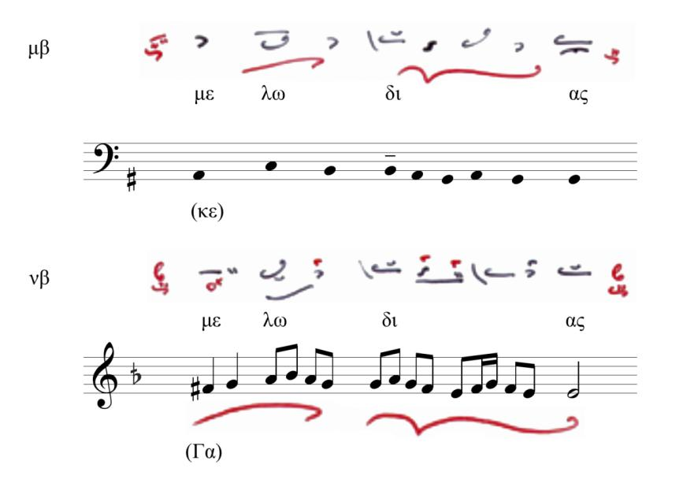

Εικόνα 10.5. Εικονική σχέση ανάμεσα στην κίνηση του χεριού, την κίνηση της φωνής και το γραφικό σχήμα μερικών
μεγάλων σημαδιών (εδώ αντικενώματος και κυλίσματος), σύμφωνα με το Σ. Καρά: απόσπασμα από την καταβασία της γ΄
Ωδής του β΄ Κανόνα των Θεοφανείων, με αρκτικό «Ὅσοι παλαιῶν ἐκλελύμεθα βρόχων», σε ήχο β΄, μελοποίηση
Γερμανού Νέων Πατρών (οι ίδιες θέσεις και στον Πέτρο Πελοποννήσιο).xxxiv

Στο πλαίσιο της Νέας Μεθόδου, ο Καράς ταύτισε την έννοια της χειρονομίας με την καλλιέπεια και
τα ποικίλματα φωνής.xxxv

521

## 2. Συστηματική προσέγγιση της χειρονομίας

Θεωρώντας τη χειρονομία υπό συστηματικό πρίσμα, παρατηρούμε ότι διακρίνονται τα εξής στοιχεία:

1. Το σχήμα του χεριού, το οποίο μεταφέρει ένα συγκεκριμένο μουσικό μήνυμα,xxxvi

2. η γραφική παράσταση: μεγάλα σημάδια, σώματα, ίσον,

3. το μουσικό αποτέλεσμα, η μουσική διαμόρφωση. Η μουσική διαμόρφωση (γερμ. Gestaltung) πραγματοποιείται στους τομείς:

α. του χρόνου,

1. του διαστηματικού χώρου και

2. της έκφρασης.

Ως εκ τούτου, η μουσική διαμόρφωση πραγματοποιείται στις εξής παραμέτρους του μουσικού γίγνεσθαι:

1. ρυθμός και αγωγή,

2. καλλωπισμοί διάφορων επιπέδων και μεταβολές,

3. δυναμική, άρθρωση, χροιά ήχου, φρασάρισμα, ήθος. Μερικές βασικές ερωτήσεις που προκύπτουν στην έρευνα της χειρονομίας είναι οι παρακάτω:  Ποια ήταν τα συγκεκριμένα σχήματα του χεριού;  Πότε χρησιμοποιούνταν αυτά τα σχήματα;  Ποια ήταν η σχέση ανάμεσα στο σχήμα του χεριού και το γραφικό σχήμα ενός σημαδιού;  Σε τι έγκειται το μουσικό αποτέλεσμα στο οποίο αποσκοπούσαν τα σχήματα του χεριού και τα γραφικά σημάδια χειρονομίας (ειδικά τα μεγάλα σημάδια);

## 3. Παραδείγματα μουσικοθεωρητικών, εικονογραφικών, πρακτικών και συγκριτικών πηγών για τη μελέτη της χειρονομίας

Η έρευνα του σημαντικού κεφαλαίου της Παλαιογραφίας το οποίο ονομάζεται «χειρονομία», στηρίζεται στη
συνδυαστική μελέτη διάφορων τύπων πηγών:

- μουσικοθεωρητικές: λίστες σημαδιών, διδακτικά ποιήματα, κείμενα με αναφορά στη χειρονομία,

- πρακτικές: μουσικά χειρόγραφα,

- εικονογραφικές: απεικονίσεις ψαλτών σε τοιχογραφίες και εικόνες, ειδικά της Παλαιολόγειας εποχής,

- γραπτές: αναφορές στη χειρονομία στην εκκλησιαστική γραμματολογία, σε ιστορικά κείμενα κ.ά.,

- συγκριτικές: χειρονομία σε άλλες μουσικές, χειρονομία στη νοηματική γλώσσα κ.ά.

Στη σύντομη ιστορική επισκόπηση της χειρονομίας με την οποία ξεκίνησε το παρόν κεφάλαιο, ήδη
αναφέρθηκαν αντιπροσωπευτικά αποσπάσματα από διάφορα μουσικοθεωρητικά συγγράμματα, στα οποία
θίγεται και το θέμα της χειρονομίας.
Ενώ στα περισσότερα θεωρητικά εγχειρίδια η χειρονομία διδάσκεται λιγότερο με λόγια και
περισσότερο μέσα από λίστες σημαδιών και διδακτικά ποιήματα (π.χ. το Μέγα Ίσον), στην ερμηνεία των
σημαδιών του Μιχαήλ Βλεμύδου (πιθ. 13ου αι. [Uspensky]), η χειρονομία αποτελεί το κυρίως θέμα του
συγγραφέα και αναπτύσσεται σε μορφή ερωταποκρίσεων, με περιγραφικό-συμβολικό χαρακτήρα, όπως
φαίνεται από τα παρακάτω αποσπάσματα:
«Ἀρχὴ σὺν Θεῷ τῶν σημαδίων ἑρμηνευομένων καθ' ἕκαστον ποιηθὲν
παρὰ <τοῦ> σοφωτάτου κυροῦ Μιχαὴλ τοῦ Βλεμύδου.
Ἐρώτησις Τὸ ἶσον εἰς τίνος τύπον χειρονομεῖται;
Ἀπόκρι(σις) Εἰς τύπον τῆς Ἁγίας Τριάδος καθώς ἐστιν ἡ Ἁγί(α) Τριάς, τὰ
τρία ἕν καὶ οὔτε ὁ Π(α)τὴρ μείζων κατὰ τὴν τῆς θεότητος οὐσίαν οὔτε ὁ
Υἱός οὔτε τὸ Ἅγιον Πν(εῦμ)α οὕτως φωνεῖται καὶ τὸ ἶσον, συγκειμένων
καὶ τῶν δακτύλων. (...)
Ἐρώτησις Ἡ ὀξεῖα εἰς τύπον τίνος χειρονομεῖται;
Ἀπ(όκρισις) Εἰς τύπον τῶν ὀξέων δορά(των) ἢ ὡς τοὺς ὀξεῖς ἥλους
μιμεῖσθαι.»xxxvii

522

Για τα ίδια δύο σημάδια και μερικά άλλα ακόμα, ένα δεύτερο, μικρότερο και ίσως παλαιότερο
κείμενο με την επιγραφή Ἐκ τῆς μουσικῆς συντεθεῖσα φωναῖον (sic) μέθοδος ἠκριβωμένη, ποιηθεῖσα
παρὰ τῶν ἁγίων πατέρων καὶ ποιητῶν κὺρ Κοσμᾶ καὶ Ἰωάννου τοῦ Δαμασκηνοῦ καὶ Ἰωάννου τοῦ
Χρυσοστόμου, από το χφο Σινά 1764, φ. 52α (16ου αι. [Raasted]/17ου αι. [Schartau]),xxxviii καταχωρεί τα εξής:
«Ἰστέον ὅτι τὸ ἴσον τὸ ὀλίγον τὴν πετασθήν τὸν σταυρόν
καὶ τὸ ξηρόν ὁ Κύριος ἡμῶν Ἰησοῦς Χριστὸς ἀνέδειξεν, τὴν δὲ
ὀξεῖαν Ἰωάννης ὁ Πρόδρομος. Καὶ τὸ μὲν ἴσον κρατήσας ὁ Κύριος
ἐν τῷ μυστικῷ δείπνῳ τὴν ἄχραντον αὐτοῦ δεξιὰν εἰς σχῆμα τοῦ ἴσου
εἶπεν ὁσάκις γὰρ ἐσθίετε τοῦτον τὸν ἄρτον καὶ ποτήριον τοῦτον πίνετε,
τὸν θάνατον τὸν ἐμὸν καταγγέλλετε διὸ τὸ σεβάσμιον σημεῖον καὶ
θεοδίδακτον, ἀρχὴ καὶ πρῶτον τῶν τόνων τοῦτο ἐγένετο (...)
Ἡ δὲ ὀξεῖα τετύπωται ὅτε ὁ Πρόδρομος Ἰωάννης τὸν Ἰησοῦν τοῖς λαοῖς
ἐδείκνυε καὶ λέγων ἴδε ὁ ἀμνὸς τοῦ Θεοῦ ὁ αἴρων τὴν ἁμαρτίαν τοῦ
κόσμου:-»xxxix
Διαβάζοντας κανείς τα παραπάνω χωρία και, γενικότερα, τα δύο κείμενα αυτά περί χειρονομίας
(Βλεμύδης, Ἑρμηνεία και Μέθοδος ἠκριβωμένη στο χφο Σινά 1764), αντιλαμβάνεται την προσπάθεια των
συγγραφέων για την ανίχνευση αρχετύπων των χειρονομιών της Ψαλτικής Τέχνης σε σχήματα και
περιστάσεις από τη ζωή του Χριστού και, γενικότερα, από τον κόσμο της Καινής και της Παλαιάς Διαθήκης.
Σίγουρα, ο μουσικολόγος θα ήθελε να γνωρίσει και πως ακριβώς ήταν τα αντίστοιχα σχήματα του χεριού. Εδώ
η μουσική εικονογραφία προσφέρει σημαντικές πληροφορίες: βλ. Εικόνες 10.6-10.9.

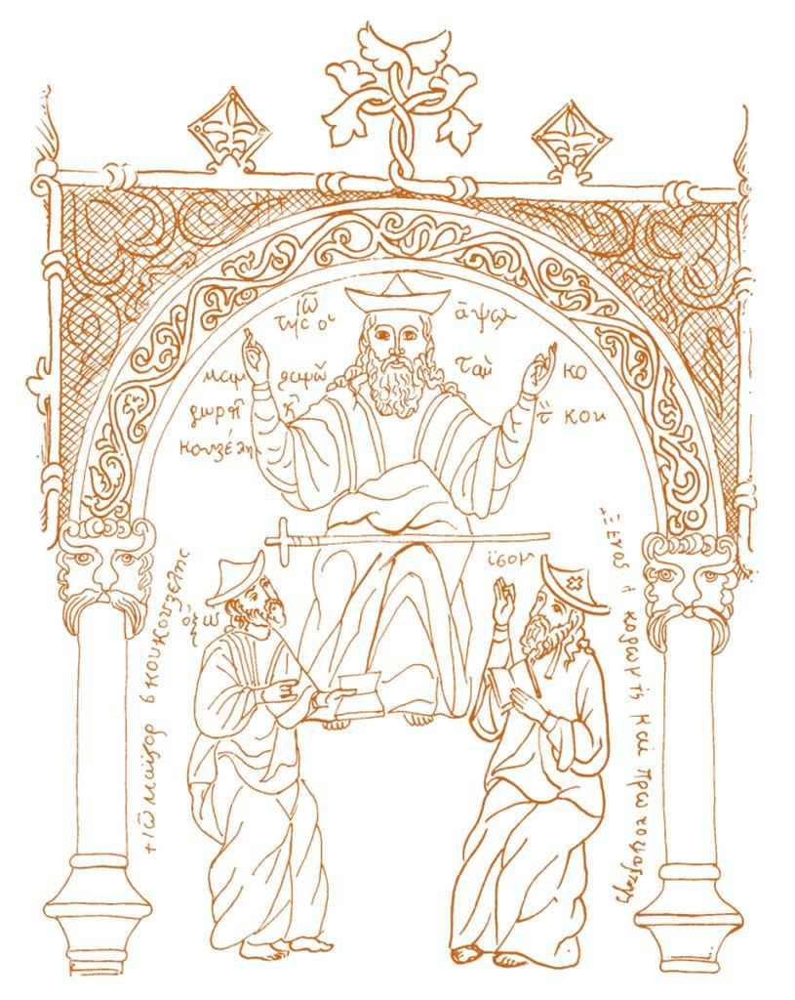
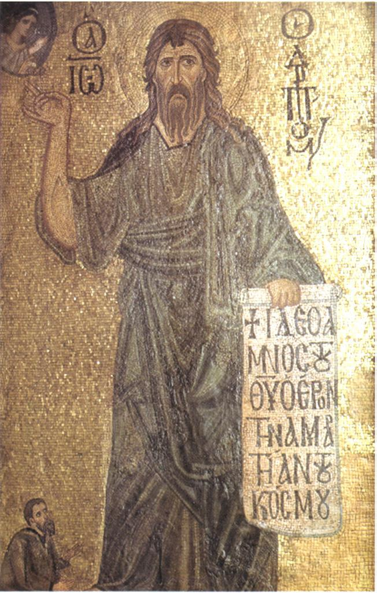

Εικόνες 10.6-7. Αριστερά: Ψηφιδωτή εικόνα του Τιμίου Προδρόμου, από τον Πατριαρχικό Ναό Αγίου Γεωργίου στο

Φανάρι της Κωνσταντινούπολης, γύρω στο 1280, σε «κλασικίζουσα τάση (...) του πρώτου παλαιολόγειου στυλ»,
προερχόμενη πιθανότατα από το ναό της Ιεράς Μονής Παμμακαρίστου της Βασιλεύουσας (Γκιολές, 1994, σ. 257, 256,

249). Στο αριστερό του χέρι, ο Άγιος Ιωάννης Βαπτιστής κρατάει ειλητάριο σε μεγαλογράμματη γραφή, όπου φαίνεται το

χωρίο «Ἴδε ὁ ἀμνὸς τοῦ Θ(εο)ῦ ὁ αἴρων τὴν ἁμαρτίαν τοῦ κόσμου» (Ιω. 1,29), ενώ με το δεξί του κάνει μια

523

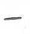
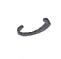
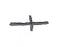

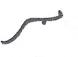
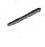
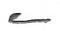
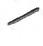

«χειρονομία λόγου» (Γκιολές, 1994, σ. 249), την οποία θα δούμε ταυτισμένη, στα συμφραζόμενα της Ψαλτικής Τέχνης, με
την «οξεία» (βλ. την Εικόνα 10.7, δίπλα). © Οικουμενικό Πατριαρχείο, Κωνσταντινούπολη. Πηγή φωτογραφίας: Demus,
Otto (†). (1991). Die Byzantinischen Mosaikikonen. I. Die grossformatigen Ikonen. Veröffentlichungen der Kommission
für Byzantinistik, Bd. V/1. Wien: Verlag der Österreichischen Akademie der Wissenschaften, Tafel IX. Photographien:
Tuğrul Saltukoğlu, Y. Mühendis, Istanbul. Ευχαριστούμε τον εκδοτικό οίκο για την άδεια δημοσίευσης:
<http://verlag.oeaw.ac.at>

 Δεξιά: Δευτερογενές αντίγραφο μικρογραφίας από το χφο της Ι.Μ. Κουτλουμουσίου αρ. 457, πιθ. 14ος αι.

Απεικονίζονται: Ιωάννης Γλυκύς ο Πρωτοψάλτης ευλογώντας (πάνω στη μέση) και κρατώντας μια ράβδο στα γόνατά του,
ο μαΐστωρ Ιωάννης ο Κουκουζέλης (αριστερά), κάνοντας τη χειρονομία της οξείας, και ο Πρωτοψάλτης Ξένος ο Κορώνης
(δεξιά), κάνοντας τη χειρονομία του ίσου. Τα ονόματα των αντίστοιχων σημαδιών καταγράφονται αριστερά, πάνω από τον
ώμο του Αγίου Ιωάννου του Κουκουζέλη, και δεξιά, πάνω από το δεξί χέρι του Ξένου του Κορώνη. Και οι τρεις φορούν
σφικτούρια και σκιάδια. Η αντιγραφή έγινε από τους Γ. Τζημόπουλο - Αικ. Ιωαννίδου.xl

Το θέμα του συμβολισμού της χειρονομίας των βυζαντινών φθογγοσήμων σε παραλληλία με τη
βυζαντινή αγιογραφία απασχόλησε διάφορους μελετητές, όπως το Neil Moran και τον πατέρα Σπυρίδωνα
Αντωνίου.xli Παρακάτω θα δούμε ένα επιπλέον δείγμα με παραστάσεις ψαλτών της Παλαιολόγειας εποχής, οι
οποίες φημίζονται για τον πολύ ρεαλιστικό τρόπο απεικόνισης λεπτομεριών

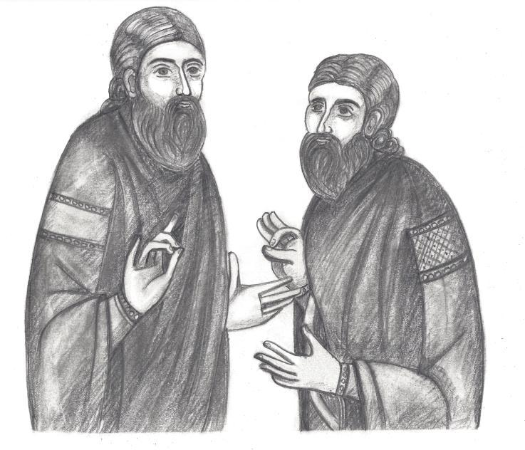

Εικόνα 10.8. Αγιογραφικό σκίτσο δείχνοντας λεπτομέρεια από τοιχογραφία με την Κοίμηση του Επισκόπου

Αρσενίου από τον Ι.Ν. της Υπεραγίας Θεοτόκου Οδηγήτριας στο Πατριαρχείο Peć, περίπου έτ. 1336. O ψάλτης
αριστερά κάνει το σχήμα της οξείας, εκείνος δεξιά το σχήμα του ίσου. Για το σκίτσο ευχαριστούμε τους Γ.
Τζημόπουλο & Αικ. Ιωαννίδου.xlii

Ενδιαφέρον παρουσιάζει και το γεγονός ότι το πανάρχαιο σχήμα το οποίο στη βυζαντινή μουσική
συσχετίζεται με το ίσον, εμφανίζεται και στη σύγχρονη τέχνη διεύθυνσης ευρωπαϊκής μουσικής, όπως
φαίνεται από την Εικόνα 10.9.

524

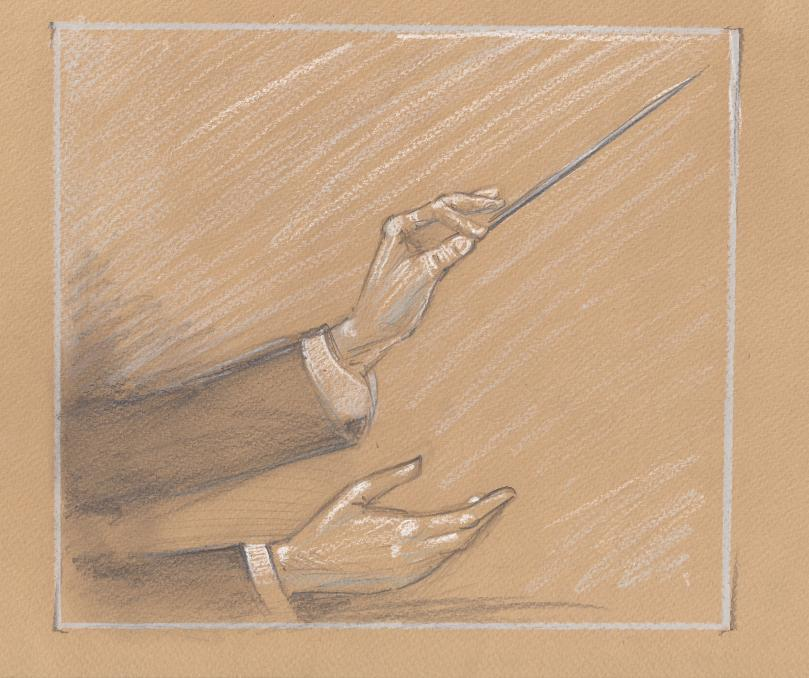

Εικόνα 10.9. Τα χέρια ενός σύγχρονου μαέστρου ευρωπαϊκής ορχήστρας. Το σχήμα που κάνει με το δεξί του
χέρι, κρατώντας την μπαγκέτα, συμπίπτει οπτικά με την παλαιά χειρονομία του ίσου στη βυζαντινή μουσική.
Σκίτσο των Γ. Τζημόπουλου & Αικ. Ιωαννίδου (2016).xliii

## 4. «Υπερστάσεις» και «μεγάλες υποστάσεις χειρονομίας». Ερμηνείες και πίνακες μεγάλων σημαδιών

Ίσως το πιο εντυπωσιακό για την τέχνη της χειρονομίας βυζαντινό μουσικό χειρόγραφο είναι το Ασματικόν
της Ι. Μητρόπολης Καστοριάς, αρ. 8, του 14ου αιώνα, στο οποίο διακρίνονται δύο σειρές μουσικής
παρασημαντικής: η πρώτη, πάνω από το ποιητικό κείμενο, η οποία είναι η γνωστή μεσοβυζαντινή
σημειογραφία, και η δεύτερη, με μεγαλόσχημα σημάδια σε κόκκινο μελάνι (σε λίγες περιπτώσεις και με
πράσινο).xliv Τα σημάδια αυτά, γνωστά στη μουσικολογική βιβλιογραφία ως «υπερστάσεις», αφορούν
ολόκληρες μουσικές φόρμουλες/θέσεις και, πιθανότατα, συσχετίζονται με τις χειρονομίες του
δομεστίκου/χοράρχη. Όπως παρατήρησε ο Κ. Φλώρος, παρουσιάζουν συγγένεια με τα σημάδια της
παλαιοβυζαντινής σημειογραφίας του αθωνικού τύπου, καθώς και με την παλαιοσλαβική κοντακάρια
σημειογραφία, η οποία έχει τις ρίζες της στην παλαιοβυζαντινή αθωνική:xlv Εικόνα 10.10.

525

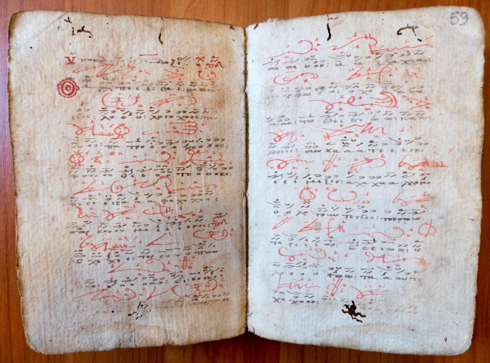

Εικόνα 10.10. Κώδικας Καστοριάς 8, φ. 58v-59r, 14ος αι., Ασματικόν. Στη φωτογραφία: Ὑπακοὴ τ(ῆς) ὀρθοδοξί(ας) «Ὁ ἀπερίγραπτος Λόγος», ἦχ(ος) πλ. δ΄.
Μεσοβυζαντινή σημειογραφία σε μαύρο μελάνι (έμφωνα και άφωνα σημάδια) και υπερστάσεις με κόκκινο μελάνι.xlvi © Ιερά Μητρόπολη Καστοριάς.

526

Σε διάφορα μουσικοθεωρητικά της υστεροβυζαντινής (13ος αι.-1453) και μεταβυζαντινής περιόδου, τα μεγάλα σημάδια κατακτούν μια περίοπτη
θέση. Εμφανίζονται σε λίστες σημαδιών και μεθόδους χειρονομίας, είτε με τα ονόματά τους, είτε και με τις χαρακτηριστικές τους θέσεις. Έπονται μερικά
παραδείγματα μόνο, από το χφο της Ι.Μ. Κωνσταμονίτου 86, του α΄ μισού του 15ου αιώνα:xlvii Εικόνες 10.11-10.13.

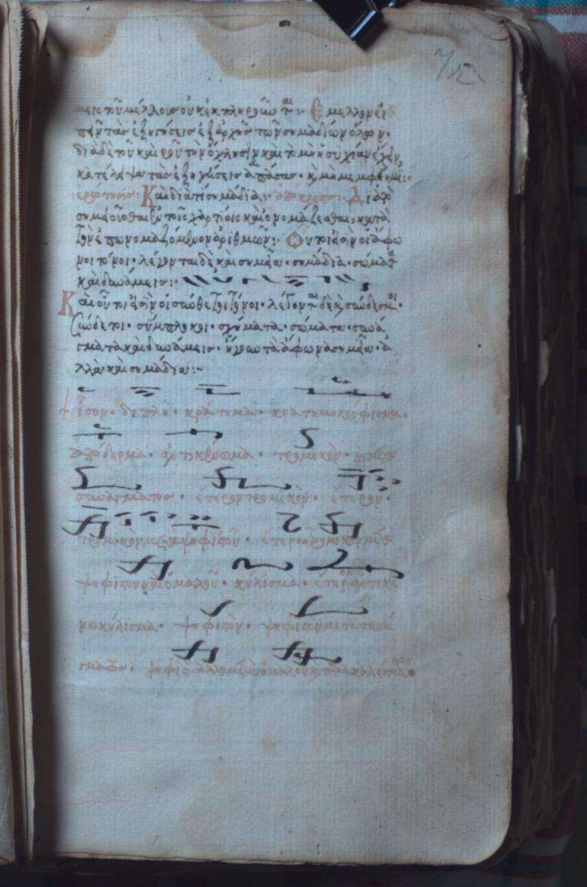
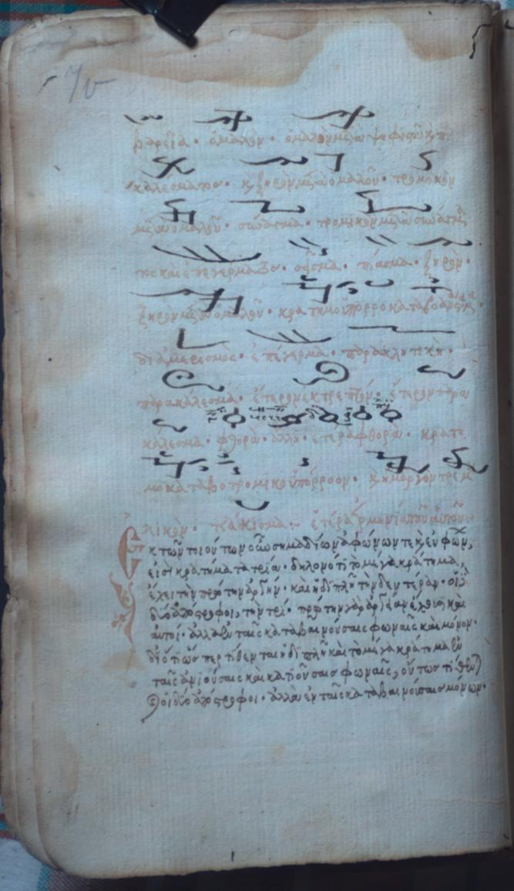

Εικόνα 10.11. Λίστα μεγάλων σημαδιών και θέσεων από το θεωρητικό του Ψευδο-Δαμασκηνού ΙΙ (Ανώνυμος Β), κείμενο α΄ μισού του 14ου αιώνα (Wolfram/Hannick), στο χφο

Ι.Μ. Κωνσταμονίτου 86, φ. 7α-β (αρχές 15ου αι.: Στάθης). Η επιγραφή της λίστας στο παρόν χειρόγραφο είναι: «Καὶ οὗτοι εἰσὶν οἱ σύνθετοι τόνοι λέγονται δὲ καὶ

σύνδεσμοι σύνθετοι σύμπλοκοι σχήματα σώματα συνάγματα καὶ δυνάμεις ἤγουν τὰ ἄφωνα σημεῖα ἀλλὰ καὶ σημάδια:-»xlviii

- © Ιερά Μονή Κωνσταμονίτου, Άγιον Όρος. 527

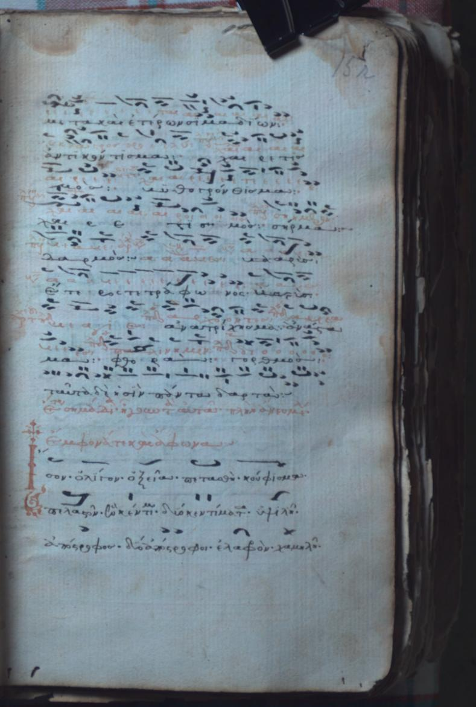
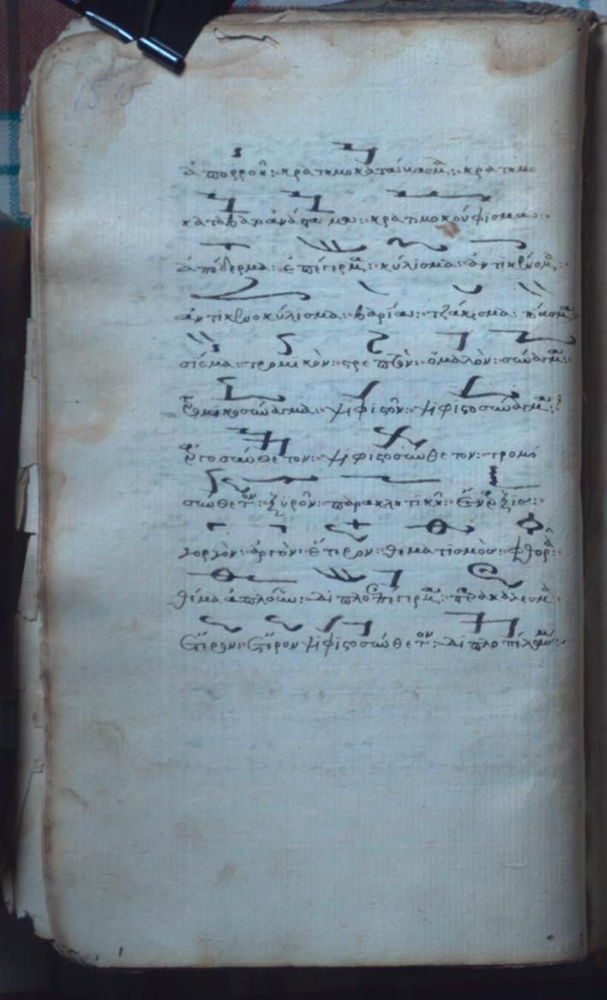

Εικόνα 10.12. Άσκηση χειρονομίας από την Προθεωρία του κώδικα της Ι.Μ. Κωνσταμονίτου 86, φ. 15α-β, αρχές 15ου αιώνα (Στάθης), φέροντας την επιγραφή: «Ἕτερα
σημάδια ἤγουν τὰ αὐτά πλὴν ἄνευ μέλ(ους) ἔμφωνά τε καὶ ἄφωνα:-» © Ιερά Μονή Κωνσταμονίτου, Άγιον Όρος.
528

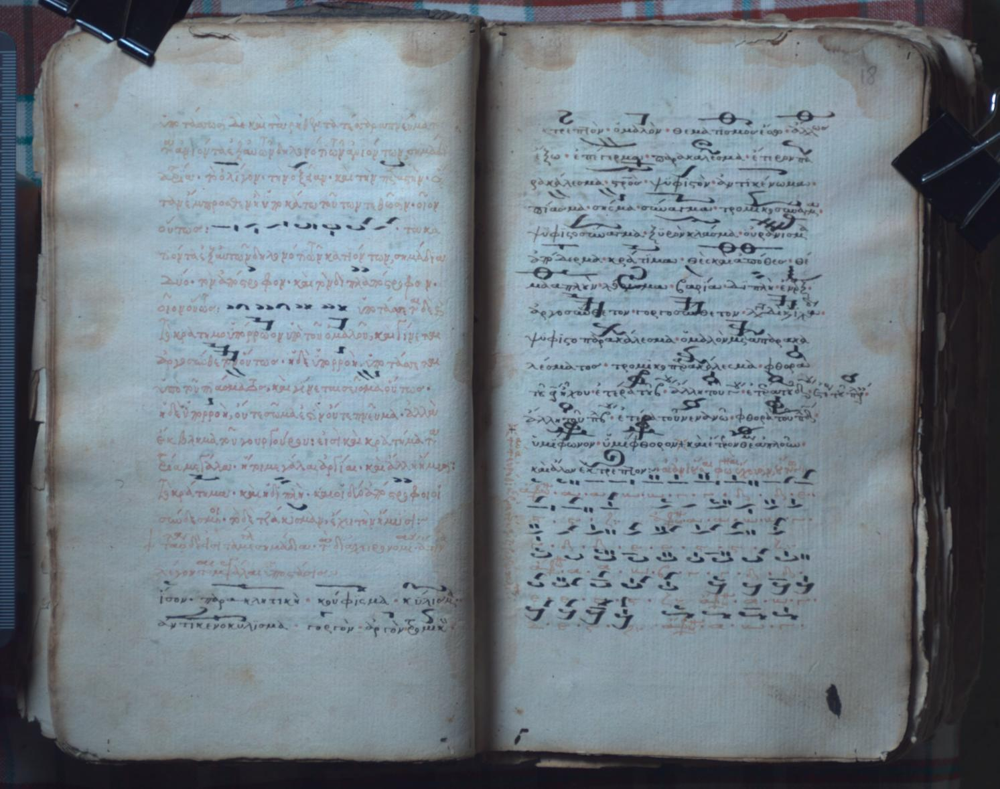

Εικόνα 10.13. Η λίστα μεγάλων σημαδιών από την Προθεωρία του χφου της Ι.Μ. Κωνσταμονίτου 86, φ. 17β-18α, αρχές 15ου αιώνα (Στάθης). Επιγράφεται ως: «† ταῦτα δὲ
εἰσὶ τὰ μεγ(ά)λ(α) σημάδια τὰ διὰ χειρονομίας ἅτινα λέγονται μεγάλαι ὑποστάσεις». © Ιερά Μονή Κωνσταμονίτου, Άγιον Όρος.
529

Από τις παραπάνω και από πολλές άλλες όμοιες λίστες, ο μελετητής της μεσοβυζαντινής
σημειογραφίας μπορεί να μάθει τα σχήματα και τα ονόματα των μεγάλων σημαδιών. Ποια είναι όμως η
σημασία τους;
Μια ερμηνευτική προσέγγιση των σημαδιών, έμφωνων και άφωνων, της μεσοβυζαντινής
σημειογραφίας, προσφέρει ο Γαβριήλ Ιερομόναχος στο θεωρητικό του. Τις αναφορές του στα μεγάλα
σημάδια τις ξεκινάει με μια λίστα των αντίστοιχων σημαδιών και κατόπιν προχωράει σε σύντομες και άμεσες
διευκρινίσεις, στηριζόμενες στην ετυμολογία του εκάστοτε σημαδιού:
«Ἀλλ' ἴωμεν ἐπὶ τὰ μεγάλα σημάδια ἅπερ εἰσὶ ταῦτα διπλῆ,
παρακλητική, κράτημα, κύλισμα, ἀντικενωκύλισμα, τρομικόν, στρεπτόν,
τρομικοσύναγμα, ψηφιστόν, ψηφιστοσύναγμα, γοργόν, ἀργόν, σταυρός,
ἀντικένωμα, ὁμαλόν, θεματισμὸς ἔσω, ἕτερος ἔξω, ἐπέγερμα,
παρακάλεσμα, ἕτερον, ξηρὸν κλάσμα, ἀργοσύνθετον, γοργοσύνθετον,
οὐράνισμα, ἀπόδερμα, θὲς καὶ ἀπόθες, θέμα ἁπλοῦν, χόρευμα,
ψηφιστοπαρακάλεσμα, τρομικοπαρακάλεσμα, πίασμα, σεῖσμα, σύναγμα,
ἔναρξις, λύγισμα καὶ βαρεῖα.
Ἀλλὰ δέον ἐστὶ καὶ ταῦτα ἐτυμολογῆσαι, ὥστʼ ἔχειν τοὺς μετερχομένους
εἰδέναι πῶς τοιούτων ἔτυχον τῶν ὀνομάτων. Οὐδὲ γὰρ ἁπλῶς οὕτως οἱ ἐξ
ἀρχῆς ταῦτα ὠνόμασαν, ἀλλʼ ἀπὸ τῆς ἑκάστου ἐνεργείας ἕκαστον καὶ τὸ
ὄνομα εἴληφε.»xlix

Στον Πίνακα 10.2 καταγράφονται οι ετυμολογικές ερμηνείες του Γαβριήλ Ιερομονάχου για τα
μεγάλα σημάδια:

Όνομα και γραφικό σχήμα μεγάλου
σημαδιού

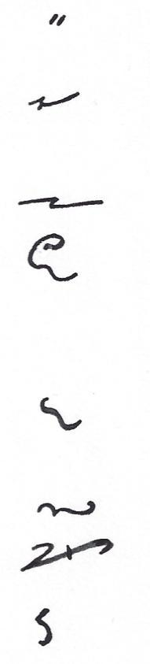

διπλῆ

κράτημα

παρακλητική
παρακάλεσμα

ἕτερον παρακάλεσμα

κύλισμα
ἀντικενωκύλισμα

τρομικόν

Ερμηνεία Γαβριήλ Ιερομονάχου

«Διπλῆ μὲν οὖν οὐ διʼ ἄλλο τι ἢ ἵνα δείξῃ τὸν ψάλλοντα

διπλασιάσαι τὸν χρόνον μεθʼ οὗ ἔκειτο, ἤγουν διὰ
πλείονα ἀργίαν. »
«Τὴν αὐτὴν δὲ δύναμιν ἔχει καὶ τὸ κράτημα, καὶ τοῦτο
γὰρ διʼ ἀργίαν τίθεται. Διαφέρουσι δὲ μόνον κατὰ τὴν
χειρονομίαν.»
«Ἡ δὲ παρακλητικὴ παρακλητικὸν ποιεῖ τὸ μέλος καὶ
ὡσπερεὶ δεόμενον ὁμοίως καὶ τὸ παρακάλεσμα. Καὶ
ὥσπερ ὁ παρακαλῶν μετὰ ἀνειμένης καὶ κεκλασμένης
ποιεῖται τὴν δέησιν φωνῆς, οὕτω καὶ ὁ τὴν
παρακλητικὴν καὶ τὸ παρακάλεσμα ψάλλων οὐ μετὰ
σφοδροῦ τόνου δεῖ τὴν φωνὴν προφέρειν ἀλλὰ ἱλαρῶς.
Καὶ τὸ ἕτερον παρακάλεσμά ἐστιν ἀλλοῖον διαφέρουσι
δὲ μόνον τῷ τὸ παρακάλεσμα ἀργότερα κινεῖν τὴν
φωνήν, τὸ δὲ ἕτερον ταχύτερον.»

«Τὸ δὲ κύλισμα οἱονεὶ κυλίει καὶ στρέφει τὰς φωνάς.»

«Τὸ δὲ ἀντικενωκύλισμά ἐστι σύνθετον ἔκ τε τοῦ

κυλίσματος καὶ τοῦ ἀντικενώματος.»
«τὸ τρομικόν βούλεται δὲ καὶ τοῦτο ὑπόκλονον καὶ
τρέμουσαν σχηματίζειν τὴν φωνήν.»

Παρα-
πομπή

Γαβριήλ
Ιερομό-
ναχος, επιμ.
Hannick/
Wolfram,
στίχοι 303-
307
στ. 308-315

στ. 316
στ. 317-318

στ. 318-319

530

ψηφιστόν

γοργόν
ἀργόν
σταυρός

ὁμαλόν

θεματισμὸς ἔσω

θεματισμὸς ἔξω

θὲς καὶ ἀπόθες

ξηρὸν κλάσμα

ἀργοσύνθετον

γοργοσύνθετον

οὐράνισμα

ἀπόδερμα

χόρευμα

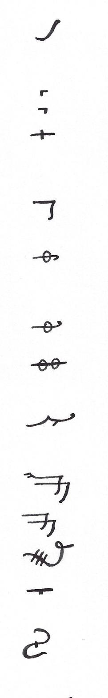

τρομικοπαρακάλεσμα

ψηφιστοπαρακάλεσμα

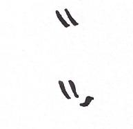

πίασμα

σεῖσμα

«Τὸ δὲ ψηφιστὸν ἐτυμολογεῖται ἀπὸ τοῦ ψηφίζειν καὶ

ἀριθμεῖν τίθεμεν γὰρ τοῦτο ἔνθα εἰσὶν αἱ φωναὶ
κεχωρισμέναι καὶ οὐχ ὁμοῦ λεγόμεναι ἀλλʼ ὥσπερ
μεμετρημέναι.»
«Τὸ δὲ γοργὸν καὶ τὸ ἀργὸν αὐτόθεν εἰσὶ δῆλα ἀπὸ τοῦ
ὀνόματος.»
«Ὁ δὲ σταυρὸς ἀπὸ τῆς σχηματογραφίας σταυρὸς γάρ
ἐστι καὶ ἀπὸ τῆς χειρονομίας εὐλογεῖ γὰρ ὁ τοῦτον
χειρονομῶν σταυροειδῶς ἀπὸ τούτων ἔλαβε τὸ ὄνομα
ἀλλὰ μὴν κεῖται καὶ διʼ ἀργίαν.»
«Τὸ δὲ ὁμαλὸν λεῖον καὶ ὁμαλὸν ποιεῖν δεῖ τὸ μέλος
ἀλλὰ μὴ τραχὺ καὶ ἔντονον παρακελεύεται τοῦτο γὰρ
δηλοῖ τὸ τοῦ ὁμαλοῦ ὄνομα.»
«Ὁ θεματισμὸς ὁ ἔσω καὶ ὁ ἔξω ἀπὸ τῆς
σχηματογραφίας ἔσχον τὴν ἐτυμολογίαν θῆτα γὰρ τὸ
στοιχεῖόν ἐστιν ἑκάτερον καὶ διὰ ταύτης ἄγεται
εὐθείας, ἧς τὸ τέλος εἰ μὲν ἔσω κάμπτει ὁ ἔσω γίνεται
θεματισμός, εἰ δὲ ἔξω ὁ ἔξω. Καὶ δηλοῖ ὁ ἔξω τρεῖς
φωνὰς εἰπεῖν, ὁ δὲ ἔσω δύο.»
«Ὁμοίως καὶ τὸ θὲς καὶ ἀπόθες δύο θῆται εἰσὶν
ἐχόμεναι ὑπὸ μιᾶς γραμμῆς καὶ διὰ τοῦτο θὲς καὶ
ἀπόθες. Δηλοῖ γὰρ θέσιν τοιάνδε ποιεῖν.»
«Τὸ δὲ ξηρὸν κλάσμα ἀπὸ τοῦ κλῶ "τὸ κόπτω" καὶ τοῦ
ξηρὸν "τὸ σκληρόν" ἔνθα γὰρ τίθεται τὸ ξηρὸν
κλάσμα, δεῖ κλᾶν τὴν φωνὴν τραχέως καὶ σκληρῶς.»
«Τὸ δὲ ἀργοσύνθετον ἀργίαν μεγάλην ἐπιφέρει,

στ. 320-322

στ. 323-324

στ. 324-327

στ. 328-330

στ. 331-335

στ. 336-338

στ. 338-340

στ. 341-342

τὸ γοργοσύνθετον δὲ τὸ ἐναντίον, δηλοῖ ταχύτητα
γάρ.»
«Τὸ οὐράνισμα εἰς ὕψος αἴρει τὴν φωνήν, εἴτα
καταβιβάζει ταύτην καὶ διὰ τοῦτο οὐράνισμα.»
«Τὸ δὲ ἀπόδερμα ἀπόδομα μᾶλλον λέγεσθαι ἔδει. Οἶμαι
γὰρ καὶ τοὺς ἀρχαίους οὕτω ὀνομάζειν αὐτό. Εἰς γὰρ
τὰς ἀποδόσεις τίθεται τοῦτο ἀεὶ ἡ δὲ κοινὴ συνήθεια.»
«Χόρευμα καὶ τούτου τὸ ὄνομα ἀπὸ τοῦ σχήματος
λαμβάνεται στρέφεται γὰρ εἰς κύκλον ὥς τις χορός,
εἶτʼ αὗθις ἐπιστρέφει, ὥσπερ δῆτα ποιεῖ ὁ τοῦ χοροῦ
κορυφαῖος ἐν ταῖς θυμηδίαις.»
«Τὸ δὲ παρακάλεσμα μετὰ τρομικοῦ καὶ το
ψηφιστοπαρακάλεσμα εἰσὶ σύνθετα, τὸ μὲν ἐκ
τρομικοῦ καὶ παρακαλέσματος, τὸ δὲ ἐκ ψηφιστοῦ καὶ
παρακαλέσματος.»

«Τὸ πίασμα γίνεται ἀπὸ τοῦ πιέζω "τὸ συνθλίβω"

πιέζειν γὰρ δεῖ καὶ συνθλίβειν τὴν φωνήν, ἔνθα τοῦτο
τεθῇ.
Καὶ γὰρ τὸ σεῖσμα ὁμοίως ἀπὸ τοῦ σείω σείει γὰρ καὶ
τοῦτο καὶ κινεῖ τὴν φωνήν.»

στ. 342-344

στ. 344-346

στ. 347-349

στ. 350-352

στ. 352-356

531

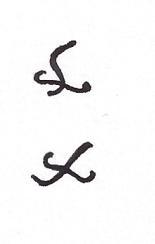

βαρεῖα

ἔναρξις

λύγισμα

σύναγμα

ἐπέγερμα

ἀντικένωμα

ψηφιστοσύναγμα

τρομικοσύναγμα

ἐκτρεπτὸν τρομικόν

θέμα ἁπλοῦν

«Ἡ δὲ βαρεῖα ἀπὸ τοῦ βαρέως καὶ μετὰ τόνου

προφέρειν τὴν φωνήν.»
«Ἡ δὲ ἔναρξις τίθεται ὁπόταν μετὰ συμπλήρωσιν
μέλους καὶ ἤχου τίθεμεν ἔμπροσθεν φωνὴν ἄλλην καὶ
ποιοῦμεν ὥσπερ ἄλλην ἀρχήν διὰ τοῦτο ἔναρξις.»
«Τὸ δὲ λύγισμα ἀπὸ τοῦ λυγίζειν καὶ ἐπίτρομον καὶ
μελῳδικὴν ποιῶν τὴν φωνήν.»
«Τὸ δὲ σύναγμα ἀπὸ τοῦ συνάγειν τὰς διαχωρισμένας
φωνὰς τάς τε ἀνιούσας καὶ κατιούσας εἰς ἕν.»
«Τὸ δὲ ἐπέγερμα ἐπέρχεται ὥσπερ τι χειμάρρου
ὀλίσθημα καὶ ἀποδίδει τὰς φωνάς.»
«Τὸ δὲ ἀντικένωμα εὔδηλον ἔχει τὴν σημασίαν, ἄνω καὶ
κάτω γὰρ κινεῖ τὰς φωνάς.»
«Τὸ δὲ ψηφιστοσύναγμα ἀπὸ τοῦ ψηφίζειν καὶ συνάγειν
εἰς τὴν σύνθεσιν τὰς φωνάς.»

«Καὶ τὸ τρομικοσύναγμα καὶ αὐτὸ ὁμοίως τρέμει καὶ
συνάγει.»
«Τὸ δὲ ἐκτρεπτὸν τρομικὸν ἀπὸ τοῦ πρώτου τρομικοῦ
γίνεται τὸ μὲν γὰρ πρῶτον ἐκφέρει τὴν φωνὴν μετὰ
τρόμου, τούτο δὲ ἀντιστρόφως ποιεῖ.»
«Καὶ τὸ θέμα ἁπλοῦν γίνεται ἀπὸ τῆς θήτας τὸ
στοιχεῖον καὶ ἀπὸ τῆς παρακλητικῆς·l ἐπιφέρει γὰρ τὸ
μέλος εὐθεῖν καὶ παρακλητικόν.»

στ. 356-357

στ. 358-360

στ. 360-361

στ. 361-363

στ. 363-364

στ. 364-366

στ. 366-367

στ. 367-368

στ. 368-371

στ. 371-373

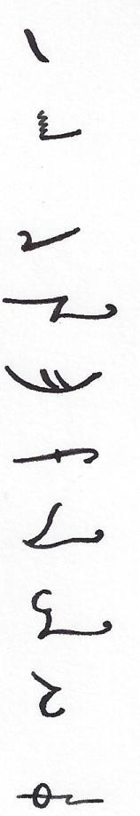

Πίνακας 10.2. Τα μεγάλα σημάδια της όψιμης μεσοβυζαντινής παρασημαντικής (σχήματα από τις λίστες μεγάλων
σημαδιών στο χφο Κωνσταμονίτου 86, φ. 7α-β, 15α-β, 17β-18α, με την προσθήκη λυγίσματος) και οι αντίστοιχες ερμηνείες
τους από το Γαβριήλ Ιερομόναχο, α΄ μισό του 15ου αιώνα.

Είδαμε παραπάνω σχήματα και ετυμολογικές ερμηνείες για τα μεγάλα σημάδια της όψιμης
μεσοβυζαντινής γραφής. Για να προχωρήσουμε βαθύτερα στη μελέτη των μεγάλων σημαδιών, μπορούμε να
εξετάσουμε το κάθε σημάδι ξεχωριστά, σύμφωνα με το τρίπτυχο: γραφικά σχήματα - ονομασίες - μουσικές
σημασίες. Στον Πίνακα 10.3 θα συνεχίσουμε τη μελέτη για τα πρώτα δύο σκέλη, ενώ για τα τρίτος σκέλος
καταχωρούνται στα Παραρτήματα 1 και 2 ένα γλωσσάριο ονομάτων σημαδιών και και ένας αλφαβητικός
κατάλογος θέσεων που αντιστοιχούν σε διάφορα μεγάλα σημάδια και όχι μόνο. Με αυτά τα instrumenta
studiorum o μελετητής θα μπορέσει να συνεχίσει την έρευνά του μέσα σε διάφορα ρεπερτόρια, από
παλαιογραφικής, μορφολογικής, υφολογικής και από άλλες απόψεις.

532

ἀνατρίχισμα-βαρεῖα

Όνομα Παλαιοβυζαντινή σημειογραφία Μεσοβυζαντινή σημειογραφία Νέα Μέθοδος
(* για ονόματα
που υπάρχουν
ήδη στα πβ Αθωνική Αγιοπολίτικη Πρώιμη και Πλήρως εξελιγμένη, όψιμη, εν Των Τριών Διευρυμένη του
θεωρητικά) εξελιγμένη μέρει και εξηγητική Διδασκάλων Καρά

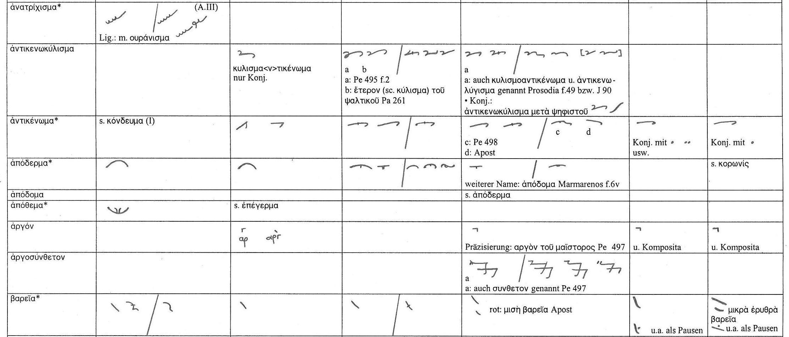

533

Όνομα
(* για ονόματα
που υπάρχουν
ήδη στα πβ
θεωρητικά)

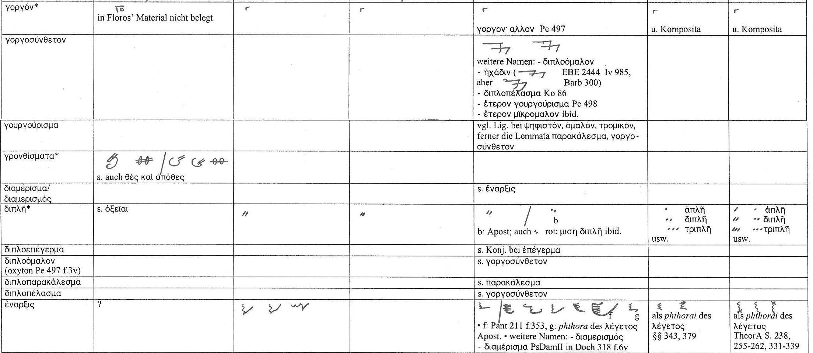

Παλαιοβυζαντινή σημειογραφία

Μεσοβυζαντινή σημειογραφία

Αθωνική Αγιοπολίτικη Πρώιμη και Πλήρως εξελιγμένη, όψιμη, εν
εξελιγμένη μέρει και εξηγητική

γοργόν-ἔναρξις

Νέα Μέθοδος

Των Τριών Διευρυμένη του
Διδασκάλων Καρά

534

Όνομα
(* για ονόματα
που υπάρχουν
ήδη στα πβ
θεωρητικά)

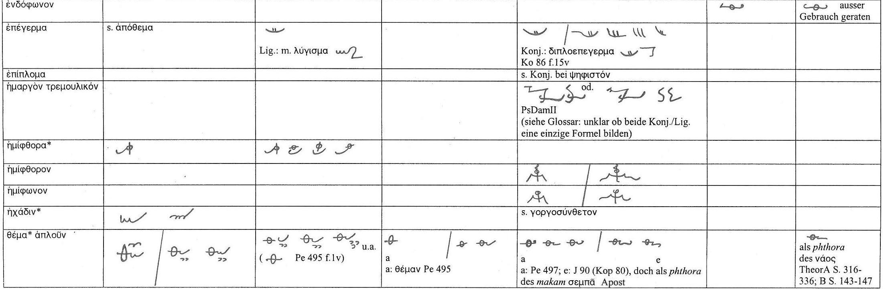

Παλαιοβυζαντινή σημειογραφία

Μεσοβυζαντινή σημειογραφία

Αθωνική Αγιοπολίτικη Πρώιμη και Πλήρως εξελιγμένη, όψιμη, εν
εξελιγμένη μέρει και εξηγητική

ἐνδόφωνον-θεματισμός

Νέα Μέθοδος

Των Τριών Διευρυμένη του
Διδασκάλων Καρά

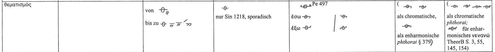

535

θὲς καὶ ἀπόθες - κόνδευμα

Όνομα Παλαιοβυζαντινή σημειογραφία Μεσοβυζαντινή σημειογραφία Νέα Μέθοδος
(* για ονόματα
που υπάρχουν
ήδη στα πβ Αθωνική Αγιοπολίτικη Πρώιμη και Πλήρως εξελιγμένη, όψιμη, εν Των Τριών Διευρυμένη του
θεωρητικά) εξελιγμένη μέρει και εξηγητική Διδασκάλων Καρά

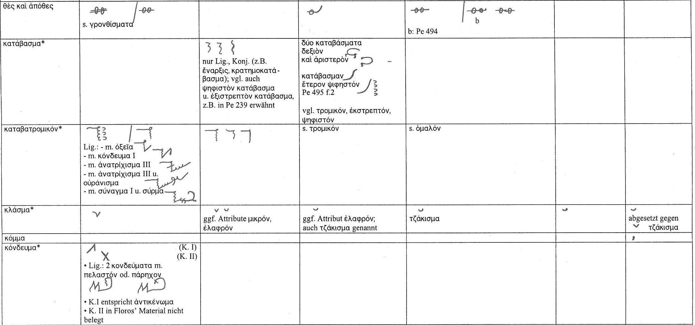

536

κορωνίς - ξηρὸν κλάσμα

Όνομα Παλαιοβυζαντινή σημειογραφία Μεσοβυζαντινή σημειογραφία Νέα Μέθοδος
(* για ονόματα
που υπάρχουν
ήδη στα πβ Αθωνική Αγιοπολίτικη Πρώιμη και Πλήρως εξελιγμένη, όψιμη, εν Των Τριών Διευρυμένη του
θεωρητικά) εξελιγμένη μέρει και εξηγητική Διδασκά-λων Καρά

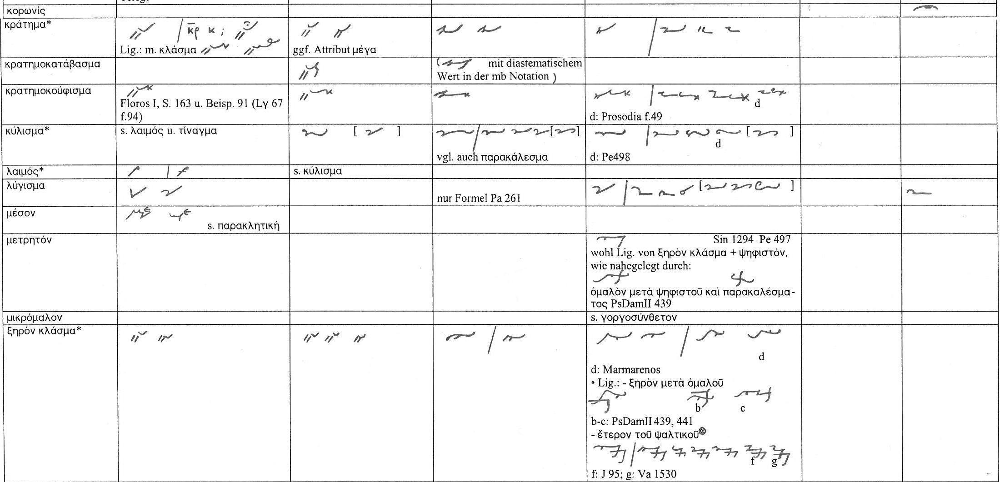
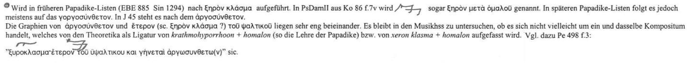

Σημείωση για το ξηρόν κλάσμα:

537

ὁμαλόν - παρακλητική

Όνομα Παλαιοβυζαντινή σημειογραφία Μεσοβυζαντινή σημειογραφία Νέα Μέθοδος
(* για ονόματα
που υπάρχουν
ήδη στα πβ Αθωνική Αγιοπολίτικη Πρώιμη και Πλήρως εξελιγμένη, όψιμη, εν Των Τριών Διευρυμένη του
θεωρητικά) εξελιγμένη μέρει και εξηγητική Διδασκάλων Καρά

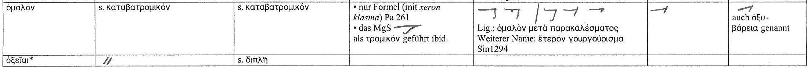
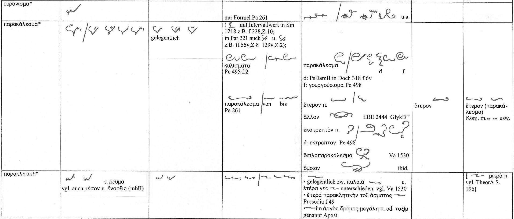

538

πάρηχον - σύναγμα

Όνομα Παλαιοβυζαντινή σημειογραφία Μεσοβυζαντινή σημειογραφία Νέα Μέθοδος
(* για ονόματα
που υπάρχουν
ήδη στα πβ Αθωνική Αγιοπολίτικη Πρώιμη και Πλήρως εξελιγμένη, όψιμη, εν Των Τριών Διευρυμένη του
θεωρητικά) εξελιγμένη μέρει και εξηγητική Διδασκάλων Καρά

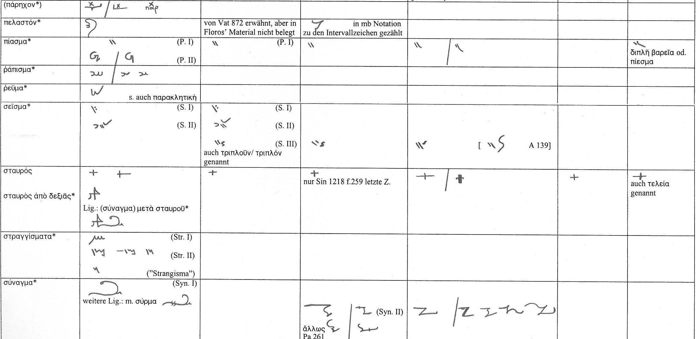

539

τρομικόν - χόρευμα

Όνομα Παλαιοβυζαντινή σημειογραφία Μεσοβυζαντινή σημειογραφία Νέα Μέθοδος
(* για ονόματα
που υπάρχουν
ήδη στα πβ Αθωνική Αγιοπολίτικη Πρώιμη και Πλήρως εξελιγμένη, όψιμη, εν Των Τριών Διευρυμένη του
θεωρητικά) εξελιγμένη μέρει και εξηγητική Διδασκά-λων Καρά

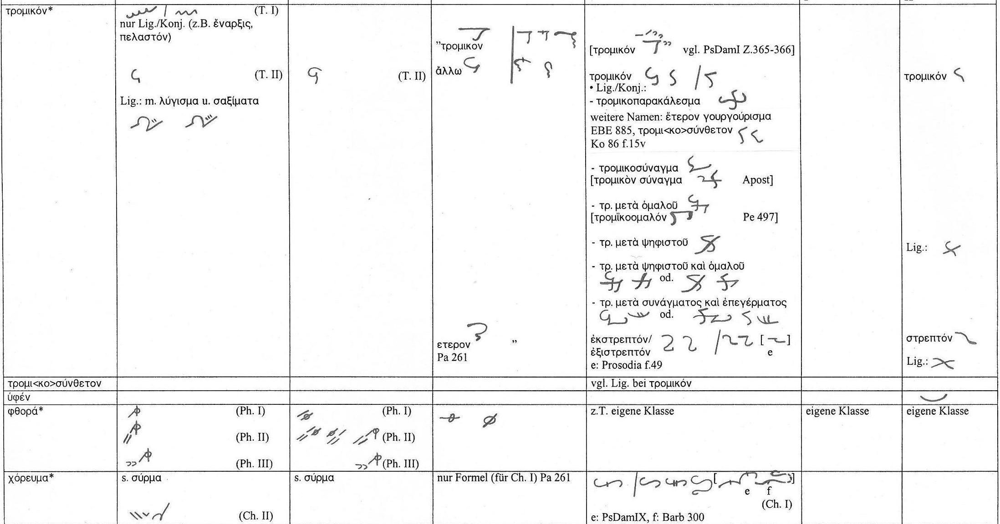

540

ψηφιστόν - ψηφιστοσύνθετον

Όνομα Παλαιοβυζαντινή σημειογραφία Μεσοβυζαντινή σημειογραφία Νέα Μέθοδος
(* για ονόματα
που υπάρχουν
ήδη στα πβ Αθωνική Αγιοπολίτικη Πρώιμη και Πλήρως εξελιγμένη, όψιμη, εν Των Τριών Διευρυμένη του
θεωρητικά) εξελιγμένη μέρει και εξηγητική Διδασκά-λων Καρά

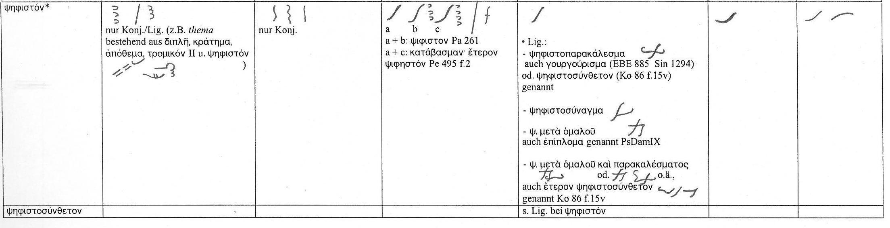

Πίνακας 10.3. Ανιχνεύοντας τη διαχρονική εξέλιξη ονομάτων και γραφικών σχημάτων των μεγάλων σημαδιών από την παλαιοβυζαντινή σημειογραφία μέχρι
σήμερα.li

541

## 5. Ο ρόλος των μεγάλων σημαδιών και επίπεδα στενογραφικότητας στο Παλαιό Σύστημα (Α΄). Μουσικές θέσεις

Είδαμε στον προηγούμενο πίνακα πως μερικά σημάδια είναι παρόντα από την παλαιοβυζαντινή σημειογραφία
μέχρι σήμερα, ενώ τα περισσότερα καταργούνται στο πλαίσιο της Νέας Μεθόδου. Το εξελικτικό στάδιο κατά
το οποίο μπορούμε να επισημάνουμε τα περισσότερα μεγάλα σημάδια είναι εκείνο της όψιμης
μεσοβυζαντινής γραφής. Τα πρώιμα στάδια τόσο της παλαιοβυζαντινής όσο και της μεσοβυζαντινής, αλλά
και η εξηγητική γραφή, χρησιμοποιούν έναν πιο περιορισμένο αριθμό μεγάλων σημαδιών. Αυτές οι
λεπτομέρειες μπορούν να παρατηρηθούν βάσει συστηματικής μελέτης των μουσικών κωδίκων των
αντίστοιχων περιόδων.
Πρέπει να υπογραμμιστεί ότι η παρουσία ενός σημαδιού σε όλα τα εξελικτικά στάδια της
σημειογραφίας δεν συνεπάγεται, αυτόματα, και τη διατήρηση ακριβώς της ίδιας σημασίας του σημαδιού ανά
τους αιώνες. Μπορεί, με άλλα λόγια, ένα γραφικό σχήμα να είναι μεν παρόν από την παλαιοβυζνατινή
σημειογραφία μέχρι σήμερα, η μουσική του σημασία όμως να έχει διαφοροποιηθεί (π.χ. να έχει συρρικνωθεί,
διευρυνθεί ή μετατραπεί) στο διάβα του χρόνου.
Με βάση τη συγκριτική μελέτη παλαιοβυζαντινής και μεσοβυζαντινής σημειογραφίας (πρώιμης μέχρι
και όψιμης), ο Κωνσταντίνος Φλώρος διαπίστωσε ότι:
«Οι περισσότεροι ερευνητές ερμήνευσαν τις υποστάσεις ως εκφραστικά ή βοηθητικά
σημάδια. Αντίθετα, από τις δικές μου έρευνες προέκυψε ότι τα λεγόμενα άφωνα κατά
το μεγαλύτερο μέρος τους είναι παλαιοβυζαντινά σημάδια που κατ' αρχάς
χρησίμευαν ως στενογραφικά σύμβολα για να καταγράψουν δίτονες ή πολύτονες
φιγούρες και αργότερα, κατά τη διαδικασία της εξελικτικής πορείας των
σημειογραφιών, αναλύθηκαν σε μεμονωμένα σημεία. Έτσι πολλά απʼ αυτά έχασαν
την πρωταρχική τους σημασία και σιγά σιγά μεταμορφώθηκαν σε εκφραστικά
σημάδια. Στη μεσοβυζαντινή σημειογραφία μερικά διατήρησαν τη λειτουργία τους
σαν ένα είδος υπόβαθρου ή στηρίγματος ενώ άλλα καταργήθηκαν, επειδή
θεωρήθηκαν περιττά.
Ουσιώδης είναι η εξής παρατήρηση, ότι δηλαδή η μεσοβυζαντινή σημειογραφία, ενώ
χρησιμοποιεί στην αρχή της εξέλιξής της πολύ λίγο μεγάλες υποστάσεις, αντίθετα
στο τέλος της χρησιμοποιεί πάρα πολλές. Μεσοβυζαντινές νευματοποιήσεις του 13ου
αιώνα περιέχουν κατά κανόνα έναν πολύ μικρό αριθμό υποστάσεων. Σε σημειώσεις
από χειρόγραφα του 14ου αιώνα διαπιστώνουμε, αντίθετα μεγαλύτερο αριθμό
υποστάσεων και, τέλος, στις όψιμες βυζαντινές σημειώσεις του 15ου αιώνα
εμφανίζονται με κόκκινο μελάνι τόσες πολλές, ώστε ο αναγνώστης να νομίζει ότι
αυτές αποτελούν το κύριο σημειογραφικό σώμα.» (Φλώρος, 1998, σ. 152-153).lii

Με άλλα λόγια, παρατηρείται ότι τα μεγάλα σημάδια στην παλαιοβυζαντινή, αδιαστηματική
σημειογραφία έχουν ένα υψηλό επίπεδο στενογραφικότητας, υπονοώντας διάφορες μουσικές θέσεις, οι οποίες
περιέχουν τόσο τα βασικά τους διαστήματα όσο και τη μουσική διαμόρφωσή τους, δηλαδή το ρυθμό, τα
ποικίλματα, την έκφραση και το χειρονομικό σχήμα της συγκεκριμένης θέσης.
Στη μεσοβυζαντινή σημειογραφία, το επίπεδο στενογραφικότητας κατεβαίνει εν μέρει και η
σημειογραφία γίνεται διαστηματική. Ως εκ τούτου, το μέγα σημάδι γίνεται άφωνο, δηλαδή χάνει την ιδιότητά
του να υπονοεί και τα βασικά διαστήματα της φόρμουλας. Αυτά συμπληρώνονται πλέον από πάνω, γύρω ή
και από κάτω του μεγάλου σημαδιού, με έμφωνα σημάδια, τα οποία δείχνουν τους δομικούς φθόγγους της
συγκεκριμένης θέσης. Το άφωνο μέγα σημάδι γίνεται κατ' εξοχήν μεγάλη υπόσταση χειρονομίας,
υπενθυμίζοντας στον ψάλτη τη μουσική διαμόρφωση ή εκτέλεση της συγκεκριμένης θέσης και το
χειρονομικό σχήμα της: βλ. Πίνακα 10.4.

542

|Πηγές στιχηραρικού μέλους|Θέση κυλίσματος από την παλαιοβυζαντινή στη|Παρατηρήσεις|
|---|---|---|
| Στο παλαιό, κλασικό βυζαντινό στυλ: - σε παλαιοβυζ. σημειογραφία: ||λαιμός της σημειογραφίας Chartres|
|Αθωνική σημ. (Chartres II: Floros)  Vindobonensis theol. gr. 136, φ. 78α, α΄||κύλισμα της σημειογραφίας Coislin|
|μισό 12ου αι. (Wolfram): Αγιοπολίτικη σημ. (Coislin V: Floros), - σε μεσοβυζαντινή σημειογραφία:  Koυτλουμουσίου 398, φ. 66α, 12ος αι. (Τouliatos): μεταβατική (ανάμεσα σε Coislin VI και πρώιμη μβ; Το συγκεκριμένο χφο χρειάζεται επιπλέον μελέτη).  Δ 13ος αι.||Πάνω στη διπλή οξεία τοποθετήθηκε ένα ίσον, για να προσδιορίσει το διάστημα. Έτσι, η διπλή έγινε άφωνο σημάδι, αφού έχασε τη|
|μεσοβυζαντινή εξελιγμένη ή πλήρως εξελιγμένη γραφή.  Εθνική Βιβλιοθήκη της Ελλάδος 884, φ. 101v-102r, 1430/31, μεσοβυζαντινή πλήρως εξελιγμένη σημ.  Sticherarium Ambrosianum A 139 sup., φ.||Σ' αυτή τη θέση, γνωστή στην Παλαιογραφία και ως μέγα κύλισμα, το σημάδι του κυλίσματος είναι άφωνο, ενώ από πάνω και από κάτω υπάρχουν έμφωνα σημάδια για την καταγραφή των δομικών φθόγγων της φόρμουλας.|
|εξελιγμένη σημ.  καλλωπισμού: Στο στυλ του νέου||Το λεγόμενο μικρό κύλισμα της μεσοβυζαντινής γραφής (σύμφωνα με τον Tillyard: little kylisma), συνήθως γραμμένο με κόκκινο μελάνι, αποτελεί μάλλον μια συντομότερη εκδοχή της θέσης του μεγάλου κυλίσματος, αφήνοντας ίσως και το ενδεχόμενο μιας προαιρετικής εκτέλεσης του μεγάλου κυλίσματος (;).liii Ο τρόπος γραφής του μοιάζει πολύ με το κύλισμα της Coislin σημειογραφίας, με τη διαφορά ότι εδώ επιπλέον|
|- σε όψιμη παρασημαντική:  ΕΒΕ 909, φ. 49β, καλλωπισμός Ανωνύμου. μεσοβυζαντινή 16ος αι. (Σακκελίων),  Λειμώνος 239, φ 45α, έτ. 1672/73, Χρυσάφου του Νέου (Χατζηγιακουμής) και ΕΒΕ 975, σ. 195, έτ. 1774, Γερμανού Νέων Πατρών (Σακκελίων).||Κατά τη μεταβυζαντινή εποχή, την περίοδο της Α΄ Ακμής της βυζαντινής μελουργίας μετά την Άλωση, εμφανίζεται κυρίως το μικρό κύλισμα, εμπλουτισμένο με ένα επιπλέον πίασμα.|

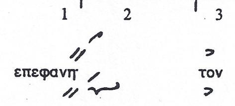
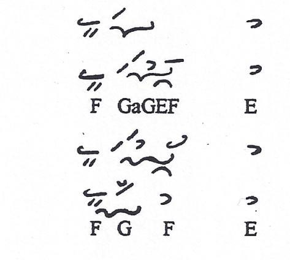
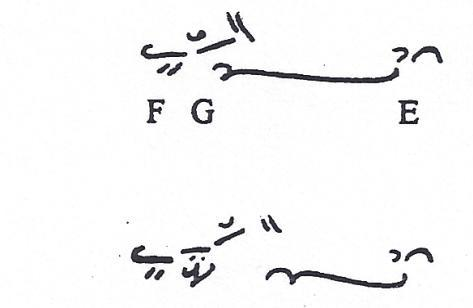

Πίνακας 10.4. Από την παλαιοβυζαντινή στη όψιμη μεσοβυζαντινή σημειογραφία: Η γραφική εξέλιξη της θέσης του
κυλίσματος.liv

Η γνωριμία με τις θέσεις-μελωδικές φόρμουλες οι οποίες αντιστοιχούν σε κάθε μεγάλο σημάδι είναι
καίριας σημασίας για την παλαιογραφική μελέτη. Ο διάσημος μουσικοθεωρητικός και μελουργός Μανουήλ
Δούκας Χρυσάφης ο Λαμπαδάριος (α΄ μισό-γ΄ τέταρτο 15ου αιώνα),lv δίνει τον εξής προσδιορισμό για την
έννοια της θέσης στο πλαίσιο της μεσοβυζαντινής σημειογραφίας:
«Θέσις γὰρ λέγεται ἡ τῶν σημαδίων ἕνωσις, ἥτις ἀποτελεῖ τὸ μέλος
καθὼς γὰρ ἐν τῇ γραμματικῇ τῶν εἰκοσιτεσσάρων στοιχείων ἡ ἕνωσις
συλλαβηθεῖσα ἀποτελεῖ τὸν λόγον, τὸν αὐτὸν τρόπον καὶ τὰ σημεῖα
τῶν φωνῶν ἑνοῦνται ἐπιστημόνως ἀποτελοῦσι τὸ μέλος, καὶ λέγεται τὸ
τοιοῦτον τότε θέσις.»lvi

543

Οι αντιστοιχίες για τις οποίες μιλάει ο Μανουήλ Χρυσάφης σ' αυτόν τον κλασικό προσδιορισμό, θα
μπορούσαν ίσως να γίνουν ακόμα πιο εύληπτες, εάν τις βλέπαμε στον παρακάτω Πίνακα 10.5.

|Τ έ χ ν ε|Γραμματική Ψαλτική|Στοιχεία αλφαβήτου  ενώνονται σε συλλαβές  αποτελούν το ΛΟΓΟ Σημεία των φωνών  ενώνονται με επιστάμενο τρόπο σε θέσεις  αποτελούν το ΜΕΛΟΣ|
|---|---|---|

ς

Πίνακας 10.5. Ο προσδιορισμός της έννοιας της «θέσης» από το Μανουήλ Χρυσάφη, σε σχηματική μορφή.

## 6. Το Μέγα Ίσον του Αγίου Ιωάννου του Κουκουζέλη. Επίπεδα στενογραφικότητας στο Παλαιό Σύστημα (Β΄)

Το κατ' εξοχήν διδακτικό ποίημα των θέσεων του παλαιού και καλοφωνικού ρεπερτορίου σε όψιμη
μεσοβυζαντινή παρασημαντική, είναι το λεγόμενο Μέγα Ίσον του Αγίου Ιωάννου του Κουκουζέλη (περ.
1270-πριν το 1340),lvii του κορυφαίου εκφραστή της βυζαντινής Καλοφωνίας.
Περιέχει εξήντα πέντε θέσεις, οι οποίες ψέλνονται με κείμενο το ίδιο το όνομά τους. Η μέθοδος αυτή
αναγνωρίστηκε από τους ερευνητές ως ένα χρυσό κλειδί για την παλαιογραφική μελέτη της παλαιοβυζαντινής
και μεσοβυζαντινής σημειογραφίας και, ταυτόχρονα, για τη μουσικολογική ανάλυση του παλαιού και του
καλοφωνικού ρεπερτορίου, καθώς επιτρέπει την άμεση αναγνώριση θέσεων και ως εκ τούτου, την κατανόηση
της δομής των κομματιών σε μικροσυντακτικό επίπεδο.lviii
Μελετητές όπως oι K. Ψάχος (1978, πίν. ιθ΄: αντιπαραβολή ποιήματος σε μεσοβυζαντινή όψιμη και
εξηγητική γραφή, με την εξήγηση στη Νέα Μέθοδο), O. Strunk (χειρόγραφες αντιπαραβολές παλαιών
πηγών),lix G. Dévai (1955: έκδοση), E. Tončeva (1974: συγκριτική παλαιογραφική μελέτη), C. Floros (1970,

τ. ΙΙΙ: χρήση θέσεων για μελέτη της παλαιοβυζαντινής και παλαιοσλαβικής σημειογραφίας), Γρ. Στάθης

(1997: σχολιασμός ρεπερτορίου θέσεων σε σχέση με το παλαιό Στιχηράριο), Chr. Troelsgård (1997: σύγκριση
με το Μέγα Ίσον Ιωάννου του Γλυκέος), B. Karastoyanov (2007: μουσικολογική ανάλυση), π. Σπυρίδων
Αντωνίου (2008, σ. 330-363: πίνακας με αντιπαραβολή πηγών και επισήμανση των θέσεων, για διδακτικούς
σκοπούς) κ.ά. ασχολήθηκαν με αυτό το ποίημα, και η σειρά των μελετητών συνεχίζεται μέχρι σήμερα.
Στις Εικόνες 10.14.α-δ φαίνεται το πιο παλιό χρονολογημένο αντίγραφο αυτού του περίφημου
ποιήματος, από το χειρόγραφο Ἀκολουθίαι ΕΒΕ 2458, του έτους 1336, το οποίο αποτελεί την πρώτη
χρονολογημένη Παπαδική, μια νέα για την εποχή εκείνη μουσική συλλογή, δημιουργός-συντάκτης της οποίας
υπήρξε ο ίδιος ο Άγιος Ιωάννης ο Κουκουζέλης. Το ποίημα είναι οκτάηχο: ξεκινάει στον ήχο α΄ και μετά
περνάει σε όλους τους υπόλοιπους ήχους (πρώτα στους κύριους, ύστερα στους πλάγιους, με τη σειρά),
επιστρέφοντας στο τέλος πάλι στον α΄ ήχο.

544

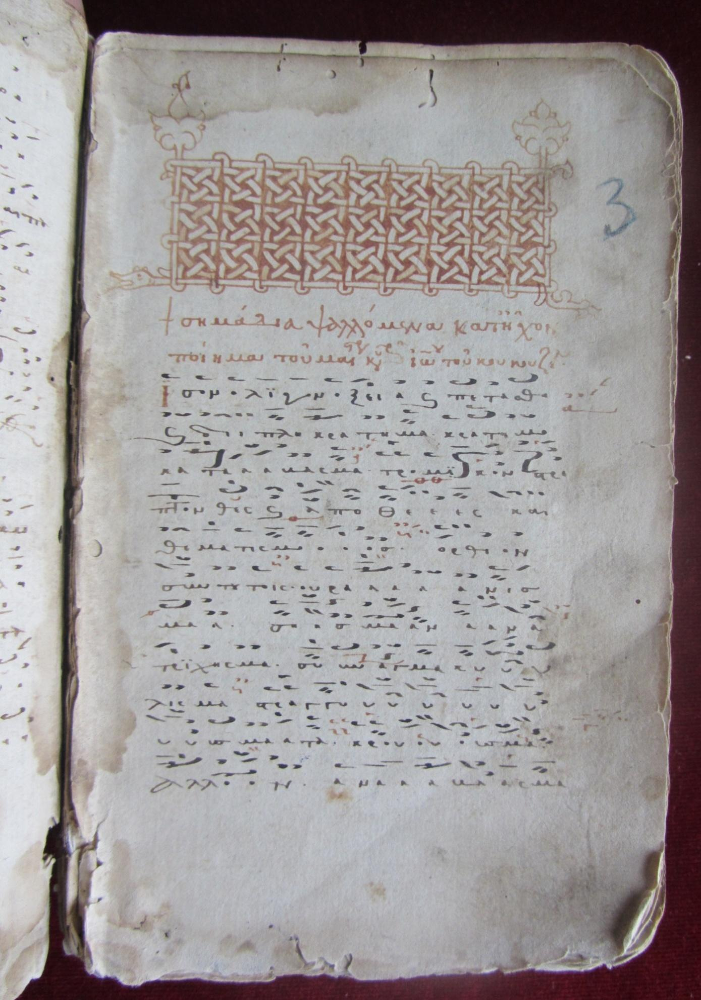

Εικόνα 10.14.α. Σημάδια ψαλλόμενα κατ' ἦχον, ποίημα τοῦ μαΐστ(ο)ρ(ος) κυρ(οῦ) Ἰω(άνν)ου τοῦ
Κουκουζέλ(η), ἦχος α΄: ΕΒΕ 2458, φ. 3r, έτ. 1336, σε όψιμη μεσοβυζαντινή σημειογραφία.

© Εθνική Βιβλιοθήκη της Ελλάδος, Αθήνα.

545

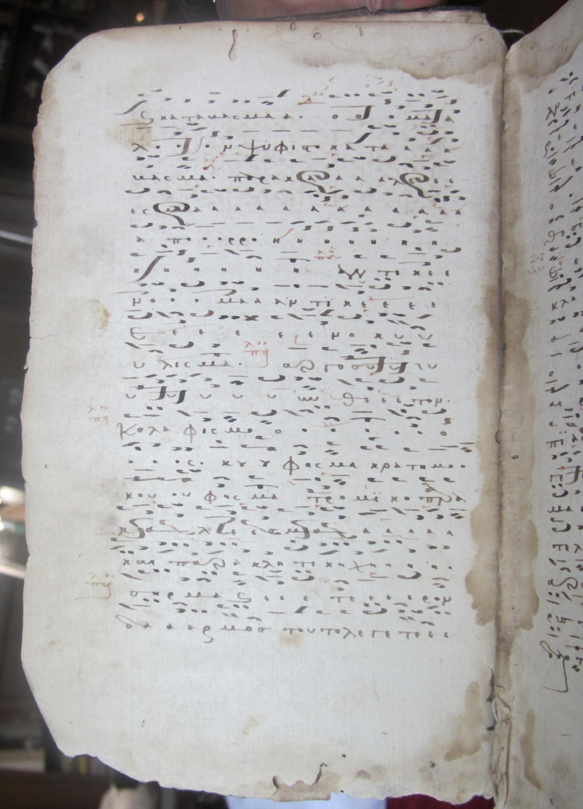

Εικόνα 10.14.β. Συνέχεια του Μεγάλου Ίσου από το χφο ΕΒΕ 2458, φ 3v. © Εθνική Βιβλιοθήκη της Ελλάδος, Αθήνα.

546

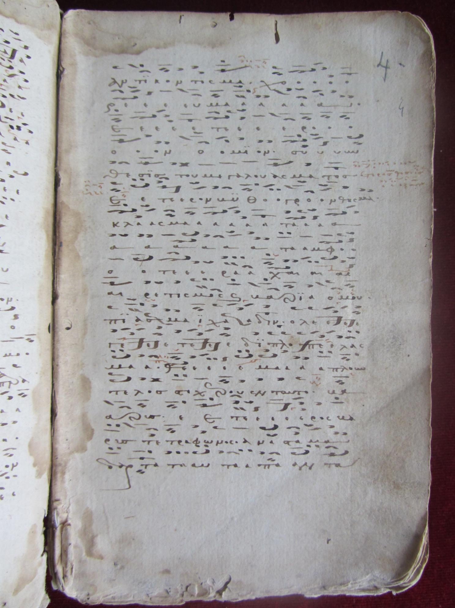

Εικόνα 10.14.γ Συνέχεια του Μεγάλου Ίσου από το χφο ΕΒΕ

φ. 4r. © Εθνική Βιβλιοθήκη της Ελλάδος, Αθήνα.

2458,

547

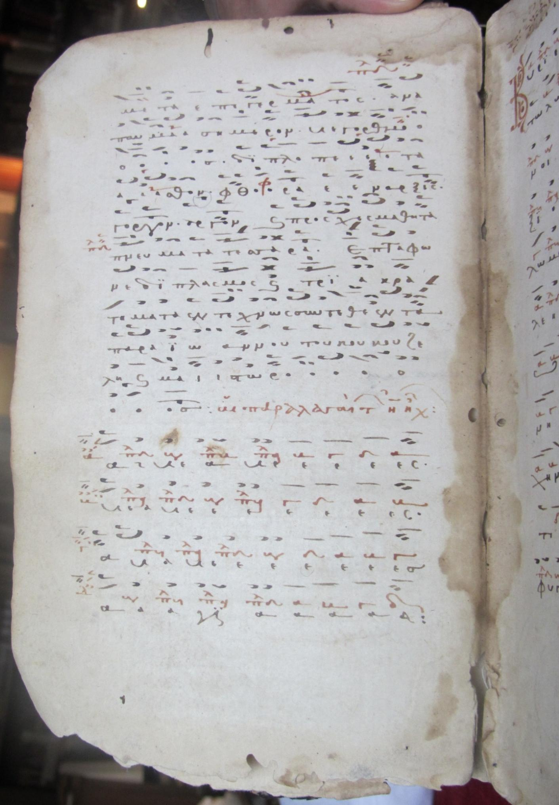

2458, φ. 4v.lx © Εθνική Βιβλιοθήκη της Ελλάδος,

Εικόνα 10.14.δ Συνέχεια και τέλος του Μεγάλου Ίσου από το χφο
Αθήνα.

ΕΒΕ

548

Το Μέγα Ίσον του Αγίου Ιωάννου του Κουκουζέλη αντιγράφηκε μέσα στους αιώνες, σε μεγάλο
αριθμό Προθεωριών της Παπαδικής, μέχρι τις αρχές του 19ου αιώνα, όταν εξηγήθηκε στη Νέα Μέθοδο από το
Χουρμούζιο Χαρτοφύλακα και το Ματθαίο Βατοπαιδινό. Η εξήγηση του πρώτου πέρασε και στην έντυπη
παράδοση.
Μια συγκριτική μελέτη του Μεγάλου Ίσου σε διάφορες φάσεις της εξέλιξης της βυζαντινής
παρασημαντικής (Ι.Α. μεσοβυζαντινή όψιμη, με λιγότερα ή περισσότερα μεγάλα σημάδια, Β. προς τα τέλη
του 18ου αιώνα εξηγητική του Πέτρου Πελοποννησίου, και ΙΙ. αρχές του 19ου αιώνα στη Νέα Μέθοδο),
φανερώνει τα επόμενα επίπεδα στενογραφίας της μεσοβυζαντινής σημειογραφίας και την πορεία της προς την
ολοένα και αναλυτικότερη καταγραφή του μέλους, μέσα από τη διαδικασία της αργής εξήγησης. Η τέχνη της
εξήγησης μας οδηγεί και προς το ζητούμενο της όλης μελέτης, το οποίο είναι το ΜΕΛΟΣ, δηλ. το ηχητικό
αποτέλεσμα των αντίστοιχων βυζαντινών θέσεων. Μερικά παραδείγματα έπονται στις επόμενες Εικόνες

10.15-10.17.

549

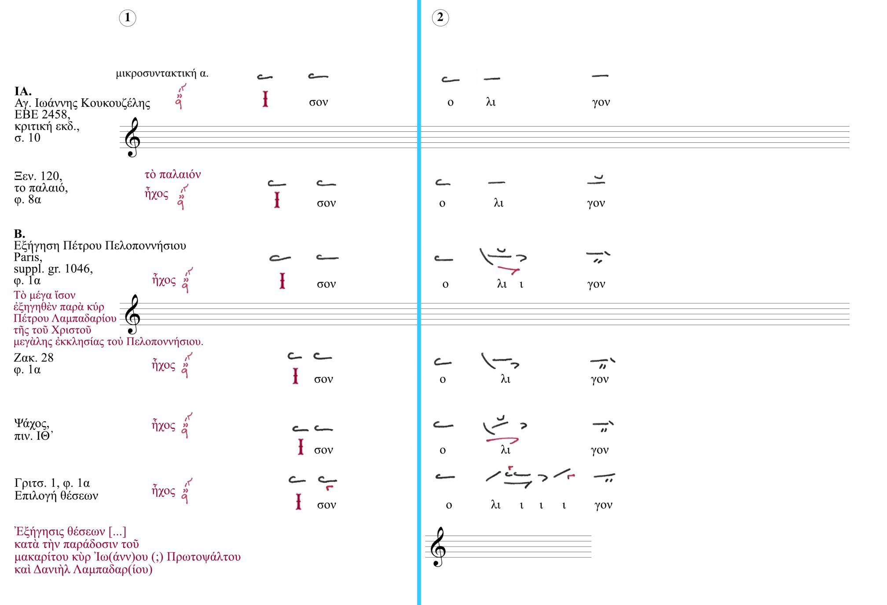

Εικόνα 10.15.α. Αντιπαραβολή πηγών του Μεγάλου Ίσου του Αγ. Ιωάννου του Κουκουζέλη: πηγές στην Παλαιά Μέθοδο, για τις θέσεις 1-2.
550

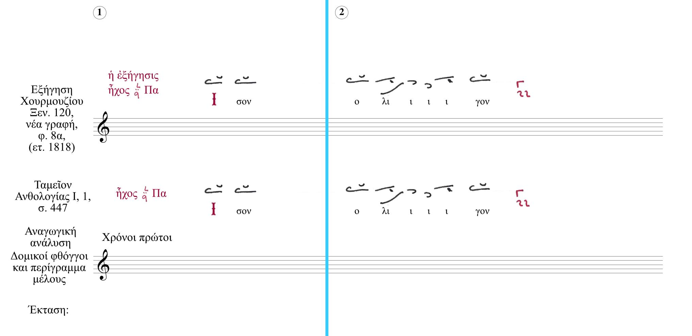

Εικόνα 10.15.β. Συνέχεια της αντιπαραβολή πηγών του Μεγάλου Ίσου του Αγ. Ιωάννου του

Κουκουζέλη: πηγές στη Νέα Μέθοδο, για τις θέσεις 1-2.

551

-  Μπορείτε να δοκιμάσετε τη συμπλήρωση των πενταγράμμων, στην Εικόνα 10.15.α. με μεταγραμματισμό, και στην Εικόνα 10.15.β. με μεταγραφή, συνδυάζοντας αυτήν την άσκηση από ψάλσιμο των θέσεων αυτών.

Προαιρετικά, μπορείτε να δοκιμάσετε και τα εξής:

 Μικροσυντακτική ανάλυση: Συμπληρώστε πάνω στα σημαδόφωνα τις Παλαιάς Μεθόδου και ενδεχομένως και της Νέας Μεθόδου, τα ονόματα των

αντίστοιχων θέσεων.

 Αναγωγική ανάλυση για την εξήγηση: Συμπληρώστε τους πιο σημαντικούς φθόγγους (δομικούς φθόγγους) της μελωδικής ροής στο δεύτερο πεντάγραμμο

της Εικόνας 10.15.β με νότες χωρίς γέμισμα σε ρομβική μορφή, και με μαύρα ρομβάκια τα άκρα της κάθε μελωδικής καμπύλης. Οι νότες ενώνονται με λοξή
γραμμή όταν η κίνηση μεταξύ τους είναι βήμα-βήμα, χωρίς πηδήματα. Επίσης, δομικοί φθόγγοι που επαναλαμβάνονται περισσότερες φορές στην ίδια φράση
μπορούν να ενωθούν με διακεκομμένο legato. Πάνω από εκείνο το πεντάγραμμο μπορείτε να προσθέσετε και τον αριθμό χρόνων πρώτων για κάθε συλλαβή,
και από κάτω την έκταση στην οποία κινείται η εξήγηση (μετρημένη σε φωνές), πάλι ανά συλλαβή.

Μετά, μπορείτε να συγκρίνετε τις λύσεις σας με όσα υπάρχουν στις Εικόνες 10.15.γ-δ.

552

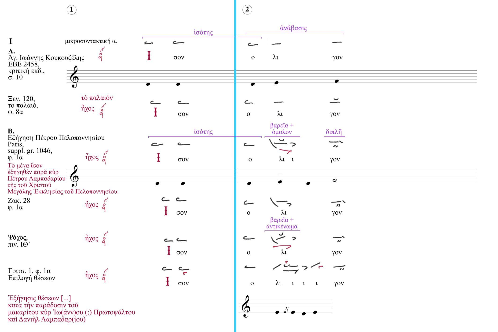

Εικόνα 10.15.γ. Αντιπαραβολή πηγών του Μεγάλου Ίσου του Αγ. Ιωάννου του Κουκουζέλη: πηγές στην Παλαιά Μέθοδο, για τις θέσεις 1-2, με μεταγραμματισμό.
553

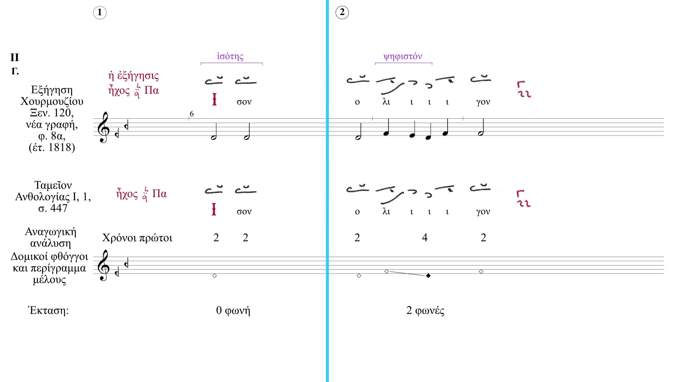

Τα ακούτε πατώντας 
Εικόνα 10.15.δ. Συνέχεια της αντιπαραβολής πηγών του Μεγάλου Ίσου του Αγ. Ιωάννου του Κουκουζέλη: πηγές στη Νέα Μέθοδο, για τις θέσεις 1-2, με σχηματικές μεταγραφές
και αναγωγική ανάλυση.

554

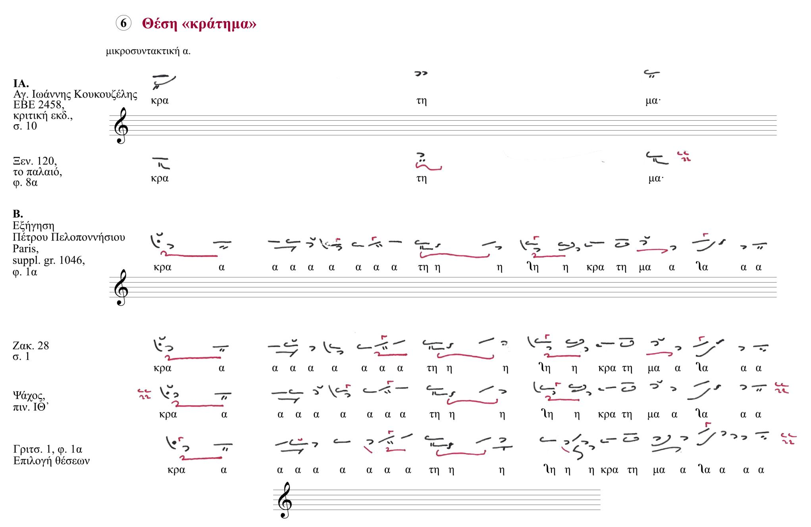

Εικόνα 10.16.α. Αντιπαραβολή πηγών του Μεγάλου Ίσου του Αγ. Ιωάννου του Κουκουζέλη: πηγές στην Παλαιά Μέθοδο, για τη θέση 6.
555

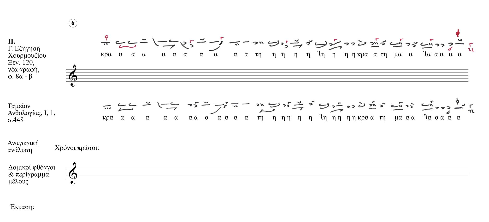

Εικόνα 10.16.β. Συνέχεια της αντιπαραβολή πηγών του Μεγάλου Ίσου του Αγ. Ιωάννου του Κουκουζέλη: πηγές στη Νέα Μέθοδο, για τη θέση 6.

556

-  Μπορείτε να δοκιμάσετε τη συμπλήρωση των πενταγράμμων, στην Εικόνα 10.16.α. με μεταγραμματισμό, και στην Εικόνα 10.16.β. με μεταγραφή, συνδυάζοντας αυτήν την άσκηση από ψάλσιμο αυτής της θέσης.

Προαιρετικά, μπορείτε να δοκιμάσετε και τα εξής:

 Μικροσυντακτική ανάλυση: Συμπληρώστε πάνω στα σημαδόφωνα τις Παλαιάς Μεθόδου και ενδεχομένως και της Νέας Μεθόδου, τα ονόματα των

αντίστοιχων θέσεων.

 Αναγωγική ανάλυση για την εξήγηση: Συμπληρώστε τους πιο σημαντικούς φθόγγους (δομικούς φθόγγους) της μελωδικής ροής στο δεύτερο πεντάγραμμο

της Εικόνας 10.16.β με νότες χωρίς γέμισμα σε ρομβική μορφή, και με μαύρα ρομβάκια τα άκρα της κάθε μελωδικής καμπύλης. Οι νότες ενώνονται με λοξή
γραμμή όταν η κίνηση μεταξύ τους είναι βήμα-βήμα, χωρίς πηδήματα. Επίσης, δομικοί φθόγγοι που επαναλαμβάνονται περισσότερες φορές στην ίδια φράση
μπορούν να ενωθούν με διακεκομμένο legato. Πάνω από το ίδιο πεντάγραμμο μπορείτε να συμπληρώσετε τον αριθμό χρόνων πρώτων για κάθε συλλαβή, και
από κάτω την έκταση στην οποία κινείται η εξήγηση (μετρημένη σε φωνές), πάλι ανά συλλαβή.

Μετά, μπορείτε να συγκρίνετε τις λύσεις σας με όσα υπάρχουν στις Εικόνες 10.16.γ-δ.

557

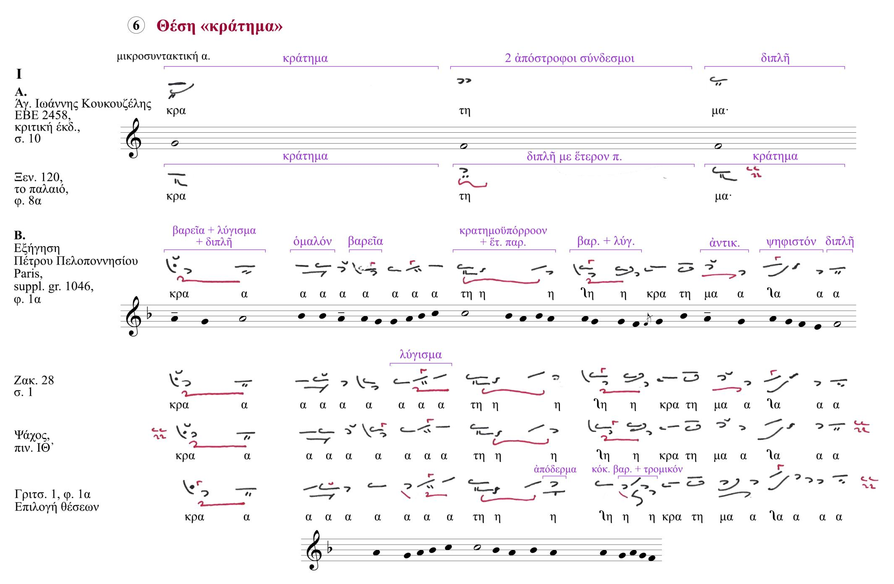

Εικόνα 10.16.γ. Αντιπαραβολή πηγών του Μεγάλου Ίσου του Αγ. Ιωάννου του Κουκουζέλη: πηγές στην Παλαιά Μέθοδο, για τη θέση 6, με μεταγραμματισμό.
558

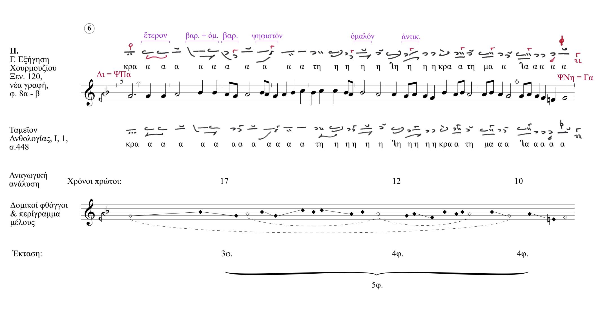

Τα ακούτε πατώντας  
Εικόνα 10.16.δ. Συνέχεια της αντιπαραβολής πηγών του Μεγάλου Ίσου του Αγ. Ιωάννου του Κουκουζέλη: πηγές στη Νέα Μέθοδο, για τη θέση 6, με σχηματική μεταγραφή και
αναγωγική ανάλυση.

559

Στην αρχή της θέσης του κρατήματος, η εξήγηση φανερώνει και μια μετάθεση του α΄ ήχου, μια
τριφωνία ψηλότερα. Για να βρούμε τον οπλισμό που αναλογεί στο transporto το οποίο θα φανεί στη
μεταγραφή, μπορούμε να ακολουθήσουμε τα παρακάτω: βλ. Εικόνες 10.17-18.

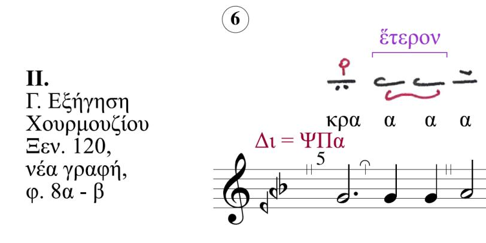

Εικόνα 10.17. Η αρχή της εξήγησης του Χουρμουζίου για τη θέση του κρατήματος, όπου φαίνεται το σημείο εκκίνησης της
μετάθεσης του α΄ ήχου από το Πα στο Δι (απόσπασμα από την Εικόνα 10.16.δ).

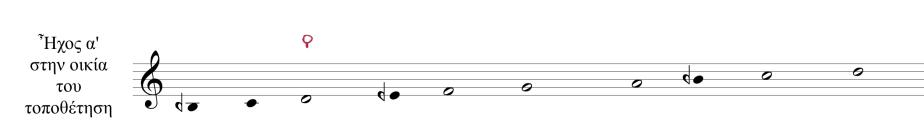
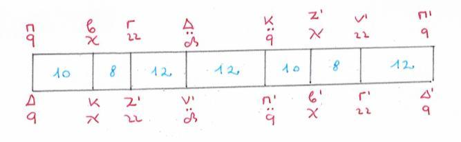

10 8 12

12 10 8 12

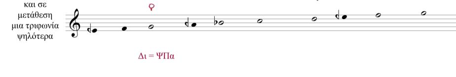

Εικόνα 10.18. Διπλό κανόνιο δείχνοντας τον α΄ ήχο στην οικεία του θέση και σε μετάθεση, μαζί με μεταγραφή στο
πεντάγραμμο, όπου φαίνεται πως προέκυψε ο καινούργιος οπλισμός ο οποίος χρησιμοποιήθηκε στο παράδειγμα της
Εικόνας 10.17.

Η μετάθεση αυτή στο Παλαιό Σύστημα θα εκφραζόταν μέσα από τη διαδικασία της
διπλοπαραλλαγής: βλ. Εικόνα 10.19.

560

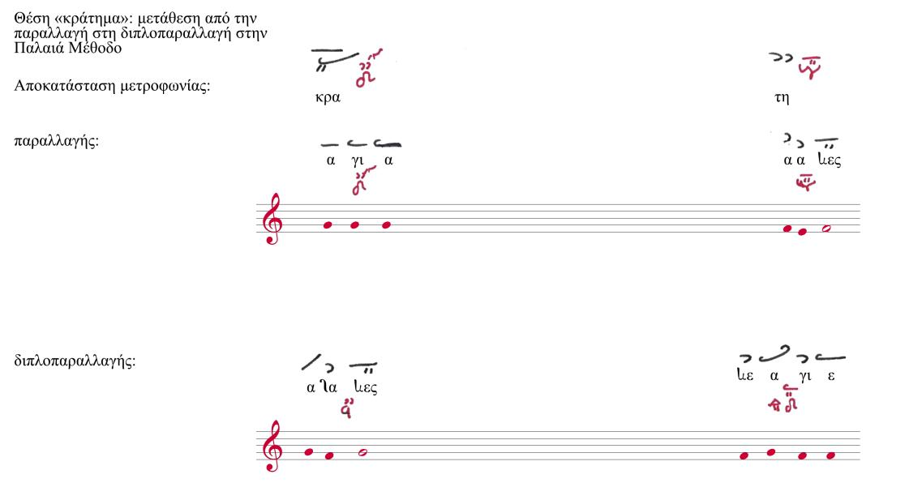

Εικόνα 10.19. Η αρχή της θέσης «κράτημα» από το Μέγα Ίσον του Αγίου Ιωάννου του Κουκουζέλη: αποκατάσταση

μετροφωνίας, παραλλαγής και διπλοπαραλλαγής, με αφετηρία αναζήτησης την αργή εξήγηση του Χουρμουζίου.

Απ' όλα τα παραπάνω μπορούμε να συμπεράνουμε ότι το Μέγα Ίσον είναι ένα σημαντικό βοήθημα
για την παλαιογραφική μελέτη γενικότερα, καθώς:

• Αποτελεί σημείο αναφοράς για τη γνωριμία με τις μελωδικές φόρμουλες-θέσεις σε μεσοβυζαντινή

σημειογραφία και

• δίνει τη δυνατότητα πολλαπλών συγκρίσεων με τις αντίστοιχες θέσεις σε πρακτικές πηγές όλων των

εξελικτικών φάσεων της βυζαντινής παρασημαντικής, αναδεικνύοντας και τους διάφορους βαθμούς
στενογραφικότητας της Παλαιάς Μεθόδου:

-  υψηλού βαθμού στην παλαιοβυζαντινή σημειογραφία,

-  μεσαίου βαθμού στη μεσοβυζαντινή πρώιμη μέχρι και όψιμη σημειογραφία, και

-  ολοένα και χαμηλότερου βαθμού στην εξηγητική μβ γραφή.

Παράλληλα με τη διαχρονική διαβάθμιση του επιπέδου στενογραφικότητας της σημειογραφίας, ο
τρόπος κωδικοποίησης μπορεί όμως να αλλάζει και συγχρονικά, δηλ. την ίδια εποχή να γίνει πιο αναλυτική
καταγραφή για τα σύντομα μέλη και πιο στενογραφική για τα αργά μέλη. Αυτό το θέμα θα μας αποσχολήσει
και στο κεφ. 11 της παρούσης εργασίας.

561

## 7. Μερικά άλλα instrumenta studiorum: ένα γλωσσάριο ονομάτων σημαδιών και θέσεων, και ένας κατάλογος θέσεων

Στις προηγούμενες ενότητες είδαμε αρκετές λεπτομέρειες για διάφορα σχήματα και ονόματα μεγάλων
σημαδιών και θέσεων. Εάν θελήσουμε να εμβαθύνουμε ακόμα περισσότερο στα θέματα των μεγάλων
σημαδιών και των θέσεων, θα μπορέσουμε να το κάνουμε ακολουθώντας τη μέθοδο συνδυαστικής μελέτης
των ονομάτων των σημαδιών, των γραφικών τους σχημάτων και της μουσικής τους σημασίας: βλ.Εικόνα

1.

Γραφικά
σχήματα

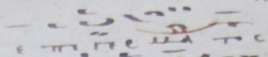

Ονόματα

Μουσική
σημασία

Εικόνα 10.20. Το τρίπτυχο της παλαιογραφικής μελέτης, σύμφωνα με τον Κωνσταντίνο Φλώρο (ονοματολογική,
παλαιογραφική και σημασιολογική εξέταση).lxi Στη μέση είναι, ως παράδειγμα, το επέγερμα από το Μέγα Ίσον του Αγίου
Ιωάννου του Κουκουζέλη (ΕΒΕ 2458, φ. 4v).

Παραδείγματος χάριν, μια τέτοια μελέτη για το επέγερμα

 θα ξεκινούσε από την αναζήτηση της ετυμολογίας και της σημασίας της λέξης επέγερμα και τη

σύγκριση θεωρητικών κειμένων,

-  θα προχωρούσε στην αναζήτηση των γραφικών του σχημάτων σε διαχρονική βάση,

-  και θα αναζητούσε τις διάφορες μορφές της θέσης του μέσα σε βυζαντινές μεθόδους χειρονομίας.

Σε μια δεύτερη φάση, η μελέτη του επεγέρματος θα μπορούσε να επεκταθεί με τη σύγκριση της θέσης
αυτής σε πρακτικές πηγές, μέσα σε διάφορα ρεπερτόρια και διάφορες εποχές.
Πιο συγκεκριμένα, η προκαταρκτική μελέτη του επεγέρματος θα μπορούσε να πάρει την εξής μορφή:

### Α. Ετυμολογία και λεκτικές ερμηνείες μουσικοθεωρητικών

ἐπέγερμαlxii

 Όνομα στην παλαιοβυζαντινή αθωνική σημειογραφία: ἀπόθεμα.

Σπάνια ονομασία: ὑπέγερμα (Petropolitanus RAIC 63, φ. 51β: Gertsman, Theoreticon, 483).

 Σημασία: - ἐπέγερμα, τό: [ἐπεγείρω: awaken LSJ ǁ ἐπεγερμός, ὁ:

ένδειξη Εἴτα ψάλλομεν τὸ Τροπάριον ἀργῶς καὶ μεγαλοφώνως, καὶ μετὰ
Ἐξεγερτικόν, εἰς τὸ Ἀλληλούϊα. Ἦχος πλ. δ΄ Ἰδού, ὁ Νυμφίος ἔρχεται TR],

- ὑπέγερμα, τό: [ὑπεγείρω: rouse gradually LSJ],

- ἀπόθεμα, τό: τὸ ν΄ ἀποθέτῃ τις φερόμενον βάρος HistLex | thing stored away

πέρας, κατάπαυσις ᾄσματος, ἐπῳδὸς ᾄσματος HistLex.

 Πιθανοί συσχετισμοί: - Για το ἐπέγερμα: Γραμματική: [ἐγείρω (τὸν τόνον): λατ. accentu acuto signare Béc].

excitement L ǁ βλ. και την
μέλους ἐξ ἰσότητος.

LSJSuppl96 | κρητ.

562

Ρητορική: [ἐπεγείρειν, intendere, vehementius reddere Ernest ǁ διεγείρειν, excitare, commovere auditorem,

quod fit verbis et sententiis splendidis et gravibus. DHLys 28. - διεγείρειν φράσιν, attolere elocutionem, den Ausdruck heben, einen
Schwung geben, wodurch er sich über den gewöhnlichen, alltäglichen Vortrag erhebt. DHPomp 3. σ. 779: Ernest].
Moυσική: [κατὰ τὰς ἐν ἁρμονίᾳ μεταβολὰς τὸ αὐτὸ μέγεθος, ἐν μὲν τοῖς ὀξυτέροις τόνοις τρέπεται
πρὸς τὸ διεγερτικώτερον, ἐν δὲ τοῖς βαρυτέροις πρὸς τὸ κατασταλτικώτερον "Derselbe Tonumfang ruft in den höheren
Tonarten einen aufmunternden Eindruck, in den tieferen aber einen verstimmenden hervor" PtolHarm 99, 17-10 και Düring 123 ǁ ἐν
μὲν γὰρ τοῖς μουσικοῖς ἕνα τῶν αὐλητικῶν νόμων ἱππόθορον ἐκάλουν, μέλος τι τοῖς ἵπποις ὁρμῆς ἐπεγερτικὸν ὡς
ἔοικεν PluMoralia I 238, στ. 12-14: Steph σ. 138: TLG].

- Για το ἀπόθεμα: Ρητορική και Μετρική: [ἀπόθεσις κώλου, περιόδου close or cadence of a phrase...; so in metres =

κατάληξις LSJ | ἀπόθεσις ap. Rhett. dicitur in pronuntiatione, cum vox, quae ἄρσει sublata fuerat, θέσει deponitur in fine membri.
DemetrEloc 19: StephLondon | Hesychio ἀπόθεσις est ἀπόδοσις, quae itidem in periodo est. ibid.].

 Θεωρητικά:  Μαρτυρίες: πβ Chartres (ἀπόθεμα), (Coislin: μόνο σε μουσικά χφα), μβ  πίνακα

σημαδιών και κατάλογο θέσεων.

 Ερμηνείες: - Για ἐπέγερμα: Τὸ δὲ ἐπέγερμα ἐπέρχεται ὥσπερ τι χειμάρρου

ὀλίσθημα καὶ ἀποδίδει τὰς φωνάς. Γαβριήλ 363-364 ǁ τοῦτο τὸ σχῆμα μετατρέπει κάθε
φθόγγον εἰς νανα Aποστ. σε Αποστολόπουλος σ. 117 ǁ αναφέρεται σε σχέση με την ἐκλογὴ ἀρίστων
(επιλογή συγκεκριμένων λέξεων ενός τροπαρίου, για ιδιαίτερη προβολή μέσα από τη μελοποίηση, με
αναφορά στο νόημα του κειμένου και χρησιμοποιώντας εκτενείς θέσεις όπως παρακλητικής,
παρακαλέσματος, χορεύματος, ουρανίσματος, επεγέρματος, θεματισμού έσω και έξω κ.ά., θέσεις για τις
οποίες ο Χουρμούζιος είχε ιδιαίτερο Σημειωματάριο) ΦιλόξΛεξ 72-73.

- Για ἀπόθεμα: [ὡς ἐπὶ τὸ πλεῖστον δὲ τὰ πληρώματα καὶ αἱ ἀποθέσεις τοῦ δευτέρου ἤχου εἰς

ἦχον πλ.β΄ ἀποδίδονται cadences and endings ΑγιοπολR § 48, 12-15 και σ. 54].

 Εξήγησις: Ἡ τρίτη τάξη τῶν σημείων· ἔχει ἕκαστον τούτων φωνὰς τέσσαρας·

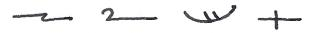

δύο ἀνιούσας καὶ δύο κατιούσας. Εἰσὶ δὲ ταῦτα:
Καὶ ἡ μὲν παρακλητικὴ καὶ λύγισμα δουλεύονται μὲ δύο τρόπους, ἀργοῦ τε καὶ γοργοῦ· τὸ δὲ
ἐπέγερμα καὶ σταυρὸς μὲ μόνον τρόπον... τὸ ἐπέγερμα (sc. ποιεῖ τὰς φωνὰς) ταύτας:
Απόστ. σ. 66-67: πρβλ. και ΑνώνΞηροπ357 σ. 69 | Ἐκ τούτων (i.e. τῶν μεγάλων σημαδίων) μερικὰ
εἶχον τὴν δύναμιν τοῦ νὰ ἐκτείνωσι τὰ μέλη εἰς μεγάλας γραμμάς, ὡς ἡ Παρακλητική, τὸ
Σύναγμα, τὸ Οὐράνισμα, τὸ Ἐπέγερμα καὶ ἄλλα τινά ΦιλόξΘεωρ § 258 | ἡ δὲ ἐνέργεια αὐτοῦ

(i.e. τοῦ ἐπεγέρματος) φέρει μελῳδικὴν γραμμὴ λήγουσαν πάντοτε εἰς ἁρμονικὴν θέσιν,

ὁριστικῆς καὶ ἀορίστου καταλήξεως, π.χ. (Εικόνα 10.21) ὑπόκειται δὲ εἰς τὴν σύνθεσιν μελῳδικῆς
θέσεως ἑκάστης Τριφωνίας, εἰς ὅλα τὰ Εἴδη, καὶ εἰς ὅλα τὰ Γένη. ΦιλόξΛεξ 84.

||
|---|
||

Την ακούτε πατώντας 

Εικόνα 10.21. Eξήγηση θέσης επεγέρματος, σύμφωνα με το Λεξικό του Φιλοξένους, σ. 84.

|

ΦιλόξΘεωρ § 259, σ. 166.

-  Περαιτέρω βιβλιογραφία:

1. Οι βραχυγραφίες των αναφερόμενων

Κατάλογο θέσεων και το Συνοπτικό πίνακα μεγάλων
εγχειριδίου, σ. xx-xxviii (σε λατινικούς χαρακτήρες).

Τὸ Ἐπέγερμα πάντοτε εἰς τὰς ἐναρμονίους ἐντελεῖς καὶ ἀτελεῖς καταλήξεις ἐνείργει.

Floros (1970, τ. Ι, σ. 144-146). Ψάχος (1978, πίναξ ΚΔ΄ και υποσημ. 76 στη σ.
πηγών αναφέρονται στα Ευρετήρια για το Γλωσσάριο, τον
σημαδιών, στο τέλος του Παραρτήματος 1 του παρόντος

563

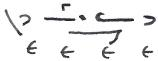

### Β. Γραφικά σχήματα

Με βάση το συνοπτικό πίνακα μεγάλων σημαδιών που είδαμε στην ενότητα 4 του παρόντος κεφαλαίου
(Πίνακας 10.3), μπορούμε να ανιχνεύσουμε τα εξής σχετικά με τη διαχρονική εξέλιξη του επεγέρματος:
Στην παλαιοβυζαντινή σημειογραφία:

- αθωνική: με το όνομα ἀπόθεμα (Λαύρας Γ 67, φ. 159α)

- αγιοπολίτικη:

εμφανίζεται και μαζί με το λύγισμα:lxiii

Στη μεσοβυζαντινή σημειογραφία, πλήρως εξελιγμένη και όψιμη:

||
|---|
||

Συνηθισμένη μορφή

/ πιο σπάνιες ή και μεταγενέστερες μορφές

Εμφανίζεται και μαζί με το ομαλόν:

1. του παρόντος κεφαλαίου).

ως διπλοεπέγερμα (Κωνστ. 86, φ. 15β: βλ. Εικόνα

Το μεγάλο σημάδι αυτό πέφτει σε δυσχρηστία στη μεσοβυζαντινή εξηγητική γραφή, καθώς το μελικό
του περιεχόμενο καταγράφεται αναλυτικότερα με έμφωνα σημάδια και άλλα μεγάλα σημάδια τα οποία
χρησιμοποιούνται για μικρότερης εμβέλειας ποικίλματα. Το σημάδι του επεγέρματος καταργείται οριστικά
στη Νέα Μέθοδο, αλλά το μελικό του περιεχόμενο, το άκουσμα της παλαιάς θέσης, επιβιώνει μέχρι σήμερα
στην ψαλτική παράδοση.

### Γ. Θέσεις σε διδακτικά ποιήματα και λίστες σημαδιών

Μέσα σε διάφορες ασκήσεις χειρονομίας και διδακτικά ποιήματα της υστεροβυζαντινής και μεταβυζαντινής
εποχής εμφανίζεται συχνά και η θέση του επεγέρματος. Παρακάτω μπορούμε να δούμε διάφορες μορφές της:
βλ. Εικόνα 10.22.

564

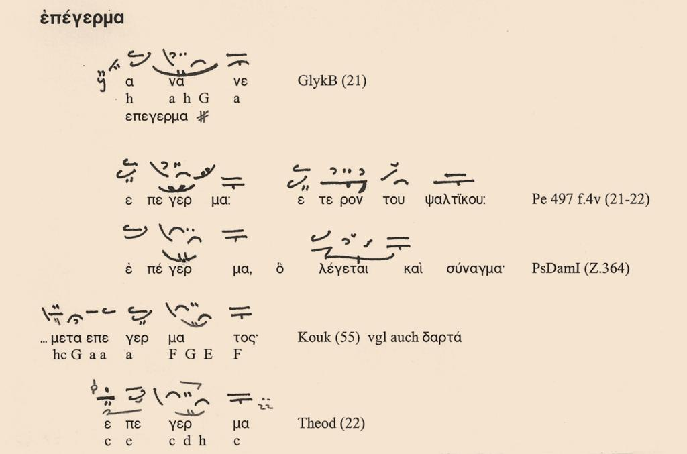

Εικόνα 10.22. Θέσεις του επεγέρματος σε διάφορα θεωρητικά της όψιμης μεσοβυζαντινής σημειογραφίας: Διδακτικό
ποίημα Γλυκέος, Προπαίδεια του κώδικα Petropolitanus gr. 497, Ψευδο-Δαμασκηνός Ι, Μέγα Ίσον Αγίου Ιωάννου του
Κουκουζέλη και Μέθοδος Θεοδούλου μοναχού.lxiv

Για να δούμε το ηχητικό αποτέλεσμα του επεγέρματος, όπως το διέσωσε η προφορική παράδοση
μέχρι τις αρχές του 19ου αιώνα, μπορούμε να συμβουλευθούμε την αργή εξήγηση του Μεγάλου Ίσου από το
Χουρμούζιο Χαρτοφύλακα: βλ. Εικόνα 10.23.

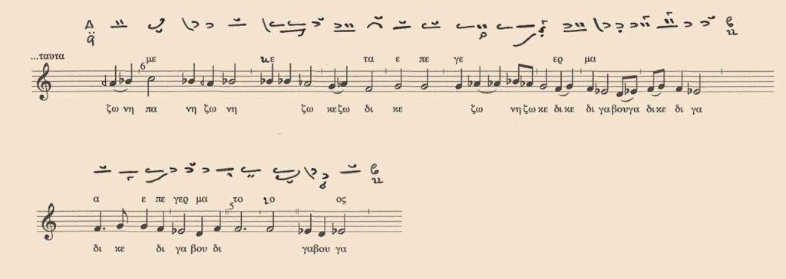

Ακούτε τη θέση επεγέρματος από το Μέγα Ίσον του Αγ. Ιωάννου του Κουκουζέλη, δομικοί φθόγγοι & εξήγηση, πατώντας

Εικόνα 10.23. Η θέση του επεγέρματος από το Μέγα Ίσον του Αγίου Ιωάννου του Κουκουζέλη, σε εξήγηση Χουρμουζίου
Χαρτοφύλακα: σημειογραφία της Νέας Μεθόδουlxv και σχηματική μεταγραφή στο πεντάγραμμο.

565

Τις ίδιες τρεις κατηγορίες πληροφοριών οι οποίες παρουσιάστηκαν παραπάνω για το επέγερμα,
μπορεί να αναζητήσει ο αναγνώστης και για τα υπόλοιπα μεγάλα σημάδια και για διάφορες θέσεις, μέσα από
τη συνδυαστική μελέτη των εξής τριών ενοτήτων:

Γλωσσάριο
ονόματα

||με σημαδιών και θέσεων Παράρτημα 1) (||Πίνακας μεγάλω ν σημαδιών σε διαχρονικ ή εξέλιξη (Πίνακας 10.3)||Αλφαβητικός κατάλαγος θέσεων (Παράρτημα 2)||
|---|---|---|---|---|---|---|

1. Αναζητώντας την ποιότητα των μεγάλων υποστάσεων και άλλων

σημαδοφώνων στη μεσοβυζαντινή σημειογραφία

Καθώς διαβάζει κανείς προσεκτικά τις ερμηνείες των διάφορων θεωρητικών για τα ονόματα σημαδιών και
θέσεων, αντιλαμβάνεται ότι η ποιοτική αξία των νευμάτων ξεδιπλώνεται σε διάφορους τομείς της μουσικής
διαμόρφωσης των κομματιών κατά την εκτελεστική πράξη.
Πιο συγκεκριμένα, οι ενέργειες διάφορων μεγάλων σημαδιών και μερικών από τα έμφωνα της
μεσοβυζαντινής σημειογραφίας θα μπορούσαν να ομαδοποιηθούν σε περισσότερες υποκατηγορίες, ανάλογα
με τρεις βασικούς τομείς: του χρόνου, του διαστηματικού χώρου και της έκφρασης. Ένα δείγμα υπάρχει στον
Πίνακα 10.6:

|Τομέας  Σημάδι |Ρυθ- μός|Αγω- γή|Μετα- βολές|χώρος Ποικίλ- ματα διάφορων επιπέδων|Δυνα- μική|Άρ- θρωση|Έκφραση Χροιά|Φρα- σά- ρισμα|Ήθος|
|---|---|---|---|---|---|---|---|---|---|
|ἀντικένωμα||||||||||
|ἀπόδερμα||||Προσωδ||||||
|ἀπορροή||||||||||
|ἀργόν||?||||||||
|ἀργοσύνθετον||||||||||
|βαρεῖα||||||||||
|βαρεῖα||||||||||
|γοργόν||?||||||||
|γοργο- σύνθετον||||||||||
|γουργούρι|Χαλκ||||Χαλκ|Χαλκ|||(Προ-|
|διπλῆ||||ΑνώνΞηροπ 357||||||
|δύο||||||||||
|δύο κεντήματα||||Ερωταπόκρ|Ερωτα- πόκρ|||||

566

|ἐλαφρόν|||Απόστ|Απόστ ΦιλόξΛεξ||||||
|---|---|---|---|---|---|---|---|---|---|
|θέμα||||||||||
|θέμα ἁπλοῦν||||||||||
|κλάσμα|||||||Αγιο- πολΤ|||
|κούφισμα||||||||||
|κράτημα||||||||Ακρίβ||
|κρατημο-||||||||||
|κύλισμα||||?||||||
|λύγισμα||||||||||
|ξηρὸν κλάσμα||||||||||
|ὀλίγον||||||||||
|ὁμαλόν||||Απόστ||||||
|ὀξεῖα||||||||||
|παρακάλεσμα & ἕτερον παρακάλεσμα||||Ακρίβ||||||
|παρακλητική|||||||(Μαρ- μαρη- νός)|||
|πελαστόν||||||||||
|πεταστή||||||||||
|πίασμα||||||Γαβρι- ήλ||||
|σεῖσμα|Ακρίβ (περί υπορ-||Μαρμα- ρηνός|Ακρίβ||||||
|σταυρός||||||||||
|σύναγμα||||||||||
|τρομικόν & ἐκστρεπτόν||||||||||
|φθορά||||||||||
|χόρευμα||||||?||||
|ψηφιστόν||||||Γαβρι- ήλ||||

Πίνακας 10.6. Ανιχνεύοντας την ενέργεια των σημαδιών στη μεσοβυζαντινή σημειογραφία, με βάση περιγραφές σε διάφορα
μουσικοθεωρητικά. Εκεί όπου υπάρχει μόνο ένα τεκμήριο για το συγκεκριμένο πεδίο, αναφέρεται και η πηγή σε
βραχυγραφία: ΑγιοπολT: Αγιοπολίτης σε έκδοση του π. Tardo, Ακρίβ: Ακρίβεια σε επιμ. του Schartau, ΑνωνΞηροπ357:
Ανώνυμος του χφου Ξηροποτάμου 357 σε έκδοση του Στάθη, Απόστ: Απόστολος Κώνστας Χίος από τη μονογραφία του
Αποστολόπουλου, Γαβριήλ: Γαβριήλ Ιερομόναχος σε έκδοση των Hannick & Wolfram, Μαρμαρηνός: Κύριλλος
Μαρμαρηνός σε έκδοση του Gertsman, Προσωδία: Ανώνυμο θεωρητικό στο χφο Σινά 1764, ΦιλόξΛεξ: Λεξικό του
Κυριακού Φιλοξένους, Χαλκ: Ακάκιος Χαλκεόπουλος από το αυτόγραφό του, ΕΒΕ 917.lxvi

Από τον παραπάνω πίνακα βλέπει κανείς ότι σύμφωνα με τους θεωρητικούς, σχεδόν όλα τα σημάδια
έχουν μια πολυσχιδή μουσική σημασία, η οποία αφορά περισσότερους τομείς της μουσικής διαμόρφωσης και
εκτέλεσης. Για να προχωρήσουμε όμως στην κατανόηση του ρόλου των σημαδιών μέσα στο ρεπερτόριο της

567

βυζαντινής και μεταβυζαντινής εποχής, είναι απαραίτητο να προσεγγίσουμε αναλυτικότερα και το φαινόμενο
της μουσικής εξήγησης. Αυτό θα είναι το θέμα του επόμενου κεφαλαίου.

Κριτήρια αξιολόγησης για το κεφάλαιο 10

Κριτήριο αξιολόγησης 1
Λίστα μεγάλων σημαδιών και θέσεων από το θεωρητικό του Ψευδο-

Δαμασκηνού ΙΙ (Ανώνυμος Β)

Κριτήριο αξιολόγησης 2
Σημάδια ψαλλόμενα κατ' ἦχον, ποίημα τοῦ μαΐστ(ο)ρ(ος) κυρ(οῦ)
Ἰω(άνν)ου τοῦ Κουκουζέλ(η) 

Κριτήριο αξιολόγησης 3
Διαβάστε την ενότητα 7 του παρόντος κεφαλαίου και ψάλτε τα μουσικά
παραδείγματά της.

Κριτήριο αξιολόγησης 4
Δημιουργήστε μνημοτεχνικές καρτέλες για το παρόν κεφάλαιο. 

Κριτήριο αξιολόγησης 5
Δείτε το Γλωσσάριο με ονόματα σημαδιών και θέσεων (Παράρτημα 1), σε
συνδυασμό με:

 τον Πίνακα μεγάλων σημαδιών σε διαχρονική εξέλιξη (Πίνακας 10.3)

και

 τον Αλφαβητικό κατάλογο θέσεων (Παράρτημα 2).

568

## Βιβλιογραφία για το κεφάλαιο 10

λειτουργικών κειμένων

### Εκδόσεις

Τὸ Ἅγιο Δωδεκαήμερο. (2004). Αθήνα: Αποστολική Διακονία της Εκκλησίας της Ελλάδος.
Goar, Jacobus. (Επιμ., 1730). Εὐχολόγιον sive Rituale Graecorum (β΄ έκδ.). Βενετία.
<https://books.google.gr/books?id=tp5hMKmdg_AC&printsec=frontcover&hl=el&source=gbs_ge_summary_r&ca>
d=0#v=onepage&q&f=false (9.3.2016).

Κείμενα βυζαντινής γραμματολογίας

Ἰωάννης Καμινιάτης. Εἰς τὴν ἅλωσιν τῆς Θεσσαλονίκης. Επιμ. G. Böhlig, Ioannis Caminiatae, De expugnatione
Thessalonicae. Corpus Fontium Historiae Byzantinae, Series Berolinensis, vol. IV. Berlin & New York, 1973.
Νικόλαος Μεσαρίτης. Επιμ. August Heisenberg, Grabeskirche und Apostelkirche. Zwei Basiliken Konstantins.
Untersuchungen zur Kunst und Literatur des ausgehenden Altertums, Zweiter Teil, Die Apostelkirche in
Konstantinopel. Leipzig: J.C. Hinrich'sche Buchhandlung, 1908.
<https://archive.org/stream/grabeskircheund00heisgoog> (9.3.2017).

Μουσικές συλλογές

Πέτρος Πελοποννήσιος. (1825). Εἱρμολόγιον καταβασιῶν. Ἐξηγημένον παρὰ Χουρμουζίου Χαρτοφύλακος.
Κωνσταντινούπολις: Κάστρου εις Γαλατάν (επαν. Αθήνα: Κουλτούρα, 1982, μαζί με το Ειρμολόγιο του Πέτρου
Βυζαντίου).
Ταμεῖον Ἀνθολογίας, τ. Ι.1. Βιβλιοθήκη Εκκλησιαστικῆς Μουσικῆς. Επαν. Θεσσαλονίκη: Ρηγόπουλος, 1980.

Θεωρητικά και μελέτες περί θεωρητικών

Αλεξάνδρου, Μαρία. (2014). Το Μέγα Ίσον του Αγίου Ιωάννου του Κουκουζέλη. Αναζητώντας την οκταηχία μέσα από
ένα περίφημο διδακτικό ποίημα. Ανακοίνωση στο Διεθνές Μουσικολογικό και Ψαλτικό Συνέδριο «Η Βυζαντινή
Μουσική μέσα από την Νέα Μέθοδο γραφής (1814-2014). Καθιέρωση - Προβληματισμοί - Προοπτικές»,
Θεσσαλονίκη, 30 Οκτωβρίου - 1 Νοεμβρίου 2014.
Αποστολόπουλος, Θωμάς. (2002). Ὁ Ἀπόστολος Κώνστας ὁ Χῖος καὶ ἡ συμβολή του στὴ θεωρία τῆς Μουσικῆς Τέχνης.
IBM, Μελέται 4. Έκδ. Γρ. Στάθης. Αθήνα.
Βασίλειος Στεφανίδης ὁ Βυζάντιος. Σχεδίασμα περὶ μουσικῆς ἰδιαίτερον ἐκκλησιαστικῆς. Σε Παράρτημα
Ἐκκλησιαστικῆς Ἀληθείας, τεῦχος ε΄ (1 Νοεμβρίου 1902, σ. 209-279). Κωνσταντινούπολις:
Πατριαρχικὸν Τυπογραφεῖον.
Γαβριὴλ Ἱερομόναχος. Περὶ τῶν ἐν τῇ ψαλτικῇ σημαδίων. Επιμ. Chr. Hannick και G. Wolfram, Gabriel
Hieromonachos, Abhandlung über den Kirchengesang. Monumenta Musicae Byzantinae, Corpus Scriptorum de
Re Musica, Ι. Wien: Verlag der Österreichischen Akademie der Wissenschaften, 1985.
Ἱερώνυμος Τραγῳδιστὴς ὁ Κύπριος. Περὶ χρείας μουσικῆς Γραικῶν χαρακτήρων. Επιμ. Bjarne Schartau,
Hieronymos Tragodistes, Über das Erfordernis von Schriftzeichen für die Musik der Griechen. Monumenta
Musicae Byzantinae, Corpus Scriptorum de Re Musica, IIΙ. Wien: Verlag der Österreichischen Akademie der
Wissenschaften, 1990.
Ἰωάννης Ψευδο-Δαμασκηνός. Ἐρωταποκρίσεις. Επιμ. G. Wolfram και Chr. Hannick, Die Erotapokriseis des
Pseudo-Johannes Damaskenos zum Kirchengesang. Monumenta Musicae Byzantinae, Corpus Scriptorum de Re
Musica, V. Wien: Verlag der Österreichischen Akademie der Wissenschaften, 1997.
Καράς, Σίμων. (1982). Μέθοδος τῆς ἑλληνικῆς μουσικῆς. Θεωρητικόν. 2 τ. Αθήνα: Σύλλογος πρὸς Διάδοσιν
τῆς Ἐθνικῆς Μουσικῆς.
Μανουὴλ Χρυσάφης. Περὶ τῶν ἐνθεωρουμένων τῇ ψαλτικῇ τέχνῃ καὶ ὧν φρονοῦσι κακῶς τινες περὶ
αὐτῶν. Επιμ. D. Conomos, The Treatise of Manuel Chrysaphes, The Lampadarios: On the Theory of the Art of
Chanting and on Certain Erroneous Views That Some Hold About it. Monumenta Musicae Byzantinae, Corpus
Scriptorum de Re Musica, II. Wien: Verlag der Österreichischen Akademie der Wissenschaften, 1985.
Μιχαήλ Βλεμύδης. Ιnc. Ἀρχὴ σὺν Θεῷ τῶν σημαδίων ἑρμηνευομένων καθ' ἕκαστον. Σε Εvgeny Vladimirovich
Gertsman (επιμ.), Petersburg Theoreticon (σ. 338-360, 373-384). Odessa: Variant Publishers, 1994.

569

Στάθης, Γρηγόριος. (1997). Ἡ Μέθοδος τῶν θέσεων τοῦ Ἰωάννου Κουκουζέλη καὶ ἡ ἐφαρμογή της. Σε
Christian Troelsgård (επιμ.), Βyzantine Chant. Tradition and Reform. Acts of a Meeting held at the Danish
Institute at Athens, 1993, Monographs of the Danish Institute at Athens, vol. 2 (σ. 189-203). Århus: Aarhus
University Press.
Χρύσανθος Αρχιεπίσκοπος Διρραχίου ο εκ Μαδύτων. Θεωρητικὸν Μέγα τῆς Μουσικῆς. Εκδ. Π. Πελοπίδου.
Τεργέστη: τυπογραφία M. Weis, 1832, επαν. Κουλτούρα.

Alexandru, Maria. (1996). Koukouzeles' Mega Ison. Ansätze einer kritischen Edition. Cahiers de l'Institut du Moyen Âge
Grec et Latin, 66, 3-23.
Aydemir, Μurat. (2010). Turkish Music, Makam Guide. Εdited and translated by Erman Dirikcan. Istanbul: Pan.
Dévai, Gabor. (1955). The Musical Study of Cucuzeles in a Manuscript of Debrecen. Acta Antiqua Academiae
Scientiarum Hungarcae, 3, 151-178.
Gertsman, Εvgeny Vladimirovich. (Επιμ., 1994). Petersburg Theoreticon. Odessa: Variant Publishers.
Karastoyanov, B.P. (2007). «Das Grosse Ison» - «Τὸ Μέγα Ἴσον» des Ioannes Koukouzeles in der Redaktion des 19.
Jahrhunderts. Wien.
Tončeva, Elena. (1974). Prepisi na chironomičeskogo pevčesko upražnenie na Joan Kukuzel. Σε Académie Bulgare des
Sciences, Bulletin de l' Institut de Musicologie, xviii, 209-302.
Troelsgård, Christian. (1997). The Development of a Didactic Poem. Some remarks on the Ἴσον, ὀλίγον, ὀξεῖα by
Ioannes Glykys. Σε Christian Troelsgård (επιμ.), Βyzantine Chant. Tradition and Reform. Acts of a Meeting held
at the Danish Institute at Athens, 1993, Monographs of the Danish Institute at Athens, vol. 2 (σ. 69-85). Århus:
Aarhus University Press.

Κατάλογοι χειρογράφων

Πολίτης, Λίνος. (1975). Δύο χειρόγραφα ἀπὸ τὴν Καστοριά. Σε Linos Politis, Paléographie et littérature byzantine
et néo-grecque. Recueil d' études, préface de D. Zakythinos (άρθρο ΧΙΙ, σ. 29-41). London: Variorum Reprints.
Στάθης, Γρηγόριος. (1975, 1976, 1993, 2015). Τὰ χειρόγραφα βυζαντινῆς μουσικῆς, Ἅγιον Ὄρος. Ιερά Σύνοδος της
Εκκλησίας της Ελλάδος - ΙΒΜ. Τόμοι Α΄-Δ΄. Αθήνα.

Βιβλία, άρθρα, ανακοινώσεις συνεδρίων

Αντωνίου, Σπυρίδων Στ., Πρωτοπρεσβύτερος. (2008). Μορφολογία τῆς βυζαντινῆς ἐκκλησιαστικῆς μουσικῆς.
Θεσσαλονίκη: Βάνιας.
Γκιολές, Ν. (1994). Οι ψηφιδωτές εικόνες του Οικουμενικού Πατριαρχείου και οι αναθέτες τους. Δελτίον τῆς
Χριστιανικῆς Ἀρχαιολογικῆς Ἑταιρείας, 17 (1993-1994), 249-258.
<http://ejournals.epublishing.ekt.gr/index.php/deltion/article/viewFile/4728/4504.pdf>
Καραγκούνης, Κωνσταντίνος. (2003). Ἡ παράδοση καὶ ἐξήγηση τοῦ μέλους τῶν χερουβικῶν τῆς βυζαντινῆς καὶ
μεταβυζαντινῆς μελοποιΐας. IBM, Μελέται 7. Έκδ. Γρ. Στάθης. Αθήνα.
Καράς, Σίμων. (1933). Ἡ βυζαντινὴ μουσικὴ σημειογραφία. Αθήνα.
Καράς, Σίμων. (1976). Ἡ βυζαντινὴ μουσικὴ παλαιογραφικὴ ἔρευνα ἐν Ἑλλάδι. Διάλεξις γενομένη ἐν
Λονδίνῳ κατ' Ἀπρίλιον τοῦ 1975. Αθήνα.
Καράς, Σίμων. (1990). Ἡ ὀρθὴ ἑρμηνεία καὶ μεταγραφὴ τῶν βυζαντινῶν μουσικῶν χειρογράφων Αθήνα.
Μπακιρτζής, Χ. (Επιμ., 2003). Ἅγιος Νικόλαος Ὀρφανός, Οἱ Τοιχογραφίες. Φωτογραφίες Βασίλης Τσώνης. Αθήνα:
Ακρίτας.
Σπυράκου, Ευαγγελία. (2008). Οἱ χοροὶ τῶν ψαλτῶν κατὰ τὴν βυζαντινὴ παράδοση. ΙΒΜ, Μελέται 14. Έκδ. Γρ.
Στάθης. Αθήνα.
Στάθης, Γρηγόριος. (1988). Ὁ Μαΐστωρ Ἰωάννης Παπαδόπουλος ὁ Κουκουζέλης (1270 περίπου - α΄ μισὸ ιδ΄ αἰ.)·
ἡ ζωὴ καὶ τὸ ἔργο του. Ένθετο των δίσκων βινυλίου στη σειρά Βυζαντινοὶ καὶ μεταβυζαντινοὶ μελουργοί,

1. Ψάλλει ὁ Χορὸς Ψαλτῶν «Οἱ Μαΐστορες τῆς Ψαλτικῆς Τέχνης», χοράρχης Γρ. Στάθης. Αθήνα:

Ἱερὰ Σύνοδος τῆς Ἐκκλησίας τῆς Ἑλλάδος-ΙΒΜ.
Στάθης, Γρηγόριος. (1989). Ἡ ἀσματικὴ διαφοροποίηση ὅπως καταγράφεται στὸν κώδικα ΕΒΕ 2458 τοῦ
ἔτους 1336. Σε Χριστιανικὴ Θεσσαλονίκη, Παλαιολόγειος ἐποχή, ΚΒ΄ Δημήτρια, Ἐπιστημονικὸ
Συμπόσιο, Πατριαρχικὸν Ἵδρυμα Πατερικῶν Μελετῶν, Ἱερὰ Μονὴ Βλατάδων, 29-31 Ὀκτ. 1987 (σ.

167-211). Θεσσαλονίκη: Κέντρο Ιστορίας Θεσσαλονίκης του Δήμου Θεσσαλονίκης, Αυτοτελείς εκδόσεις αρ. 3.

Τσιαμούλης, Χρήστος και Ερευνίδης, Παύλος. (1998). Ρωμηοὶ συνθέτες τῆς Πόλης (17ος-20ὸς αἰ.). Αθήνα: Δόμος.

570

Φλώρος, Κωνσταντίνος. (1998). Η ελληνική παράδοση στις μουσικές γραφές του μεσαίωνα. Εισαγωγή στη Νευματική
Επιστήμη. Μετφρ.-επιμ. Κώστας Κακαβελάκης, φιλολ. επιμ. Ν. Αβραμόπουλος. Θεσσαλονίκη: Ζήτη.
Ψάχος, Κωνσταντίνος. (1978). Ἡ παρασημαντικὴ τῆς βυζαντινῆς μουσικῆς, ἤτοι ἱστορικὴ καὶ τεχνικὴ
ἐπισκόπησις τῆς σημειογραφίας τῆς βυζαντινῆς μουσικῆς ἀπὸ τῶν πρώτων χριστιανικῶν χρόνων
μέχρι τῶν καθ΄ ἡμῶν (β΄ έκδ. υπερηυξημένη, επιμ. Γ. Χατζηθεοδώρου). Αθήνα: Διόνυσος.

Alexandru, Maria. (1999). Bemerkungen zu den Neumen- und Formelnbezeichnungen des byzantinischen Gesanges. Σε
Chr. Troelsgård and G. Wolfram (επιμ.), Palaeobyzantine Notations II, Acta of the Congress Held at Hernen
Castle (The Netherlands) in October 1996 (σ. 1-21). Hernen: Α.Α. Brediusstichting.
Alexandru, Maria. (2000). Studie über die 'grossen Zeichen' der byzantinischen musikalischen Notation, unter
besonderer Berücksichtigung der Periode vom Ende des 12. bis Anfang des 19. Jahrhunderts. Διδακτορική
διατριβή. 3 τ. Kopenhagen: Universität Kopenhagen, Humanistische Fakultät.
Alexandru, Maria. (2004). Ζu dem Neumenkomplex kylisma, antikenokylisma, lygisma in der byzantinischen Musik. Σε
Gerda Wolfram (επιμ.), Palaeobyzantine Notations III, Acta of the Congress held at Hernen Castle, The
Netherlands, in March 2001, Eastern Christian Studies, 4 (σ. 243-297). Leuven-Paris-Dudley, MA: A.A. Bredius
Foundation, Peeters.
Alexandru, Maria. (2015). O Διδάσκαλος τῶν διδασκάλων μέσα από τον καθρέφτη της Προθεωρίας της Παπαδικής. Σε
Κωνσταντίνος Χαρ. Καραγκούνης και Γεώργιος Κουρουπέτρογλου (επιμ.), Η Ψαλτική Τέχνη ως Αυτόνομη
Επιστήμη. Επιστημονικοί Κλάδοι - Συναφή Επιστημονικά Αντικείμενα - Διεπιστημονικές Συνεργασίες,
Διαθεματικότητα και Διάδραση, Πρακτικά 1ου Διεθνούς Διεπιστημονικού Μουσικολογικού Συνεδρίου, 29 Ιουνίου

- 3 Ιουλίου 2014, Βόλος (σ. 91-108). Βόλος: Ακαδημία Θεολογικών Σπουδών Βόλου, Τομέας Ψαλτικής Τέχνης

και Μουσικολογίας, 2015. <http://speech.di.uoa.gr/IMC2014/pdffull/93-110.pdf>
Buchwald, Wolfgang, Hohlweg, Armin και Prinz, Otto. (1982). Tusculum-Lexikon griechischer und lateinischer Autoren
des Altertums und des Mittelalters (γ΄ έκδ.). München, Zürich: Artemis Verlag.
Bychkov, Victor. (1999). Βυζαντινή Αισθητική, Θεωρητικά προβλήματα. Μετφρ. Κωνσταντίνος Χαραλαμπίδης. Αθήνα:
Τζαφέρη.
Conomos, Dimitri E. (1974). Byzantine Trisagia and Cheroubika of the Fourteenth and Fifteenth Centuries.
Thessaloniki: Patriarchal Institute for Patristic Studies.
Demus, Otto (†). (1991). Die Byzantinischen Mosaikikonen. I. Die grossformatigen Ikonen. Veröffentlichungen der
Kommission für Byzantinistik, Bd. V/1. Wien: Verlag der Österreichischen Akademie der Wissenschaften.
<http://images.icon-art.info/public/Byzantium/Demus%201991%20->
%20Die_Byzantinischen_Mosaikikonen._I._Die_Grossformatigen_Ikonen.pdf (20.8.2016).
Doneda, Annalisa. (1999). 'Hyperstases' in MS Kastoria 8 and the Kondakarion Notation. Relationships and
Interchangeability. Σε Christian Troelsgård & Gerda Wolfram (επιμ.), Palaeobyzantine Notations II. Acta of the
Congress Held at Hernen Castle (The Netherlands) in October 1996 (σ. 23-46). Hernen: A.A. Brediusstichting,
1999.
Floros, Constantin. (1965 και 1967). Die Entzifferung der Kondakarien-Notation. Musik des Ostens, 3, 7-71, και 4, 12-

1.

Floros, Constantin. (1970). Universale Neumenkunde. 3 τ. Kassel: Bärenreiter Antiquariat, Kassel-Wilhelmshöhe.
Hickmann, Ellen. (1996). Handzeichen. Σε Ludwig Finscher (επιμ.), Die Musik in Geschichte und Gegenwart,
Allgemeine Enzyklopädie der Musik, begründet von Friedrich Blume (zweite, neubearbeitete Auflage), τ. 4
(στήλες 6-14). Kassel-Basel-London-New York-Prag: Bärenreiter, Stuttgart-Weimar: Metzler.
Huglo, Michel. (1963). La chironomie médiévale. Revue de Musicologie, 49, 155-171.
Liddell, H. G, Scott, R., Jones, H. St. και McKenzie, R. (1990). A Greek-English Lexicon, With a Supplement 1968 (repr.
of 9th edition). Oxford: Clarendon Press.
Moran, Neil K. (1986). Singers in Late Byzantine and Slavonic Paintings. Byzantina Neerlandica 9. Leiden.
Myers, Gregory. (2009). A Historical, Liturgical and Musical Exploration of Kondakarnoie Pienie. The Deciphering of a
Medieval Slavic Enigma. Edited by Elena Toncheva and Svetlana Kujumdzieva. Sofia: Bulgarian Academy of
Sciences, Cyrillo-Methodian Research Centre.
Schartau, Bjarne. (1988). On collecting 'Testimonia' of Byzantine Musical Practice. Cahiers de l'Institut du Moyen-Âge
Grec et Latin, 57, 159-166.
Wellesz, Egon. (1962). A History of Byzantine Music and Hymnography. 2nd edition revised and enlarged. Oxford:
Clarendon Press.

Διαδικτυογραφία

<http://ejournals.epublishing.ekt.gr/index.php/deltion/article/viewFile/4728/4504.pdf> (20.8.2016).

571

<http://images.icon-art.info/public/Byzantium/Demus%201991%20->
%20Die_Byzantinischen_Mosaikikonen._I._Die_Grossformatigen_Ikonen.pdf (20.8.2016).
<http://speech.di.uoa.gr/IMC2014/pdffull/93-110.pdf> (2.10/2016).
<https://archive.org/stream/grabeskircheund00heisgoog> (9.3.2017).
<https://books.google.gr/books?id=tp5hMKmdg_AC&printsec=frontcover&hl=el&source=gbs_ge_summary_r&cad=0#v>
=onepage&q&f=false (9.3.2016).

## Σημειώσεις τέλους για το κεφάλαιο 10

i Η παρούσα ενότητα αποτελεί επιτομή
ιδιαίτερα Moran (1986). Gertsman (επιμ.,
ii Hickmann (1996, στήλη 7).
iii Πρβλ. Huglo (1963, σ. 160).
iv Η αντιγραφή βασίστηκε σε αντίστοιχη
σχετικά με το «μοτίβο τῆς κάλυψης τοῦ
«σύγχρονη μουσικὴ πράξη τῆς Ἀνατολῆς, ἀπὸ τὸ
v Ιωάννης Καμινιάτης, Εἰς τὴν ἅλωσιν τῆς Θεσσαλονίκης

160-161). Βλ. και Βuchwald, Hohlweg & Prinz (1982, σ. 435-436).

vi

από Alexandru (2000, τ. Ι, σ. 239-246). Για το θέμα της χειρονομίας, βλ.
1994, σ. 338-360).

φωτογραφία από: Moran (1986, εικ. 13). Πρβλ. και Σπυράκου (2008, σ. 113,
αὐτιοῦ τοῦ μουσικοῦ μὲ τὸ ἕνα χέρι», από την αρχαιότητα μέχρι τη
Μαρόκο μέχρι τὴν Περσία καὶ τὸ Κουρδιστάν»).
(επιμ. Böhlig, CFHB, τ. 3, κεφ. 11, 2: Schartau, 1988, σ.

Πρβλ. τις λεκτικές ερμηνείες διάφορων θεωρητικών για τα σημάδια αυτά, οι οποίες είναι συγκεντρωμένες στο
Παράρτημα Ι του παρόντος εγχειριδίου, στα αντίστοιχα λήμματα (σ. 82-85 και 91-92). Βλ. επίσης Alexandru (1999).
vii Ἰωάννης Ψευδο-Δαμασκηνός, Ἐρωταποκρίσεις (επιμ. Wolfram & Hannick, CSRM, τ. 5, στίχοι 530-533).
viii Μιχαήλ Βλεμύδης, Ἀρχὴ σὺν Θεῷ τῶν σημαδίων ἑρμηνευομένων καθ' ἕκαστον (επιμ. Gertsman, 1994, σ. 338-
360, 373-384).
ix Πρβλ. επίσης Moran (1986, σ. 76-79 και εικ. 41).
x Γαβριήλ Ιερομόναχος, Περὶ τῶν ἐν τῇ ψαλτικῇ σημαδίων (επιμ. Hannick & Wolfram, CSRM, τ. Ι, 1985, στίχοι 387-

390).

xi Γαβριήλ Ιερομόναχος, Περὶ τῶν ἐν τῇ ψαλτικῇ σημαδίων (επιμ. Hannick & Wolfram, CSRM, τ. Ι, 1985, στίχοι

384-385).

xii Γαβριήλ Ιερομόναχος, Περὶ τῶν ἐν τῇ ψαλτικῇ σημαδίων (επιμ. Hannick & Wolfram, CSRM, τ. Ι, 1985, στίχοι

706-712).

xiii Γαβριήλ Ιερομόναχος, Περὶ τῶν ἐν τῇ ψαλτικῇ σημαδίων (επιμ. Hannick & Wolfram, CSRM, τ. Ι, 1985, στίχοι

391-399).

xiv Γαβριήλ Ιερομόναχος, Περὶ τῶν ἐν τῇ ψαλτικῇ σημαδίων (επιμ. Hannick & Wolfram, CSRM, τ. Ι, 1985, στίχοι

379-383).

xv Γαβριήλ Ιερομόναχος, Περὶ τῶν ἐν τῇ ψαλτικῇ σημαδίων (επιμ. Hannick & Wolfram, CSRM, τ. Ι, 1985, στίχοι

154-155).

xvi Γαβριήλ Ιερομόναχος, Περὶ τῶν ἐν τῇ ψαλτικῇ σημαδίων (επιμ. Hannick & Wolfram, CSRM, τ. Ι, 1985, στίχοι

156-158).

xvii Βλ. τις Προθεωρίες στα χφα ΕΒΕ 2600, Ιβήρων 985, ΕΒΕ 2444.
xviii Βλ. την Προθεωρία στο χφο Κουτλουμουσίου 449.
xix Γαβριήλ Ιερομόναχος, Περὶ τῶν ἐν τῇ ψαλτικῇ σημαδίων (επιμ. Hannick & Wolfram, CSRM, τ. Ι, 1985, στίχοι

241-250).

xx Γαβριήλ Ιερομόναχος, Περὶ τῶν ἐν τῇ ψαλτικῇ σημαδίων (επιμ. Hannick & Wolfram, CSRM, τ. Ι, 1985, στίχοι

251-258).

xxi Βλ. Καράς (1933, σ. 26). Ψάχος (1978, σ. 53-54).
xxii Moran (1986, σ. 46).
xxiii "Vox porro χειρονομεῖν, non est simpliciter elata, depressaque ad numerum manus modulandi moram, normamque
praescribere: sed Graecis ad pulpita cantaturis minime convenire solitis, est; post κόμματα τροπαρίων a Canonarcha e
libro suggesta, cantus moderatorem in omnium conspectus, variis manus dextrae motibus & gestibus, erectis nimirum,
depressis, extensis, contractis, aut combinatis digitis, diversas cantus figures & vocum inflexiones characterum
musicorum vice designare: atque ita hunc cantus ducem reliqui attente respicientes, velut totius modulationis regulam
sequuntur." (Goar, επιμ., 1730, σ. 352). Πρβλ. επίσης Φλώρος (1998, σ. 86-91).
xxiv Gertsman (επιμ., 1994, σ. 734).
xxv Gertsman (επιμ., 1994, σ. 738).
xxvi Πρβλ. επίσης Ψάχος (1978, σ. 53-54).
xxvii Βλ. Καράς (1982, Θεωρητικόν, τ. Α΄, σ. 180, υποσημ. **).

572

xxviii Βασίλειος Στεφανίδης ο Βυζάντιος, Σχεδίασμα (1902, § 140).
xxix Βασίλειος Στεφανίδης ο Βυζάντιος, Σχεδίασμα (1902, § 145).
xxx Χρύσανθος, Θεωρητικὸν μέγα (1832, §§ 208-209).
xxxi Χρύσανθος, Θεωρητικὸν μέγα (1832, § 149). Αυτός ο τρόπος καταμέτρησης του ρυθμού συνηθίζεται και για τα
ουσούλια στη Λόγια μουσική της Πόλης και γενικότερα, στην κλασική ανατολική μουσική: βλ. π.χ. Τσιαμούλης &
Ερευνίδης (1998, σ. 303-308). Aydemir (2010, σ. 209-213).
xxxii Βλ. Αποστολόπουλος (2002, σ. 241).
xxxiii Βλ. Καράς (1982, Θεωρητικόν, τ. Α΄, σ. 157-166, 180). Βλ. και του ιδίου (1976, πίνακες Β΄, Γ΄, Ε΄, Ζ΄, Θ΄).
xxxiv Η αντιπαραβολή αυτή στηρίζεται σε: Καράς (1990, πίναξ 8). Πρβλ. και Πέτρος Πελοποννήσιος, Εἱρμολόγιον
καταβασιῶν (1825, σ. 44). Τὸ Ἅγιο Δωδεκαήμερο (2004, σ. 305).
xxxv Καράς (1982, Θεωρητικόν, τ. Α΄, σ. 5, 17, 180).
xxxvi Βλ. Αποστολόπουλος (2002, σ. 123).
xxxvii Gertsman (επιμ., 1994, σ. 357 και πίν. LXXIV, επίσης σ. 338-356). Το μουσικοθεωρητικό κείμενο βρίσκεται στον
κώδικα Petropolitanus Archivi Academiae Scientiarum Rossiae, Thesaurus 11, descriptio 1, N 159, fol. 579 και
προέρχεται από τον κώδικα Σινά αρ. 1230 (Στιχηράριον του έτους 1365), όπου ήταν κολλημένο στο τέλος του
χειρογράφου. Στην Αγ. Πετρούπολη το έφερε ο Porphyry Uspensky (Gertsman, επιμ., 1994, σ. 338).
xxxviii Για τη χρονολόγηση, πρβλ. Ἱερώνυμος Τραγῳδιστής ὁ Κύπριος. Περὶ χρείας μουσικῆς Γραικῶν
χαρακτήρων (επιμ. Schartau, CSRM, τ. ΙΙΙ, 1990, σ. 24, υποσημ. 21). Μια έκδοση του κειμένου βρίσκεται σε:
Alexandru (2000, τ. ΙΙ, σ. 87).
xxxix Μερικές παρατηρήσεις σχετικά με το κείμενο: στην ερμηνεία του ίσου, το χφο Σινά 1764, φ. 52α έχει «ὁ σεβάσμιος
σημεῖον». Οι συμβολικές ερμηνείες που υπάρχουν στο κείμενο για το ίσον και το ολίγον, αναφέρονται σε χωρία της
Καινής Διαθήκης: Α΄ Κορ. 11, 26 και Ιω. 1, 29.
xl Η αντιγραφή των Γ. Τζημοπούλου & Αικ. Ιωαννίδου βασίστηκε σε: Φλώρος (1998, εικ. 2). Πάρθηκε από: Αλεξάνδρου
(2016, σ. 360 και αντίστοιχα ψηφιακά αρχεία στο επισυναπτόμενο CD). Πρβλ. και μια λεπτομερή περιγραφή αυτής της
μικρογραφίας σε Σπυράκου (2008, σ. 517-518).
xli Μoran (1986). Πρωτοπρεσβύτερος Σπυρίδων Αντωνίου (2008, σ. 320-329).
xlii Πρβλ. Moran (1986, εικ. 11 και σχόλια στη σ. 79). Βλ. επίσης το σκίτσο χεριού δείχνοντας τη χειρονομία της οξείας,

σε παλαιοσλαβικό μουσικό χφο της Πετρούπολης, Δημόσιας Βιβλιοθήκης Q.p. I. 15. Το μικρό σκίτσο στην
παρούσα σημείωση βασίζεται στο πανομοιότυπο που υπάρχει σε: Φλώρος (1998, σ. 313, εικόνα 1).
xliii Το σκίτσο βασίζεται σε αντίστοιχη εικόνα από το εξώφυλλο του Κανονισμού συμμετοχής στον 19ο Διεθνή
Διαγωνισμό Μουσικής Δωματίου, 2-5 Δεκεμβρίου 2010, Διεθνής Έκθεση Θεσσαλονίκης ΑΕ.
xliv Πρβλ. την αναλυτική περιγραφή αυτού του χειρογράφου από το Λίνο Πολίτη (1975, άρθρο ΧΙΙ, σ. 36-41), ο οποίος
και ανακάλυψε τον κώδικα αυτό.
xlv Πρβλ. Floros (1965 και 1967). Doneda (1999). Myers (2009).
xlvi Αναλυτική περιγραφή των περιεχομένων αυτού του κώδικα υπάρχουν σε Πολίτης (1975: βλ. ειδικά σ. 38). Για μια
άλλη φωτογραφία του ίδιου χειρογράφου, πρβλ. Φλώρος (1998, σ. 300, εικ. 4).
xlvii Πρβλ. την αναλυτική περιγραφή του χφου αυτού σε: Στάθης (1975, σ. 656-668).
xlviii Για τη φωτογράφιση από το χφο Κωνσταμονίτου 86 ευχαριστούμε τον Δρ. Στέφανο Αλεξάνδρου.
Πρβλ. μια όμοια λίστα σε Ἰωάννης Ψευδο-Δαμασκηνός, Ἐρωταποκρίσεις (επιμ. Wolfram & Hannick, CSRM, τ. 5,

σ. 64-66). Για τη χρονολόγηση του Ανωνύμου Β΄ ο οποίος καταχωρείται μέσα στο συμπίλημα θεωρητικών κειμένων του

Ψευδο-Δαμασκηνού, πρβλ. ό.π., σ. 20.
xlix
Γαβριήλ Ιερομόναχος, Περὶ τῶν ἐν τῇ ψαλτικῇ σημαδίων (επιμ. Hannick & Wolfram, CSRM, τ. Ι, 1985, στίχοι

289-301).

l Σύμφωνα με τις παλαιογραφικές έρευνες του Φλώρου, όμως, το θέμα απλούν προέκυψε από την ένωση του κεφαλαίου
στοιχείου Θ με την πεταστή (πρβλ. Floros, 1970, τ. Ι, σ. 255-256).
li Ο πίνακας είναι παρμένος από: Alexandru (2000, τ. ΙΙΙ, σ. 3-6). Οι λίστες σημαδιών, διδακτικά ποιήματα και θεωρητικά
εγχειρίδια στα οποία βασίζεται ο πίνακας αναφέρονται στο Παράρτημα 1 του παρόντος εγχειριδίου, σ. v-ix και x-xiv. Για
περισσότερα στοιχεία, πρβλ. Alexandru (2000, τ. Ι, σ. 87).
lii Πρβλ. επίσης Floros (1965, 1967 και 1970, τ. Ι, σ. 118-119).
liii Σχετικά με θέσεις στη μεσοβυζαντινή παρασημαντική, στις οποίες εμφανίζεται ένα άφωνο σημάδι με κόκκινο μελάνι,
χωρίς να πλαισιώνεται από όλα τα έμφωνα τα οποία ανήκουν στη θέση του, πρβλ. Conomos (1974, σ. 355-365).
liv Ο παρών πίνακας στηρίζεται σε: Alexandru (2004, σ. 282, 286-287).
lv Πρβλ. Καραγκούνης (2003, σ. 246).
lvi Μανουήλ Χρυσάφης, Περὶ τῶν ἐνθεωρουμένων (επιμ. Conomos, CSRM, τ. ΙΙ, στίχοι 91-96).
lvii Πρβλ. Στάθης (1988, ένθετο δίσκων βινυλίου).

573

lviii Η βιβλιογραφία σχετικά με το Μέγα Ίσον είναι πολύ πλούσια. Για περισσότερα στοιχεία, βλ. Alexandru (2014).
lix Eυχαριστούμε τον καθηγητή κ. Christian Troelsgård για φωτογραφίες του αντίστοιχου υλικού.
lx Για τις φωτογραφίες αυτές ευχαριστούμε την κυρία Φράγκου και το υπόλοιπο προσωπικό από το Τμήμα Χειρογράφων
και Παλαιτύπων της Εθνικής Βιβλιοθήκης της Ελλάδος, καθώς και τον κύριο Δημοσθένη Σπανουδάκη.
lxi Βλ. π.χ. Φλώρος (1998, σ. 130) και Floros (1970, passim).
lxii To παρόν λήμμα μεταφράστηκε από Alexandru (2000, τ. Ι, σ. 121).
lxiii Πρβλ. Floros (1970, τ. ΙΙΙ, σ. 273 και 274, με την περιγραφή: "Ligatur von Apothema [Epegerma] und Lygisma":
σύμπτυξη αποθέματος [επεγέρματος] και λυγίσματος, και τη διευκρίνιση ότι εμφανίζεται τόσο στην κοντακάρια
σημειογραφία, όσο και στην Coislin). Πρβλ. επίσης Φλώρος (1998, σ. 128).
lxiv Η εικόνα είναι παρμένη από: Alexandru (2000, τ. ΙΙ, σ. 45).
lxv Βλ. Alexandru (2000, τ. ΙΙ, σ. 45). Για το Μέγα Ίσον στη Νέα Μέθοδο, βλ. Ταμεῖον Ἀνθολογίας, τ. Ι.1. (επαν. 1980,

σ. 447-463).

lxvi Για τον πίνακα αυτό και περισσότερες επεξηγήσεις, πρβλ. Alexandru (2000, τ. Ι, σ. 253-256, 275-286: 284-285). Για
περισσότερα στοιχεία σχετικά με τις βραχυγραφίες του Πίνακα 10.6, πρβλ. τα Ευρετήρια για το Γλωσσάριο, τον
Κατάλογο θέσεων και το Συνοπτικό πίνακα μεγάλων σημαδιών, μετά το Παράρτημα 1 της παρούσας εργασίας, σ. x-

xxviii.

574
