Summary
The study of Middle Byzantine notation remains at a preparatory stage if it does not proceed as far as the
so-called exegesis (exēgēsis), that is, the traditional manner of decoding the Old Method in
liturgical practice, on the basis of the living voice. The manner of musical rendering of Middle Byzantine notation
at the cantor’s stands of the Ecumenical Patriarchate of Constantinople can be heard through the
tens of thousands of pages of transcriptions by Chourmouzios the Chartophylax and Gregory the Protopsaltes, which
today constitute a golden key to palaeography, since they make accessible to us the melodic
treasures of Byzantium and the post-Byzantine period in the analytical notation of the New Method. The chapter
includes information on the first appearances and several milestones of exegesis in practical sources,
from Balasios the Priest (c. 1670 [Stathis]) down to the Three Teachers, as well as a brief
reference to the development of the theorization of exegesis, from Akakios Chalkaiopoulos (early 16th c.
[Stathis]) to the present. There follows a systematic approach to exegesis, in table form, with an open
typology (brief and slow exegesis or, in the terminology of I. Arvanitis, syllabic exegesis and melismatic
exegesis, the latter with the subcategories brief, slow, and mixed melismatic) and with reference to the corresponding
repertory in which the individual forms of exegesis were applied by the Three Teachers. Various proposals for expanded applications
of the shorter forms of exegesis to old Byzantine repertory are also mentioned. The chapter concludes with various examples, on the basis of which the reader
is also introduced in practical terms to the multifaceted phenomenon of musical exegesis, which constitutes the crowning achievement
of Palaeography.

Prerequisite knowledge
This chapter presupposes the study of Chapters 7-10. In addition, it is recommended to study the following two works, which are of decisive importance for the subject of exegesis and of Byzantine Musical Studies more generally:

- Stathis, Gregorios. (2006). The Exegesis of Old Byzantine Notation and Edition of an Anonymous Treatise from Codex Xeropotamou 357, as well as an Edition of the Musical Art of Apostolos Konstas of Chios from Codex Docheiariou 389. IBM, Studies 2 (6th repr.). Athens.

- Idem. (2016). The Autograph Manuscripts of the Exegesis into the New Method of Notation. Vol. I. The Prolegomena & Vol. II. The Catalogue. Athens: Institute for Byzantine Musicology.

## 1. Defining Musical Exegesis

In Byzantine music, by the term exegesis (ἐξήγησις) we mean the traditional way of decoding Middle Byzantine musical notation, which is stenographic and needs the assistance of oral tradition in order to be transcribed analytically and/or chanted correctly, leading to the corresponding melos, that is, the inherited sonic result.ii
In other words, “exegesis of the old Byzantine notation is the complete writing down, and therefore also the chanting, of the melos that lies within this or that combination of signs: vocal—ascending and descending—on the one hand, and aphonic or great hypostaseis of cheironomy, as they are called, on the other.”iii Exegesis is a technique and at the same time an art, which unfolds at the level of performance and writing, and embraces the practice of psalmody holistically. It concerns not isolated signs, but the full complement of the components of the Psaltic Art: rhythm, intervals, ethos, the meaning of the poetic text, expression, and style.iv

## 2. Some Milestones in the History of Exegesis

### 2.1. Theoretical and practical sources in Byzantine notation. Known exegetes

The theorist who inaugurates the discourse on the more analytical notation of the sonic result
is Akakios Chalkeopoulos, in his Akribologēmata (Ἀκριβολογήματα), at the beginning of the 16th c., with his references to terms
such as exegesis (ἐξήγησις), fully written-out theseis (θέσεις ὁλόγραφες), and explained aporroai (ἀπορροὲς ἐξηγημένες):v see Figure 11.1.

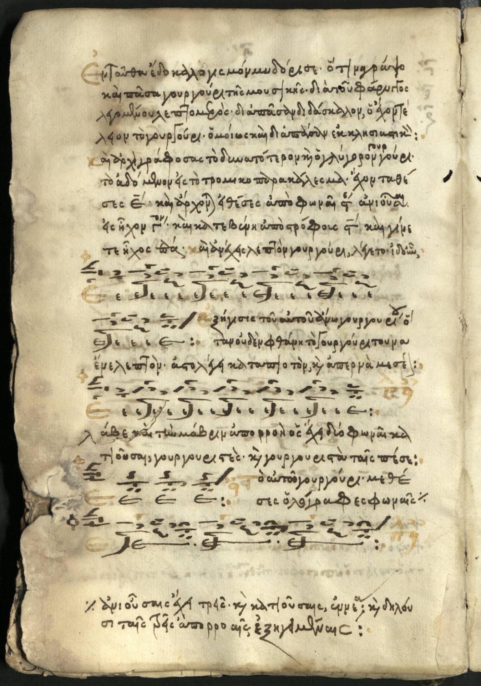

Figure 11.1. The beginnings of the theorization of exegesis in the Akribologēmata of Akakios Chalkeopoulos: EBE 917,
his own autograph, early 16th c., fol. 12v. © National Library of Greece.
Cf. also: Karas (1992, Pl. 45). Stathes (1982). Alygizakis (ed., 2008).vi Stathis (2016, vol. I, pp. 108-111).
At the level of Greek musical sources of the post-Byzantine period, the earliest surviving exegeses
of complete pieces are by Balasios Hiereus and concern the following two pieces:

- Funeral Trisagion called Athenian, sung in slow style, plagal second mode nenano (ms. Iviron Monastery 1250, fols. 211v-212v, autograph of Balasios, c. 1670): Figures 11.2.- 3,

- Alleluiarion, in protos-barys mode, by the monk Theodoulos.vii

From Balasios Hiereus up to the Reform of the Three Teachers (Constantinople,
1814/15), many names of exegetes are known (more than fifty).
Written exegesis, at the end of the 17th century limited to a few pieces in Greek
manuscripts, developed a strong momentum during the 18th century, with the result that the more analytical notation
of the music, on the one hand, came to concern ever more pieces and entire repertoires, and, on the other,
the notation itself evolved continuously toward greater analyticity.
The formation of Middle Byzantine exegetical notation, as a transitional stage with
successive “steps,”viii is associated with major and minor figures among the exegetes.ix The
best known are the following:

-  Balasios or Balases Hiereus (fl. c. 1670-1700),

-  Ioannes Trapezountios (1736-†1771),

-  Petros Peloponnesios (c. 1735-†1778),

-  Petros Byzantios († 1808),

-  Georgios Kres († 1816),

-  Apostolos Konstas of Chios (c. 1765/70-†1840),

-  Gregory the Protopsaltes (c. 1777-†1821 ).x

The evolutionary course of exegetical notation was completed with the creation of the New
Method of analytical notation at the beginning of the 19th century, with the contribution of the Three Teachers:

- Archimandrite Chrysanthos of Madytos (c. 1770-1843), metropolitan of Prusa (1833- 1843), a pupil of Petros Byzantios, author of the Introduction to the Theory and Practice of Ecclesiastical Music (Paris, 1821) and of the famous treatise Great Theoretikon of Music (Trieste, 1832).

- Gregory (c. 1777-1821), Lampadarios and later Protopsaltes (1819-1821) of the Great Church of Christ, a pupil of Petros Byzantios and Georgios the Cretan, produced a rich exegetical oeuvre and was active in the teaching of the New Method at the Fourth Patriarchal Music School.

- Chourmouzios Georgiou (or Georgios) from Chalki (c. 1770-1840), Chartophylax of the Great Church of Christ, a pupil of Iakovos the Protopsaltes and Georgios the Cretan, is considered “the most important exegete of the new method (...) he transcribed almost all the types of books and all the chants, as many as tradition preserved from the period before the Fall down to his own time (...) his transcriptions today constitute extremely precious keys to the knowledge of the traditional musical material, chiefly that which survived or was born in the years of Ottoman rule.”xi

The exegetical work of the Three Teachers was continued by various pupils of theirs, the
best known being the Athonite monks Matthaios of Vatopedi, Ioasaph of Dionysiou, Nikolaos and Nikephoros
of Docheiariou, Theophanes of Pantokrator, as well as by Apostolos Konstas of Chios.xii
The means by which the reformers
and their continuators produced tens of thousands of exegeses was the new analytical notation, based on:
a new systematization of the oktoechos (οκτωηχία), preserving the inherited aural traditions,
a new way of notating rhythm, through the use of old graphic forms and
the introduction of many others.
The result was a change in the way Psaltic art was taught in the New Method: the triptych
parallage-metrophonia-melos was replaced by the diptych parallage-melos. Metrophonia became superfluous,
since the melos is notated analytically in all the genera and species of composition, and parallage is now based
on the monosyllabic phthongoi.
Nevertheless, the New Method did not pass without objection and reactions in the world of
church chanters of the time. Especially well known is the case of Konstantinos Byzantios (1777-1862), Protopsaltes of the
Great Church of Christ (1821-1855), who continued to chant from books with the Old System of notation until the end
of his life, while at the same time, at the left analogion of the same church, books with the
reformed notation were in use, a fact which, however, did not alter the sonic result.xiii

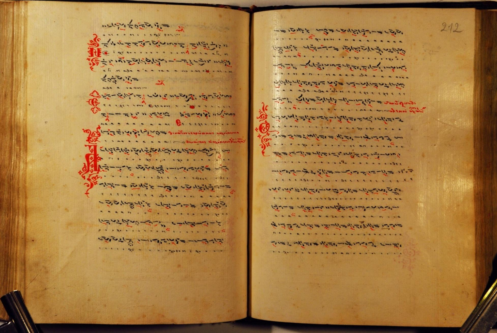

Figure 11.2. The “Athenian Funeral Trisagion,” in plagal second mode nenano, from the autograph codex of Balases Hiereus, Iviron 1250 (“around 1670” or “around 1675-
1685”: Stathis, 2015, pp. 686-706 [analytical description] and pp. 920-921 [color photographs]), written first in late Middle Byzantine notation (fols. 211v-212r) and subsequently in
exegetical Middle Byzantine notation, bearing the following rubric: “the same was explained by me” (sc. Balases Hiereus). Cf. also Stathis (2016, vol. I, pp. 111-116). © Holy Monastery of Iviron,
Mount Athos.
578

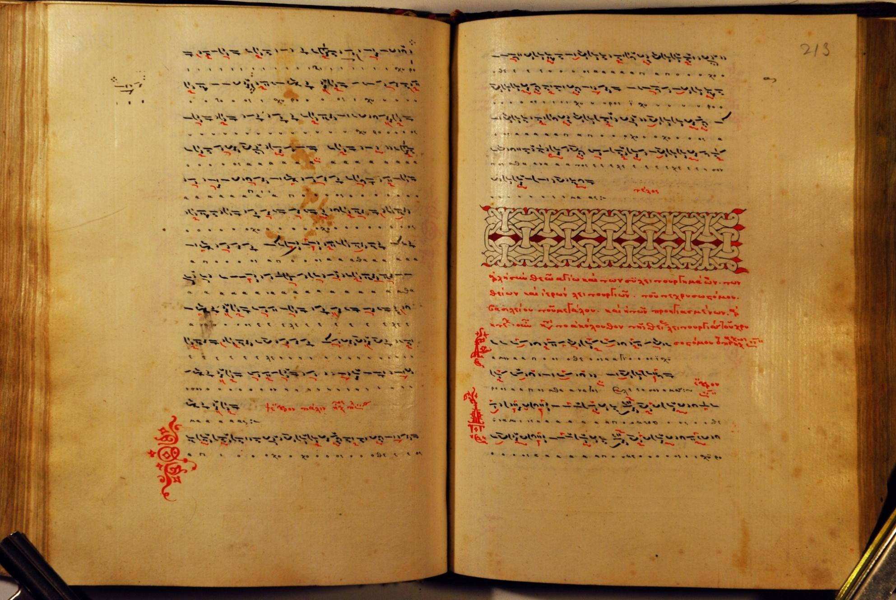

Figure 11.3. Continuation of the exegesis by Balasios Hiereus for the Athenian Funeral Trisagion, from codex Iviron 1250, fols. 212v-213r. © Holy Monastery of Iviron, Mount Athos.

### 2.2. Early sources in Slavic staff notations

A most important category of practical sources for exploring the early stages and, more generally,
the entire history of the musical exegesis of Byzantine and post-Byzantine repertoire consists of a
series of Anthologies (usually bearing the title Irmoloj - Heirmologion), written in Kievan square
notation (Kyiv square note)xiv and, later, in partes notation, during the period
from the end of the 16th century to the end of the 18th century.xv Two of these codices are entirely
in Greek, others are bilingual (Greek and Slavic, with the use of the Greek or Cyrillic
alphabet): see Stathis (2001a and 2001b), Tončeva (1982), Yasinovskyi (1996), Shkolnik (1998), Makris
(2011 and 2013), Chudinova (2013), Gerasimova-Persydska & Ignatenko (2006), Ignatenko (2016).xvi
Among these manuscripts are the following:

- The Supraśl Heirmologion, 1598-1601, from the monastery of the same name in present-day Poland, kept in Kyiv, Institute of Manuscripts of the Vernadsky National Library of Ukraine, Col. I, no. 5391 (see Makris, 2011, p. 206),

- Codices Sinai 1477 and Petersburg 586, purely Greek codices, which were written around 1700-1720 (Stathis, 2001b, pp. 690-690),

- Ms. slav. 10846 (1676) and Ms. slav. 10845 (1684) from the Central State Library, Bucharest, as well as Ms. slav. 525 (1731/33) from the Library of the Romanian Academy of Sciences, Bucharest. All three mss. come from the monastery of Schitul Mare (today in western Ukraine: see Tončeva, 1982).xvii

- The Oktoechos of Kallistrat, from the Holy Monastery of Dragomirna in Moldavia, Romania (1769), today in the aforementioned Kyiv library, Collection 306, no. 40Π/XVIII-18 (Ignatenko, 2016. Chudinova, 2013, pp. 255-256).xviii

The transcriptions of Byzantine and post-Byzantine compositions included in these manuscripts
contain precise information concerning the melodic line and rhythm of the corresponding
pieces (see Makris, 2011, p. 205). As Stathis (2001b) emphasizes, the transcriptions in question concern “the
substance of the music, the melodic content that is notated summarily by the signs of
Byzantine notation” (p. 690) and constitute indisputable proof of the stenographic character
of Byzantine notation (p. 694), illuminating the evolutionary stages of the written exegetical
tradition of Psaltic art.
As an example, the “oldest dated notation of a Greek
ecclesiastical melos” in Slavic staff notation is cited below, from the Supraśl Heirmologion (Makris, 2011,
p. 206). It is a Cheroubikon in Slavic, with the rubric: “Politikon, third mode, transferred into
the language of the Russians by a patriarchal psaltes in the year ,αφπγ΄ [1583], September 8,
very beautiful.” The Greek psaltes was possibly the famous Theophanes Karykes, the chanting may have
taken place in the Holy Monastery of Pammakaristos during the feast of the Nativity of the Theotokos, and the scribe may
have been the Russian Theodoros Kasianovits, who had spent a period of education in Constantinople
(ibid.): see Figures 11.4-5.

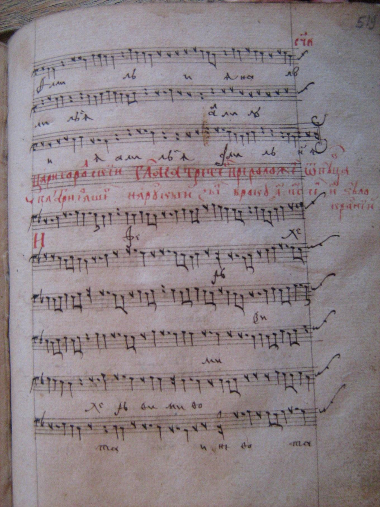

Figure 11.4. The beginning of the “Politikon Cheroubikon,” in the third tetraphonic mode, in Slavic, from the “Supraśl
Heirmologion,” Institute of Manuscripts of the Vernadsky National Library of Ukraine, Col. I, no. 5391, fol. 519r, late
16th c.xix © Vernadsky National Library of Ukraine.
Cf. Eustathios Makris. (2011). Cheroubikon “politikon”. An early “transcription” of a Greek
ecclesiastical melos. In Nina-Maria Wanek (ed.), Psaltike. Neue Studien zur Byzantinischen Musik: Festschrift für
Gerda Wolfram. Wien: Präsens Verlag, p. 211.

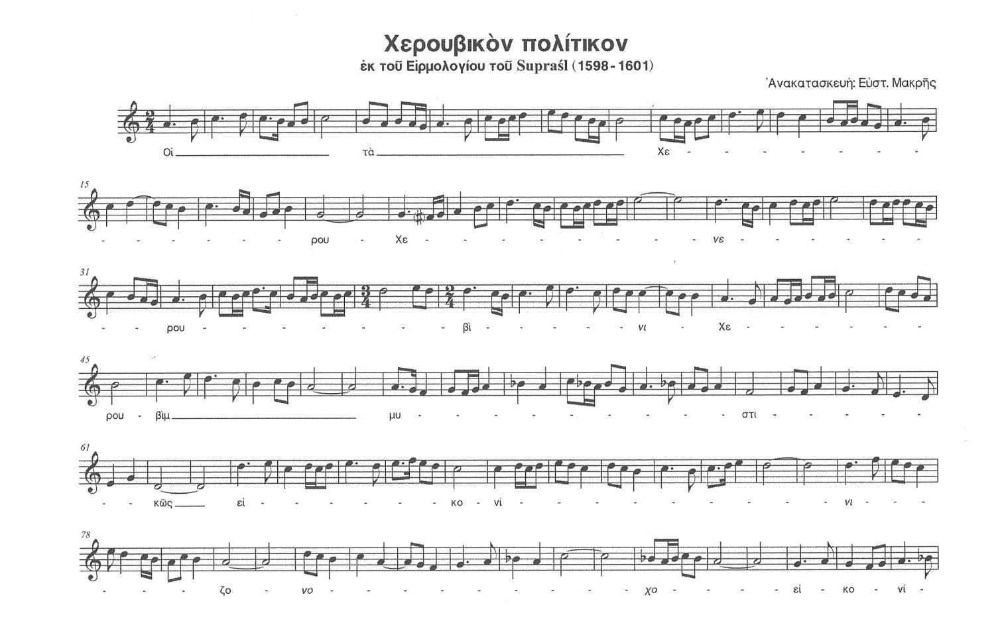

Figure 11.5. The beginning of the Politikon Cheroubikon: reconstruction in Greek, based on the Supraśl Heirmologion,
and transcription into the western European notation in use today, by Eustathios Makris.
Source: Eustathios Makris. (2011). Cheroubikon “politikon”. An early “transcription” of a Greek
ecclesiastical melos. In Nina-Maria Wanek (ed.), Psaltike. Neue Studien zur Byzantinischen Musik: Festschrift für
Gerda Wolfram. Wien: Präsens Verlag, p. 212. © Präsens Verlag, Wien.

## 3. The elaboration of the theory of musical exegesis

Although a first reference to the term exegesis, in the sense of more analytical musical notation,
is made in the Akribologēmata of Akakios Chalkeopoulos, nevertheless, Apostolos Konstas of Chios may be regarded as the founder of the theory concerning
exegesis, at the beginning of the 19th century.xx
In his Great Theoretikon, Chrysanthos refers to the old way of teaching Psaltic art, based
on the triptych parallage-metrophonia-melos, and to the Byzantine art of cheironomia. For those
interested, he proposes carrying out comparisons between the Old and the New Method, at the level of various
theseis (e.g. for the ouranisma). Comparative studies (juxtapositions) of sources at various evolutionary stages
of Byzantine notation remain to this day the principal method for studying the phenomenon of
exegesis.xxi
With Georgios Violakis (late 19th century) and especially with Konstantinos Psachos, during the second decade
of the 20th century, exegesis gained a central place in musicological discussions. The theory of
exegesis, however, was initially rejected by foreign scholars. Nevertheless, in place of the intense polemic
that prevailed until about 1970, a fruitful dialogue gradually began to take shape between
scholars of different cultural backgrounds, Greek and foreign. Today the major role of oral tradition and the indispensability (ἐκ τῶν οὐκ ἄνευ) of the living voice in
the teaching and decoding of Byzantine notation are now recognized internationally. The list of researchers who
dealt during the 20th and 21st centuries with issues of exegesis from various perspectives is extensive.
By way of indication, one may mention such names as: Simon Karas, Gregorios Stathis, Manolis Chatzigiakoumis,
Georgios Amargianakis, Dimitrios Dragoumis, Ioannis Arvanitis, Thomas Apostolopoulos, Emmanouil
Giannopoulos, Achilleas Chaldaiakis, Dimitrios Balageorgos, Flora Kritikou, Vasileios Vasileiou,
Ioannis Liakos, Michail Stroumpakis, Ioannis Zannos, Fr. Bartolomeo di Salvo, Kenneth Levy, Jørgen
Raasted, Elena Tončeva, Christian Troelsgård, Nicolae Gheorghiţă, Fr. Filotheu Bălan, Fr. Nikolaos Mezēs,
Adrian Sîrbu, etc.xxii

## 4. Towards a typology of exegesis in Byzantine music

Intensive research on exegesis has brought it to light as an extremely multifaceted phenomenon, with various
ramifications depending on style and, in particular, on the genre and type of the pieces in their historical development.
An open typology of exegeses could take the form indicated in Table 11.1.

|Correspondences: unit ~ primary time-units|Apostolos Konstas of Chios: dromoi|Designation of the corresponding mode of decoding (type of exegesis)|Collections in which this particular type of exegesis is used|
|---|---|---|---|
|in in|(ways, times,|in contemporary Musicology|by the Three Teachers and their pupils; in addition, in contemporary Musicology|
|Middle Byz. Neo-Byz. notation notation|cheironomia) of the melos||Karas, additionally Arvanitis|
|1 syllable ~ 1 primary time-unit|Fast|concise exegesis (terminology proposed by I. Arvanitis) syllabic or rhythmic interpretation/exegesis|• Peloponnesios • Heirmologion of Petros Byzantios • Heirmologion of Balasios (heirmoi) • old Heirmologion, concise Anastasimatarion of Petros • old Sticherarion • old prokeimena, Triadika of Great Lent|
|1 syllable ~ 2 primary time-units|heirmologic|slow exegesis; concise melismatic exegesis (for the heirmologic chants); concise exegesis (for other genera)|• old Heirmologion • Heirmologion of katabasiai by Petros Peloponnesios • slow Anastasimatarion of Petros Pelop. • Doxastarion of Petros Pelop. . • Heirmologion of Balasios (katabasiai) • old Sticherarion • Sticherarion of the new embellishment (P. Chrysaphes, Germanos of New Patras) • Compositions of the Old Papadike (Παλαιὰ Παπαδική) • Compositions of the New Papadike, in the concise style|
|||there is also observed, in addition, a mixed slow-concise exegesis|concise transcription, with some slow lines, in exegeses by Matthew of Vatopedi and Nikolaos Docheiareitesxxiii|
|1 syllable or, in papadic chants, one thesis (θέση) ~ (2, 4), 8 primary time-units (especially in old sticheraric chants) and more primary time-units (especially in papadic chants)|instrumental; slow melos|slow melismatic exegesis; slow exegesis; slow exegesis|old and of the new • Doxastarion • Compositions of the Papadike • Mathematarion • Kratematarion • Oikematarion • Kalophonic Heirmologion • Sticherarion and Anastasimatarion of the embellishment by Iakovos Protopsaltes of the Old and the New|

open typology of exegesis.xxiv

Table 11.1. An

## 5. Examples of exegeses through source comparisons

### 5.1. A Typology of Collations and Some Methodological Issues

Before we proceed to the individual examples, it should be clarified that, apart from the usual
form of manuscript comparison that we have seen up to now, with all the sources, one beneath the other in
chronological order, various other methods of comparison may also be used in musicological research,
depending on the emphasis that the scholar wishes to give to one or another aspect of
the research. More specifically, collations are divided into the following types: see Table 11.2.

|Criteria|Types of collation|Clarifications|
|---|---|---|
|Order of sources|1. Retrospective|The collation begins with the most recent sources and proceeds chronologically backwards, towards the older ones. It was proposed by K. Psachos (1917/1978) as the basic research methodology in Palaeography|
||2. Prospective|The sources are set out in chronological order, from the older to the more recent.|
||3. Stylistic|The sources are grouped according to style of composition, on the basis of their similarities and differences, in order to facilitate their comparison.|
||4. By language|In cases where sources in various languages are compared (e.g. Greek, Old Slavonic, Latin, Syriac, Romanian, etc.), the grouping is usually done by language, because of differences in the number of syllables of the poetic text and, possibly, in the order and/or selection of the musical formulae.|
||Often the retrospective|or the prospective collation may be combined with the stylistic one.|
|Completeness|5. Positive|All the sources are entered in full form.|
|of sources|6. Negative|The best MS is chosen as the dux (in the sense of a guiding MS) for each group of manuscripts (e.g. one dux for the old sticheraric style, one for the new embellishment, and so on). The signs and the text of the guiding MS will be entered in full and will constitute the point of reference for all the other similar sources, for which only the differences will be recorded.|
||7. Mixed|A combination of positive and negative collation. This may be done both in a horizontal direction and in a vertical one. a. In a horizontal direction: see Raasted (1966, tables in A 3 double-page spread, pp. 181-193), where the collation is negative, with the exception of the cadences (cadential formula of the kylisma, martyrias, musico-poetic punctuation, the beginning of the next colon with a confirmatory ison or another sign), where it is positive, since this is also the subject of the book: intonation formulae and martyrias. b. In a vertical direction: the use of negative collation is chosen for some sources, since they resemble the guiding MS very closely. In this way all the differences will immediately be visible, whereas a positive collation would mean, for the reader, a time-consuming process of comparison in order to identify any differences.|

Table 11.2. An open typology of collations in the Palaeography of Byzantine Music.

In the heirmologic and sticheraric repertory, collations can—for the most part—
be made with the sung syllable as the unit, that is, by aligning the neumatic sign-phonemes (σημαδόφωνα) by syllable. Especially
at the beginning, it is very helpful if the syllables are separated from one another by vertical lines, especially in the more
melismatic textures (e.g. in the slow sticheraric melos), where the syllables are anagrammatized or
pseudo-syllables are added, with the gorgic or ephelcystic n. In such cases no additional vertical
lines are needed; rather, we count the syllable from its first appearance up to the appearance of the next
syllable, e.g. Sē sē | me | ro[on |.

In the papadic genre and in other melismatic styles, collations can be aligned by
thesis, since the syllables of the poetic text are much more sparse and the insertion of anagrammatisms
makes comparison between the stenographic and the more analytical sources, and with the New Method, more difficult.
The typology of collations above is open. Various types may be combined
in palaeographical study, depending on the subject of the work. Whatever method of collation one
chooses, it is useful, when recording the sources, to begin with the most melismatic versions of the
piece in the New Method, so that one can then measure correctly the spaces that are needed
for entering the brief or older notations that use fewer
sign-phonemes.
Below are collations of sources in the Old and the New System, with various types
of exegeseis for the heirmologic, sticheraric, and papadic genres, as examples of the various methods
of traditional decoding of Middle Byzantine notation mentioned in Table 11.1.

### 5.2. Heirmologic melodies

#### 5.2.1. Heirmos and katabasia “All things were amazed,” legetos mode, in the later tradition: a collation of sources

Figure 11.6.

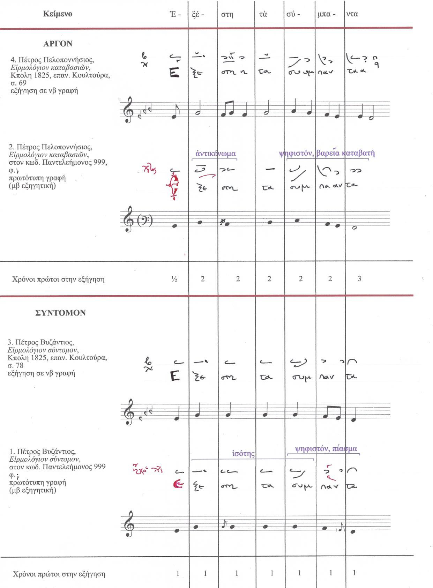

Figure 11.6. “All things were amazed”: source collation in stylistic & chronological order, for the beginning
of the Fifth Ode of the Canon of the Akathistos: katabasia by Petros Peloponnesios and heirmos by Petros Byzantios,
in exegetical Middle Byzantine notation and in the New Method. The short version presents a ratio of 1:1 (one
syllable lasts 1 primary time-unit), while the katabasia has 1:2.

#### 5.2.2. Heirmos and katabasia “The divine and ineffable beauty,” Mode I, in diachronic development: a collation of sources: Figures 11.7-8

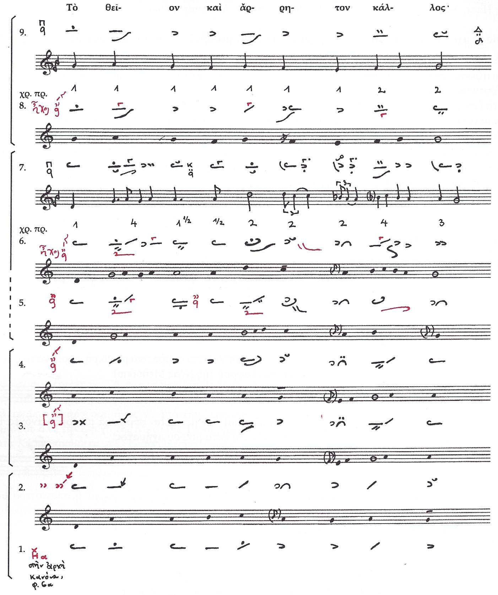

Figure 11.7. Source collation in retrospective order (from the more recent to the older sources) for the first
colon of the heirmos and katabasia “The divine and ineffable beauty,” from the Fifth Ode of the Canon of the Dormition of the
Most Holy Theotokos. Text by Saint Cosmas the Melodist, in various musical settings over the centuries.
Sources: Old melos: 1. Lavra Γ 9 | 2. Iviron 470 | 3. Philotheou 131 | 4. Philotheou 125 || Balasios: 5.
Karakallou 225 || Petros Peloponnesios: 6. MS of the Holy Synod of the Church of Greece | 7. 1825 edition ||
Petros Byzantios: 8. NLG 964 | ΄9. 1825 edition. See below, Figures 11.9-16.
Listen to them in the following order: 9 (parallage & melos), 7 (parallage & melos), 5-2 (structural notes, sometimes with rhythmic interpretation

## according to the research of I. Arvanitis):     

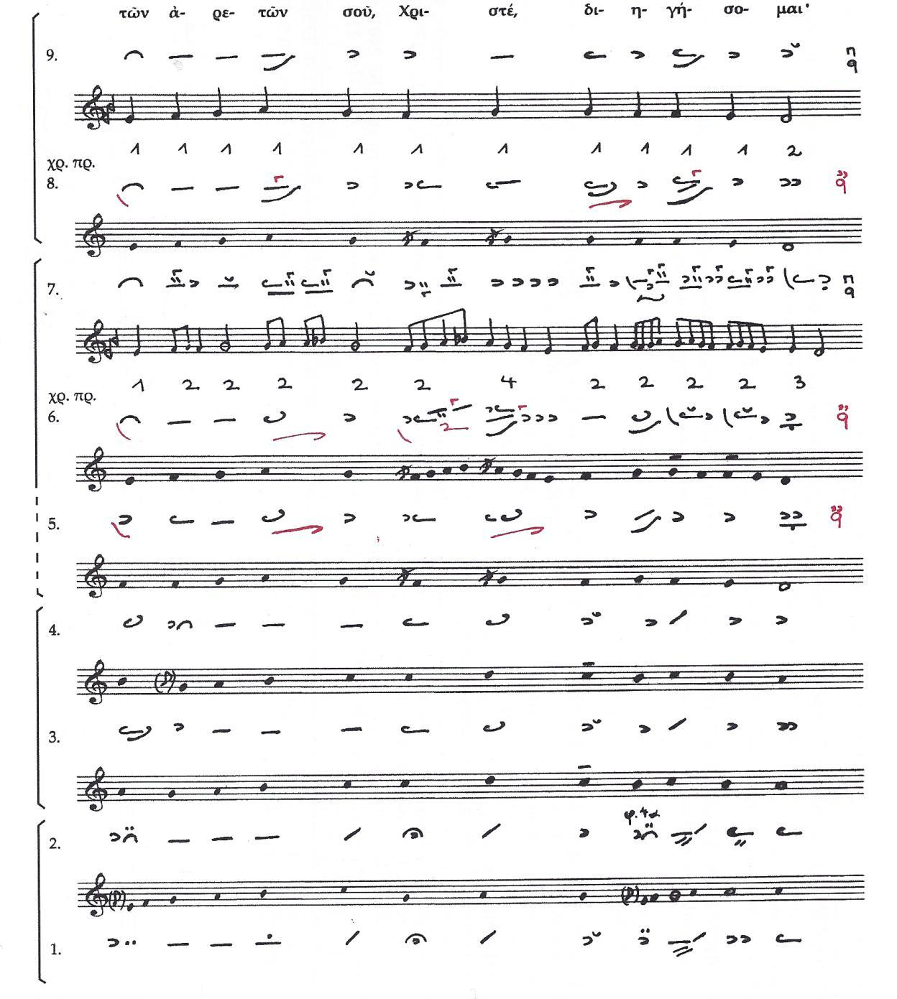

Figure 11.8. Comparison of sources for the second kolon (κώλον) of the heirmos and the katabasia “The divine and ineffable
beauty”, from the Fifth Ode of the Canon for the Dormition of the Most Holy Theotokos. Text by Saint Cosmas the Melodist,
in various melodic settings over the centuries. Source: Alexandrou, Maria. (2010). Exegeses and transcriptions of
Byzantine music. A brief introduction to the issues they raise. Thessaloniki: University Studio Press,
2010, pp. 80-81. By kind permission of the aforementioned publishing house.

Below follow photographs from individual sources in the comparison and one additional manuscript, in chronological order: see Figures 11.9-19

Figure 11.9. Source 1 of the previous comparison:
Heirmologion Lavra Gamma 9, 12th c., fol. 6v:
The divine and ineffable beauty. Old Byzantine notation
of the Hagiopolite type
(Coislin VI): see Boukas (2004, p. 44).

© for the photograph from microfilm:

Patriarchal Institute for Patristic
Studies, Vlatadon Monastery, Thessaloniki.

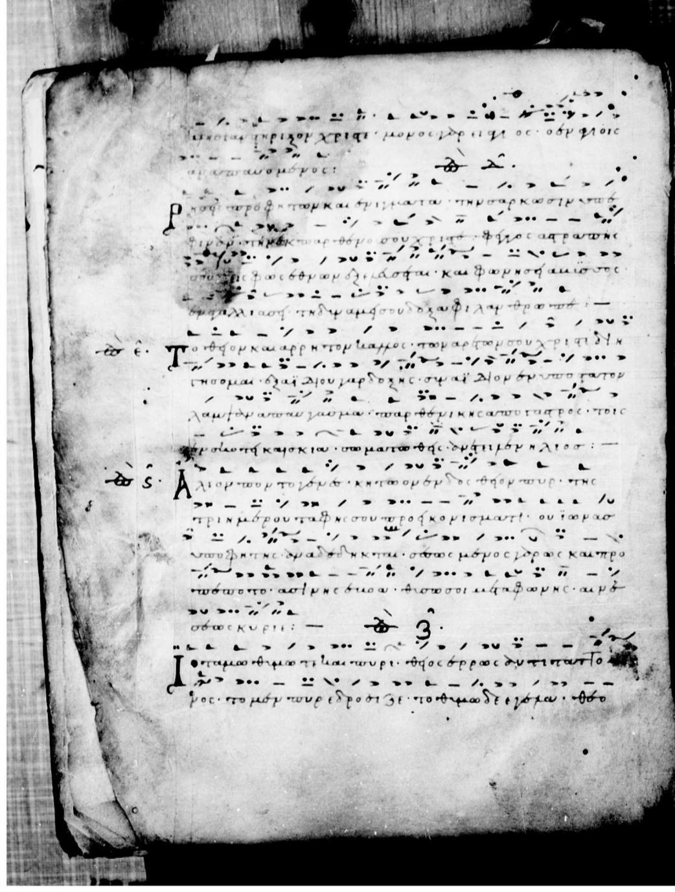

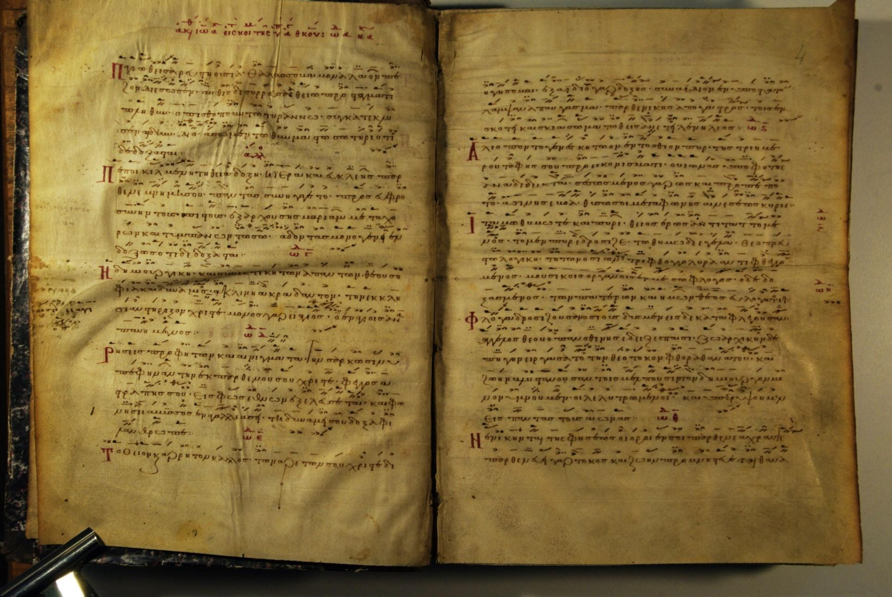

Figure 11.10. Source 2 of the previous comparison: Heirmologion Iviron 470, ca. 1150, fols. 3v-4r. The divine and ineffable beauty. Middle Byzantine transitional
notation (Coislin VI-Middle Byzantine I, according to Floros, 1970, vol. I, p. 66). © Holy Monastery of Iviron, Mount Athos.

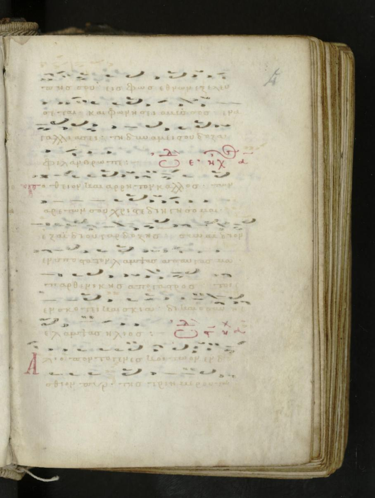
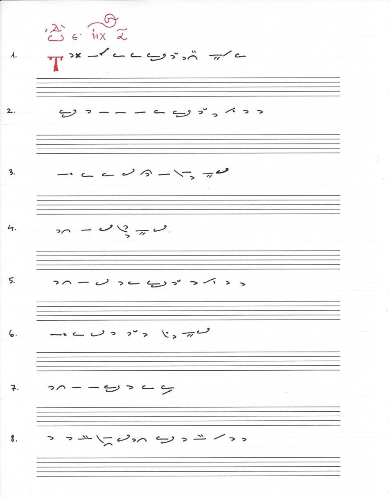

Figure 11.11.a-b. The heirmos “The divine and ineffable beauty” in Middle Byzantine fully developed notation, from the Heirmologion Petropolitanum graecum 491 (121), fol. 4r.xxv

© National Library of Russia, St. Petersburg. You may print this page and add the red signs and the poetic text from the
manuscript, also completing the staff transliteration.

Figure 11.11.c. The heirmos “The divine and ineffable beauty” from the
Heirmologion Petropolitanum graecum 491 (121), fol. 4r, with
the transfer of the metrophonic structure onto the staff.

 You may propose a dating, on the basis

of the notation, and compare this version
with the other sources included in the comparison.
The manuscript is of particular importance, as is evident
from Figure 11.12.

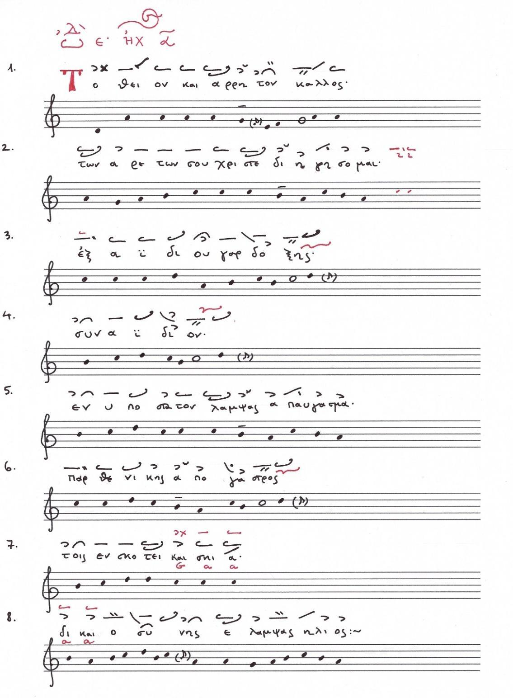

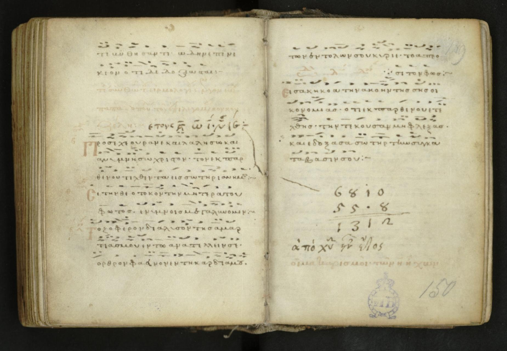

Figure 11.12. Codex Petropolitanus graecus 491 (121), fols. 148v-149r, with notes in red and dark brown ink, recording the authorship of the work and the
dating. © National Library of Russia, St. Petersburg. You may transcribe the note written in red on fol. 148v with the name of the editor of the
Heirmologion and the dating (in dark ink), and also check the correctness of the later arithmetical operation found on fol. 149r.xxvi

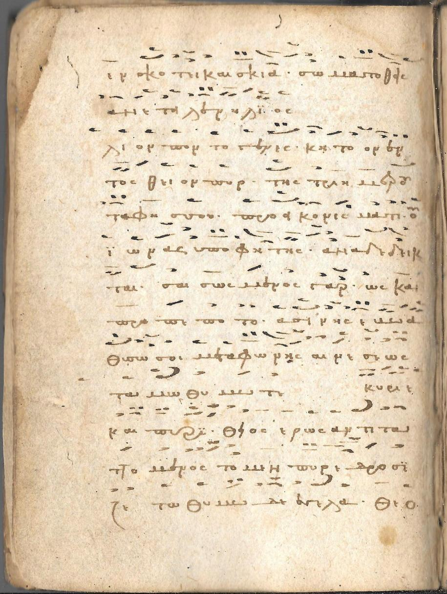
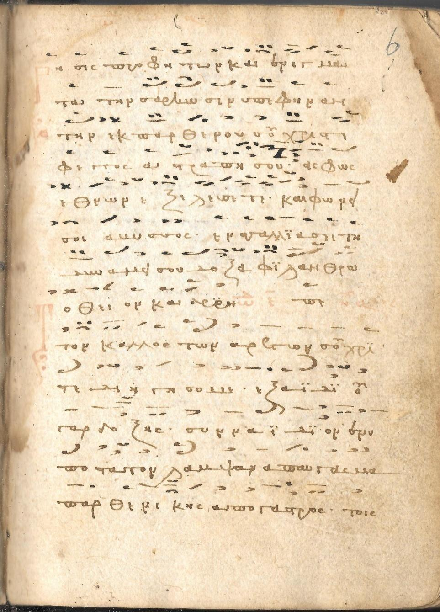

Figure 11.13. Source 3 of the previous comparison: The heirmos “The divine and ineffable beauty” in Middle Byzantine fully developed notation, from the Heirmologion of the

1. Philotheou, codex 131, 15th c. (Stathis, 1993, p. 512), fols. 6r and v. © Holy Monastery of Philotheou, Mount Athos. 595

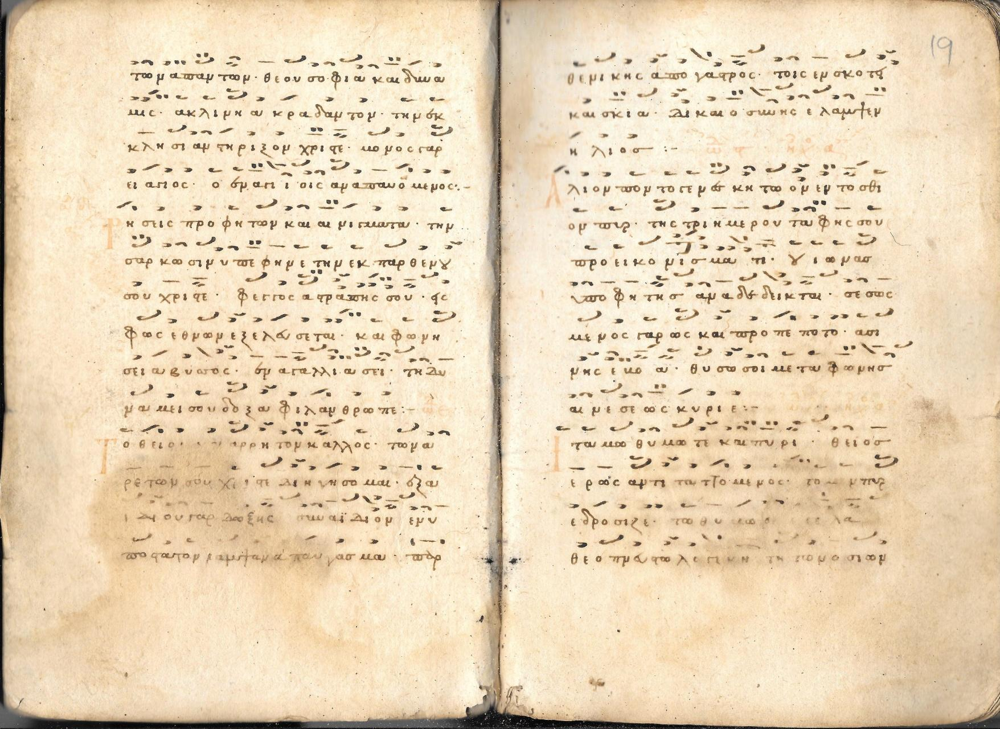

Figure 11.14. Source 4 of the previous comparison:The heirmos “The divine and ineffable beauty” in Middle Byzantine fully developed notation, from the Heirmologion of the Holy Monastery of
Philotheou, Mount Athos, codex 125, 15th or 16th c. (Stathis, 1993, p. 502), fols. 18v-19r. © Holy Monastery of Philotheou, Mount Athos.
596

Figure 11.15. Source 5 of the previous comparison:
The heirmos “The divine and ineffable beauty”
in Middle Byzantine fully developed notation,
from the Heirmologion of Balasios the Priest, ms 1725/212
(Lambros no.) of the Holy Monastery of Karakallou, mid-18th c.
(Stathis, 1993, under number: 225, description: p. 435),
fol. 2v. © Holy Monastery of Karakallou, Mount Athos.

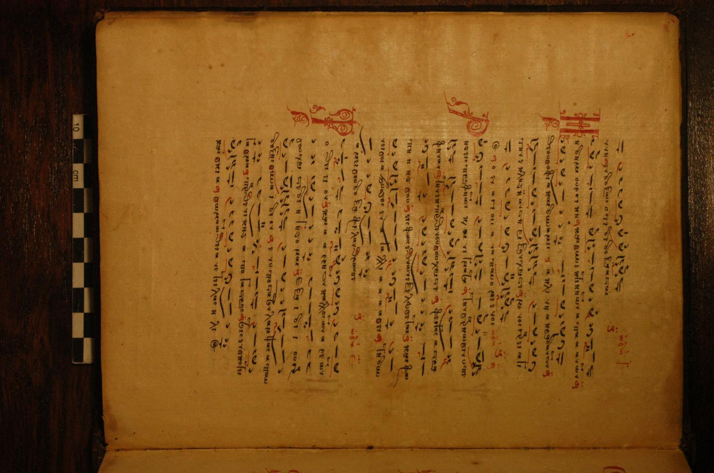

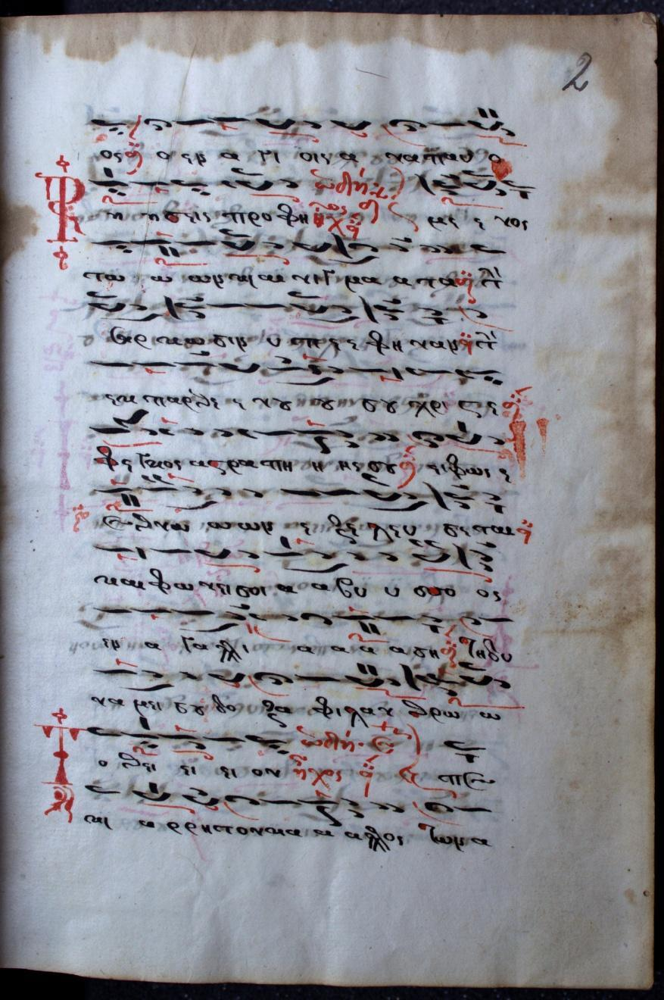
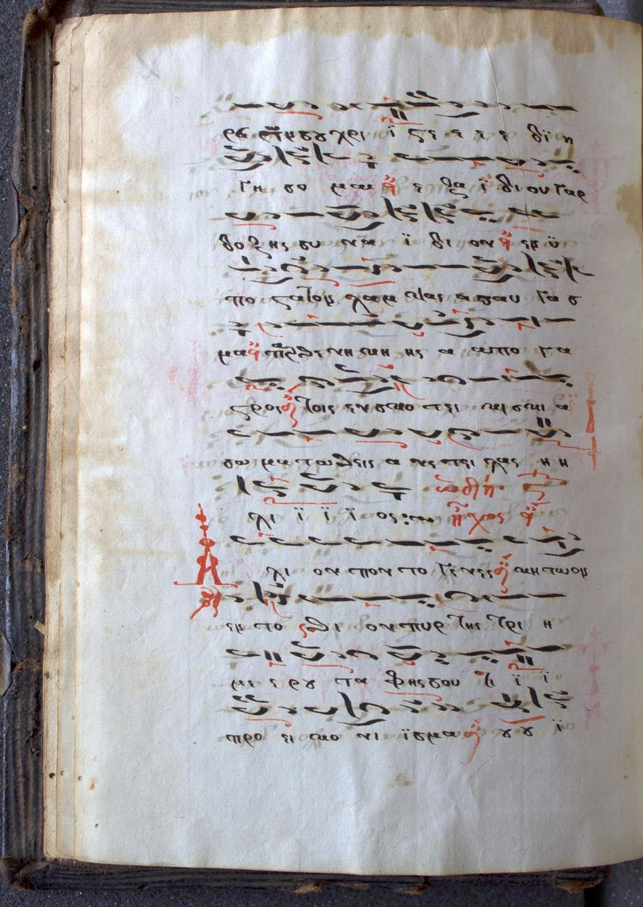

Figure 11.16. In place of source 6 of the comparison: Holy Monastery of Koutloumousiou, ms no. 422, Slow Heirmologion by Petros Peloponnesios - Anthology, late 18th c. (Stathis,
1993, pp. 269-272), fols. 2r-v, with the katabasia: The divine and ineffable beauty. © Holy Monastery of Koutloumousiou, Mount Athos.

Figure 11.17. Source 7 of the comparison:
The katabasia “The divine and ineffable beauty”,
in a slow exegesis in the New Method,
from the edition: Petros Peloponnesios. (1825).
Heirmologion of the Katabasiai,
exegesis and correction by Chourmouzios
Chartophylax. Constantinople:
British Printing House of Kastrou in
Galata, repr. Athens: Koultoura, p. 4.

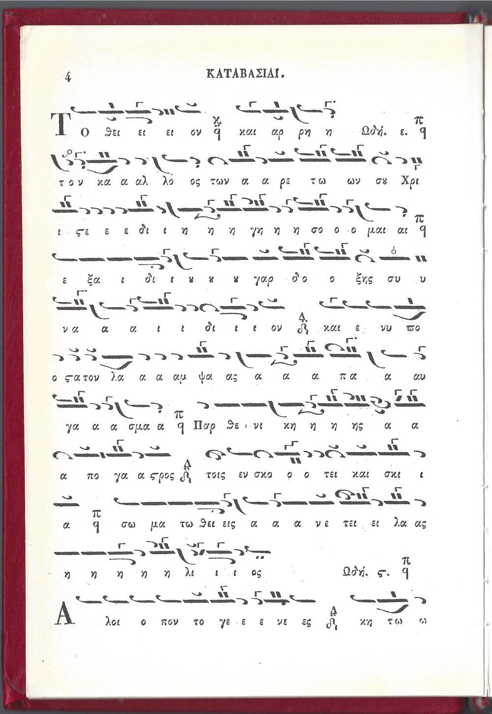

Figure 11.18. Source 8 of the comparison:
Copy with division into phrases,
from the autograph Heirmologion of Petros
Byzantios, EBE 964, fol. 9v, year 1807,
in Middle Byzantine exegetical notation
(for the ms, see Chatzigiakoumis, 1975, p. 365).

.

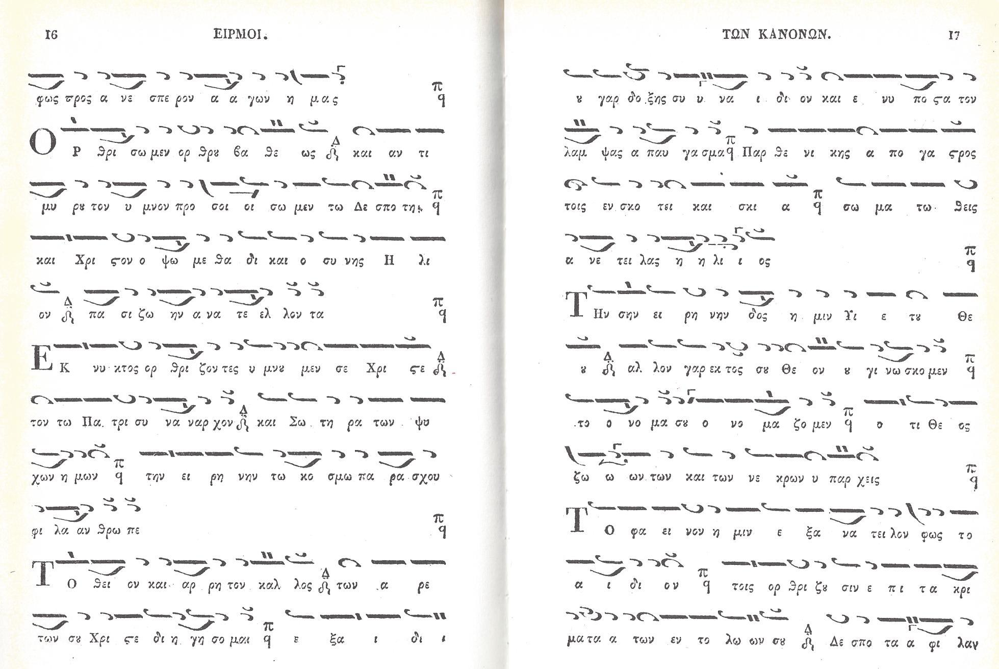

Figure 11.19. The heirmos “The divine and ineffable beauty”, in a concise exegesis in the New Method, from the edition: Petros Protopsaltes the Byzantine. (1825). Concise
Heirmologion, exegesis and correction by Chourmouzios Chartophylax. Constantinople: British Printing House of Kastrou in Galata, repr. Athens: Koultoura, pp. 16-

1. 601

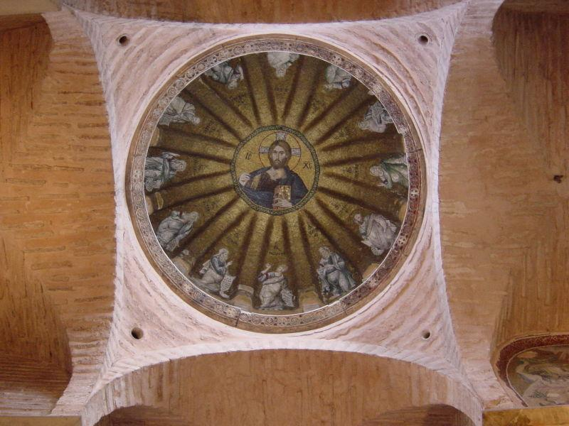

Figure 11.20. Christ Pantokrator. Dome of the Holy Monastery of the Pammakaristos, Constantinople, ca. 1310.
Sources: For the photograph: <https://commons.wikimedia.org/wiki/File:Istanbul_-_Chiesa_Pammacaristos_(Fetiye_camii)_-_Cupola_-_Foto_G._Dall%27Orto_26-5-2006.jpg>
(4.11.2016). For the caption: Chatzidaki (1994, pp. 180, 253 and fig. 169).

### 5.3. Sticheraric melodies

#### 5.3.1. The last sticheron of the Great Hours of Great Friday, "Today he is hung upon the wood", in plagal second mode

##### 5.3.1.1. The old, Byzantine, classical style, from the Sticherarion edited by Saint John Koukouzeles, EBE 884

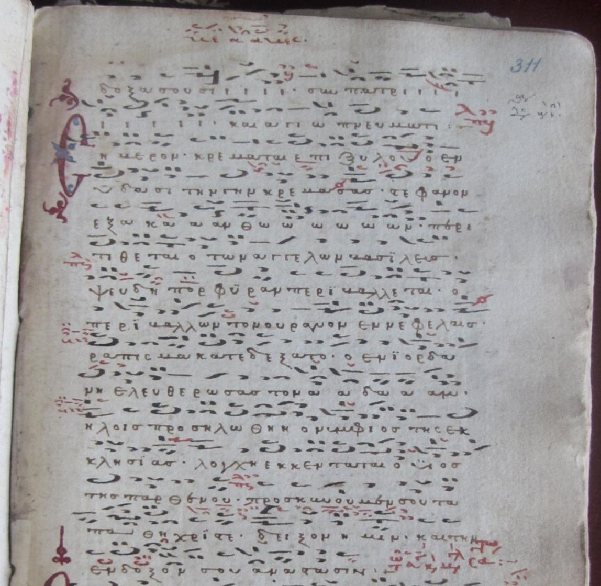

Figure 11.21. The doxastikon of the Ninth Hour of Great Friday, “Today he is hung upon the wood”, from ms EBE 884, fol. 311r, year 1340/1, Middle Byzantine fully
developed notation. © National Library of Greece.

##### 5.3.1.2. The beginning of the doxastikon “Today he is hung upon the wood” in diachronic development: comparison of sources (Figures 11.22.a-b)

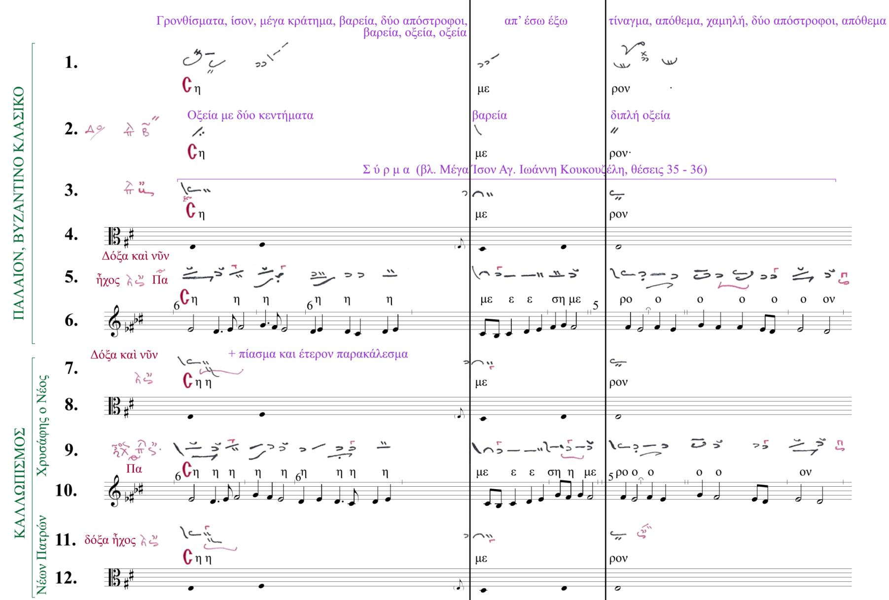

Figure 11.22.a. The beginning of the twelfth troparion of the Great Hours of Great Friday, “Today he is hung upon the wood”, in plagal second mode: comparison of sources (second
half of the 11th c. to the year 1836). The Middle Byzantine notation is accompanied by transliterations, while the exegeses of Chourmouzios are accompanied by schematic transcriptions.xxvii

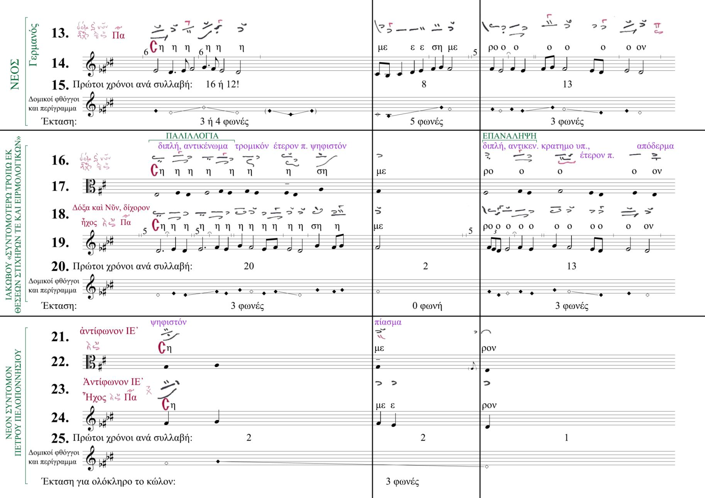

Figure 11.22.b. Continuation of the comparison of sources for the beginning of the twelfth troparion of the Great Hours of Great Friday, “Today he hangs upon the
tree,” in plagal 2nd mode. The individual sources and brief comments are given below.
605

Sources and other clarificationsxxviii for Figures 11.22.a-b

 Various styles of setting are compared: Old: nos. 1-6 | New embellishment by Chrysaphes the New and Germanos of New Patras: nos. 7-15 | “in a more concise manner, from

sticheraric and heirmologic formulae (theseis)” by Iakovos Protopsaltes: nos. 16-20 | New concise style by Petros Peloponnesios: nos. 21-25.

-  All the settings are from the Ninth Hour of Great Friday, except for the chant by Petros Peloponnesios, which is from the Service of the Passion.

- √ Manuscript codices and printed editions:

1. Vatopedi 1488, fol. 118a, second half of the 11th c., Athonite notation (Chartres IV): Follieri & Strunk (eds., 1975, Triodum Athoum, MMB, Facsimiles IX). Floros (1970,
vol. I, p. 55).

1. Vindobonensis theol. gr. 136, fol. 228b, first half of the 12th c., Hagiopolite notation (Coislin V): Wolfram (ed., 1987, Sticherarium antiquum Vindobonense, MMB,
Facsimiles X). Floros (1970, vol. I, pp. 57-58).

1. Ambrosianus A 139 sup., fol. 246a, year 1341, fully developed Middle Byzantine notation: Perria & Raasted (eds., 1992, Sticherarium Ambrosianum, MMB,
Facsimiles XI).

1. MPT 715, fol. 192b, first half of the 19th c., autograph of Chourmouzios Chartophylax with an exegesis of the Old Triodion and Pentecostarion in the New Method: Papadopoulos-
Kerameus (1915, vol. V, p. 245). Stathis (2016, vol. II, p. 315).

1. MPT 552, fol. 222b, Sticherarion of Chrysaphes the New, year 1705, late Middle Byzantine notation: Papadopoulos-Kerameus (1915, vol. V, p. 110).

1. MPT 765, fol. 96a, year 1835-1836, autograph of Chourmouzios Chartophylax with an exegesis of the Sticherarion of Chrysaphes the New, in Neo-Byzantine notation:

Papadopoulos-Kerameus (1915, vol. V, p. 257) and Chatzigiakoumis (1975, p. 389).

1. EBE 975, p. 600, Sticherarion of Germanos of New Patras, year 1774, late Middle Byzantine notation: A. & I. Sakkelion (1892).

2. MPT 750, fol. 299b, year (1831?)-1832, autograph of Chourmouzios Chartophylax with an exegesis of the Sticherarion (Triodion-Pentecostarion) of Germanos of New Patras in the
New Method: Chatzigiakoumis (1975, p. 389).

3. Vatopedi 1254, fol. 209a, Doxastarion of Iakovos Protopsaltes, autograph of Ioannikios, hieromonk of Vatopedi from Chios, year 1775-1800, exegetical Middle Byzantine
notation. We thank Fr. Nektarios Paris for this information. For the definition of the musical texture (“in a more concise manner...”), see Stathis (1993, p. 1).

4. Iakovos Protopsaltes, Doxastarion, exegesis by Chourmouzios Chartophylax (1836, repr. Katerini 1990, vol. II, p. 307).

5. Vatopedi 1254, fol. 106a, Doxastarion of Petros Peloponnesios, exegetical Middle Byzantine notation (for the remaining details see above, no. 16).

6. Petros Lampadarios the Peloponnesian, Concise Doxastarion (ed. P. Ephesios, 1820, repr. Koultoura, p. 367).

√ Transliterations and transcriptions: The sources in Middle Byzantine notation are accompanied by transliterations of their metrophonic structure onto the staff,
with no indication of rhythm (nos. 4, 8, 12, 17, 22). By contrast, the sources in the New Method are accompanied by schematic transcriptions on the staff (nos. 6, 10, 14, 19, 24). To
facilitate the comparative study of the transliterations and transcriptions, the C clef on the third line was used for the former, and the G clef on the second line for the latter.
In this way the theoretical bases of the plagal 2nd mode are preserved according to both the Old and the New System (Vou and Pa,
respectively), while the visual appearance remains unified. For further information, cf. Alexandru (2010, pp. 20-25, 30-31, 54-55, 61-66, 79, 84-89).

- √ Musicological analyses:

1. For a better understanding of the process of slow and concise exegesis, and consequently also of rhythmic development along the various paths, the various
exegeses are accompanied by a reductive or transformational analysis (nos. 15, 20, 25), which reveals:

1. the number of primary time-units per syllable,

1. the structural notes of the exegesis and its melodic outline (per syllable for the slow chants | for the whole colon (kōlon) for the concise chant by Petros
Peloponnesios). The structural notes, as the pillars of the chant, are rendered by white diamonds, while for the drawing of the outline of the chant black diamonds are also used
(for the highest and lowest notes of a motion) and diagonal lines (where there is stepwise motion). A broken legato
indicates the extended presence of a note on a particular syllable or phrase.

1. Below is indicated the range (ambitus) of the melodic movement recorded by the exegesis (per syllable for the slow chants | per phrase for the concise ones).

B. Also, starting from the sources in Middle Byzantine notation, elements of micro-syntactic analysis (names of formulae) and analysis of
musical-rhetorical figures (imitation of the meanings, palillogy, repetition) are also given (see nos. 1-3, 7, 16, 21).

A compact exegetical approach on the part of Chourmouzios is observed for all the chants of the old sticheraric genus (i.e. the old style proper, as
well as the new embellishment and Iakovos). For justificatory evidence concerning the unified transcriptional practice, cf.

- Stathis (1992, p. 45): classification of all the aforementioned styles in the group of the old sticheraric genus,

- Psachos (1978, pp. 52-54): identical rendering of formulae, whether or not these were accompanied by the corresponding red great sign (e.g. ouranisma),

- Karas (1933, pp. 26-27): on the one hand, the multiplication of great signs in the new embellishment, and, on the other, the appearance of written exegesis, both in an era when the art of cheironomy was weakening, within the broader context of the dismantling of the grand Byzantine system of choirs during the Ottoman period: cf. also Spyrakou (2008, especially pp. 539-541).

#### 5.3.2. The first sticheron of the Great Hours of Christmas, “Bethlehem, make ready,” in plagal 4th mode: comparison of sources

Figures 11.23-25

The object of the next comparison of sources from the 11th-19th centuries, in various styles of sticheraric setting, is the sticheron “Bethlehem,
make ready.” As in the previous example, the following chants are compared with one another:
old style (Figures 11.23 and 11.24.a),
new embellishment (Figure 11.24.b),
setting by Iakovos “in a more concise manner, from sticheraric and heirmologic formulae” (Figure 11.24.c, upper part), and
setting by Petros Peloponnesios, in the new concise sticheraric style (Figure 11.24.c, lower part).

For each style the following were selected:
 A dux in Middle Byzantine notation, whose vocal signs are transliterated onto the staff,

 the corresponding exegesis in the New Method, which appears at the bottom of each section and is accompanied by
staff,

-  a series of other representative sources.

- schematic transcription on the

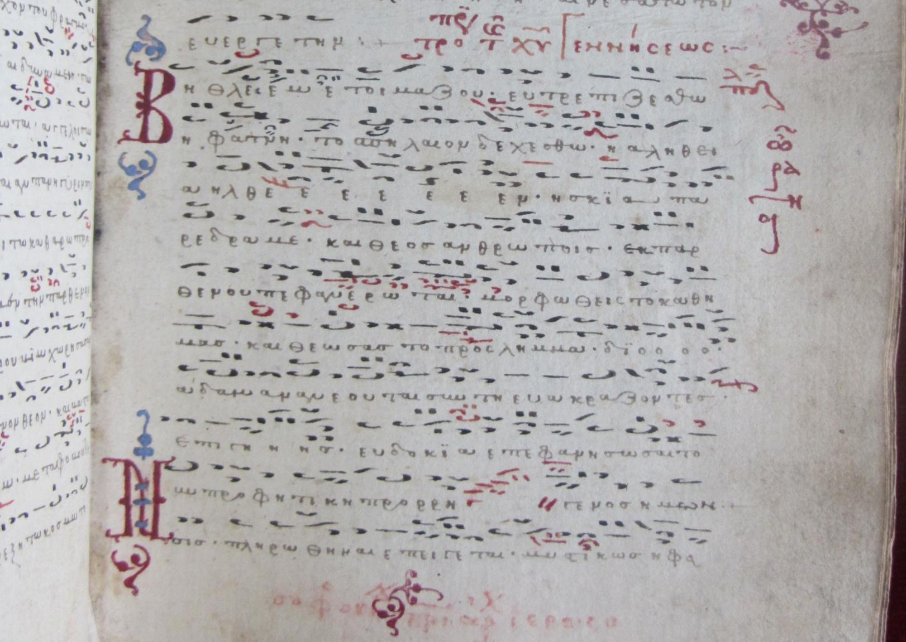

Figure 11.23. The first sticheron of the Great Hours of Christmas, “Bethlehem, make ready,” from ms. EBE 884, fol. 104r, year 1340/1.

- © National Library of Greece. 608

1.

2.

3.

4.

5.

6.

7.

8.

9.

9.b

1.

2.

11.b

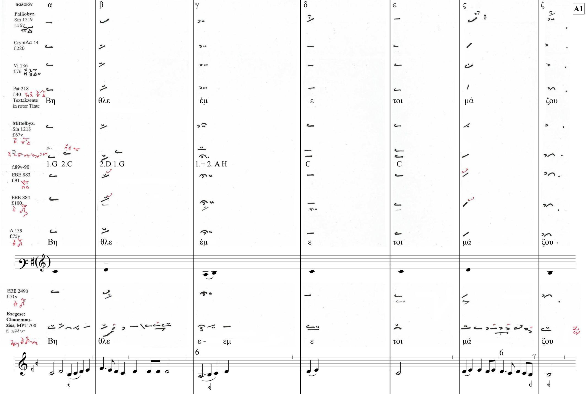

Figure 11.24.a. Comparison of the sticheron “Bethlehem, make ready,” in plagal 4th mode: sources for the old style (Byzantine, classical).   
609

1.

2.

3.

14.b

1.

2.

3.

4.

5.

6.

7.

21.b

1.

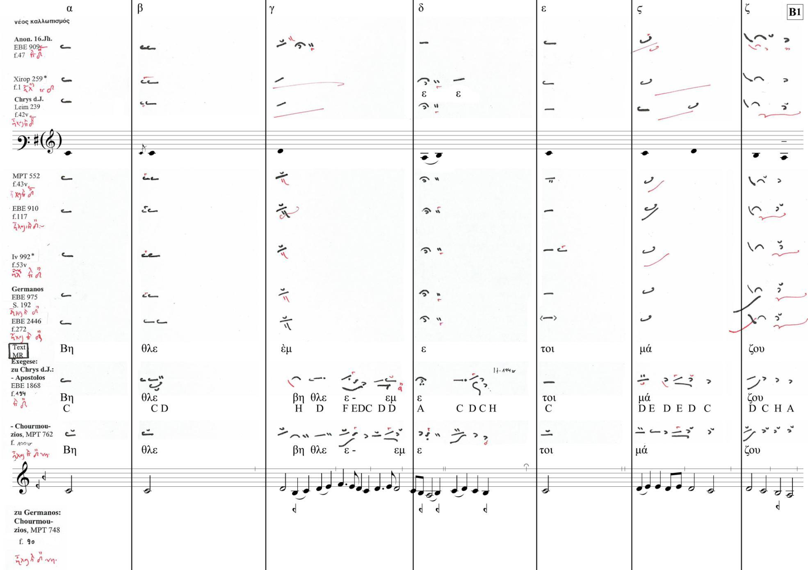

Figure 11.24.b. Continuation of the comparison of the sticheron “Bethlehem, make ready,” in plagal 4th mode: sources for the style of the new embellishment. 
610

1.

23.b

1.

2.

25.b

1.

26.b

1.

27.b

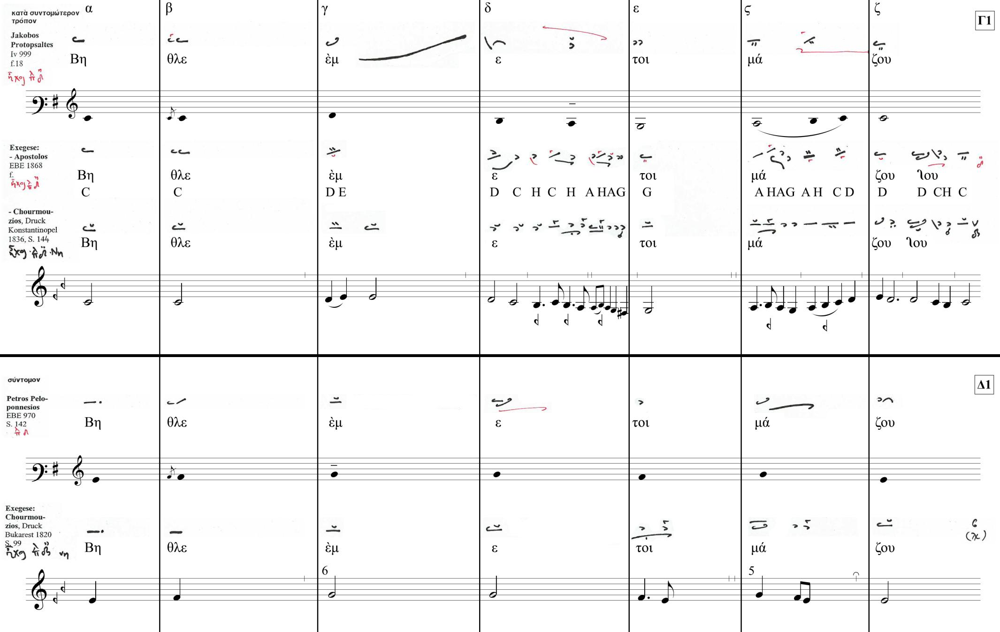

Figure 11.24.c. Continuation and conclusion of the comparison of the sticheron “Bethlehem, make ready,” in plagal 4th mode: sources for the settings by Iakovos Protopsaltes

   and by Petros Peloponnesios  . Source of Figures 11.24.a-c: Alexandru (2000, vol. III, pp. 20, 35, 50).
611

In Figures 11.24.a-c. the first colon of the sticheron “Bethlehem, make ready” was presented on the basis of the following sources

Old style

- Manuscripts in Old Byzantine notation:

1. I.M. of Saint Catherine, Sinai 1219, Athonite notation (Chartres III), mid-11th century (Floros, 1970, vol. I, p. 55. Balageorgou & Kritikou, 2008, p. 31).

2. Grottaferrata Da 14, Hagiopolite notation (Coislin IV), mid-11th century (Floros, 1970, vol. I, p. 56).

3. Vindobonensis theologicus gr. 136, Hagiopolite notation (Coislin V), first half of the 12th century (Wolfram). See Wolfram (ed., 1987, MMB, Facsimiles X) and Floros (1970, vol. I, pp. 57-58).

4. Patmos 218, Hagiopolite notation (Coislin VI and, for some stichera that do not belong to the usual repertoire: Coislin V): Floros (1970, vol. I, pp. 60-61 and 324-325).

- Manuscripts in Middle Byzantine notation:

1. Sinai 1218, dated 1177, in Middle Byzantine notation of a transitional stage. See Balageorgou & Kritikou (2008, pp. 29-31) and endnote ii in chapter 7 of the present
handbook.

1. Codex Vindobonensis theol. gr. 181, "Dalassenos", dated 1221: Høeg, Tillyard & Wellesz (eds., 1935, MMB, Facsimiles I). See also Floros (1970, vol. I, p. 61).

1. EBE 883, 14th century (Raasted, 1995b, p. 262).

1. EBE 884, dated 1340/1, a copy from a Sticherarion corrected by Saint John Koukouzeles.

9a. Codex Ambrosianus A 139 sup., dated 1341: Perria & Raasted (eds., 1992, MMB, Facsimiles XI). 9b. Transnotation.

1. EBE 2490: 14th century (Politis & Politi, 1991).

- Manuscript in the New Method:

11a. Metochion of the Holy Sepulchre 708, first quarter of the 19th century, autograph of Chourmouzios Chartophylax with the exegesis of the Old Sticherarion, vol. II: see Papadopoulos-Kerameus (1915, vol. V,

1. 242-243). Stathis (2016, vol. II, p. 256). 11b. Schematic transcription. New embellishment:

- Anonymous reworkings:

1. EBE 909, 16th century (Sakellion, 1892).

2. Xeropotamou 259, mid-17th century (Stathis, 1975b, p. 7).

- Embellishment by Chrysaphes the New:

14a. Leimonos 239, dated 1672/3, with as its exemplar (ανθίβολο) an autograph Sticherarion of Chrysaphes the New (Chatzigiakoumis, 1980, p. 131). 14b. Transnotation.

1. MPT 552, dated 1705, Sticherarion of Chrysaphes the New (Papadopoulos-Kerameus, 1915, vol. V, p. 110)

2. EBE 910, Sticherarion of Chrysaphes the New (Sakellion, 1892).

3. Iviron 992, dated 1672, Sticherarion of Chrysaphes the New (with minor changes), in an autograph by Balasios the Priest (Stathis, 1993, p. 866)

- Embellishment by Germanos of New Patras:

1. EBE 975, dated 1774, Sticherarion of Germanos of New Patras (Sakellion, 1892).

2. EBE 2446, dated 1770, Sticherarion of New Embellishment (Politis & Politi, 1991).

- Exegeses for Chrysaphes the New:

1. EBE 1868, dated 1821, autograph of Apostolos Konstas of Chios in explanatory Middle Byzantine notation (Apostolopoulos, 2002, p. 51).

21a. MPT 762, ca. 1830-35(?): exegesis by Chourmouzios Chartophylax in the New Method (Stathis, 2016, vol. II, p. 328). 21b. Schematic transcription.

- Exegesis for Germanos of New Patras:

1. MPT 748. Mixed collation: positive for the modal signatures (μαρτυρίες), negative (only the differences are recorded) for the remaining signs. Setting by Iakovos Protopsaltes:

23a. Iviron 999, late 18th-early 19th century (Stathis, 1993, p. 906), Complete Works of Iakovos Protopsaltes. 23b. Transnotation.

- Exegeses:

1. EBE 1868: see above, no. 20.

25a. Printed Doxastarion of Iakovos Protopsaltes (1836), with exegesis by Chourmouzios Chartophylax in the New Method. 25b. Schematic transcription.
Setting by Petros Peloponnesios:
26a. EBE 970, dated 1791, Doxastarion of Petros Peloponnesios (Sakellion, 1892). 26b. Transnotation.
27a. Printed Doxastarion of Petros Peloponnesios (1820), with exegesis in the New Method. 27b. Schematic transcription.

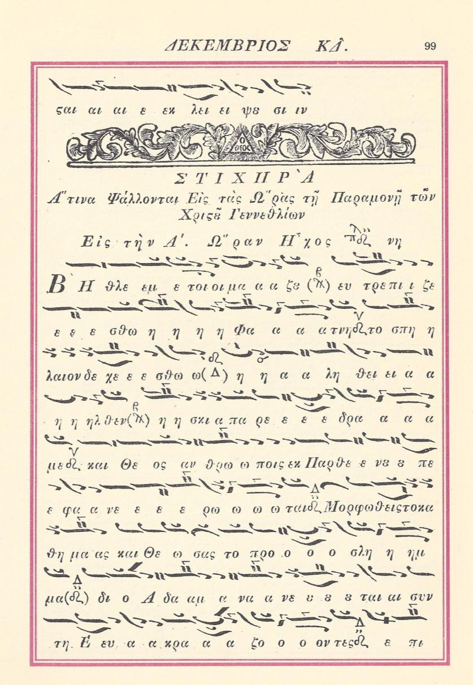
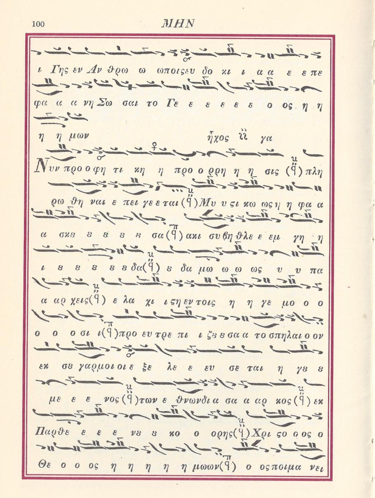

Figure 11.24.d. The doxastikon «Bethlehem, make ready» by Petros Peloponnesios, exegesis in the New Method. Source: Petros Peloponnesios. (1820). Brief
Doxastarion. Ed. Petros Ephesios. Bucharest (repr. Athens: Koultoura), pp. 99-100.  

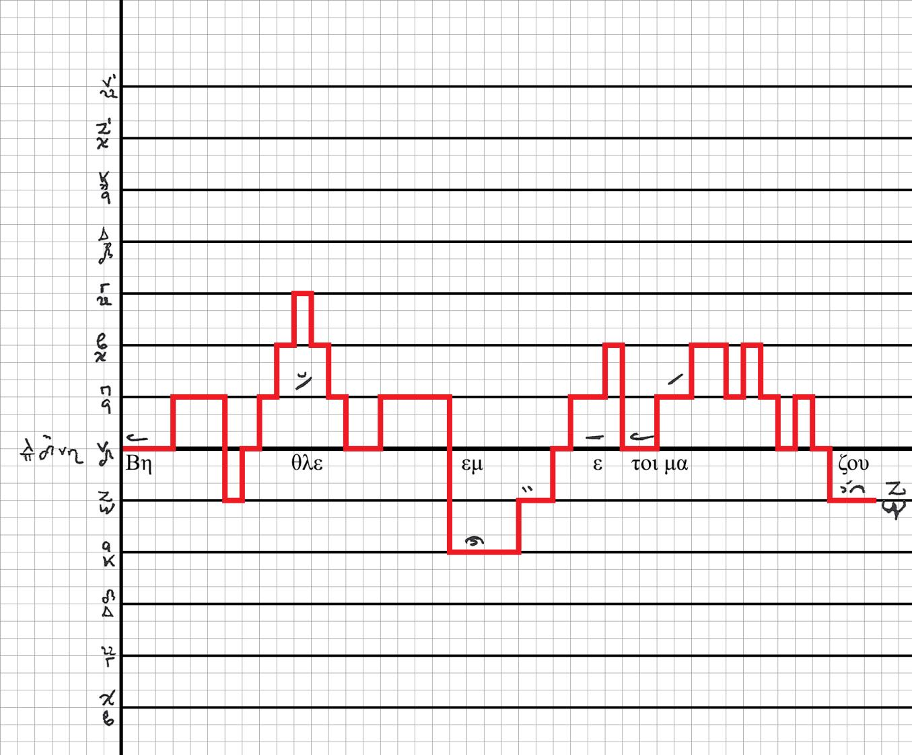
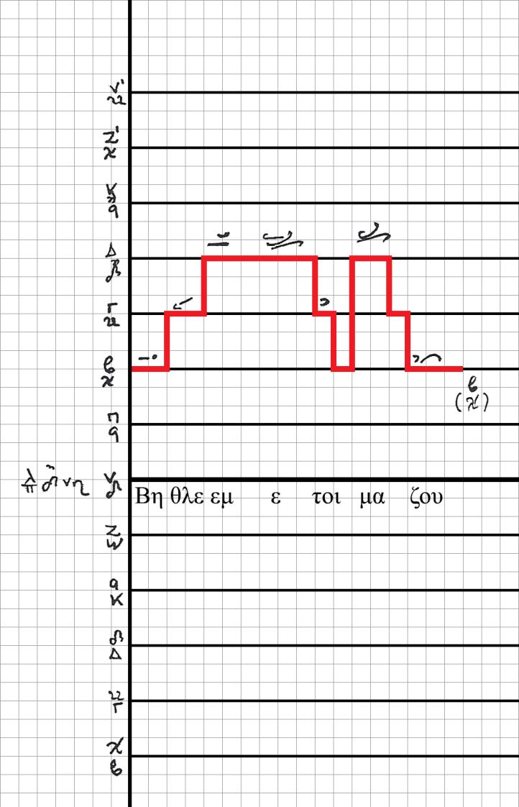

Figure 11.25. Schematic representation of the relationship between notation and melody in the old and the new brief style of setting the sticheron «Bethlehem, make ready»: the example of the
first hemistich.
Sources: the diagrams are based on sources nos. 9, 11, 26, and 27 of the collation found in Figures 11.24.a & c and were taken from: Alexandru (2000, vol. III,
p. 91).

### 5.4. Papadic chants

#### 5.4.1. Funeral Trisagion athēnaïkon (ἀθηναίϊκον), in plagal second mode nenanō

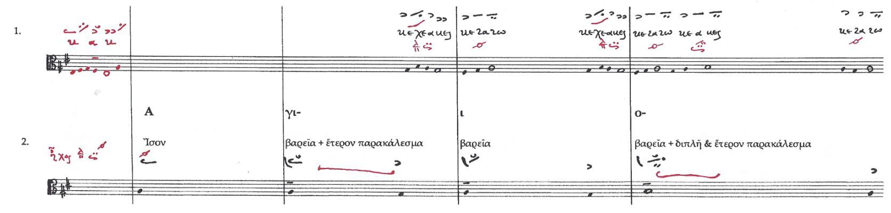

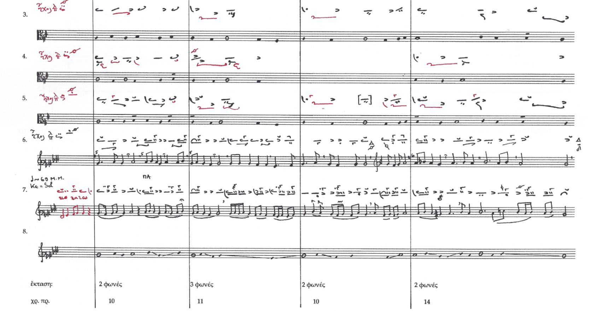

Figure 11.26. Collation of sources for the beginning of the Athenian Trisagion for the Departed, mode plagal second nenano. Source: Alexandru, Maria. (2010). Exegeseis and
transcriptions of Byzantine music. A brief introduction to their problematics. Thessaloniki: University Studio Press, 2010, pp. 84-85. By kind
permission of the aforementioned publishing house.

The collation in Figure 11.26 took as its point of departure: Psachos (1987, pls. XI, XII and XXXI).

1. Restoration of the parallage (παραλλαγή) for the beginning of the Trisagion for the Departed (see no. 2 of the collation), on the basis of the following sources: Sinai 1218, fol. 271r. Raasted
(1966, p. 48). EBE 968, fol. 183r. Apostolopoulos (2002, p. 125). Chrysanthos (1832, §§ 246-247). It is accompanied by a transnotation onto the staff.

1. “Trisagion for the departed called Athenian, sung slowly,” from ms Iviron 1250, fol. 211v, in late Middle Byzantine notation, and
staff transnotation (see also Figure 11.2).

1. The exegesis of Balasios (explanatory Middle Byzantine notation), for the Trisagion for the Departed, with the rubric “the same was explained by me,” from
ms Iviron 1250, fol. 212r (see also Figures 11.2-3). It is accompanied by staff transnotation. This is one of the two oldest
surviving exegeseis in Byzantine notation (the other exegesis by Balasios concerns the Allelouiarion in protobarys mode, by Theodoulos
the monk). It is accompanied by transnotation onto the staff.

1. Beginning of the same piece from the Anthology Bruxelles, Bibliothèque royale IV 515, late 18th c., fol. 390r, as “explained by kyr Theodoulos.”

This is Theodoulos the Athonite monk, from the second half of the 18th c. (Stathis, 1975b, p. 51). It is accompanied by staff transnotation.

1. “For the departed, exegesis by the same kyr Petros” (Petros Peloponnesios), from ms Dionysiou 568, fol. 152v, early 19th c., autograph
of Apostolos Konstas of Chios (Stathis, 1976, p. 693), with staff transnotation.

1. “Asmaticon for the departed, ancient melos”: exegesis by Gregorios Protopsaltes in the analytical notation of the New Method (Ioannes Lampadarios &
Stephanos the First Domestikos, Pandekte, 1851, vol. II, p. 834) and schematic transcription onto the staff.

1. Recording of the performance by the Archon Protopsaltes of the Most Holy Archdiocese of Constantinople, Mr Lykourgos Angelopoulos (17
February 1998), in very analytical New Byzantine notation and with detailed staff transcription. The key signature is according to the measurements of S.
Karas.

1. Musicological analysis of the phenomenon of exegesis: on the staff the structural pitches are shown with white notes. With black notes and oblique
lines the movement of the melos around the dominant pitches is represented. Below the staff, the range and duration of the
exegesis are indicated for each thesis.

#### 5.4.2. From the “Theotoke Parthene” by Petros Bereketes: Parakletike thesis, in mode 4

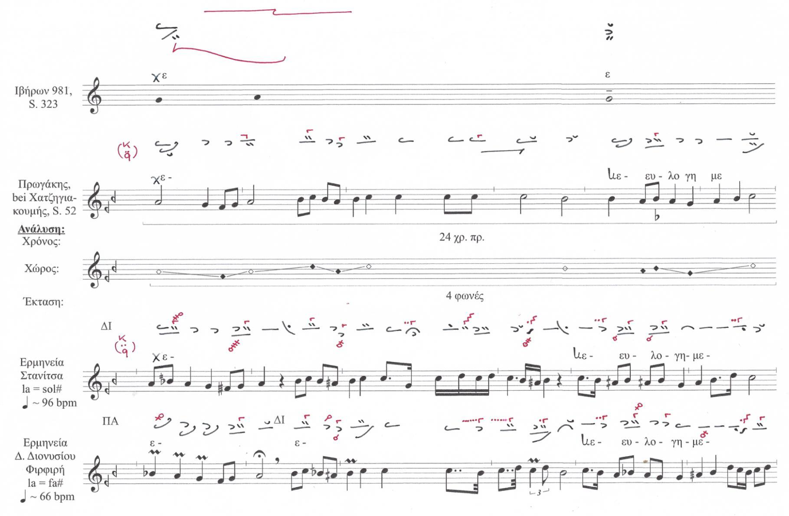

- 

- 

- 

- 

- 

- 

- 

- 

- 

Figure 11.27. Collation of sources from the written and oral tradition, for an excerpt from the eight-mode and double-choir mathema “Theotoke Parthene” by Petros
Bereketes. The Middle Byzantine notation is accompanied by a transnotation, while the notation of the New Method is accompanied by transcriptions ( schematic,  and  detailed transcriptions).
Source: Alexandru (2008, p. 318). The collation is based on ms Iviron 981 (18th c.-early 19th: Stathis, 1993, p. 795), as well as on the recordings and accompanying booklets
by Manolis Chatzigiakoumis. (2001). Monuments of Ecclesiastical Music, First Corpus, Oktaechia, Melē & Systems, Vol. II, 3 & 4. Theotoke Parthene by Petros Bereketes. Sung by
Thrasyboulos Stanitsas, Archon Protopsaltes of the Ecumenical Patriarchate, and Father Dionysios Firfiris, Protopsaltes of the Protaton of Mount Athos. Athens: Centre for Research &
Publications.

#### 5.4.3. The beginning of the Cheroubikon by Petros Bereketes, sung also in all eight modes, from the same original notation

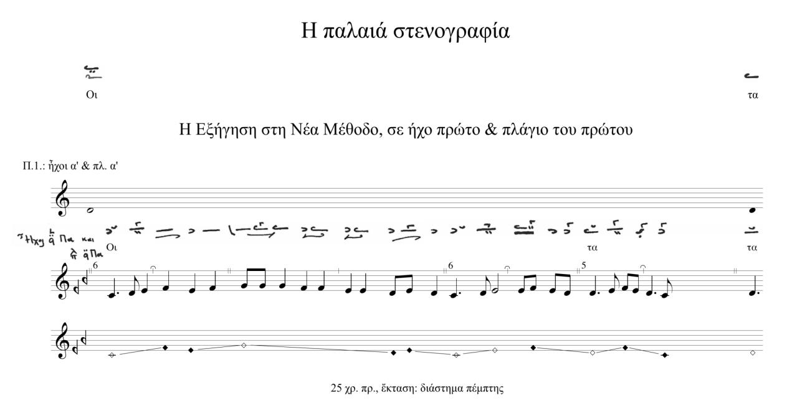

1st: Dorian - “preserves a solemn and weighty character,
or a magnificent and dignified one”
Pl. 1st: “the ethos of the Plagal First mode tends toward the
compassionate and mournful...”
(Chrysanthos, Theoretikon, §§ 324, 354)

Figure 11.28.a. Cheroubikon by Petros Bereketes, which is sung also in all eight modes, on the basis of a single record in late Middle Byzantine notation. Here together with the
exegesis of Chourmouzios for the first and plagal first modes. The old notation is accompanied by staff transnotation, while Chourmouzios’s exegesis is accompanied by schematic
transcription. On the last staff: musicological analysis of the exegesis: a. structural pitches in white diamonds, the melodic contour with black diamonds and oblique
lines for stepwise motion, b. total duration of the first syllable in primary time-units, c. extent of the exegesis for the first syllable.
Sources: For the Old Method: ΜΠΤ 712, autograph of Chourmouzios Chartophylax, fol. 86r: Manolis Chatzigiakoumis. (2002). Monuments of Ecclesiastical Music, First Corpus, Oktaecha
Melē & Systems, Vol. IV, 7 & 8. Cheroubikon Sung Also in All Eight Modes by Petros Bereketes. Sung by Dimitrios Nerantzis, Protopsaltes of Tinos. Athens: Centre for Research &
Publications, p. 131. For Chourmouzios’s exegesis: Chatzigiakoumis (2002, p. 29). Alexandru (2010, para. 15).

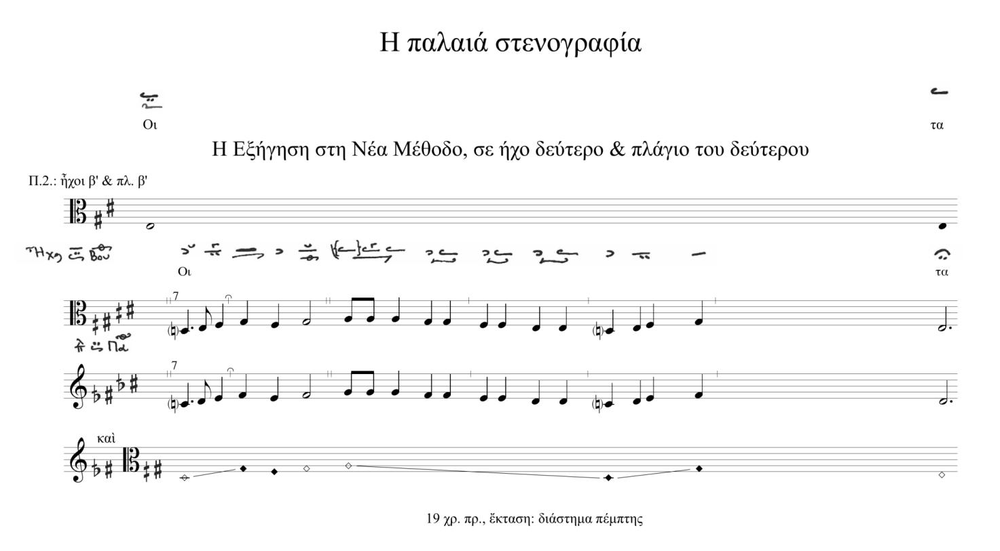

2nd: Lydian: “preserves a character that inspires [...] and also
grieves”
Pl. 2nd: “preserves a character suited to funeral songs, and
to lofty and divine meditations.”
(Chrysanthos, Theoretikon, §§ 332, 361)

Figure 11.28.b. Cheroubikon by Petros Bereketes, which is sung also in all eight modes, on the basis of a single record in late Middle Byzantine notation.
Here together with the exegesis for the second and plagal second modes. Key signatures according to Karas’s measurements. Sources: Chatzigiakoumis (2002, pp. 131 and 47). Alexandru (2010, para. 15).

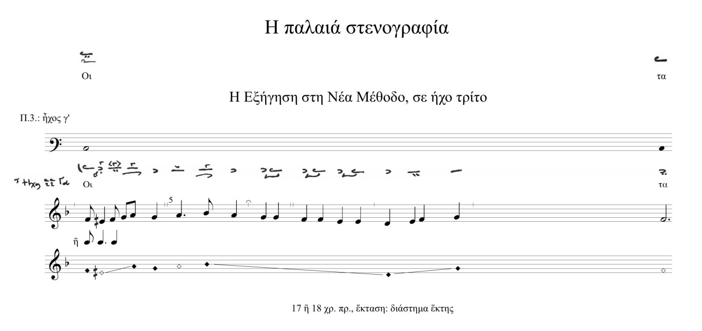

## 3rd: Phrygian: “elegant, simple, manly” (Chrysanthos, Theoretikon, § 339)

Figure 11.28.c. Cheroubikon by Petros Bereketes, which is sung also in all eight modes, on the basis of a single record in late Middle Byzantine notation.
Here together with the exegesis for the third mode. Sources: Chatzigiakoumis (2002, pp. 131 and 63). Alexandru (2010, para. 15).

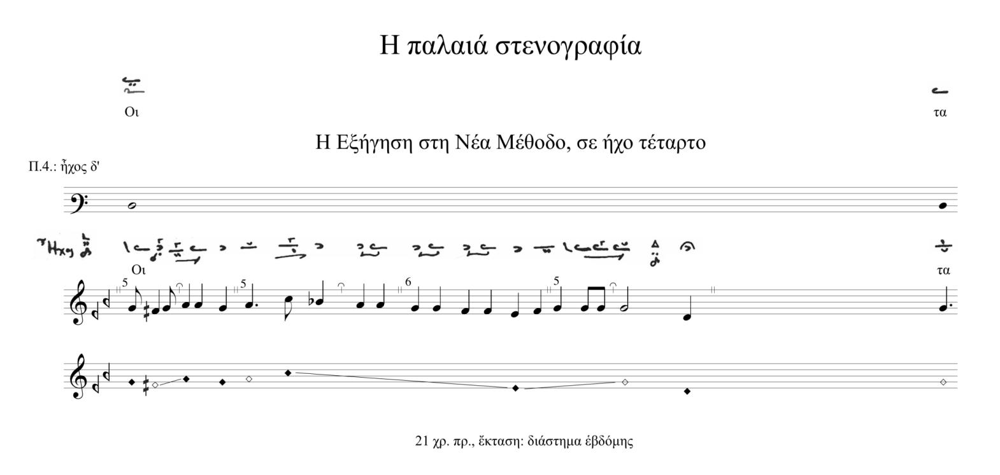

## 4th: Mixolydian: “preserves the dignified and magnificent character” (Chrysanthos, Theoretikon, § 347)

Figure 11.28.d. Cheroubikon by Petros Bereketes, which is sung also in all eight modes, on the basis of a single record in late Middle Byzantine notation.
Here together with the exegesis for the fourth mode. Sources: Chatzigiakoumis (2002, pp. 131 and 78). Alexandru (2010, para. 15).

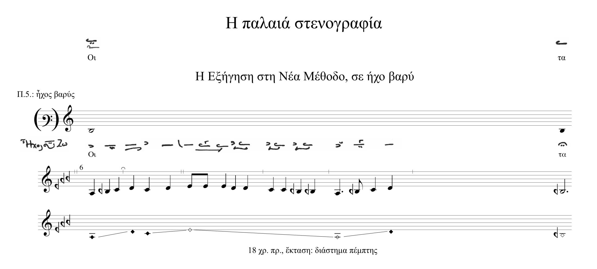

Barys: “the ethos of the Barys mode tends toward the hesychastic” (Chrysanthos, Theoretikon, § 368)

Figure 11.28.e. Cheroubikon by Petros Bereketes, which is sung also in all eight modes, on the basis of a single record in late Middle Byzantine notation.
Here together with the exegesis for the barys mode. Sources: Chatzigiakoumis (2002, pp. 131 and 95). Alexandru (2010, para. 15).

The old shorthand notation

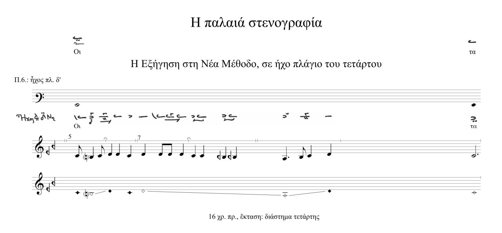

Pl. 4th: “The ethos of the Plagal Fourth mode preserves a character
tending toward the charming, pleasurable [...] it also tends toward the
solemn” (Chrysanthos, Theoretikon, § 375)

Figure 11.28.f. Cheroubikon by Petros Bereketes, which is sung also in all eight modes, on the basis of a single record in late Middle Byzantine notation.
Here together with the exegesis for the plagal fourth mode. Sources: Chatzigiakoumis (2002, pp. 131 and 111). Alexandru (2010, para. 15).

## 6. More recent investigations

During the twentieth century and up to the present, various musicologists have attempted to trace possible
ways of interpreting the old notation also in a shorter manner, for cases in
which the Three Teachers had recorded only slow exegeseis. Simon Karas proposed, for example, an
exegesis for the Christmas doxastikon by Saint Kassiane, When Augustus ruled alone, in an
argo-syntomon musical texture. As his point of reference he had the form of exegesis that we encounter in the
Doxastarion of Petros Peloponnesios.xxix
Continuing the above efforts, Ioannes Arvanitis (2003, 2006, 2010) proposed a
syllabic transcription-interpretation of heirmologic and sticheraric melē of the old Byzantine
repertoire in duple metre. This is an important tool of musicological research, which helps
in tracing the basic rhythmic structure of the old heirmologic and sticheraric compositions.
It is based on the following principles (open list):

1. The basic metre is duple. Triple metres are created only exceptionally.

2. The palaeographical unit consists of the sung syllable, not of the isolated sign (cf. Jammers, 1962, p. 51).

3. Syllables may be short (with a duration of 1 primary time-unit) or long (2 or more time-units).

4. All syllables of the text that have one emphonon (ἔμφωνο) sign above them are short.

5. Syllables with a diple, two apostrophoi, syndesmoi, or a kratema are long (with a duration of 2 time-units).

6. Syllables with composite accent signs (e.g. with dyo, apantrichisma, apeso exo, xēron klasma, anastama, etc.) are likewise long, with a total duration of 2 time-units.

7. Syllables with two kentemata last 1 time-unit (two eighth notes in the transcription).

8. Syllables with the bareia and two emphona signs last in total 1 time-unit (the bareia is one of the great signs of the group of synagmata, which gather several pitches into one time-unit: see Akribeia [ed. Schartau], lines 814-826. Karas, 1982, vol. I, p. 55).

9. An emphonon sign with a klasma also lasts one time-unit, as do two apostrophoi written obliquely and with a klasma (the so-called rapisma).

10. The duration of the apoderma may vary, depending on the context (2 or 3 time-units, according to the needs of the metre).

An example of syllabic interpretation for the heirmos of the first ode of the Canon of Christmas by
Saint Kosmas the Melodist is found below (see Figures 11.29-31):xxx

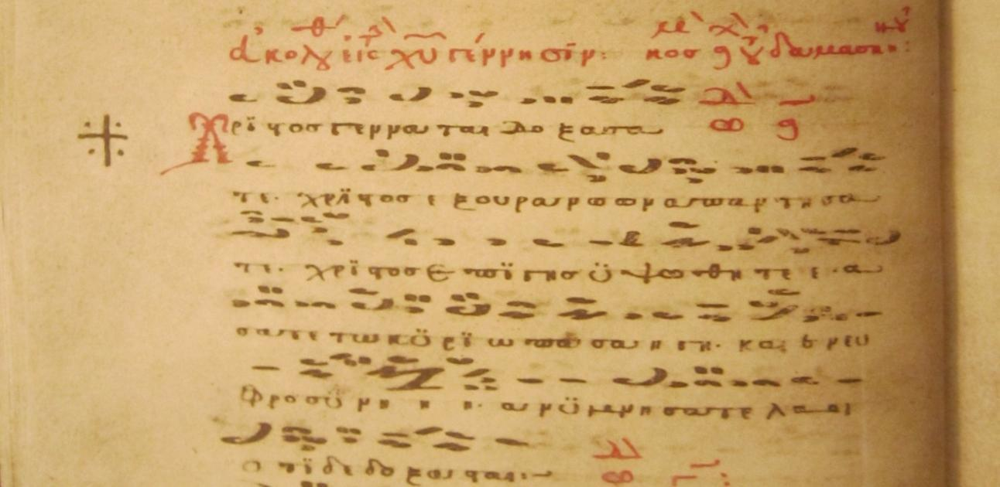

Figure 11.29. The Canon of Christmas, poem by St Kosmas the Melodist, from the Hirmologion of Grottaferrata ΕγII,
year 1281, fol. 16v, in fully developed Middle Byzantine notation (Round Notation).
Source: Tardo, Lorenzo. (Ed., 1951). Hirmologium Cryptense. MMB, Facsimiles III, Pars Principalis. Roma.
By kind permission of the Monumenta Musicae Byzantinae.

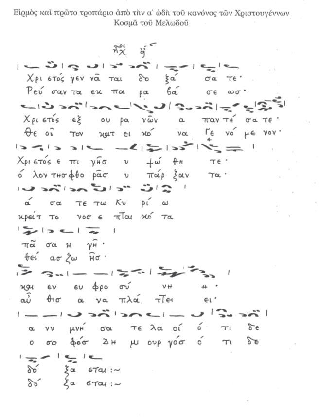
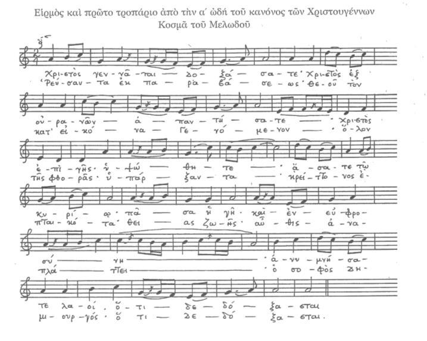

Figures 11.30-31. The heirmos of the first ode of the Canon of Christmas by Saint Kosmas the Melodist in mode 1: division into musico-poetic phrases and syllabic
interpretation by Ioannes Arvanitis, in duple metre and in staff transcription. The colours facilitate comparison of the original notation and the corresponding
proposals for rhythmic interpretation in various places that require particular attention.
Source: Arvanitis, Ioannes. (2003). The rhythmic and metrical structure of Byzantine heirmoi and stichera as a means and as the result of a new rhythmic
interpretation of Byzantine melos. In Eustathios Makris (ed.), The two aspects of the Greek musical heritage. Tribute in memory of Spyridon Peristeris,
Academy of Athens, Publications of the Centre for Research on Greek Folklore no. 18 (pp. 151-176). Athens, pp. 168 and 174. The two examples have been included
by kind permission of the author and of the Centre for Research on Greek Folklore, Academy of Athens.

## 7. Concluding remarks on the exegesis of Middle Byzantine notation

The study of Middle Byzantine notation remains at a preparatory stage if it does not proceed as far as
the so-called exegesis, that is, the traditional way of decoding Middle Byzantine
notation in liturgical practice, on the basis of the living voice.
The various stages of written exegesis can be studied through a collation of sources of the
Old Method with the New, and with manuscripts in Slavic staff notations (Kievan and
partes). Musicological analysis assists in the study of exegesis: microsyntactic (identification
of theseis), reductive (examination of the exegesis for each sung syllable, with intervallic space and
time as axes), and other forms of analysis.xxxi
From the late tradition of musical manuscripts and theoretical texts it emerges that the great
signs (ΜγΣ) belong to a “musical mental matrix” (musikalische Denkmatrixxxxii), according to which the
relation between the sign (ΜγΣ or emphonon) and what is notated is α : β, where β may depend
on the following elements:

1. the thesis (musical formula) and, possibly, its placement in the musical phrase. Even the
colour of the ink (a black or red aphonon sign) may be significant,

1. the degree, the mode, the genus of the mode,

1. the hymnographic and musical genus, the type and style of melopoeia, and the tempo. These
elements determine the way in which the piece is decoded, that is, the type of exegesis (slow,
brief) of the whole piece.
In contemporary research, even the poetic text and the conditions under which a performance takes place
are considered co-determinative for the interpretation of a piece (that is, whether it is a major feast or
an ordinary weekday, whether the service takes place in a large church or in a small village church, whether it is chanted
soloistically or by a choir),

1. the style (of a school, an era, a chanter).

Consequently, a uniform transcription of pieces in Middle Byzantine notation—whether slow
or brief—that does not take into account the above parameters remains unsuitable from a stylistic
and artistic point of view.xxxiii
It is desirable to investigate how the various aforementioned parameters evolved historically
and how old the Denkmatrix of which we have spoken is.

Byzantine melos is a sister art of Byzantine iconography. The famous Byzantine
musical theseis have been likened to the tesserae of Byzantine mosaics, which, combined with
mastery, render the holy images that traverse the centuries unchanged.
Behind every Byzantine icon there is a drawing which, with faint but sure lines,
sketches out the future image, serving as a guide for the iconographer in the pictorial rendering of the sacred
persons: see Figures 11.32-33.

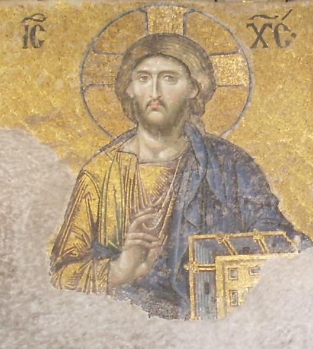
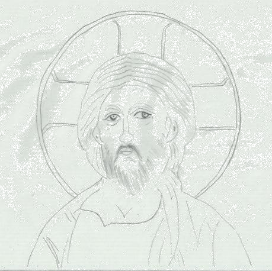

Figures 11.32-33. The Lord Jesus Christ, part of the Deesis, year 1261, Hagia Sophia, Constantinople. Drawing
based on the same mosaic.
Sources: Photograph from a personal archive and sketch based on a photograph of the mosaic from Chatzidakis (1994, p.

66). For a description of the mosaic, cf. ibid., p. 234, figs. 41-42.

By analogy, a Byzantine musical manuscript in shorthand notation records
only the basic profile of a composition, while the oral tradition—from post-Byzantine times
supported also by increasingly analytical notation—carries the melos, together with its style,
as a sacred sonic image, from generation to generation.xxxiv
Future research on the phenomenon of exegesis, continuing the studies of the already
rich and multifaceted bibliography, will be able to reveal still other, as yet unknown aspects
of this central subject of the Palaeography of Byzantine Music.

With regard to the great desideratum of publishing all the exegeseis of Chourmouzios
Chartophylax and Gregorios Protopsaltes for Byzantine and post-Byzantine compositions,
Gregorios Stathis (2016, vol. I, p. 310) notes the following:
“The work of this edition is a National Work, because the benefaction
is National (...) It concerns the resurrection of the pure
Greek Musical Culture of the long period from the end of the
thirteenth century until 1814 (...) We, the Greek heirs, will be without excuse if we
keep this national treasure, even after two hundred years,
unpublished and unrevealed in all its
breadth and its original beauty.”

Assessment criteria for Chapter 11

Assessment criterion 1

“Christ is born” II

Assessment criterion 2
“When Augustus ruled alone”

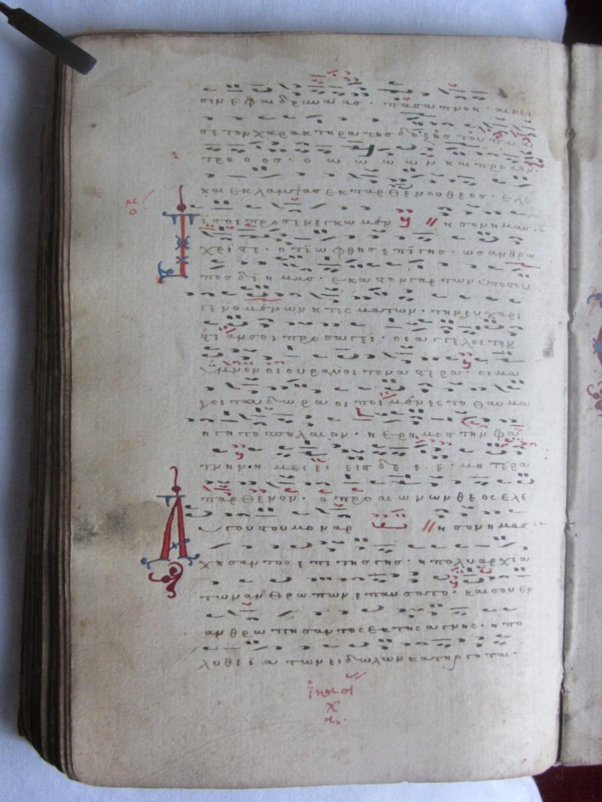





Figure 11.34.a. The Christmas sticheron, “When Augustus ruled alone,” poem by Ikasi(as mon)ach(ēs,),
from ms EBE 884, fol. 105v, year 1340/1. © National Library of Greece.

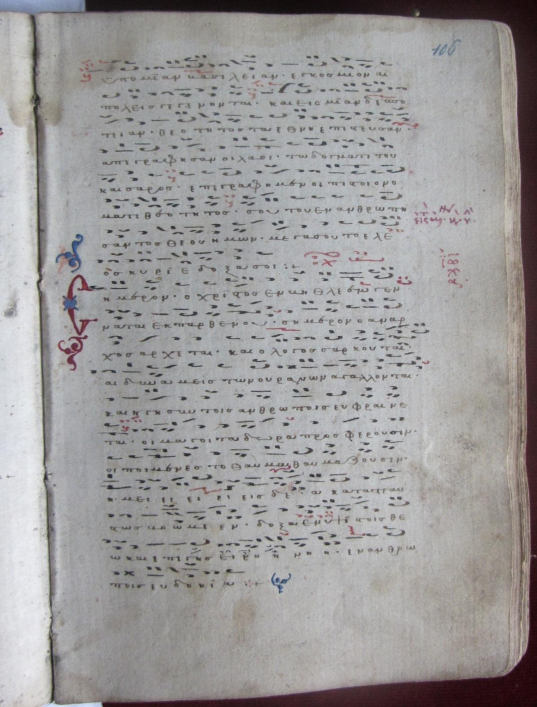

Figure 11.34.b. Continuation of the Christmas sticheron, “When Augustus ruled alone,” poem by Ikasi(as mon)ach(ēs,),
from ms EBE 884, fol. 106r, year 1340/1. © National Library of Greece.

### Assessment criterion 3

“Spring Has Dawned” II


Figure 11.35.α. The sticheron of Saint George the Great Martyr and Trophy-bearer, “Spring has dawned,” from
MS EBE 884, fol. 164r, dated 1340/1, in fully developed Middle Byzantine notation, in the old, Byzantine, classical
style. © National Library of Greece.


Figure 11.35.β. Continuation of the sticheron “Spring has dawned,” from MS EBE 884, fol. 164v, dated 1340/1.

© National Library of Greece.


Figure 11.36. The sticheron “Spring has dawned,” setting by Petros Peloponnesios, from the MS of the Holy Great Monastery of Vatopedi, no. 1253, fols. 128v-129r, dated 1789-1790,
autograph of Petros Byzantios, Middle Byzantine exegetical notation.xxxv © I.M.M. Vatopedi, Mount Athos.


Figure 11.37.α. Beginning of the sticheron “Spring has dawned,” setting by Petros Peloponnesios, exegesis in the New Method. Source: Petros Peloponnesios. (1820). Short
Doxastarion. Ed. Petros Ephesios. Bucharest (repr. Athens: Koultoura), pp. 182-183.


Figure 11.37.β. Continuation of the sticheron “Spring has dawned,” setting by Petros Peloponnesios, exegesis in the New Method. Source: Petros Peloponnesios. (1820). Short
Doxastarion. Ed. Petros Ephesios. Bucharest (repr. Athens: Koultoura), pp. 184-185.

Assessment Criterion 4
“O Heavenly King” II


Figure 11.38.α. The doxastikon of Pentecost and of the Holy Spirit, “O Heavenly King,” from MS EBE 884, fol.
340r, dated 1340/1, in fully developed Middle Byzantine notation, in the old style. © National Library of
Greece.


Figure 11.38.β. Continuation of the sticheron “O Heavenly King,” from MS EBE 884, fol. 340v, dated 1340/1.

© National Library of Greece.


Figure 11.39. The doxastikon of Pentecost and of the Holy Spirit, “O Heavenly King,” setting by Iakovos Protopsaltes, from the MS of the Holy Great Monastery of Vatopedi,
no. 1254, fols. 218v-219r, late 18th century, autograph of Ioannikios, hieromonk of Vatopedi from Chios, Middle Byzantine exegetical notation. © I.M.M. Vatopedi, Mount Athos.


Figure 11.40.α. The doxastikon “O Heavenly King,” setting by Iakovos Protopsaltes, exegesis in the New Method. Source: Iakovos Protopsaltes. (1836). Doxastarion. Exegesis by
Chourmouzios Chartophylax. Constantinople: Isaak de Castro (repr. Katerini: Tertios, 1990), pp. 374-375.


Figures 11.40.β. and 11.41. Continuation of Chourmouzios’s exegesis of the doxastikon “O Heavenly King” in the setting by Iakovos.  Andrei Rublev, The Hospitality of
Abraham - The Holy Trinity (1410s). Moscow, Tretyakov Gallery. Sources: Iakovos Protopsaltes. (1836). Exegesis by Chourmouzios Chartophylax.
Constantinople: Isaak de Castro (repr. Katerini: Tertios, 1990), p. 376.  <https://en.wikipedia.org/wiki/Andrei_Rublev#/media/File:Andrey_Rublev_->
_Св._Троица_-_Google_Art_Project.jpg (17.12.2015).

### Assessment Criterion 5

“With Golden Words”

### Assessment Criterion 6

“Let the Glory of the Lord Be”xxxvi


Figure 11.42. “Let the glory of the Lord be,” allagma (ἄλλαγμα) by the maistor (kyr John Koukouzeles), plagal
fourth mode, and other verses of the Anoixantaria, from codex NLG 2458, fol. 12r, dated 1336.xxxvii © National
Library of Greece.


Figure 11.43.a. “May the glory of the Lord be”: allagma (ἄλλαγμα) by Saint John Koukouzeles from the Anoixantaria (Ἀνοιξαντάρια), in plagal
fourth mode, in the slow exegesis of Chourmouzios Chartophylax, in the analytical notation of the New Method, from his autograph
codex ΜΠΤ 703, fols. 21v-23r, dated 1818.xxxviii The poetic text of the allagma derives from Psalm 103, verse
31a. Here the piece is divided into musical units (cola and commata), to facilitate comparative
study with the Old Method.


Figure 11.43.b. “May the glory of the Lord be,” continuation of Chourmouzios Chartophylax’s exegesis.


Figure 11.43.c. “May the glory of the Lord be,” continuation and end of Chourmouzios Chartophylax’s exegesis.

### Assessment Criterion 7

“The glorious soldier”


Figure 11.44. The kalophonic mathēma (καλοφωνικό μάθημα) “The radiant soldier,” in honour of the Holy Great Martyr Demetrios the Myrrh-streamer (26 October), a poem in
fifteen-syllable verses with a musical setting by Manuel Doukas Chrysaphes the Elder (fl. ca. 1440–1465),xxxix from the ms. of the Holy Metropolis of Zakynthos, Gritsanis Collection, no.
7, pp. 110–111, mid–second half of the fifteenth century, probably an autograph of the composer himself.xl This manuscript must have been one of the Vorlagen (exemplars) on the basis of which
Chourmouzios Chartophylax transcribed his Mathematarion. © Holy Metropolis of Zakynthos.


Figure 11.45.α. “The glorious soldier”: a fifteen-syllable mathēma with words and music by Manuel Doukas
Chrysaphes, mode IV, in the slow exegesis of Chourmouzios Chartophylax, in the analytical notation of the New Method, from
his autograph codex ΜΠΤ 728, ff. 190v-194r, ca. 1830.xli Here the piece is divided into verses, hemistichs, and
smaller units (musical cola, on the basis of cadences), to facilitate comparative study with
Middle Byzantine notation.


Figure 11.45.β. “The glorious soldier,” continuation of the exegesis of Chourmouzios Chartophylax.


Figure 11.45.γ. “The glorious soldier,” continuation of the exegesis of Chourmouzios Chartophylax.


Figure 11.45.δ. “The glorious soldier,” continuation of the exegesis of Chourmouzios Chartophylax.


Figure 11.45.ε. “The glorious soldier,” continuation of the exegesis of Chourmouzios Chartophylax.


Figure 11.45.στ. “The glorious soldier,” continuation of the exegesis of Chourmouzios Chartophylax.


Figure 11.45.ζ. “The glorious soldier,” continuation of the exegesis of Chourmouzios Chartophylax.


Figure 11.45.η. “The glorious soldier,” continuation of the exegesis of Chourmouzios Chartophylax.


Figure 11.45.θ. “The glorious soldier,” continuation and conclusion of the exegesis of Chourmouzios Chartophylax.

Assessment criterion 8
“Petros Peloponnesios, the Beethoven of Byzantine Music”  &



### Assessment criterion 9 Crossword with key concepts of Chapter 11xlii

## Bibliography for Chapter 11

Liturgical books

Great and Holy Companion of the Orthodox Christian. (1995). Enlarged edition. Athens: Astir.

Musical collections

Iakovos Protopsaltes of the Great Church of Christ. (1836). Doxastarion. Explained without alteration into
the New Method of Music by Chourmouzios Chartophylax. Ed. Theodoros P.P. Paraschou
Phokeus. 2 vols. Constantinople: Isak de Kastrou. Repr. Katerini: Tertios, 1990, ed. I. Papachronis.
Ioannes Lampadarios and Stephanos I Domestikos of the Great Church of Christ. (1851). Pandekte. Volume III
Mathematarios. Constantinople: Patriarchal Press. Repr. Katerini: Tertios, 1997, ed. I.
Papachronis.
Petros Byzantios. (1825). Concise Heirmologion. Explained by Chourmouzios Chartophylax.
Constantinople: Kastrou in Galata (repr. Athens: Koultoura, 1982, together with the Heirmologion of Petros
Peloponnesios).
Petros Peloponnesios. (1820). Concise Doxastarion. Ed. Petros Ephesios. Bucharest (repr. Athens:
Koultoura).
Petros Peloponnesios. (1825). Heirmologion of Katabasia. Explained by Chourmouzios Chartophylax.
Constantinople: Kastrou in Galata (repr. Athens: Koultoura, 1982, together with the Heirmologion of Petros
Byzantios).

### Facsimile editions of musical manuscripts

Follieri, Enrica, & Strunk, Oliver. (Eds., 1975). Triodium Athoum. MMB IX, Pars Suppletoria. Copenhagen:
Munksgaard.
Gerasimova-Persydska, Nina, & Ignatenko, Yevgeniya. (Eds., 2006). Partesny Concertos 17th-18th Centuries from the
Kyiv Collection. Bilingual edition. English translation Tetyana Tytova. Initiator and project manager Irena
Stecura. Kyiv: Muzychna Ukraina.
Harlfinger, D., Reinsch, D. R., Sonderkamp, J. A. M., in Zusammenarbeit mit Prato, G. (Eds., 1983). Specimina
Sinaitica. Die datierten griechischen Handschriften des Katharinen-Klosters auf dem Berge Sinai, 9. bis 12.
Jahrhundert. Berlin: Dietrich Reimer Verlag.
Høeg, Carsten, Tillyard, H.J.W., and Wellesz, Egon. (Eds., 1935). Sticherarium. MMB, Facsimiles I. Copenhagen: Ejnar
Munksgaard.
Perria, Lidia, & Raasted, Jørgen. (Eds., 1992). Sticherarium Ambrosianum. MMB XI, Pars Principalis & Pars
Suppletoria. Hauniae: Munksgaard.
Pilopovič, Volodimir and Sirotinska, Natalja. (Eds., 2012). Irmoloj Michajla Levitskogo (Permishl 1939). Pam'jatki
sakralnoj muziki Peremiskoj Eparhij. Peremishl.
Wolfram, Gerda. (Ed., 1987). Sticherarium antiquum Vindobonense. MMB X, Pars Principalis & Pars Suppletoria. Wien:
Verlag der Österreichischen Akademie der Wissenschaften.

Catalogues of musical and other manuscripts

Gertsman, Evgenios. (1996). The Greek musical manuscripts of Petersburg. Catalogue. Volume I.
National Library of Russia. Saint Petersburg: Glagol.
Balageorgos, Dimitrios and Kritikou, Flora. (2008). The manuscripts of Byzantine music, Sinai, Descriptive
catalogue. Volume I. Holy Synod of the Church of Greece, IBM. Athens.
Papadopoulos-Kerameus, A. (1915). Jerusalem Library, vol. V. St Petersburg. Repr. Brussels, 1963.
Politis, Linos and Politi, Maria. (1991). Catalogue of manuscripts of the National Library of Greece, nos.
1857-2500. Treatises of the Academy of Athens, vol. 54. Athens: Publications Office of the Academy of
Athens.
Sakkelion, A. & I. (1892). Catalogue of the manuscripts of the National Library of Greece. Athens.
Stathis, Gregorios. (1975b, 1976, 1993, 2015). The manuscripts of Byzantine music, Mount Athos. Holy Synod
of the Church of Greece - IBM. Volumes I-IV. Athens.
Stathis, Gregorios. (1989). The asmatic differentiation as recorded in codex EBE 2458 of
the year 1336. In Scientific Symposium Christian Thessaloniki - Palaiologan Period, 22nd
Dimitria, P.I.P.M., Vlatadon Monastery, 29-31 October 1987 (pp. 165-211). Thessaloniki.
Stathis, Gregorios. (2016). The first copies of the exegesis into the New Method of notation. Volume A.
The Prolegomena & Volume B. The Catalogue. Athens: Institute of Byzantine Musicology.
Chatzegiakoumis, Manolis. (1975). Musical manuscripts of the period of Ottoman rule (1453-1832), vol. I. Athens.
Chatzegiakoumis, Manolis. (1980). Manuscripts of Ecclesiastical Music 1453-1820. A contribution to the study
of Neo-Hellenism. Athens: Cultural Foundation of the National Bank of Greece.

Yasinovskyi, Jurij. (1996). Ukrainski ta biloruski notolinijni Irmoloi 16-18 stolit. Katalog i kodikologično-paleografične
doslidjennja. Serija: Istorija ykrainskoi muziki. Vipusk 2: Djerela. Lviv: Vidavnitstvo Ottsiv Vasiliyan
"Misioner", Institut Ykrainoznavstva im. Krip'Yakeviča nan Ykraini.

### Theoretical works and

studies on theoretical treatises

Alygizakis, A. (Ed., 2008). The Theoretical Treatise of Akakios Chalkeopoulos. In Melourgia, year I, issue I, ed. A.
Alygizakis (pp. 354-363). Thessaloniki.
Apostolopoulos, Thomas. (2002). Apostolos Konstas of Chios and his contribution to the theory of the Musical
Art. IBM, Studies 4. Ed. Gr. Stathis. Athens.
Giannopoulos, Emmanouil St. (Ed., 2011). Theoretical intonations and musical scales of Gregorios the
Protopsaltes. Thessaloniki: University Studio Press, 2011.
Stathis, Gregorios. (2006a). The exegesis of old Byzantine notation and edition of an anonymous
treatise of codex Xeropotamou 357, as well as edition of the Musical Art of Apostolos
Konstas of Chios from codex Docheiariou 389. IBM, Studies 2 (6th ed.). Ed. Gr. Stathis. Athens.
Chourmouzios Chartophylax. Introduction to the theoretical and practical aspects of ecclesiastical music.
Introduction, critical edition of the text by Emmanouil St. Giannopoulos (2nd ed.). Thessaloniki:
University Studio Press, 2007.
Chrysanthos, Archbishop of Dyrrhachion, from Madytos. Great Theoretical Treatise of Music. Ed. P. Pelopidis.
Trieste: M. Weis printing house, 1832, repr. Koultoura.

Giannelos, Dimitri. (1996). La musique byzantine. Le chant ecclésiastique grec, sa notation et sa pratique actuelle. Paris,
Montréal: L'Harmattan.
Stathes, Gregorios. (2006b). The Monumenta Musicae Byzantinae - Corpus Scriptorum de Re Musica (CSRM) project
Akakios Chalkeopoulos' Ἀκριβολογήματα ('Akrivologemata' or 'Precise instructions') of Music. Paper at the
Symposium The Current State of Byzantine Musical Studies after 75 Years of MMB, Copenhagen, June 2006.

Books and articles

Alexandru, Maria. (2006). Analytical approaches and tracing beauty in Byzantine music. The
Eucharistic hymn We praise Thee. In Kostas Tsougras (ed.), Music theory and analysis - methodology
and practice, 29 Sept.-1 Oct. 2006, Thermi, Thessaloniki, Symposium Proceedings (pp. 317-329). Thessaloniki: Department
of Music Studies of Aristotle University of Thessaloniki.
Alexandru, Maria. (2010). Exegeses and transcriptions of Byzantine music. A brief introduction to
their issues. Thessaloniki: University Studio Press, 2010.
Alexandru, Maria. (2013). Observations on the analysis, texture, and meta-aesthetics of Byzantine Music. The hymn
Let all mortal flesh keep silence. In Evi Nika-Sampson, Giorgos Sakallieros, Maria Alexandru, Giorgos Kitsios and
Emmanouil Giannopoulos (eds.), Aristotle University of Thessaloniki - School of Music Studies & IMS
Regional Association for the Study of Music on the Balkans, Crossroads - Greece as an intercultural pole of
musical thought and creativity, International Musicological Conference, June 6-10, 2011. Conference Proceedings
(pp. 933-962). Thessaloniki: electronically published by the School of Music Studies, Aristotle University of
Thessaloniki. <http://crossroads.mus.auth.gr> (7.10.2016).
Alexandru, Maria. (2015). Observations on the encoding of rhythm in the Old Method in
comparison with the New Method. In Gregorios Anastasiou (ed.), Theory and Practice of the Psaltic
Art. The genera of Rhythmic Composition and Current Psaltic Topics. Proceedings of the 4th International
Musicological and Psaltic Conference, Athens, 8-11 December 2009 (pp. 241-266). Athens: Holy Synod of the
Church of Greece - IBM, 2015.
Alexandru, Maria. (2017, forthcoming). “The good soldier,” a kalophonic masterpiece seen through
the musicological lens. In Mathematarion: Hermeneutic and Musicological Study, ed.
Konstantinos Skarmoutsos. Athens: Holy Monastery of Oropos.
Alygizakis, Antonios. (1992). “Heavenly King, Comforter,” idiomelon, plagal second mode. In Proceedings of the 12th
Theological Conference (offprint). Thessaloniki.
Anastasiou, Gregorios. (2005). The kratēmata in the Psaltic Art. IBM, Studies 12. Ed. Gr. Stathis. Athens.
Arvanitis, Ioannes. (2003). The rhythmic and metrical structure of Byzantine heirmoi and stichera as metre
and as the result of a new rhythmic interpretation of Byzantine melos. In Eustathios G. Makris
(ed.), The two aspects of the Greek musical heritage. Tribute in memory of Spyridon Peristeris, Proceedings
of the Musicological Meeting 10-11 November 2000, Academy of Athens Hall (pp. 151-176), Academy of
Athens, Publications of the Centre for the Research of Greek Folklore no. 18. Athens.
Arvanitis, Ioannes. (2006). Indications and proofs for the concise interpretation of the Old Sticherarion.
In Gr. Anastasiou (ed.), Theory and Practice of the Psaltic Art. The genera and species of
Byzantine psaltic composition, Proceedings of the 2nd International Musicological and Psaltic Conference,
Athens, 15-19 October 2003 (pp. 233-253). Holy Synod of the Church of Greece, IBM, Ed. Gr.
Stathis. Athens.
Arvanitis, Ioannes. (2010). The rhythm of ecclesiastical melodies through palaeographical research and the exegesis
of old notation. Doctoral dissertation, 2 vols. Ionian University, Department of Music Studies.
Corfu.
Giannopoulos, Emmanouil. (2016). The Psaltic Art. Word and Melos in the Worship of the Orthodox Church. Volume
II. Thessaloniki: Kyriakidis Editions.
Karas, Simon. (1933). Byzantine musical notation. Athens.
Karas, Simon. (1976). Byzantine musical palaeographical research in Greece. Lecture delivered in
London in April 1975. Athens.
Karas, Simon. (1992). John Koukouzeles the Maistor and his age. Athens: Society for the Dissemination of
National Music.
Boukas, Nikolaos. (2004). Tradition of the heirmologic Byzantine melodies of the grave mode from the 10th to the 16th
century. Doctoral dissertation. Corfu: Ionian University, Department of Music Studies.
Palli, Eleni. (2004). Ioannes Protopsaltes of Trebizond: Biography - oeuvre and analysis
of representative works. Diploma thesis, A.U.Th., Faculty of Fine Arts, Department of Music Studies.
Thessaloniki.
Spyrakou, Evangelia. (2008). The choirs of cantors according to the Byzantine tradition. IBM, Studies 14. Ed. Gr.
Stathis. Athens.
Stathis, Gregorios. (1975a). Old Byzantine notation and the problem of its transcription into
staff notation. Byzantina, 7, 193-220 & 427-460.
Stathis, Gregorios. (1986). Matters concerning Byzantine music at the 17th International Congress of Byzantine
Studies, Washington, 3-8 August 1986. Theologia, 57, issue IV, 885-896.
Stathis, Gregorios. (1987). The Exegesis of the Psaltic Art. Theologia, 58, issue II, 337-371.

Stathis, Gregorios. (1992). The anagrammatismoi and the mathēmata of Byzantine melopoeia. IBM, Studies 3
(2nd ed.). Athens.
Stathis, Gregorios. (2001a). The musical manuscript Sinai 1477. In Honour to the teacher. An expression
of love for Professor Gregorios Th. Stathis (pp. 467-487). Athens: Anatolis to
Periēchēma.
Stathis, Gregorios. (2001b). Byzantine music transcribed into the staff notation of
Kyiv. In Honour to the teacher. An expression of love for Professor Gregorios Th.
Stathis (pp. 688-695). Athens: Anatolis to Periēchēma.
Stathis, Gregorios. (2001c). The first copies of the exegesis into the New Method. In Honour to the teacher.
An expression of love for Professor Gregorios Th. Stathis (pp. 697-707). Athens: Anatolis to
Periēchēma.
Stroumpakis, Michael I. (2014). Nikolaos Docheiarites and his contribution to the Psaltic Art. IBM,
Studies 18. Ed. Gr. Stathis. Athens.
Terzopoulos, Konstantinos, Presbyter. (2004). Protopsaltes of the Great Church of Christ
Konstantinos Byzantios. IBM, Studies 9. Ed. Gr. Stathis. Athens.
Chatzegiakoumis, Manolis. (1999). The ecclesiastical music of Hellenism after the Fall (1453-1820). Outline
of a history. Athens: Centre for Research & Publications.
Chatzidaki, Nano. (1994). Greek Art. Byzantine mosaics. Athens: Ekdotiki Athinon.
Psachos, Konstantinos. (1978). The Parasēmantikē of Byzantine Music (2nd ed., ed. G. Chatzitheodorou).
Athens: Dionysos.

Alexandru, Maria. (2000). Studie über die 'grossen Zeichen' der byzantinischen musikalischen Notation, unter
besonderer Berücksichtigung der Periode vom Ende des 12. bis Anfang des 19. Jahrhunderts. Doctoral
dissertation. 3 vols. Copenhagen: Universität Kopenhagen, Humanistische Fakultät.
Alexandru, Maria. (2008). Gedanken zur Analyse des Theotoke Parthene von Petros Bereketes. In G. Wolfram (ed.),
Tradition and Innovation in Late- and Postbyzantine Liturgical Chant, Acta of the Congress held at Hernen
Castle, the Netherlands, in April 2005 (pp. 283-329). Eastern Christian Studies, 8. Leuven - Paris - Dudley, MA:

A.A. Bredius Foundation, Peeters.

Alexandru, Maria. (2015). Calofonia de tradiție bizantină în Școala muzicală de la Putna: Sf. Ioan Cucuzel și Evstatie
Protopsaltul. Analele Putnei, XI, 1, 485-532.
Alexandru, Maria. (forthcoming). Word, Sound and Image in Honor of Warrior Saints: the Case of St. George. In Rev.
Ivan Moody and Sara Peno (edd.), Aspects of Christian Culture in Byzantium and Eastern Christianity: Word,
Sound and Image in the Context of liturgical and Christian Symbolism. Belgrade and Joensuu: Institute of
Musicology of the Serbian Academy of Sciences and Arts and the International Society for Orthodox Church
Music.
Amargianakis, George. (1977). An Analysis of Stichera in the Deuteros Modes. 2 parts. CIMAGL, 22 & 23.
Arvanitis, Ioannis. (1997). A Way to the Transcription of Old Byzantine Chant by means of Written and Oral Tradition.
In Christian Troelsgård (ed.), Byzantine Chant. Tradition and Reform. Acts of a Meeting held at the Danish
Institute at Athens, 1993, Monographs of the Danish Institute at Athens, vol. II (pp. 123-141). Athens.
Chudinova, Irina. (2013). Greek Chant in the Russian North. In E. Nika-Sampson, G. Sakallieros, M. Alexandru, G.
Kitsios, & E. Giannopoulos (eds.), International Musicological Conference Crossroads. Greece as an
intercultural pole of musical thought and creativity. Aristotle University of Thessaloniki, School of Music
Studies, and I.M.S. Regional Association for the Study of the Music on the Balkans, Thessaloniki, 6-10 June
2011. Conference Proceedings (pp. 251-257). Thessaloniki: School of Music Studies A.U.Th.:
<http://crossroads.mus.auth.gr>
Cook, Nicholas. (1994). A Guide to Musical Analysis. Oxford: Oxford University Press.
Dragoumis, Markos. (1974). A Contribution to the Study of the Interpretation of Late Byzantine Notation. In H. Glahn,
S. Sørensen, & P. Ryom (eds.), IMS, Report of the Eleventh Congress Copenhagen 1972, vol. II (pp. 751-757).

Copenhagen.
Ellingson, Ter. (1992). Notation. In Helen Myers (ed.), Ethnomusicology. An Introduction, The New Grove
Handbooks in Music (pp. 153-164). London.
Ignatenko, Evgenia. (2016). Griechisch-byzantinische Quellen der Oktoechos 1769 von Kallistrat aus Kiew. In Martin
Czernin & Maria Pischlöger (eds.), Theorie und Geschichte der Monodie, Bd. 8. Bericht der Internationalen
Tagung Wien 2014 (pp. 245-270). Brno.
Lingas, Alexander. (2003). Performance Practice and Politics of Transcribing Byzantine Chant. In Le chant byzantin:
état des recherches. Actes du colloque tenu du 12 au 15 décembre 1996 à l'Abbaye de Royaumont, Centrul de
Studii Bizantine Iași, Acta Musicae Byzantinae, 6, 56-76.

Lütteken, Laurenz. (2001). Mensuralnotation. In Andreas Jaschinski (ed.), Notation. MGG Prisma (pp. 105-128).
Kassel, Basel, London, New York, Prag: Bärenreiter. Stuttgart, Weimar: Metzler.
Makris, Eustathios. (1996). Die musikalische Tradition des Anastasimatarion im 16. und 17. Jahrhundert. Doctoral
dissertation. University of Vienna.
Makris, Eustathios. (2011). “Polis-style” Cherubic Hymn. An early “transcription” of a Greek ecclesiastical
melody. In Nina-Maria Wanek (ed.), Psaltike. Neue Studien zur Byzantinischen Musik: Festschrift für Gerda
Wolfram (pp. 205-218). Wien: Präsens Verlag.
Makris, Eustathios. (2013). Exegesis beyond the Borders. Two Unusual Cases of Exegetic Interpretation. In Gerda
Wolfram and Christian Troelsgård (eds.), Tradition and Innovation in Late- and Postbyzantine Liturgical Chant.
Proceedings of the Congress held at Hernen Castle, the Netherlands, 30 October - 3 November 2008 (pp. 291-318).
Leuven - Paris - Walpole MA: Α.Α. Bredius Foundation, Peeters. Eastern Christian Studies, 17.
Raasted, Jørgen. (1966). Intonation formulas and modal signatures in Byzantine musical manuscripts. MMB, Subsidia

VII. Copenhagen: Munksgaard.

Raasted, Jørgen. (1995b). Koukouzeles' Revision of the Sticherarion and Sinai gr. 1230. In J. Szendrei and D. Hiley
(eds.), Laborare fraters in unum. Festschrift László Dobszay zum 60. Geburtstag, Spolia Berolinensia 7 (pp. 261-
277). Hildesheim.

Nika-Sampson, E., Sakallieros, G., Alexandru, M., Kitsios, G., & Giannopoulos, E. (Eds., 2013). International
Musicological Conference Crossroads. Greece as an intercultural pole of musical thought and creativity.
Aristotle University of Thessaloniki, School of Music Studies, and I.M.S. Regional Association for the Study of
the Music on the Balkans, Thessaloniki, 6-10 June 2011. Conference Proceedings. Thessaloniki: School of Music
Studies A.U.Th.: <http://crossroads.mus.auth.gr>
Shkolnik, Marina. (1998). Some Principles of Rhythmic Organization in Byzantine Music (A Study Based on the
Byzantine-Russian Heirmologion). In László Dobszay (ed.), International Musicological Society, Study Group
Cantus Planus, Papers Read at the 7th Meeting, Sopron, Hungary, 1995 (pp. 537-553). Budapest: Hungarian
Academy of Sciences, Institute for Musicology.
Sîrbu, Adrian. (2017). “Style” and “texture” in the psaltic tradition of Moldavia, with emphasis on the 18th century to the present day.
Doctoral dissertation. Thessaloniki: Aristotle University of Thessaloniki, Department of Music Studies
(in progress).
Stathes, Gr. Th. (1982). "Difficult theseis" and "Exegesis". Jahrbuch der Österreichischen Byzantinistik, 32/7, 49-61.
Stathes, Gregorios. (1983). The "Abridgements" of Byzantine and Postbyzantine Compositions. CIMAGL, 44, 16-38.
Stathes, Gregorios Th. (1989). An Analysis of the Sticheron He who hid the sun by Germanos, Bishop of New Patras
(The Old 'Synoptic' and the New 'Analytical' Method of Byzantine Notation). Studies in Eastern Chant, 4, 177-
1.

Tončeva, Elena. (1982). Die Skitische Musikhandschriftenfamilie des Bolgarskij Rospev vom 17.-18. Jh. und die
spätpostbyzantinische Musikpraxis. Jahrbuch der Österreichischen Byzantinistik, 32/7, 85-98.
Vasiliu, L., Luchian, Fl., Iațeșen, L., & Andron, D.-B. (Eds., 2014). Musical Romania and the Neighbouring Cultures.
Proceedings of the International Musicological Conference, July 4-7, 2013, Iași. Eastern European Studies, vol. II,
ed. M. Goleb. Frankfurt am Main - Berlin - Bern - Bruxelles - New York - Oxford - Wien: Peter Lang Verlag.

Discography

Stathis, Gregorios. (1988). Ioannes Papadopoulos Koukouzeles and Maistor (ca. 1270 - first half of the 14th
century). Byzantine and Post-Byzantine Melourgoi, 6. Sung by the Choir of Cantors “The Maistores of the
Psaltic Art,” choir director Gr. Stathis. Athens: Holy Synod of the Church of Greece-IBM.
Chatzegiakoumis, Manolis. (2001). Monuments of Ecclesiastical Music, First Corpus, Oktaechia, Melodies & Systems,
Vol. II, 3 & 4. Theotokos Parthene by Petros Bereketes. Sung by Thrasyvoulos Stanitsas, Archon Protopsaltes
of the Ecumenical Patriarchate, and Father Dionysios Firfiris, Protopsaltes of the Protaton, Mount Athos. Athens:
Centre for Research & Publications.
Manolis Chatzegiakoumis. (2002). Monuments of Ecclesiastical Music, First Corpus, Eight-mode Melodies & Systems,
Vol. IV, 7 & 8. Cherubic Hymn Sung also in the eight modes by Petros Bereketes. Sung by Dimitrios
Nerantzis, Protopsaltes of Tinos. Athens: Centre for Research & Publications.
Hail, Martyr Demetrios. (2008). Sung by the choir “Thessalonian Hymnodists.” Choir director: Ioannes A.
Liakos. Thessaloniki: Holy Metropolis of Thessaloniki, Monastery of Hagia Theodora, Centre
for Hagiological Studies. CD 2, track 5.

Webography

<http://crossroads.mus.auth.gr> (11.3.2016).
<https://en.wikipedia.org/wiki/Galicia_(Eastern_Europe)> (4.10.2016).
<https://en.wikipedia.org/wiki/Manyava_Skete> (4.10.2016).
<https://www.scribd.com/document/51495042/Doua-manuscrise-de-la-Schitul-Mare-Maniava-aflate-la-Manastirea-Putna>

(4.10.2016).

## Endnotes for Chapter 11

i The theoretical material in this chapter is based chiefly on Alexandru (2010, pp. 14-17, 36-43 and passim).
ii
On the conceptual pair stenographic-analytical, in relation to Byzantine notation, cf. Stathis (1989).
See also Stathis (1983). Another terminology, used in Ethnomusicology to describe the
mode of encoding of a musical notation, is the pair "analog-digital": Ellingson (1992, p. 159).
iii Stathis (2006a, p. 99). Cf. also Giannelos (1996, p. 233).
iv See Stathis (1986, p. 888) and idem (1987, p. 358). Cf. also Sîrbu (2017).
v See Stathes (1982, pp. 52-54) and idem (2006b). Alygizakis (ed., 2008).
vi A new edition of the Theoretical Treatise of Akakios Chalkeopoulos is being prepared by Gerda Wolfram, in the
Corpus Scriptorum de Musica series of the Monumenta Musicae Byzantinae.
vii See Stathis (1975a, p. 214 and Tables XVII-XIX). On the Alleluiarion, cf. Palli (2004, pp. 60-92).
viii Cf. the International Musicological and Psaltic Conference, organized by Aristotle University of
Thessaloniki, the University of Macedonia, and the Holy and Great Monastery of Vatopedi, entitled: “Byzantine Music through
the New Method of notation (1814-2014). Establishment - Issues - Prospects,” Thessaloniki, 30 October - 1
November 2014.
ix Cf. Stathis (2016, especially vol. I, pp. 108-143).
x Stathis (1975a, p. 214, n. 71) and Chatzegiakoumis (1999, p. 97 and more generally, pp. 66-110). Stathis (1975b, pp.
xlix-li). Stathis (2016, vol. I, pp. 108-143). Giannopoulos (2016, pp. 53-80, 345-362, 415-421).
xi Chatzegiakoumis (1999, pp. 103-106). Cf. also Chourmouzios Chartophylax, Introduction (ed. Giannopoulos, 2007).
Giannopoulos, Theoretical intonations (ed., 2011).
xii Cf. Stathis (2001c). Idem (1976, pp. xi-xvi). Idem (1992, p. 58, n. 3). Chatzegiakoumis (1975, pp.

257-258, 282-286, 389-391). Apostolopoulos (2002, pp. 73-79). Stroumpakis (2014).

xiii See Chatzegiakoumis (1999, pp. 93-97, 107-108). Presbyter Konstantinos Terzopoulos (2004).
xiv Gerasimova-Persydska & Ignatenko (2006, p. 12).
xv Cf. Chudinova (2014, p. 256). We thank the same researcher for the following clarification regarding the difference
between these two Slavic variants of staff notation:
“Kyiv notation is connected with monody, whereas partes notation is connected with polyphony (even
when it records one voice). Both notations are staff notations, but they also have graphic differences. The first
concerns monophonic music and the unison method in the choir. In old manuscripts (at the beginning of the 18th c.), about
cantors it was noted ‘knows simple (=Kyiv) and partes notation’ - ‘знает простую и партесную ноту’, that is,
he can sing both monody and polyphony. If we begin from practice, it is so.” (from a message by Ms
Chudinova, 4.10.2016). Cf., however, also Gerasimova-Persydska & Ignatenko (2006), with the edition Partesny Concertos 17th-
18th Centuries, where only Kyiv notation is mentioned.
xvi See also Pilipovič & Sirotinska (eds., 2012).
xvii See also <https://en.wikipedia.org/wiki/Galicia_(Eastern_Europe)> (4.10.2016).
<https://www.scribd.com/document/51495042/Doua-manuscrise-de-la-Schitul-Mare-Maniava-aflate-la-Manastirea-Putna>

(4.10.2016). <https://en.wikipedia.org/wiki/Manyava_Skete> (4.10.2016).

xviii Concerning the notation, I. Chudinova (2013, p. 256) notes the following: "It should be emphasized that the
notation used in the manuscript is not Kiev notation, as mentioned in some of the works concerning these manuscripts,
but the so called partes note, the 18th century five-line notation used in Russia for writing down the partes church music.
This notation was used in numerous 18th century manuscripts for writing scores and separate voices of polyphonic pieces,
as well as monophonic chants."
xix Warm thanks to our colleague Ms Yevgeniya Ignatenko for her assistance in obtaining permission
to publish this folio.
xx Cf. Stathis (2006a). Apostolopoulos (2002, pp. 109-306).
xxi Chrysanthos, Great Theoretical Treatise (1832, §§ 400-408 and §§ 70-73 [pp. XLVI-XLVIII]).
xxii For more information, cf. Alexandru (2010, especially pp. 25-33). Research on exegesis is
currently flourishing, as is documented, among other things, by the many papers on this subject at
conferences of the five-year period 2010-2015, such as, for example: Nika-Sampson, Sakallieros, Alexandru, Kitsios, & Giannopoulos (eds.,

<http://crossroads.mus.auth.gr>. Vasiliu, Luchian, Iațeșen, Andron (eds., 2014), as well as the anniversary conferences in

2013):

memory of the Three Teachers, such as, for example: International Musicological and Psaltic Conference “Byzantine Music
through the New Method of notation (1814-2014). Establishment - Issues - Prospects,” Thessaloniki,
30 October - 1 November 2014, co-organized by Aristotle University of Thessaloniki,
the University of Macedonia, and the Holy and Great Monastery of Vatopedi. 6th International Musicological and
Psaltic Conference “The Three Teachers: Chrysanthos, Gregorios, Chourmouzios and the New Method of Notation.
200th anniversary: 1814/15-2015,” Athens, 21-23 October 2015, organized by the Holy Synod of the Church of
Greece and the Institute of Byzantine Musicology, and other conferences with similar themes.
xxiii Arvanitis, "Indications", 244-253.
xxiv This table is a slightly enriched version of the corresponding table in: Alexandru
(2010, pp. 36-37, with detailed commentary, pp. 38-43). It is based on the following bibliography: Arvanitis (1997).
Arvanitis (2003, 2006). Apostolopoulos (2002, pp. 226-229, 307-335). Chatzegiakoumis (1975, pp. 282-286, 389-391).
Idem (1999, pp. 100-106). Karas (1976). Idem (1982, Theoretical, vol. II, pp. 155-172). Stathis (2001c). Idem
(1992, p. 42, n. 1). Idem (1975a, pp. 209-211). Idem (1975b, p. xxxvi). Stathes (1983, pp. 23-24). Makris
(1996, p. 52, n. 106). Dragoumis (1974). Cf. also Arvanitis (2010).
xxv Cf. Gertsman (1996, pp. 127-156 and plates 7-9).
xxvi - Transcription: end with G(o)d of the heirmologion: work of io(annes) | papadopoulos called
koukouzeles:-
Then the date, initially also written in red ink (see the psilē and the oxeia at the beginning of the word
“year,” which are still red today). A later scholar traced with dark ink
over the faint red numerals: __ _
year ,στ ω ι´· ind(iction) ΙΕ´:-

- In Arabic numerals, the year shown in the manuscript is expressed as follows: 6810.

- This year corresponds to the following date from the Birth of Christ: 6810-5509/8 = 1301/2.

- Check for the indiction:

0 the remainder is zero, which means that it is the fifteenth
indiction, as is also stated in the ms (15th).
For further information concerning the dating of Byzantine manuscripts, cf. Chapter 3 of the present
work.
The ms Petrop. gr. 491 (121) is of decisive importance for tracing the work of Saint John
Koukouzeles and the period in which he lived. There is also another Heirmologion, preserved in the Monastery of Saint
Catherine on Sinai, no. 1256, dated to the year 1309, an autograph of Eirene, daughter of Theodoros Hagiopetrites,
which has on f. 183a the note/signature: “end; | end; | † glory to G(o)d; amen: † || hand of io(annes)
papadopoulos koukouzeles:-”. See Balageorgos & Kritikou (2008, pp. 210-216: 213). Cf. also
Stathis (1987, pp. 4-5, 10), who considers the two references to Koukouzeles’ name in the Heirmologia in question
(Petrop. gr. 491 [121] and Sinai 1256) to be autograph, and therefore places the birth of the great exponent of
Byzantine kalophony at around the year 1270. By contrast, Simon Karas (1992, pp. 36-40 and plates XV-XVII) questions
the authenticity of the signatures, considering that they are not contemporary with the period in which Saint
John Koukouzeles would have lived. In any case, the musicological analysis of the work of Saint John Koukouzeles
(theoretical methods, kalophonic compositions, notation) supports dating him to the early

Palaiologan period.
xxvii The example was taken from: Alexandru (2015, pp. 258-262), where various comments are also provided.
xxviii The observations and clarifications concerning Figures 11.22.α-β are almost verbatim from: Alexandru (2015, pp.

260-261).

xxix For further information, cf. Alexandru (2010, pp. 39-40 and 90-94).
xxx In addition, cf. Alexandru (2010, pp. 41-42 and 96-97).
xxxi For a “map” of different types of musicological analysis in Byzantine Music Studies, cf. Alexandru
(2006 and 2013).
xxxii For the term, see Lütteken (2001, p. 112).

xxxiii It may, however, prove useful as a tool for palaeographical study, if treated as a conventional transfer
of the Middle Byzantine signs onto the staff, without being considered a faithful image of the sounding result. See
Lingas (2003).
xxxiv This simile arose from a discussion with the current Protopsaltes Mr Dimos Papatzalakis and other members of the
Palaeography Group, during a rehearsal around the year 2014.
xxxv For further information concerning this ms, cf. Alexandru (2010, p. 123).
xxxvi The individual exercises of the present assessment criterion are based on: Alexandru (2015).
xxxvii For the detailed description of this ms, cf. Stathis (1989, pp. 169-188: 171). For the photography
we thank Mr Demosthenes Spanoudakis.
xxxviii For the detailed description of this ms, cf. Stathis (2016, vol. II, pp. 31-41: 32).
xxxix See Chatzegiakoumis (1999, p. 19).
xl For the photograph we thank Mr Athanasios Trikoupis.
xli For the detailed description of this ms, cf. Stathis (2016, vol. II, pp. 141-146: 143).
xlii This exercise was created by Demosthenes Spanoudakis, whom we warmly thank.

## Index of Greek-language and foreign-language scientific termsi

|||
|---|---|
||tempo|
|||
|||
|comparison of sources|collation of sources|
|intonation formula, ēchēma|intonation formula|
|automelon|automelon|
||scriptorium|
|||
||music|
||deacon|
|interval|interval|
|diatonic|diatonic|
|genus - heirmologic - sticheraric -|genre - heirmologic - sticheraric -|
|||
||edition|
|performance|performance, rendition|
||attraction|
|form of melodic composition - slow - moderately slow/brief -|form of melodic composition - ornate, argon - moderately embellished, - concise, argosyntomon|
|Heirmologion|Heirmologion|
|heirmos|heirmos|
|exegesis - slow - mixed - brief|exegesis - long, slow - mixed - brief|
|celebration feast|celebration feast|
|interpretation|interpretation|
||rubrics|
|||
||ethos|
||mode|
|Divine Liturgy|Divine Liturgy|
|thesis|formula, thesis|
|theory theoretical manual|theory theoretical treatise|
|idiomelon|idiomelon|
|priest|priest|
|kalophony kalophonic|kalophony kalophonic (style)|
|cadence - perfect - imperfect - final - leading-on|cadence - perfect - imperfect - final -|

- leading-on

||secular music|
|---|---|
|critical|critical apparatus|
||codex|
|||
|kolon|kolon|
|martyria - initial -|modal signature, martyria,πλ. martyriae - main - medial|
|||
||Great Lent|
|melisma|melism|
|melos|melos, melody|
|melopoeia|melopoeia composition|
|modulation|modulation|
|transcription|transcription|
|transnotation|transnotation|
|||
|method - New Method - Old Method|method, didactic poem - New Method - Old Method|
|monk nun|monk nun|
|neume|neume|
|New Embellishment|New Embellishment, new embellished style|
|oktaechia,|system of eight modes oktoechos|
||Matins|
|palaeography|palaeography, paleography (American|
|Papadike Protheoria of the Papadike|Papadike Propaedeutic text of the Papadike, ή Papadike|
|||
|parallagē|1. solmisation system 2. variant (for parallagē as a second version, e.g. of a|
||musical notation|
|parchment|parchment|
|ornament|ornament|
|protopsaltes|precentor|
|||
|||
||neumes, musical|
|notation - ekphonetic - Palaeobyzantine - Middle Byzantine - Neo-Byzantine - adiastematic - diastematic - stenographic - analytical|notation, neumation - ekphonetic - palaeobyzantine - middle Byzantine - new Byzantine, Chrysanthine - adiastematic - diastematic - stenographic - analytic|
||Sticherarion|
||sticheron, πλ. stichera|

Sticherarion
sticheron

||verse|
|---|---|
||collection of manuscripts|
|system - Old System - New System|system - Old System - New System|
|musical texture - syllabic -|musical texture - syllabic - melismatic|
|||
||modulation|
|folio - a - b|folio - r (recto) - v (verso)|
|voice|voice / interval of second|
|ruling|ruling system|
|paper|paper|
|manuscript - illuminated -|manuscript - illuminated - musical|
|cheironomy|cheironomy|
|choral chant|chant|
|Psalm|Psalm|
|||
|time, tempo chronos protos|tempo beat|
|Psaltic Art|Byzantine Chant|
|colour, chromatic|chromaticism, chromatic|
|Hours Great Hours|Hours Imperial Hours|

## Endnote for the Index

i This is an open-ended glossary, based on a selection of terms from all the bibliography cited in
the present handbook. The translation for “dromos” was taken from: Panagiotidis, Panagiotis. (2003). Themes
of Psaltic Art, Studies in Ecclesiastical Music. Psaltika Analekta 2. Katerini: Epektasi, pp. 162-168. Cf.
also Soanes, Catherine, Spooner, Aland, and Hawker, Sara. (2001). The Compact Dictionary, Thesaurus, and
Wordpower Guide. New York: Oxford University Press. For further information concerning the English terminology
of Byzantine Musicology, cf. Troeslgård, Christian. (2011). Byzantine Neumes. A New Introduction to the
Middle Byzantine Musical Notation. MMB, Subsidia IX. Copenhagen: Tusculanum Press and the forthcoming Greek
translation of this book by Gerasimos Papadopoulos. For theological terms, cf. also Makrantonaki-
Farasa, Maria. (2000). Glossary of Theological Terms, English - Greek, Greek - English (revised 2nd ed.). Thessaloniki:
Pournaras.
